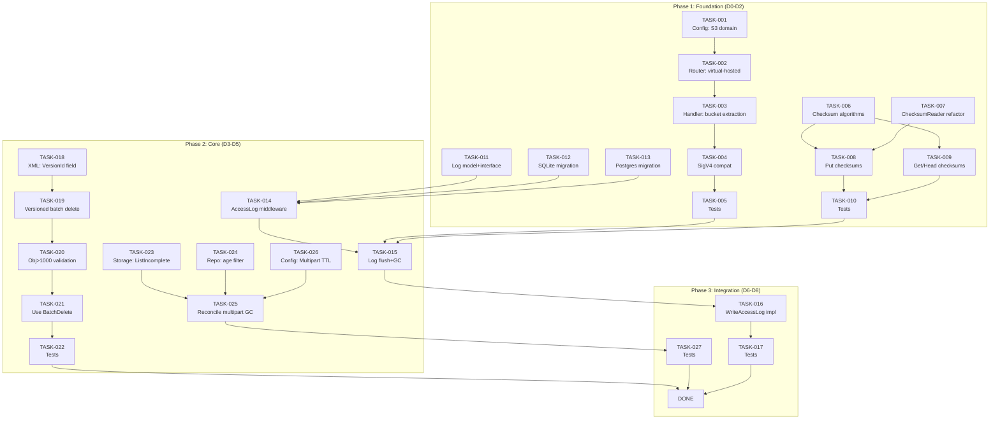

现在我已对整个代码库有了全面的了解，可以开始撰写 Tech Lead 分析了。

---

# Tech Lead 分析：S3 协议完备性与操作缺口

## 1. 任务分解

### 1.1 方向 1 — Virtual Hosted-Style（加载样式支持）

| 任务 ID | 标题 | 涉及文件 | 前置依赖 | 预估工时 | 验收标准 |
|---------|------|---------|---------|---------|---------|
| **TASK-001** | 配置项：S3 域名支持 | `internal/config/config_app.go` | 无 | 0.5h | `S3CompatConfig` 新增 `Domain string` 字段，零业务逻辑变更 |
| **TASK-002** | Router：虚拟托管式路由 | `internal/api/s3compat/router.go` | TASK-001 | 2h | `NewRouter` 在 `Domain != ""` 时注册 `r.Host("{bucket}."+domain)` 子路由，所有 object/bucket 操作转发至同一 Handler |
| **TASK-003** | Handler：bucket 名称提取统一 | `internal/api/s3compat/handler.go` | TASK-002 | 1h | `hostBucketOf(r)` 函数从 Host header 提取 bucket 名称；所有 handler 优先使用此函数，在 path-style 时回落至 `chi.URLParam` |
| **TASK-004** | sigv4：签名验证兼容 | `internal/api/s3compat/sigv4_test.go` | TASK-003 | 1.5h | SigV4 验证使用 `r.Host` 构造 Canonical URI；添加测试用例 |
| **TASK-005** | 测试覆盖 | `internal/api/s3compat/router_test.go`（新建）+ `handler_test.go` | TASK-002~004 | 2h | 虚拟托管式 GET/PUT/HEAD/DELETE 完整 e2e 测试；`make check` 全绿 |

> **注意**：方向 1 所有 handler 逻辑**复用**现有 path-style handler，仅路由层新增匹配入口。零 handler 业务逻辑重复。

### 1.2 方向 2 — Flexible Checksum（灵活校验和）

| 任务 ID | 标题 | 涉及文件 | 前置依赖 | 预估工时 | 验收标准 |
|---------|------|---------|---------|---------|---------|
| **TASK-006** | Checksum 类型定义与算法实现 | `internal/api/s3compat/checksum.go`（新建） | 无 | 2h | 支持 CRC32、CRC32C、SHA1、SHA256 四种算法；每个算法实现 `func([]byte) string` 返回 Base64；CRC32C 使用 `hash/crc32` IEEE 表 |
| **TASK-007** | md5WrapReader → ChecksumReader 重构 | `internal/service/file_crud.go` | TASK-006 | 2h | `md5WrapReader` 改为通用 `ChecksumReader`，支持多重 checksum 同时计算；不改变 `PutObject` 接口签名 |
| **TASK-008** | Handler：写入时支持 `x-amz-checksum-*` 请求头 | `internal/api/s3compat/handler.go`（PutObject） | TASK-006, TASK-007 | 2h | 读取 `x-amz-checksum-crc32`、`x-amz-checksum-crc32c`、`x-amz-checksum-sha1`、`x-amz-checksum-sha256`；校验；通过 `x-amz-checksum-algorithm` 响应 |
| **TASK-009** | Handler：读取/HEAD 时回显校验和 | `internal/api/s3compat/handler.go`（writeS3ObjectMeta） | TASK-006 | 1.5h | `writeS3ObjectMeta` 输出所有计算的 checksum header；`GetObject`/`HeadObject` 使用正确的响应头 |
| **TASK-010** | 测试覆盖 | `internal/api/s3compat/handler_test.go` | TASK-008, TASK-009 | 2h | 每种 checksum 算法 PUT→GET→校验 cycle 测试；非法 checksum → 400 测试；`make check` 全绿 |

### 1.3 方向 3 — Server Access Log（服务端访问日志）

| 任务 ID | 标题 | 涉及文件 | 前置依赖 | 预估工时 | 验收标准 |
|---------|------|---------|---------|---------|---------|
| **TASK-011** | AccessLogEntry 数据模型与写入策略 | `internal/repository/sql_buckets.go` + `internal/repository/repository.go` | 无 | 1h | 定义 `AccessLogEntry` 结构体；更新 `WriteAccessLog` 接口（移除 `userAgent`，增加 `bytesSent`, `objectSize`, `remoteIP`, `requestID`, `referer`）；添加 MERGE 到 `access_log` 表的 SQL |
| **TASK-012** | SQLite migration：access_log 表 | `internal/repository/migrations/sqlite/XXXX_access_log.up.sql` + `down.sql` | 无 | 0.5h | 表结构包含 S3 标准 20+ 字段；`migrate` 命令验证 |
| **TASK-013** | Postgres migration：access_log 表 | `internal/repository/migrations/postgres/XXXX_access_log.up.sql` + `down.sql` | TASK-012 | 0.5h | 与 SQLite schema 镜像；使用 `TIMESTAMPTZ` |
| **TASK-014** | AccessLog 数据收集中间件 | `internal/api/s3compat/accesslog.go`（新建） | TASK-011 | 2h | S3 handler 内嵌日志收集；记录 request method、key、status、latency、bytes sent；通过 channel 异步写入（非阻塞） |
| **TASK-015** | AccessLog 定时刷入与 GC | `internal/api/s3compat/accesslog.go` | TASK-014 | 2h | 后台 goroutine 每 5s 或缓冲区满 100 条后批量 INSERT；`access_log` 表按 TTL 定时清理（可配置保留天数） |
| **TASK-016** | Reconcile：写入目标桶的文件日志 | `internal/service/file_crud.go`（Delete → 事件） + `internal/repository/sql_buckets.go` | TASK-015 | 2h | `WriteAccessLog` 不再为空实现；以 `PUT /{targetBucket}/{prefix}/{sourceBucket}-{key}-{timestamp}` 方式写入目标桶（作为正式对象存储） |
| **TASK-017** | 测试覆盖 | `internal/api/s3compat/accesslog_test.go`（新建） + `internal/repository/sql_buckets_test.go` | TASK-014~016 | 2.5h | 启用日志的 bucket → 产生访问请求 → 目标桶出现日志对象；批量写入压力测试；GC 清理测试；`make check` 全绿 |

### 1.4 方向 4 — Multi-Object Delete 增量增强（原误判方向）

| 任务 ID | 标题 | 涉及文件 | 前置依赖 | 预估工时 | 验收标准 |
|---------|------|---------|---------|---------|---------|
| **TASK-018** | `deleteRequestObject` 增加 `VersionId` 字段 | `internal/api/s3compat/xml.go` | 无 | 0.5h | `deleteRequestObject` 增加 `VersionId string \`xml:"VersionId,omitempty"\``；兼容无 VersionId 的请求 |
| **TASK-019** | 版本化桶批量删除支持 | `internal/api/s3compat/extra.go` | TASK-018 | 1.5h | 当 `VersionId` 不为空时调用 `h.svc.DeleteVersion` 而非 `h.svc.Delete` |
| **TASK-020** | `Objects > 1000` 校验 | `internal/api/s3compat/extra.go` | TASK-019 | 0.5h | `len(in.Objects) > 1000` 时返回 `MalformedXML`（S3 标准限制） |
| **TASK-021** | 改用 `h.svc.BatchDelete` | `internal/api/s3compat/extra.go` | 无 | 0.5h | 替换 `for _, o := range in.Objects { h.svc.Delete(...) }` 为单次 `h.svc.BatchDelete` 调用 |
| **TASK-022** | 测试覆盖 | `internal/api/s3compat/handler_test.go` | TASK-019~021 | 2h | 批量删除 3 个对象（含不存在的 key）→ 响应含 `Deleted` 而无 error；`Objects > 1000` 拒绝；软删除模拟；`make check` 全绿 |

> **重要**：方向 4 是**增量增强**，并非全新实现。路由、数据模型、主处理链路均已上线。

### 1.5 方向 5 — Abandoned Multipart Upload GC（废弃分片上传清理）

| 任务 ID | 标题 | 涉及文件 | 前置依赖 | 预估工时 | 验收标准 |
|---------|------|---------|---------|---------|---------|
| **TASK-023** | Storage 接口：`ListIncompleteMultipart` | `internal/storage/storage.go` + 所有后端实现 | 无 | 2h | `ListIncompleteMultipart(ctx, tenant string) ([]MultipartUploadInfo, error)` 接口；Local 后端从 map 获取；S3/OSS/COS 后端调用 SDk ListMultipartUploads |
| **TASK-024** | Repository：年龄过滤的 `ListUploads` | `internal/repository/repository.go` + `sql_uploads.go` | 无 | 1h | `ListUploads` 新增可选的 `createdBefore` 参数；仅返回超过 N 小时的 upload |
| **TASK-025** | Reconcile：废弃分片清理 | `internal/reconcile/multipart.go`（新建） | TASK-023, TASK-024 | 2.5h | 新增 `AbandonedMultipartSweeper`，定时扫描过时的 upload（默认 >24h），AbortStorage + DeleteUpload；JobPool 注册 |
| **TASK-026** | Config：废弃分片 TTL 配置 | `internal/config/config_app.go` + `internal/reconcile/job.go` | TASK-025 | 0.5h | `ReconcileCfg.MultipartTTLHours`（默认 24）；`ReconcileCfg.MultipartCleanupEnabled`（默认 false） |
| **TASK-027** | 测试覆盖 | `internal/reconcile/multipart_test.go`（新建） | TASK-025, TASK-026 | 2.5h | 创建 upload → 修改时间戳超过 TTL → 触发 sweep → upload 消失；`make check` 全绿 |

---

## 2. 执行顺序

### 2.1 任务依赖图



### 2.2 可并行执行的任务组

| 并行组 | 任务 | 说明 |
|--------|------|------|
| **Group A** | TASK-001, TASK-006, TASK-011, TASK-012, TASK-013, TASK-018, TASK-023, TASK-024, TASK-026 | 纯"骨架"任务：配置定义、接口签名、迁移 SQL、XML 类型、算法库。**无业务逻辑，可完全并行** |
| **Group B** | TASK-002~004, TASK-007~009, TASK-014, TASK-019~021, TASK-025 | 核心逻辑实现。依赖 Group A，但方向间互不阻塞 |
| **Group C** | TASK-005, TASK-010, TASK-017, TASK-022, TASK-027 | 测试覆盖。全部可在实现任务完成后并行 |

---

## 3. 技术风险

### 3.1 🔴 高风险

| 风险 | 影响方向 | 描述 | 缓解策略 |
|------|---------|------|---------|
| **Storage 接口扩展** | 方向 5 | `ListIncompleteMultipart` 需要所有后端（Local、S3、OSS、COS、QStor）实现。S3 SDK 有 `ListMultipartUploads`，但分页逻辑不同；Local 后端当前仅内存 map（进程重启丢失） | TASK-023 预留充分的调试时间；Local 后端返回 `(nil, nil)` 表示"不支持从存储层扫描"；Repository 层的 `ListUploads`（带 age filter）作为主数据源，Storage 层的 `ListIncompleteMultipart` 仅用于交叉验证 |
| **传输层重构** | 方向 2 | `md5WrapReader` 被 `PutObject` 和多个事件路径深度耦合；替换为通用 `ChecksumReader` 可能引入回归 | TASK-007 采用 adapter 模式，保持原始 `md5WrapReader` 不删除，仅新增 `ChecksumReader` 切换使用；加粗验证 `file_crud_test.go` |
| **AccessLog 异步写入** | 方向 3 | 异步 channel + 批量刷入可能丢失最后一波日志（进程崩溃时） | 接受最终一致性；buffer 写入前先写 WAL 日志（或使用 `sync.Pool`）+ shutdown hook 确保 drain |

### 3.2 🟡 中风险

| 风险 | 影响方向 | 描述 | 缓解策略 |
|------|---------|------|---------|
| **SigV4 虚拟托管式签名** | 方向 1 | AWS SDK 客户端在虚拟托管式下对 `Host` header 的签名方式不同 | TASK-004 需要阅读 AWS SigV4 规范中 `Canonical URI`（虚拟托管式 = `/{key}` vs 路径式 = `/{bucket}/{key}`）；添加 `MakeNext`/`InvalidSignature` 测试用例 |
| **版本化桶批量删除** | 方向 4 | `DeleteVersion` 可能尚未暴露在 `FileService` 中 | 前置确认：`h.svc.Delete` 第三个参数是 `hard bool`；若当前不支持版本化删除，需先添加 `h.svc.DeleteVersion(ctx, tenant, bucket, key, versionID string) error` |
| **Reconcile 同步锁** | 方向 5 | 分布式环境多个 Reconcile 实例争抢扫描废弃分片 | 复用已有的 `cluster.Singleton` 租约机制；非集群模式（SQLite）无竞争 |

### 3.3 🟢 低风险

- **Obejcts > 1000 校验**（TASK-020）：纯业务逻辑变更，无外部依赖
- **BatchDelete 替换**（TASK-021）：`h.svc.BatchDelete` 已存在且对 `ErrNotFound` 视为成功
- **XML 数据模型扩展**（TASK-018）：兼容向后——空 `VersionId` 等同于当前行为

---

## 4. 资源评估

### 4.1 人员配置

| 角色 | 技能要求 | 人数 | 覆盖方向 |
|------|---------|------|---------|
| **Senior Go Developer A** | Go、chi router、HTTP 协议、SigV4 | 1 | 方向 1（虚拟托管式）+ 方向 4（批量删除增强） |
| **Senior Go Developer B** | Go、存储接口设计、checksum 算法、S3 响应格式 | 1 | 方向 2（灵活校验和）+ 方向 5（废弃分片清理） |
| **Mid-level Go Developer** | Go、SQL（SQLite+Postgres）、异步写入模式 | 1 | 方向 3（访问日志） |
| **QA Engineer** | 集成测试、Docker、`make check` | 1（兼职） | 所有方向测试验收 |

> **建议**：团队 2 名 Senior + 1 名 Mid 即可在 **2 个 Sprint（10 个工作日）** 内完成。QA 可在实现中期介入。

### 4.2 关键里程碑

| 里程碑 | 时间 | 验收事件 |
|--------|------|---------|
| M1：骨架冻结 | D2 下班 | 所有 Group A 任务（TASK-001, 006, 011, 012, 013, 018, 023, 024, 026）合并至 main |
| M2：核心功能冻结 | D6 下班 | 所有 Group B 任务（TASK-002~004, 007~009, 014, 019~021, 025）合并至 main；通过本地 `make check` |
| M3：测试逆关 | D8 下班 | 所有 Group C 任务（TASK-005, 010, 017, 022, 027）合并；CI gate 全绿 |
| M4：发布 | D10 下班 | 最终 CR、集成测试 runbook、OpenAPI 更新、文档更新、`make check` + `make test-integration` 双绿 |

### 4.3 阻塞点（Blockers）

| ID | 阻塞 | 涉及任务 | 解决策略 |
|----|------|---------|---------|
| B1 | S3 后端 `ListMultipartUploads` 不熟悉 | TASK-023 | 优先实现对 Local 后端的支持；S3/OSS/COS 后端标为 `NotImplemented`，写入日志不阻断主流程；Post-MVP 补齐 |
| B2 | SigV4 虚拟托管式签名测试需要 AWS SDK 环境 | TASK-004 | 使用 `awssdk-go-v2` 的 `presign` 包生成 URI 并验证；若需真实端点，在 `integration` build tag 下运行 |
| B3 | `h.svc.DeleteVersion` 可能不存在 | TASK-019 | 前置探查：`grep -rn "func.*DeleteVersion\|func.*Delete.*Version" internal/service/`；若不存在，新增 `DeleteVersion` 方法（另估 1h） |

---

## 5. 质量保证

### 5.1 单元测试覆盖要求

| 方向 | 文件 | 新增测试函数 | 覆盖路径 |
|------|------|------------|---------|
| 1 | `router_test.go`（新建） | `TestVirtualHostedRouting` | 所有 HTTP 方法；`Domain` 启用/禁用；bucket 名含 `.` |
| 1 | `handler_test.go` | `TestHostBucketExtraction` | 虚拟托管式 vs 路径式；Host header 格式错误 |
| 2 | `checksum_test.go`（新建） | `TestChecksumAlgorithms` | CRC32/CRC32C/SHA1/SHA256 的正确性；空内容；大文件 |
| 2 | `handler_test.go` | `TestFlexibleChecksumPutGet` | 每种算法的 cycle；非法 checksum → 400 |
| 3 | `accesslog_test.go`（新建） | `TestLogCollection` / `TestBatchFlush` / `TestLogFileWrite` | 日志条目完整性；缓冲区满 → 刷新；进程关闭 → drain |
| 4 | `handler_test.go` | `TestBatchDeleteVersioned` / `TestBatchDeleteOver1000` | 版本化桶单次删除；拒绝 >1000 对象 |
| 5 | `multipart_test.go`（新建） | `TestAgeFilteredListUploads` / `TestSweepAbandonedUpload` | TTL 前不删除；TTL 后删除；Storage + Repository 双清理 |

### 5.2 集成测试策略

| 场景 | 工具 | 运行时机 | 通过标准 |
|------|------|---------|---------|
| 虚拟托管式 e2e | `httptest` + 自定义 DNS resolver | `make test` | curl/mc/aws-cli 均可通过虚拟托管式地址访问 |
| S3 Access Log 完整链路 | Docker Compose（Postgres） | `make test-integration` | 目标桶确认出现日志对象 |
| 废弃分片清理 | `make test-integration` | `make test-integration` | TTL 过期 upload 被清除；不过期的保留 |
| SigV4 签名兼容 | `awssdk-go-v2` / `aws-cli` | 手动（pre-release） | `aws s3 ls --endpoint-url ...` + virtual hosted = 200 |

### 5.3 代码审查要点

| 审查点 | 重点文件 | 聚焦问题 |
|--------|---------|---------|
| **路由不侵入 handler** | `router.go` | 虚拟托管式路由应**纯路由层**，不修改 handler 签名或行为 |
| **Checksum 向后兼容** | `file_crud.go` | `md5WrapReader` 删除前确认所有调用方已迁移；旧 blob 无 extra checksum → GET 不 panic |
| **AccessLog 不阻塞请求** | `accesslog.go` | 日志写入是 `go func()` + channel；同步路径零阻塞 |
| **BatchDelete 语义** | `extra.go` | 替换后确认 `ErrNotFound` → `Deleted`（而非 error）；不影响现有调用方 |
| **废弃分片容错** | `reconcile/multipart.go` | `AbortMultipart` 失败 → warn log + 标记 + 跳过；不阻塞其他 sweep |

### 5.4 性能测试需求

| 场景 | 压测参数 | 预期目标 | 验证方式 |
|------|---------|---------|---------|
| 批量删除 1000 对象 | 1000 keys / 请求 | < 200ms P95 | `wrk` 或 `hey` |
| AccessLog 并发写入 | 1000 req/s | 日志写入不增加 P99 延迟 > 5ms | profile 火焰图 |
| 废弃分片扫描 10000 条 | 10000 uploads | < 500ms 全量扫描 | ppof trace |

---

## 6. 实施计划

### 总体时间：10 个工作日（2 Sprint × 5 天）

```mermaid
gantt
    title S3 协议完备性实施计划 (v1.14)
    dateFormat  YYYY-MM-DD
    axisFormat  %a

    section Sprint 1 — Foundation
    TASK-001 Config domain            :a1, 2026-07-14, 0.5d
    TASK-006 Checksum algorithms      :a2, 0.5d
    TASK-011 Log model+interface      :a3, 1d
    TASK-012 SQLite migration         :a4, 0.5d
    TASK-013 Postgres migration       :a5, 0.5d
    TASK-018 XML VersionId field      :a6, 0.5d
    TASK-023 Storage ListIncomplete   :a7, 1.5d
    TASK-024 Repo age filter          :a8, 1d
    TASK-026 Config Multipart TTL     :a9, 0.5d

    TASK-002 Router virtual-hosted   :b1, after a1, 1.5d
    TASK-003 Handler bucket extract   :b2, after b1, 1d
    TASK-007 ChecksumReader refactor  :b3, after a2, 1.5d
    TASK-008 Put checksums            :b4, after a2 b3, 1.5d
    TASK-009 Get/Head checksums       :b5, after a2, 1d
    TASK-014 AccessLog middleware     :b6, after a3 a4 a5, 2d
    TASK-019 Versioned batch delete   :b7, after a6, 1d

    section Sprint 2 — Core + Test
    TASK-004 SigV4 compat             :c1, after b1 b2, 1d
    TASK-005 VHost tests              :c2, after c1, 1.5d
    TASK-010 Checksum tests           :c3, after b4 b5, 1.5d
    TASK-015 Log flush+GC             :c4, after b6, 1.5d
    TASK-016 WriteAccessLog impl      :c5, after c4, 1.5d
    TASK-017 AccessLog tests          :c6, after c5, 2d
    TASK-020 Obj>1000 validation      :c7, after b7, 0.5d
    TASK-021 Use BatchDelete          :c8, after b7, 0.5d
    TASK-022 BatchDelete tests        :c9, after c7 c8, 1.5d
    TASK-025 Reconcile multipart GC   :c10, after a7 a8 a9, 2d
    TASK-027 Multipart GC tests       :c11, after c10, 2d
```

### Sprint 1 详细日程（D1~D5）

| 天 | Senior A (方向 1+4) | Senior B (方向 2+5) | Mid (方向 3) |
|----|---------------------|--------------------|-------------|
| D1 | TASK-001 + TASK-018 | TASK-006 + TASK-023 | TASK-011 + TASK-012 + TASK-013 |
| D2 | TASK-002 | TASK-007 + TASK-024 + TASK-026 | TASK-014（开始） |
| D3 | TASK-003 + TASK-019 | TASK-008 | TASK-014（完成） |
| D4 | TASK-004 + TASK-020 | TASK-009 + TASK-025 | TASK-015 |
| D5 | TASK-021 + 代码审查 | TASK-025（继续）+ 代码审查 | TASK-015（完成）+ 代码审查 |

### Sprint 2 详细日程（D6~D10）

| 天 | Senior A | Senior B | Mid | QA |
|----|----------|---------|-----|-----|
| D6 | TASK-005（hander 部分） | TASK-022 | TASK-016 | 编写集成测试场景 |
| D7 | TASK-005（router+e2e） | TASK-027 | TASK-017 | 运行 e2e 集成测试 |
| D8 | 修复缺陷 | 修复缺陷 | 修复缺陷 | `make check` + `make test-integration` 全绿 |
| D9 | CR 最终轮 + OpenAPI 更新 | CR 最终轮 + 文档更新 | CR 最终轮 + Runbook | 回归测试 |
| D10 | 发布签收 | 发布签收 | 发布签收 | 签收报告 |

---

## 7. 总结建议

### 7.1 优先级调整

1. **立即执行**（P0）：方向 4 增量增强（TASK-018~022）—— 成本最低（4 人·天），修复验证报告中最大的误判
2. **高价值**（P1）：方向 1 虚拟托管式（TASK-001~005）—— AWS SDK 生态兼容必备，与方向 4 无依赖冲突，可并行
3. **稳健补齐**（P2）：方向 5 废弃分片 GC（TASK-023~027）—— 长期运营稳定性，存储成本控制
4. **按需启动**（P3）：方向 2（TASK-006~010）+ 方向 3（TASK-011~017）—— 面向特定客户场景；若季度内无客户需求，可延期

### 7.2 关键交付物清单

| 交付物 | 负责人 | 截止 |
|--------|-------|------|
| 5 个方向全部 `make check` 全绿 | 全体 | D10 |
| OpenAPI 描述更新（S3 新能力） | Senior A | D9 |
| S3 Access Log 运维 Runbook | Mid | D9 |
| `deploy/grafana/` 面板新增废弃分片指标 | Senior B | D10 |
| 方向 4 误判修复 PR（优先合并） | Senior A | D3 |

### 7.3 一句话总结

> **方向 4（Multi-Object Delete）不是新鲜事，而是 3 处增量修复；方向 1 和 5 是 AWS SDK 生态兼容和运维刚需；方向 2 和 3 按需启动，避免提前复杂度膨胀。**
