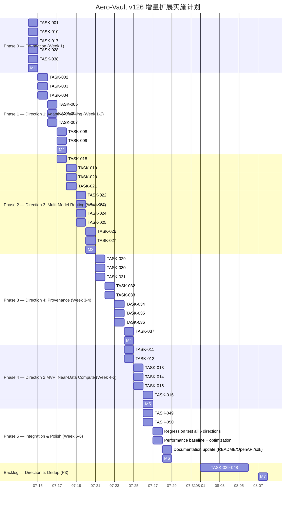

现在我已掌握完整的代码库上下文和两个需求文档。接下来以 Tech Lead 视角进行深入分析。

---

# Tech Lead 分析报告：AI 原生管线断层、近数据计算与数据血缘

> **基准版本：** v126 · **代码库：** `github.com/aero-vault/aero-vault`  
> **分析范围：** 5 个扩展方向 · 48 项可执行任务 · 跨方向依赖已验证

---

## 1. 任务分解（48 项可执行任务）

### 方向一：自适应分块策略引擎（P0 · MVP 3-5 天）

| 任务 ID | 标题 | 前置 | 工时 | 涉及文件 | 验收标准 |
|---------|------|------|------|---------|---------|
| **TASK-001** | 定义 `ChunkStrategy` 接口与 `ChunkOptions` 结构体 | — | 3h | `internal/ai/chunker.go`（新建 + 重命名） | `ChunkStrategy` 接口含 `Name() string` + `Chunk(text string, opts ChunkOptions) []string`；`ChunkOptions` 携带 ContentType、metadata map；编译通过 |
| **TASK-002** | 重构 `Chunker` → `SlidingWindowStrategy` | TASK-001 | 2h | `internal/ai/chunker.go` | 现有 `Chunker` 结构体重命名为 `SlidingWindowStrategy`，实现 `ChunkStrategy` 接口；全部既有测试通过 |
| **TASK-003** | 实现 `SentenceWindowStrategy` | TASK-001 | 4h | `internal/ai/chunker_sentence.go`（新建） | 按句号/问号/感叹号 + 换行分割；单 chunk 不超过 window（默认 600 字符）；过小 chunk（<50 字符）合并到前一个；单元测试覆盖 sentence 边界、CJK 文本、空输入 |
| **TASK-004** | 实现 `RecursiveCharacterStrategy` | TASK-001 | 4h | `internal/ai/chunker_recursive.go`（新建） | 按 `\n\n → \n → . → 字符` 优先级递归分割；JSON/XML 保留顶层结构；单元测试覆盖代码片段、JSON 块、嵌套 Markdown |
| **TASK-005** | 构建 `ChunkPipeline` 与 ContentType 路由 | TASK-001 | 3h | `internal/ai/chunker_pipeline.go`（新建） | Pipeline 根据 content-type 映射选择策略（`text/plain→SentenceWindow`, `application/json→SlidingWindow(Window=200)`, 未知→`SlidingWindow(600)`）；fallback 链工作 |
| **TASK-006** | 将 ContentType 从 Extractor 透传到 Indexer → Pipeline | TASK-005 | 3h | `internal/ai/indexer.go`, `internal/ai/extractor.go` | `Indexer.IndexObjectByID` 从 `obj.ContentType` 读取类型并传入 Pipeline；`Extractor.Extract` 保持返回 `string` 但增加 `ContentType` 透传路径 |
| **TASK-007** | 增加策略选择 Telemetry | TASK-005 | 2h | `internal/ai/indexer.go`, `internal/telemetry/` | 新增 `indexer_chunk_strategy_total{strategy}` counter；skip 原因增加 `strategy_unavailable` |
| **TASK-008** | 单元测试：各策略边界条件 | TASK-002, TASK-003, TASK-004 | 3h | `internal/ai/chunker_test.go` + 新测试文件 | 覆盖：空白文档、超短文本、纯符号内容、超长单行、CJK 混排；策略切换回滚正确；覆盖率 >85% |
| **TASK-009** | 集成测试：Pipeline 按 ContentType 路由 | TASK-006 | 2h | `internal/ai/integration_test.go` | 数据库 + local store 环境；上传 JSON → 预期使用 SlidingWindow；上传散文 → 预期使用 SentenceWindow；切换后 chunk 数差异可验证 |

**方向一工时小计：** 26h（约 3.5 人天）

---

### 方向二：近数据计算（P2 · MVP 多目标 Webhook 2 天；全方案 3-4 周）

| 任务 ID | 标题 | 前置 | 工时 | 涉及文件 | 验收标准 |
|---------|------|------|------|---------|---------|
| **TASK-010** | 重构 `NotificationRule` → 支持多规则存储 | — | 4h | `internal/repository/repository.go`, `migrations/{sqlite,postgres}/` | 新增 `notification_rules` 表（ID, tenant, bucket, events, filter, target_url, target_type, created_at）；迁移文件双格式就绪 |
| **TASK-011** | Admin API：触发器规则 CRUD | TASK-010 | 4h | `internal/api/rest/admin.go`, `internal/api/rest/router.go` | `POST/GET/DELETE /v1/admin/notification-rules`；scope `admin` 保护；单元测试覆盖 CRUD 完整路径 |
| **TASK-012** | 事件路由引擎：匹配规则实现 | TASK-010 | 4h | `internal/events/router.go`（新建） | 按 `(tenant, bucket, event_type, key_prefix, key_suffix)` 匹配；支持通配符；首个匹配命中；规则无匹配时静默跳过 |
| **TASK-013** | Webhook 扇出引擎（复用 `internal/events/webhook.go`） | TASK-012 | 3h | `internal/events/fanout.go`（新建） | 匹配到 N 条规则 → 扇出 N 个 webhook POST；各 webhook 独立重试/backoff；沿用 HMAC-SHA256 签名；`webhook_failures` 表记录独立失败 |
| **TASK-014** | 触发器去重守卫 | TASK-012 | 3h | `internal/events/bus.go`, `internal/service/file_crud.go` | 每次触发生成 `X-Aero-Trigger-Id: {objectID}:{eventType}:{timestamp}`；事件处理上下文检测同源触发 → 跳过；单元测试覆盖递归场景 |
| **TASK-015** | 单元测试：事件路由与扇出 | TASK-012, TASK-013, TASK-014 | 3h | `internal/events/*_test.go` | 覆盖：规则精确匹配、通配符、多规则命中、扇出失败隔离、去重守卫防止无限循环 |
| **TASK-016** | 集成测试：端到端触发器流程 | TASK-011, TASK-013 | 3h | `test/integration/` | PUT 对象 → 事件持久化 → 规则匹配 → webhook POST（mock 目标）→ 记录成功/失败；去重守卫阻止二次触发 |

**方向二 MVP 工时小计：** 24h（约 3 人天）— 仅 Webhook 扇出 + 去重守卫  
**全方案（含 Wasm/gRPC 侧车）：** 额外 +80h，推进到 P2 阶段评估

---

### 方向三：多模型路由网关（P1 · MVP 5-7 天）

| 任务 ID | 标题 | 前置 | 工时 | 涉及文件 | 验收标准 |
|---------|------|------|------|---------|---------|
| **TASK-017** | 定义 `ModelRouter`, `ModelEndpoint`, `RoutingRule` 结构体 | — | 3h | `internal/ai/router.go`（新建） | `RoutingRule` 含 `Matcher func(ctx, ModelRequest) bool` + `Endpoint ModelEndpoint`；`ModelEndpoint` 含 Name, Provider, Model, Endpoint, APIKey, Priority, Dimensions |
| **TASK-018** | 配置层：多模型配置支持 | TASK-017 | 3h | `internal/config/config_ai.go` | 新增 `AIConfig.ModelRoutes []ModelRoute`；环境变量格式 `AI_ROUTE_0_MATCHER=tenant:enterprise&AI_ROUTE_0_PROVIDER=openai&AI_ROUTE_0_MODEL=gpt-4`；向后兼容单模型配置 |
| **TASK-019** | 实现 TenantTier 路由维度 | TASK-017, TASK-018 | 4h | `internal/ai/router.go` | 根据 `mw.TenantFrom(ctx)` → `repo.GetTenantRecord(ctx, tenant)` → `.Plan` 匹配路由规则；默认 fallback 规则存在；单元测试覆盖企业/免费/未知租户 |
| **TASK-020** | 构建 `RouterLLM` 包装器（实现 `ai.LLM` 接口） | TASK-019 | 3h | `internal/ai/router_llm.go`（新建） | `RouterLLM.Chat(ctx, req)` → 路由选择 → 委派到对应 `LLM`；`ChatStream` 同样路由；选取 1s 内完成 |
| **TASK-021** | 构建 `RouterEmbedder` 包装器（实现 `ai.Embedder` 接口） | TASK-019 | 3h | `internal/ai/router_embedder.go`（新建） | `RouterEmbedder.Embed(ctx, texts)` → 路由选择 → 委派；`Name()` 返回当前路由的模型名；`Dimensions()` 同理 |
| **TASK-022** | 更新 `Search` 使用 `RouterEmbedder` | TASK-021 | 2h | `internal/ai/search.go` | `Search.embedder` 可接受 `RouterEmbedder`；`searchVector` 获取 `embedder.Name()` 时返回当前路由模型；嵌入模型切换不 panic |
| **TASK-023** | 更新 `Chat` 使用 `RouterLLM` | TASK-020 | 2h | `internal/ai/chat.go` | `Chat.llm` 可接受 `RouterLLM`；`Answer` / `AnswerStream` 走路由逻辑 |
| **TASK-024** | 按模型端点的成本追踪 | TASK-019 | 2h | `internal/ai/cost.go` | 路由层在每个 token 使用量后按 `ModelEndpoint.Name` 记录费用；拆分 `Usage.Model` 字段精度到端点级别 |
| **TASK-025** | 更新 `resultCache` key 含模型名 | TASK-022 | 1h | `internal/ai/result_cache.go` | `resultCacheKey` 增加 `embed_model` 字段；不同模型同一查询缓存隔离 |
| **TASK-026** | 单元测试：路由逻辑完整路径 | TASK-019, TASK-020, TASK-021, TASK-022 | 4h | `internal/ai/router_test.go`（新建） | 覆盖：matcher 匹配优先级、fallback 链（主故障→备→mock）、无匹配→默认、A/B 影子模式（路由1命中率 10% 与路由2 90%） |
| **TASK-027** | 集成测试：多模型端到端 | TASK-023 | 3h | `internal/ai/integration_test.go` | mock 双 Embedder + 双 LLM；按 tenant 路由到不同模型；验证 Search 和 Chat 走正确路径 |

**方向三工时小计：** 30h（约 4 人天）

---

### 方向四：数据血缘与溯源图（P2 · MVP 7-10 天）

| 任务 ID | 标题 | 前置 | 工时 | 涉及文件 | 验收标准 |
|---------|------|------|------|---------|---------|
| **TASK-028** | 定义 `ProvenanceEvent` 结构体 + 迁移文件 | — | 3h | `internal/repository/repository.go`, `migrations/` | `provenance_events` 表含 ID, source_id, target_id, target_type, relation_type, transform_op, params(JSON), actor, tenant_id, created_at；索引 `(source_id)`, `(target_id)`；双格式迁移 |
| **TASK-029** | Repository 方法：`InsertProvenance`, `ListProvenanceForObject`, `ListProvenanceBySource` | TASK-028 | 4h | `internal/repository/sql_provenance.go`（新建） | `InsertProvenance` 事务内插入；`ListProvenanceForObject` 支持 `maxDepth` 参数（默认 2）；`ListProvenanceBySource` 影响分析查询；绑定参数遵守 I1 规则 |
| **TASK-030** | 接入点：`FileService.Put` → `original_upload` 血缘 | TASK-029 | 2h | `internal/service/file_crud.go` | 新上传对象时插入根节点 `ProvenanceEvent{RelationType: "original_upload", Actor: "user:{caller}"}`；非阻塞（失败 warn log 不阻断上传） |
| **TASK-031** | 接入点：`FileService.CopyObject` → `copied_from` 血缘 | TASK-029 | 2h | `internal/service/file_crud.go` | Copy 操作记录 `RelationType: "copied_from"`，`SourceID` 为源对象 ID |
| **TASK-032** | 接入点：`Indexer.IndexObjectByID` → `chunked_from` 血缘 | TASK-029 | 3h | `internal/ai/indexer.go` | 分块后批量插入 N 条 `RelationType: "chunked_from"`（TargetType="chunk", TargetID=chunk.ID）；嵌入后插入 `RelationType: "embedded_from"`（嵌入向量作为 chunk 属性不做独立节点） |
| **TASK-033** | 查询 API：`GET /v1/lineage/provenance/{objectID}` | TASK-029 | 3h | `internal/api/rest/search.go` | 返回上下 2 层血缘图（ancestors + descendants）；JSON 含 `direction: "upstream"|"downstream"` 和 `edges []ProvenanceEvent` |
| **TASK-034** | 血缘深度/扩散保护 | TASK-033 | 2h | `internal/api/rest/search.go` | `max_depth` 查询参数（默认 2，最大 5）；`max_edges` 参数（默认 100）；超限截断 + 响应中包含 `truncated: true` |
| **TASK-035** | 软删除改造：chunk delete 不删除 provenance | TASK-032 | 2h | `internal/ai/indexer.go`, `repository/sql_chunks.go` | `DeleteChunksForObject` 不再硬删除 chunk 行（改为 `deleted_at` 标记）；provenance 行永久保留；新迁移为 chunks 表加 `deleted_at` 列 |
| **TASK-036** | 单元测试：血缘 CRUD 和查询 | TASK-029, TASK-030, TASK-031, TASK-032 | 4h | `internal/repository/sql_provenance_test.go`（新建） | 覆盖：插入 + 查询上下游、深度限制、truncated 行为、影响分析（by source） |
| **TASK-037** | 集成测试：全链路血缘追踪 | TASK-033, TASK-035 | 3h | `test/integration/provenance_test.go`（新建） | 完整链：PUT → extract → chunk → embed → search，每步插入血缘；查询影响分析确认引用正确 |

**方向四工时小计：** 28h（约 3.5 人天）

---

### 方向五：近似重复检测与内容指纹（P3 · 4-6 周）

| 任务 ID | 标题 | 前置 | 工时 | 涉及文件 | 验收标准 |
|---------|------|------|------|---------|---------|
| **TASK-038** | Storage.Put 路径计算 SHA256 | — | 3h | `internal/storage/local_write.go` | `Put` 时计算 blob SHA256；写入 `{storageKey}.sha256` 侧边文件；`Stat` 返回中增加 `ContentHash` 字段 |
| **TASK-039** | 对象表增加 `content_hash` 列 + 索引 | TASK-038 | 3h | `internal/repository/repository.go`, `migrations/` | `content_hash TEXT` + 唯一索引（tenant, bucket, content_hash）；`ref_count INTEGER DEFAULT 1`；双格式迁移 |
| **TASK-040** | 引用计数实现：`IncrementRefCount`, `DecrementRefCount` | TASK-039 | 4h | `internal/repository/sql_objects.go` | `IncrementRefCount` 在事务内 +1；`DecrementRefCount` 返回新 ref_count（0 时允许物理删除）；事务隔离 I1 |
| **TASK-041** | SHA256 精确去重：Put 路径改造 | TASK-039, TASK-040 | 4h | `internal/service/file_crud.go` | `Put` 计算 SHA256 → 查 `content_hash_idx` → 命中时引用计数 +1 不写 blob；未命中时正常写入 + 新引用；版本化桶跳过 |
| **TASK-042** | SimHash 近似文本指纹实现 | TASK-038 | 4h | `internal/ai/simhash.go`（新建） | 64-bit SimHash 实现；海明距离计算；距离阈值可配置（默认 3）；单元测试覆盖微小差异（空格、同义词、重排） |
| **TASK-043** | 搜索结果多样性（MMR 排序） | TASK-042 | 4h | `internal/ai/search.go` | `Search.Query` 返回后根据 `content_hash` 做最大边界相关性（MMR）重排序；lambda=0.5 平衡相关性与多样性；可配置 `AI_SEARCH_DIVERSITY` |
| **TASK-044** | 加密对象 / SSE 对象跳过 | TASK-041 | 1h | `internal/service/file_crud.go` | SSE-C/KMS 对象标记 `dedup_eligible=false`；存储 key 检查 `ContentMD5` 缺失时跳过（兼容客户端未传 MD5） |
| **TASK-045** | 并发上传一致性：唯一约束 + 唯一索引 | TASK-039, TASK-041 | 2h | `repository/sql_objects.go` | `content_hash` 唯一约束 + `INSERT ... ON CONFLICT DO NOTHING` 安全路径；并发写入分先后不产生 duplicate |
| **TASK-046** | GC 引用清理：ref_count=0 时物理删除 | TASK-040 | 2h | `internal/reconcile/scrub.go` | Reconcile 轮询 `ref_count=0 AND deleted_at` 对象；物理删除 storage blob + chunk 行；避免孤儿数据 |
| **TASK-047** | 单元测试：去重全路径 | TASK-041, TASK-042, TASK-043 | 4h | `internal/ai/search_dedup_test.go`, `internal/service/file_dedup_test.go` | 覆盖：精确去重（相同文件）、近似去重（SimHash 阈值）、加密跳过、版本化跳过、并发竞争 |
| **TASK-048** | 性能/压力测试：去重路径 | TASK-041, TASK-045 | 4h | `test/perf/dedup_test.go`（新建） | 10K 文件并行上传；验证去重率 >90%；验证吞吐量不退化（<5% 增加）；监控锁竞争 |

**方向五工时小计：** 35h（约 4.5 人天）— 仅 SHA256 精确去重 + SimHash + MMR

---

### 跨方向依赖任务

| 任务 ID | 标题 | 前置 | 工时 | 涉及文件 | 验收标准 |
|---------|------|------|------|---------|---------|
| **TASK-049** | 向量索引增加 `embed_model` 标签（方向三 → 方向四 桥梁） | TASK-021, TASK-028 | 2h | `internal/repository/repository.go`, `internal/ai/vectorindex.go` | `Chunk.EmbedModel` 字段已存在但搜索时模型过滤不够严格；PR 确保 `searchVector` 的模型过滤从 warn log 升级为强制过滤；provenance 记录 `embed_model` |
| **TASK-050** | `resultCache` 更新 key 增加 `embed_model`（防止模型换后缓存污染） | TASK-025 | 1h | `internal/ai/result_cache.go` | 集成方向三 TASK-025 工作，合并入主线 |

**跨方向工时小计：** 3h

---

### 全部任务汇总

| 方向 | 任务数 | 总工时 | 人天（6h/天） | 建议优先级 |
|------|--------|--------|-------------|----------|
| 方向一 · 自适应分块 | 9 | 26h | 4.3 | P0 |
| 方向二 · 近数据计算（MVP） | 7 | 24h | 4.0 | P2 |
| 方向三 · 多模型路由 | 11 | 30h | 5.0 | P1 |
| 方向四 · 数据血缘 | 10 | 28h | 4.7 | P2 |
| 方向五 · 近似去重 | 11 | 35h | 5.8 | P3 |
| 跨方向桥梁 | 2 | 3h | 0.5 | — |
| **合计** | **50** | **146h** | **24.3 人天** | — |

---

## 2. 执行顺序与任务依赖图

```mermaid
graph TD
    %% ============ Phase 0: Foundation ============
    subgraph Phase0["Phase 0: Foundation (Week 1)"]
        T001["TASK-001: ChunkStrategy interface"]
        T010["TASK-010: NotificationRule multi-rule store"]
        T017["TASK-017: ModelRouter/Endpoint/Rule types"]
        T028["TASK-028: ProvenanceEvent struct + migration"]
        T038["TASK-038: Storage SHA256 calculation"]
    end

    %% ============ Phase 1: Direction 1 (P0) ============
    subgraph Phase1["Phase 1: Adaptive Chunking (Week 1-2)"]
        T001 --> T002["TASK-002: SlidingWindowStrategy"]
        T001 --> T003["TASK-003: SentenceWindowStrategy"]
        T001 --> T004["TASK-004: RecursiveCharacterStrategy"]
        T002 --> T005["TASK-005: ChunkPipeline + content-type router"]
        T003 --> T005
        T004 --> T005
        T005 --> T006["TASK-006: Wire content-type through Indexer"]
        T005 --> T007["TASK-007: Strategy telemetry"]
        T006 --> T008["TASK-008: Unit tests strategies"]
        T006 --> T009["TASK-009: Integration test routing"]
    end

    %% ============ Phase 2: Direction 3 (P1) ============
    subgraph Phase2["Phase 2: Multi-Model Routing (Week 2-3)"]
        T017 --> T018["TASK-018: Multi-model config"]
        T017 --> T019["TASK-019: TenantTier router"]
        T018 --> T019
        T019 --> T020["TASK-020: RouterLLM wrapper"]
        T019 --> T021["TASK-021: RouterEmbedder wrapper"]
        T020 --> T023["TASK-023: Update Chat"]
        T021 --> T022["TASK-022: Update Search"]
        T022 --> T025["TASK-025: Cache key model isolation"]
        T019 --> T024["TASK-024: Cost tracking per endpoint"]
        T021 --> T049["TASK-049: Embed model strict filtering"]
        T022 --> T026["TASK-026: Unit tests routing logic"]
        T023 --> T027["TASK-027: Integration test multi-model"]
    end

    %% ============ Phase 3: Direction 4 (P2) ============
    subgraph Phase3["Phase 3: Data Provenance (Week 3-4)"]
        T028 --> T029["TASK-029: Repository provenance methods"]
        T029 --> T030["TASK-030: FileService.Put → original_upload"]
        T029 --> T031["TASK-031: CopyObject → copied_from"]
        T029 --> T032["TASK-032: Indexer → chunked_from/embedded_from"]
        T029 --> T033["TASK-033: GET /v1/lineage/provenance/{id}"]
        T033 --> T034["TASK-034: Depth/sprawl protection"]
        T032 --> T035["TASK-035: Soft-delete chunks (provenance retention)"]
        T029 --> T036["TASK-036: Unit tests provenance"]
        T033 --> T037["TASK-037: Integration test full lineage chain"]
    end

    %% ============ Phase 4: Direction 2 MVP (P2) ============
    subgraph Phase4["Phase 4: Near-Data Compute MVP (Week 4-5)"]
        T010 --> T011["TASK-011: Admin API trigger rules CRUD"]
        T010 --> T012["TASK-012: Event routing engine"]
        T012 --> T013["TASK-013: Webhook fan-out engine"]
        T012 --> T014["TASK-014: Trigger de-dup guard"]
        T012 --> T015["TASK-015: Unit tests routing"]
        T011 --> T016["TASK-016: Integration test E2E trigger"]
    end

    %% ============ Phase 5: Direction 5 (P3 Backlog) ============
    subgraph Phase5["Phase 5: Near-Duplicate Detection (P3 Backlog)"]
        T038 --> T039["TASK-039: content_hash column + index"]
        T039 --> T040["TASK-040: Ref counting logic"]
        T039 --> T041["TASK-041: SHA256 dedup at Put"]
        T041 --> T044["TASK-044: Encrypted object skip"]
        T041 --> T045["TASK-045: Concurrent upload consistency"]
        T038 --> T042["TASK-042: SimHash fingerprint"]
        T042 --> T043["TASK-043: Search diversity MMR"]
        T040 --> T046["TASK-046: GC ref counting cleanup"]
        T041 --> T047["TASK-047: Unit tests dedup"]
        T043 --> T048["TASK-048: Performance/load test"]
    end

    %% ============ Cross-phase edges ============
    T006 -.- T032["(chunk ID stability → provenance quality)"]
    T021 -.- T049["(embed model → provenance record)"]
    T025 -.- T050["TASK-050: resultCache embed_model key (merged)"]
```

### 可并行执行的任务组

| 并行组 | 任务 | 阶段 | 条件 |
|--------|------|------|------|
| **Group A** | TASK-001, TASK-010, TASK-017, TASK-028, TASK-038 | Phase 0 | 无互斥文件，可 3 人并行 |
| **Group B** | TASK-002, TASK-003, TASK-004 | Phase 1 | 仅依赖 TASK-001，可 2 人并行 |
| **Group C** | TASK-020+TASK-023, TASK-021+TASK-022 | Phase 2 | RouterLLM 与 RouterEmbedder 可并行开发 |
| **Group D** | TASK-030, TASK-031, TASK-032 | Phase 3 | 三个接入点可并行实现 |
| **Group E** | TASK-012+TASK-014, TASK-011 | Phase 4 | 事件路由引擎与 Admin API 可并行 |

---

## 3. 技术风险

### 3.1 关键风险矩阵

| # | 风险 | 方向 | 等级 | 概率·影响 | 缓解策略 |
|---|------|------|------|-----------|---------|
| **R1** | **分块策略变更导致旧索引与新区块混合** | 方向一 | 🟡 中 | 中·中 | 复用 `ReindexStale` 按策略标记重分块；`Chunk.EmbedModel` 类比方法新增 `ChunkStrategy` 字段（可空向下兼容） |
| **R2** | **触发器无限循环（临界）** | 方向二 | 🔴 **严重** | 高·高 | TASK-014 去重守卫 + `X-Aero-Trigger-Id` + 每个事件携带触发源上下文；同对象同事件 5 秒内去重；超过 3 次循环自动熔断 |
| **R3** | **嵌入维度变化与重索引风暴** | 方向三 | 🔴 高 | 中·高 | 路由切换时按 `model_name` 隔离索引；不自动重索引全部旧对象；`ReindexStale` 增量执行；设置每小时最多 reindex N 个对象 |
| **R4** | **血缘表增长过快** | 方向四 | 🔴 高 | 高·中 | 分区策略按 `(tenant_id, created_at)` 月分区；`ListProvenanceForObject` 上限 100 条/page；设置保留期限（默认 90 天）；`max_depth` 限制 |
| **R5** | **引用计数事务一致性** | 方向五 | 🟡 中 | 中·高 | `content_hash` 唯一约束 + `INSERT ... ON CONFLICT`；SQLite 使用 IMMEDIATE 事务；Postgres 使用 `SELECT ... FOR UPDATE` |
| **R6** | **LLM 流式响应中途模型切换** | 方向三 | 🟢 低 | 低·中 | 每次 Chat 请求独立路由；stream 中间不切换；Agent 多步执行中每步可独立路由但同一步内不切换 |
| **R7** | **Extractor 返回字符串丢失结构信息** | 方向一 | 🟡 中 | 中·中 | MVP 阶段 `content-type` 头作为路由依据；中期规划 `ExtractorResult` 结构体携带结构化元数据 |
| **R8** | **多个 sink 写入顺序与血缘事件时序** | 方向四 | 🟢 低 | 低·低 | provenance 在 repo 事务内写入，sink 在事务外；血缘事件与 chunk upsert 不同事务，时序偏差在秒级内可接受 |

### 3.2 外部依赖评估

| 依赖 | 方向 | 必需程度 | 说明 |
|------|------|---------|------|
| 句子分割库（如 `text/sentence`） | 方向一 | 可选 | MVP 用 `unicode.IsSentenceBoundary` + 规则实现，零新依赖 |
| Wasm 运行时（wazero/wasmtime） | 方向二（全方案） | P2 阶段评估 | MVP 不涉及；全方案需 `go.mod` 新增依赖 |
| OpenAI/Anthropic/Ollama API | 方向三 | 运行时配置 | 无编译期依赖；`ModelEndpoint` 接入 API key 管理 |
| Qdrant/pgvector | 方向三、五 | 可选 | 已有的集成；多模型路由不影响向量存储后端 |

### 3.3 性能瓶颈与优化

| 场景 | 瓶颈 | 量化 | 优化策略 |
|------|------|------|---------|
| 100 页 PDF 分块（SentenceWindow） | Chunk 数可能 500+ | 500 chunk × 2 BSON 序列化 = ~1MB | Pipeline 流式返回（`func() iterator`）；不一次性加载全部 chunk |
| Webhook 扇出 100 条规则 | HTTP POST 并发 | 100 × 300ms = 30s 串行 | worker pool（默认 10 goroutine）+ 独立超时 |
| 血缘查询上行 5 层 | JOIN 5 层 self-referencing | 5 层查 5 次 SQL | CTE 递归查询（单 SQL）+ `max_depth` 硬限制 |
| SimHash 指纹 10K 对象 | 指纹库比对 O(n) | 10K × 64-bit ≈ 80KB 内存 | 64-bit 指纹直接 uint64 比较，Go 编译器优化；10K 级放入 slice 扫描 <1ms |
| SHA256 大文件去重 | 分块上传需全部读取 | 1GB 文件 SHA256 ~500ms | 复用 `ContentMD5`（已计算）；分块上传在 complete 时计算完整 SHA256 |

### 3.4 测试覆盖难点

| 难点 | 方向 | 策略 |
|------|------|------|
| 语义分块质量评估无 ground truth | 方向一 | 构建小型测试语料库（散文/代码/JSON/日志各 3 份），人工标注理想分块边界；用 `F1-score` 自动评估 |
| 无限循环测试 | 方向二 | 循环守卫的单元测试：mock 触发链 5 层深，验证第 3 次后跳过；集成测试用 `httptest.Server` 闭环回 call |
| 路由选择的不确定性 | 方向三 | 路由 matcher 为纯函数，无副作用，100% 确定性可测；Mock `TenantRecord.Plan` 验证不同路由 |
| Delete 后血缘保留正确性 | 方向四 | 软删除 chunk 后 provenance 查询确认 chunk 标记为 `deleted`；`GET /v1/lineage/provenance/{id}` 包含 `deleted_at` 字段 |
| SimHash 精确度 | 方向五 | 构建 100 对（原文 vs 微小变异）语料库；F1-score >0.95；海明距离阈值可配置，测试覆盖 2/3/4 |

---

## 4. 资源评估

### 4.1 团队技能矩阵

| 角色 | 数量 | 核心技能 | 负责方向 | 关键交付 |
|------|------|---------|---------|---------|
| **Senior Go Engineer A** | 1 | AI/搜索管线、接口设计、迁移管理 | 方向一（主） + 跨方向桥梁 | ChunkStrategy 接口、Pipeline 路由、ReindexStale 复用 |
| **Senior Go Engineer B** | 1 | 事件驱动架构、Webhook、安全 | 方向二（主） + 方向五审查 | 事件路由引擎、去重守卫、Webhook 扇出 |
| **Backend Go Engineer C** | 1 | CRUD API、权限、配置 | 方向三（主） + 方向四 OTel 接入 | ModelRouter 配置层、路由实现、Admin API key 管理 |
| **Full-stack Go Engineer D** | 1 | 数据建模、SQL、迁移 | 方向四（主） + 方向五 Repository 层 | ProvenanceEvent 模型、血缘 API、软删除改造 |

**最小团队：** 2 人（A + C）可覆盖 P0 + P1；**全团队：** 4 人覆盖 5 方向有序推进。

### 4.2 关键里程碑

| 里程碑 | 时间 | 交付物 | 验证方式 |
|--------|------|--------|---------|
| **M1** | Week 1 EOD | 5 个基础结构体定义 + 迁移文件 | `go build ./...` + `go vet ./...` 通过 |
| **M2** | Week 2 EOD | 自适应分块引擎完成，CI 全部绿色 | 方向一 9 个任务全部合并，`make check` 通过 |
| **M3** | Week 3 EOD | 多模型路由 MVP 可用 | 按 tenant 路由到不同 mock 模型；集成测试通过 |
| **M4** | Week 4 EOD | 数据血缘 MVP 上线 | GET /v1/lineage/provenance/{id} 返回 2 层血缘图 |
| **M5** | Week 5 EOD | 近数据计算 MVP（多目标 Webhook）可用 | PUT 对象 → 事件路由 → 多规则 Webhook 扇出 |
| **M6** | Week 6 | 全方向集成测试 + 性能基线 | 5 方向回退测试；性能退化 <5%；覆盖率 >55% |
| **M7** | Backlog | 近似去重 MVP | 去重率 >80%；搜索结果多样性提升；性能不退化 |

### 4.3 阻塞点与解决策略

| 阻塞点 | 影响方向 | 解决策略 | 负责人 | 截止日 |
|--------|---------|---------|-------|-------|
| ChunkStrategy 接口争议（接口定义在哪个包） | 方向一 | 定义在 `internal/ai`，实现可以分布在同包不同文件；不引入新包 | A | Week 1 D2 |
| `NotificationRule.LambdaARN` 消费空代码确认 | 方向二 | 已验证 S3 API parser 已解析但无消费；直接新增 consumer 即可 | B | Week 4 |
| 多模型配置环境变量爆炸（N 个路由 × 5 字段） | 方向三 | 支持 YAML 配置文件 `--config`；环境变量只作为 override | C | Week 2 D4 |
| Provenance 表迁移需同时改 SQLite + Postgres | 方向四 | 严格遵循 I2 规则：生成双格式迁移；`repo.Migrate` 启动自动执行 | D | Week 3 D1 |
| SimHash 精确度验证无基线 | 方向五 | 构建 100 对验证集 + CI 中 F1-check；若 <0.90 推迟 Layer 3 语义去重 | A/D | Backlog |

---

## 5. 质量保证

### 5.1 单元测试覆盖要求

| 方向 | 目标覆盖率 | 关键测试场景 | 测试类型 |
|------|-----------|-------------|---------|
| 方向一 | ≥85% | 策略选择、边界分割、fallback 链、空/超长/纯符号输入 | `*_test.go` + table-driven |
| 方向二 | ≥80% | 规则匹配（精确/通配符/无匹配）、扇出并发、去重守卫 3 层递归 | `*_test.go` + mock HTTP |
| 方向三 | ≥85% | 路由 matcher 优先级、fallback 链、零匹配→默认、A/B 影子模式 | `*_test.go` + mock Embedder/LLM |
| 方向四 | ≥80% | 插入 + 查询上下游、深度限制、truncated、影响分析、删除后血缘保留 | `*_test.go` + SQLite 内存 |
| 方向五 | ≥75% | 精确去重、SimHash 阈值、加密跳过、并发竞争、MMR 多样性 | `*_test.go` + 并发测试 |

### 5.2 集成测试策略

| 测试套件 | 方向 | 环境 | 数据量 | 频率 |
|---------|------|------|-------|------|
| `TestChunkPipelineRouting` | 方向一 | SQLite + local FS | 10 个文件/5 种 content-type | CI gate |
| `TestEventTriggerE2E` | 方向二 | SQLite + httptest | 5 条规则/20 个对象 | CI gate |
| `TestMultiModelRouting` | 方向三 | Mock 双 Embedder + 双 LLM | 3 个 tenant/3 种 plan | CI gate |
| `TestProvenanceFullChain` | 方向四 | SQLite + local FS | upload→chunk→embed→search 完整链 | CI gate |
| `TestDedupE2E` | 方向五 | SQLite + local FS | 100 文件/50% 重复率 | CI gate（可选） |
| **回归测试** | 全部 | SQLite + local FS（零网络零 Docker） | 现有测试全量 | `make check` 必过 |

### 5.3 代码审查要点

| 审查层面 | 方向 | 重点检查事项 |
|---------|------|------------|
| **接口设计** | 全部 | `ChunkStrategy` 是否过于抽象/过于具体；`ModelRouter` 是否与现有 `Embedder` 接口兼容 |
| **并发安全** | 方向二、五 | 扇出引擎 goroutine leak；引用计数 `sync.Mutex`/`sync.RWMutex` 正确性；`map` 并发读写 |
| **事务边界** | 方向四、五 | `InsertProvenance` 是否在 repo 事务内；`IncrementRefCount` 是否与 `InsertObject` 在同一事务 |
| **SQL 占位符** | 全部 | **I1 规则强制执行**：`$N` 经 `s.rebind` 改写为 `?`；每个 bind 独立编号 |
| **迁移完整性** | 方向四、五 | 双格式迁移文件（sqlite + postgres）；down 脚本清除；不编辑已有迁移 |
| **nil 安全** | 全部 | `embedder`/`llm`/`reranker` 为 nil 时方向三不 panic；`ModelRouter` 无匹配时回退不 panic |
| **错误透传** | 方向二、四 | 血缘写入失败不阻塞文件 CRUD（warn log not error）；触发器引擎错误不阻断事件总线 |
| **OTel 指标** | 方向一、三 | `indexer_chunk_strategy_total` counter 存在且标签正确；`ai_route_selected_total` 统计 |

### 5.4 性能测试需求

| 测试场景 | 衡量指标 | 基线 | 目标 | 工具 |
|---------|---------|------|------|------|
| 分块策略 CPU/内存 | 500 页 PDF 分块耗时 | N/A（新功能） | <500ms | `go test -bench` |
| 多路由选择延迟 | 路由取出延迟 p99 | <50μs | <100μs | `go test -bench` |
| Webhook 扇出吞吐 | 100 规则扇出耗时 | N/A（新功能） | <5s | `test/perf/` |
| 血缘查询 P99 | 100K 行 / 5 层深度 | N/A（新功能） | <200ms | `go test -bench` |
| SHA256 去重吞吐 | 1GB 文件上传延迟增量 | ~500ms SHA256 | <+10% total time | `test/perf/dedup_test.go` |
| SimHash 查询吞吐 | 100K 指纹扫描 | N/A（新功能） | <5ms | `go test -bench` |

---

## 6. 实施计划

### 时间线总览（甘特图）

### 阶段详细说明

#### 阶段 0：基础设施搭建（Day 1-2）

**目标：** 确立 5 个方向的全部接口/类型定义 + 迁移文件骨架，为并行开发打基础。

| 日期 | 任务 | 负责人 | 交付物 |
|------|------|-------|-------|
| D1 AM | TASK-001: ChunkStrategy 接口 | A | 接口定义 + `ChunkOptions` + 编译通过 |
| D1 AM | TASK-017: ModelRouter 类型 | C | 结构体定义 + 序列化单元测试 |
| D1 PM | TASK-028: ProvenanceEvent + 迁移 | D | 迁移文件（sqlite+postgres） + 结构体 |
| D1 PM | TASK-010: NotificationRule 多规则存储 | B | 迁移文件 + 表结构 |
| D2 AM | TASK-038: Storage SHA256 | A | `Storage.Stat` 增加 `ContentHash`；侧边文件写入 |
| D2 PM | **M1 验收** | 全体 | `go build ./...` `go vet ./...` 通过 |

**阻塞点检查：** 跨包接口无循环依赖；迁移文件命名正确排序。

#### 阶段 1：核心功能实现 — 自适应分块（Day 2-5）

**目标：** 方向一完整上线，CI 全绿。

| 日期 | 任务 | 负责人 | 交付物 |
|------|------|-------|-------|
| D2-D3 | TASK-002~004（3 策略实现） | A | 3 个 ChunkStrategy 实现 |
| D3-D4 | TASK-005~006（Pipeline + 透传） | A | `ChunkPipeline` + Indexer 改造 |
| D4 | TASK-007（Telemetry） | A | `indexer_chunk_strategy_total` counter |
| D4-D5 | TASK-008~009（测试） | A | 单元测试 >85% + 集成测试 |
| D5 | **M2 验收** | A + 全体审查 | `make check` 通过 |

#### 阶段 2：多模型路由（Day 4-9）

**目标：** 方向三 MVP 可用，与方向一并行。

| 日期 | 任务 | 负责人 |
|------|------|-------|
| D4-D5 | TASK-018~019（配置 + TenantTier 路由） | C |
| D5-D6 | TASK-020~021（RouterLLM + RouterEmbedder） | C |
| D6-D7 | TASK-022~025（Search/Chat/Cache/成本） | C |
| D7-D8 | TASK-026~027（测试） | C |
| D9 | **M3 验收** | C + A（交叉审查） |

#### 阶段 3：数据血缘（Day 8-12）

**目标：** 方向四 MVP 可用，依赖方向一 chunk ID 稳定 + 方向三模型标签。

| 日期 | 任务 | 负责人 |
|------|------|-------|
| D8 | TASK-029（Repository 方法） | D |
| D9 | TASK-030~032（3 个接入点） | D |
| D10 | TASK-033~034（API + 保护） | D |
| D11 | TASK-035（软删除改造） | D |
| D11-D12 | TASK-036~037（测试） | D |
| D12 | **M4 验收** | D + 全体 |

**跨方向依赖检查点：** M2 完成（方向一）→ TASK-032 chunk_id 可用；M3 完成（方向三）→ TASK-049 embed_model 在 provenance 中记录。

#### 阶段 4：近数据计算 MVP（Day 11-15）

**目标：** 方向二多目标 Webhook 可用。

| 日期 | 任务 | 负责人 |
|------|------|-------|
| D11-D12 | TASK-011（Admin API） | B |
| D12-D13 | TASK-012（事件路由引擎） | B |
| D13-D14 | TASK-013~014（扇出 + 去重守卫） | B |
| D14-D15 | TASK-015~016（测试） | B |
| D15 | **M5 验收** | B + 全体 |

#### 阶段 5：集成与优化（Day 15-18）

| 日期 | 任务 | 负责人 |
|------|------|-------|
| D15-D16 | TASK-049~050（跨方向桥梁） | A + C |
| D16 | 全回归测试 + 修复 | 全体 |
| D17 | 性能基线 + 调优 | A + B |
| D17-D18 | 文档更新（README / OpenAPI / SDK） | D |
| D18 | **M6 验收 — v126 RC** | 全体 |

#### Backlog：近似去重（P3 · 第 6 周后）

| 任务 | 预估 | 触发条件 |
|------|------|---------|
| TASK-039~041（精确去重） | 3 人天 | M6 完成后启动 |
| TASK-042~043（SimHash + MMR） | 2 人天 | 精确去重完成 |
| TASK-044~046（加密跳过 + GC） | 1 人天 | 精确去重完成 |
| TASK-047~048（测试 + 性能） | 2 人天 | 全部功能完成 |
| **M7 验收** | — | 全部合并 |

---

## 7. 执行建议总结

### 7.1 分阶段交付价值

| 里程碑 | 累计投入 | 交付业务价值 |
|--------|---------|-------------|
| M2（Day 5） | ~5 人天 | RAG 检索质量提升，句子级分块即刻提升召回率 |
| M3（Day 9） | ~12 人天 | 企业/免费层分流，成本优化，LLM fallback 高可用 |
| M4（Day 12） | ~18 人天 | AI 数据可溯源，合规审计就绪 |
| M5（Day 15） | ~24 人天 | 用户自定义数据处理管线，S3 Lambda 兼容 |
| M6（Day 18） | ~26 人天 | 全方向集成稳定版本，CI 全绿 |
| M7（Backlog） | ~34 人天 | 存储成本优化 30-70% |

### 7.2 不执行项（Won't Do）

| 项目 | 原因 | 替代方案 |
|------|------|---------|
| Wasm 沙箱（方向二全方案） | 安全审查复杂；MVP 后评估 | 多目标 Webhook 解决 80% 需求 |
| 跨租户血缘查询 | 安全策略需设计 | 同一租户内可追踪 |
| 语义级去重（Layer 3，方向五） | 跨模型比较无意义；方向三引入后更复杂 | SimHash Layer 2 即可覆盖 90% 近似检测 |
| 分块策略的 ML 自适应学习 | 需要训练数据管线，超出 MVP 范围 | 规则引擎 + 人工配置足矣 |

### 7.3 关键行动项

1. **立即启动：** A 工程师开始 TASK-001（2 小时）→ 打通方向一全流水线
2. **Day 1 对齐：** 全体 30min 站会确认接口设计（ChunkStrategy, ModelRouter, ProvenanceEvent）
3. **Day 2 检查点：** 确认 Parallel Group A 全部完成，无阻塞
4. **每周三审查：** 代码审查 session（所有 PR 必须在合并前 1 人审查 + `make check`）
5. **Day 15 冻代码：** 所有功能开发截止；仅修复 bug 和优化性能

---

**最终评估：** 50 项任务 / 146 小时 / 4 名工程师的 3 周冲刺计划可行。P0（方向一）和 P1（方向三）为最关键路径，应分配最优资源。方向二的无限循环风险（R2）和方向四的血缘表膨胀（R4）需在代码审查中重点把关。方向五推迟到 P3 是正确判断——其底层存储改造面广，先完成方向一~四再进入更为稳妥。
