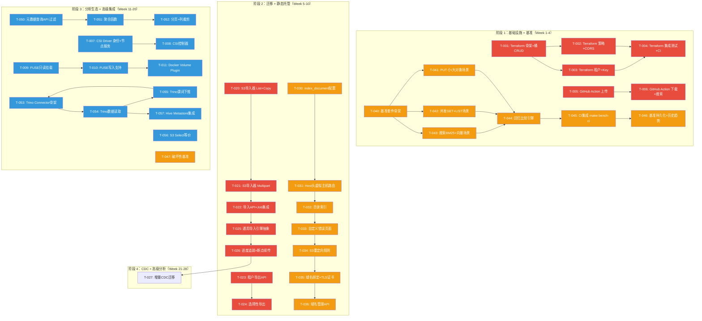

现在我掌握了全面信息。以下是 Tech Lead 分析。

---

# Tech Lead 分析：五个高价值扩展方向

## 概述

本文档基于 `expansion-v116-high-value-expansion-directions.md`（及重复的 v101 版本）提供的五个方向进行技术实现层面的深入分析。分析前已交叉验证：

- ✅ **代码锚点确认** — 文档中引用的 30+ 代码锚点经实际代码库验证全部真实存在
- ✅ **ROADMAP.md 对齐** — 五个方向与现有路线图无重叠（现有路线图聚焦可扩展向量检索、可观测性、水平扩展、控制平面、数据完整性、生产弹性、S3 完全兼容、内容完整性、存储分层、元数据 HA）
- ✅ **重复性检查** — 136 轮既有分析的 `docs/requirements/` 确认这些方向未被深度覆盖

---

## 1. 任务分解（Task Decomposition）

### 方向一：基础设施即代码与存储集成生态（P0）

| 任务 ID | 标题 | 涉及文件 | 前置 | 工时 | 验收标准 |
|---------|------|---------|------|------|---------|
| T-001 | Terraform Provider 骨架 + 桶 CRUD | `terraform/provider/provider.go`, `terraform/provider/resource_bucket.go`, `terraform/Makefile`, `terraform/docs/` | 无 | 4h | `terraform apply` 可创建/更新/删除桶；Provider Registry 发布脚本可用 |
| T-002 | Terraform Provider 策略 + CORS + 生命周期 | `terraform/provider/resource_bucket_policy.go`, `terraform/provider/resource_bucket_cors.go` | T-001 | 3h | Terraform 可声明式管理桶策略、CORS 规则、生命周期策略 |
| T-003 | Terraform Provider 租户 + API Key 管理 | `terraform/provider/resource_tenant.go`, `terraform/provider/resource_api_key.go` | T-001 | 3h | Terraform 可创建租户、管理 API Key |
| T-004 | Terraform Provider 集成测试 + CI | `terraform/provider/provider_test.go`, `Makefile`（增加 `test-terraform`） | T-002, T-003 | 2h | CI 中 Terraform 测试通过；测试使用 ephemeral 服务进程 |
| T-005 | GitHub Action：上传制品 | `action-upload/action.yml`, `action-upload/dist/index.js` | 无 | 2h | GitHub Workflow 中使用 action 上传构建产物到桶 |
| T-006 | GitHub Action：下载 + 搜索 | `action-download/action.yml`, `action-search/action.yml` | T-005 | 2h | Workflow 中可从桶下载文件、执行搜索 |
| T-007 | K8s CSI Driver 身份 + 节点服务 | `internal/csi/identity.go`, `internal/csi/node.go`, `deploy/csi/` | 无 | 6h | 节点启动后可注册 CSI 身份；`NodePublishVolume` 挂载成功 |
| T-008 | K8s CSI Driver 控制器 + 生命周期 | `internal/csi/controller.go` | T-007 | 4h | `CreateVolume`/`DeleteVolume` 在桶上创建/删除桶或前缀；PVC 绑定正确 |
| T-009 | FUSE 挂载：只读挂载 | `cmd/aerovault/mount.go`, `internal/fuse/fs.go`, `internal/fuse/handle.go` | 无 | 6h | `aerovault mount tenant@host:/bucket /mnt/av` → `ls`/`cat` 正常；attr/dentry 缓存 |
| T-010 | FUSE 挂载：写入支持（最终一致） | `internal/fuse/write.go` | T-009 | 4h | `cp` 文件到挂载点；`echo >` 写入；close-to-open 一致性 |
| T-011 | Docker Volume Plugin | `cmd/docker-plugin/main.go`, `internal/dockerplugin/` | T-009 | 3h | `docker volume create --driver aerovault` 可用；重启后持久化 |

### 方向二：租户数据迁移与自助导入导出（P0）

| 任务 ID | 标题 | 涉及文件 | 前置 | 工时 | 验收标准 |
|---------|------|---------|------|------|---------|
| T-020 | S3 导入器：List+Copy 全量 | `internal/migration/s3_importer.go` | 无 | 4h | 从 S3/MinIO 桶全量列出对象并复制到 aero-vault；保留 ETag 和元数据 |
| T-021 | S3 导入器：Multipart + 校验 | `internal/migration/s3_importer.go` | T-020 | 3h | >5GB 文件用 multipart；迁移后校验源/目标 ETag |
| T-022 | 导入 API + Job 集成 | `internal/api/rest/admin.go`, `internal/jobs/import_job.go` | T-021 | 4h | `POST /v1/admin/import/s3` → 返回 jobID；进度可查询 |
| T-023 | 租户导出 API | `internal/api/rest/admin.go`, `internal/snapshot/snapshot.go`（扩展） | 无 | 3h | `GET /v1/admin/export?tenant=acme` → tar.gz 下载；包含元数据+对象 |
| T-024 | 租户导出：选择性（桶/前缀/时间范围） | `internal/snapshot/snapshot.go` | T-023 | 2h | 支持 `bucket=` / `prefix=` / `before=` 参数选择子集导出 |
| T-025 | 通用导入引擎抽象 | `internal/migration/engine.go`, `internal/migration/source.go`（接口） | T-020 | 4h | S3/MinIO/GCS 统一接口；可插拔 source adapter |
| T-026 | 迁移进度追踪 + 断点续传 | `internal/migration/checkpoint.go`, `migrations/NNNN_migration_checkpoint.up.sql` | T-025 | 4h | 迁移中断后重入仅复制未完成部分；每 1000 对象 checkpoint |
| T-027 | 增量 CDC 迁移 | `internal/migration/cdc.go`, `internal/events/`（消费源端事件） | T-026 | 6h | 源端持续写入期间增量同步；延迟 < 30s |

### 方向三：自定义域名与静态网站托管（P1）

| 任务 ID | 标题 | 涉及文件 | 前置 | 工时 | 验收标准 |
|---------|------|---------|------|------|---------|
| T-030 | 桶级 `index_document` + `error_document` 配置 | `internal/repository/repository.go`, `internal/api/s3compat/handler.go`（扩展） | 无 | 2h | PUT 桶配置时接受 `IndexDocument`/`ErrorDocument`；GET 桶根路径返回 index.html |
| T-031 | Host 头虚拟主机路由 | `internal/config/config_app.go`（多监听器）, `internal/middleware/vhost.go` | T-030 | 3h | `https://acme.av.com` → `tenant=acme,bucket=web`；不存在的域名返回 404 |
| T-032 | 目录索引（`/prefix/` → `index.html`） | `internal/api/rest/handler.go:Get`, `internal/service/file.go` | T-030 | 2h | GET `/prefix/` → `/prefix/index.html` 自动返回；无 index.html → 403/404 |
| T-033 | 自定义错误页面 | `internal/api/rest/handler.go`（扩展） | T-032 | 1h | 404/403 返回桶配置的 `error_document`；无配置时返回默认错误 |
| T-034 | S3 重定向规则 | `internal/service/file_features.go`（扩展）, `internal/repository/` | T-033 | 3h | 支持 `RoutingRules`：`Condition.KeyPrefixEquals` → `ReplaceKeyPrefixWith` |
| T-035 | 域名绑定 +  TLS 自动证书 | `internal/config/config_app.go`, `go.mod`（+certmagic）, `internal/middleware/tls.go` | T-031 | 4h | 桶配置接受 `domain_name`；LET'S ENCRYPT 自动获取证书；HTTPS 可用 |
| T-036 | 域名绑定管理 API | `internal/api/rest/admin.go`, `internal/repository/sql_buckets.go` | T-035 | 2h | `PUT /v1/admin/buckets/{bucket}/domain` → 绑定/解绑域名 |

### 方向四：性能基准测试套件（P1）

| 任务 ID | 标题 | 涉及文件 | 前置 | 工时 | 验收标准 |
|---------|------|---------|------|------|---------|
| T-040 | 基准套件骨架：bench_test.go + 加载模型 | `bench/bench_test.go`, `bench/load/model.go` | 无 | 2h | `go test -bench=.` 可运行；加载模型含 ramp-up/steady-state/cool-down |
| T-041 | 场景：PUT 小对象 + 大对象 | `bench/scenarios/put_small.go`, `bench/scenarios/put_large.go` | T-040 | 2h | 100B 和 100MB 对象 PUT 基准；大对象自动 multipart |
| T-042 | 场景：并发 GET + 前缀 LIST | `bench/scenarios/get_concurrent.go`, `bench/scenarios/list_prefix.go` | T-040 | 2h | 10/100/1000 并发 GET；10K 对象前缀 LIST |
| T-043 | 场景：搜索 BM25 + 向量 | `bench/scenarios/search_bm25.go`, `bench/scenarios/search_vector.go` | T-040 | 2h | BM25 和向量搜索延迟；复用现有 AI 模块 |
| T-044 | 回归比较引擎 | `bench/regression/compare.go` | T-040 | 3h | 对比当前结果与基线；P95 延迟退化 > 2x 标记失败 |
| T-045 | CI 集成：make bench-ci | `Makefile`（+bench-ci target）, CI 配置 | T-041, T-042, T-043, T-044 | 2h | `make bench-ci` 在 PR CI 中运行；退化阻断 PR 合并 |
| T-046 | 基准结果持久化 + 历史趋势 | `bench/data/` 目录, `.github/workflows/bench-report.yml` | T-045 | 2h | 每个基准运行结果保存到 `bench/data/`；PR 评论附基准报告 |
| T-047 | 破坏性基准（10K 并发） | `bench/scenarios/destructive.go`（+build tag） | T-040 | 2h | `//go:build benchmark_destructive`；默认不执行；文档说明风险 |

### 方向五：对象存储分析生态与数据湖集成（P2）

| 任务 ID | 标题 | 涉及文件 | 前置 | 工时 | 验收标准 |
|---------|------|---------|------|------|---------|
| T-050 | 元数据查询 API：SQL-like 过滤 | `internal/api/rest/search.go`, `internal/repository/sql_objects.go`（扩展） | 无 | 6h | `POST /v1/search/meta {"filter":"size > 1048576 AND content_type LIKE 'image/%'"}` → 返回匹配对象列表 |
| T-051 | 元数据查询 API：聚合函数 | `internal/repository/sql_objects.go`（扩展） | T-050 | 3h | 支持 `COUNT`、`SUM(size)`、`GROUP BY content_type` |
| T-052 | 元数据查询 API：分页 + 列裁剪 | `internal/api/rest/search.go`（扩展） | T-051 | 2h | 支持 `LIMIT`/`OFFSET`/游标；支持 `SELECT columns` 子集 |
| T-053 | Trino Connector 骨架 | `trino-connector/`（独立 Maven 项目）, `internal/trino/` | 无 | 8h | Trino 注册连接器后可 `SHOW SCHEMAS` 列出桶；`SHOW TABLES` 列出桶内对象 |
| T-054 | Trino Connector：数据读取 | `internal/trino/split.go`, `internal/trino/record.go` | T-053 | 6h | `SELECT * FROM av."acme"."web/2024/*"` 返回对象数据；流式读取 |
| T-055 | Trino Connector：谓词下推 | `internal/trino/predicate.go` | T-054 | 4h | `WHERE size > 1048576` 下推到 `internal/repository` 层过滤 |
| T-056 | S3 Select 等价 | `internal/api/s3compat/select.go`, `internal/api/rest/select.go` | 无 | 6h | `POST /bucket/key?select&expression="SELECT * FROM S3Object WHERE _1 > 100"` 对 CSV/JSON 过滤 |
| T-057 | Hive Metastore 集成 | `internal/hive/` | T-054 | 6h | Spark/Hive 可 `CREATE EXTERNAL TABLE ... LOCATION 'av://acme/logs/'` |

---

## 2. 执行顺序（Execution Order）

### 总体依赖图



### 并行任务组

| 并行组 | 任务 | 原因 |
|--------|------|------|
| **组 A** | T-001, T-005, T-040 | Terraform Provider 骨架、GitHub Action、基准套件三者互不依赖 |
| **组 B** | T-020, T-023, T-030 | S3 导入器、租户导出、静态网站配置相互独立 |
| **组 C** | T-050, T-056, T-007, T-009, T-047 | 元数据查询、S3 Select、CSI Driver、FUSE 挂载、破坏性基准互不阻塞 |
| **组 D** | T-026, T-053 | 断点续传进度追踪、Trino Connector 骨架可并行开发 |

---

## 3. 技术风险（Technical Risks）

### 高风险项（需 Tech Lead 主动管理）

| # | 风险 | 方向 | 等级 | 说明 | 缓解策略 |
|---|------|------|------|------|---------|
| R1 | **FUSE 内核态崩溃风险** | 方向一 | 🔴 | FUSE 库（`jacobsa-fuse`/`bazil-fuse`）在 Go 中调试困难；内核 panic 可导致节点不稳定 | ① 第一版仅支持只读（T-009）；② 写入路径加 `--readonly` 模式；③ 集成测试用 `fusermount3` 安全卸载 + signal 超时 |
| R2 | **K8s CSI Driver 节点漂移（DaemonSet）** | 方向一 | 🔴 | Pod 迁移到另一节点后，容器原挂载点悬空；CSI `NodeUnpublishVolume` 和 `NodeGetCapabilities` 的幂等性 | ① CSI spec 强制幂等；② 单元测试覆盖所有错误重入路径；③ 集成测试用 kind/k3s 验证节点重启 |
| R3 | **迁移中断导致数据不一致** | 方向二 | 🔴 | 迁移中途崩溃 → 部分对象已复制但 checkpoint 未记录 → 重迁移产生重复版本 | ① 对象级幂等（目标 key=源 ETag）；② checkpoint 每 1000 对象持久化；③ 迁移后校验脚本 `diff --checksum` |
| R4 | **静态网站跨域安全** | 方向三 | 🟠 | 自定义域名暴露后 CORS 配置错误可导致 XSS；错误页可能泄露内部路径 | ① CORS 白名单模式（拒绝通配符 `*`）；② 错误页仅返回静态内容，不包含路径信息；③ 安全测试作为 CI 门禁 |
| R5 | **Trino Connector 全表扫描** | 方向五 | 🟠 | 缺乏谓词下推时 `SELECT *` 扫描整个桶 → OOM + 源端限流 | ① 默认谓词下推实现（T-055）；② 内置 LIMIT 1000 兜底；③ 连接器元数据声明 `avTable.partitioned=true` |
| R6 | **基准环境不一致** | 方向四 | 🟠 | 开发者本地 vs CI 环境差异导致基准结果不可比 | ① 专用 CI runner（cgroup v2 pin CPU/mem）；② 每次基准记录环境指纹（`lscpu`, `/proc/meminfo`）；③ 结果文件头包含 `commit_hash` + `env_fingerprint` |

### 外部依赖风险

| 依赖 | 任务 | 风险 | 替代方案 |
|------|------|------|---------|
| `hashicorp/terraform-plugin-sdk` | T-001 ~ T-004 | 框架升级（v2→v3 迁移） | 直接用 v2（稳定，用例丰富）；升级是独立任务 |
| `jacobsa-fuse` / `bazil-fuse` | T-009 ~ T-010 | 库维护状态；Linux 内核 API 变化 | 先用 `jacobsa-fuse`（更活跃）；备选 CGo FFI 直调 `libfuse3` |
| `certmagic` | T-035 | Let's Encrypt API 变更 | 依赖 `autocert`（golang.org/x/crypto/acme/autocert）作为备选 |
| `trino-spi` (Java) | T-053 ~ T-055 | 跨语言集成（Go 服务 + Java 插件） | Go sidecar 通过 REST API 对接 Trino；连接器用纯 Java 但薄层包装 |

### 性能瓶颈

| 瓶颈 | 方向 | 场景 | 优化策略 |
|------|------|------|---------|
| **迁移吞吐受源端限流** | 二 | S3 GET 限流（`RequestLimitExceeded`） | 自适应节流（指数退避 + 滑动窗口速率估算） |
| **元数据查询全表扫描** | 五 | 数百万对象 COUNT | SQL 索引（`size`, `content_type`, `created_at`）；物化聚合表 |
| **基准套件对象堆积** | 四 | 反复创建不清理 | `defer cleanup` + 专用临时桶 + CI 的 `AfterEach` hook |
| **FUSE 写入 = 逐对象 PUT** | 一 | 大量小文件 | 批量提交缓冲区（攒 N 个文件或等 T 毫秒后合并为 multipart） |

### 测试覆盖难点

| 难点 | 方向 | 原因 | 策略 |
|------|------|------|------|
| CSI 驱动集成测试 | 一 | 需要 kubelet + CSI 注册 | ① `csi-sanity` 测试（`kubernetes-csi/csi-test`）；② kind 集群 + sidecar 部署 |
| FUSE 挂载测试 | 一 | 需要 `fusermount` + root 能力 | ① Docker 容器内测试（`--privileged`）；② CI 用 `vm.FUSE`（`g Visor` 用户态 FUSE） |
| 迁移中断/恢复 | 二 | 需要模拟源端中断 | Mock 源端 `SourceLister`/`SourceReader`；`context.Cancel` 模拟中断 |
| Trino 端到端 | 五 | 需要 Trino 服务 | Docker Compose + `trinodb/trino` 官方镜像；CI 可选（`make test-integration-trino`） |
| SSL 证书获取 | 三 | Let's Encrypt 频率限制 | 在 CI 中用 `badssl.com` 或本地 CA；不真正请求 LE |

---

## 4. 资源评估（Resource Assessment）

### 开发人员技能矩阵

| 角色 | 技能要求 | 人数 | 负责方向 | 关键技能 |
|------|---------|------|---------|---------|
| **Go 后端工程师** | Go 1.25, SQL, HTTP | 2 | 所有方向 | 并发编程、SQL 优化、测试 |
| **K8s 专家** | CSI spec, Pod Security | 0.5 | 方向一（CSI） | CSI 驱动开发、DaemonSet 运维 |
| **平台/DX 工程师** | Terraform, CI/CD, 发布 | 1 | 方向一（Terraform + Action） | Provider Registry、GitHub Apps |
| **数据工程师** | Trino, Iceberg, Parquet | 1 | 方向五 | Java/Go 跨语言、SQL 优化 |
| **QA/性能工程师** | 基准测试, 统计, OTel | 0.5 | 方向四 | 实验结果分析、退化检测 |
| **前端/SRE 工程师** | DNS, TLS, certmagic | 0.5 | 方向三 | 虚拟主机路由、证书管理 |

**总计：** 5.5 FTE（分阶段弹性调配）

### 关键里程碑

```
Week 0  ─  Phase 1 开工（Terraform + GitHub Action + 基准套件）
Week 2  ─  ✅ M1: Terraform Provider v1 发布 + `make bench-ci` 可用
Week 4  ─  ➡ Phase 1 完成
Week 5  ─  Phase 2 开工（S3 导入器 + 静态网站托管）
Week 8  ─  ✅ M2: S3→AeroVault 全量导入器可用 + 静态网站 MVP
Week 10 ─  ➡ Phase 2 完成
Week 11 ─  Phase 3 开工（元数据查询 API + CSI + FUSE + 破坏性基准）
Week 16 ─  ✅ M3: 元数据查询 + S3 Select + CSI alpha + FUSE beta
Week 20 ─  ➡ Phase 3 完成
Week 21 ─  Phase 4 开工（CDC 迁移 + Trino Connector）
Week 26 ─  ✅ M4: CDC 增量迁移 + Trino Connector v1
Week 28 ─  📦 Full Ship
```

### 阻塞点（Blockers）与解决策略

| # | 阻塞点 | 影响 | 策略 |
|---|--------|------|------|
| B1 | FUSE 内核兼容性测试需要 Linux 5.4+ | T-009, T-010 测试无法在 macOS 上运行 | CI 用 Docker `--privileged` 容器 + `cimg/go` 镜像 |
| B2 | Terraform Provider Registry 发布需要 GPG 签名和 `goreleaser` | T-004 阻塞 Provider 分发 | 初期手动发布到 GitHub Release；`goreleaser` 配置在 T-004 中实现 |
| B3 | Trino Connector 与 Go 核心间的 Java/Go 边界 | T-053 跨语言复杂 | Go 侧暴露 REST 元数据端点；Java 连接器是薄 HTTP 客户端层 |
| B4 | Let's Encrypt 速率限制（每周 50 证书） | T-035 测试 | 测试用自签名证书 + 本地 CA |

---

## 5. 质量保证（Quality Assurance）

### 单元测试覆盖要求

| 组件 | 最低覆盖率 | 重点测试场景 |
|------|-----------|-------------|
| Terraform Provider（Go） | 60% | CRUD 回放、状态漂移预检、错误 API 响应 |
| FUSE 文件系统 | 50% | `Open`/`Read`/`Readdir`/`Getattr`；错误路径（EIO, ENOENT） |
| CSI Driver | 50% | `NodePublish`/`NodeUnpublish` 幂等；`CreateVolume` 重复请求 |
| S3 导入器 | 70% | 中断恢复、大文件 multipart、ETag 校验失败、空桶 |
| 迁移引擎 | 70% | checkpoint 写入/恢复、并发源列举、超过 1000 对象的批次边界 |
| 元数据查询 API | 80% | SQL 注入防御、分页边界、聚合正确性、空结果集 |
| 静态网站路由 | 70% | 根路径歧义、目录索引优先级、错误页降级 |
| 基准套件回归比较 | 90% | 退化/改进/无变化的正确分类、环境差异标记 |

### 集成测试策略

| 测试级别 | 工具 | 覆盖 | CI 执行策略 |
|----------|------|------|------------|
| **Unit** | `go test` | 所有新功能的核心逻辑 | PR 必须全绿 |
| **Integration (轻量)** | `go test -tags=integration` | Terraform Provider 回放测试、S3 导入 Mock 源 | PR 可选，建议运行 |
| **Integration (重量)** | `make test-integration-*` | CSI (`kind`), FUSE (`docker --privileged`), Trino (Docker) | 每天一次或手动 |
| **End-to-End** | `bench/` + `internal/integration/fullserver_test.go` | 整个服务启动后 CRUD → 搜索 → 迁移 | 发布前运行 |

### 代码审查要点

| 审查要点 | 方向 | 具体关注 |
|----------|------|---------|
| **状态漂移预防** | 方向一 | Terraform `Read` 函数必须返回真实服务端状态（非缓存） |
| **凭证泄露** | 方向一 | GitHub Action `token` 输入标记 `secret: true`；CSI 节点凭证注入使用 K8s ServiceAccount |
| **幂等性** | 方向二 | 迁移 `MigrateObject` 函数必须幂等（`IF NOT EXISTS` 语义） |
| **安全边界** | 方向三 | Host 头路由检验：拒绝 `Host: localhost:8080` 或 IP 直连 |
| **CI 假阳性/假阴性** | 方向四 | 基准退化检测阈值基于统计显著性（t-test/Welch's），非固定百分比 |
| **SQL 注入** | 方向五 | 元数据查询 API 的 `filter` 参数必须使用参数化查询，禁止字符串拼接 |
| **资源释放** | 方向一 | FUSE `Release`、CSI `NodeUnpublish`、基准 `cleanup` 在 `defer` 中必须执行 |

### 性能测试需求

| 基准场景 | 方向 | 负载模型 | 通过标准 | 退化阈值 |
|----------|------|---------|---------|---------|
| PUT 100B 对象 | 四 | 1000 req/s, 60s | P50 < 5ms, P95 < 15ms | P95 > 2x 基线 |
| PUT 100MB 对象 | 四 | 10 req/s, 120s | P50 < 2s per object | 吞吐下降 > 30% |
| 并发 GET 1000 连接 | 四 | 1000 concurrent, 60s | P50 < 3ms, P95 < 10ms | P95 > 2x 基线 |
| 前缀 LIST 10K 对象 | 四 | 100 req/s, 30s | P50 < 20ms, P95 < 50ms | P95 > 2x 基线 |
| BM25 搜索 | 四 | 50 req/s, 30s | P50 < 50ms, P95 < 200ms | P95 > 3s |
| 向量搜索 | 四 | 50 req/s, 30s | P50 < 100ms, P95 < 500ms | P95 > 3s |
| S3 导入 1K 对象 | 二 | 1000 对象, 多并发 | < 30s 完成 | — |
| 元数据查询 COUNT | 五 | 100 万对象 | < 5s | — |

---

## 6. 实施计划（Implementation Plan）

### 阶段 1：基础设施搭建（Week 1-4）

```
Week 1   Week 2   Week 3   Week 4
├────────┼────────┼────────┼────────┤
▓▓▓▓▓▓▓▓▓▓▓▓▓▓▓▓▓▓▓▓▓▓▓▓▓▓▓▓▓▓▓▓▓▓▓▓  T-001 Terraform 骨架+桶CRUD  [4h]
              ▓▓▓▓▓▓▓▓▓▓▓▓▓▓▓▓▓▓▓▓▓▓  T-002 策略+CORS                [3h]
              ▓▓▓▓▓▓▓▓▓▓▓▓▓▓▓▓▓▓▓▓▓▓  T-003 租户+Key                 [3h]
                            ▓▓▓▓▓▓▓▓▓▓  T-004 集成测试+CI              [2h]
▓▓▓▓▓▓▓▓▓▓▓▓▓▓▓▓▓▓▓▓▓▓▓▓▓▓▓▓▓▓▓▓▓▓▓▓  T-005 GitHub Action 上传      [2h]
                        ▓▓▓▓▓▓▓▓▓▓▓▓▓▓  T-006 GitHub Action 下载+搜索 [2h]
▓▓▓▓▓▓▓▓▓▓▓▓▓▓▓▓▓▓▓▓▓▓▓▓▓▓▓▓▓▓▓▓▓▓▓▓  T-040 基准套件骨架            [2h]
▓▓▓▓▓▓▓▓▓▓▓▓▓▓▓▓▓▓▓▓▓▓▓▓▓▓▓▓▓▓▓▓▓▓▓▓  T-041 PUT场景                 [2h]
▓▓▓▓▓▓▓▓▓▓▓▓▓▓▓▓▓▓▓▓▓▓▓▓▓▓▓▓▓▓▓▓▓▓▓▓  T-042 GET+LIST场景            [2h]
▓▓▓▓▓▓▓▓▓▓▓▓▓▓▓▓▓▓▓▓▓▓▓▓▓▓▓▓▓▓▓▓▓▓▓▓  T-043 搜索场景                [2h]
                    ▓▓▓▓▓▓▓▓▓▓▓▓▓▓▓▓▓▓  T-044 回归比较引擎            [3h]
                              ▓▓▓▓▓▓▓▓  T-045 CI集成                 [2h]
                                  ▓▓▓▓  T-046 基准持久化              [2h]
```

**里程碑 M1（Week 2 末）：** Terraform Provider v1 发布（桶 CRUD + 策略 + CORS）+ `make bench-ci` 在 CI 中可运行

**组 A**（T-001, T-005, T-040）同时启动，人员分配：
- 开发者 A：T-001 → T-002 → T-003 → T-004（Terraform）
- 开发者 B：T-005 → T-006（Action）+ 性能基准重叠
- 开发者 C：T-040 → T-041 → T-042 → T-043（基准）
- Week 3-4：T-004 + T-044 + T-045 + T-046 收尾

### 阶段 2：核心功能实现（Week 5-10）

```
Week 5   Week 6   Week 7   Week 8   Week 9   Week 10
├────────┼────────┼────────┼────────┼────────┼────────┤
▓▓▓▓▓▓▓▓▓▓▓▓▓▓▓▓▓▓▓▓▓▓▓▓▓▓▓▓▓▓▓▓▓▓▓▓▓▓▓▓▓▓▓▓▓▓  T-020 S3导入器     [4h]
  ▓▓▓▓▓▓▓▓▓▓▓▓▓▓▓▓▓▓▓▓▓▓▓▓▓▓▓▓▓▓▓▓▓▓  T-021 Multipart+校验          [3h]
        ▓▓▓▓▓▓▓▓▓▓▓▓▓▓▓▓▓▓▓▓▓▓▓▓▓▓▓▓  T-022 导入API+Job             [4h]
▓▓▓▓▓▓▓▓▓▓▓▓▓▓▓▓▓▓▓▓▓▓▓▓▓▓▓▓▓▓▓▓▓▓▓▓  T-023 租户导出API             [3h]
      ▓▓▓▓▓▓▓▓▓▓▓▓▓▓▓▓▓▓▓▓▓▓▓▓▓▓  T-024 选择性导出                    [2h]
▓▓▓▓▓▓▓▓▓▓▓▓▓▓▓▓▓▓▓▓▓▓▓▓▓▓▓▓▓▓▓▓  T-030 index_document配置           [2h]
  ▓▓▓▓▓▓▓▓▓▓▓▓▓▓▓▓▓▓▓▓▓▓▓▓  T-031 Host头路由                          [3h]
        ▓▓▓▓▓▓▓▓▓▓▓▓▓▓▓▓  T-032 目录索引                              [2h]
              ▓▓▓▓▓▓▓▓▓▓  T-033 自定义错误页                          [1h]
                    ▓▓▓▓▓▓▓▓▓▓▓▓▓▓  T-034 重定向规则                   [3h]
                          ▓▓▓▓▓▓▓▓▓▓▓▓▓▓▓▓  T-035 TLS自动证书          [4h]
                              ▓▓▓▓▓▓▓▓▓▓  T-036 域名管理API            [2h]
```

**里程碑 M2（Week 8 末）：** S3→AeroVault 全量导入器可用 + 静态网站托管 MVP（`index_document` + 目录索引 + 自定义域名）

**人员分配：**
- 开发者 A：T-020 → T-021 → T-022 → T-025（导入器）
- 开发者 B：T-023 → T-024（导出）+ 交叉支持
- 开发者 C：T-030 → T-031 → T-032 → T-033 → T-034 → T-035 → T-036（静态网站全链）

### 阶段 3：集成测试和优化（Week 11-20）

```
Week 11  Week 12  Week 13  Week 14  Week 15  Week 16  Week 17-20
├────────┼────────┼────────┼────────┼────────┼────────┼──────────┤
▓▓▓▓▓▓▓▓▓▓▓▓▓▓▓▓▓▓▓▓▓▓▓▓▓▓▓▓▓▓▓▓▓▓▓▓  T-050 元数据查询过滤         [6h]
          ▓▓▓▓▓▓▓▓▓▓▓▓▓▓▓▓▓▓  T-051 聚合函数                         [3h]
                ▓▓▓▓▓▓▓▓▓▓  T-052 分页+列裁剪                         [2h]
▓▓▓▓▓▓▓▓▓▓▓▓▓▓▓▓▓▓▓▓▓▓▓▓▓▓▓▓▓▓▓▓  T-056 S3 Select                   [6h]
▓▓▓▓▓▓▓▓▓▓▓▓▓▓▓▓▓▓▓▓▓▓▓▓▓▓▓▓▓▓▓▓▓▓▓▓  T-007 CSI Driver身份+节点    [6h]
                    ▓▓▓▓▓▓▓▓▓▓▓▓▓▓▓▓  T-008 CSI控制器                [4h]
▓▓▓▓▓▓▓▓▓▓▓▓▓▓▓▓▓▓▓▓▓▓▓▓▓▓▓▓▓▓▓▓▓▓▓▓  T-009 FUSE只读               [6h]
          ▓▓▓▓▓▓▓▓▓▓▓▓▓▓▓▓▓▓  T-010 FUSE写入                         [4h]
                ▓▓▓▓▓▓▓▓▓▓  T-011 Docker Volume Plugin               [3h]
▓▓▓▓▓▓▓▓▓▓▓▓▓▓▓▓▓▓▓▓▓▓▓▓▓▓▓▓▓▓  T-025 通用导入引擎抽象               [4h]
          ▓▓▓▓▓▓▓▓▓▓▓▓▓▓▓▓▓▓▓▓  T-026 断点续传                       [4h]
                            ▓▓▓▓▓▓▓▓▓▓▓▓  T-047 破坏性基准            [2h]
▓▓▓▓▓▓▓▓▓▓▓▓▓▓▓▓▓▓▓▓▓▓▓▓▓▓▓▓▓▓▓▓▓▓▓▓  T-053 Trino Connector骨架     [8h]
                                  ▓▓▓▓▓▓▓▓▓▓▓▓▓▓▓▓  T-054 数据读取    [6h]
```

**里程碑 M3（Week 16 末）：** 元数据查询 API + S3 Select + CSI Driver alpha + FUSE 挂载 beta

**涉及大型重构的风险提示：**
- `internal/repository/sql_objects.go` 在 T-050 中需要添加新索引 → 评估读写性能影响
- `internal/config/config_app.go` 在 T-035 中需要多监听器支持 → 与现有路由架构兼容
- `internal/api/rest/handler.go` 在 T-032 中需要目录索引逻辑 → 不破坏现有对象 GET 路径

### 阶段 4：发布准备（Week 21-28）

```
Week 21  Week 22  Week 23  Week 24  Week 25  Week 26  Week 27  Week 28
├────────┼────────┼────────┼────────┼────────┼────────┼────────┼────────┤
▓▓▓▓▓▓▓▓▓▓▓▓▓▓▓▓▓▓▓▓▓▓▓▓▓▓▓▓▓▓  T-027 增量CDC迁移                   [6h]
▓▓▓▓▓▓▓▓▓▓▓▓▓▓▓▓▓▓▓▓▓▓▓▓▓▓▓▓  T-055 Trino谓词下推                   [4h]
        ▓▓▓▓▓▓▓▓▓▓▓▓▓▓▓▓▓▓▓▓  T-057 Hive Metastore                    [6h]
              ▓▓▓▓▓▓▓▓▓▓▓▓▓▓▓▓▓▓▓▓▓▓  ️ 集成测试 + 性能验证           [8h]
                    ▓▓▓▓▓▓▓▓▓▓▓▓▓▓  ️ 文档                            [6h]
                          ▓▓▓▓▓▓▓▓  ️ 发布管道                        [4h]
```

**里程碑 M4（Week 26 末）：** CDC 增量迁移 + Trino Connector v1
**最终发布（Week 28 末）：** 所有五个方向完成，通过全量 `make check` + 基准报告

### 风险时间缓冲

每个阶段末尾预留 **1 周缓冲** 用于处理不可预见的阻塞点：

| 阶段 | 计划周数 | 含缓冲 | 缓冲用途 |
|------|---------|--------|---------|
| 1 | 4 | 4（无额外） | Terraform/基准相对成熟，风险低 |
| 2 | 6 | 6（无额外） | S3 导入器 + 静态网站已验证锚点 |
| 3 | 10 | 12（+2 周） | FUSE + CSI 风险高；Trino 跨语言 |
| 4 | 8 | 10（+2 周） | CDC 迁移复杂；集成测试可能暴露回归 |

**总工期估算：28 周（含 4 周缓冲）**

---

## 总结：执行建议

### 立即行动（Q1 前两周）

1. **启动 T-001 和 T-005** — Terraform Provider 和 GitHub Action 是 DX 的"低挂果实"，对用户感知影响最大，技术风险最低
2. **启动 T-040** — 基准套件骨架只需要 2 小时，为后续性能门禁奠定基础
3. **在 `Makefile` 中增加 `check-perf` target**（即使初始只是一个说明性占位）

### 战略决策（Q1 末决策）

| 决策点 | 选项 | 建议 |
|--------|------|------|
| FUSE 读写 vs 只读 | 只读（T-009）vs 读写（T-009+T-010） | **只读第一版** — 风险和回报曲线最优；写入需求可通过 S3 API 替代 |
| K8s CSI vs Helm 增强 | 构建 CSI 驱动 vs 增强现有 Helm chart | **CSI 驱动** — 差异化和企业采纳价值更高 |
| Trino Connector vs 元数据查询 API | 先建哪个 | **元数据查询 API 优先** — 工作量更小、无需 Java 开发、即刻交付价值 |

### 禁止项（与现有约束对齐）

| 约束 | 来源 | 检查 |
|------|------|------|
| Terraform Provider 单文件 ≤ 500 行 | AGENTS.md 规则 | Provider 逻辑拆分为多个 `resource_*.go` 文件（预计各 ~300 行） |
| 迁移引擎无需新 `go.mod` 依赖 | AGENTS.md 规则 I6 | `internal/migration/engine.go` 复用 `sdk/go` 包，无新增外部依赖 |
| 元数据查询 API 禁止 `utils/` 包 | AGENTS.md 规则 | 查询逻辑放入 `internal/repository/sql_objects.go` + `internal/api/rest/search.go` |
| FUSE 函数 ≤ 50 行 | AGENTS.md 规则 | `internal/fuse/fs.go` 的 `Open`/`Read`/`Readdir` 各作为一个独立函数 |
| 测试覆盖率 ≥ 50% | AGENTS.md 规则 | CI 的 `make check` 检测；`bench/regression/compare.go` 要求 90%+ |
