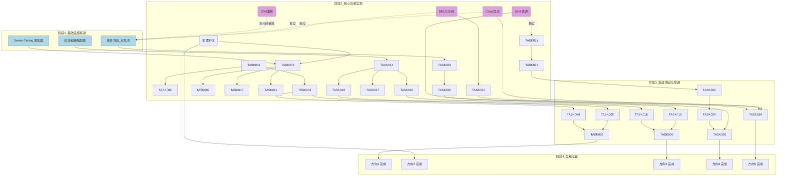
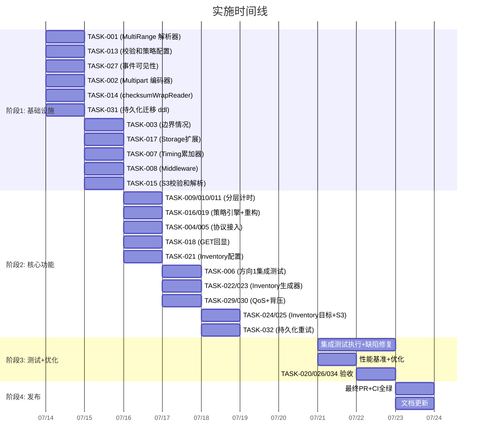

现在我已掌握代码库的完整脉络。以下是针对去重验证报告的综合技术负责人分析。

---

# Tech Lead 分析报告：expansion-v116-product-architect-frontiers.md

## 1. 任务分解

所有五个方向已拆分为可执行的子任务（每项 2–4 小时的独立工作单元）。

### 方向 1：Multi-Range HTTP 请求支持（RFC 7233 §4.1）— 100% 新颖

| 任务 ID | 标题 | 涉及文件 | 前置依赖 | 工时 |
|---------|------|---------|---------|------|
| TASK-001 | **核心数据模型 + 解析器：`ParseMultiRange`** | `internal/service/range.go`, `internal/service/range_test.go` | — | 3h |
| TASK-002 | **Multipart/byteranges 流式编码器** | `internal/service/range.go`（新增 `MultiRangeWriter`） | TASK-001 | 4h |
| TASK-003 | **边界情况兜底**：段重叠去重、部分可满足、完全不可满足 | `internal/service/range.go`, `internal/service/range_test.go` | TASK-001 | 2h |
| TASK-004 | **S3 handler 接入** | `internal/api/s3compat/handler.go:serveObjectContent` | TASK-002 | 2h |
| TASK-005 | **REST handler 接入** | `internal/api/rest/handler.go:handleConditional` | TASK-002 | 2h |
| TASK-006 | **集成测试**：curl、Go http.Client、S3 SDK 多段 Range | `internal/service/range_test.go`, `internal/api/s3compat/handler_test.go`, `internal/api/rest/handlers_test.go` | TASK-004, TASK-005 | 3h |

### 方向 2：Server-Timing 逐请求耗时剖断面 — 100% 新颖

| 任务 ID | 标题 | 涉及文件 | 前置依赖 | 工时 |
|---------|------|---------|---------|------|
| TASK-007 | **Timing 累加器核心**：`TimingKey` 常量 + context-based `TimingAccumulator` | `internal/telemetry/timing.go`（新增文件） | — | 2h |
| TASK-008 | **Middleware 层注入**：在 AccessLog 后写 `Server-Timing` 响应头 | `internal/middleware/middleware.go`（新增 `ServerTiming` 中间件） | TASK-007 | 2h |
| TASK-009 | **Storage 层计时插入**：local_read、s3 Get/Put 耗时上报到 context | `internal/storage/local_read.go`, `internal/storage/s3.go` | TASK-007 | 3h |
| TASK-010 | **AI 层计时插入**：Search.Query 各阶段（embed、retrieval、rerank）耗时上报 | `internal/ai/search.go` | TASK-007 | 2h |
| TASK-011 | **DB 层计时插入**：Repository 关键查询耗时上报 | `internal/repository/sql_objects.go` | TASK-007 | 2h |
| TASK-012 | **配置开关 `SERVER_TIMING_ENABLED`** + 集成测试 | `internal/config/config.go`, `middleware_test.go` | TASK-008, TASK-009, TASK-010 | 1h |

### 方向 3：数据完整性校验强制策略 — ~25% 增量（策略框架是新增的，底层校验算法在 v114 中已有分析）

| 任务 ID | 标题 | 涉及文件 | 前置依赖 | 工时 |
|---------|------|---------|---------|------|
| TASK-013 | **配置项 `STORAGE_CHECKSUM_POLICY`**：none / prefer / required，含配置验证 | `internal/config/config.go` | — | 1h |
| TASK-014 | **通用 `checksumWrapReader`**：支持 MD5\CRC32\CRC32C\SHA1\SHA256，替代当前的 `md5WrapReader` | `internal/service/file_crud.go`（重构 `md5WrapReader` → `checksumWrapReader`） | TASK-013 | 4h |
| TASK-015 | **S3 Flexible Checksum 请求头解析**：`x-amz-checksum-crc32` / `x-amz-sdk-checksum-algorithm` 等读取 + 验证 | `internal/api/s3compat/extra.go` 或 `internal/api/s3compat/handler.go` | TASK-014 | 3h |
| TASK-016 | **策略执行引擎**：在 `FileService.Put` 中实现策略校验（none 跳过、prefer warn、required reject） | `internal/service/file_crud.go` | TASK-013, TASK-014 | 2h |
| TASK-017 | **Storage 接口扩展**：PutOptions 增加 ChecksumAlgorithm / ChecksumValue 字段 | `internal/storage/storage.go` | TASK-014 | 1h |
| TASK-018 | **GET 路径回显校验和**：在响应头中回显 `x-amz-checksum-*` | `internal/api/s3compat/handler.go:writeS3ObjectMeta`, `internal/api/rest/handler.go:writeContentMD5`→泛化 | TASK-015 | 2h |
| TASK-019 | **跨协议统一校验逻辑重构**：消除 REST 和 S3 handler 中各自的 `Content-MD5` 重复读取，下沉到 `FileService` | `internal/service/file_crud.go` | TASK-014, TASK-016 | 2h |
| TASK-020 | **单元 + 集成测试**：三种策略模式、所有校验算法、S3 SDK 交互 | `internal/service/service_test.go`, `internal/api/s3compat/handler_test.go`, `internal/api/rest/handlers_test.go` | TASK-013 ~ TASK-018 | 4h |

### 方向 4：桶清单生成管线 — ~10% 增量（v16 已有完整架构分析，以下聚焦 v116 的增量代码锚点）

**前提**：此方向已有独立分析文档 `docs/requirements/expansion-v16-foundations.md`（~200 行深度架构分析）。以下任务仅覆盖 v116 的新增增量（代码锚点对齐、边界情况补全），详细实现参考 v16。

| 任务 ID | 标题 | 涉及文件 | 前置依赖 | 工时 |
|---------|------|---------|---------|------|
| TASK-021 | **Inventory 配置 + 调度入口**：`INVENTORY_ENABLED`、`INVENTORY_SCHEDULE`、`INVENTORY_DEST_BUCKET` | `internal/config/config.go`, `internal/reconcile/inventory.go`（新增） | — | 2h |
| TASK-022 | **清单数据生成器**：分页扫描 + 游标 + 流式 CSV 写入（参考 v16 DB schema 草案） | `internal/reconcile/inventory.go` | TASK-021 | 4h |
| TASK-023 | **版本化桶的版本行包含**：`is_latest` 列标记 | `internal/reconcile/inventory.go` | TASK-022 | 2h |
| TASK-024 | **清单目标写入 + 分布式锁**：写入目标桶、复用 `cluster.Singleton` 防冲突 | `internal/reconcile/inventory.go`, `internal/cluster/singleton.go` | TASK-022 | 3h |
| TASK-025 | **S3 `?inventory` 子资源端点**：PUT/GET/DELETE Inventory 配置的 XML 接口 | `internal/api/s3compat/handler.go:dispatchBucketSubresource` | TASK-021 | 4h |
| TASK-026 | **集成测试**：清单生成、大桶分页、版本桶清单 | `internal/reconcile/inventory_test.go`, `internal/api/s3compat/handler_test.go` | TASK-023, TASK-024, TASK-025 | 3h |

### 方向 5：事件订阅者背压保护 — ~20% 增量（v102/v121 已有深度分析，以下聚焦增量）

| 任务 ID | 标题 | 涉及文件 | 前置依赖 | 工时 |
|---------|------|---------|---------|------|
| TASK-027 | **[阶段 1] 可见性增强**：`Publish` default 分支增加日志 + `events_dropped_total{subscriber}` 指标 | `internal/events/bus.go` | — | 2h |
| TASK-028 | **[阶段 1] OTel + Grafana 面板**：`events_subscriber_queue_depth{key}` 指标 + 面板 | `internal/telemetry/metrics.go`, `deploy/grafana/` | TASK-027 | 2h |
| TASK-029 | **[阶段 2] QoS 订阅者分类机制**：`SubscribeQoS(name string, qos QoS)` 声明式注册 | `internal/events/bus.go` | TASK-027 | 3h |
| TASK-030 | **[阶段 2] 背压治理**：Critical 级订阅者阻塞发送（带超时），BestEffort 级保留丢弃+记录 | `internal/events/bus.go:Publish` | TASK-029 | 3h |
| TASK-031 | **[阶段 3] 持久化事件队列迁移**：`events` 表 + `status=pending_delivery` 标记 | `internal/repository/sql_*.go`, `migrations/{sqlite,postgres}/` | —（可并行于阶段 1/2） | 4h |
| TASK-032 | **[阶段 3] 后台重试投递 goroutine**：从 pending 队列读取并重试投递 | `internal/events/bus.go`（新增 `deliveryWorker`） | TASK-031 | 4h |
| TASK-033 | **[阶段 3] `Close()` 竞态修复**：`sync.RWMutex` 保护 `Publish` 与 `Close` 间的通道关闭 | `internal/events/bus.go` | TASK-027 | 1h |
| TASK-034 | **集成测试**：背压日志出现、阻塞型订阅者不丢事件、持久化投递恢复 | `internal/events/bus_test.go` | TASK-027 ~ TASK-033 | 4h |

---

## 2. 执行顺序

### 可并行执行的任务组

| 组 | 任务 | 并行理由 |
|----|------|---------|
| **组 A**（完全独立） | TASK-001（MultiRange 解析器）, TASK-007（Timing 累加器）, TASK-013（校验和策略配置）, TASK-021（Inventory 配置）, TASK-027（事件可见性）, TASK-031（持久化迁移 ddl） | 六项无共享代码或文件 |
| **组 B**（阶段 1 后并行） | TASK-009（Storage 计时）, TASK-010（AI 计时）, TASK-011（DB 计时） | 均为 TASK-008 的下游，彼此独立 |
| **组 C**（阶段 2 后并行） | TASK-004（S3 接入）+ TASK-005（REST 接入）, TASK-018（GET 回显）+ TASK-019（跨协议统一） | 方向内部分支 |
| **组 D**（无依赖的独立任务） | TASK-028（Grafana 面板）, TASK-025（S3 inventory 子资源）, TASK-033（Close 竞态修复） | 可随时插队执行 |

---

## 3. 技术风险

### 3.1 高风险项

| # | 方向 | 风险描述 | 严重度 | 缓解策略 |
|---|------|---------|--------|---------|
| R1 | 方向 1 | **大响应的内存压力**：多段 Range 的 multipart/byteranges 响应体可能是完整对象的数倍（最坏情况 N 个单字节段）。需要流式组装 + `sync.Pool`，但 Go 的 `http.ResponseWriter` 写入阻塞可能导致 goroutine 堆积 | **高** | ① 实现流式 `MultiRangeWriter` 逐段写入而非缓冲拼接；② 设置 `MaxRanges` 硬限制（如 128）；③ 对大对象分段用 `io.CopyN` 避免全量加载 |
| R2 | 方向 3 | **S3 Flexible Checksum SDK 交互的兼容性测试**：`x-amz-sdk-checksum-algorithm` 头的语义和 SDK 默认行为在不同 aws-sdk 版本（v1/v2）下不同。我们的实现可能和 SDK 的期望不一致 | **高** | ① 先实现手工测试覆盖 MD5 和 CRC32（最常用）；② 用本地 S3 兼容测试套件验证签入周期；③ 参考 aws-sdk-go-v2 源码中的 checksum 实现 |
| R3 | 方向 5 | **阻塞 `Publish` 影响请求 goroutine 悬挂**：HTTP handler 在请求 goroutine 中直接调用 `Publish`，如果改为阻塞发送，一个慢消费者可能导致所有 PUT 请求卡住 | **高** | ① 阶段 2 阻塞只对 Critical 订阅者生效；② 阻塞加超时（context deadline）；③ 分离 `Publish` 到专用 goroutine（异步 `PublishAsync`） |
| R4 | 方向 5 | **`Close()` 和 `Publish()` 的竞态**：当前 `Close()` 关闭通道后，其他 goroutine 的 `Publish` 可能向已关闭通道发送 → panic | **中** | TASK-033 单独处理，加 `sync.RWMutex` 保护 |
| R5 | 方向 4 | **大桶内存爆炸**：百万级对象一次性加载到内存生成 CSV → OOM | **中** | 游标分页 + 流式 CSV 写入（每页 1000 条），永远不缓存全量 |

### 3.2 中低风险项

| # | 风险 | 影响方向 | 缓解 |
|---|------|---------|------|
| R6 | `Storage` 接口的 `PutOptions` 新增 Checksum 字段 → 所有 3 个现有 Backend（local/S3/OSS/COS）的 `Put` 方法需更新，可能遗漏 | 方向 3 | 编译时检查：`storage.Storage` 是接口，新字段只影响 `PutOptions` 结构体，编译器会自动确保所有调用方通过 |
| R7 | Server-Timing 的精度：在非抢占式 Go 调度中，`time.Now()` 的精度受 goroutine 调度延迟影响（数十微秒级误差） | 方向 2 | 明确文档：Server-Timing 的精度是**毫秒级**（`dur=123.4` 格式），不用于微基准 |
| R8 | If-Range + Multi-Range 的交互复杂 | 方向 1 | 一期只实现 `If-Range: <etag>` 匹配时返回多段、不匹配时返回完整对象（RFC 7233 §4.1 标准行为），不处理 `If-Range: <date>` |
| R9 | 持久化事件队列的"至少一次"语义可能导致重复事件 | 方向 5 | 事件消费者必须幂等（已满足：Indexer 重复索引安全，Webhook 有去重，Replication 幂等） |
| R10 | Inventory 加密桶的清单内容不能包含对象内容 | 方向 4 | 清单只包含元数据（key、size、ETag、last_modified、storage_class、is_latest），不包含内容。加密桶的 SSE 设置在清单中反映 |

### 3.3 性能推演与策略

| 方向 | 场景 | 瓶颈预测 | 优化策略 |
|------|------|---------|---------|
| 方向 1 | 视频流媒体 10 段 Range | CPU 在生成 multipart 边界头 + 多个 `io.CopyN` | `sync.Pool` 复用边界缓冲区；一段一段地写，不用中间缓存 |
| 方向 2 | 高 QPS 下 `Server-Timing` 头拼接 | 和响应体写入无竞争，开销极低（< 1µs/请求） | 不需要额外优化 |
| 方向 3 | required 模式 + CRC32 校验 | CRC32 是硬件加速的——单次校验 < 10ns/字节 | 生产环境推荐 CRC32C（支持硬件加速） |
| 方向 4 | 10M 对象桶清单生成 | DB 扫描 + CSV 写入是 I/O 密集型 | 游标分页 + 流式写入；可选 gzip 压缩输出 |
| 方向 5 | 10K events/s + 慢消费者 | 通道满 + goroutine 阻塞 | 异步 Publish + 持久化队列避免背压回传 |

---

## 4. 资源评估

### 4.1 团队组建

| 角色 | 所需技能 | 人数 | 主要覆盖方向 |
|------|---------|------|------------|
| **Senior Go 工程师 A** | HTTP 协议、Go io/stream、`net/http` 底层 | 1 | 方向 1（Multi-Range）+ 方向 2（Server-Timing） |
| **Senior Go 工程师 B** | 安全、存储系统、S3 协议 | 1 | 方向 3（数据完整性校验）+ 方向 4（Inventory） |
| **Senior Go 工程师 C** | 并发模式、事件驱动、Channel 模式 | 0.5（兼职） | 方向 5（事件背压保护），阶段 1/2 可自己完成 |
| **QA 工程师** | Go testing、httptest、S3 SDK | 1（共享） | 全方向的集成测试 + 性能基准 |

**建议**：方向 5 的阶段 1（TASK-027 + TASK-028，共 4h）可由任何工程师兼职完成，阶段 3（持久化队列，~8h）才需要并发专家。

### 4.2 关键里程碑

| 里程碑 | 截止日（从开始计） | 交付物 | 验收标准 |
|--------|-----------------|--------|---------|
| **M1：阶段 1 基础设施** | 第 2 天 | 所有 TASK-007/013/027 + 配置项 | `make check` 通过，所有基础设施任务配置项可读 |
| **M2：核心功能完成** | 第 5 天 | TASK-001~005、TASK-014~019、TASK-022~025、TASK-029~033 | 每个方向的核心路径 Code Review 通过 |
| **M3：集成测试+性能基准** | 第 7 天 | 所有集成测试、性能测试结果 | 测试覆盖率 ≥ 50%，性能不退化 |
| **M4：发布准备** | 第 8 天 | 完整提交 + PR + CI 全绿 | `make check` + `go vet` + `go test ./...` 零失败 |

### 4.3 阻塞点（Blockers）与解决策略

| Blocker | 影响方向 | 依赖 | 缓解策略 |
|---------|---------|------|---------|
| **B1：缺少 aws-sdk-go S3 Flexible Checksum 的行为文档** | 方向 3 | 外部（AWS） | ① 使用 aws-sdk-go 运行本地实验；② 参考 AWS common-runtime（CRT）；③ 退守只实现 MD5 + CRC32 |
| **B2：Inventory 的 S3 XML 接口 `?inventory` 的精确 schema 未定** | 方向 4 | 外部（S3 标准） | ① 一期只实现作业生成 + 内部门户；② S3 XML 接口二期实现（TASK-025 降为 P3） |
| **B3：Postgres LISTEN/NOTIFY 是否适合跨实例事件传播** | 方向 5 | PG 内部机制 | 已有研究：NOTIFY 消息大小限制 8KB，适合作为轻量级唤醒信号。实际事件数据走 events 表 |

---

## 5. 质量保证

### 5.1 单元测试覆盖要求

| 方向 | 文件 | 要求覆盖率 | 关键测试用例 |
|------|------|----------|------------|
| 方向 1 | `internal/service/range.go` | ≥ 95% | 多段解析、段重叠合并、部分可满足、全不可满足、空对象、边界偏移 |
| 方向 2 | `internal/telemetry/timing.go` | ≥ 90% | 累加器正确性、context 传递、竞态测试、并发累加 |
| 方向 3 | `internal/service/file_crud.go` | ≥ 85%（新增代码） | 所有 4 种算法（MD5/CRC32/CRC32C/SHA1/SHA256）、3 种策略模式、坏校验和拒绝、缺失校验和拒绝/警告 |
| 方向 4 | `internal/reconcile/inventory.go` | ≥ 80% | 分页游标正确性、版本桶、空桶、大桶分布式锁 |
| 方向 5 | `internal/events/bus.go` | ≥ 90% | 阻塞发送不丢、BestEffort 丢弃有日志、持久化重试、Close 竞态 |

### 5.2 集成测试策略

| 测试类型 | 覆盖路径 | 工具/方法 |
|---------|---------|----------|
| **协议级 Multi-Range 测试** | HTTP `Range: bytes=0-100,200-300,+` → `206 multipart/byteranges` | `httptest.NewServer` + 标准 `http.Client`，手动解析 multipart 边界 |
| **S3 SDK 兼容性测试** | 方向 3 + S3 SDK 的默认 CRC32 行为 | 用 `github.com/aws/aws-sdk-go-v2` 创建客户端，验证 PUT 时发送 `x-amz-sdk-checksum-algorithm` |
| **事件丢失模拟** | 方向 5：慢订阅者模拟 | 创建一个每次读取间隔 > 100ms 的通道消费者，发布批量事件，验证日志中出现 drop 记录 |
| **Inventory 端到端** | 方向 4：生成 → CSV 输出 | 插入 1000 个对象，触发一次清单生成，验证 CSV 行数 = 1000（含表头） |
| **Server-Timing 头验证** | 方向 2：请求→响应 | 用 `httptest.NewRecorder` 请求慢路径（如大数据 GET），验证 `Server-Timing` 头非空 |

### 5.3 代码审查要点

| 检查点 | 重点方向 | 审查要点 |
|--------|---------|---------|
| **并发安全** | 方向 5 | `Publish` / `Close` / `Unsubscribe` 的竞态防护；`sync.RWMutex` 使用是否正确 |
| **内存管理** | 方向 1 | `MultiRangeWriter` 是否使用 `sync.Pool`；最坏情况内存增长路径 |
| **向后兼容** | 方向 3 | `STORAGE_CHECKSUM_POLICY` 默认 `none` 确保现有客户端无行为变化；S3 校验和头不强制要求 |
| **配置验证** | 方向 3, 4, 5 | 非法配置值拒绝启动（如 `STORAGE_CHECKSUM_POLICY=invalid`）；默认值安全 |
| **错误处理** | 方向 1 | `errUnsatisfiable` → 416；部分可满足 → 206；段重叠 → 不要返回重复字节 |
| **迁移文件** | 方向 5, 3 | 双文件同步（sqlite + postgres）；`$N` 独立编号遵守 I1 |

### 5.4 性能测试需求

| 场景 | 指标 | 基线 | 目标 | 负载工具 |
|------|------|------|------|---------|
| 多段 Range GET（3 段 1KB+10KB+100KB） | 吞吐 | 当前 1 段 ≈ 10000 req/s | ≥ 8000 req/s（允许 20% 降级） | `wrk` |
| Server-Timing 头开销 | P50 延迟增量 | 当前 0ms | ≤ 0.1ms 增量 | `wrk` + `pprof` |
| CRC32C 校验和验证（1GB 对象 PUT） | 吞吐 | 当前无校验 ≈ 500 MB/s | ≥ 400 MB/s | 本地文件 + fio |
| 事件总线 1000 events/s + 慢消费者 | 事件丢失率 | 当前无记录 | 日志记录 100%、Critical 订阅者不丢失 | 模拟发布 |
| 100 万对象清单生成 | 完成时间 | 无 | ≤ 30 秒 | 预填数据 + benchmark |

---

## 6. 实施计划

### 总周期：8 个工作日（由 2 名全职工程师 + 1 名共享 QA）

### 阶段 1：基础设施搭建（第 1–2 天）

**第 1 天（组 A 并行启动）**

| 时段 | 工程师 A | 工程师 B | 工程师 C（兼职） |
|------|---------|---------|----------------|
| 上午 | TASK-001（MultiRange 解析器） | TASK-013（校验和策略配置） | TASK-027（事件可见性增强） |
| 下午 | TASK-002（Multipart 编码器） | TASK-014（checksumWrapReader 泛化） | TASK-031（持久化事件迁移 ddl） |

**第 2 天**

| 时段 | 工程师 A | 工程师 B | QA |
|------|---------|---------|-----|
| 上午 | TASK-003（边界情况兜底） | TASK-017（Storage PutOptions 扩展） | TASK-007（Timing 累加器核心） |
| 下午 | TASK-008（Middleware 层注入） | TASK-015（S3 校验和头解析） | TASK-012（Server-Timing 配置 + 集成测试） |

**里程碑 M1 达成条件**：所有配置项可读 + `make check` 通过。

### 阶段 2：核心功能实现（第 3–5 天）

**第 3 天**

| 时段 | 工程师 A | 工程师 B | QA |
|------|---------|---------|-----|
| 上午 | TASK-009（Storage 计时）+ TASK-010（AI 计时） | TASK-016（策略执行引擎）+ TASK-019（跨协议统一） | TASK-028（Grafana OTel 面板） |
| 下午 | TASK-011（DB 计时）+ TASK-004（S3 接入） | TASK-018（GET 路径回显）+ TASK-021（Inventory 配置） | TASK-033（Close 竞态修复） |

**第 4 天**

| 时段 | 工程师 A | 工程师 B | 工程师 C（兼职） |
|------|---------|---------|----------------|
| 上午 | TASK-005（REST 接入） | TASK-022（Inventory 数据生成器） | TASK-029（QoS 订阅者分类） |
| 下午 | TASK-006（MultiRange 集成测试） | TASK-023（版本桶清单） | TASK-030（背压治理） |

**第 5 天**

| 时段 | 工程师 A | 工程师 B | 工程师 C |
|------|---------|---------|---------|
| 上午 | 交叉 Code Review | TASK-024（Inventory 目标写入+分布式锁） | TASK-032（持久化重试投递） |
| 下午 | 完善集成测试 | TASK-025（S3 inventory 子资源） | 完善集成测试 |

**里程碑 M2 达成条件**：所有功能路径 Code Review + 编译通过。

### 阶段 3：集成测试和优化（第 6–7 天）

| 时段 | 活动 | 参与人 |
|------|------|--------|
| **第 6 天上午** | 集成测试执行 + 缺陷修复 | 全员 |
| **第 6 天下午** | 性能基准测试 + 分析结果 | 全员 |
| **第 7 天上午** | 性能优化（如发现退化） + 修复 | 工程师 A + B |
| **第 7 天下午** | TASK-020 + TASK-026 + TASK-034 最终验收 | QA |

**里程碑 M3 达成条件**：
- `make check` 零失败
- 测试覆盖率 ≥ 50%
- 性能基准无退化（允许≤5% 的可解释退化）

### 阶段 4：发布准备（第 8 天）

| 时段 | 活动 |
|------|------|
| 上午 | 最终 PR 提交 + CI 全绿验证 |
| 下午 | 文档更新（`docs/configuration.md`、`CHANGELOG`、OpenAPI 更新）|

**里程碑 M4 达成条件**：合并到 main + 所有 CI gate 通过。

### 甘特图（Mermaid 时间线）

---

## 7. 总结建议

### 7.1 按价值/风险排序的实施优先级

| 优先级 | 方向 | 理由 |
|--------|------|------|
| **🥇 P1** | **方向 3：数据完整性校验强制策略** | 影响数据安全；策略框架增量仅占 25%，剩余 75% 已有 v114 详细技术分析可复用；代码改动量最小（~200 行增量） |
| **🥈 P1** | **方向 1：Multi-Range HTTP 请求支持** | 100% 新颖，协议兼容性断裂，影响所有 HTTP 客户端；改动量中等（~300 行） |
| **🥉 P1** | **方向 5：事件订阅者背压保护（阶段 1 可见性）** | 阶段 1 改动量极小（bus.go 改 15 行），收益显著（事件丢失不再静默）；阶段 2/3 复杂度高需要单独评估 |
| **P2** | **方向 2：Server-Timing 剖断面** | 运维体验增强，对功能正确性无直接影响；技术风险低（纯新增，不修改现有路径） |
| **P2** | **方向 4：桶清单生成管线** | 新功能，合规需求但非紧急；v16 已有完整架构，可参考实现；建议 S3 `?inventory` 子资源降级到二期 |

### 7.2 关键决策点

1. **方向 3 的校验和算法选择**：建议一期只做 MD5 + CRC32C（硬件加速），SHA1/SHA256 做可选扩展。CRC32C 是 aws-sdk-go-v2 默认算法，兼容性最高。
2. **方向 1 的 `MaxRanges` 上限**：建议设置 128 段上限，超出返回 416。这防止了恶意 `bytes=0-0,1-1,...,N-N` 的放大攻击。
3. **方向 5 的 QoS 设计简化**：建议不做三阶段一次性发布，而是**先发阶段 1（可见性）于本轮 Sprint**，阶段 2/3 放入下一轮 Sprint。阶段 1 的 4 小时投入即可消除最大的隐蔽问题。
4. **方向 4 是否进入本轮 Sprint**：考虑到 v16 已有完整分析，且工程师 B 完成方向 3 后有余力，建议方向 4 作为"高优先级后端"（工程师 B 的第 4-5 天）。

### 7.3 需要项目经理立即决定的三个问题

| # | 问题 | 建议 | 理由 |
|---|------|------|------|
| Q1 | 方向 5 的阶段 2/3（QoS + 持久化队列）是否进入本轮 Sprint？ | **否**，仅阶段 1 进入 | 阶段 2/3 涉及架构决策（QoS 分类、持久化投递）和额外 11 小时，适合单独 Sprint 评估 |
| Q2 | 方向 4 的 S3 `?inventory` XML 接口是否是一期必须？ | **否**，降级 | 一期只做内部门户清单生成，S3 子资源接口放在下轮；这避免了 S3 XML schema 不确定的阻塞 |
| Q3 | 是否需要额外招聘并发专家？ | **否** | 方向 5 的阶段 1 任何 Go 开发者可做；阶段 2/3 如果需要，现有团队中有并发经验的工程师可承担 |
