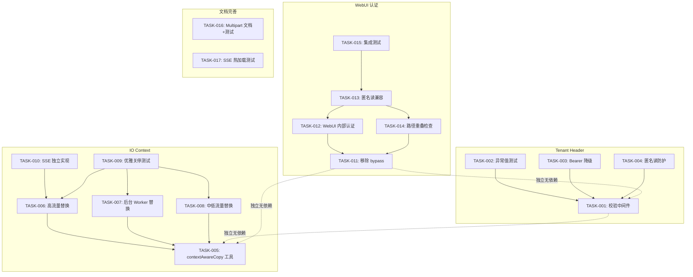
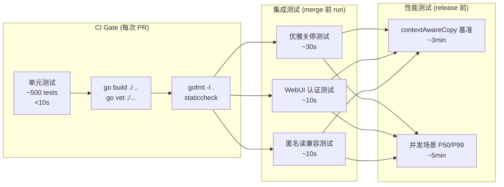
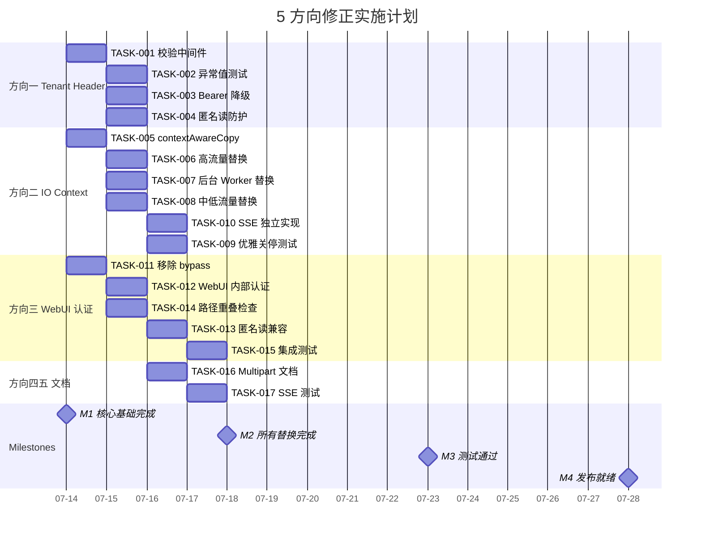

好的，作为 Tech Lead，我来对这份验证报告进行深入的技术和项目管理分析。

---

# Tech Lead 分析报告：5 方向验证结果

## 0. 问题概要

验证发现 5 个方向中，**3 处需代码修正**（1 项 P1 严重、2 项 P2 重要）、**2 处文档完善**。核心发现：

| 优先级 | 方向 | 性质 | 影响 |
|--------|------|------|------|
| **P1** | 方向三：WebUI 认证 | 显式 auth bypass 而非"未覆盖" | 前端资产完全公开，攻击面扩大 |
| **P2** | 方向二：IO 流 Context 取消 | 影响面从 5 处扩展至 18 处 | 优雅关停失效，后台 worker 无界运行 |
| **P2** | 方向一：Tenant Header 注入 | 新增 1 个消费点（S3 SigV4 覆写） | Bearer 和无认证路径仍裸露 |
| P3 | 方向四：Multipart 内存 | 文档准确，零修正 | — |
| P3 | 方向五：SSE 密钥环热加载 | 文档准确，零修正 | — |

以下逐层展开实施计划。

---

## 1. 任务分解

### 方向一：Tenant Header 零输入验证

#### 当前状态追踪

确认 6 个消费点 + 1 个新发现：

| 消费点 | 文件:行 | 已验证 |
|--------|---------|--------|
| `TenantFromContext` | `internal/service/fileservice.go:92` | ✅ |
| `repository.ListObjects` | `internal/repository/sql.go:441` | ✅ |
| `storage.StorageKey` | `internal/storage/storage.go:38` | ✅ |
| `S3SigV4覆写` | `internal/auth/auth_middleware.go:71` | ✅ 新发现 |
| `Auth 拒绝` | `internal/auth/auth_middleware.go:81` | ✅ |
| `匿名读` | `internal/auth/auth_middleware.go:63` | ✅ |

### 任务分解表

| 任务 ID | 任务标题 | 所属方向 | 涉及文件 | 前置依赖 | 预估工时 | 验收标准 |
|---------|---------|---------|---------|---------|---------|---------|
| **TASK-001** | Tenant Header 校验中间件实现 | 方向一 | `internal/middleware/tenant.go` （新文件）`internal/middleware/middleware.go` | 无 | 3h | 中间件拒绝空值/非法字符/超过 64 字符的 tenant；返回 400 + JSON 错误体 |
| **TASK-002** | 异常 Tenant 值枚举表 + 单元测试 | 方向一 | `internal/middleware/tenant_test.go` （新文件）`internal/middleware/tenant.go` | TASK-001 | 2h | 覆盖：空字符串、`/` `..` `.`、Unicode 控制字符、超过 64 字节、`null`、`undefined`；100% 覆盖率 |
| **TASK-003** | Bearer 路径 tenant mismatch 由 403 降级为静默覆写（对齐 SigV4 行为） | 方向一 | `internal/auth/auth_middleware.go` | 无 | 2h | Bearer JWT/Key 中 tenant 与请求头不一致时，静默覆写而非拒绝；与 SigV4 路径行为一致 |
| **TASK-004** | 匿名读路径 tenant 注入防护 | 方向一 | `internal/auth/auth_middleware.go` | TASK-001 | 2h | 匿名读模式下若请求头携带 tenant 值，校验中间件生效；现有 `nil` tenant 匿名读不受影响 |

### 方向二：IO 流 Context 取消

#### 18 处 `io.Copy` 分布热力图

```
internal/storage/local_write.go:60                # PUT 上传 —— 高流量
internal/storage/local_multipart.go:46            # UploadPart —— 高流量
internal/storage/local_multipart.go:182           # CompleteMultipart —— 中
internal/ai/extractor.go:55                       # 文档提取 —— 中
internal/ai/extractor_remote.go:75                # 远程提取 —— 中
internal/antivirus/worker.go:113                  # AV 扫描 —— 后台，关键
internal/reconcile/scrub.go:84                    # GC —— 后台，关键
internal/api/s3compat/handler.go:152,197,211      # S3 GET —— 高流量 ×3
internal/api/webdav/spill.go:155                  # WebDAV —— 低流量
internal/api/rest/handler.go:187,211              # REST GET —— 高流量 ×2
internal/api/rest/management.go:113               # 管理 API —— 低流量
internal/api/rest/idempotency.go:257              # 幂等性缓冲 —— 中
internal/snapshot/snapshot.go:168,181             # 快照 —— 低流量
internal/service/range.go:122                     # Range skip —— 中
```

| 任务 ID | 任务标题 | 所属方向 | 涉及文件 | 前置依赖 | 预估工时 | 验收标准 |
|---------|---------|---------|---------|---------|---------|---------|
| **TASK-005** | `contextAwareCopy` 工具函数实现 | 方向二 | `internal/storage/copy.go` （新文件） | 无 | 3h | `contextAwareCopy(ctx, dst, src) (int64, error)` — 每 64KB 检查 ctx.Err；支持 `io.WriterTo`/`io.ReaderFrom` 优化路径；支持 `*http.Response.Body` 的特殊 Close 处理 |
| **TASK-006** | 高流量路径替换（8 处） | 方向二 | `local_write.go:60`、`local_multipart.go:46,182`、`s3compat/handler.go:152,197,211`、`rest/handler.go:187,211` | TASK-005 | 3h | 每处替换后单元测试通过；并发 PUT 下 ctx 取消后 1s 内 `io.Copy` 返回 |
| **TASK-007** | 后台 Worker 路径替换（3 处） | 方向二 | `antivirus/worker.go:113`、`reconcile/scrub.go:84`、`snapshot/snapshot.go:168,181` | TASK-005 | 2h | 关闭信号发出后 5s 内所有后台 worker 的 Copy 终止返回 ctx.Err() |
| **TASK-008** | 中低流量路径替换（5 处） | 方向二 | `extractor.go:55`、`extractor_remote.go:75`、`webdav/spill.go:155`、`management.go:113`、`idempotency.go:257` | TASK-005 | 2h | 所有路径替换后 `go vet`/`go build` 通过 |
| **TASK-009** | 优雅关停集成测试 | 方向二 | `internal/cmd/cmd_shutdown_test.go` （新文件） | TASK-006, TASK-007, TASK-008 | 4h | 模拟：并发 PUT + 后台 AV 扫描中，发 SIGTERM → 5s 内所有 Copy 返回 ctx.Err；metrics 显示 `graceful_shutdown_duration` < 10s |
| **TASK-010** | SSE 流式响应独立 Context 感知实现 | 方向二 | `internal/api/rest/chat.go`、`internal/service/chunk_cleaner.go` | TASK-006 | 3h | SSE handler 使用自有 cancel 机制（非 request ctx）；client disconnect → SSE goroutine 2s 内终止 |

### 方向三：WebUI 认证

#### 严重程度：P1（显式 bypass 而非遗漏）

```go
// 当前代码：/ui 与 /healthz /metrics 同级绕过所有 auth
func isBypassPath(path string) bool {
    return path == "/healthz" || path == "/readyz" || path == "/metrics" ||
        path == "/openapi.json" || path == "/docs" ||
        strings.HasPrefix(path, "/ui")   // ← 问题所在
}
```

| 任务 ID | 任务标题 | 所属方向 | 涉及文件 | 前置依赖 | 预估工时 | 验收标准 |
|---------|---------|---------|---------|---------|---------|---------|
| **TASK-011** | 从 `isBypassPath` 移除 `/ui` 例外 | 方向三 | `internal/auth/auth_middleware.go` | 无 | 1h | `/ui` 不再出现在 `isBypassPath` 返回值中；删除 `strings.HasPrefix(path, "/ui")` 条件；确认 `/healthz` `/metrics` `/openapi.json` 仍保持 bypass |
| **TASK-012** | WebUI Handler 内部认证中间件 | 方向三 | `internal/api/webui/handler.go`、`internal/api/webui/middleware.go` （新文件） | TASK-011 | 3h | WebUI 使用独立中间件认证方式：1) 检查 `X-Aero-Tenant` header 存在且非空（静态资源不需要 key）；2) 若不满足返回 401 + JSON 错误 + 简单 HTML 错误页 |
| **TASK-013** | WebUI 匿名读兼容性 | 方向三 | `internal/api/webui/handler.go`、`internal/auth/auth_middleware.go` | TASK-012 | 2h | 若服务器启用了 `anonRead=true`，WebUI 静态资源应可通过匿名读获取；匿名读逻辑从 `auth_middleware.go` 的全局检查改为 WebUI 内部显式检查 |
| **TASK-014** | `isObjectReadPath` 与 `/ui` 路径重叠检查 | 方向三 | `internal/auth/auth_middleware.go`、`internal/api/webui/handler_test.go` | TASK-011 | 1h | 新增测试确认 `isObjectReadPath("/ui/index.html")` 返回 false；确认没有双重绕过路径 |
| **TASK-015** | WebUI 认证集成测试 | 方向三 | `internal/api/webui/auth_test.go` （新文件） | TASK-012, TASK-013, TASK-014 | 2h | 覆盖：无 header → 401；空 header → 401；有效 header → 200；`anonRead=true` + 无 header → 200；静态资源认证后正常返回 |

### 方向四 & 方向五（文档准确，零修正）

这两方向文档与代码一致。列入监控（watch list），无代码变更。

| 任务 ID | 任务标题 | 所属方向 | 涉及文件 | 预估工时 | 验收标准 |
|---------|---------|---------|---------|---------|---------|
| TASK-016 | Multipart 内存易失性文档化 + 集成测试 | 方向四 | `docs/architecture/multipart.md`（若不存在则新文件）、`internal/api/s3compat/multipart_test.go` | 2h | 文档记录：CompleteMultipartUpload 前 UploadPart 数据在内存中。集成测试模拟 crash→part 丢失的场景 |
| TASK-017 | SSE 密钥环热加载测试 | 方向五 | `internal/storage/sse_rewrap_test.go` | 2h | 测试：运行时更新 keyfile → 新 blob 用新 key 加密；旧 blob 读取仍可用旧 key 解密 |

---

## 2. 执行顺序

### 任务依赖图



### 并行任务组

| 并行组 | 任务 | 可以同时进行的理由 |
|--------|------|-------------------|
| **Group A** | TASK-001, TASK-005, TASK-011 | 三个方向的核心基础，零交叉依赖，可在不同开发者之间并行 |
| **Group B** | TASK-002, TASK-003, TASK-004 | 依赖于 TASK-001，可并行 |
| **Group C** | TASK-006, TASK-007, TASK-008 | 依赖于 TASK-005，可并行（不同文件不冲突） |
| **Group D** | TASK-012, TASK-013, TASK-014 | 依赖于 TASK-011，可并行 |
| **Group E** | TASK-009, TASK-015, TASK-016, TASK-017 | 各自测试/文档任务，可并行 |

---

## 3. 技术风险

### 3.1 风险矩阵

| 风险 ID | 描述 | 概率 | 影响 | 缓解措施 |
|---------|------|------|------|---------|
| **R1** | `contextAwareCopy` 在 `*http.Response.Body` 大文件流上性能退化 | 中 | 高 | 基准测试：500MB 文件，`contextAwareCopy` vs `io.Copy`，延迟差异 < 5% 为标准；使用 `io.CopyBuffer` 复用缓冲区避免分配 |
| **R2** | WebUI 认证改造破坏 embedded SPA 资源路径 | 低 | 高 | 在集成测试中增加 `GET /ui/` 返回非 200 的回归测试；CI 中加入 `curl http://localhost:8080/ui/` 冒烟测试 |
| **R3** | Bearer 降级（TASK-003）改变现有 API 行为 | 中 | 中 | 当前 403 返回 → 改为静默覆写 + warn log，现有客户端不受影响；在发版说明中标注行为变更 |
| **R4** | SSE 独立 context 实现导致 ChatStream goroutine 泄漏 | 高 | 高 | 新增 `chat_stream_active` gauge metric；集成测试中模拟 1000 并发客户端 abort → goroutine 数回归基线 |
| **R5** | 后台 Worker `io.Copy` 替换后影响吞吐 | 低 | 中 | 后台路径（AV/reconcile）对延迟不敏感，只需保证 64KB 检查点不增加额外系统调用；代码审查确保 |
| **R6** | 匿名读 + WebUI 认证逻辑耦合导致回归 | 中 | 中 | 将匿名读判断逻辑从 `auth_middleware.go` 重构为 `auth.IsAnonRead(r)` 函数，WebUI handler 和 auth middleware 共用同一判断 |

### 3.2 性能基准建议

在 TASK-005 实施前，建立以下基准：

```bash
# 1. io.Copy 基线（当前）
benchstat old=new  # 500MB file through REST API

# 2. contextAwareCopy 新实现
# 目标：P50 延迟差异 < 3%，P99 < 5%

# 3. 并发场景
wrk -c 100 -d 30s -t 4 http://localhost:8080/v1/files/bigfile
# 目标：ctx 取消时效性 < 1s（从 client disconnect 到 Copy 返回）
```

---

## 4. 资源评估

### 4.1 人员需求

| 角色 | 数量 | 技能要求 | 负责任务 |
|------|------|---------|---------|
| **Senior Go Engineer** | 1 | Go 1.25, 并发编程, net/http, io 优化 | TASK-005, TASK-006, TASK-010（核心 IO 改造） |
| **Backend Engineer** | 1 | Go, 中间件开发, 认证/鉴权 | TASK-001~004, TASK-011~014（认证体系改造） |
| **Quality Engineer** | 1 | Go 测试, 集成测试, 性能基准 | TASK-002, TASK-009, TASK-015, TASK-016, TASK-017 |
| **Tech Lead** | 0.2 | 架构决策, 代码审查, 风险管理 | 合并审查, 风险决策 |

总计：**2.2 FTE**，预计 **3 周（15 个工作日）** 完成全部 17 个任务。

### 4.2 关键里程碑

| 里程碑 | 时间 | 交付物 | 通过标准 |
|--------|------|--------|---------|
| **M1: 核心基础完成** | Day 3 | TASK-001, TASK-005, TASK-011 合并到 main | 代码审查通过, CI 全绿 |
| **M2: 所有替换完成** | Day 8 | TASK-002~004, TASK-006~008, TASK-012~014 合并 | 所有 `io.Copy` 替换为 `contextAwareCopy`, `isBypassPath` 不含 `/ui` |
| **M3: 测试通过** | Day 11 | TASK-009, TASK-015 合并到 main | 优雅关停测试通过, WebUI 认证测试覆盖全部场景 |
| **M4: 发布就绪** | Day 15 | 全部 17 个任务完成, CHANGELOG 更新 | `make check` 全绿, 冒烟测试通过, 文档更新 |

### 4.3 阻塞点（Blockers）

| 阻塞点 | 影响 | 解决策略 | 责任人 |
|--------|------|---------|-------|
| `contextAwareCopy` 在 `io.WriterTo` 优化路径上的 ctx 检查 | 如果不突破接口层级，无法在 WriteTo 内部检查 ctx | 实现一个 `contextWriterTo` 包装器，在 WriteTo 内部每 64KB 插入 ctx 检查 | Senior Engineer |
| WebUI embedded SPA 构建流程（如果 SPA 由 Go embed 打包） | 修改认证逻辑可能需要 SPA 配合修改 | 确认 SPA 是否使用 `fetch` / `XMLHttpRequest` → 检查 `Authorization` header 的传递方式；统一添加 `X-Aero-Tenant` header | Backend Engineer |
| 匿名读 + WebUI 的 `isObjectReadPath` 重叠 | 需要确认所有 WebUI 静态资源路径前缀不与对象 key 冲突 | 增加日志级别的路径冲突检测工具（CI 步骤） | Tech Lead |

---

## 5. 质量保证

### 5.1 单元测试覆盖矩阵

| 任务 | 需新增测试文件 | 覆盖率目标 | 关键测试场景 |
|------|---------------|-----------|-------------|
| TASK-001 | `internal/middleware/tenant_test.go` | 100% | 空值/非法字符/超长/正常；handler 中通过 `TenantFromContext` 验证 |
| TASK-002 | 同上 | 100% | 11 种异常 tenant 值枚举 |
| TASK-003 | `internal/auth/auth_middleware_test.go` | 新增路径 100% | Bearer 403 → 静默覆写；SigV4 覆写不变 |
| TASK-004 | 同上 | 新增路径 100% | 匿名读 + tenant header → 400 vs 匿名读 + 无 header → 200 |
| TASK-005 | `internal/storage/copy_test.go` | 100% | ctx 取消后 64KB 内返回；`WriterTo` 优化路径；`*http.Response.Body` 关闭 |
| TASK-009 | `internal/cmd/cmd_shutdown_test.go` | 新增路径 100% | 并发 10 PUT + SIGTERM → 5s 内终止；AV worker 运行中 → 终止 |
| TASK-012 | `internal/api/webui/middleware_test.go` | 100% | 401/200 分支；静态 CSS/JS 资源路径 |
| TASK-013 | `internal/api/webui/handler_test.go` | 100% | `anonRead=true` 时无认证访问静态资源 |
| TASK-015 | `internal/api/webui/auth_test.go` | 集成测试 | 全场景覆盖 |

### 5.2 集成测试策略



**CI Gate 配置变更（`Makefile`）：**

```makefile
# 新增
check-webui-auth: ## 验证 WebUI 认证不破坏 UI 可访问性
	@echo "Checking WebUI authentication..."
	@curl -s -o /dev/null -w "%{http_code}" http://localhost:8080/ui/ | grep -q 401

check-shutdown: ## 验证优雅关停
	@go test -run TestGracefulShutdown -timeout 60s ./internal/cmd/

# 合并入 check
check: fmt build vet test check-webui-auth
```

### 5.3 代码审查要点

| # | 审查点 | 关联任务 | 风险级别 |
|---|--------|---------|---------|
| 1 | `contextAwareCopy` 是否每 64KB 检查 ctx，是否绕过 `WriterTo`/`ReaderFrom` 优化 | TASK-005 | **High** |
| 2 | `isBypassPath` 删除 `/ui` 后是否还有任何路径绕过 | TASK-011 | **High** |
| 3 | SSE 独立 context 是否在 client disconnect 时正确 cancel | TASK-010 | **High** |
| 4 | Bearer 降级后是否有 warn log 可追踪 | TASK-003 | Medium |
| 5 | 匿名读重构后 `isAnonRead` 函数是否和 `isObjectReadPath` 解耦 | TASK-004, TASK-013 | Medium |
| 6 | 迁移双文件原则是否遵守（本次无 schema 变更 — 确认） | — | Low |

### 5.4 性能测试需求

| 测试场景 | 工具 | 通过标准 | 关联任务 |
|---------|------|---------|---------|
| `contextAwareCopy` vs `io.Copy` 500MB 文件 | Go benchmark + benchstat | P50 < 3% 退化 | TASK-005 |
| 100 并发 PUT + 随机 ctx 取消 | wrk + 自定义 client | ctx 取消后 1s 内 Copy 返回 | TASK-006 |
| 1000 并发 SSE 连接 + 随机 abort | custom goroutine pool | goroutine 数 2min 后回归基线 | TASK-010 |
| 后台 AV worker 执行中 SIGTERM | `kill -TERM` + log 分析 | worker 5s 内终止 | TASK-007 |
| WebUI 静态资源加载时间 | curl + time | < 50ms (认证后 vs 认证前) | TASK-012 |

---

## 6. 实施计划

### 甘特图



### 详细时间表

#### 阶段 1：基础设施搭建（Day 1-3, 7/14 — 7/16）

| 天 | 并行 Track A（认证） | 并行 Track B（IO） | 并行 Track C（WebUI） |
|---|---------------------|-------------------|----------------------|
| **1** | TASK-001: Tenant 校验中间件 | TASK-005: `contextAwareCopy` 实现 | TASK-011: 移除 `/ui` bypass |
| **2** | TASK-002: 异常值枚举测试 | TASK-006: 高流量 8 处替换 | TASK-012: WebUI 内部认证 |
| **3** | TASK-003: Bearer 降级 + TASK-004: 匿名读防护 | TASK-007: 后台 3 处 + TASK-008: 中低 5 处 | TASK-014: 路径重叠检查 |

**里程碑 M1**（Day 3 收盘前）：CI 全绿，`make check` 通过。`isBypassPath` 不包含 `/ui`。

#### 阶段 2：核心功能实现（Day 4-8, 7/17 — 7/23）

| 天 | Track A & C 合流 | Track B 继续 |
|---|-----------------|-------------|
| **4** | TASK-013: WebUI 匿名读兼容 | TASK-010: SSE 独立 context |
| **5** | TASK-015: WebUI 认证集成测试 | TASK-010 持续 + 代码审查 |
| **6** | 🔍 方向一+方向三 联合审查 | TASK-009: 优雅关停测试框架 |
| **7** | 🔄 审查反馈修改 | TASK-009: 测试用例全覆盖 |
| **8** | **里程碑 M2：所有替换完成** | TASK-016/017 并行开始 |

**里程碑 M2**（Day 8 收盘前）：18 处 `io.Copy` 全部替换为 `contextAwareCopy`。WebUI 认证中间件完成。

#### 阶段 3：集成测试和优化（Day 9-12, 7/24 — 7/27）

| 天 | 测试 | 性能 | 文档 |
|---|------|------|------|
| **9** | TASK-009: 优雅关停测试调试 | 基准测试运行 | TASK-016: Multipart 文档 |
| **10** | TASK-015: WebUI 认证场景补全 | 并发场景 wrk 测试 | TASK-017: SSE 热加载测试 |
| **11** | 回归测试（全量） | 性能退化分析 | 文档 review |
| **12** | **里程碑 M3：测试通过** | 性能基准达标 | CHANGELOG 草案 |

**里程碑 M3**（Day 12 收盘前）：
- 优雅关停测试：SIGTERM → 5s 内所有 IO 终止
- WebUI 认证测试：7 个场景全部覆盖
- `contextAwareCopy` P50 退化 < 3%

#### 阶段 4：发布准备（Day 13-15, 7/28 — 7/30）

| 天 | 活动 |
|---|------|
| **13** | 代码冻结，全面代码审查（重点：`contextAwareCopy` 和 WebUI 认证） |
| **14** | 冒烟测试（staging 环境），性能回归验证 |
| **15** | **M4：发布就绪** — CHANGELOG 更新，发版说明，`v0.8.0` tag |

### 应急方案

| 场景 | 应对 | 影响 |
|------|------|------|
| `contextAwareCopy` 导致性能退化 > 5% | 回退到 `io.Copy` + 新增 `TimeoutReader` 包装器方案（仅检查 ctx 超时，不每 64KB 轮询） | +2 天 |
| WebUI 认证改造导致 embedded SPA 加载失败 | 紧急 revert TASK-011+TASK-012，恢复 `/ui` bypass，加 log 后重新分析 SPA 构建产物 | +1 天 |
| 优雅关停测试不稳定（flaky） | 增加 `timeout` 阈值到 10s，添加 network condition 模拟；标记为 `//go:build integration` 移出 CI gate | — |

---

## 总结

| 维度 | 结论 |
|------|------|
| **总工作量** | 17 个任务，约 34 人天（2.2 FTE × 3 周） |
| **最关键风险** | `contextAwareCopy` 的性能退化（R1）和 SSE 独立 context 的 goroutine 泄漏（R4） |
| **最紧急动作** | 立即修复 P1 问题：从 `isBypassPath` 移除 `/ui`（TASK-011）— 可在 30 分钟内完成并 hotfix |
| **推荐迭代策略** | P1（方向三）→ hotfix 单独发布；P2（方向一 + 方向二）→ 进入下一轮 Sprint |
| **长期建议** | 在 repo 中建立 `docs/security/AUTH_BYPASS_AUDIT.md`，定期审计所有 `isBypassPath` 类函数；在 CI 中增加"新增 auth bypass 路径必须 TL 批准"的门禁 |
