现在我对代码库有了全面了解。让我提供全面的技术负责人分析。

---

# 技术负责人分析：高价值企业扩展方向

> **分析日期：** 2026-07-12  
> **基于：** `docs/requirements/expansion-v127-high-value-enterprise-directions.md`  
> **Sprint 上下文：** `CURRENT_SPRINT.md`（已关闭的全栈集成冲刺）— 这些方向构成了下一个重点冲刺的内容

---

## 1. 任务分解

将五个方向拆解为可执行的工作单元。每个任务为 **2–4 小时**，符合 `AGENTS.md` 的单函数/单文件约束。

### 1.1 方向 1 — 企业身份联合（P1）

| 任务 ID | 标题 | 涉及文件 | 前置依赖 | 预估工时 |
|---------|------|---------|---------|---------|
| **FED-01** | JWKS 端点 + RS256/ES256 支持 | `internal/auth/jwt.go`, `internal/auth/jwt_test.go` | 无 | 3h |
| **FED-02** | `/.well-known/jwks.json` HTTP 端点 | `internal/api/rest/router.go`, `internal/api/rest/openapi.go` | FED-01 | 2h |
| **FED-03** | `OIDCProvider` 结构体 + 发现逻辑 | `internal/auth/oidc.go`（新文件） | FED-01 | 3h |
| **FED-04** | 租户感知的 IdP 选择（认证中间件动态路由） | `internal/auth/auth_middleware.go`, `internal/config/config.go` | FED-03 | 3h |
| **FED-05** | OAuth2 授权码 + PKCE 流程（login/callback/token 端点） | 新路由在 `internal/api/rest/router.go`，新 handler 在 `internal/api/rest/oauth.go` | FED-04 | 4h |
| **FED-06** | 声明提取 → 租户/范围映射插件接口 | `internal/auth/claims.go`（新文件），`internal/auth/auth.go` 中的 `ClaimsMapper` | FED-04 | 3h |
| **FED-07** | 短期会话存储（Redis 或内存，最简 cookie） | `internal/auth/session.go`（新文件） | FED-05 | 2h |
| **FED-08** | OIDC 集成测试（httptest 模拟 + dex Docker Compose） | `internal/integration/oidc_test.go`（新文件） | FED-05, FED-06 | 3h |

### 1.2 方向 2 — API 生命周期治理（P2）

| 任务 ID | 标题 | 涉及文件 | 前置依赖 | 预估工时 |
|---------|------|---------|---------|---------|
| **API-01** | API 版本中间件（Accept header / URL 前缀检测） | `internal/middleware/version.go`（新文件） | 无 | 2h |
| **API-02** | 版本感知的响应编码器（DTO per version） | `internal/api/rest/dto.go`（重构），`internal/api/rest/dto_v2.go`（新文件） | API-01 | 4h |
| **API-03** | 废弃头注入（Deprecation / Sunset） | `internal/middleware/deprecation.go`（新文件） | API-01 | 2h |
| **API-04** | 合约测试套件（golden file 模式） | `internal/api/contract/`（新包），golden JSON 文件 | API-02 | 4h |
| **API-05** | OpenAPI 自动生成管线 | `internal/api/rest/openapi.go`（重构），代码注解 | API-02 | 4h |
| **API-06** | chi 路由版本化分组（`/v1`, `/v2` 的 `Route` 分组） | `internal/api/rest/router.go`（重构） | API-02 | 3h |

### 1.3 方向 3 — 存储后端韧性（P1）

| 任务 ID | 标题 | 涉及文件 | 前置依赖 | 预估工时 |
|---------|------|---------|---------|---------|
| **STR-01** | 多后端路由 Storage 抽象 | `internal/storage/router.go`（新文件），`internal/storage/storage.go`（添加 `Router` 接口） | 无 | 4h |
| **STR-02** | 存储后端健康检查 + 故障检测 | `internal/storage/health.go`（新文件） | STR-01 | 3h |
| **STR-03** | 基于健康状况的故障转移逻辑 | `internal/storage/router.go`（扩展） | STR-01, STR-02 | 3h |
| **STR-04** | 断路器可观测性（Prometheus gauges） | `internal/storage/circuitbreaker.go`, `internal/telemetry/metrics.go` | STR-02 | 2h |
| **STR-05** | Multipart `CompleteMultipart` 事务修复 | `internal/storage/local_multipart.go`（重构） | 无 | 3h |
| **STR-06** | 存储迁移 Worker | `internal/migration/`（新包），`internal/jobs/` — 注册 `JobMigrateObject` | STR-01 | 4h |
| **STR-07** | 多后端集成测试（双后端模拟 + 断路器测试） | `internal/storage/router_test.go`, `internal/storage/storage_test.go` | STR-03, STR-05 | 4h |

### 1.4 方向 4 — 元数据可扩展性（P1）

| 任务 ID | 标题 | 涉及文件 | 前置依赖 | 预估工时 |
|---------|------|---------|---------|---------|
| **MDS-01** | 复合索引迁移（双数据库文件） | `migrations/{sqlite,postgres}/0025_composite_idx.{up,down}.sql` | 无 | 2h |
| **MDS-02** | Keyset 分页重构 `ListObjects` | `internal/repository/sql_objects.go`（重构 `ListObjects`） | MDS-01 | 3h |
| **MDS-03** | Postgres 连接池配置 + 读副本包装器 | `internal/repository/postgres.go`, `internal/config/config.go` | 无 | 3h |
| **MDS-04** | 向量列分离（TOAST / 分区表策略） | `internal/repository/sql_chunks.go`, 迁移 `0026_vector_separation` | MDS-01 | 4h |
| **MDS-05** | 事务边界收缩（writePutObject 解耦） | `internal/service/file_crud.go`（重构） | 无 | 4h |
| **MDS-06** | 可扩展性基准测试 | `internal/repository/bench_test.go`（新文件） | MDS-02, MDS-03, MDS-04 | 3h |
| **MDS-07** | `soft_deleted_at` 部分索引 | `migrations/{sqlite,postgres}/0027_soft_delete_idx.{up,down}.sql` | MDS-01 | 1h |

### 1.5 方向 5 — 运行时配置和功能标志（P2）

| 任务 ID | 标题 | 涉及文件 | 前置依赖 | 预估工时 |
|---------|------|---------|---------|---------|
| **CFG-01** | 功能标志基础设施（`FlagStore` 接口 + `Flag` 类型） | `internal/feature/`（新包） | 无 | 4h |
| **CFG-02** | 运行时日志级别（`slog.LevelVar` + admin 端点） | `internal/middleware/logging.go`, `internal/api/rest/management.go` | 无 | 2h |
| **CFG-03** | 动态限流器（atomic 变量 + PUT /v1/admin/ratelimit） | `internal/middleware/ratelimit.go`（重构） | 无 | 3h |
| **CFG-04** | AI Provider 热切换代理 | `internal/ai/switchable.go`（新文件），`cmd/server/main.go`（重构） | 无 | 4h |
| **CFG-05** | 功能标志管理端点（GET/PUT/DELETE /v1/admin/flags） | `internal/api/rest/management.go`（扩展） | CFG-01 | 3h |
| **CFG-06** | YAML/TOML 文件配置观察器（fsnotify） | `internal/config/watcher.go`（新文件） | CFG-01 | 3h |

---

## 2. 执行顺序

### 依赖图

```mermaid
graph TD
    subgraph "阶段 1 — 基础设施（第 1–2 周）"
        MDS_01["MDS-01: 复合索引"]
        MDS_03["MDS-03: 连接池配置"]
        MDS_07["MDS-07: 软删除索引"]
        STR_05["STR-05: Multipart 事务修复"]
        CFG_02["CFG-02: 运行时日志级别"]
        CFG_03["CFG-03: 动态限流器"]
        FED_01["FED-01: JWKS + RS256"]
        API_01["API-01: 版本中间件"]
    end

    subgraph "阶段 2a — 存储韧性核心"
        MDS_01 --> MDS_02["MDS-02: Keyset 分页"]
        MDS_03 --> MDS_04["MDS-04: 向量列分离"]
        MDS_02 --> MDS_06["MDS-06: 基准测试"]
        MDS_04 --> MDS_06
        MDS_07 --> MDS_02
        STR_01["STR-01: 路由抽象"] --> STR_02["STR-02: 健康检查"]
        STR_01 --> STR_06["STR-06: 迁移 Worker"]
        STR_02 --> STR_03["STR-03: 故障转移"]
        STR_02 --> STR_04["STR-04: 断路器可观测性"]
        STR_03 --> STR_07["STR-07: 多后端测试"]
        STR_05 --> STR_07
        STR_06 --> STR_07
    end

    subgraph "阶段 2b — 身份联合核心"
        FED_01 --> FED_02["FED-02: JWKS 端点"]
        FED_01 --> FED_03["FED-03: OIDCProvider"]
        FED_03 --> FED_04["FED-04: 租户感知 IdP"]
        FED_04 --> FED_05["FED-05: OAuth2 流程"]
        FED_04 --> FED_06["FED-06: Claims 映射"]
        FED_05 --> FED_07["FED-07: 会话存储"]
        FED_05 --> FED_08["FED-08: OIDC 测试"]
        FED_06 --> FED_08
    end

    subgraph "阶段 2c — API 治理基础"
        API_01 --> API_02["API-02: 版本化 DTO"]
        API_02 --> API_03["API-03: 废弃头"]
        API_02 --> API_04["API-04: 合约测试"]
        API_02 --> API_05["API-05: OpenAPI 自动生成"]
        API_02 --> API_06["API-06: 路由分组"]
    end

    subgraph "阶段 2d — 功能标志"
        CFG_01["CFG-01: Flag 基础设施"] --> CFG_05["CFG-05: 标志端点"]
        CFG_01 --> CFG_04["CFG-04: AI Provider 热切换"]
        CFG_01 --> CFG_06["CFG-06: 文件观察器"]
    end

    subgraph "阶段 3 — 集成和收尾"
        API_04 --> INT["集成测试套件"]
        FED_08 --> INT
        STR_07 --> INT
        MDS_05["MDS-05: 事务边界收缩"] --> INT
        CFG_04 --> INT
    end
```



### 并行组

| 并行组 | 任务 | 原因 |
|---------|------|------|
| **组 A**（阶段 1） | MDS-01, MDS-03, MDS-07, STR-05, CFG-02, CFG-03, FED-01, API-01 | 零依赖独立任务 |
| **组 B**（阶段 2a） | STR-01→STR-02→STR-03, STR-06, MDS-02, MDS-04 | 存储韧性有自己的依赖链 |
| **组 C**（阶段 2b） | FED-02→FED-03→FED-04→FED-05→FED-08, FED-06 | 身份的线性依赖链 |
| **组 D**（阶段 2c） | API-02→API-04, API-05, API-06 | 共享 API-02，但后续独立 |
| **组 E**（阶段 2d） | CFG-01→CFG-04, CFG-05, CFG-06 | 共享 CFG-01 基础设施 |

---

## 3. 技术风险

### 3.1 高风险项

| 风险 | 方向 | 影响 | 缓解措施 |
|------|------|------|---------|
| **OIDC 会话状态**（FED-07） | 1 | 范式从无状态转变为有状态；需要会话存储（Redis/mem）。架构复杂性和运维负担 | 尽可能保持无状态：将 OIDC 令牌缓存限制为短期（5 分钟），使用加密 cookie，避免持久化会话存储。将 Redis 设为可选而非强制 |
| **JWKS 缓存失效延迟**（FED-01） | 1 | 如果远程 IdP 轮换密钥但系统使用缓存公钥，JWKS TTL 内的所有 JWT 验证都失败。IdP 主动轮换密钥时出现生产级事故 | 考虑短 TTL（60 秒）+ 后台刷新（使用 `key_cache.go` 的 TTL/大小模式）。添加 `POST /v1/admin/flush-jwks-cache` 用于紧急操作 |
| **路由双写一致性**（STR-01/03） | 3 | 主备写入期间的部分故障可能导致不一致：某些 blob 在主站上，某些在备用站上，无协调 | 启动时使用同步双写（两个后端都确认后再返回 200）。用户添加可选异步路径。同步双写的 P99 延迟影响必须通过基准测试量化 |
| **SQLite 顺风车**（MDS 全部） | 4 | SQLite 工作在 <50K 对象上，但 SQLite-优先设计使 Postgres 优化更困难。SQLite 的 `MaxOpenConns=1` 意味着任何长查询（如暴力搜索 chunk）都会阻塞写入 | 在最坏情况下测量 SQLite 写入 P99：`go test -benchmem -run='^$' -bench=BenchmarkSQLiteWriteConcurrent ./internal/repository/`。在 50K 标记处记录明确的切换文档 |
| **MDS-05 的补偿事务** | 4 | 存储写入成功但元数据写入失败导致孤儿 blob。需要补偿（清理）逻辑 | 添加专用于 GC 的孤儿检测器：`cron` 扫描本地/远程后端正与元数据对比的 blob。使用幂等 blob 键，因此重试-safe。**不**使用两阶段提交（过度复杂） |
| **功能标志扩散**（CFG-01） | 5 | 每个功能都带运行时标志，导致测试组合爆炸（`n` 个功能 = `2ⁿ` 种状态） | 限制范围：每个 sprint 不超过 3 个活动标志。当功能 GA 时删除标志代码。添加 CI 门控以禁止 >5 个活动标志 |
| **OpenAPI 自动生成**（API-05） | 2 | 生成管线可能产生脆弱或不可读的 spec。`ogen`/`swaggo` 有复杂的构建约束 | 从 `ogen` 的轻量级注解开始，不进行完整的代码生成。将生成的 spec 与已验证的 golden file 比较。替换静态 JSON 之前先在 CI 中作为可选 lint 运行 |

### 3.2 外部依赖风险

| 依赖 | 方向 | 风险 | 回退计划 |
|------|------|------|---------|
| OIDC 兼容 IdP（Okta/Azure AD/Keycloak） | 1 | 集成测试需要一个真实的 IdP。`dex` 或 `hydra` 的 Docker 镜像可能很大 | 在 `httptest` 中使用模拟的 OIDC 服务器进行单元测试；集成测试在单独的 CI 矩阵条目中（不在 `make check` 中） |
| Qdrant / pgvector | 4 | 向量搜索已经是可选的；分离编排增加了边界复杂性 | 保持搜索后端与元数据存储解耦。使用 `go:build integration` 标签 |
| etcd / Consul / Redis | 5 | 功能标志需要一个配置存储。添加基础设施依赖性 | 从内存存储开始；添加可插拔的 `FlagStore` 接口。Redis 对等传播通过 Postgres `LISTEN/NOTIFY` |

### 3.3 性能瓶颈

| 瓶颈 | 方向 | 现状 | 目标 |
|------|------|------|------|
| `ListObjects` 带前缀过滤 | 4 | 全表扫描 + 内存排序。10K 对象 >500ms | 复合索引 + keyset 分页。50K 对象 <100ms |
| 暴力搜索 chunk | 4 | O(n) 内存加载所有向量 | 使用 pgvector 索引或 Qdrant 的 HNSW（O(log n)）。基线：100K chunks，暴力扫描 ≈ 500MB 内存 |
| 同步双写 | 3 | N/A（不存在） | P99 延迟 +30-50ms（S3 往返）。以 10 个并发 blob 进行基准测试 |
| OIDC 令牌验证 | 1 | N/A（不存在） | 首次验证：200ms（JWKS 获取）。后续：<1ms（缓存）。缓存 `kid→key` 避免解析 |

### 3.4 测试覆盖难点

| 难点 | 方向 | 原因 | 策略 |
|------|------|------|------|
| 多后端组合 | 3 | 2 个后端 × 3 种状态（健康/降级/宕机）= 9 种组合 | 基于表的测试与 `Storage` 模拟。为每个测试场景编写小型模拟服务器 |
| OIDC 流程 | 1 | 重定向流程难以单元测试；cookie 需要 HTTP 客户端 | 使用 `httptest.NewServer` 作为 IDP 模拟。`httptest.NewRecorder` 用于 cookie 检查 |
| 功能标志竞态 | 5 | 标志在运行时变化；处理一个请求时标志翻转 | 只允许在请求边界改变标志。每个请求读取标志一次并通过上下文传递 |
| 对象创建期间的事务边界 | 4 | 存储写入成功，事务提交失败 — 孤儿 blob | 集成测试强制故障并运行孤儿检测器。断言没有 dangling blob |

---

## 4. 资源评估

### 4.1 团队组成

| 角色 | 数量 | 技能要求 | 主要方向 |
|------|------|---------|---------|
| **高级 Go 后端工程师** | 2 | Go 1.25、SQL 优化、分布式系统 | 存储韧性（方向 3）、元数据扩展性（方向 4） |
| **安全/认证工程师** | 1 | OAuth2/OIDC、JWT/JWKS、安全认证 | 身份联合（方向 1） |
| **平台/基础设施工程师** | 1 | 功能标志、配置管理、可观测性 | 运行时配置（方向 5）、API 治理（方向 2） |
| **QA 工程师** | 1 | Go 测试、集成测试、基准测试 | 所有方向的测试基础设施 |
| **技术负责人** | 1 | 架构、代码审查、风险管理 | 监督、STC 决策、依赖图 |

**总计：** 5-6 人（或 3-4 名高级+通才工程师，如果重叠技能的话）

### 4.2 时间线

**总工期估算：** 11–13 周（严格按照 5 个方向、29 个任务、每个任务平均 3 小时，但考虑上下文切换 + 审查 + 修复）

| 里程碑 | 截止时间 | 交付物 |
|---------|---------|---------|
| **M0** — 基础就绪 | 第 1 周结束 | 阶段 1 完成（3 P1 方向各 2+ 个 PR — JWKS、索引、断路器指标、Multipart 修复） |
| **M1** — 存储韧性核心 | 第 3 周结束 | 多后端路由、健康检查、故障转移、迁移 Worker 全部合并。断路器通过集成套件 |
| **M2** — 身份联合核心 | 第 4 周结束 | OIDC 流程通过、SSO 登录/回调端点在 `httptest` 模拟中端到端工作 |
| **M3** — 性能基础 | 第 5 周结束 | ListObjects + SearchChunks 在 50K 对象基准测试中通过性能门控 |
| **M4** — API 治理 | 第 7 周结束 | 版本中间件、合约测试套件、OpenAPI 自动生成上线。`make check` 包括合约测试 |
| **M5** — 配置系统 | 第 8 周结束 | 功能标志、运行时日志、动态限流器、AI Provider 切换全部可操作 |
| **M6** — 韧性完成 | 第 10 周结束 | 集成测试覆盖所有方向。断路器在混沌测试中验证 |
| **M7** — GA 发布 | 第 12 周结束 | 所有 5 个方向已记录、性能基准已发布、OpenAPI 文档是最新的 |

### 4.3 阻塞点和解决策略

| 阻塞点 | 方向 | 解决策略 |
|---------|------|---------|
| OIDC 需要登录页面 UI | 1 | 不阻塞。使用 `GET /v1/auth/login` 重定向到 IdP。浏览器处理登录页面 UI。Web UI 后续增强 |
| 存储迁移需要双写一致性 | 3 | 从"同步双写"开始。异步（通过 EventBus）作为 v2。同步双写在 50ms P99 开销以下可接受 |
| SQLite 在 50K 处不是真正的阻塞 | 4 | 推迟 SQLite→Postgres 迁移边界。到那时保持文档清晰。不要破坏 SQLite |
| 合约测试减慢 CI | 2 | 保持 golden file 很小（每个端点 1-2 KB）。对合约套件使用 `-short` 跳过，除非需要 |
| Feature Flag 风暴 | 5 | 在 `internal/feature/` 中设置 `MaxActiveFlags: 5`。违反时 CI 门控 |

---

## 5. 质量保证

### 5.1 单元测试覆盖要求

| 包 | 当前覆盖率 | 目标覆盖率 | 关键测试类型 |
|----|-----------|-----------|-------------|
| `internal/auth/` | ~70% | 80%+ | JWKS 缓存、OIDC 发现、声明映射、会话存储 |
| `internal/storage/` | ~85% | 90%+ | 断路器状态、多后端路由、故障转移回退、Multipart 原子性 |
| `internal/repository/` | ~75% | 85%+ | Keyset 分页、复合索引扫描、连接池耗尽、读副本回退 |
| `internal/middleware/` | ~60% | 80%+ | 版本协商、废弃头、功能标志上下文注入 |
| `internal/feature/` | — | 85%+ | FlagStore CRUD、并发读写、TTL 过期、回退默认值 |
| `internal/migration/` | — | 70%+ | 迁移 Worker 工作流、可恢复性、幂等重试 |

### 5.2 集成测试策略

| 测试套件 | 触发器 | 方向 | 基础设施 |
|---------|--------|------|-----------|
| `TestOIDCFlow` | `make test-integration` | 1 | `ory/hydra` Docker 容器 + `httptest` 模拟 |
| `TestMultiBackendFailover` | `make test`（模拟） / `make test-integration`（真实） | 3 | 双 `httptest` S3 服务器模拟 + `inmem` 存储 |
| `TestTransactionalMultipart` | `make test` | 3 | SQLite temp + local FS temp |
| `TestListObjectsPagination` | `make test` | 4 | 50K 对象负载生成器（在 `-count=1` 下 2 秒） |
| `TestFeatureFlagConcurrency` | `make test` | 5 | 并发的标志写入 + 读取（`go test -race`） |
| `TestAPICompatibility` | `make test` | 2 | Golden file 差异检测（`-update` 标志用于生成） |

### 5.3 代码审查要点

每个 PR 必须由至少 **1 名技术负责人** + **1 名领域专家**审查。检查清单：

| 方向 | 审查重点 |
|------|---------|
| **全部** | `AGENTS.md` 的前后一致：无文件 >500 行，无函数 >50 行，圈复杂度 ≤10 |
| **1 — 身份** | 不自建加密；令牌验证路径中无泄露；JWKS 缓存在错误时优雅回退；`aud` 声明始终校验 |
| **2 — API 治理** | DTO 向后兼容（新字段不改变旧序列化）；合约测试捕获回归；废弃头有未来日期 |
| **3 — 存储韧性** | 双写时无数据竞争（`-race` 必须通过）；断路器从不硬阻断 — 有 `half-open` 探测 |
| **4 — 元数据** | 所有新查询 EXPLAIN ANALYZED；迁移向上/向下是对称的；keyset 分页保持排序稳定 |
| **5 — 配置** | 功能标志关闭 = 编译时默认值（fail-closed）；无锁读路径；审计日志涵盖配置变更 |

### 5.4 性能测试需求

| 基准测试 | 方向 | 测量 | 通过条件 |
|---------|------|------|---------|
| `BenchmarkListObjects` | 4 | 带前缀过滤的延迟（第 1 页、第 50 页、第 100 页） | P99 <200ms 在 50K 对象时 |
| `BenchmarkSearchChunks` | 4 | `chunks` 表的 qps+延迟（暴力 vs 索引） | 索引后 P99 提升 >10 倍 |
| `BenchmarkDualWrite` | 3 | 同步双写 P99 延迟开销（相对于单后端） | P99 开销 <80ms 在 r=100 时 |
| `BenchmarkJWTVerify` | 1 | RS256 JWT 验证 + 缓存 vs 无缓存 | 第一次 >5 ops/s；缓存后 >100K |
| `BenchmarkFlagRead` | 5 | 每个请求的标志读取纳秒开销（内存 vs etcd） | 内存 <500ns；etcd <5ms |

---

## 6. 实施计划

### 阶段 1：基础设施搭建（第 1 周 — 5 天）

**并行启动所有 P1 方向的零依赖任务。**

```
第 1-2 天： FED-01（JWKS + RS256）          —— 身份联合的基石
             STR-05（Multipart 事务修复）    —— 低风险、高价值修复
             MDS-01（复合索引迁移）          —— 索引是所有查询优化的前提
             MDS-07（软删除索引）            —— 附在 MDS-01 上

第 3-4 天： FED-03（OIDCProvider）           —— 建立在 FED-01 之上
             STR-01（路由 Storage 抽象）     —— 长期存储韧性的核心抽象
             MDS-03（连接池 + 读副本）       —— 零风险配置注入
             CFG-02（运行时日志级别）        —— 快速、独立的胜利
             API-01（版本中间件）            —— 非侵入性中间件

第 5 天：    审查并合并阶段 1 的所有 PR。更新 `docs/CHANGELOG.md`。运行 `make check`（全覆盖）。
```

**阶段 1 交付物：**
- JWKS 端点 (`/.well-known/jwks.json`)
- RS256 JWT 签发 + 验证
- OIDC 发现基础设施（结构体 + 缓存）
- Multipart 原子性修复
- 复合索引（`objects` + `chunks` + `soft_delete`）通过迁移
- Postgres 连接池配置（`SetMaxOpenConns`, `SetMaxIdleConns`, `SetConnMaxLifetime`）
- 运行时日志级别 admin 端点
- API 版本检测中间件
- 路由 Storage 接口定义

---

### 阶段 2a：存储韧性核心（第 2-3 周）

```
第 6-7 天：  STR-02（健康检查 + 故障检测）        —— 建立在 STR-01 之上
第 8-9 天：  STR-03（故障转移逻辑）                —— 韧性的核心
第 10 天：   STR-04（断路器可观测性）              —— 运维可见性
第 11-12 天：STR-06（迁移 Worker）                 —— 跨后端对象迁移
第 13-14 天：STR-07（多后端集成测试）              —— 验证一切
```

**阶段 2a 交付物：**
- 多后端路由（存储类别/租户感知）
- 健康检查（3 次失败 → 标记为宕机）
- 同步双写（主 + 确认）
- `storage_breaker_state`, `storage_breaker_failures_total` 指标
- 迁移 Worker（`internal/migration/`, `JobMigrateObject`）
- 集成测试：主宕机 → 备接管 → 自我修复 → 重新同步

---

### 阶段 2b：身份联合核心（第 2-4 周）

```
第 6-7 天：  FED-04（租户感知 IdP 选择）         —— 多 IdP 多路复用
第 8-10 天： FED-05（OAuth2 授权码 + PKCE）       —— SSO 体验的核心
第 11 天：   FED-06（声明提取 → 租户映射）        —— 身份到权限的管道
第 12 天：   FED-07（短期会话存储）               —— cookie-based 状态
第 13-14 天：FED-08（OIDC 集成测试 + 模拟）       —— 完善
```

**阶段 2b 交付物：**
- `GET /v1/auth/login` — 重定向到 IdP
- `GET /v1/auth/callback` — 授权码 → 令牌交换
- `POST /v1/auth/token` — 令牌自省/刷新
- `ClaimsMapper` 接口 + 租户配置
- 加密会话 cookie（可选 Redis）
- `dex` Docker 集成测试
- `AUTH_OIDC_*` 配置变量

---

### 阶段 2c：元数据扩展性（第 2-5 周）

```
第 6-7 天：  MDS-02（Keyset 分页重构）            —— 深度分页修复
第 8-10 天： MDS-04（向量列分离）                 —— 搜索查询优化
第 11-12 天：MDS-05（事务边界收缩）               —— 减少锁争用
第 13-15 天：MDS-06（可扩展性基准测试）           —— 验证、门控、文档
```

**阶段 2c 交付物：**
- `ListObjects` 使用 keyset 分页（无 `OFFSET`）
- 向量列存储分离（TOAST / 单独表）
- `writePutObject` 中更小的事务窗口：先持久化存储 → 再提交元数据；失败 → 孤儿检测器
- 基准测试门控：50K 对象 <200ms P99
- `REPOSITORY_SCALABILITY.md` 文档：SQLite ≤50K，Postgres ≥50K

---

### 阶段 2d：API 生命周期 + 功能标志（第 4-7 周，与上层并行）

```
第 8-10 天： API-02（版本化 DTO）                  —— 大工作项目
第 11 天：   API-03（废弃头注入）                   —— 小中间件
第 12 天：   API-04（合约测试套件）                  —— 安全网
第 13-14 天：API-05（OpenAPI 自动生成）              —— 文档可靠性
第 15 天：   API-06（路由分组）                      —— 版本化路由

第 8-9 天：  CFG-01（功能标志基础设施）              —— 核心抽象
第 10 天：   CFG-03（动态限流器）                    —— 高影响
第 11 天：   CFG-04（AI Provider 热切换）            —— 弹性
第 12-13 天：CFG-05（标志管理端点）                  —— 用户界面
第 14 天：   CFG-06（YAML/TOML 文件观察器）          —— 本地开发 DX
```

**阶段 2d 交付物：**
- `/v1` 和 `/v2` chi 路由组
- 版本化 DTO（`MarshalJSON` / `UnmarshalJSON` 支持 `v1`, `v2`）
- 废弃头：`Deprecation: true`, `Sunset: <date>`
- Golden file 合约测试（`go test ./internal/api/contract/`）
- 基于注解的 OpenAPI 生成
- `GET/PUT/DELETE /v1/admin/flags/{name}`
- 运行时 AI 模型热切换（`POST /v1/admin/ai/provider`）
- `fsnotify`-based 配置重载
- `AUDIT_LOG` 覆盖所有管理变更

---

### 阶段 3：集成测试 + 优化（第 8-10 周）

```
第 16-17 天：跨方向集成测试：
              - OIDC + 存储路由（认证通过后，路由到正确的后端）
              - 功能标志 + API 版本（标志 X 启用 /v2 端点）
              - 断路器 + 元数据（断路器打开 → 只读副本回退）
第 18-20 天：性能调优：
              - ListObjects 分页基准测试
              - 向量搜索 vs 暴力扫描对比
              - 双写 P99 延迟开销
              - OIDC JWKS 缓存命中率
第 21-22 天：混沌测试：
              - 随机存储后端崩溃
              - 慢速 IdP（>10s 响应）
              - PostgreSQL 连接池耗尽
              - 高标志翻转率（100/s）
```

**阶段 3 交付物：**
- 跨组件集成测试套件
- 所有方向的性能基准测试报告
- 已知退化回退的混沌测试结果
- `docs/PERFORMANCE_BENCHMARKS.md`

---

### 阶段 4：发布准备（第 11-12 周）

```
第 23 天：文档：
            - 更新 README.md 中的配置表
            - OIDC 设置指南（Okta / Azure AD / Keycloak）
            - API 版本策略（URL路径版本，废弃政策）
            - 存储后端配置（多后端，迁移）
            - 功能标志操作指南
第 24 天：SDK 对齐：
            - Go SDK：添加 Admin 标志端点
            - Python SDK：添加 Admin 标志端点
            - JS SDK：添加 Admin 标志端点
第 25 天：OpenAPI 规范审核（自动生成的必须匹配实际行为）
第 26-27 天：性能回归测试（与第 2 周基线比较）
第 28 天：最终全面 `make check` 并通过。标签 v1.27.0
```

**阶段 4 交付物：**
- 完整更新文档
- 所有 3 个 SDK 中的新管理方法
- 同步的 OpenAPI 规范
- 无性能回归
- **v1.27.0 发布标签**

---

## 7. 总结和建议

### 关键建议

1. **方向 1（身份联合）— 从 JWKS 开始，不做会话存储。** 短期路径：添加 RS256 JWT 验证 + JWKS 端点（面向外部验证者公开）。这解决了最大的痛苦（外部 IdP 令牌）且无需会话。将 OAuth2 登录流程推迟到阶段 2b。

2. **方向 3（存储韧性）— 警惕双写一致性。** 同步双写增加了 p99 延迟。我建议分两步走：第 1 步：支持透明故障转移的路由抽象（健康检查 → 降级 → 自我修复）。第 2 步：通过 EventBus 支持异步复制。不要试图同时做到所有事情。

3. **方向 4（元数据扩展性）— 在 SQLite 上的默认路径保持完整。** 索引 + keyset 分页 + 连接池已经覆盖了 95% 的情况。将向量列分离作为可选项。如果 SQLite `SearchChunks` 在 50K 时变慢，则文档化 Postgres 迁移路径。

4. **方向 2（API 治理）— 从合约测试开始，不做版本协商。** Golden file 测试捕获了 80% 的收益（防止意外回归）。版本化的 DTO 需要可观的工程投入。将版本协商作为第 2 部分。

5. **方向 5（运行时配置）— 从日志级别 + 限流器开始。** 它们是更小、独立的成果，立即为运维人员提供价值。将标志基础设施作为它们之上的抽象构建。

### 风险缓解总结

| 风险 | 可能性 | 影响 | 行动 |
|------|--------|------|------|
| OIDC 会话状态增加架构复杂性 | 中 | 高 | 保持无状态 cookie；可选 Redis |
| 双写 P99 退化 >80ms | 低 | 中 | 基准测试并选择性地使用路径 |
| SQLite 在 50K 时性能意外下降 | 中 | 中 | 基准测试，文档化迁移门控 |
| 功能标志测试组合爆炸 | 中 | 低 | 限制活动标志 ≤5；CI 门控 |
| OpenAPI 生成与实现不同步 | 中 | 中 | 合约测试捕获差异；CI 门控 |

### 资源分配策略

```
第 1-2 周（阶段 1）：全团队 5-6 人并行启动
  先进先出：完成最快任务 → 释放产能给较慢任务
第 2-4 周（阶段 2a/b/c/d）：拆分为 3 个功能小队
  小队 A：存储韧性（2 人）  — 方向 3
  小队 B：身份联合（2 人）  — 方向 1
  小队 C：元数据 + 配置（2 人）  — 方向 4 + 5
  注意：方向 2（API 治理）由小队 C 在空闲时间穿插进行
第 8-10 周（阶段 3）：全团队集中进行集成测试
第 11-12 周（阶段 4）：轮流发布职责
```

这种分配使团队在早起所有 3 个 P1 方向上都取得进展，避免了一个方向阻塞另一个方向的情况。
