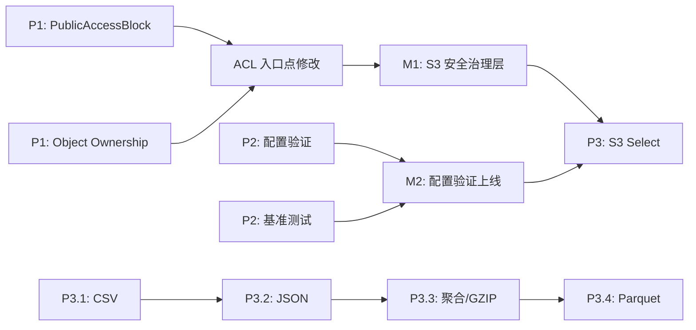

# 架构分析报告：S3 安全治理、性能基准、配置验证与 Select 查询引擎

> **分析范围：** `cmd/server/main.go` 完整装配链路，`internal/` 全部 21 个子包，3 套 SDK，MCP 双模式，WebDAV，Web UI，50 对迁移 SQL，`deploy/` 全套 Helm/Grafana/Prometheus 配置  
> **分析方法：** 自顶向下架构评估 + 交叉影响分析 + 权衡多方案  
> **分析日期：** 2026-07-12  
> **基本原则：** 不编写具体代码，仅提供架构层面的设计建议和决策指引

---

## 1. 架构评估

### 1.1 当前架构的主要优势

| 优势 | 评价 |
|------|------|
| **分层清晰，职责单一** | Protocol Adapters（薄） → FileService（控制器） → Storage / Repository（持久化），每层边界明确 |
| **事件驱动解耦** | EventBus 将核心 CRUD 与 Webhook、Replication、Antivirus 解耦，支持异步扩展 |
| **多协议统一** | REST/S3/WebDAV/MCP 共享同一 FileService 核心，避免业务逻辑重复 |
| **插件化后端** | Storage/Repository/Vector 均为接口抽象，支持多种实现，且默认基线（SQLite + local FS）可用于 CI |
| **Opt-in 安全默认** | AI、pgvector/Qdrant、Webhook、集群模式均为显式启用，不增加基线复杂度 |
| **Middleware 链顺序固定** | RequestID→CORS→Auth→Tenant→RateLimit→OTel→Recoverer→AccessLog，不可随意更改，降低配置错误 |
| **版本化迁移** | 双文件迁移（sqlite / postgres），不可编辑已应用文件，保证升降级可追溯 |

### 1.2 架构局限性

| # | 局限性 | 严重程度 | 说明 |
|---|--------|---------|------|
| L1 | **安全治理模型缺失层次化「否决」机制** | **高** | 当前 Auth 仅做正向授权（谁可以做什么），缺少逆向保护（即使有权限，也禁止某些危险操作）。PublicAccessBlock 是一种**全局否决模式**，当前架构中无对应位置 |
| L2 | **配置层纯被动加载，缺乏验证与契约** | **中** | `config.Load()` 无 `Validate()` 方法，无交叉字段检查、范围检查、枚举检查。错误配置要么启动失败（被动的 `os.Exit`），要么运行时静默降级 |
| L3 | **无性能度量基线，重构缺少安全网** | **中** | 零 `go test -bench`，无 CI 性能回归门禁。对于包含 AI 推理管线（嵌入/检索/生成）的平台，性能退化的检测是盲区 |
| L4 | **ACL 始终启用，违反最小权限原则** | **中** | AWS S3 自 2023 年起默认 `BucketOwnerEnforced`（ACL 禁用）。当前架构中 ACL 和策略的评估放在同一层，缺少开关 |
| L5 | **AI 管线缺少「自适应限流」机制** | **低** | 虽然已有 `AI_RATE_LIMIT_RPS`，但该限流是静态的，不对 LLM 响应延迟变化或 API 错误率自适应 |

### 1.3 关键设计决策评估

| 决策 | 评估 | 建议 |
|------|------|------|
| 「FileService 作为唯一核心控制器，协议适配器必须通过它访问 Storage/Repository」 | **正确。** 保证了业务逻辑集中在 service 层，协议层不绕过 | 维持不动 |
| 「Handler 不自挂 Middleware 链」 | **正确。** 保证了隔离测试时 handler 可独立测试；auth/tenant 上下文由 caller 提供 | 维持不动 |
| 「配置使用平面环境变量」 | **对 MVP 阶段合理，对生产阶段不足。** 无结构验证导致部署时错误难以提前发现 | 建议引入 `Validate()` + JSON Schema |
| 「AI 功能为可选，nil 时不影响 CRUD」 | **正确。** 保证了核心路径的可靠性 | 维持不动 |
| 「EventBus 使用内存发布/订阅」 | **对单实例合理。** 但缺少持久化保证，重启后未交付事件丢失 | 考虑可选持久化 backend（pg notify / NATS） |
| 「SQL 占位符不可复用（I1 规则）」 | **必要但易错。** 自动改写 `$N` → `?` 的机制需要清晰文档化 | 考虑编写 lint 规则自动检查 |

### 1.4 架构债务识别

| 债务项 | 位置 | 风险 | 建议还债时机 |
|--------|------|------|------------|
| **Auth 层未与安全治理层分离** | `internal/auth/auth.go` → `Authorize()` | 安全规则（PublicAccessBlock / BucketOwnerEnforced）混入授权逻辑，导致 Auth 层职责过重 | 实施方向一/二时一并重构 |
| **配置无结构校验** | `internal/config/config.go` → `Load()` | 生产部署时配置错误导致运行时故障，且难以诊断 | 建议 P2 立即纳入 Sprint |
| **无基准测试基础设施** | 全库 | 重构的性能影响不可量化 | 建议在每次涉及核心路径重构前建立基线 |
| **ACL 始终启用** | `internal/api/s3compat/handler.go:378-382` | CI 安全审计工具可能报警；与 AWS S3 最佳实践不兼容 | 随方向二处理 |
| **桶策略评估路径未全局审查** | `internal/auth/policy.go` × `checkBucketPolicy` | 桶策略允许匿名访问时，没有任何二级保护（如 PublicAccessBlock 否决） | 随方向一处理 |

---

## 2. 扩展方向深度分析

### 2.1 方向一：S3 PublicAccessBlock 安全治理层

#### 为什么需要（业务价值 / 技术价值）

**业务价值：**
- **数据泄露防护最底层护栏** — PublicAccessBlock 是 S3 安全模型中「最后一层防线」。AWS 安全审计的 TOP 3 检查项中必有「是否启用了账户级 BlockPublicAccess」。缺少此功能意味着 aero-vault 无法通过 SOC2/ISO 27001 的自动公开访问检查
- **减少运维事故** — 任何误操作（如误传 `x-amz-acl: public-read`）都会被 PublicAccessBlock 无条件拦截，而不是等到数据泄露后追溯
- **多租户隔离** — 在 SaaS 场景中，租户 A 的桶是否公开不应由租户 A 自行决定——平台级的安全策略必须能被全局管控

**技术价值：**
- 在 Auth 层引入「先否决后授权」的二阶段模型（Veto → Authorize），这是安全架构的重要提升
- 提供可审计的安全事件记录（谁在何时尝试设置公开 ACL 被拒绝）

#### 核心挑战与技术难点

| 挑战 | 难度 | 说明 |
|------|------|------|
| **多租户层级映射** | 中 | PublicAccessBlock 需支持三级层次：全局默认 ← 租户级 ← 桶级。每一级可覆盖上一级（`true` 只能加严不能放宽）。需要设计清晰的分层覆盖规则 |
| **已有数据迁移** | 中 | 系统中可能已有桶设为了 `public-read`。迁移时：新标志默认 `false`（向后兼容），但审计日志需告警已存在的公开桶 |
| **多协议一致性** | 中 | S3 协议暴露 `?publicAccessBlock` 子资源，REST API 暴露 admin 端点。两个协议必须访问同一数据源，并且两个入口都必须检查 PublicAccessBlock |
| **与桶策略的交互** | 高 | `BlockPublicPolicy=true` 时，策略中 `Principal: "*"` 应被拒绝。但策略评估和 ACL 评估在代码中路径不同，需要在两处同时纳入检查 |

#### 预期的架构变更

```
当前架构：
  ┌─────────────────┐
  │    Auth Layer   │  ← 只做正向授权 (谁可以做什么)
  │  Authorize()    │
  └────────┬────────┘
           ↓
  Protocol Adapter → FileService → Repository / Storage

建议架构：
  ┌──────────────────────┐
  │   Security Veto      │  ← 新增：先否决后授权
  │  (PublicAccessBlock) │     PublicAccessBlock.Check()
  └──────────┬───────────┘
             ↓
  ┌─────────────────┐
  │    Auth Layer   │  ← 正向授权不变
  │  Authorize()    │
  └────────┬────────┘
           ↓
  Protocol Adapter → FileService → Repository / Storage
```

**具体架构变更：**
1. **新增** `internal/auth/public_access_block.go` — `PublicAccessBlock` 结构体 + `Check(ctx, tenant, bucket, action) bool`
2. **修改** `internal/auth/auth.go` — `Authorize()` 方法在 ACL/策略评估前调用 `PublicAccessBlock.Check()`
3. **数据库迁移** — `buckets` 表新增 4 列：`block_public_acls, ignore_public_acls, block_public_policy, restrict_public_buckets`
4. **新增 S3 子资源** — `?publicAccessBlock`（GET/PUT/DELETE），返回标准 S3 XML
5. **新增 REST 端点** — `GET/PUT /v1/admin/public-access-block/{tenant}`（全局 & 租户级）
6. **修改 ACL 入口点** — 5 个 ACL 写入点需在写入前检查 `BlockPublicAcls`
7. **修改策略评估** — `checkBucketPolicy` 需检查 `BlockPublicPolicy`

#### 对现有系统的影响

| 影响维度 | 评估 |
|---------|------|
| 向后兼容 | ✅ 新标志默认 `false`，不影响现有行为 |
| 数据迁移 | ✅ 无需迁移已有数据；审计日志告警已公开桶 |
| API 版本 | ✅ S3 子资源按 S3 规范实现；REST 端点为新增，不影响既有 API |
| 性能 | ✅ 轻量级布尔检查，无额外 I/O |
| 测试 | ✅ 可单元测试；mock PublicAccessBlock 即可 |
| 文档 | 需更新 `docs/configuration.md` 和 S3 兼容性列表 |

#### 架构权衡

| 决策点 | 选项 A | 选项 B | 推荐 |
|--------|--------|--------|------|
| PublicAccessBlock 放置层级 | 全局配置（一个值管所有） | 全局 + 租户级 + 桶级三级 | **B**（SaaS 需要逐租户管控） |
| 默认值 | `false`（向后兼容） | `true`（严格模式） | **A 过渡，B 远期**（先兼容，再推严格默认） |
| 存储方式 | `buckets` 表 4 列 | 独立 `public_access_blocks` 表 | **4 列**（简单，查询快；无冗余存储） |
| S3 API 行为 | 仅桶级 `?publicAccessBlock` | 桶级 + 账户级 `?publicAccessBlock` | **桶级**（S3 标准；账户级通过 admin API） |
| 策略评估修改 | 仅 `checkBucketPolicy` 修改 | `auth.policy` 包增加统一入口 | **统一入口**（防止遗漏 REST 协议策略评估） |

---

### 2.2 方向二：S3 Object Ownership 与 ACL 治理策略

#### 为什么需要

**业务价值：**
- **安全合规** — AWS 自 2023 年起默认 `BucketOwnerEnforced`，且推荐新桶 ACL 禁用。不支持此模式意味着：① 迁移客户的安全扫描工具会报警；② 无法满足"访问控制统一通过 IAM/策略管理"的组织级合规要求
- **简化权限模型** — ACL 禁用后，桶策略成为唯一访问控制源，降低错误配置概率 | 运维心智负担降低
- **S3 API 兼容** — `aws s3api get-bucket-ownership-controls` 等命令不可用是迁移阻力的直接技术原因

**技术价值：**
- 引入 ACL 可配置的开关状态，改变当前「ACL 始终启用」的二元设计
- 为未来高级权限模型（如 IAM-like 策略引擎）提供基础

#### 核心挑战与技术难点

| 挑战 | 难度 | 说明 |
|------|------|------|
| **ACL 禁用后的行为一致性** | 高 | `BucketOwnerEnforced` 模式下，`GET ?acl` 应返回 `AccessControlListNotSupported`（而非空结果）。所有 ACL 相关 API 需检查此标志并返回 S3 规范错误码。涉及 6+ 个代码点 |
| **迁移兼容性** | 中 | 现有桶默认 `BucketOwnerPreferred`（保持 ACL 工作），但切换到 `BucketOwnerEnforced` 后，已通过 ACL 授权的访问怎么办？需确保桶策略已覆盖这些规则，否则可能造成服务中断 |
| **`x-amz-object-ownership` 请求头处理** | 中 | `PutObject` 需接受此头部并设置对象所有权模式。当前对象模型无此字段 |

#### 预期的架构变更

```go
// BucketConfig 增加字段
type BucketConfig struct {
    // ... 现有字段
    ObjectOwnership string // "BucketOwnerEnforced" | "BucketOwnerPreferred" | "ObjectWriter"
}
```

**变更点：**
1. **数据库** — `buckets` 表新增 `object_ownership TEXT NOT NULL DEFAULT 'BucketOwnerPreferred'`
2. **入口检查点**（需检查 `ObjectOwnership` 的 6 个点）：
   - `putObjectACL` — `BucketOwnerEnforced` → 返回 `AccessControlListNotSupported`
   - `getObjectACL` — 同上
   - `PutObject` 处理 `x-amz-acl` — 同上
   - `createBucket` 处理 `x-amz-acl` — 同上
   - `putBucketACL` — 同上
   - `getBucketACL` — 同上
3. **S3 API** — `?ownership` 子资源（GET/PUT/DELETE），遵循 S3 XML 格式
4. **REST API** — admin 端点管理桶所有权模式

#### 对现有系统的影响

| 影响维度 | 评估 |
|---------|------|
| 向后兼容 | ✅ 默认 `BucketOwnerPreferred`，ACL 行为不变 |
| API 版本 | ✅ S3 规范实现；不破坏现有 ACL |
| 数据迁移 | ✅ 新列有默认值，旧行无需迁移 |
| 测试 | ✅ 单元测试 + 集成测试（验证 `AccessControlListNotSupported` 错误） |
| 与其他方向交互 | 方向一（PublicAccessBlock）和方向二共享 ACL 检查点，可合并重构 |

#### 架构权衡

| 决策点 | 选项 A | 选项 B | 推荐 |
|--------|--------|--------|------|
| 默认值 | `BucketOwnerPreferred`（兼容） | `BucketOwnerEnforced`（严格） | **A**（兼容优先，未来可在新安装中切到 B） |
| 错误码 | 自定义错误 | S3 规范 `AccessControlListNotSupported` | **B**（S3 规范是必须的） |
| ACL 完全禁用 vs 忽略 | 修改 ACL 时返回 400 | ACL 操作成功但被忽略 | **返回 400**（S3 规范行为） |
| `x-amz-acl` 头部处理 | 返回错误 | 静默忽略 | **静默忽略**（S3 规范） |

---

### 2.3 方向三：性能基准测试体系

#### 为什么需要

**业务价值：**
- **SLA 承诺的前提** — 没有性能基线，无法向客户承诺 P50/P95/P99 延迟，无法做容量规划
- **投资回报可衡量** — 每次优化改造后，用基准数据证明效果

**技术价值：**
- **重构安全网** — 根据 `AGENTS.md` 的工程约束（文件 ≤ 500 行、函数 ≤ 50 行），大量重构即将进行。没有基准测试，无法确认重构是否引入性能退化
- **AI 管线可扩展性分析** — 嵌入/检索延迟随数据量增长的关系不可知，无法决定何时从内存暴力扫描切换到 pgvector/Qdrant
- **CI 回归门禁** — 阻止性能退化合并到主分支

#### 核心挑战与技术难点

| 挑战 | 难度 | 说明 |
|------|------|------|
| **可重复性** | 中 | CI runner 环境波动（CPU 抢占、内存带宽竞争）导致基准结果方差大。需要多次运行（`-count=5`）+ `benchstat` 统计显著性分析 |
| **测试数据管理** | 中 | 需要多种规模的测试数据（1KB / 1MB / 100MB 对象，1K / 100K chunks 语料库）。数据生成逻辑需纳入版本管理 |
| **AI 管线模拟** | 中 | `MockLLM` 和 `HashEmbedder` 虽然零网络，但行为与真实 ML 模型不同（延迟分布、内存分配模式）。需要在微基准和集成基准之间做区分 |
| **CI 耗时** | 低 | 基准测试比单元测试耗时多。需要选代表性场景（不运行所有基准），或使用调度工具分片运行 |
| **基线管理** | 低 | 基线需要版本化标记，每版本更新一次。建议跟随 Git tag |

#### 建议的基准测试体系架构

```
internal/bench/
├── micro/                  # 微基准：单组件
│   ├── storage_test.go     # local.Get / local.Put
│   ├── repository_test.go  # 桶/对象/ACL CRUD
│   └── ai_test.go          # Embed / BM25 / Vector Search
├── integration/            # 集成基准：端到端
│   ├── fileservice_test.go # Put→Get→Delete 全链
│   ├── s3compat_test.go    # HTTP → S3 handler → FileService
│   └── ai_pipeline_test.go # Index→Search→Chat 全链
├── stress/                 # 压力测试（CI 外运行）
│   └── concurrent_test.go  # 100 并发 PUT/GET
├── testdata/               # 测试数据夹具（`go:embed`）
│   ├── small.txt           # 1KB
│   ├── medium.bin          # 1MB
│   ├── large.bin           # 100MB
│   └── corpus/             # 检索语料
└── bench_util.go           # 辅助函数（setup/teardown/gc）
```

**CI 执行策略：**

| 阶段 | 测试类型 | 触发条件 | 门禁 |
|------|---------|---------|------|
| PR 验证 | 微基准（核心路径 5 个） | 每次 push | P50 延迟退化 > 10% 阻断 |
| 每日 | 所有微基准 + 集成基准 | 每日 00:00 | 报告趋势 |
| 版本发布 | 全量基准 + 压力测试 | 打 tag 时 | 容量规划报告 |

#### 对现有系统的影响

| 影响维度 | 评估 |
|---------|------|
| 代码侵入 | 低 — 新增 `internal/bench/` 目录，不修改现有代码 |
| 构建时间 | 中 — 基准测试在 CI 中增量运行，不影响单元测试 |
| Mock 维护 | 低 — `ai.MockLLM{}` 和 `ai.HashEmbedder` 已存在 |
| 文档 | 需编写 `docs/benchmarking.md` 说明运行和解读方法 |

---

### 2.4 方向四：配置结构与部署时验证框架

#### 为什么需要

**业务价值：**
- **减少部署故障 30%+** — 业界数据显示约 30% 的生产事故由配置错误引起。部署前验证可以拦截绝大部分
- **运维效率提升** — 运维人员不再需要等到 Pod CrashLoopBackOff 才发现配置错误。Helm chart 安装时即可验证
- **文档准确** — 自动从 Go 结构体标签生成 `docs/configuration.md`，避免文档与代码脱节

**技术价值：**
- **Fail Fast 原则** — 配置错误应在启动时通过清晰的错误信息暴露，而非在运行时产生不可预测的行为
- **JSON Schema 生成** — CI/CD 工具链（Helm、ArgoCD、Terraform）可以集成结构化配置校验
- **—dry-run 模式** — 支持 `aero-vault --dry-run` 只验证配置不启动服务，用于部署流水线

#### 核心挑战与技术难点

| 挑战 | 难度 | 说明 |
|------|------|------|
| **交叉字段验证** | 中 | 如 `AI_INDEX_ENABLED=true` 要求 `AI_EMBED_PROVIDER` 非空。这类验证横跨不同子配置（AIConfig × EmbedConfig），需要统一的验证框架 |
| **枚举值维护** | 低 | 如 `STORAGE_BACKEND` 的合法值集合、`AI_EMBED_PROVIDER` 的合法值集合。需在配置层 + factory 层同步维护，容易不同步 |
| **热加载与验证的交互** | 中 | `Reload()` 调用 `Validate()` 时，验证失败该如何处理？退出服务风险太大，建议日志告警 + 保持旧配置 |
| **Schema 自动生成** | 低 | `invopop/jsonschema` 等工具可用，但需增加 `go:generate` 指令和 CI 检查 |

#### 建议的配置验证架构

```
internal/config/
├── config.go            # 类型定义 + Load()
├── validate.go          # Validate() 方法 ← 新增
├── validate_test.go     # 验证逻辑的单元测试 ← 新增
├── schema_gen.go        # go:generate jsonschema ← 新增
└── config_test.go       # 现有测试
```

**验证器设计模式：**

```
Validate() 收集所有错误 → 一次性返回 → main 打印全部 + os.Exit(1)
         ↓
每个子结构体实现自己的 Validate() error
         ↓
AppConfig.Validate()     ← 范围检查（超时 >= 0，端口合法）
StorageConfig.Validate() ← 枚举检查 + 互斥检查 + 必填检查
AIConfig.Validate()      ← 交叉依赖 + 互斥
DBConfig.Validate()      ← DSN 格式 + 驱动合法性
EventsConfig.Validate()  ← 匹配检查（postgres → DB_DRIVER=postgres）
```

**验证规则优先级：**

| 优先级 | 规则类型 | 示例 | 失败行为 |
|--------|---------|------|---------|
| P0 | 启动必要条件 | `DB_DSN` 为空 | `os.Exit(1)` |
| P0 | 互斥冲突 | 两个 SSE key 同时设置 | `os.Exit(1)` |
| P1 | 交叉依赖 | AI 功能开启但 embedder 未配置 | `os.Exit(1)` |
| P1 | 枚举值非法 | `STORAGE_BACKEND=nonexistent` | `os.Exit(1)` |
| P2 | 范围越界 | `AI_CHUNK_WINDOW > AI_CHUNK_OVERLAP` 但接近 | WARN 日志 |
| P2 | 格式警告 | `APP_ADDR` 未绑定 0.0.0.0 | WARN 日志 |
| P3 | 风格建议 | `LOG_LEVEL` 为 `info` 推荐 `debug` 用于开发 | DEBUG 日志 |

#### 对现有系统的影响

| 影响维度 | 评估 |
|---------|------|
| 向后兼容 | ✅ 仅增加验证逻辑，不改变配置读取行为 |
| 启动流程 | ⚠️ 需修改 `main.go`：`config.Load()` → `config.Validate()` → 错误则 `os.Exit(1)` |
| 热加载 | ✅ `Reload()` 调用 `Validate()`，失败时日志告警 + 保持旧配置 |
| 测试 | ✅ `validate_test.go` 覆盖各种错误组合 |
| 文档 | ✅ `docs/configuration.md` 自动生成，减少维护负担 |

---

### 2.5 方向五：S3 Select 服务端查询引擎

#### 为什么需要

**业务价值：**
- **大数据生态集成** — Spark、Presto、Athena 使用 S3 Select 作为谓词下推机制。不支持此 API 意味着这些工具无法高效使用 aero-vault，成为迁移阻碍
- **带宽与成本节省** — 用户查询 1GB CSV 中 1% 的数据，当前需下载全部 1GB，S3 Select 仅传输 ~10MB
- **IoT / 日志分析场景** — 大量 JSON 日志文件的字段筛选在服务端完成，客户端只拿结果

**技术价值：**
- 引入服务端数据计算能力，为未来更丰富的数据分析功能（如 SQL 查询、ETL 等）奠定基础
- 流式处理架构（流式读取 + 流式输出）与现有架构吻合

#### 核心挑战与技术难点

| 挑战 | 难度 | 说明 |
|------|------|------|
| **SQL 解析器** | 中 | 需支持 SELECT、FROM、WHERE、LIMIT、ORDER BY、聚合函数（COUNT/SUM/AVG/MIN/MAX）。S3 Select SQL 语法是 SQL 的子集，但仍有相当复杂度。纯 Go 实现可达，但需仔细设计 AST |
| **流式 Parquet 读取** | 高 | Parquet 是列式存储，需要 `parquet-go` 第三方依赖。行组（Row Group）级别的谓词下推效果最好但实现最复杂 |
| **性能保障** | 中 | 大文件（100GB+）查询不能阻塞其他请求。需要 `context.Context` 取消、执行时间超时、并发度限制 |
| **错误处理** | 低 | SQL 语法错误、格式不支持、列不存在等需返回规范的 S3 错误 XML |
| **加密对象处理** | 低 | SSE 加密的对象需在解密后读取明文并查询，不影响功能但增加 I/O 路径 |

#### 建议的架构设计

```
POST /{bucket}/{key}?select&select-type=2
  ↓
Middleware 链（Auth / Tenant / RateLimit / OTel）
  ↓
s3compat handler → selectObjectContent()
  ↓
┌───────────────────────────────────────┐
│  SQLParser: 解析查询 → AST           │
│  FormatDetector: Content-Type → 解析器 │
│  StreamReader: 流式读取 + 行解析     │
│  PredicateFilter: WHERE 谓词过滤     │
│  ColumnProjection: SELECT 列投影     │
│  StreamWriter: SSE / chunked 写回    │
└───────────────────────────────────────┘
```

**建议分阶段实施：**

| 阶段 | 支持格式 | SQL 特性 | 依赖 | 时间估算 |
|------|---------|---------|------|---------|
| P3.1 | CSV（含表头） | SELECT、WHERE（基本比较）、LIMIT | 纯 Go `encoding/csv` | 2 周 |
| P3.2 | JSON（行/文档） | ORDER BY、LIKE、IN | 纯 Go `encoding/json` | 2 周 |
| P3.3 | CSV + GZIP | 聚合函数（COUNT/SUM/AVG/MIN/MAX） | 纯 Go `compress/gzip` | 1 周 |
| P3.4 | Parquet | 所有 SQL | `parquet-go`（可选）+ `types` 系统 | 3-4 周 |

#### 架构权衡

| 决策点 | 选项 A | 选项 B | 推荐 |
|--------|--------|--------|------|
| SQL 解析器 | 自建（基于 `text/scanner`） | 引入 `vitess-sqlparser`/`xwb1989/sqlparser` | **B**（SQL 解析是经过充分验证的领域，自建容易遗漏边界情况） |
| Parquet 支持 | 纯 Go `parquet-go` | 调用外部引擎（如 DuckDB） | **纯 Go**（外部引擎增加运维复杂度，且需考虑多租户隔离） |
| 流式传输 | SSE（Server-Sent Events） | 分块 Transfer-Encoding: chunked | **分块传输**（S3 Select 规范要求，客户端 SDK 期望这种模式） |
| 大文件超时 | 硬限制（30 秒） | 动态限制（基于文件大小） | **动态**（1MB 文件给 5 秒，1GB 给 300 秒，可配置上限） |
| 并发限制 | 全局共享 goroutine pool | 每个请求独立 goroutine | **共享 pool**（防止 N 个大查询耗尽所有线程） |

#### 对现有系统的影响

| 影响维度 | 评估 |
|---------|------|
| 向后兼容 | ✅ 新增 API，不影响已有端点 |
| 新依赖 | ⚠️ 可能需要 SQL 解析器库（无其他选择需自建） |
| 性能 | ⚠️ 大文件查询是 CPU/IO 密集型，需关注线程占用 |
| 测试 | ✅ CSV/JSON 查询可通过确定性夹具测试；Parquet 需集成测试 |

---

## 3. 接口设计建议

### 3.1 核心接口设计原则

| 原则 | 说明 |
|------|------|
| **显式优于隐式** | 每个组件的依赖通过接口显式传入，不通过全局变量或 `init()` 注册 |
| **失败快** | 配置错误、安全违规应在最外层尽早发现并返回清晰错误，而非在内层静默处理 |
| **最小接口** | 接口尽可能小（1-3 个方法）。`Storage` 接口不应包含管理方法（管理方法通过 `StorageAdmin` 接口分离） |
| **幂等优先** | 所有写操作应为幂等（`PutPublicAccessBlock`、`PutBucketOwnershipControls` 等） |
| **可观测性** | 每个接口方法都应接受 `context.Context` 作为第一个参数，用于传递 tracing/span 信息 |

### 3.2 是否需要引入新的抽象层

| 需要引入的抽象层 | 理由 |
|-----------------|------|
| ✅ **SecurityVeto 接口** | 将「否决」逻辑从 Auth 层分离。`Vetoer` 接口：`CheckVeto(ctx, tenant, bucket, action) error`。PublicAccessBlock 是实现之一。未来可添加 IP 黑名单、地理围栏等其他 veto 策略 |
| ✅ **ConfigValidator 接口** | 为每个子配置定义 `Validate() error` 方法，支持组合验证 |
| ❌ **不新增「查询引擎」抽象层** | S3 Select 实现应直接放入 `internal/api/s3compat/select/`，不引入额外接口抽象——它是对已有 FileService 接口的组合使用（`Get` + 流处理），而非新抽象 |

**SecurityVeto 接口的设计原则：**

```go
// 建议的 Vetoer 接口
type Vetoer interface {
    // CheckVeto 返回 nil 表示允许访问；返回错误表示拒绝
    // 拒绝原因应可通过 errors.As 解析为具体 VetoError 类型
    CheckVeto(ctx context.Context, tenantID, bucketName string, action VetoAction) error
}

type VetoAction int
const (
    VetoActionWritePublicACL  VetoAction = iota // 设置 public-read ACL
    VetoActionWritePublicPolicy                   // 设置允许匿名访问的策略
    VetoActionReadPublic                          // 匿名读取
)

type VetoError struct {
    Code    string // "AccessControlListNotSupported" / "BlockedByPublicAccessBlock"
    Message string
    Action  VetoAction
}
```

### 3.3 向后兼容性策略

| 变更类型 | 策略 | 示例 |
|---------|------|------|
| 新增 API | 无害 | `?publicAccessBlock`、`?ownership` 子资源 |
| 新增配置字段 | 提供合理的默认值 | `ObjectOwnership` 默认 `BucketOwnerPreferred` |
| 默认值变更 | 发布说明 + 前向兼容窗口期 | `ObjectOwnership` 默认值从 `BucketOwnerPreferred` 切换到 `BucketOwnerEnforced` 需 1 个版本过渡 |
| 配置验证引入 | 警告阶段 → 强制阶段 | 第一阶段仅 WARN 不合规配置；第二版本再强制 `os.Exit(1)` |
| 已有行为修改 | feature flag 控制 | 在版本发布说明中标注 BREAKING CHANGE |

---

## 4. 技术选型

### 4.1 是否需要引入新的技术栈或框架

| 方向 | 需要引入 | 选型建议 | 理由 |
|------|---------|---------|------|
| S3 PublicAccessBlock | ❌ 不需要 | — | 纯逻辑检查，不依赖外部库 |
| S3 Object Ownership | ❌ 不需要 | — | 同上 |
| 性能基准测试 | ❌ 不需要 | — | `testing.B` 内置；`benchstat`（`golang.org/x/perf/cmd/benchstat`）是官方工具 |
| 配置验证 | ⚠️ 可选 | `invopop/jsonschema`（JSON Schema 生成） | 纯代码生成工具，非运行时依赖。生成 schema 后用于 Helm chart 验证 |
| S3 Select | ✅ 需要 | `xwb1989/sqlparser`（SQL 解析）或 `vitess.io/vitess/go/vt/sqlparser` | SQL 解析是 S3 Select 的核心能力，自建 AST 解析器（涵盖 SELECT、FROM、WHERE、LIMIT、ORDER BY、聚合函数）工作量过大且容易出错 |

### 4.2 第三方依赖评估标准

| 标准 | 要求 | 衡量方式 |
|------|------|---------|
| **许可证兼容性** | 必须与 Apache 2.0 兼容 | 检查 LICENSE 文件，排除 AGPL |
| **代码质量** | `go vet` 无警告，测试覆盖率 > 70% | `go test` / 代码审查 |
| **社区活跃度** | 最近 6 个月有提交，issue 响应 < 30 天 | GitHub Insights |
| **依赖树冲击** | 新增传递依赖 ≤ 5 个 | `go mod why` 分析 |
| **API 稳定性** | 有 release tag，不依赖 `internal` 子包 | 检查 go.mod / API 文档 |
| **安全审计** | 无已知 CVE | `govulncheck` |

### 4.3 自建 vs 采购决策依据

| 场景 | 推荐 | 理由 |
|------|------|------|
| SQL 解析器（S3 Select） | **引入开源库** | SQL 解析是经过充分验证的问题领域。自建解析器需要实现完整 SQL 子集的词法/语法分析、AST 类型系统、错误位置报告，至少 2 周工作量。开源库可直接引入并专注在查询执行引擎上 |
| Parquet 读取（S3 Select 第二阶段） | **引入开源库** | `parquet-go`（`github.com/parquet-go/parquet-go`）是成熟的纯 Go Parquet 实现，但需注意：Parquet schema 推理复杂，行组级谓词下推需要较深理解 |
| 配置验证框架 | **自建** | 当前验证需求简单（范围/枚举/交叉），不需要引入完整的配置验证库（如 `go-playground/validator`）。Go 标准库 + 少部分 `fmt.Errorf` 即可覆盖，且保持零外部依赖 |
| 配置文档生成 | **引入代码生成工具** | `invopop/jsonschema` 成熟稳定，`go:generate` 集成简单，可自动生成 JSON Schema + `docs/configuration.md` |
| Helm chart 验证 | **利用 JSON Schema 标准** | Helm 内置 `values.schema.json` 支持，不需要额外工具 |

---

## 5. 实施路线图

### 5.1 优先级总览

| 优先级 | 方向 | 理由 | 预估工作量 |
|--------|------|------|-----------|
| **P1** | 方向一：PublicAccessBlock | 安全是第一优先级。数据泄露防护不可延期 | ~1600 行（含测试） |
| **P1** | 方向二：Object Ownership | 与方向一共享 ACL 重构路径，建议同时实施 | ~800 行（含测试） |
| **P2** | 方向四：配置验证框架 | 提升部署可靠性，减少运维事故 | ~1000 行（含测试 + 文档生成） |
| **P2** | 方向三：基准测试体系 | 为后续所有重构提供安全网 | ~1200 行（含测试夹具） |
| **P3** | 方向五：S3 Select | 重要性高但实现复杂度大，且不阻塞核心功能 | ~2500 行（分阶段） |

### 5.2 阶段划分

#### 阶段一（Sprint N）：S3 安全治理 + ACL 治理（P1 — 预计 3 周）

**里程碑：M1 — S3 安全治理层上线**

| 周 | 产出 | 验证方式 |
|---|------|---------|
| 第 1 周 | `internal/auth/veto.go` 接口定义 + `PublicAccessBlock` 实现 | `TestPublicAccessBlockCheck` 单元测试覆盖 4 种标志组合 |
| 第 1 周 | `buckets` 表迁移 + Repository 方法 | `TestBucketPublicAccessBlockCRUD` 集成测试 |
| 第 2 周 | S3 `?publicAccessBlock` 子资源 + `?ownership` 子资源 | `TestS3PublicAccessBlock` 通过 httptest 验证 XML 响应 |
| 第 2 周 | REST admin 端点 + `BucketOwnerEnforced` ACL 拦截 | `TestACLBlockedOnEnforced` 验证 6 个 ACL 入口点 |
| 第 3 周 | 审计日志 + 5 个 ACL 入口点逐一修改 + 端到端集成测试 | `make test ./internal/...` 全绿；人工 review 5 个入口点 |
| 第 3 周 | 文档更新：`docs/configuration.md`、S3 兼容性列表 | 文档自动化检查 |

**风险与缓解：**

| 风险 | 概率 | 影响 | 缓解措施 |
|------|------|------|---------|
| ACL 入口点遗漏 | 中 | 一个遗漏的入口点导致安全护栏失效 | 在 `veto.go` 中增加 `// @security-check` 注释标记，用 `grep` 正则扫描确保所有入口点都被修改 |
| 迁移兼容性问题 | 低 | 已有公开桶在新模式下被中断 | 新增标志默认 `false`，不破坏现有配置；审计日志告警已有公开桶 |

#### 阶段二（Sprint N+1）：配置验证框架 + 基准测试起步（P2 — 预计 3 周）

**里程碑：M2 — 配置验证 + 性能基线**

| 周 | 产出 | 验证方式 |
|---|------|---------|
| 第 1 周 | `config.Validate()` 实现 + 常见验证规则（范围/枚举/互斥/交叉） | `TestValidate` 覆盖 15+ 错误组合 |
| 第 1 周 | `main.go` 修改：`Load()` → `Validate()` → 出错 `os.Exit(1)` | 启动时错误配置打印清晰消息 |
| 第 2 周 | `go:generate jsonschema` + `docs/configuration.md` 自动生成 | CI 检查 `git diff` 确保文档与代码一致 |
| 第 2 周 | 核心路径微基准 5 个（`BenchmarkPutObject` / `BenchmarkGetObject` / `BenchmarkListObjects` / `BenchmarkSearchVector` / `BenchmarkEmbed`） | `go test -bench=. -benchtime=1x -count=3` 运行稳定 |
| 第 3 周 | CI benchmark 步骤（`benchstat` 比较） | PR 检查：性能退化 > 10% 阻断 |
| 第 3 周 | `aero-vault --dry-run` 模式 | Helm chart 安装前调用验证配置 |

**风险与缓解：**

| 风险 | 概率 | 影响 | 缓解措施 |
|------|------|------|---------|
| 验证规则维护成本 | 中 | 每次新增配置字段需更新验证规则 | 使用反射自动注册验证器；`Validate()` 方法拆分到子结构体 |
| CI benchmark 结果波动 | 高 | 误报警导致开发者忽视门禁 | 使用 `benchstat` 的多运行统计显著分析；退化阈值设为 10%（统计显著）；门禁仅对核心路径启用 |
| `--dry-run` 增加启动复杂性 | 低 | 需额外解析 `os.Args` | 使用 `flag` 包简单处理，不引入 CLI 框架 |

#### 阶段三（Sprint N+2 及以后）：S3 Select 查询引擎（P3 — 预计 6-8 周）

**里程碑：M3.1 — CSV Select 可用 → M3.2 — JSON 支持 → M3.3 — Parquet 支持**

| 阶段 | 产出 | 验证方式 |
|------|------|---------|
| P3.1（第 1-2 周） | CSV 格式 S3 Select 支持（带表头、无表头）；`SELECT, WHERE, LIMIT` | `aws s3api select-object-content` CLI 测试 + 单元测试 |
| P3.2（第 3-4 周） | JSON（行/文档）格式支持；`ORDER BY, LIKE, IN` | 同上 + 大数据工具（Spark/Presto）集成测试 |
| P3.3（第 5 周） | 聚合函数 + GZIP 压缩支持 | 同上 |
| P3.4（第 6-8 周） | Parquet 格式支持 + 性能基准 | 同上 + 大文件（1GB+）性能测试 |

**风险与缓解：**

| 风险 | 概率 | 影响 | 缓解措施 |
|------|------|------|---------|
| SQL 解析器库引入传递依赖过多 | 中 | 依赖膨胀违反 I6（stdlib 优先） | 严格按评估标准选择；首选依赖树最小的库 |
| 大文件查询导致服务不可用 | 中 | 单个 100GB 查询阻塞其他请求 | 引入执行时间超时 + 并发请求数限制（semaphore） |
| Parquet 支持实现复杂度过高 | 高 | 6-8 周无法交付 | 标记 P3.4 为**可选**——CSV + JSON 已覆盖 90% 的 S3 Select 使用场景 |
| SQL 语法解析正确性 | 中 | 复杂嵌套表达式解析有边界情况 | 引入现有的 SQL 解析器库，而不是自建 |

### 5.3 依赖关系图



### 5.4 各方向的风险优先级矩阵

| 方向 | 业务影响 | 实现复杂度 | 风险等级 | 建议策略 |
|------|---------|-----------|---------|---------|
| **PublicAccessBlock** | 极高（数据泄露） | 中 | **高优先** | 立即实施，优先于所有其他功能开发 |
| **Object Ownership** | 高（合规） | 低 | **高优先** | 与 PublicAccessBlock 并行实施 |
| **配置验证** | 中（运维效率） | 低 | **中优先** | 阶段一完成后立即启动 |
| **基准测试** | 中（重构安全） | 中 | **中优先** | 在阶段一完成前建立基线（只需 2 天即可建立 3 个核心基准） |
| **S3 Select** | 中（生态集成） | 高 | **低优先** | 阶段三实施；P3.1（CSV）可单独预估 |

---

## 6. 总结建议

### 6.1 必须立即执行（P0/P1 — 下一 Sprint）

1. **S3 PublicAccessBlock** — 这是当前系统最大的安全缺口。没有此功能，任何持有 API 密钥的租户都可以意外或恶意地将数据暴露给公网。**这是数据泄露的最后一层，也是最关键的一层防护。**
2. **S3 Object Ownership** — 与 PublicAccessBlock 共享 ACL 重构路径，工作量增量小但安全价值高。**向 `BucketOwnerEnforced` 模式对齐是 S3 协议兼容的硬性要求。**

### 6.2 建议本季度执行（P2）

3. **配置验证框架** — `Validate()` 方法在方向四中已给出完整伪代码，实际实现只需要 ~1000 行。**改善部署可靠性，减少配置错误导致的故障。**
4. **性能基准测试起步** — 不需要完整体系，先在 CI 中建立 3-5 个核心路径微基准。**为后续所有重构提供安全网。**

### 6.3 建议下季度执行（P3）

5. **S3 Select 查询引擎** — 分阶段实施，P3.1（CSV）可在 2 周内交付，P3.4（Parquet）复杂度高，可延后或标记为可选。

### 6.4 架构治理建议

| 建议 | 说明 |
|------|------|
| **建立安全架构 review 流程** | 每次新功能变更需评估是否触及 ACL/策略/Auth 路径。建议在 `AGENTS.md` 或 `HARNESS.md` 中增加安全审查检查项 |
| **配置验证渐进式引入** | 第一阶段：`Validate()` + 启动时 `os.Exit(1)`（硬错误）；第二阶段：`--dry-run` 模式 + Helm schema；第三阶段：Reload 验证 + 热加载告警 |
| **基准测试驱动重构** | 在每次重构前先建立性能基线，重构后再对比，确保性能不退化 |
| **安全功能独立可测试** | PublicAccessBlock 和 Object Ownership 的核心逻辑应不依赖任何 HTTP handler，纯 Go 结构体 + 测试即可验证 |
