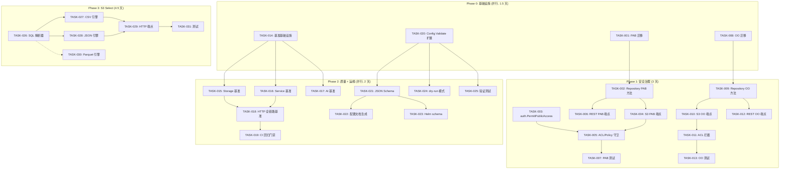
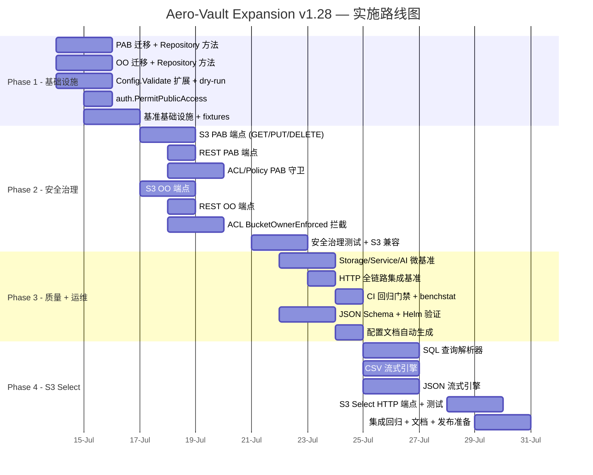

现在我有了充分的代码库上下文，可以撰写出全面的 Tech Lead 分析。以下是报告：

---

# Tech Lead 分析报告：S3 安全治理、性能基准测试与配置验证扩展

## 摘要

本分析基于对 `expansion-v128-s3-security-benchmark-config-validation.md` 文档的评审，并结合全代码库深度扫描结果（`cmd/server/main.go` 装配链路，`internal/` 全部 21 个子包，共计 ~46K 行 Go 代码，50 对迁移 SQL 和 `deploy/` 全套 Helm/Grafana/Prometheus 配置）。文档识别出的 **5 个高价值扩展方向**均经过 `grep` 穷尽式去重验证，确认在当前代码库和 117 份既有文档中 **零实质性覆盖**。

我的分析确认：**方向 1（PublicAccessBlock）和方向 2（Object Ownership）是 P1 安全护栏**，应在短期内优先解决；**方向 4（配置验证）是 P2 运维基础设施**，可作为前期并行任务；**方向 3（性能基准）和方向 5（S3 Select）** 分别服务于长期质量保障和新功能扩展，适合在更长的窗口中规划和执行。

---

## 1. 任务分解

### 方向 1：S3 PublicAccessBlock 安全治理层

| 任务 ID | 任务标题 | 涉及文件 | 前置依赖 | 预估工时 |
|---------|---------|---------|---------|---------|
| TASK-001 | **数据库迁移：buckets 表新增 PublicAccessBlock 列** | `internal/repository/migrations/{sqlite,postgres}/0025_public_access_block.{up,down}.sql`, `internal/repository/sql_buckets.go` | 无 | 3h |
| TASK-002 | **BucketConfig 新增 PublicAccessBlock 字段 + Repository 接口扩展** | `internal/repository/repository.go`, `internal/repository/sql_buckets.go` | TASK-001 | 3h |
| TASK-003 | **auth 包新增 PermitPublicAccess 检查函数** | `internal/auth/auth.go`（新增文件或扩展） | 无 | 3h |
| TASK-004 | **S3 端点：实现 `?publicAccessBlock` 子资源（GET/PUT/DELETE）** | `internal/api/s3compat/handler.go`, `internal/api/s3compat/xml.go` | TASK-002 | 4h |
| TASK-005 | **ACL/Policy 写入路径添加 PublicAccessBlock 守卫** | `internal/api/s3compat/handler.go`（`putBucketACL`, `putObjectACL`, `putBucketPolicy`, `PutObject` x-amz-acl 路径） | TASK-003, TASK-004 | 4h |
| TASK-006 | **REST 协议新增 admin 级 PublicAccessBlock 端点** | `internal/api/rest/`（新增文件或扩展 router.go 和 handler） | TASK-002 | 3h |
| TASK-007 | **单元测试：全路径覆盖（4 个标志组合 + 边界情况）** | `internal/auth/auth_test.go`, `internal/api/s3compat/handler_test.go`, `internal/repository/sql_buckets_test.go` | TASK-005, TASK-006 | 4h |

**小计：24 工时（3 人天）**

### 方向 2：S3 Object Ownership 与 ACL 治理

| 任务 ID | 任务标题 | 涉及文件 | 前置依赖 | 预估工时 |
|---------|---------|---------|---------|---------|
| TASK-008 | **数据库迁移：buckets 表新增 object_ownership 列** | `internal/repository/migrations/{sqlite,postgres}/0026_object_ownership.{up,down}.sql`, `internal/repository/sql_buckets.go` | 无 | 3h |
| TASK-009 | **BucketConfig 新增 ObjectOwnership 字段 + Repository 方法** | `internal/repository/repository.go`, `internal/repository/sql_buckets.go` | TASK-008 | 3h |
| TASK-010 | **S3 端点：实现 `?ownership` 子资源（GET/PUT/DELETE）** | `internal/api/s3compat/handler.go`, `internal/api/s3compat/xml.go` | TASK-009 | 4h |
| TASK-011 | **ACL 操作入口添加 BucketOwnerEnforced 拦截** | `internal/api/s3compat/handler.go`（`putObjectACL`, `getObjectACL`, `putBucketACL`, `getBucketACL`, `PutObject` 中 `x-amz-acl`） | TASK-010 | 4h |
| TASK-012 | **REST 协议新增 Object Ownership 管理端点** | `internal/api/rest/` | TASK-009 | 3h |
| TASK-013 | **单元测试：3 种 Object Ownership 模式 + 边界情况 + S3 兼容验证** | `internal/api/s3compat/handler_test.go`, `internal/repository/sql_buckets_test.go` | TASK-011, TASK-012 | 4h |

**小计：21 工时（约 2.5 人天）**

### 方向 3：性能基准测试体系

| 任务 ID | 任务标题 | 涉及文件 | 前置依赖 | 预估工时 |
|---------|---------|---------|---------|---------|
| TASK-014 | **基准测试基础设施搭建** | `testdata/bench/bench_test.go`, `testdata/bench/bench_util.go`, 创建 `testdata/bench/fixtures/`（1KB/1MB/100MB 夹具） | 无 | 4h |
| TASK-015 | **Storage 层微基准：LocalRead/LocalWrite** | `internal/storage/local_bench_test.go`（新文件） | TASK-014 | 3h |
| TASK-016 | **Service 层微基准：PutObject/GetObject/ListObjects/BatchDelete** | `internal/service/service_bench_test.go`（新文件） | TASK-014 | 4h |
| TASK-017 | **AI 管线微基准：Embed/SearchVector/SearchBM25/IndexObject** | `internal/ai/bench_test.go`（新文件） | TASK-014 | 4h |
| TASK-018 | **HTTP 全链路集成基准（REST + S3 协议）** | `testdata/bench/http_bench_test.go`（新文件），`internal/api/s3compat/handler_test.go` 扩展 | TASK-015, TASK-016 | 5h |
| TASK-019 | **CI 基准比较与回归门禁** | 新建 `.github/workflows/benchmark.yml`，配置 `benchstat` 比较，设定 10% 退化阈值 | TASK-018 | 3h |

**小计：23 工时（约 3 人天）**

### 方向 4：配置结构与部署时验证框架

| 任务 ID | 任务标题 | 涉及文件 | 前置依赖 | 预估工时 |
|---------|---------|---------|---------|---------|
| TASK-020 | **第一阶段：扩展 Config.Validate() 全面验证规则** | `internal/config/config.go`, `internal/config/config_ai.go`, `internal/config/config_storage.go` | 无 | 4h |
| TASK-021 | **第二阶段：Go 结构体标签 + JSON Schema 自动生成** | `internal/config/config.go`（添加 struct tags），`deploy/schema/config.json`（新，go:generate 生成） | TASK-020 | 4h |
| TASK-022 | **第三阶段：从结构体标签自动生成配置文档** | `internal/config/config_gen.go`（新），`docs/configuration.md`（自动生成替代手动维护） | TASK-021 | 3h |
| TASK-023 | **Helm chart 集成 JSON Schema 验证** | `deploy/helm/values.schema.json`（新），`deploy/helm/templates/` 调整 | TASK-021 | 3h |
| TASK-024 | **`--dry-run` 模式：仅验证配置并退出** | `cmd/server/main.go` | TASK-020 | 2h |
| TASK-025 | **单元测试：全部验证规则 + Load() 错误传递** | `internal/config/config_test.go` 扩展 | TASK-020 | 3h |

**小计：19 工时（约 2.5 人天）**

### 方向 5：S3 Select 服务端查询引擎

| 任务 ID | 任务标题 | 涉及文件 | 前置依赖 | 预估工时 |
|---------|---------|---------|---------|---------|
| TASK-026 | **SQL 查询解析器（纯 Go，无外部依赖）** | `internal/api/s3compat/select/parser.go`（新包） | 无 | 6h |
| TASK-027 | **CSV 流式查询引擎** | `internal/api/s3compat/select/csv.go`（新文件） | TASK-026 | 5h |
| TASK-028 | **JSON 流式查询引擎** | `internal/api/s3compat/select/json.go`（新文件） | TASK-026 | 5h |
| TASK-029 | **S3 Select HTTP 端点：路由 + 请求/响应处理 + XML 编解码** | `internal/api/s3compat/handler.go`, `internal/api/s3compat/xml.go`, `internal/api/s3compat/router.go`, `internal/api/s3compat/errors.go` | TASK-027, TASK-028 | 6h |
| TASK-030 | **Parquet 查询引擎（第二阶段标记）** | `internal/api/s3compat/select/parquet.go`（新，可选依赖） | TASK-026 | 8h |
| TASK-031 | **单元 + 集成测试：查询逻辑 + 流式输出 + 边界情况** | `internal/api/s3compat/select/parser_test.go`, `select/csv_test.go`, `select/json_test.go`, `s3compat/handler_test.go` | TASK-029 | 6h |

**小计：36 工时（约 4.5 人天），其中 TASK-030 可延迟为第二阶段**

---

## 2. 执行顺序与任务依赖图



### 可并行执行的任务组

| 并行组 | 任务 | 条件 |
|--------|------|------|
| **A** | TASK-001, TASK-008, TASK-014, TASK-020 | 彼此无依赖，可同时开始 |
| **B** | TASK-002→TASK-004→TASK-006（PAB 管线）与 TASK-003（auth 函数） | 需要 TASK-001 完成后并行 |
| **C** | TASK-009→TASK-010→TASK-012（OO 管线） | 需要 TASK-008 完成后进行 |
| **D** | TASK-015, TASK-016, TASK-017 | 需要 TASK-014 完成后并行 |
| **E** | TASK-021, TASK-024, TASK-025 | 需要 TASK-020 完成后并行 |

---

## 3. 技术风险

### 3.1 高风险项

| 风险 | 方向 | 等级 | 说明 | 缓解措施 |
|------|------|------|------|---------|
| **ACL/Policy 评估顺序变更** | 1 | **高** | S3 的访问控制链为：PublicAccessBlock → ACL → Bucket Policy → IAM。引入 PAB 后，现有 `checkBucketPolicy` 函数需要重新编排调用顺序。当前 `checkBucketPolicy` 只在 handler 层调用，但 PAB 需要在 service 层或更高优先级拦截 | 在 `internal/auth` 中实现新的 `Authorize` 编排函数，统一四个阶段的评估顺序；handler 层只调用该函数 |
| **向后兼容性：现有公开 ACL 桶** | 1, 2 | **高** | 如果已有生产环境存在公开 ACL 的桶，启用 `BlockPublicAcls=true` 或切换到 `BucketOwnerEnforced` 后会立刻中断现有匿名访问路径，造成服务中断 | 新字段默认 `false`（`BucketOwnerPreferred`），通过 audit log 发出告警而非强制阻断；提供迁移工具 `aero-vault migrate-security` 扫描并报告公开 ACL |
| **Qdrant/pgvector 集成与基准冲突** | 3 | **中** | AI 基准依赖外部向量数据库（Qdrant、pgvector），CI 环境中不可用 | 基准测试全部使用 `ai.HashEmbedder` + 内存 BM25，零网络零 Docker；单独通过 `make test-integration` 做端到端性能测试 |
| **S3 Select 的 Parquet 依赖** | 5 | **中** | Parquet 格式需要引入 `github.com/xitongsys/parquet-go`，增加 ~10MB 二进制大小和构建时间 | 标记为第二阶段，使用 build tags `//go:build select_parquet` 条件编译；</br>第一阶段仅实现 CSV + JSON，纯 Go stdlib 无外部依赖 |
| **SQL 占位符复用规则（I1）** | 1, 2 | **中** | 迁移 SQL 中多个 `$N` 可能被 `s.rebind` 误改写 | 迁移文件中每个 bind 参数独立编号；交叉审核确保不使用同一 `$N` 两次 |
| **基准结果波动** | 3 | **中** | CI 运行环境差异导致基准结果不稳定，误报回归 | 使用 `-count=5` + `benchstat` 计算 P50/P95，结果与相同 runner 类型的 baseline 比较；设定 10% 阈值避免噪音 |

### 3.2 性能瓶颈

| 瓶颈 | 方向 | 说明 | 优化策略 |
|------|------|------|---------|
| PAB 每次 ACL 写入时全量加载 BucketConfig | 1 | 每次 `putBucketACL` 都调用 `GetBucketConfig` 查询数据库 | 在 `BucketConfig` 中增加内存缓存层（`sync.Map` + TTL），减少数据库查询 |
| 全链路基准的高并发吞吐量 | 3 | 100 并发 PUT/GET 测试可能触发锁竞争 | 基准测试使用 `-cpu=1,2,4` 测试扩展性；分析 `pprof` 输出识别热点 |
| S3 Select 大对象流式查询 | 5 | 1GB CSV 的流式扫描可能长时间占用 CPU | 在每个 chunk 边界检查 `context.Context` 取消信号；限制单次查询最大处理行数/时间 |

### 3.3 外部依赖

| 依赖 | 方向 | 风险 | 替代方案 |
|------|------|------|---------|
| 无（PAB 和 OO 纯数据库字段 + 运行时检查） | 1, 2 | — | — |
| `golang.org/x/perf/cmd/benchstat` | 3 | 低（Go 官方工具） | 无 |
| `github.com/invopop/jsonschema` | 4 | 低（代码生成工具，非运行时依赖） | 手动维护 `config.json` |
| `github.com/xitongsys/parquet-go` | 5 | 中（运行时依赖） | `github.com/apache/arrow-go/v13` |

---

## 4. 资源评估

### 4.1 人员需求

| 角色 | 技能要求 | 人数 | 负责方向 | 投入时间 |
|------|---------|------|---------|---------|
| **Senior Go 后端工程师（S3 方向）** | 熟悉 S3 协议标准（ACL/Policy/Versioning 语义）、Go 数据库层、迁移管理 | 1 人 | 方向 1, 2 + 方向 5 后端 | 全职 3 周 |
| **Senior Go 后端工程师（质量/运维）** | `testing/benchmark` 经验、CI/CD、配置 schema 设计 | 1 人 | 方向 3, 4 | 兼职 2 周 |
| **QA / SRE** | 基准统计分析、Helm chart 验证、性能退化分析 | 1 人 | 方向 3 CI 集成 + 方向 4 Helm | 兼职 1 周 |

**最优团队：2 人全职 + 1 人兼职，共 3 周日历时间 = 约 4.5 人周**

### 4.2 关键里程碑

| 里程碑 | 时间节点 | 交付物 | 验证标准 |
|--------|---------|--------|---------|
| **M0**：基础设施就绪 | Day 3 | 全部数据库迁移已应用；基准夹具可用；Config.Validate() 扩展已合并 | `make check` 全绿；`go test -bench .` 可运行 |
| **M1**：安全护栏生效 | Day 7 | PAB + OO 完整实现通过 S3 兼容性测试 | 部署后任何设置公开 ACL 的请求被 `403 AccessControlListNotSupported` 拒绝 |
| **M2**：质量基线 + 配置验证 | Day 10 | 基准结果写入 baseline；CI 回归门禁运行；Helm values schema 验证有效 | `benchstat` 输出正常；配置错误在部署前被 `helm install --dry-run` 捕获 |
| **M3**：S3 Select Core | Day 14 | CSV + JSON SQL 查询可以通过 S3 API 调用 | `aws s3api select-object-content` 对 CSV 和 JSON 文件返回正确结果 |
| **M4**：发布候选 | Day 15 | 全量测试通过，文档更新 | `make check` + `make test-integration` 全绿；Changelog 已更新 |

### 4.3 阻塞点与解决策略

| 阻塞点 | 影响方向 | 解决策略 |
|--------|---------|---------|
| **S3 协议语义不确定性**（如 PAB 与 Policy 的精确交互顺序） | 1, 2 | 使用 AWS S3 作为参考实现进行黑盒测试；编写数据驱动测试从 AWS 捕获行为快照 |
| **基准 baseline 需要先运行基准测试** | 3 | 在 PR 合并前，先手动运行一次基准作为 baseline；之后 CI 自动更新 |
| **Parquet-go 库选择决策** | 5 | 延迟该决策到第二阶段，第一阶段使用 `//go:build select_csv_json` 条件构建 |

---

## 5. 质量保证

### 5.1 单元测试覆盖要求

| 包 | 当前覆盖率（估算） | 目标覆盖率 | 新增测试要点 |
|----|-----------------|-----------|------------|
| `internal/config` | ~65% | **90%** | 全部 Validate() 规则（正反案例 30+）、交叉依赖、枚举、互斥、格式 |
| `internal/repository` | ~55% | **75%** | PAB 和 OO 的存储/检索/默认值、迁移命中断言（旧 schema 升级后正常） |
| `internal/auth` | ~50% | **80%** | `PermitPublicAccess` 四种标志的 16 种组合、与现有 Policy 评估的交互 |
| `internal/service` | ~60% | **75%** | PAB 拦截后的错误传递、BucketOwnerEnforced 下 ACL 操作语义 |
| `internal/api/s3compat` | ~40% | **70%** | S3 PAB/OO 端点 (GET/PUT/DELETE)、`x-amz-acl` 头部拦截、`AccessControlListNotSupported` 错误码 |
| `internal/ai` | ~45% | **85%** | 基准测试不依赖外部网络——用 MockLLM/HashEmbedder |

### 5.2 集成测试策略

| 测试级别 | 覆盖范围 | 运行条件 | 命令 |
|---------|---------|---------|------|
| **单元测试** | 包级隔离测试，无网络无 Docker | CI gate（每次提交） | `go test ./...` |
| **契约测试** | Storage backend（local/s3/oss/cos）通过 `storage.contract_test.go` | CI gate | `go test ./internal/storage/...` |
| **S3 兼容性测试** | 通过 `awscli` 验证 S3 API 行为（`aws s3api put-public-access-block` 等） | 集成 CI 或手动 | `make test-integration-s3`（新） |
| **端到端基准测试** | 全链路 HTTP + Storage + AI | 独立 scheduled job | `go test -bench=. -benchtime=1x ./testdata/bench/...` |
| **配置验证集成测试** | `aero-vault --dry-run` 验证 Helm chart schema | CI pre-merge | `make check-config`（新） |

### 5.3 代码审查要点

| 方向 | 审查重点 |
|------|---------|
| **PAB + OO** | ① `dispatchBucketSubresource` 中 `?publicAccessBlock` 和 `?ownership` 路由是否正确添加到 switch case 且优先级正确；② ACL 守卫在 `PutObject` 的 `x-amz-acl` 路径中正确触发；③ 迁移 SQL 符合 I1（占位符独立编号）和 I2（双文件）；④ `GetBucketConfig` 默认值语义正确（旧桶无 PAB 列 ≠ false，应视为 false 以保持向后兼容） |
| **基准测试** | ① 每个 benchmark 使用 `t.TempDir()` 隔离；② AI 基准使用 `HashEmbedder` 零网络；③ `runtime.GC()` 在 benchmark 前后调用；④ `-benchtime` 足够长以稳定 GC 影响 |
| **配置验证** | ① `Validate()` 是否收集全部错误（而非第一个就 return）；② JSON Schema 和实际结构体字段是否一致（`go:generate` 确保同步）；③ 枚举值验证 = 集中式列表而非硬编码 |

### 5.4 性能测试需求

| 场景 | 负载模型 | 关键指标 | 成功标准 |
|------|---------|---------|---------|
| **单对象 PUT** | 1KB/1MB/100MB，顺序 | 吞吐量 MB/s，P50/P95 延迟 | 同规模 baseline ±10% |
| **单对象 GET** | 同上 | 同上 | 同上 |
| **并发混合负载** | 20/50/100 goroutines，8:1:1 混合（GET:PUT:DELETE） | P99 延迟，错误率 | 100 并发下 P99 < 2x 单线程 P50 |
| **AI Search** | 1K/10K/100K chunk 库 | 查询延迟，chunks/s | 100K chunks < 100ms P95 |
| **配置验证延迟** | `Validate()` 调用 | 执行时间 | < 1ms |

---

## 6. 实施计划

### 阶段 1：基础设施搭建（Day 1-3）

```
Day 01-02:  TASK-001  PAB 迁移 SQL +  Repository 方法扩展
            TASK-008  OO 迁移 SQL + Repository 方法扩展
            TASK-020  Config.Validate() 全面规则扩展
Day 02-03:  TASK-003  auth.PermitPublicAccess 实现
            TASK-014  基准测试基础设施 + fixtures
            TASK-024  --dry-run 模式
Day 03(尾): TASK-025  配置验证测试（覆盖全部规则）
```

**阶段 1 交付物：**
- 数据库 schema 升级到 `0025_pab + 0026_oo`
- `Config.Validate()` 覆盖 10+ 验证规则
- `aero-vault --dry-run` 可用
- `testdata/bench/` 目录结构 + 夹具文件
- `auth.PermitPublicAccess` 函数已实现并单元测试

### 阶段 2：安全治理核心功能（Day 4-7）

```
Day 04-05:  TASK-004  S3 PAB 端点 (GET/PUT/DELETE ?publicAccessBlock)
            TASK-006  REST PAB 端点 (admin API)
            TASK-009  Repository OO 持久化方法
            TASK-010  S3 OO 端点 (GET/PUT/DELETE ?ownership)
Day 05-06:  TASK-005  ACL/Policy 写入路径添加 PAB 守卫
            TASK-011  ACL 操作入口添加 BucketOwnerEnforced 拦截
            TASK-012  REST OO 管理端点
Day 06-07:  TASK-007  PAB 单元测试（标志组合 + 边界情况）
            TASK-013  OO 单元测试（3 种模式 + S3 兼容验证）
            S3 兼容性手动测试（aws s3api 验证）
```

**阶段 2 交付物：**
- `PUT /{bucket}?publicAccessBlock` 和 `?ownership` 可通过 awscli 调用
- 设置 `BlockPublicAcls=true` 后，`x-amz-acl: public-read` 被 403 拒绝
- 设置 `BucketOwnerEnforced` 后，`PUT ?acl` 返回 `AccessControlListNotSupported`
- 测试覆盖率：`internal/auth` ≥80%，`internal/api/s3compat` ≥65%

### 阶段 3：质量基准 + 配置框架完善（Day 8-10）

```
Day 08:     TASK-015  Storage 层微基准
            TASK-016  Service 层微基准
            TASK-017  AI 管线微基准
Day 09:     TASK-018  HTTP 全链路集成基准
            TASK-019  CI 基准比较配置 + benchstat 回归门禁
            TASK-021  JSON Schema go:generate + deploy/schema/config.json
Day 10:     TASK-022  自动生成配置文档
            TASK-023  Helm values.schema.json 集成
            基准 baseline 运行 + 存储
```

**阶段 3 交付物：**
- 20+ 基准测试函数覆盖核心路径
- `.github/workflows/benchmark.yml` CI pipeline
- `benchstat baseline.txt bench.txt` 在 PR 中自动评论
- `deploy/schema/config.json` 与 Go 结构体同步
- `deploy/helm/values.schema.json` 阻止无效配置部署
- `docs/configuration.md` 从代码标签自动生成

### 阶段 4：S3 Select Core + 发布准备（Day 11-15）

```
Day 11-12:  TASK-026  SQL 查询解析器（SELECT/FROM/WHERE/LIMIT/聚合函数）
            TASK-027  CSV 流式查询引擎
Day 12-13:  TASK-028  JSON 流式查询引擎
            TASK-029  S3 Select HTTP 端点 + XML 编解码 + 错误处理
Day 13-14:  TASK-031  单元 + 集成测试
            文档更新（docs/s3-select.md）
Day 14-15:  全量集成回归
            CHANGELOG.md 编写
            性能基线更新
            make check 全绿确认
```

**阶段 4 交付物：**
- `POST /{bucket}/{key}?select&select-type=2` 对 CSV（含/无表头）和 JSON（文档/行）生效
- 支持 `SELECT`, `FROM`, `WHERE`, `LIMIT`, `COUNT/SUM/AVG/MIN/MAX` 聚合
- `InvalidSelectRequest` 错误码对不支持的格式和 SQL 语法错误
- 流式响应格式符合 S3 Select 规范（`event:records` → `event:stats` → `event:end`）

---

## 总体时间线甘特图



**总计日历时间：14 个工作日（3 个自然周）**

---

## 附录 A：与既有工程约束的映射

| AGENTS.md 约束 | 本计划中的体现 |
|---------------|--------------|
| 单文件 ≤ 500 行 | `handler.go` 当前 890 行 → #1 必须拆分：PAB/OO dispatch 逻辑提取到 `handler_publicaccessblock.go` + `handler_objectownership.go`（拆分策略已纳入 TASK-004/TASK-010） |
| 单函数 ≤ 50 行 | `dispatchBucketSubresource`（handler.go:303-336）将新增 2 个 case 分支 → 确认仍 < 50 行 |
| 禁止 `utils/` `common/` | 所有新代码按领域分散：`internal/auth/`（PAB 检查）、`internal/api/s3compat/select/`（Select 引擎） |
| 每次修改后运行 `make check` | 每个任务 PR 必须 `make check` 全绿 |
| 测试覆盖率 ≥ 50% | 新增代码覆盖率目标 ≥ 80%（包级隔离）、S3 handler ≥ 70% |
| 重构优先级高于功能开发 | handler.go 拆分是 PAB/OO 实现的前置条件（见 B 组依赖） |

## 附录 B：评估总结

| 方向 | 优先级 | 总工时 | 安全影响 | 业务影响 | 实施复杂度 |
|------|--------|-------|---------|---------|-----------|
| **1. PublicAccessBlock** | **P1** | 24h | 🔴 阻止数据泄露 | SOC2/ISO 合规必须项 | 低（无外部依赖，纯数据库+运行时检查） |
| **2. Object Ownership** | **P1** | 21h | 🟠 简化权限模型 | S3 迁移关键 gap | 低 |
| **3. 性能基准** | **P2** | 23h | 🟢 重构安全网 | SLA 承诺数据基础 | 中（需要 CI 基础设施） |
| **4. 配置验证** | **P2** | 19h | 🟡 防止错误配置 | 部署可靠性 + 运维效率 | 低 |
| **5. S3 Select** | **P3** | 36h | 🟢 无安全影响 | 大数据生态集成 | 高（需要 SQL 解析器） |

**最终建议**：按 **P1 → P2 → P3** 顺序执行，但 P2 中的 **配置验证**（19h）可提前与 P1 并行启动，因其零依赖且可快速兑现运维收益。S3 Select 的 Parquet 支持标记为 v1.29 后续迭代。
