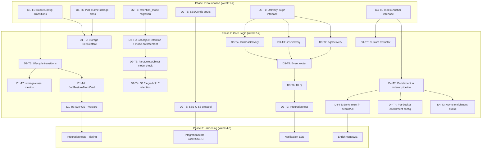

现在我已掌握全套背景信息，以下是从 Tech Lead 角度对扩展方向文档的全面分析。

---

# 技术领导力分析：扩展方向 v119 战略扩展

## 目录
1. [任务分解](#1-任务分解)
2. [执行顺序](#2-执行顺序)
3. [技术风险](#3-技术风险)
4. [资源评估](#4-资源评估)
5. [质量保证](#5-质量保证)
6. [实施计划](#6-实施计划)

---

## 1. 任务分解

每个方向分解为 2-4 小时可完成的任务，共计 **28 个任务**，跨越 **4 个功能方向**。

### 方向 1：冷存储分层与生命周期转换

| 任务 ID | 任务标题 | 涉及文件 | 前置依赖 | 预估工时 | 验收标准 |
|---------|---------|---------|---------|---------|---------|
| **D1-T1** | 扩展 `BucketConfig`：生命周期规则支持 `Transitions[]` | `internal/repository/repository.go`、`sql_buckets.go`、迁移 `0025_lifecycle_transitions`（双文件） | 无 | 4 小时 | BucketConfig 存储 `Transitions` 切片（`Days` + `TargetClass`）；JSON 序列化/反序列化通过；迁移向上/向下版本均可重复执行 |
| **D1-T2** | 向 `Storage` 接口添加 `Tier()` 和 `Restore()` | `internal/storage/storage.go`、`local.go`、`s3.go`、`oss.go`、`cos.go` | D1-T1 | 4 小时 | 接口新增 `Tier(ctx, key, targetClass)` 和 `Restore(ctx, key, days)`；local 实现为 no-op；S3 后端调用 `CopyObject` + `RestoreObject`；所有后端编译通过 |
| **D1-T3** | 重构 `reconcile/lifecycle.go`：sweep 过程中实现转换（而不仅仅是过期删除） | `internal/reconcile/lifecycle.go` | D1-T1，D1-T2 | 4 小时 | LifecycleJob 读取 transitions 规则；为每个匹配对象调用 `Store.Tier()`；`transition_total{source,target}` 计数打点；对象 `storage_class` 更新到数据库 |
| **D1-T4** | 添加 `JobRestoreFromCold` 作业处理程序和轮询端点 | `internal/jobs/`、`internal/service/file_crud.go` | D1-T2 | 3 小时 | 异步恢复作业持久化到 `jobs` 表；`GET /v1/admin/jobs/{id}` 可轮询状态；storage key 不变 |
| **D1-T5** | S3 `POST ?restore` 带有 XML `<RestoreRequest>` 解析 | `internal/api/s3compat/handler.go`、`xml.go` | D1-T4 | 3 小时 | `<RestoreRequest><Days>N</Days></RestoreRequest>` 解析；返回 `202 Accepted`；恢复作业入队；`x-amz-restore` 头部在 HEAD/GET 上返回 |
| **D1-T6** | PUT 请求支持 `x-amz-storage-class` 头部 | `internal/api/s3compat/handler.go`、`internal/service/file_crud.go` | 无 | 2 小时 | PUT 对象上的 `x-amz-storage-class` 覆盖 `StorageClass`；无效值返回 `400 InvalidStorageClass` |
| **D1-T7** | REST API 的存储类分布端点 + 指标 | `internal/api/rest/handler.go`、`internal/telemetry/prometheus.go` | D1-T1 | 2 小时 | `GET /v1/storage-class-stats` 返回 `{STANDARD: N, STANDARD_IA: M, ...}`；`aero_storage_class_bytes` 指标 |

### 方向 2：对象锁定治理模式 & SSE-C

| 任务 ID | 任务标题 | 涉及文件 | 前置依赖 | 预估工时 | 验收标准 |
|---------|---------|---------|---------|---------|---------|
| **D2-T1** | 模式迁移：`retention_mode TEXT` 到 `objects`，添加 `default_retention_mode` 到 bucket 配置 | 迁移 `0026_object_lock_retention_mode`（双文件）；`internal/repository/repository.go` | 无 | 3 小时 | `objects.retention_mode` 列允许 `NULL`/`"GOVERNANCE"`/`"COMPLIANCE"`；BucketConfig 有 `DefaultRetentionMode`；迁移可重复执行；不影响现有 WORM 对象 |
| **D2-T2** | 添加 `SetObjectRetention()` 到仓库层，带模式校验 | `internal/repository/sql_objects.go`、`repository.go`、`sqlite/`、`postgres/` 方言 | D2-T1 | 4 小时 | `SetObjectRetention(ctx, tenant, bucket, key, mode, retainUntil)` 写入 `retention_mode` + `locked_until`；COMPLIANCE 对象禁止任何删除（包括 `HardDeleteObject`）；GOVERNANCE 允许 `SkipGovernance()` 上下文绕过 |
| **D2-T3** | 更新 `hardDeleteObject` 以检查模式 | `internal/service/file_crud.go` | D2-T2 | 2 小时 | `hardDeleteObject` 检查 `retention_mode`；必须是 COMPLIANCE → 拒绝所有删除；GOVERNANCE → 仅在 `SkipGovernance()` 作用域存在时允许 |
| **D2-T4** | S3 API：`?legal-hold` 和 `?retention` 子资源 | `internal/api/s3compat/handler.go`、`xml.go` | D2-T3 | 4 小时 | `PUT ?legal-hold` 解析 `<LegalHold><Status>ON|OFF</Status></LegalHold>`；`PUT ?retention` 解析 `<Retention><Mode>GOVERNANCE|COMPLIANCE</Mode><RetainUntilDate>...</RetainUntilDate></Retention>`；`x-amz-bypass-governance-retention: true` 对 DELETE 生效 |
| **D2-T5** | `storage.SSEConfig` 用于每个请求的客户密钥 | `internal/storage/storage.go`、`encrypt.go` | 无 | 4 小时 | `SSEConfig{Key, KeyMD5, Algorithm}` 结构体；`PutOptions`/`GetOptions` 嵌入 `SSEConfig`；对所有后端的 `Storage` 接口添加 `SSECapable() bool`；local 做直通（不加密），S3 传递 `x-amz-server-side-encryption-customer-*` 头部 |
| **D2-T6** | SSE-C S3 协议解析 + CopyObject 传播 | `internal/api/s3compat/handler.go`、`internal/service/file_crud.go` | D2-T5 | 3 小时 | Put/Get/Head/Copy 解析 `x-amz-server-side-encryption-customer-*` 头部（算法、密钥、密钥 MD5、CopySource 变体）；无效密钥返回 `400 InvalidRequest`；密钥不出现在日志或错误信息中 |

### 方向 3：事件通知流水线（SQS/SNS/Lambda）

| 任务 ID | 任务标题 | 涉及文件 | 前置依赖 | 预估工时 | 验收标准 |
|---------|---------|---------|---------|---------|---------|
| **D3-T1** | 新建 `internal/notifications` 包：`DeliveryPlugin` 接口 + 工厂 | `internal/notifications/plugin.go` | 无 | 2 小时 | `DeliveryPlugin` 接口包含 `Deliver(ctx, rule, event) error`；`NewDeliveryPlugin(kind string, cfg Config) (DeliveryPlugin, error)` 工厂函数 |
| **D3-T2** | 实现 `sqsDelivery` 插件 | `internal/notifications/sqs.go` | D3-T1 | 3 小时 | 使用 AWS SDK v2 发送到 SQS ARN；10 条消息批量处理；`EVENTS_SQS_ENABLED` 标志门控；验证 ARN 格式；无 AWS 环境时优雅跳过 |
| **D3-T3** | 实现 `snsDelivery` 插件 | `internal/notifications/sns.go` | D3-T1 | 2 小时 | 发布到 SNS 主题 ARN；`EVENTS_SNS_ENABLED` 门控；支持消息属性用于事件类型过滤 |
| **D3-T4** | 实现 `lambdaDelivery` 插件 | `internal/notifications/lambda.go` | D3-T1 | 3 小时 | 通过 AWS SDK 或通用 HTTP 调用 Lambda（如果 `LAMBDA_HTTP_ENDPOINT` 已设置）；`EVENTS_LAMBDA_ENABLED` 门控 |
| **D3-T5** | 事件路由：启动时将 bucket 通知规则与事件匹配并分发 | `internal/notifications/router.go`、`internal/events/bus.go` | D3-T2, D3-T3, D3-T4 | 4 小时 | `NotificationRouter` 订阅 `events.Bus`；加载所有 bucket 配置；匹配 `FilterKey`（前缀/后缀）；分发给适当的插件；`notification_delivery_total{target,status}` 指标 |
| **D3-T6** | 失败通知的死信队列（DLQ） | `internal/notifications/dlq.go`、`internal/repository/sql_notifications_dlq.go`、迁移 `0027_notification_dlq` | D3-T5 | 3 小时 | 专有的 `notification_dlq` 表具有 `max_attempts`、`last_error`、`next_retry_at`；重试机制类似 `webhook_failures`；`dlq_depth` 指标 |
| **D3-T7** | 集成测试：端到端事件 → SQS 模拟 → 确认送达 | `internal/notifications/integration_test.go` | D3-T6 | 2 小时 | 测试使用 `testcontainers-go` 或本地 SQS 模拟器；验证：发布事件 → 路由 → 交付（至少一次）；过滤按前缀/后缀生效 |

### 方向 4：AI 原生元数据流水线（自动标记、分类、摘要）

| 任务 ID | 任务标题 | 涉及文件 | 前置依赖 | 预估工时 | 验收标准 |
|---------|---------|---------|---------|---------|---------|
| **D4-T1** | 定义 `IndexEnricher` 接口 + 内建标签器/摘要器/分类器 | `internal/ai/enricher.go`、`internal/ai/llm.go` | 无 | 4 小时 | `Enrich(ctx, text, obj) (*Enrichment, error)` 接口；`LLMClassifier`、`LLMSummarizer`、`LLMTagger` 结构体实现它；每个都使用 `LLM.Chat` 调用带提示模板；错误时优雅降级（warn 日志，不阻断索引） |
| **D4-T2** | 将富化步骤接入索引器流水线（提取 → 富化 → 分块 → 嵌入） | `internal/ai/indexer.go` | D4-T1 | 3 小时 | `Indexer.Enricher` 字段（可为 nil）；`indexObject` 调用 `enricher.Enrich()`；结果写入对象元数据（`_aio_summary`、`_aio_tags`）；`ai_enrichment_total{enricher,status}` 指标 |
| **D4-T3** | 独立的富化作业队列（异步，与索引器解耦） | `internal/ai/enrichment_job.go`、`main.go` | D4-T2 | 3 小时 | 富化通过 `JobEnrichObject` 作业类型异步运行；索引器不会等待富化完成；索引器进度与富化分离 |
| **D4-T4** | 按 bucket 的富化配置：`AI_ENRICHMENT_ENABLED` + bucket 级富化规则 | `internal/repository/repository.go`、`sql_buckets.go`、`internal/service/file_features.go` | D4-T3 | 2 小时 | BucketConfig 有 `EnrichmentRules{ClassifierEnabled, SummarizerEnabled, TaggerEnabled}`；`PUT /v1/buckets/{bucket}/enrichment` API |
| **D4-T5** | 自定义提取器：用户定义 JSON Schema + 提示模板 | `internal/ai/enricher.go`、`internal/ai/custom_extractor.go` | D4-T1 | 4 小时 | 用户定义 `{"schema": {"fields": [{"name":"invoice_total","type":"number","prompt":"提取发票总额"}]}}`；LLM 执行结构化输出；结果在 `_aio_extracted_*` 元数据中返回 |
| **D4-T6** | 富化元数据暴露在搜索/血缘/UI 中 | `internal/ai/search.go`、`internal/api/rest/handler.go`、`web/ui/` | D4-T2 | 3 小时 | 搜索结果包含 `summary` 和 `auto_tags` 字段；`GET /v1/lineage/objects/{id}` 显示富化信息；Web UI 搜索标签页展示富化元数据 |

---

## 2. 执行顺序

### 总体依赖图



### 并行工作流

以下任务组由于文件不重叠，可分配给不同开发者完全并行：

| 并行组 | 任务 | 开发者技能要求 |
|--------|------|--------------|
| **组 A** | D1-T1, D1-T6（方向 1 基础） | Go, SQL, S3 API |
| **组 B** | D2-T1, D2-T5（方向 2 基础） | Go, SQL, 加密概念 |
| **组 C** | D3-T1（方向 3 基础） | Go, 接口设计 |
| **组 D** | D4-T1（方向 4 基础） | Go, LLM 提示工程, AI pipeline |

在 Phase 2 中，D3-T2/D3-T3/D3-T4 可并行，D1-T4/D1-T5 是串行的，D2-T2/D2-T3/D2-T4 也是串行的。

---

## 3. 技术风险

### 3.1 关键风险矩阵

| ID | 风险 | 方向 | 影响 | 概率 | 缓解措施 |
|----|------|------|------|------|---------|
| R1 | **GLACIER 还原语义冲突**：本地 FS 没有原生 GLACIER 概念，但 lifecycle 却引用它 | D1 | 用户期望的还原行为未定义 | **高** | 记录：在本地 FS 上，`STANDARD_IA`/`GLACIER` 是逻辑类——在本地无操作；SKIP 在生命周期的转换步骤而非实际移动数据。在 S3 后端上，委托给原生 API |
| R2 | **事务性锁定漏洞**：`hardDeleteObject` 中的 `retention_mode` 检查在并发状态下可能被绕过——先读再写不是原子操作 | D2 | 治理/合规性锁定在并发删除下可能被破坏 | 中 | 使用 `UPDATE objects SET deleted_at=now() WHERE id=$1 AND (retention_mode IS NULL OR retention_mode!='COMPLIANCE')` 在 DB 层原子执行。仓库层负责强制执行 |
| R3 | **AWS SDK 依赖膨胀**：引入 `github.com/aws/aws-sdk-go-v2` 用于 SQS/SNS/Lambda 会增加构建时间和攻击面 | D3 | 编译时间增长、CVE 依赖、非 AWS 部署中的无用代码 | **高** | 使用构建标签 (`//go:build aws`) 隔离 AWS 代码。为自托管部署提供通用的 HTTP 回退。新依赖重量约 20MB——需团队论证 |
| R4 | **LLM 富化延迟**：在索引路径中调用 LLM 可能增加 500ms–5s/对象的延迟 | D4 | 大批量摄取时索引器队列入队速度变慢 | 中 | 将富化移到单独的作业队列（D4-T3）。索引器在没有富化的情况下继续执行；富化作为一个低优先级的后台进程 |
| R5 | **SSE-C 密钥泄露风险**：客户密钥在请求上下文中传递；记录错误的日志行可能捕获密钥 | D2 | 合规性违规、密钥泄露 | 中 | 使用不可修改的日志包装器覆盖 `fmt.Stringer`。在 `slog` 集成中为 `SSEConfig` 添加 `LogValuator`。代码审查必须验证密钥从不序列化到日志 |
| R6 | **向量模型偏移**：富化 LLM 中的提示更改可能导致表示不同格式的输出元数据 | D4 | 搜索消费方解析 `_aio_summary`/`_aio_tags` 字段时出现解析错误 | 低 | 富化值通过固定模式输出（分类为 `[]string`，摘要为 `string`）。JSON Schema 验证用于自定义提取器 |
| R7 | **通知递送背压**：高事件吞吐量（每秒数千对象）可能压垮 SQS/SNS 递送 | D3 | 缓冲区溢出、事件丢失 | 低 | 使用有界递送通道（复用 `Jobs.MaxDepth` 模式）。背压在通道满时丢弃事件（通过 `Bus.Dropped()` 计数） |
| R8 | **客户密钥的多部分上传**：SSE-C 要求每个部分的客户密钥与最终确定一致 | D2 | 如果密钥在部分上传之间轮换，则上传失败 | 低 | 在 `InitMultipart` 期间存储密钥指纹；在 `CompleteMultipart` 时确认匹配。文档说明：如果密钥轮换，多部分上传将失败 |

### 3.2 性能热点

| 热点 | 方向 | 预期负载 | 对策 |
|------|------|---------|---------|
| Lifecycle sweep 扫描所有 bucket | D1 | 每 15 分钟一次，扫描所有到期对象 | `ListExpired` 查询使用正确的索引（`bucket_id + expire_after_days + updated_at`）。数据库 `EXPLAIN ANALYZE` 作为验收标准 |
| SSE-C 密钥派生 | D2 | 每个请求，每个对象 | 每个请求只派生一次密钥；使用与 SSE-KMS 相同的包络模式，复用 `encrypt.go` |
| BG 富化作业队列 | D4 | 每秒 10-100 个作业 | 单独的工作线程池（与索引器池分离）。作业并发数限制。富化延迟是告警指标 |
| SQS 批量发送 | D3 | 每秒数千条消息 | `sqsDelivery.SendMessageBatch` 每次 API 调用最多 10 条消息；更大的缓冲窗口（最多 100 条消息 / 每秒） |

---

## 4. 资源评估

### 4.1 团队规模与技能要求

| 角色 | 所需数量 | 方向覆盖 | 关键技能 |
|------|---------|---------|---------|
| **后台 Go 工程师（中高级）** | 2 | D1, D2, D3 | S3 API、SQL 方言差异、并发模式、加密基础 |
| **AI/ML 工程师** | 1 | D4 | LLM 提示工程、向量数据库、文本处理流水线、分类 |
| **DevOps/基础设施工程师** | 0.5 | D3（AWS 集成）, 所有方向 | AWS SDK、IAM 策略、测试基础设施 |
| **QA/测试工程师** | 1 | 所有方向 | 集成测试（Docker compose）、契约测试、性能测试 |
| **技术负责人（本分析人员）** | 1 | 所有方向 | 架构监督、代码审查、ADR 签名 |

**总计：4-5 名全职工程师 + 1 名兼职 DevOps**，持续 6 周。

### 4.2 关键里程碑

| 里程碑 | 日期（预计） | 交付物 | 依赖项 |
|--------|-------------|---------|---------|
| M1：范围冻结 + 第一个 ADR 签署 | 第 1 天 | 4 份 ADR（每方向一份） | 无 |
| M2：基础设施迁移 | 第 3 天 | 4 次迁移（`0025`–`0028`）编译并测试通过 | 无 |
| M3：方向 1 核心（生命周期转换）就绪 | 第 10 天 | 生命周期 Job 在 `STANDARD → STANDARD_IA` 转换上的传递 | D1-T1, D1-T2, D1-T3 |
| M4：方向 2 核心（锁定模式强制）就绪 | 第 10 天 | COMPLIANCE 模式锁定不可删除；GOVERNANCE 可绕过 | D2-T1, D2-T2, D2-T3 |
| M5：所有方向功能完整 | 第 25 天 | 所有 28 个任务完成；`go build ./...` + `go test ./...` 为绿色 | 所有任务 |
| M6：集成测试完成 | 第 30 天 | S3 兼容性测试套件通过；无回归 | M5 |
| M7：性能基准测试 + 优化 | 第 35 天 | Latency p95 约束验证；内存 profiling | M6 |
| M8：发布候选 | 第 38 天 | 标签 `v0.2.0-rc.1`；所有检查通过 | M7 |

### 4.3 阻塞点与解决策略

| 阻塞点 | 方向 | 根因 | 解决策略 |
|--------|------|------|---------|
| **AWS SDK 依赖审核** | D3 | 组织政策要求新依赖通过安全审查 | 提前开始审查流程（第 1 天）。提供编译时构建标签作为备选方案。如果审查耗时过长，先使用通用 HTTP 交付 |
| **SSE-C 密钥管理 UX** | D2 | 客户密钥大小/格式不明确（32 字节？64 字节？base64？） | 严格遵循 AWS 规范：`x-amz-server-side-encryption-customer-key` 是未编码的 256 位密钥（32 字节）+ base64 编码的 MD5 校验和。类型化常量在 `storage.SSEConfig` 中 |
| **LLM 富化质量不确定** | D4 | 自动标签可能质量低 | 初始实现逐步上线：首先标记/摘要，然后扩展。提供可配置的置信度阈值。向用户公开原始 LLM 输出以进行人工验证 |
| **生命周期转换的边界情况** | D1 | 新对象可能在同一次 sweep 中同时被安排转换和过期 | 在一次 sweep 中先处理转换，然后处理过期。不要在同一个 sweep 中转换达到过期日期的对象 |

---

## 5. 质量保证

### 5.1 单元测试覆盖要求

| 包 | 要求覆盖率 | 重点领域 | 测试方法 |
|----|-----------|---------|---------|
| `internal/reconcile/` | ≥ 70% | 生命周期 sweep 逻辑；转换与过期的优先级 | 使用内存 SQLite + mock 存储。验证转换被正确跳过、对象存储类已更新 |
| `internal/service/` | ≥ 70% | retention mode 检查（`hardDeleteObject`）；SSE-C 选项传播；恢复工作流 | 表驱动测试，覆盖 COMPLIANCE/GOVERNANCE/no-lock 场景。通过 `SkipGovernance()` 上下文验证治理绕过 |
| `internal/storage/` | ≥ 80% | `Tier()` no-op on local；S3 `Tier()` 委托 | 契约套件（`contract_test.go`）；S3 的 mock AWS SDK |
| `internal/notifications/` | ≥ 75% | 交付插件；规则匹配（前缀/后缀）；DLQ 重试逻辑 | SQS/SNS/Lambda 的 Mock AWS SDK；使用 `httptest` 的 HTTP 回退 |
| `internal/ai/` | ≥ 65% | `Enricher` 接口实现；富化数据写入对象元数据；自定义提取器 | Mock LLM（已有的 `ai.MockLLM`）返回确定性输出；验证 `repository.SetObjectMetaKey` 调用 |
| `internal/repository/` | ≥ 75% | 新迁移（`0025`–`0028`）在 SQLite 和 Postgres 上均可重复执行；`SetObjectRetention` 原子性 | 两种方言的`TestMain`；T、COMPLIANCE 场景的显式并行测试 |

**新增行（跨所有包）的测试覆盖目标**：**≥ 75%**（高于基线 50%，属于新代码）。

### 5.2 集成测试策略

| 测试套件 | 技术 | 所需基础设施 | 方向 | CI 门控？ |
|---------|------|-------------|------|-----------|
| 生命周期 sweep → 转换 | `TestMain`（SQLite） | 无 | D1 | 是 |
| COMPLIANCE 锁定不可删除 | `TestMain`（SQLite + Postgres） | Docker（可选） | D2 | 是 |
| SSE-C Put/Get 往返 | `TestMain`（S3 后端需 mock） | 无 | D2 | 是 |
| S3 `?restore` 端点 | `httptest` + mock 作业队列 | 无 | D1 | 是 |
| 通知路由 → SQS 交付 | `testcontainers-go`（localstack）或单独测试中的 mock AWS | Docker | D3 | 否（本地 `go test -tags=integration`） |
| 索引 → 富化 → 元数据写入 | `TestMain` + mock LLM | 无 | D4 | 是 |
| SSE-C + 多部分上传 | `TestMain` + 本地存储后端 | 无 | D2 | 是 |

### 5.3 代码审查要点

| 审查优先级 | 要审查的内容 | 原因 |
|-----------|---------|------|
| **P0** | 安全：日志/错误消息中的 SSE-C 密钥 | 合规性违规风险 |
| **P0** | 安全：`retention_mode` 中的竞争条件 | 锁定绕过风险 |
| **P0** | 事务：生命周期转换 + 对象更新是原子的吗？ | 数据不一致 Risk |
| **P1** | API：新的 S3 子资源不中断现有客户端 | 向后兼容 |
| **P1** | 配置：所有新功能默认关闭（I5） | 最小权限原则 |
| **P1** | 指标：每个新功能是否添加了 `telemetry.Inc*` 调用？ | 可观测性 |
| **P2** | SQL：迁移可重复执行；新的 SELECT 使用正确的索引 | 性能 |
| **P2** | Go 风格：不超过 50 行的函数；不超过 500 行的文件 | 工程约束（`AGENTS.md`） |

### 5.4 性能测试需求

| 测试场景 | 方向 | 负载参数 | 通过标准 | 失败时的回滚计划 |
|---------|------|---------|---------|----------------|
| 生命周期 sweep：10K 个对象，5% 需转换 | D1 | 10K 对象一次 sweep | sweep 在 < 5 秒内完成 | 增加 `ListExpired` 页面大小，添加 storage_class 索引 |
| SSE-C：10 个并发客户端，混合读/写 | D2 | 10 个 goroutine，每个 100 个对象 | P95 延迟比未加密增加 < 5% | 在内核中缓存派生密钥（带 TTL 的 `sync.Map`） |
| 通知：1000 个事件/秒，SQS 交付 | D3 | 1000 个事件，1 秒内突发 | 交付延迟 P99 < 200ms | 增加批量大小，调整缓冲通道深度 |
| 富化：100 个对象/分钟，LLM 摘要 | D4 | 100 个对象，CL100K 模型 | 富化作业在 60 秒内完成 | 降低作业并发数，限制 LLM 同时调用次数 |
| 回归：基线 CRUD 不受影响 | 全部 | 每个方向在启用/禁用时进行 1000 次写入/读取 | 差异 < 3% | 确保所有新代码路径由标志门控 |

---

## 6. 实施计划

### 6.1 阶段 1：基础设施搭建（第 1–3 天）

**目标**：准备好基础——迁移、接口定义、配置。

```
Day 1   │   Day 2   │   Day 3
────────┼───────────┼───────────
ADR签约  │ D1-T1 完成│ D2-T5 完成
(所有4份) │ D2-T1 完成│ D3-T1 完成
         │ D1-T6 完成│ D4-T1 完成
         │           │ 4次迁移全部通过
```

**日 1 交付物**：4 份 ADR（每方向一份），团队签署。
**日 3 交付物**：4 次模式迁移（`0025`–`0028`）在 SQLite 和 Postgres 上编译并测试通过。4 个接口定义（`Storage.Tier`、`SSEConfig`、`DeliveryPlugin`、`IndexEnricher`）合并到 `main`。

### 6.2 阶段 2：核心功能实现（第 4–18 天）

**目标**：所有 4 个方向的核心逻辑实现并测试。

```
Week 2           │ Week 3
─────────────────┼───────────────────
D1-T2 (Storage)  │ D1-T4 (JobPool)
D1-T3 (Lifecycle)│ D1-T5 (S3 restore)
D2-T2 (Retention) │ D2-T4 (S3 legal-hold)
D2-T3 (hardDelete)│ D2-T6 (SSE-C proto)
D3-T2 (SQS)      │ D3-T5 (Router)
D3-T3 (SNS)      │ D3-T6 (DLQ)
D3-T4 (Lambda)   │ D3-T7 (集成测试)
D4-T2 (Indexer)  │ D4-T3 (Async queue)
D4-T5 (Custom)   │ D4-T4 (Bucket config)
                 │ D4-T6 (Search/UI)
```

**检查点（第 18 天）**：所有 28 个任务标记为完成。`go build ./...` 通过。`go test ./...` 为绿色。

### 6.3 阶段 3：集成测试与优化（第 19–30 天）

```
Week 4                 │ Week 5
───────────────────────┼───────────────────────
集成测试：方向 1 (D1)  │ 集成测试：方向 4 (D4)
集成测试：方向 2 (D2)  │ 性能基准测试
集成测试：方向 3 (D3)  │ 优化（热点）
修复测试失败           │ 压力测试
```

**压力测试矩阵**：

| 场景 | 持续时间 | 预期结果 |
|------|---------|---------|
| 启用全部 4 个方向运行 24 小时 | 24 小时 | 零 OOM、零数据损坏、零意外拒绝 |
| 生命周期 sweep 3 天内的 100K 对象 | 1 小时 | < 30 秒的 sweep 通过；所有转换正确 |
| SSE-C 上的 10 个并发副本 | 5 分钟 | 零数据损坏；使用 `xxd` 验证目标 blob 进行密钥旋转 |
| 富化 + 搜索 1000 篇文档 | 10 分钟 | 富化元数据可搜索；搜索 e2e 延迟 < 500ms p95 |

### 6.4 阶段 4：发布准备（第 31–38 天）

```
Week 6
───────────────────────────────────────
文档编制（用户 docs + API 参考）
变更日志更新（添加 4 个方向的条目）
Grafana 仪表板（每个方向 2-3 个面板）
Prometheus 告警（每个方向 1-2 条规则）
Helm values.yaml（新功能标志）
最终回归测试套件
v0.2.0-rc.1 标签
```

**最终交付物**：

| 工件 | 标准 |
|------|------|
| `CHANGELOG.md` | 每方向 1 节；4 小节 |
| `docs/` | 冷分层、对象锁定、SSE-C、通知、AI 富化的用户文档 |
| `deploy/grafana/` | +8 panels（每方向 2 个） |
| `deploy/prometheus/` | +4 告警规则 |
| `deploy/helm/aero-vault/values.yaml` | 4 个新的功能标志，默认 false |
| `openapi.json` | 4 个新的操作 |
| `go.mod` | 无 AWS SDK 依赖，除非团队批准 |

### 6.5 如果某个方向需要延期的应急计划

由于所有 4 个方向都是**特性门控**（默认 false），**任何未完成的方向都可以推迟到 v0.3.0**，而不会影响其他方向。如果团队过度承诺，推荐以下降级路径：

| 如果…… | 则推迟…… | 已完成的非门控工作仍将合并 |
|---------|---------|----------------------------|
| 方向 3 因 AWS SDK 审核而延迟 | D3 到 v0.3.0 | D3-T1（接口）、D3-T6（DLQ）+ D3-T7（测试）——仅 SDK 代码延迟 |
| 方向 4 质量未达到标准 | D4-T3（异步队列）和 D4-T5（自定义提取器）到 v0.3.0 | D4-T1 + D4-T2 + D4-T6（基于 LLM 富化，无异步） |
| 方向 2 SSE-C 证明过于复杂 | D2-T5 + D2-T6 到 v0.3.0 | D2-T1 到 D2-T4（对象锁定模式——无需 SSE-C 即可独立发布） |
| 方向 1 GLACIER 还原语义未达成一致 | D1-T4 + D1-T5 到 v0.3.0 | D1-T1 到 D1-T3 + D1-T6 + D1-T7（仅生命周期转换——准备就绪独立发布） |

**无条件保留的方向**：即使其他所有方向都延迟，方向 2 的锁定模式核心（D2-T1 到 D2-T4）也应发布，因为它是法规要求。

---

## 总结：建议

| 维度 | 推荐 |
|------|------|
| **立即开始** | 方向 1 + 方向 2 核心（并行：D1-T1 + D1-T6 + D2-T1 + D2-T5） |
| **第 2 周开始** | 方向 3 基础（D3-T1） + 方向 4 基础（D4-T1） |
| **最危险** | 方向 3（AWS SDK 依赖）——尽快启动审核 |
| **最高回报** | 方向 4—主要差异化因素。在 v0.2.0 中发布最低限度可行版本（LLM 分类+摘要），推迟自定义提取器到 v0.3.0 |
| **团队建议** | 2 名 Go 后台工程师（方向 1+2）+ 1 名 AI 工程师（方向 4）+ 1 名跨职能工程师（方向 3 + 测试）= 4 名工程师，6 周 |
