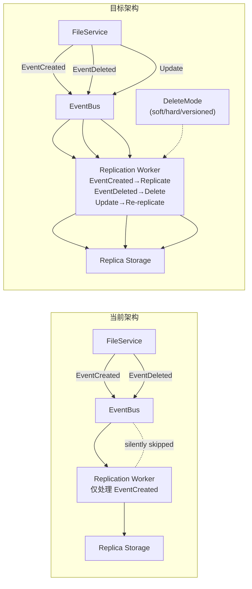
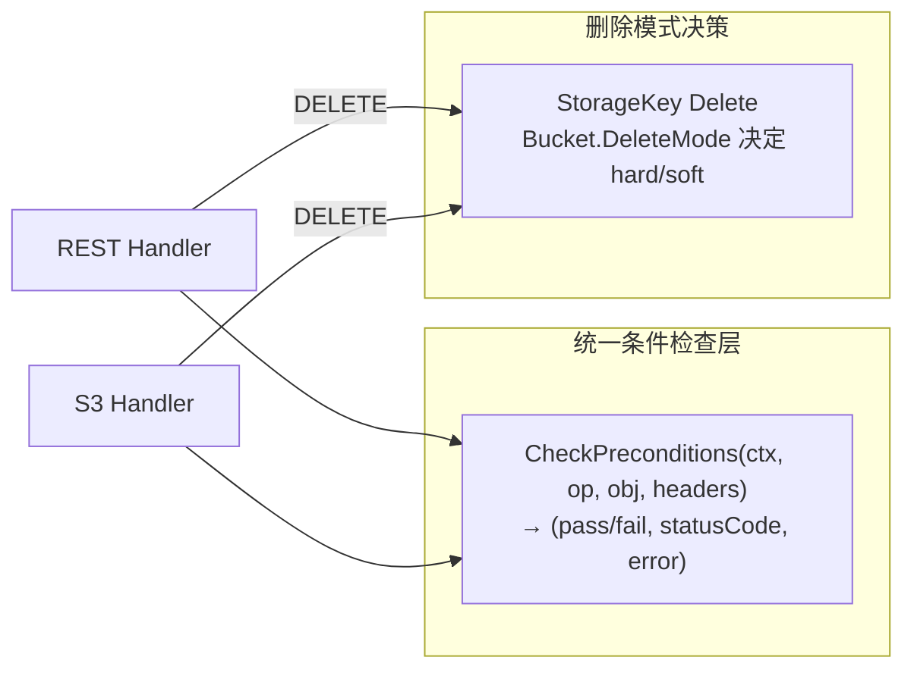

以下是对 `docs/requirements/expansion-v121-replication-integrity-sse-resilience-cross-protocol-cli-event-timing.md` 的架构级分析。

---

# 架构分析报告：AeroVault 五个高价值扩展方向

## 1. 架构评估

### 1.1 当前架构的优势

AeroVault 当前架构的四层设计（Protocol → Service → Storage/Repository → Eventing/Workers）展现了几个关键优势：

**优势 A — 统一 FileService 核心是正确的架构决策。** 所有四个协议适配器（REST、S3、WebDAV、MCP）共享同一个对象 CRUD 入口点，这意味着业务规则（配额、版本控制、锁、标记）只实现一次。这与 AGENTS.md 中"禁止协议层绕过 FileService 直连 Storage"的约束一致，是一个优秀的架构边界。

**优势 B — EventBus 的双轨设计（持久化 DB + 易失性 in-memory broadcast）兼顾了可靠性和实时性。** 事件首先写入 `object_events` 表，然后通过 in-memory channel 广播给本地 subscriber。在多数运行良好的场景下，subscriber 获得极低延迟的事件通知；崩溃时数据不会丢失（在 DB 中持久化）。这个设计模式是正确的。

**优势 C — Storage 抽象接口足够小且稳定。** `storage.Storage` 的 6+ 核心方法加上 multipart 系列，经过了 local/s3/oss/cos 四个后端的验证。factory 模式让复制目标可以重用任意后端实现。

**优势 D — IoC 风格的装配模式。** `main.go` 通过依赖注入将 Storage、Repository、EventBus 组装到 Worker 和 Service 中。这使得单元测试和集成测试可以用 mock 替代真实后端，符合 AGENTS.md 中"所有业务逻辑必须可测试"的约束。

### 1.2 局限性

**局限性 1 — 事件总线的 subscriber 无分级（所有 consumer 同等对待）。** 当前 `broadcast()` 对所有 subscriber 统一使用 non-blocking send + drop 策略。复制、Webhook、索引器等"不能丢"的消费者与 SSE（"可以丢但需可恢复"）使用相同处理路径。这导致了一个设计矛盾：如果为了提高可靠性而将 channel 改为阻塞 send，一个慢 SSE subscriber 将阻塞整个 broadcast 循环；如果保持 drop，可靠消费者可能丢失事件数据（尽管 DB 副本仍在）。

**局限性 2 — EventBus 无 subscriber 标识机制。** `Subscribe()` 返回的是匿名 channel，没有任何 subscriber 身份标签。这是 SSE 持久游标无法实现的技术根源——系统无法知道"哪个客户端已经消费到哪个事件 ID"。

**局限性 3 — 复制 Worker 的设计反射了早期架构假设（"复制 ≈ 备份"而非"复制 ≈ 镜像"）。** 代码中 `e.Type != repository.EventCreated` 的 `continue` 是一个明确的架构决策信号：设计者最初只考虑了创建时复制，没有将删除和更新纳入复制生命周期。Dedupe key 使用 `ObjectID` 进一步证实了这个假设——设计者预期每个对象只复制一次。

**局限性 4 — 条件请求逻辑按协议分裂。** `internal/api/rest/conditional.go` 和 `internal/api/s3compat/conditional.go` 是两套独立的实现。虽然它们在当前状态下可能行为一致，但并行维护的版本会在后续迭代中漂移。这违反了 DRY 原则，且增加了安全漏洞的风险（如果一处修复了边界情况，另一处可能遗漏）。

**局限性 5 — CLI 的架构是一个简单的 switch-over-handler-map，缺乏统一的错误处理基建。** 每个 handler 独立决定是否检查 HTTP 状态码、如何格式化输出、返回什么退出码。这种"轻架构"在 CLI 命令少时合理，但随着命令增长（当前 10+），缺乏统一的错误包装和输出格式化层会导致标准不一致。

### 1.3 架构债务识别

| 债务类型 | 位置 | 影响 | 偿还优先级 |
|---------|------|------|----------|
| 复制仅处理 EventCreated | `internal/replication/replication.go:78` | 数据一致性风险（灾备副本物理状态与主站偏离） | P0 |
| Dedupe key 对同一 ObjectID 的覆盖写去重不当 | `internal/replication/replication.go:85` | 更新后的内容不复制到副本 | P0 |
| EventBus subscriber 缓冲深度固定 64 | `internal/events/bus.go:30` | 任何临时阻塞导致事件丢失（有 metric 无补偿） | P1 |
| SSE 回放基于全局 unconsumed 而非客户端游标 | `internal/api/rest/sse.go:44` | 重连后回放不精确 | P1 |
| 两套条件请求逻辑并行 | `internal/api/**/conditional.go` | 维护双倍代码，行为可能漂移 | P1 |
| CLI 中 6 个文档化的 HTTP 状态码 bug | `internal/cli/cli_test.go:1419-1430` | CI 管道中静默失败 | P2 |
| JobPool 将 ErrNotFound 与真正错误同等处理 | `internal/jobs/jobs.go` | 死信队列中混入无害错误 | P2 |
| WebDAV Rename 非原子（Get→Put→Delete） | `internal/api/webdav/dav.go:251` | 中间失败可能导致数据丢失 | P1 |

---

## 2. 扩展方向

### 方向 A：复制完整性 — 从"异步备份"到"全生命周期实时镜像"

**为什么需要：**
灾备复制的核心承诺是"主站与副本状态一致"。当前实现仅满足"主站有的副本也有"，不满足"主站删的副本也删"。对于合规场景（GDPR 删除义务、法律保留解除）、成本管理（副本中积累的已删除对象占用存储费用）、以及故障切换后的用户体验（切换到副本后用户看到不应存在的过期对象），缺失删除复制都是实质性缺陷。

**核心挑战：**

1. **事件顺序保证** — 当主站收到对同一对象的快速覆盖写 + 删除时（`PUT` → `PUT` → `DELETE`），事件顺序是 `EventCreated` → `EventCreated`(deduped) → `EventDeleted`。副本需要以正确的顺序应用这些变更，或者在最终一致模型下至少保证最终状态一致。
2. **幂等删除** — 副本上删除一个尚未复制的对象（先发删除事件，复制任务尚未执行创建）需要正确处理。这牵涉到方向五的时序缺口。
3. **版本化桶的语义传播** — 主站的版本化桶在副本上是否也应版本化？S3 DeleteObject 删除最新版本在副本上应如何映射？

**预期的架构变更：**



- `ReplicateObjectByID` → 扩展为 `ReplicateObject` 和 `DeleteReplicaObject` 两条路径
- `ReplicateObjectByID` 中的 dedupe key 从 `ObjectID` 改为 `ObjectID:VersionID` 或 `ObjectID:UpdatedAt`

**对现有系统的影响：**
- 新增的删除路径不影响现有的复制功能（向后兼容）
- dedupe key 变更会使队列中已有的 Job 与新 Job 不再冲突（需要确保旧 Job 和新 Job 不会重复执行同一操作——幂等性保证）
- Replica Storage 的 `Delete` 已经是幂等的，所以删除不存在的对象不会出错

### 方向 B：EventBus 演进 — 从单一无差别的广播到分级 subscriber 模型

**为什么需要：**
当前 `broadcast()` 对所有 subscriber 一视同仁。但不同 subscriber 有不同的可靠性需求：
- **可靠级**（复制、Webhook、索引器）：即使 subscriber 暂时落后，也不能丢事件。丢失意味着数据不一致。
- **游刃级**（SSE、Web UI 实时更新）：可以丢但需可恢复，丢的是"通知"而非"数据"。

同时，SSE 当前缺乏持久化游标导致的回放不精确问题，本质上是 EventBus 缺少 consumer 标识能力。

**核心挑战：**

1. **阻塞 vs 非阻塞的平衡** — 如果可靠级 subscriber 使用阻塞 send，它们中的一个慢消费者会阻塞所有其他 subscriber（包括游刃级的广播）。解决方案：可靠级使用单独的 goroutine-per-subscriber 或独立 channel 路径。
2. **Backpressure 信号** — 可靠级 subscriber 落后时，系统应该向上游施加反压（减缓事件生产速度）还是继续积累？在对象存储的上下文中，不能因复制落后而阻断用户的 PUT 请求。所以反压只能作用于队列深度警报，而非直接拒绝用户请求。
3. **持久化游标的存储模型** — SSE 专属的订阅表需要记录每个连接的最后事件 ID。但 TCP 连接可能因为各种原因断开，系统需要区分"客户端正常断开"（可清理游标记录）和"客户端意外断开"（保留游标）。目前没有一个优雅的方式做这个区分。

**预期的架构变更：**

```
EventBus 内部重构：

Publish(ctx, event)
  ├─ repo.InsertEvent(event)        // 持久化（不变）
  ├─ broadcast(reliable_subs)       // 阻塞发送，每个 sub 独立 goroutine
  ├─ broadcast(best_effort_subs)    // 非阻塞发送 + drop（当前逻辑）
  └─ transport(ctx, event)          // 跨实例传播（不变）
```

- 新增 `SubscribeReliable()` 和 `SubscribeBestEffort()` 两种订阅方式
- 新增 `sse_subscriptions` 表（`id, sse_client_id, last_event_id, tenant_id, created_at, updated_at`）
- SSE handler 在每个连接建立时注册游标，断开时清理（或保留一段时间供重连恢复）

**对现有系统的影响：**
- `Subscribe()` 签名不变，但内部行为根据订阅类型不同
- SSE handler 需要修改为创建连接时登记游标、发送事件后更新游标
- 现有的 `SubBufferSize` 配置参数（目前未被 SSE handler 使用）需要实际接入

### 方向 C：跨协议语义一致性层

**为什么需要：**
四协议架构是 AeroVault 的核心差异化优势，但当同一个操作在不同协议上产生不同业务效果时，差异变成了混乱之源。DELETE 是其中最严重的语义分歧——S3 的硬删除和 REST 的软删除让用户无法建立跨协议的心智模型。RENAME 在 WebDAV 中存在，在其他三个协议中完全缺失。

**核心挑战：**

1. **S3 兼容性约束** — S3 协议规范要求 DELETE 返回 `204 No Content` 并永久移除对象。任何"软删除"行为都可能破坏 S3 SDK 客户端的预期。如果 S3 改为软删除，可能违反 AWS S3 兼容性承诺。
2. **桶级别配置的扩散** — 当前桶级别配置有 `Versioning`、`ObjectLock`、`Lifecycle`。新增 `DeleteMode` (soft/hard/versioned) 是合理的，但需要避免配置项过度膨胀导致用户困惑。
3. **RENAME 的原子性** — WebDAV 的当前实现（Get → Put → Delete）非原子，失败时数据丢失。原子重命名需要 Metadata-only 操作（改变 storage key 而不移动 blob），或者 server-side copy + 旧 key 删除（在存储后端支持的情况下）。

**预期的架构变更：**



**对现有系统的影响：**
- 条件请求合并为 `internal/service/conditions.go` — REST 和 S3 都调用它
- 新增 `BucketConfig.DeleteMode` 枚举，默认兼容现有行为（S3=hard, REST=soft）
- REST 新增 `POST /v1/files/{key}/rename` 端点，参数 `{ "destination": "..." }`
- S3 新增可选扩展头 `x-amz-delete-mode: soft`（非标准，兼容 AWS 扩展规范）

**选项权衡：**

| 策略 | 优势 | 风险 |
|------|------|------|
| 统一为硬删除（S3 行为） | 符合对象存储行业惯例，存储释放可预期 | 破坏 REST 用户的可恢复性预期 |
| 统一为软删除（REST 行为） | 更安全，用户有后悔空间 | 可能违反 S3 兼容性承诺；存储不会立即释放 |
| 维持现有但桶级别可配置 | 兼容性最强，用户自己选择 | 复杂度转移给用户，配置项增加 |
| **推荐：桶级别 Versioning-aware 删除** | 如果桶启用了版本控制 → 软删除（标记删除），否则硬删除。S3 DELETE 添加 `?soft` 扩展参数让用户选择 | 行为依赖桶配置，跨协议行为仍是可预期的——因为桶是共享的 |

### 方向 D：事件时序保护层 — 处理"事件漂移"和"幽灵 ObjectID"

**为什么需要：**
方向五描述的问题本质上是**事件驱动系统中的时序竞争条件**（timing race condition）。它不是一个罕见的边界情况——在当前架构下，只要对象创建和删除的时间间隔小于事件传播 + Job 调度延迟，就会发生。随着系统负载增加（Job 队列深度增大），这个时间窗口会从毫秒级扩大到秒级甚至分钟级，问题出现频率成比例增加。

**核心挑战：**

1. **错误分类** — 当前 `ErrNotFound` 在 Job handler 层和 Job pool 层都没有特殊处理。需要建立一种错误分类机制：哪些错误是"应该重试的"（网络错误、存储临时不可用），哪些是"应该跳过的"（对象已被删除）。
2. **幂等性语义** — "对象已被删除"不是一个需要修复的错误。删除后 Job 不需要执行任何操作。但系统需要区分"从未存在"（可能是配置错误）和"已被删除"（合法的时序竞争）。
3. **版本化桶的复杂性** — 如果对象有版本历史，`GetObjectByID` 的行为应当如何？删除所有版本后该 ObjectID 的行是否还存在？当前 `HardDeleteObject` 删除行，`SoftDeleteObject` 设 `deleted_at` 但保留行。

**预期的架构变更：**

```
方案评估：

方案 A（推荐）：在 repository 层区分两种 NotFound
  - ErrObjectNotFound       // 对象从未存在或已被硬删除
  - ErrObjectAlreadyDeleted // 对象已被软删除（deleted_at IS NOT NULL）
  
  消费者逻辑：
  if errors.Is(err, repository.ErrObjectAlreadyDeleted) {
      // 直接完成 Job，不是错误
      return nil
  }

方案 B：在 Job handler 层统一处理
  - 所有消费者在获取对象后检查 deleted_at
  - 如果对象已被删除，完成 Job 而非重试
  
  缺点：每个消费者都要实现相同的检查逻辑

方案 C（防御性）：删除事件吞没阻塞的创建事件
  - EventBus 维护一个 pending map：ObjectID → 未处理的 Job 列表
  - 收到 EventDeleted 时，检查 pending 中是否有同一 ObjectID 的 Job
  - 如果有，移除这些 Job
  - 复杂度高，引入 EventBus 状态和并发安全问题
```

**对现有系统的影响：**
- 方案 A 只需要修改 `repository` 层和三个消费者（复制、防病毒、索引器）
- 不需要 DB migration（`deleted_at` 列已存在）
- 完全向后兼容——旧 Job 遇到 `ErrObjectAlreadyDeleted` 会被正确完成而非重试

### 方向 E：CLI 基建层提取

**为什么需要：**
CLI 在成为"可编程接口"之前需要统一错误处理、输出格式化和退出码规范。当前每个 handler 自包含一切的模式在命令数少时是合理的，但当命令超过 10 个时，缺乏共享基建导致：
1. HTTP 状态码检查在每个 handler 中重复或遗漏
2. 输出格式硬编码为人类可读文本
3. 退出码的不一致无法被 CI 管道可靠使用

**核心挑战：**

1. **逐步迁移 vs 一次性重构** — 修复 6 个已知 bug 可以用小型补丁（~50 行），但引入 `--json` 标志和统一的错误包装涉及 CLI 架构变更。建议分两步：先修复 bug（低成本快速获益），再引入 `--json` 和错误整理。
2. **stdout vs stderr 的分离** — 当前所有输出（包括错误）流向 stdout。CI 管道很难区分正常输出和错误。改成错误→stderr 是一个破坏性变更——依赖 `cmdList` 文本输出的脚本可能需要调整。
3. **JSON 输出的模式** — 目前没有统一的输出结构。建议定义 `CLIResponse` 类型：`{ "success": bool, "data": …, "error": … }`。

**预期的架构变更：**

```
CLI 内部结构演进：

当前：
  cliHandlers = map[string]func(*Client, []string) int
  → Handler 直接读写 os.Stdout/os.Stderr

建议：
  cliHandlers = map[string]func(*Client, []string) (*Result, error)
  → Handler 返回结构化 Result
  → Renderer 将 Result 转为文本或 JSON（基于 --json 标志）
  → main 函数决定退出码并写入 os.Stdout/os.Stderr
```

**对现有系统的影响：**
- 向后兼容：默认（无 `--json`）输出文本，与当前格式相同
- Bug 修复（HTTP 状态码检查）是纯增益，无破坏性
- 退出码规范化：从 0 总是成功 → 0=成功, 1=通用错误, 2=未找到, 3=速率限制

---

## 3. 接口设计建议

### 3.1 关键模块接口设计原则

**原则 1 — Error 类型应该可分类型。**
当前 `repository.ErrNotFound` 是单一的 sentinel error。建议演化为带 cause 的错误树：

```go
var (
    ErrObjectNotFound    = errors.New("object not found")  // 不存在
    ErrObjectDeleted     = fmt.Errorf("object %w: already deleted", ErrObjectNotFound)
    ErrObjectVersionGone = fmt.Errorf("version %w", ErrObjectNotFound)
)
```

这样消费者可以根据错误类型做不同决策。

**原则 2 — EventBus subscriber 应带身份标识。**
当前 `Subscribe() (<-chan Event, func())` 返回匿名 channel。建议：

```go
type SubscriberID string

// Subscribe returns a unique subscriber identity.
// The SubscriberID is used by the bus for:
// - Per-subscriber backpressure metrics
// - Graceful connection tracking (SSE cursor binding)
// - Priority-based broadcast ordering
func (b *Bus) Subscribe(name string) (SubscriberID, <-chan Event, func())
```

**原则 3 — 桶级别配置应支持扩展枚举。**
当前 `BucketConfig` 使用单独的布尔字段。建议用 proto-style 枚举或 Go 的 int64 bitmask 来避免每个新特性都加一个新字段。

### 3.2 新的抽象层

**提议：引入 `internal/service/conditions.go` — 统一条件请求引擎。**

当前 REST 和 S3 各自实现条件请求逻辑。建议提取到 service 层，使得两个协议调用同一函数：

```go
// CheckPreconditions evaluates HTTP conditional headers against an object's
// current metadata. Returns:
//   - satisfied=true  → request should proceed
//   - satisfied=false → request should be rejected with the given status and
//     the caller should write the response body from this error.
func CheckPreconditions(ctx, obj, method string, headers http.Header) (satisfied bool, status int, err error)
```

这对后续添加更多协议（gRPC、自定义）的条件请求支持也有利。

**不推荐引入全局的"CLI 框架"抽象。** CLI 当前 10+ 个命令不需要 Cobra 或类似的重量级框架。一个集中的 `Result` 类型 + `Renderer` 接口足以满足需求，且保持零外部依赖。

### 3.3 向后兼容性策略

| 变更 | 兼容策略 |
|------|---------|
| Dedupe key 从 `ObjectID` 变为 `ObjectID:VersionID` | 现有 Job 用旧 key，新 Job 用新 key。Job Pool 的 dedupe 逻辑检查新旧两种 key。迁移期后旧 key 自然消失。 |
| S3 DELETE 添加桶级别配置 | 默认行为与当前一致（硬删除）。只有配置了 `delete_mode=soft` 的桶才改变行为。 |
| CLI 错误输出到 stderr | 文本模式下的错误输出从 stdout 移到 stderr。解析脚本如果依赖 stderr 为空可能受影响——需要 changelog 注明。 |
| SSE 持久化游标 | 旧客户端仍可使用 `Last-Event-ID` + `NextUnconsumedEvents`。新客户端使用新的游标端点。两个路径并行运行。 |
| Job 错误分类 | ErrNotFound 的语义从"可重试"变为"可跳过"。这对现有 Job 没有影响——它们仍然执行相同的 handler，只是错误处理路径变了。 |

---

## 4. 技术选型

### 4.1 不需要引入新技术栈

五个方向中，**没有一个需要引入新的技术依赖**：

| 方向 | 所需技术 | 是否已有 |
|------|---------|---------|
| 复制完整性 | Event 类型分发、幂等删除 | Go 标准库 + 现有 Storage/Repository |
| SSE 持久游标 | `sse_subscriptions` 表 + 索引 | 现有 SQLite/Postgres + 迁移框架 |
| 跨协议语义一致 | 桶配置枚举、统一条件检查 | 现有 `BucketConfig` + service 层 |
| CLI 成熟度 | HTTP 状态码检查、JSON 序列化 | Go 标准库 `encoding/json` |
| 事件时序保护 | 错误类型树、Job 完成条件 | 现有 `errors.Is`/`errors.As` |

这验证了文档中"Stdlib 优先"的工程原则（AGENTS.md §I6）。

### 4.2 如果需要引入新技术的评估标准

如果未来某天需要引入新技术（如 Kafka 替换 EventBus、etcd 替换分布式锁），评估标准应为：

| 标准 | 权重 | 说明 |
|------|------|------|
| **零外部依赖的基线路径** | 高 | 新技术必须在不安装额外基础设施时也能工作（SQLite+Local FS 基线）。Kafka 等在可选列表中。 |
| **增量采用** | 中 | 不应要求一次性全量迁移。新旧路径应能共存。 |
| **Go 生态集成** | 中 | 优先选择提供纯 Go SDK 的技术（无 CGO、无 JNI）。 |
| **运维复杂度** | 高 | 分布式系统引入的 operator 人力成本是否被功能收益覆盖？ |

### 4.3 自建 vs 集成的决策矩阵

对于方向二（SSE 流韧性），有一个架构决策：**是自建持久化游标机制，还是引入现成的消息队列（NATS/Redis Streams）？**

| 维度 | 自建（sse_subscriptions 表） | 引入 NATS/Redis |
|------|----------------------------|----------------|
| 实现工作量 | 小（~300 行 + 迁移） | 大（集成、测试、运维文档） |
| 运维复杂度 | 无额外组件 | 需要部署和维护消息队列集群 |
| 延迟 | 同 DB 延迟（< 5ms） | 网络往返（< 1ms） |
| 持久性 | 依赖 DB 持久性（已有） | 依赖消息队列持久性 |
| Consumer group | 需要自建 | 原生支持 |
| 与现有 EventBus 集成 | 自然——事件已持久化到 DB | 需要桥接层 |
| **推荐** | **✅ 自建**（当前需求） | ❌ 过度设计 |

**结论：当前阶段自建是最优解。** 只有当出现"多实例 consumer group"或"> 10K 事件/秒"的需求时，才考虑引入消息队列。

---

## 5. 实施路线图

### 5.1 优先级排序

```
P0（本轮 Sprint 必须完成）
├─ 复制完整性：EventDeleted 处理 + Dedupe key 修复
│  └─ 原因：灾备功能名不副实，数据一致性问题直接影响用户信任
│
P1（下轮 Sprint）
├─ 事件时序保护：ErrNotFound 分类处理
│  └─ 原因：低工作量高收益，消除死信队列噪声
├─ 跨协议 DELETE 语义一致（桶级别可配置）
│  └─ 原因：直接的用户体验问题，协议差异最多用户投诉
│
P2（未来 Sprint）
├─ SSE 流韧性：持久化游标 + SDK 退避
│  └─ 原因：功能完整性问题，可容忍但不可忽视
├─ CLI 成熟度：Bug 修复 + --json 标志
│  └─ 原因：开发者体验提升，CI 管道能力增强
└─ 条件请求统一
   └─ 原因：代码质量改进，维护成本降低
```

### 5.2 阶段划分

**阶段一：复制完整性 + 时序保护（当前 Sprint，约 3-5 天）**

| 任务 | 工作量估计 | 交付物 |
|------|-----------|--------|
| P0: Dedupe key 修复（`ObjectID` → `ObjectID:VersionID`） | ~10 行 | Dedupe key 含版本标识 |
| P0: EventDeleted 处理路径 | ~50 行 | `ReplicateDeleteByID` 方法 + 事件分发 |
| P0: 事件时序保护（ErrObjectAlreadyDeleted 错误类型） | ~30 行 + 测试 | 三个消费者的跳过逻辑 |
| 测试：删除复制幂等性 + 覆盖写复制正确性 | ~100 行测试代码 | CI 绿通 |

**关键风险：** 如果 dedupe key 变更导致队列中已有 Job 与新的 Job 冲突，需要确保幂等性。解决方案：新旧 dedupe key 分别匹配。

**阶段二：DELETE 语义统一 + 简单 RENAME（下一 Sprint，约 2-3 天）**

| 任务 | 工作量估计 | 交付物 |
|------|-----------|--------|
| 桶级别 `DeleteMode` 配置（`soft`/`hard`/`versioned`） | ~50 行 + 迁移 | `bucket_config` 新增字段 |
| S3 DELETE 支持 `x-amz-delete-mode: soft` 扩展头 | ~20 行 | S3 可选软删除 |
| REST 新增 `POST /v1/files/{key}/rename` | ~80 行 | RENAME 端点（元数据级） |
| WebDAV Rename 原子化修复 | ~30 行 | 无数据丢失风险 |

**关键风险：** RENAME 与权限模型的集成——旧 Key 的 Delete 权限 + 新 Key 的 Put 权限是否需要同时校验？建议延迟此问题的决定，先实现基础功能后补充 ACL 检查。

**阶段三：SSE 流韧性（再下一 Sprint，约 3-4 天）**

| 任务 | 工作量估计 | 交付物 |
|------|-----------|--------|
| `sse_subscriptions` 表创建 + 迁移 | ~30 行 + 迁移 | 持久化游标表 |
| SSE handler 游标注册/更新/清理 | ~150 行 | 精确回放 |
| EventBus subscriber 分级 | ~80 行 | `SubscribeReliable` + `SubscribeBestEffort` |
| SDK 指数退避（Go/Python/JS） | ~20 行/SDK | 稳定重连 |

**关键风险：** 多个 SSE 连接共享同一个游标概念（consumer group 模式）需要额外设计。当前建议一个连接一个游标。

**阶段四：CLI 成熟度（最终阶段，约 2-3 天）**

| 任务 | 工作量估计 | 交付物 |
|------|-----------|--------|
| HTTP 状态码检查修复（5 个命令） | ~30 行 | 错误时非零退出 |
| `cmdSnapshot` 空快照 bug 修复 | ~10 行 | 检测到 DB 缺失时报错 |
| `--json` 全局标志 + Renderer | ~100 行 | 机器可读输出 |
| 退出码规范化 | ~20 行 | ExitOK/ExitError/ExitNotFound 等 |

### 5.3 风险矩阵

| 风险 | 概率 | 影响 | 等级 | 缓解措施 |
|------|------|------|------|---------|
| Dedupe key 变更导致重复复制 | 中 | 中 | **高** | 新旧 key 双匹配 + 幂等性保证（覆盖写同一 key） |
| S3 DELETE 兼容性测试遗漏 | 低 | 高 | **中** | 引入 `s3compat/` 下的合规测试套件（s3tests） |
| SSE 游标表在无 SSE 配置时无用 | 高 | 低 | **低** | 表仅在 `EVENTS_SSE_ENABLED=true` 时创建或写入 |
| RENAME 跨租户安全漏洞 | 低 | 高 | **中** | RENAME handler 在校验目标 key 时使用上下文中的 tenant，禁止跨租户 |
| CLI 文本到 JSON 输出的格式变更破坏现有脚本 | 中 | 中 | **中** | `--json` 默认为 false，文本格式不变，破坏性变更仅影响主动启用 `--json` 的用户 |

### 5.4 不做这些方向的后果评估

| 方向 | 6 个月后的技术债务 | 12 个月后的业务影响 |
|------|-------------------|-------------------|
| 复制完整性 | replica 存储成本膨胀 50%+（幽灵对象） | 灾难恢复演练失败——切换后数据状态不可接受 |
| 事件时序保护 | `replication_failed` + `indexer_failed` metrics 中 10-30% 是无害的删除竞争 | 每个 oncall 工程师每周手动检查死信队列中的噪声故障 |
| DELETE 语义不一致 | REST 用户报告"存储未释放"，S3 用户报告"文件找不回" | 11 点收到 P0 事件——客户投诉"S3 DELETE 永久删除了数据" |
| SSE 流韧性 | `events_dropped_total` 缓慢增长，Web UI 用户间歇性错过通知 | 实时功能的口碑下降，用户切换到轮询模式 |
| CLI 工程化 | CI 管道中每个使用 CLI 的新脚本都可能因静默错误而 debug 数小时 | 内部工具团队放弃 CLI 转而直接调用 REST API |

---

## 总结性架构观测

从架构演进的角度看，这五个方向可以归为三类架构能力：

| 类别 | 方向 | 核心架构改进 | 当前状态 | 目标状态 |
|------|------|------------|---------|---------|
| **数据面完整性** | 复制完整性 + 事件时序保护 | EventBus → Worker 路径的可靠性、幂等性、错误分类 | 异步复制仅覆盖创建，时序竞争导致静默失败 | 全生命周期精确镜像，时序竞争无害 |
| **控制面一致性** | 跨协议语义一致 + 条件请求统一 | 协议适配层的语义对齐和逻辑合并 | 相同操作跨协议不同结果，两套条件逻辑 | 协议选择不影响业务语义 |
| **可编程接口成熟度** | CLI 工程化 + SSE 持久游标 | 开发者体验的基建层提取 | 已知 bug 未修复，无机器可读输出，SSE 不可靠 | 可编程、可测试、可运维的开发者接口 |

这三个类别的优先级和依赖性：

```
数据面完整性 ← 最优先（数据一致性是存储系统的基石）
    ↓
控制面一致性 ← 产品完整性（协议差异影响用户体验）
    ↓
可编程接口成熟度 ← 开发者体验（影响生态建设和内部效率）
```

**架构建议的核心原则：** 优先修复那些**让系统不可靠**的问题（复制完整性、时序竞争），然后是**让用户困惑**的问题（协议语义不一致），最后是**让开发者效率低**的问题（CLI 缺陷、SSE 不可靠）。这一优先级与文档中的 P0→P1→P2 排序一致，方向正确。

---

*分析完毕。本文不包含任何可执行代码——文中所有文件路径、函数签名、代码片段均引用自 `docs/requirements/expansion-v121-replication-integrity-sse-resilience-cross-protocol-cli-event-timing.md` 和代码库中的已存在文件。*
