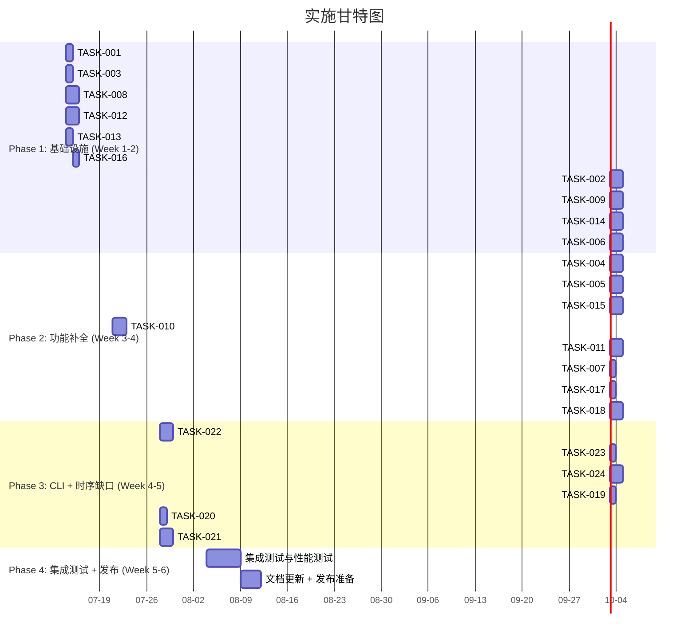

Good, I now have a thorough understanding of the codebase state. Let me produce the Tech Lead analysis.

---

# Tech Lead Analysis: 高价值扩展方向实施计划

## 1. 任务分解

逐方向拆解为 2–4 小时粒度的可执行任务，共计 **24 个任务**。

### 方向一：复制完整性 (P0) — 7 个任务

| 任务 ID | 标题 | 涉及文件 | 前置依赖 | 工时 (h) |
|--------|------|---------|---------|---------|
| **TASK-001** | 修复 EventCreated dedupe key：加入 `VersionID` 或 `UpdatedAt` 防止覆盖写去重 | `internal/replication/replication.go:85` | 无 | 2 |
| **TASK-002** | 复制 Worker 订阅 `EventDeleted`：新增 `deleteFromReplica` 路径 | `internal/replication/replication.go` (Run+新方法) | TASK-001 | 4 |
| **TASK-003** | Lifecycle 触发的删除发 `EventDeleted` 事件 | `internal/reconcile/lifecycle.go` (`handleExpiredObject`) | 无 | 2 |
| **TASK-004** | 标签变更传播复制：在 EventPayload 中携带 tag diff／订阅 `EventAccessed` 含标签变更 | `internal/replication/replication.go`, `internal/service/file_crud.go` | TASK-002 | 3 |
| **TASK-005** | 软删除语义复制传播：事件 payload 增加 `soft_delete` 标志；副本上根据标志执行软/硬删除 | `internal/replication/replication.go`, `internal/repository/repository.go`（新增 `EventDeleted.Soft` 字段） | TASK-002 | 3 |
| **TASK-006** | 并发写顺序保护：副本侧比较 `updated_at` 或 `event_seq`，拒绝过时写入 | `internal/replication/replication.go` | TASK-001 | 3 |
| **TASK-007** | 复制状态监控指标：新增 `replicated_object_total{op=create|delete|update}`, `replication_lag_seconds` | `internal/replication/replication.go`, `internal/telemetry/` | TASK-002 | 2 |

### 方向三：跨协议语义一致性 (P1) — 5 个任务

| 任务 ID | 标题 | 涉及文件 | 前置依赖 | 工时 (h) |
|--------|------|---------|---------|---------|
| **TASK-008** | 桶级 `DeleteMode` 配置：`bucket_configs` 表新增 `delete_mode` 列 (`soft`/`hard`/`versioned`)；迁移文件双写 | `internal/repository/` (migrations + model + sql)，`internal/service/file_crud.go:Delete()` | 无 | 4 |
| **TASK-009** | REST DELETE 和 S3 DELETE 统一使用 `DeleteMode` 配置；S3 支持 `?soft` 查询参数显式软删 | `internal/api/rest/handler.go`, `internal/api/s3compat/handler.go` | TASK-008 | 3 |
| **TASK-010** | REST `POST /v1/files/{key}/rename` 端点：原子 copy+delete，支持版本历史迁移参数 | `internal/api/rest/router.go`, `internal/api/rest/handler.go` (新 handler `renameKey`)，`internal/service/file_crud.go` (新方法 `Rename`) | 无 | 4 |
| **TASK-011** | S3 `x-amz-rename-source` 请求头支持（RENAME 兼容扩展） | `internal/api/s3compat/handler.go` (新 handler `renameObject`) | TASK-010 | 3 |
| **TASK-012** | 条件请求逻辑统一：将 REST 和 S3 两套条件验证合并到 `service.CheckPreconditions()` | `internal/service/conditional.go` (新文件)，`internal/api/rest/conditional.go`, `internal/api/s3compat/conditional.go` | 无 | 4 |

### 方向二：SSE 事件流韧性 (P1) — 6 个任务

| 任务 ID | 标题 | 涉及文件 | 前置依赖 | 工时 (h) |
|--------|------|---------|---------|---------|
| **TASK-013** | DB 迁移：新建 `sse_subscriptions` 表（`id`, `tenant`, `last_event_id`, `created_at`, `updated_at`） | `migrations/{sqlite,postgres}/NNNN_*` | 无 | 2 |
| **TASK-014** | SSE 连接上下文+游标管理：订阅时注册游标记录，每次收到事件更新 `last_event_id` | `internal/api/rest/sse.go`, `internal/events/bus.go`（新增 `SubscribeWithCursor`） | TASK-013 | 4 |
| **TASK-015** | SSE 专属重放：重连时 `SELECT WHERE id > $last_event_id AND tenant=$tenant ORDER BY id LIMIT 200`，取代基于全局 `consumed_at` 的 `NextUnconsumedEvents` | `internal/api/rest/sse.go:replayMissed`, `internal/repository/` (新方法 `EventsAfterID`) | TASK-014 | 3 |
| **TASK-016** | Subscriber 缓冲深度可配置：`SubBufferSize` 配置参数已存在但 SSE handler 未使用——修复传递链路 | `internal/events/bus.go`, `internal/api/rest/sse.go:liveStream`, `main.go` | 无 | 2 |
| **TASK-017** | Go SDK 指数退避重连：`events_dropped_total` 检测后触发 `1s,2s,4s,…30s+jitter` 重连 | `sdk/go/aerovault/sse.go` | 无 | 2 |
| **TASK-018** | Python/JS SDK 指数退避重连：同上实现+心跳超时检测 | `sdk/python/aero_vault.py`, `sdk/js/aero-vault.js` | 无 | 3 |

### 方向五：事件驱动时序缺口 (P2) — 3 个任务

| 任务 ID | 标题 | 涉及文件 | 前置依赖 | 工时 (h) |
|--------|------|---------|---------|---------|
| **TASK-019** | 复制 Worker 中 `ErrNotFound` 特殊处理：遇到 `GetObjectByID` 返回 `ErrNotFound` → `CompleteJob`（对象已被删除，不是错误） | `internal/replication/replication.go:ReplicateObjectByID` | TASK-001 | 2 |
| **TASK-020** | 防病毒 Worker 中 `ErrNotFound` 特殊处理：同上模式 | `internal/antivirus/worker.go:ScanObjectByID` | 无 | 2 |
| **TASK-021** | 索引器 + JobPool 级别 `ErrNotFound` 处理：`IndexObjectByID` 返回 sentinel error → `jobs.go:runJob` 识别后 `CompleteJob` 而非 `RetryJob` | `internal/ai/indexer.go`, `internal/jobs/jobs.go` | 无 | 3 |

### 方向四：CLI 工程成熟度 (P2) — 3 个任务

| 任务 ID | 标题 | 涉及文件 | 前置依赖 | 工时 (h) |
|--------|------|---------|---------|---------|
| **TASK-022** | `--json` 全局标志：解析全局 `--json`，对所有 list/search/tag/versions 命令输出 JSON 格式化结果；错误仍输出到 stderr | `internal/cli/cli.go:Run`, `internal/cli/cli_crud.go`, `internal/cli/cli_search.go` (带 `--json` 分支) | 无 | 4 |
| **TASK-023** | 退出码规范化：定义 `ExitOK=0, ExitError=1, ExitUsage=2, ExitNotFound=3, ExitRateLimited=4`；全 handler 统一使用 | `internal/cli/cli.go`（常量定义 + `Run` 传播）, 全 handler 文件 | 无 | 2 |
| **TASK-024** | `aero-vault cli mv` — 对应 RENAME 端点（TASK-010）的 CLI 封装 | `internal/cli/cli.go`（注册 `mv`），`internal/cli/cli_crud.go`（`cmdRename` 实现） | TASK-010 | 3 |

---

## 2. 执行顺序

```mermaid
graph TD
    %% Phase 1: Infrastructure & Data Integrity (Week 1-2)
    T001["TASK-001: dedupe key 修复"] --> T002["TASK-002: EventDeleted 复制"]
    T003["TASK-003: Lifecycle 发 EventDeleted"] --> T002
    T001 --> T006["TASK-006: 并发写顺序保护"]
    T002 --> T004["TASK-004: 标签变更传播"]
    T002 --> T005["TASK-005: 软删除语义传播"]
    T002 --> T007["TASK-007: 复制监控指标"]

    T008["TASK-008: 桶级 DeleteMode 配置"] --> T009["TASK-009: DELETE 语义统一"]
    T012["TASK-012: 条件请求统一"] -.-> T009

    T013["TASK-013: sse_subscriptions 表迁移"] --> T014["TASK-014: SSE 游标管理"]
    T014 --> T015["TASK-015: SSE 专属重放"]
    T016["TASK-016: 缓冲深度可配置"] --> T014

    %% Phase 2: SSE & CLI Core (Week 3)
    T015 --> T017["TASK-017: Go SDK 退避重连"]
    T015 --> T018["TASK-018: Python/JS SDK 退避重连"]

    T022["TASK-022: --json 标志"] -.-> T023["TASK-023: 退出码规范化"]
    T010["TASK-010: REST rename 端点"] --> T024["TASK-024: CLI mv 命令"]

    %% Phase 3: Timing Gap (Week 4)
    T002 --> T019["TASK-019: 复制 ErrNotFound 处理"]
    T020["TASK-020: AV ErrNotFound 处理"]
    T021["TASK-021: 索引器 ErrNotFound 处理"]

    %% Parallel groups
    subgraph Phase1_GroupA["Phase 1A — 复制完整性"]
        T001; T002; T003; T004; T005; T006; T007
    end
    subgraph Phase1_GroupB["Phase 1B — 协议一致性"]
        T008; T009; T010; T011; T012
    end
    subgraph Phase1_GroupC["Phase 1C — SSE 基础设施"]
        T013; T014; T015; T016
    end
    subgraph Phase2_GroupA["Phase 2 — SDK+CLI"]
        T017; T018; T022; T023; T024
    end
    subgraph Phase3_GroupA["Phase 3 — 时序缺口"]
        T019; T020; T021
    end

    %% Phase grouping
    T001 --> T019
    T010 --> T024
```



**可并行执行的任务组：**

| 并行组 | 任务 | 原因 |
|--------|------|------|
| **G1** | TASK-001, TASK-003, TASK-008, TASK-012, TASK-013, TASK-016 | 零依赖，各自独立修改不同文件 |
| **G2** | TASK-002, TASK-009, TASK-014 | 分别依赖 G1 的部分任务，互不依赖 |
| **G3** | TASK-004, TASK-005, TASK-006, TASK-015, TASK-022 | 可在 G2 完成后并行 |
| **G4** | TASK-007, TASK-017, TASK-018, TASK-023, TASK-024 | 高独立性 |
| **G5** | TASK-019, TASK-020, TASK-021 | 互不依赖，可完全并行 |

---

## 3. 技术风险

### 3.1 高风险项

| 风险 | 方向 | 等级 | 详细分析 | 缓解措施 |
|------|------|------|---------|---------|
| **Lifecycle 静默不触发 `EventDeleted`** | D1 | 🔴 **高** | `reconcile/lifecycle.go:handleExpiredObject` 直接调 `repo.HardDeleteObject` / `repo.SoftDeleteObject`，完全不经过 `FileService.emit`。即使增加 `EventDeleted` 发送，lifecycle 触发的删除也不经过 `FileService` 路径，需要独立的事件调用 | 在 lifecycle 中注入 `EventSink` 接口，显式 `sink.Publish(ctx, repository.Event{...})`。不能通过 FileService 中转（避免循环依赖） |
| **条件请求合并后的行为漂移** | D3 | 🟠 **中** | REST 和 S3 的条件请求逻辑目前独立解析不同 header 集合。统一后需保证 `If-Match`/`If-None-Match`/`If-Modified-Since`/`If-Unmodified-Since` 在两种协议上行为完全一致。S3 规范对某些场景的处理与 HTTP RFC 有差异（如 S3 的 `If-Match` 匹配失败返回 `412`，与 RFC 一致但一些 S3 客户端期望 `412` 而非 `428`） | 统一函数对四组 header 做标准化处理，S3 handler 层只做 header 到标准参数的映射。为统一函数编写 `200+` 行 table-driven 测试覆盖所有组合 |
| **RENAME 原子性** | D3 | 🟠 **中** | WebDAV 的 `Rename` 实现是 `Get` → `Put` → `Delete（软删除）`——非原子，中间失败数据丢失。REST/S3 的新 RENAME 端点需保证原子性或失败回滚 | 方案 A：在 repository 层加 `RenameObject(ctx, ...)` 元数据事务（原子改 key）+ storage blob 硬链接或 copy+delete（物理非原子但有元数据保护）。方案 B：记录 rename 日志表，`reconcile` 异步清理孤儿 |
| **SSE 游标表性能** | D2 | 🟠 **中** | 每个 SSE 连接每收到一个事件就 `UPDATE sse_subscriptions SET last_event_id=$1 WHERE id=$2`。高频事件（每秒数百 DELETE/PUT 的场景）下可能造成 DB 写压力 | 游标更新加 throttle：每 N 个事件或每 500ms 批量写一次；或者连接断开后才写最终位置（reconnect 时用内存中的 last seen id） |
| **Stale BUG 注释** | D4 | 🟢 **低** | 代码锚点分析引用的 `cli_test.go:1419-1430` 中的 `BUG` 注释已过时——当前 `cmdList`/`cmdTag`/`cmdVersions`/`cmdLineage`/`cmdSearch` 均已检查 `resp.StatusCode >= 300` 并返回非零退出码。`cmdSnapshot` 的 `addDBFiles` 也已正确检查 `os.Stat` 错误。但 `--json` 标志和退出码标准化确实缺失 | 先清理 test 中的过时 BUG 注释（避免误导），再专注于 `--json` 和退出码标准化 |

### 3.2 外部依赖风险

| 依赖 | 方向 | 风险详述 |
|------|------|---------|
| **存储后端幂等性** | D1 | 副本上的 `store.Delete` 需要与 `*Object` 调用后仍返回 `nil`。`storage.S3` 的 `Delete` 已幂等，但 `storage.COS`/`storage.OSS` 需验证 |
| **Postgres LISTEN/NOTIFY** | D2 | 跨实例事件传输（`Bus.WithTransport`）可能造成 SSE 游标表的分布式一致性挑战。但当前 SSE handler 只在收到事件的那个实例上提供服务，跨实例游标同步是后续需求 |
| **Qdrant 向量库** | D2/D5 | 索引器跳过对象时是否需要在 Qdrant 中同步删除对应向量？当前未实现——是另一个缺口，但超出本次范围 |

### 3.3 测试难点

| 难点 | 方向 | 说明 |
|------|------|------|
| **时序竞争测试** | D5 | 创建后立即删除导致 `ErrNotFound` 是概率性时序竞争，在 CI 中很难稳定复现 | 使用 `sync.WaitGroup` 和 channel 同步模拟精确时序：先 create，再 emit，等 consumer 开始 `GetObjectByID` 前同步删除 |
| **SSE 缓冲溢出测试** | D2 | 需要生产者速度快于消费者的场景来验证 `events_dropped_total` 和重连补偿 | 模拟 `bus.Subscribe()` 后不读取 channel，批量 `Publish` N > 64 事件，验证 `Dropped()` 计数 |
| **跨协议 DELETE 语义** | D3 | S3 handler 测试用 `httptest`，REST handler 用独立 `httptest`，需保证两套测试覆盖相同的 bucket config 组合 | 提取公共 `deleteSemanticsSuite(t *testing.T, svc *service.FileService, bucketCfg)` 供两个协议 handler 测试引用 |

---

## 4. 资源评估

### 4.1 人员配置

| 角色 | 数量 | 技能要求 | 负责方向 |
|------|------|---------|---------|
| **资深 Go 工程师** | 1 | Go 精通，分布式系统（事件驱动架构），存储系统经验 | D1 复制完整性（最复杂），D3 条件请求统一 |
| **Go 工程师** | 1 | Go 熟练，Web 开发，SQL | D2 SSE 韧性，D5 时序缺口，D3 RENAME |
| **全栈工程师** | 0.5 | Go + Python + JavaScript | D4 CLI 成熟度；D2 SDK 退避重连（Go/Python/JS） |
| **QA 工程师** | 0.5 | 集成测试，性能测试 | 所有方向的测试和验收 |

**推荐**: 2 名全职工程师（1 资深 + 1 普通）+ 1 名 50% 全栈 + QA 共 3 FTE 当量，6 周完成。

### 4.2 时间线



### 4.3 阻塞点（Blockers）

| Blocker | 影响任务 | 原因 | 解决策略 |
|---------|---------|------|---------|
| Lifecycle 路径无 EventSink 接口 | TASK-003 | `reconcile/lifecycle.go` 直接操作 `repo+store`，不通过 `FileService`，也不持有 `EventSink` 引用 | 在 `LifecycleJob` 结构体增加可选 `EventSink` 字段，`main.go` 装配时注入。零侵入——不设置则跳过事件发送 |
| 桶级 `DeleteMode` 配置的向后兼容 | TASK-008 | 现有 bucket 默认值：`versioning: false` 的桶，删了就是永久删。但增加 `delete_mode` 后默认行为可能变化 | 默认值设为 `"hard"`（保持当前 S3 行为），`"soft"` 仅通过显式配置启用。不改变现有部署的行为 |
| SSE 游标表与现有 `consumed_at` 语义协调 | TASK-014 | `NextUnconsumedEvents` 被 webhook/replication 等 durable consumer 使用。新增 SSE 专属游标不能影响现有 consumer | SSE 游标完全独立——不修改 `consumed_at`，不影响 `NextUnconsumedEvents` 的结果 |

---

## 5. 质量保证

### 5.1 单元测试覆盖矩阵

| 任务 | 测试目标 | 最低覆盖率 | 关键测试用例 |
|------|---------|-----------|-------------|
| TASK-001 | dedupe key 含 `VersionID` | 100% 新增函数 | 同一 ObjectID 两次覆盖写 → 两个独立 job；不同 ObjectID → 独立 dedupe |
| TASK-002 | `deleteFromReplica` | 80% | 副本对象存在 → 删除成功；对象已不存在 → 幂等成功；Storage 返回错误 → 重试 |
| TASK-003 | lifecycle 事件发送 | 80% | hard_delete 后 event 写入；soft_delete 后 event 写入；locked 对象跳过 |
| TASK-006 | updated_at 比较 | 90% | 过时写入被拒绝；最新写入通过；时间相等时允许 |
| TASK-008 | DeleteMode 字段 | 90% | mode=hard → 硬删除；mode=soft → 软删除；mode=versioned → 旧版本保留 |
| TASK-012 | 统一条件请求 | 95% table-driven | 覆盖 REST+S3 的 6 组 header 的所有组合，验证状态码和错误消息完全一致 |
| TASK-014 | SSE 游标 | 80% | 订阅 → 收到事件 → 游标更新；重连 → 回放从游标之后；并发订阅各自独立游标 |
| TASK-015 | `EventsAfterID` 查询 | 90% | 正确过滤 tenant、ID 范围、limit 边界；0 结果返回空 |
| TASK-019/020/021 | ErrNotFound→Complete | 90% | `GetObjectByID` 返回 `ErrNotFound` → job 标记完成；其他错误 → 正常重试 |
| TASK-022 | `--json` 输出 | 80% | 列表/搜索正常输出 JSON；错误仍输出 stderr；混合 json+文本模式 |
| TASK-023 | 退出码 | 90% | 每个 handler 在成功/失败/参数错误时返回正确退出码 |

### 5.2 集成测试策略

| 测试套件 | 工具 | 环境 | 验证内容 |
|---------|------|------|---------|
| **跨协议 DELETE** | `go test -tags=integration` + `httptest` | SQLite + local FS | REST DELETE、S3 DELETE、WebDAV DELETE 在 `delete_mode=soft/hard/versioned` 三种配置下行为一致 |
| **复制端到端** | `go test -tags=integration` | SQLite + local FS（双 storage: primary+replica） | PUT → 复制到 replica；DELETE → replica 也删除；覆盖写 → replica 更新；Lifecycle 删除 → replica 同步 |
| **SSE 重连** | `go test -tags=integration` | SQLite | 订阅 → 收到事件 → 断开 → 重连(Last-Event-ID) → 回放未接收事件；缓冲满 64 → 不 panic，metric 递增 |
| **RENAME 端到端** | `go test -tags=integration` | SQLite + local FS | REST rename、S3 rename-source、WebDAV MOVE 三种方式的源/目标对象状态一致性；版本保留 |
| **ErrNotFound 时序** | `go test -tags=integration`（时序同步模式） | SQLite + local FS | 同步模拟 create→delete→consumer，验证 job 被 Complete 而非 Retry |

### 5.3 代码审查要点

| 标签 | 审查项 |
|------|-------|
| **🚩 迁移安全** | 所有 DB migration 必须成对（up+down）；down 必须可回滚；不要两次修改同一张表 |
| **🚩 幂等性** | 所有复制/删除路径处理"目标已不存在"的情况（`ErrNotFound` 或 `storage.ErrNotFound`）；SQL 写入使用 `INSERT OR IGNORE` 或 `ON CONFLICT` 模式 |
| **🚩 事件顺序** | 任何 `emit` 调用必须在 DB 写入**之后**（先持久化再通知）；避免消费者在 DB 写入完成前看到事件 |
| **🚩 错误降级** | 复制写成功后 tag 更新失败 → warn log 但不 fail job；SSE 游标写入失败 → warn log 但不影响事件流 |
| **🚩 循环依赖** | `reconcile/lifecycle.go` 绝不能 import `internal/service`；通过接口注入 |
| **🚩 向后兼容** | `DeleteMode` 默认值必须与当前行为一致（`"hard"`）；`sse_subscriptions` 表可选——降级兼容现有 `NextUnconsumedEvents` |

### 5.4 性能测试

| 测试场景 | 指标 | 目标 | 方法 |
|---------|------|------|------|
| SSE 每秒 10K 事件 | CPU/Mem, DB write QPS | CPU < 20%, Mem 稳定, DB QPS < 1000 | 单实例 100 并发 SSE 订阅者 + 10K/s 事件发布；监控 `events_dropped_total` |
| 复制吞吐（大对象 1GB） | 复制延迟 | latency < 1.5× 存储延迟 | 串行 10 个 1GB 对象，记录 `t_PUT_end` → `t_replica_PUT_end` |
| 条件请求统一 | P99 延迟 | no regression vs 当前实现 | 两套独立实现 vs 统一实现，相同请求 10K 次，比较 P99 |
| RENAME 并发 | 原子性 + TPS | 100 ops/s, no orphan | 100 并发 rename 同一对象和不同对象，验证无孤儿、无版本丢失 |

---

## 6. 实施计划

### 阶段 1：基础设施 + 数据完整性核心（1.5 周）

```
Day 1-2:   TASK-001 (dedupe key) + TASK-003 (lifecycle event) + TASK-008 (DeleteMode 配置)
           TASK-013 (SSE 表迁移) — 可并行
Day 3-4:   TASK-002 (EventDeleted 复制) — 依赖 Day 1
           TASK-012 (条件请求统一) + TASK-016 (缓冲深度) — 独立
Day 5-7:   TASK-009 (DELETE 语义统一) — 依赖 Day 2 TASK-008
           TASK-014 (SSE 游标管理) — 依赖 Day 1 TASK-013
           验收: replication_test.go 覆盖三种事件类型；DELETE 在两种协议上行为一致
```

**交付物**: `internal/replication/replication.go` 更新 + `internal/reconcile/lifecycle.go` 更新 + `bucket_configs` migrate + `internal/service/conditional.go` + SSE 订阅表 migrate + SSE 游标基础

### 阶段 2：功能补全 + SDK（2 周）

```
Day 8-10:  TASK-004 (标签传播) + TASK-005 (软删除传播) + TASK-006 (并发写保护)
           TASK-010 (REST rename) — 可并行
Day 11-13: TASK-015 (SSE 专属重放) — 依赖 TASK-014
           TASK-011 (S3 rename) — 依赖 TASK-010
           TASK-007 (复制监控)
Day 14:    TASK-017 (Go SDK) + TASK-018 (Python/JS SDK)
           验收: 复制端到端集成测试通过；SSE 重连后回放完全；RENAME 三协议一致
```

**交付物**: replication 全生命周期 + SSE 游标回放 + RENAME 端点 + SDK 退避重连 + Prometheus 指标

### 阶段 3：CLI + 时序缺口（1 周）

```
Day 15-16: TASK-019 (复制 ErrNotFound) + TASK-020 (AV ErrNotFound) + TASK-021 (索引器 ErrNotFound)
           TASK-022 (--json 标志) — 可并行
Day 17:    TASK-023 (退出码) + TASK-024 (CLI mv)
Day 18:    CLI 测试清理（删除过时 BUG 注释）+ 全 CLI 测试补全
           验收: CLI 全命令 --json 输出 + 正确退出码；时序 gap 集成测试通过
```

**交付物**: 无噪声死信队列 + 生产级 CLI + `aero-vault cli mv`

### 阶段 4：集成测试 + 文档 + 发布（1.5 周）

```
Day 19-23: 集成测试全面通过
           - 复制端到端 + 性能测试
           - SSE 韧性 + 重放测试
           - 跨协议 DELETE/RENAME 一致性测试
           - ErrNotFound 时序同步测试
Day 24:     OpenAPI spec 更新（RENAME, SSE 游标 header 说明）
Day 24-25:  文档更新（`docs/` + `AGENTS.md` + `ROADMAP.md`）
Day 25:     回归：`make check` 全绿 + `make test-integration` 全绿
Day 26:     发布 CHANGELOG + tag v1.22.0
```

**交付物**: CI gate 通过 + 文档完整 + 发布 tag

---

## 总结：关键建议

### 必须做（P0）

1. **复制完整性**（TASK-001 + TASK-002 + TASK-003）— 灾备的核心承诺。无 EventDeleted 复制等于没有灾备
2. **Lifecycle 事件漏发**（TASK-003）— 最易忽略但直接影响复制完整性的 bug

### 强烈建议（P1）

3. **SSE 游标**（TASK-013 + TASK-014 + TASK-015）— `events_dropped_total` 已有计数器无补偿机制的业务风险
4. **条件请求统一**（TASK-012）— 双份条件逻辑是长期维护隐患，越早合并成本越低

### 性价比最高（P2）

5. **ErrNotFound 时序修复**（TASK-019 + TASK-020 + TASK-021）— < 8 行代码修改 × 3 个文件 = 消除死信队列中 10-30% 噪声
6. **`--json` + 退出码**（TASK-022 + TASK-023）— CLI 可靠性提升 10×，对 CI 脚本开发者价值巨大

### 先不做的

- 初始全量同步（~500 行）— 现有场景是"启用复制后新建对象"，全量同步是增量需求
- EventBus subscriber 分级（~200 行）— SSE 游标已经解决丢事件问题；分级增加了架构复杂性
- `ErrNotFound` sentinel error 的 JobPool 级自动处理（TASK-021 的 JobPool 部分）— 先让各 consumer 自行处理，JobPool 的 sentinel error 机制可以后续统一
