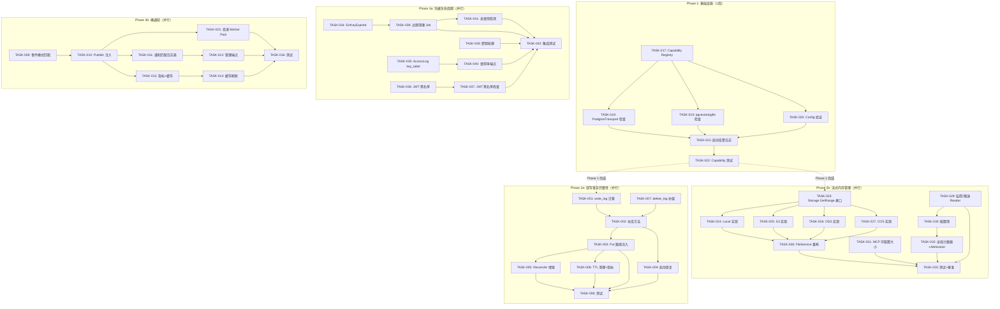
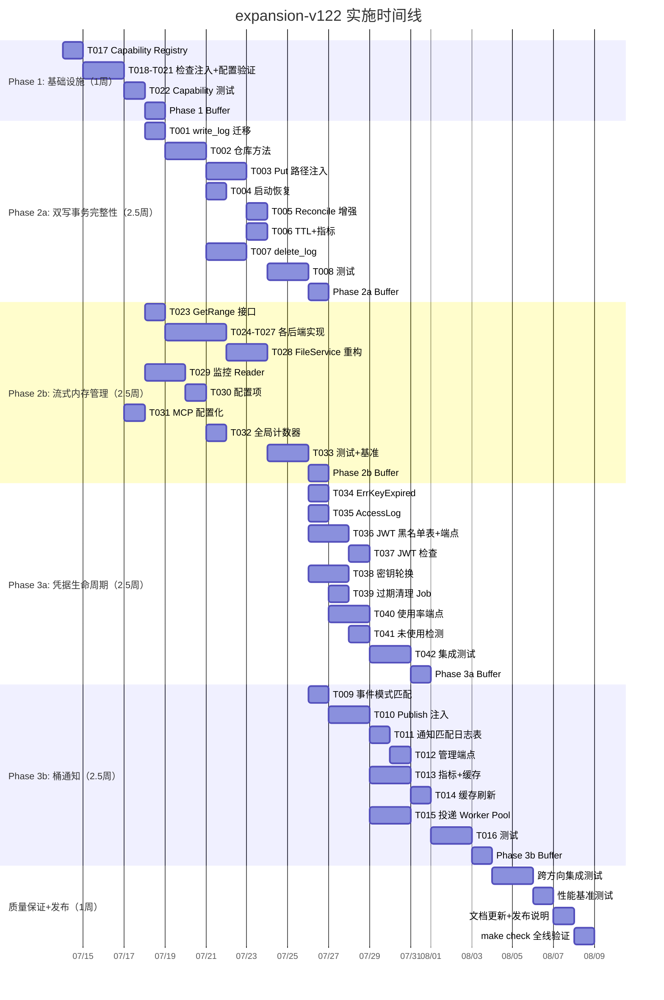

现在我已掌握所有必要信息。以下是我的 Tech Lead 分析报告。

---

# Tech Lead 分析报告：expansion-v122

## 1. 任务分解

### 方向一：服务层双写事务完整性（P0）

| 任务 ID | 任务标题 | 涉及文件 | 前置依赖 | 工时 |
|---------|---------|---------|---------|------|
| TASK-001 | 创建 `write_log` 表迁移（双驱动，0025） | `internal/repository/migrations/{sqlite,postgres}/0025_write_log.{up,down}.sql` | 无 | 2h |
| TASK-002 | 实现 `InsertWriteLog` / `UpdateWriteLog` / `ListStaleWriteLogs` 仓库方法 | `internal/repository/repository.go`（接口）、`internal/repository/write_log.go` | TASK-001 | 4h |
| TASK-003 | 在 `FileService.Put` 中注入 write intent logging + 回滚逻辑 | `internal/service/file_crud.go` | TASK-002 | 4h |
| TASK-004 | 实现 `RecoverOrphanWrites` 启动恢复钩子 | `internal/service/orphan.go`（新文件）、`cmd/server/main.go` | TASK-002 | 3h |
| TASK-005 | 增强 `Reconcile.sweepOrphans` 优先使用 write_log | `internal/service/reconcile.go` | TASK-003 | 3h |
| TASK-006 | 实现 `write_log` TTL 清理 + 指标（`write_log_stale_total`、`orphan_recovered_total`） | `internal/repository/write_log.go`、`internal/telemetry/` | TASK-002 | 2h |
| TASK-007 | 硬删除路径引入 `delete_log` 补偿追踪 | `internal/service/file_crud.go`、`internal/repository/delete_log.go` | TASK-002 | 4h |
| TASK-008 | 单元测试：write_log 路径、回滚、启动恢复 | `internal/service/file_crud_test.go`、`internal/repository/write_log_test.go` | TASK-003~006 | 4h |

### 方向二：桶通知运行时缺口（P1）

| 任务 ID | 任务标题 | 涉及文件 | 前置依赖 | 工时 |
|---------|---------|---------|---------|------|
| TASK-009 | 实现事件模式匹配工具 `eventMatchesPattern` | `internal/events/match.go`（新文件） | 无 | 2h |
| TASK-010 | 在 `Bus.Publish` 中注入桶规则查找 + 诊断日志 | `internal/events/bus.go` | TASK-009 | 3h |
| TASK-011 | 创建 `notification_match_log` 表 + 写入逻辑 | `internal/repository/migrations/{sqlite,postgres}/0026_notification_match_log.{up,down}.sql`、`internal/repository/repository.go` | TASK-010 | 3h |
| TASK-012 | 实现 `GET /v1/admin/notifications/stats` 端点 | `internal/api/rest/admin.go`、`router.go` | TASK-011 | 2h |
| TASK-013 | 添加通知匹配 Prometheus 指标 + `notification_rules` 缓存 | `internal/events/bus.go`、`internal/telemetry/` | TASK-010 | 3h |
| TASK-014 | 规则变更时触发缓存刷新事件 | `internal/service/file_features.go`、`internal/events/bus.go` | TASK-013 | 2h |
| TASK-015 | 实现异步通知投递 Worker Pool | `internal/events/notifier.go`（新文件） | TASK-010 | 4h |
| TASK-016 | 单元测试 + 集成测试：通知路由 | `internal/events/bus_test.go`、`internal/events/notifier_test.go` | TASK-010~014 | 3h |

### 方向三：DB 驱动特性不对称（P1）

| 任务 ID | 任务标题 | 涉及文件 | 前置依赖 | 工时 |
|---------|---------|---------|---------|------|
| TASK-017 | 定义 `Capability` 枚举 + `DriverCapabilities` + `CheckCapability` | `internal/repository/capability.go`（新文件） | 无 | 2h |
| TASK-018 | 在 `setupPostgresTransport` 中注入 capability 检查 | `cmd/server/main.go`、`internal/events/postgres_transport.go` | TASK-017 | 2h |
| TASK-019 | 在 `ai/pgvector.go` 和 `ai/pgfts.go` 中注入 capability 检查 | `internal/ai/pgvector.go`、`internal/ai/pgfts.go` | TASK-017 | 1h |
| TASK-020 | 在 `config.Validate` 中增加 feature-driver 兼容性验证 | `internal/config/config.go` | TASK-017 | 2h |
| TASK-021 | 启动时 capability 汇总日志 + 不兼容功能告警 | `cmd/server/main.go` | TASK-017~020 | 2h |
| TASK-022 | 单元测试：Capability Registry | `internal/repository/capability_test.go` | TASK-017 | 1h |

### 方向四：流式路径内存压力管理（P1）

| 任务 ID | 任务标题 | 涉及文件 | 前置依赖 | 工时 |
|---------|---------|---------|---------|------|
| TASK-023 | 向 `Storage` 接口添加 `GetRange` 方法 | `internal/storage/storage.go` | 无 | 2h |
| TASK-024 | 实现 Local 后端 `GetRange`（file.Seek + io.LimitReader） | `internal/storage/local_read.go` | TASK-023 | 2h |
| TASK-025 | 实现 S3 后端 `GetRange`（Range header） | `internal/storage/s3.go` | TASK-023 | 2h |
| TASK-026 | 实现 OSS 后端 `GetRange` | `internal/storage/oss.go` | TASK-023 | 2h |
| TASK-027 | 实现 COS 后端 `GetRange` | `internal/storage/cos.go` | TASK-023 | 2h |
| TASK-028 | 重构 `FileService.GetRange` 使用 `store.GetRange` | `internal/service/range.go` | TASK-024~027 | 3h |
| TASK-029 | 添加 `monitoredReader` / `rateLimitedReader` 包装器 | `internal/service/stream.go`（新文件） | TASK-023 | 3h |
| TASK-030 | 添加 `STREAM_METRIC_INTERVAL_BYTES` / `STREAM_READ_RATE_LIMIT` 配置项 | `internal/config/config.go` | TASK-029 | 2h |
| TASK-031 | 使 MCP `read_file` 大小可配置（取代硬编码 4MB） | `internal/mcp/server.go`、`internal/config/config.go` | 无 | 2h |
| TASK-032 | 添加流式字节全局计数器 + admission 控制 | `internal/service/stream.go`、`internal/config/config.go` | TASK-029 | 3h |
| TASK-033 | 集成测试 + 基准测试：GetRange + 监控 Reader | `internal/storage/*_test.go`、`internal/service/range_test.go` | TASK-024~030 | 3h |

### 方向五：认证凭据生命周期管理（P2）

| 任务 ID | 任务标题 | 涉及文件 | 前置依赖 | 工时 |
|---------|---------|---------|---------|------|
| TASK-034 | 添加 `ErrKeyExpired` 错误类型 + `X-Aero-Key-Expired` 响应头 | `internal/auth/auth.go` | 无 | 2h |
| TASK-035 | 在 AccessLog 中间件中记录 `key_label` | `internal/middleware/middleware.go` | 无 | 2h |
| TASK-036 | 创建 `jwt_blacklist` 表 + JWT 撤销/恢复端点 | `internal/repository/migrations/{sqlite,postgres}/0027_jwt_blacklist.{up,down}.sql`、`internal/api/rest/admin.go` | 无 | 4h |
| TASK-037 | 在 JWT 认证路径中注入黑名单检查 | `internal/auth/auth.go` | TASK-036 | 2h |
| TASK-038 | 实现密钥轮换端点 `POST /admin/keys/{token}/rotate` | `internal/api/rest/admin.go` | 无 | 3h |
| TASK-039 | 实现过期 API 键定时清理 Job | `internal/repository/apikeys.go`、`internal/service/reconcile.go` | 无 | 2h |
| TASK-040 | 添加每密钥使用率计数器 + `GET /admin/keys/usage` 端点 | `internal/middleware/middleware.go`、`internal/api/rest/admin.go`、`internal/telemetry/` | TASK-035 | 4h |
| TASK-041 | 实现 90 天未使用密钥检测 + 告警 | `internal/service/reconcile.go`、`internal/telemetry/` | TASK-039 | 2h |
| TASK-042 | 集成测试：密钥轮换、JWT 黑名单、过期清理 | `internal/api/rest/admin_test.go`、`internal/auth/auth_test.go` | TASK-034~041 | 3h |

---

## 2. 执行顺序

### 可并行执行的任务组

| 组 | 任务 | 并行依据 |
|----|------|---------|
| **G1（Phase 1）** | T017→T018→T019→T020→T021→T022 | 线性依赖链，但 T018/T019/T020 在 T017 后可并行 |
| **G2（Phase 2a）** | T001→T002→[T003,T004,T007]→[T005,T006]→T008 | T002 后 T003/T004/T007 可并行实现 |
| **G3（Phase 2b）** | T023→[T024,T025,T026,T027]→T028→T033 + 独立 T029→T030→T032 + 独立 T031 | 四个后端实现完全并行；监控 Reader 与 `GetRange` 解耦 |
| **G4（Phase 3a）** | 无严格依赖链 | T034/T035/T036 可并行起步 |
| **G5（Phase 3b）** | T009→T010→[T011,T013,T015]→[T012,T014,T016] | T010 后的日志/指标/投递三个方向并行 |

---

## 3. 技术风险

### 3.1 高风险项

| 风险 | 方向 | 概率 | 影响 | 缓解策略 |
|------|------|------|------|---------|
| **Write log 成为写路径瓶颈** | Dir1 | 中 | 高 | 写日志失败时降级到当前行为（无补偿），不阻塞主路径；`InsertWriteLog` 使用批量 buffer + 异步 flush 减少同步开销 |
| **`GetRange` 行为差异** | Dir4 | 中 | 中 | S3 的 Range 返回的 Content-Range 对解压后的内容可能不对齐；需要明确文档：`GetRange` 作用于加密前/压缩前的原始字节流 |
| **JWT 黑名单多副本同步延迟** | Dir5 | 高 | 中 | 使用已存在的 `PostgresTransport` LISTEN/NOTIFY 通道广播黑名单变更；SQLite 模式依赖轮询（可接受，单副本通常无此问题） |
| **通知投递阻塞主事件总线** | Dir2 | 中 | 高 | 通知投递必须使用独立 Worker Pool（`NOTIF_WORKERS`），不可与 JobPool 共享；`Publish` 仅 enqueue，不等待投递 |
| **`write_log` 中的租户/键 PII** | Dir1 | 低 | 中 | 日志表中存储了 tenant_id、bucket、key——审计日志需注意合规性，考虑 masking |

### 3.2 依赖外部系统

| 依赖 | 方向 | 说明 | 替代方案 |
|------|------|------|---------|
| AWS SDK (`github.com/aws/aws-sdk-go-v2`) | Dir2 | SQS/SNS/Lambda 目标投递需要 AWS SDK | 无——但可包装在可选的 `NotificationTarget` 实现后，不会增加核心依赖 |
| Postgres LISTEN/NOTIFY | Dir5 | JWT 黑名单广播需要 Postgres | SQLite 单副本无同步需求；多副本时可退化为轮询 |

### 3.3 性能瓶颈

| 瓶颈 | 方向 | 分析 | 优化策略 |
|------|------|------|---------|
| `Put` 路径增加 2 次额外 DB 写（`InsertWriteLog` + `UpdateWriteLog`） | Dir1 | 每次 PUT 增加 2 次 SQL INSERT/UPDATE | 批量 flush（每 100ms 或 1000 条合并一次）；`InsertWriteLog` 失败时跳过补偿（degrade 到 Reconcile） |
| 每次 `Publish` 查询 `notification_rules` | Dir2 | 高频事件（如批量上传）场景下，每次发布查 DB 查询规则 | 引入 `rulesCache`（TTL + 事件驱动失效），`SetBucketNotifications` 时广播 `notification.rules.changed` 事件 |
| `GetRange` 后端范围请求 | Dir4 | S3 Range 请求有小幅开销（HTTP Range 头解析） | 远小于当前 `io.CopyN(io.Discard, offset)` 的全量读取 |
| AccessLog 记录 `key_label` | Dir5 | 每个 HTTP 请求增加一个 context 读取操作 | 零额外 I/O，仅从 context 取值，O(1) 开销 |

### 3.4 测试覆盖难点

| 难点 | 方向 | 说明 | 策略 |
|------|------|------|------|
| Crash 恢复测试 | Dir1 | 需要模拟进程在 `store.Put` 与 `writePutObject` 之间的精确时刻崩溃 | 注入可控 panic / 使用故障注入点（`testing hook`）模拟 crash 后重启验证恢复 |
| SQS/SNS 投递 | Dir2 | 依赖 AWS 服务，CI 不能访问 | 使用接口抽象（`NotificationTarget`），单元测试用 mock；集成测试使用 `testcontainers-go` 或 localstack |
| 流式传输基准 | Dir4 | 需要对比 `GetRange` 前后的大对象 Range 性能 | 使用 benchmark test，在 `testing.B` 中构造 1GB 文件比较耗时/内存分配 |
| Postgres-only 功能测试 | Dir3 | CI gate 要求零外部依赖 | 在 CI 中明确 Skip Postgres-only 测试；`make test-integration` 中使用 Docker compose |

---

## 4. 资源评估

### 4.1 开发人员技能需求

| 技能 | 方向 | 人数 | 理由 |
|------|------|------|------|
| Go 中级（2-3 年）：数据库编程、SQL、迁移管理 | Dir1, Dir2, Dir3 | 2 人 | 方向一和方向二的仓库层需要较强的 SQL 和事务理解 |
| Go 高级（3-5 年）：流式 I/O、并发模式、性能优化 | Dir4 | 1 人 | 流式内存管理涉及并发安全、rate limiting、admission control 等复杂模式 |
| Go 中级：认证/安全编程、中间件开发 | Dir5 | 1 人 | JWT 黑名单、密钥轮换等涉及安全敏感逻辑 |
| 质量保证 | 所有 | 1 人 | 集成测试、故障注入测试、基准测试 |

**最小团队配置：2 人（1 高级 + 1 中级）**，但 Phase 2 的并行度（方向一 + 方向四）需要至少 2 人同时进行。

**推荐配置：3 人**（1 高级作为 tech lead + 2 中级）可在 5-6 周内完成全部方向。

### 4.2 关键里程碑

| 里程碑 | 时间点 | 交付物 | 验收标准 |
|--------|--------|--------|---------|
| M1: Phase 1 完成 | 第 1 周末 | Capability Registry 在 main.go 中生效 | `DB_DRIVER=sqlite` + `AI_VECTOR_BACKEND=pgvector` 启动时输出 `WARN` 日志，不 crash |
| M2: 双写 + 流式 Phase 1 完成 | 第 4 周末 | write_log 生效 + `GetRange` 替代 `io.CopyN(io.Discard)` | `make check` 全绿；crash 恢复测试通过；1GB Range 跳过不再读入 discard |
| M3: 凭据 + 通知 Phase 1 完成 | 第 6 周末 | JWT 黑名单 + access log key_label + 通知诊断 | 密钥轮换 API 返回 200；过期的 key 返回 401 + header；通知规则匹配写入 audit |
| M4: 集成测试 + 性能基准完成 | 第 7 周末 | 全部 CI gate + 基准报告 | 基准测试显示 Range 操作内存分配减少 >= 90%；无回归 |

### 4.3 阻塞点与解决策略

| 阻塞点 | 涉及方向 | 解决策略 |
|--------|---------|---------|
| **Storage 接口变更（`GetRange` 方法）影响 `Storage` 接口的实现者** | Dir4 | 所有实现都必须新加 `GetRange` 方法；通过 `storage.contract_test.go` 确保 contract 覆盖 |
| **迁移编号冲突** | Dir1, Dir2, Dir5 | 在代码仓库根目录 `AGENTS.md` 中指定下一个迁移编号（0025），自增策略需统一管理 |
| **AWS SDK 版本冲突** | Dir2 | 检查 `go.mod` 中是否已有 `aws-sdk-go-v2`；通知目标实现应使用 optional factory pattern |

---

## 5. 质量保证

### 5.1 单元测试覆盖要求

| 包 | 当前覆盖 | 目标覆盖 | 重点测试 |
|----|---------|---------|---------|
| `internal/repository`（write_log） | 新代码 | >= 80% | `InsertWriteLog` 成功/失败、`ListStaleWriteLogs` 边界、TTL 清理 |
| `internal/service`（Put 路径） | 现有 | >= 70%（新分支） | write log 回滚路径、RecoverOrphanWrites 启动恢复、GetRange <-> store.GetRange 集成 |
| `internal/events`（bus + notifier） | 现有 | >= 75% | 规则匹配（事件模式通配符）、通知匹配日志写入、缓存失效 |
| `internal/auth`（JWT 黑名单） | 现有 | >= 80% | JWT 黑名单检查（已撤销/未撤销）、key 过期 header、密钥轮换 |
| `internal/middleware`（AccessLog） | 现有 | >= 80% | key_label 在 log attrs 中存在、无 key_label 时不 crash |
| `internal/storage`（GetRange） | 新代码 | >= 85% | 各后端的 GetRange 正确性、边界（offset=0、length=0、超大 offset）|

### 5.2 集成测试策略

| 测试套件 | 范围 | 工具 | 频率 |
|---------|------|------|------|
| `make check`（CI gate） | SQLite + local FS，零网络 | `go test ./...` | 每次提交 |
| `make test-integration` | Postgres + pgvector Docker | Docker compose | 每日/PR 合并前 |
| Crash 恢复测试（新建） | `make test-crash-recovery` | fault injection hook + 子进程重启 | 每周 |
| 性能基准测试（新建） | `make bench-streaming` | `go test -bench=BenchmarkGetRange` | 每次 Phase 2 变更 |

### 5.3 代码审查要点

| 审查点 | 方向 | 重点检查 |
|--------|------|---------|
| **Write log 降级路径** | Dir1 | `InsertWriteLog` 失败是否真的不阻塞主路径？`log fallback mode` 是否退化到原来行为？ |
| **SQL 占位符 I1** | Dir1, Dir2, Dir5 | 新迁移 + 仓库方法是否遵守 `$N` → `rebind` 规则？参数编号是否独立递增？ |
| **`GetRange` 安全性** | Dir4 | 各后端是否处理 `offset > object_size`？是否处理 `length < 0`？ |
| **JWT 黑名单缓存** | Dir5 | 缓存失效后的竞争条件：一个请求刚通过黑名单检查，另一个请求撤销了该 JWT——这是否可接受？ |
| **通知投递非阻塞** | Dir2 | `Publish` 是否严格不等待投递完成？goroutine panic 是否有 recovery？ |
| **`ErrKeyExpired` 兼容性** | Dir5 | 已有客户端是否预期旧 behavior？返回 401 是否破坏现有调用方？ |

### 5.4 性能测试需求

| 测试场景 | 方向 | 指标 | 成功标准 |
|---------|------|------|---------|
| 并发 10x 1GB 对象 Range 请求 | Dir4 | P99 延迟、内存分配、IO 带宽 | `GetRange` 后 P99 延迟 <= 前值的 10%（从全读到跳过）；内存分配减少 >= 90% |
| 批量 PUT 1000 个 1KB 对象 | Dir1 | 吞吐量（ops/sec） | 增加 write_log 后吞吐下降 <= 5% |
| 100 个并发 API 密钥认证 | Dir5 | P99 延迟 + DB 查询数 | 过期检查 + JWT 黑名单不增加 P99 超过 2ms |
| 高频事件 Publish（每秒 1000 事件） | Dir2 | 规则匹配延迟、投递队列深度 | 规则匹配 < 1ms/event；队列不无限增长 |

---

## 6. 实施计划

### 时间线概览

### 详细阶段计划

#### 阶段 1：基础设施搭建（第 1 周，5 天）

| 天 | 工作内容 | 负责人 | 交付物 |
|----|---------|--------|--------|
| Day 1 | TASK-017: Capability Registry 设计 + 实现 | Dev 1 | `internal/repository/capability.go` |
| Day 2-3 | TASK-018~020: 检查点注入 + Config 验证 | Dev 1, Dev 2 | 3 个 Postgres-only 功能检查点更新 |
| Day 4 | TASK-021: 启动告警日志 + TASK-022: 测试 | Dev 1 | main.go 增强 + capability_test.go |
| Day 5 | 缓冲日 + Code Review | 全部 | Phase 1 集成验证 |

**验收标准：** 执行 `DB_DRIVER=sqlite AI_VECTOR_BACKEND=pgvector` 启动，日志显示 `WARN: pgvector requires "postgres" driver; disabling`，系统正常运行。

#### 阶段 2：核心功能实现（第 2-4 周，15 天）

**Parallel Track A — 双写事务完整性（Dev 1）**

| 天 | 工作内容 | 交付物 |
|----|---------|--------|
| Day 6 | TASK-001: 迁移 0025（sqlite + postgres） | 4 个 SQL 文件 |
| Day 7-8 | TASK-002: 仓库方法实现 | `internal/repository/write_log.go` |
| Day 9-10 | TASK-003: `Put` 路径注入 + 回滚 | `file_crud.go` 更新 |
| Day 11 | TASK-004: 启动恢复钩子 | `internal/service/orphan.go` + `main.go` |
| Day 12 | TASK-005: Reconcile 增强 + TASK-006: TTL/指标 | `reconcile.go` + telemetry 计数 |
| Day 13 | TASK-007: delete_log 补偿 | `file_crud.go` + `repository/delete_log.go` |
| Day 14-15 | TASK-008: 测试 | crash 恢复测试通过 |

**Parallel Track B — 流式内存管理（Dev 2）**

| 天 | 工作内容 | 交付物 |
|----|---------|--------|
| Day 6 | TASK-023: `Storage.GetRange` 接口 + contract test | `storage.go` + `contract_test.go` |
| Day 7-9 | TASK-024~027: 4 个后端实现 | `local_read.go`、`s3.go`、`oss.go`、`cos.go` |
| Day 10-11 | TASK-028: FileService 重构 + TASK-031: MCP 配置化 | `range.go` + `mcp/server.go` |
| Day 12-13 | TASK-029~030: 监控 Reader + 配置 | `stream.go` + `config.go` |
| Day 14 | TASK-032: 全局字节计数器 + admission | `stream.go` |
| Day 15 | TASK-033: 集成测试 + 基准 | `range_test.go` + benchmark |

#### 阶段 3：集成测试和优化（第 5-6 周，10 天）

**Parallel Track C — 凭据生命周期（Dev 1）**

| 天 | 工作内容 | 交付物 |
|----|---------|--------|
| Day 16-17 | TASK-034~035: ErrKeyExpired + AccessLog | `auth.go` + `middleware.go` |
| Day 18-19 | TASK-036: JWT 黑名单迁移 + 端点 | 迁移 0027 + `admin.go` |
| Day 20 | TASK-037: JWT 黑名单检查 | `auth.go` |
| Day 21-22 | TASK-038: 密钥轮换 + TASK-039: 过期清理 | `admin.go` + `reconcile.go` |
| Day 23-24 | TASK-040~041: 使用率端点 + 未使用检测 | `admin.go` + `reconcile.go` + telemetry |
| Day 25 | TASK-042: 集成测试 | `admin_test.go` + `auth_test.go` |

**Parallel Track D — 桶通知（Dev 2）**

| 天 | 工作内容 | 交付物 |
|----|---------|--------|
| Day 16 | TASK-009: 事件模式匹配 | `internal/events/match.go` |
| Day 17-18 | TASK-010: Publish 注入 + 诊断 | `bus.go` |
| Day 19 | TASK-011~012: 匹配日志表 + 管理端点 | 迁移 0026 + `admin.go` |
| Day 20-21 | TASK-013~014: 缓存 + 指标 + 失效 | `bus.go` + telemetry |
| Day 22-23 | TASK-015: Worker Pool | `internal/events/notifier.go` |
| Day 24-25 | TASK-016: 测试 | `bus_test.go` + `notifier_test.go` |

#### 阶段 4：发布准备（第 7 周，5 天）

| 天 | 工作内容 | 参与人 | 交付物 |
|----|---------|--------|--------|
| Day 26-27 | 跨方向集成测试 + bug 修复 | 全员 | 集成测试套件全绿 |
| Day 28 | 性能基准测试 + 调优 | Dev 2 | 基准报告 |
| Day 29 | 文档更新（ADRs、AGENTS.md 功能矩阵、OpenAPI 更新） | Dev 1 | 5 个 ADR 记录 |
| Day 30 | `make check` 全量验证 + 发布 sign-off | 全员 | 发布候选就绪 |

### 总投入估算

| 方向 | 总工时 | 开发人员 | 日历时间 |
|------|--------|---------|---------|
| 方向三：DB 不对称 | 12h | 1 | 1 周 |
| 方向一：双写事务 | 26h | 1 | 2.5 周 |
| 方向四：内存管理 | 26h | 1 | 2.5 周 |
| 方向五：凭据生命周期 | 26h | 1 | 2.5 周 |
| 方向二：桶通知 | 24h | 1 | 2.5 周 |
| 质量保证 + 发布 | 20h | 2 (并联) | 1 周 |
| **总计** | **~134h** | **3 人** | **5-7 周** |

### 关键风险里程碑检查清单

| 检查点 | 时间 | 检查内容 | 通过条件 |
|--------|------|---------|---------|
| **CP1** | 第 1 周末 | Phase 1 可用性 | `make check` 全绿；Capability Registry 功能完整 |
| **CP2** | 第 4 周末 | Phase 2 核心功能 | `merge check` 全绿；crash 恢复测试通过（方向一）；`GetRange` 基准测试内存分配减少 >= 90%（方向四） |
| **CP3** | 第 6 周末 | Phase 3 完整功能 | JWT 撤销测试通过；通知匹配日志写入；密钥轮换端点在 REST 测试中通过 |
| **CP4** | 第 7 周末 | 发布准备 | 全部基准测试完成，无性能回归；文档完整；5 个 ADR 签署 |

---

## 7. 补充建议

### 7.1 架构决策记录（ADR）

建议为每个方向编写独立的 ADR，记录关键架构决策：

| ADR | 主题 | 决策 |
|-----|------|------|
| ADR-026 | Write log 失败时不阻塞主路径 | `InsertWriteLog` 失败时降级到当前行为 |
| ADR-027 | notification 投递异步、独立 Worker Pool | `Publish` 仅 enqueue，不等待 |
| ADR-028 | Storage 接口增加 `GetRange` 而非改变 `Get` | 向后兼容，新老方法并存 |
| ADR-029 | JWT 黑名单使用 LISTEN/NOTIFY 广播 | SQLite 单副本无同步问题 |
| ADR-030 | Capability Registry 仅启动检查，不运行时检查 | 运行时检查增加 overhead，且配置变更需重启 |

### 7.2 工程约束合规检查

根据 `AGENTS.md` §0「工程约束」：

- **file_crud.go 当前 420 行**（< 500）——但 TASK-003、TASK-007 会增加约 60 行，达到 ~480 行。需要监控，如果超过 500 行应提前拆分。
- **建议拆分策略**：将 `Put` 路径逻辑（含 write log）提取到 `internal/service/file_put.go`，将 `hardDeleteObject` 提取到 `internal/service/file_delete.go`。
- 同样，`events/bus.go` 当前 142 行，增加通知路由后可能到 ~200 行——仍在范围内。
- 圈复杂度：`FileService.Put` 当前圈复杂度约 8-10，增加 write log 分支后可能超过 10——需要在 TASK-003 中提取 `putWithLog` / `putWithoutLog` 两个拆分方法。

### 7.3 与 Idempotency-Key 的交互

方向一中指出 write_log 与幂等键可能冲突。建议：
- 幂等键命中时，**检查 write_log 状态**：若 `state=writing`（写了一半）→ 返回 `409 Conflict`（`Retry-After: 5`）；若 `state=done` → 返回缓存的幂等响应。
- 这需要在 TASK-003 中与现有的 Idempotency-Key 中间件协作。

### 7.4 文档更新清单

| 文档 | 变更 | 责任人 |
|------|------|--------|
| `docs/architecture.md` | 新增 write_log 流程图 + Capability Registry 说明 | Dev 1 |
| `docs/configuration.md` | 新增 `STREAM_*`、`NOTIF_*` 配置项 | Dev 2 |
| `AGENTS.md` §3 功能矩阵 | 更新 7 行新功能 | Dev 1 |
| `docs/requirements/expansion-v122-*.out.md` | 本分析报告的输出摘要 | TL |
| `internal/api/rest/openapi.json` | 新增 5 个管理端点 + 2 个安全相关响应头 | Dev 2 |

---

**总结：** expansion-v122 是五个高度正交的加固方向。最大技术风险在于 write_log 路径的性能开销和 GetRange 的后端行为差异。推荐 3 人团队 6 周完成，从 Phase 1（Capability Registry）起步——1 周即可产生可见的运维价值，同时为后续方向提供运行时诊断基础。
