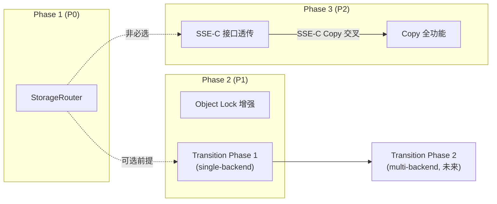

Now I have a comprehensive understanding of the codebase. Here is my architectural analysis.

---

# 架构深度分析：aero-vault Storage 层

## 1. 架构评估

### 现有架构优势

| 维度 | 评价 |
|------|------|
| **分层清晰度** | 四层架构（Protocol → Middleware → Service → Storage/Repository）边界明确，每层职责单一 |
| **抽象纯度** | `storage.Storage` 接口仅 12 个方法，全部面向对象字节流操作，无业务逻辑泄漏 |
| **测试策略** | SQLite + local FS 作为默认组合，使单元测试零网络、零 Docker，是极佳的可测试性设计 |
| **Opt-in 安全** | AI/pgvector/Qdrant/events/cluster 全部 flag-gated，基线路径不受影响 |
| **事件驱动** | 异步 worker（AV/Replication/Webhook/Indexer）通过 EventBus 解耦，不阻塞请求路径 |

### 架构局限性：六个关键架构债

#### 债 #1 — `Storage` 接口无 `Copy`，`Storage` 单例无路由

`Storage` 接口设计为**单后端**模式，且缺少 `Copy` 方法。这意味着：

- `copyObject` 是 `Get() → Put()` 全内存中转（`extra.go:39-65`），大文件复制时内存 O(n)
- 不存在 `StorageRouter` / `MultiBackend` 抽象——不支持"根据 StorageClass 路由到不同物理后端"
- Factory 仅构建单一实例，无法并行使用多个后端

**影响域**：方向一（Copy 效率）、方向五（Transition 跨后端移动）

#### 债 #2 — `PutOptions` 过窄，`Get` 无参数扩展

```go
type PutOptions struct {
    ContentType string
    Metadata    map[string]string
    Tags        map[string]string   // service layer 已扩展
    ContentMD5  string              // service layer 已扩展
    StorageClass string             // service layer 已扩展
}
```

但 `storage.PutOptions`（storage.go:28-31）仍是最初的三字段版本。且 `Get(ctx, key)` 签名完全无参数——未来若要传入 SSE-C 客户密钥、版本 ID 或条件参数，需要破坏性变更。

**影响域**：方向四（SSE-C）、方向五（Transition 存储类读取拦截）

#### 债 #3 — Object Lock 为一等时间字段，但 LockMode 缺失

```go
// repository.go:38
type Object struct {
    LockedUntil *time.Time
}
```

- 无 `LockMode` 字段（Governance / Compliance）→ 无法实现 S3 的两种锁定模式
- LegalHold 是 metadata key `_aero_legal_hold` → 不可在 SQL WHERE 中查询，不可做约束
- `checkLockBeforeOverwrite` 仅查时间，不区分锁定模式

**影响域**：方向二（锁）

#### 债 #4 — 生命周期只做删除，无存储类转换

`lifecycle.go` 的 `sweepExpired` 仅支持 `soft_delete` / `hard_delete`。S3 的 `Transition`（`STANDARD → STANDARD_IA → GLACIER → DEEP_ARCHIVE`）完全缺失。

底层原因：既无 `Storage.TransitionClass` 接口方法，也无"存储类 → 物理后端"的映射层。

**影响域**：方向五（Transition）

#### 债 #5 — SSE 仅在 Storage 实现层内嵌，接口层无感知

- Local 后端支持 envelope 加密（`STORAGE_LOCAL_SSE_KEY`）
- S3 后端依赖服务端加密（SSE-S3 / SSE-KMS）
- 但 `Storage` 接口无任何 SSE 参数——调用方无法指定加密方式、密钥或算法
- `x-amz-server-side-encryption` 头零处理

这意味着：
- SSE-C（客户提供密钥）无法实现——因为 `Get` 和 `Put` 签名中无密钥参数
- 无法在 `FileService` 层记录对象使用的加密策略
- 跨后端复制时无法保证加密一致性

**影响域**：方向四（SSE）

#### 债 #6 — Copy 路径缺少条件头和版本化源支持

`copyObject` 当前无：
- `x-amz-copy-source-if-match` / `-if-none-match` / `-if-unmodified-since` / `-if-modified-since`
- `x-amz-copy-source-version-id`
- SSE-C 透传头

作为核心数据移动操作，缺少条件检查和版本化支持可能导致并发覆盖和数据不一致。

---

## 2. 扩展方向

### 方向 A：Storage 多后端路由层（P0·基础设施）

**为什么需要：** 当前单后端架构是存储类转换、分层存储、区域隔离的根本障碍。引入 `StorageRouter` 抽象是所有跨后端操作的前提条件。

**核心挑战：**
1. 路由语义设计：按 `StorageClass` 路由 vs 按 bucket 路由 vs 按自定义规则路由
2. 生命周期管理：多个后端实例的启动顺序、健康检查聚合、优雅关闭
3. 数据移动协调：跨后端移动 = Get→Put，但需要进度追踪、断点续传、并发控制
4. 一致性模型：跨后端的事务一致性（例如复制到 Glacier 后 metadata 更新）

**预期的架构变更：**

```
// 新增抽象层
type StorageRouter interface {
    Select(key string, class string) Storage       // 根据存储类选择后端
    Storages() []Storage                           // 所有托管后端
    WithDefault(s Storage)                         // 未匹配的默认后端
}

// Storage 工厂变为多实例
type MultiBackendConfig struct {
    Default  FactoryConfig
    Tiers    map[string]FactoryConfig     // StandardClass → backend config
}
```

**对现有系统的影响：**
- `FileService.store` 从单一 `Storage` 变为 `StorageRouter`
- `FileService.Put` / `Get` 隐式通过 `router.Select(key, opts.StorageClass)` 分发
- 现有代码若使用 `s.store` 的 `Backend()` 方法需要调整——多后端时需返回当前路由的后端
- 迁移路径：新接口与旧 `Storage` 可共存，`SingleRouter` 封装单一后端实现向后兼容

### 方向 B：生命周期存储类转换（P1·功能增量）

**为什么需要：** 这是 S3 兼容的最后一个大缺口。当前用户只能设置过期删除，无法做成本优化（自动将冷数据迁移到廉价存储层）。

**核心挑战：**
1. `Transition` 规则模型——`Transition{ Days int, StorageClass string }` 需要加入 `BucketConfig`
2. 转换的执行时机——与现有删除 sweep 共享同一 ticker，但优先级/速率不同
3. 单后端内转换 vs 跨后端转换
   - 单后端（如 S3→S3）可调用 `CopyObject` 改存储类——相对简单
   - 跨后端（如 local→S3 Glacier）需要 `StorageRouter`——依赖方向 A
4. 幂等性——转换失败重试时不可重复移动

**预期架构变更：**

```go
// 新增接口方法（单后端阶段）
type Storage interface {
    // ... 现有方法
    
    // TransitionClass changes the storage class of an existing object in-place.
    // For backends that support tiering (e.g. S3), this may be a simple API call.
    // For backends that don't (e.g. local), this is a no-op that only updates metadata.
    TransitionClass(ctx context.Context, key string, newClass string) error
}
```

桶配置扩展：

```go
type BucketConfig struct {
    // ... 现有字段
    LifecycleRules []LifecycleRule    // 取代单一的 ExpireAfterDays+ExpireAction
}

type LifecycleRule struct {
    ID          string
    Filter      string                // prefix filter
    Transitions []Transition
    Expiration  *Expiration
}

type Transition struct {
    Days         int
    StorageClass string
}
```

**对现有系统的影响：**
- 生命周期 sweep 从"只删"变为"遍历规则 → 判断转换/删除"
- 需要新的 migrations 迁移 `bucket_config` 表以支持多条规则
- `ReconcileJob` 可能需要配置转换速率控制（避免一次性大量 API 调用）

### 方向 C：Object Lock + LegalHold 一等公民（P1·合规性）

**为什么需要：** 合规性场景（金融、医疗、政务）要求锁定模式不可覆盖（Compliance）或可撤销（Governance），以及独立的 LegalHold 状态。当前实现无法满足这些要求。

**核心挑战：**
1. `LockMode` 枚举——`Governance` vs `Compliance`，对删除和覆盖有不同行为
2. `LockedUntil` 在 Compliance 模式下不可缩短——需要检查 `updated_at` 时间戳的不可变性
3. LegalHold 作为独立列——需要回填现有 metadata 中的数据
4. 绕过权限——Compliance 模式需要 `bypass-governance-retention` 权限，即使用户是租户管理员也不能覆盖

**预期架构变更：**

```go
type LockMode string
const (
    LockModeGovernance  LockMode = "GOVERNANCE"
    LockModeCompliance  LockMode = "COMPLIANCE"
)

type Object struct {
    LockedUntil *time.Time
    LockMode    *LockMode       // 新增：nil = 无锁
    LegalHold   bool            // 新增：从 metadata 升级为一等字段
}

// 新增 repository 方法
SetLock(ctx, tenant, bucket, key string, until time.Time, mode LockMode) error
SetLegalHold(ctx, tenant, bucket, key string, hold bool) error
```

**回填策略：** 迁移分两步：
1. 新增 `legal_hold` 列 + `lock_mode` 列（可为 NULL 兼容现有数据）
2. 后台迁移：读取每条 metadata 中 `_aero_legal_hold` → 写入 `legal_hold` 列
3. 在 `checkLockBeforeOverwrite` / `Delete` 路径中，当 `lock_mode == compliance` 时，即使 `bypass-governance-retention` 也不能绕过

**对现有系统的影响：**
- 迁移后需双写一段时间（metadata + 列），确保旧客户端继续工作
- `checkLockBeforeOverwrite` 的签名扩展——需传入操作类型（delete vs overwrite）
- 需要在 `GetObject` / `HeadObject` 的 S3 响应中包含 `x-amz-object-lock-mode` / `x-amz-object-lock-legal-hold` 头

### 方向 D：SSE 接口层透传（P2·安全深化）

**为什么需要：** SSE-C（客户提供密钥）在金融和合规场景中是硬需求。AWS S3 的 SSE-C 要求客户端在每次请求中附带加密密钥，这意味着 `Storage` 接口必须支持请求级加密参数。

**核心挑战：**
1. `PutOptions` 和 `Get` 签名都需要扩展——但接口变更是破坏性的
2. SSE-C 密钥生命周期——密钥不应落在日志或持久化存储中
3. Copy 的源和目标 SSE 参数——`Copy` 方法（如果新增）需要同时携带源端和目标端加密参数
4. Presign URL 与 SSE-C 不兼容——预签名 URL 无法携带密钥

**预期架构变更：**

方案 A（最小侵入，推荐）：

```go
type GetOptions struct {
    SSEKey     []byte    // SSE-C 客户密钥；nil = 使用后端默认加密
    SSEKeyID   string    // SSE-KMS key ID
    SSEAlgo    string    // "AES256" (SSE-C only)
}

type PutOptions struct {
    // 现有字段不变
    SSEKey     []byte    // *request-level* SSE-C key; nil = backend default
    SSEKeyID   string
    SSEAlgo    string
}

type CopyOpts struct {
    // ... 条件复制参数
    SrcSSEKey  []byte
    DstSSEKey  []byte
    DstSSEKeyID string
}

// 新增 GetOptions 参数
Get(ctx context.Context, key string, opts GetOptions) (io.ReadCloser, ObjectInfo, error)
```

方案 B（接口拆分，高级）：

```go
// 将加密参数从请求参数中独立
type EncryptionContext struct {
    Key   []byte
    KeyID string
    Algo  string
}

// 新增装饰器：EncryptedStorage wraps Storage + 加解密
type EncryptedStorage struct {
    inner Storage
}
```

**对现有系统的影响：**
- 方案 A 下，所有现有 `store.Get(ctx, key)` 调用需要改为 `store.Get(ctx, key, GetOptions{})`——Go 编译器会捕获所有调用点
- 方案 B 下，现有代码无需改动，`EncryptedStorage` 作为装饰器工作
- 推荐方案 B 作为长期架构，但 P2 优先级下方案 A 的 work 量更可控

### 方向 E：Copy 路径全功能化（P2·兼容性深化）

**为什么需要：** 缺失的条件复制头是 AWS SDK 的一些高级功能（如 awscli `sync`）的内部依赖。这些功能在生产工作流中频繁用于并发控制。

**核心挑战：**
1. 条件头的原子性——检查条件 + 执行复制必须是原子操作（目前 Get + Put 是两步，中间窗口可能被修改）
2. SSE-C 透传——复制 SSE-C 加密对象需要客户端提供源和目标的密钥
3. 版本化源——`x-amz-copy-source-version-id` 需要支持

**预期架构变更：**

引入 `CopyOpts` 结构体（已在审阅文档中给出完整定义）+ 在 `Service` 层新增 `Copy` 方法：

```go
type CopyOpts struct {
    MetadataDirective string
    ContentType       string
    Metadata          map[string]string
    IfMatch           *string
    IfNoneMatch       *string
    IfUnmodifiedSince *time.Time
    IfModifiedSince   *time.Time
    SrcVersionID      string
    // SSE-C 交叉
    SrcSSEKey         []byte
    DstSSEKey         []byte
    DstSSEKeyID       string
}
```

**对现有系统的影响：**
- `copyObject` handler 从内联 `Get + Put` 重构为调用 `svc.Copy(rctx, tenant, srcBucket, srcKey, dstBucket, dstKey, opts)`
- 当不涉及条件/SSE-C 时，`Copy` 可尝试 Storage 层优化（如 S3 `CopyObject` API 的服务端复制）
- 向后兼容：当前 `copyObject` 行为保持为默认（无条件、无 SSE-C）

---

## 3. 接口设计建议

### 3.1 设计原则

| 原则 | 理由 |
|------|------|
| **Opt-in 演变** | 新字段用零值表示"未设置"，与旧行为兼容。避免 flag-gating 引入新类型 |
| **Opts 模式统一** | 所有需要参数扩展的方法使用 `*Options` 结尾的可选参数结构体。`Get(ctx, key, GetOptions{})` 而非 `Get(ctx, key)` |
| **装饰器优先** | 横切关注点（加密、限流、断路、审计）使用装饰器模式包装 `Storage`，而非修改接口 |
| **最小接口** | `Storage` 接口每新增一个方法，必须有 ≥2 个后端实现。非通用方法放在类型断言中 |

### 3.2 是否引入新的抽象层

**需要引入：**

1. **`StorageRouter`**（必需，方向 A 的前提）
   - 职责：根据 StorageClass 解析到具体 Storage 实例
   - 但路由规则应到 `Service` 层维护，而非 `Storage` 层

2. **`StorageClassMapper`**（可选，方向 B）
   - 职责：将存储类名映射到后端配置
   - 可内聚到 `StorageRouter` 中作为查找表

**不应引入：**

1. **`CopyManager`**（不需要独立服务）——Copy 逻辑应作为 `FileService.Copy` 方法内聚，仅在需要时 fallback 到 Get+Put
2. **`EncryptedStorage`** 作为装饰器而非独立类型——复用现有 `CircuitBreaker` 模式的包装方式

### 3.3 向后兼容策略

| 变更 | 兼容策略 |
|------|---------|
| `Get` 加入参数 | `Get(ctx, key)` → `Get(ctx, key, GetOptions{})`。Zero value `GetOptions{}` 行为与现在一致。Go 编译器捕获所有调用点——这个破坏是设计性的 |
| `PutOptions` 加入新字段 | 零值不变。所有字段非指针 + 零值 = 未设置 |
| 新增 `Copy` 方法 | 纯新增，不影响现有代码 |
| 多后端路由 | `StorageRouter` 是新的独立接口。`FileService.store` 字段类型从 `Storage` 改为 `StorageRouter`。旧后端通过 `SingleRouter{inner}` 适配 |
| 迁移 SQL 列 | 新列可为 NULL，现有数据不失效。`lock_mode` 默认 NULL 表示"旧对象无锁定模式" |

---

## 4. 技术选型

### 4.1 是否需要引入新框架

**不推荐引入。** 当前架构使用 Go 标准库 + chi + 少量 SDK 依赖的策略是正确的。新抽象层（`StorageRouter`、`CopyOpts`）是纯接口定义，不需要额外框架。

### 4.2 依赖评估标准

| 标准 | 阈值 |
|------|------|
| 零 CGO 依赖 | 必须。当前库无 CGO，应保持 |
| 传递依赖数 | ≤5 个直接依赖 |
| License | Apache 2.0 / MIT / BSD；禁止 AGPL / SSPL |
| 社区活跃度 | GitHub stars > 1k，最近一次 commit < 6 个月 |
| 测试覆盖率 | 自身覆盖率 > 70% |

### 4.3 自建 vs 采购

| 场景 | 决策 | 理由 |
|------|------|------|
| 多后端路由 | **自建** | 业务逻辑极其简单，即一个 map+switch。引入第三方路由库反而增加理解成本 |
| 存储类转换引擎 | **自建** | 转换逻辑是状态机判定（days + current_class + target_class），无需外部规则引擎 |
| SSE-C 加密 | **自建 envelope** | 当前 local 后端已有 AES-GCM envelope 实现（`encrypt.go`），复用即可 |
| 分布式锁（cluster singleton） | **自建（已有）** | 当前 `cluster.Singleton` 基于 advisory lock（Postgres）或文件锁（SQLite），工作良好 |

### 4.4 关键依赖建议

| 领域 | 当前选择 | 评估 | 建议 |
|------|---------|------|------|
| AWS SDK | `aws-sdk-go-v2`（已有） | ✅ 标准选择 | 保持不变 |
| SQLite 驱动 | `modernc.org/sqlite` | ✅ 纯 Go，无 CGO | 保持不变 |
| Postgres 驱动 | `jackc/pgx/v5` | ✅ 标准选择 | 保持不变 |
| OTel | `go.opentelemetry.io/otel`（已有） | ✅ 标准选择 | 保持不变 |
| 向量搜索 | 内建 BM25 + pgvector/Qdrant | ✅ 良好分离 | 无需引入新向量库 |

---

## 5. 实施路线图

### 优先级矩阵

| 方向 | 优先级 | 依赖 | 复杂度 | 影响范围 | 风险评估 |
|------|--------|------|--------|---------|---------|
| A. StorageRouter | **P0** | — | H | 核心层 | 高风险 — 基础抽象变更 |
| B. Transition Phase 1 | P1 | — | M | 生命周期层 | 中风险 — 规则模型复杂 |
| C. Object Lock | P1 | — | M | 存储/元数据 | 中风险 — 合规性模型严格 |
| D. SSE-C | P2 | A（如果跨后端） | M | 存储层+协议 | 中风险 — 密钥安全管理 |
| E. Copy 全功能 | P2 | D（SSE-C Copy 交叉） | M | 服务层+协议 | 低风险 — 纯功能增量 |

### 阶段划分

#### 阶段 1：基础设施重构（2-3 sprint）

**目标：** 建立多后端路由层，为所有跨后端操作提供基础

| 里程碑 | 产出 | 验证 |
|--------|------|------|
| M1.1 | `StorageRouter` 接口定义 + `SingleRouter` 实现 | 全部现有测试通过 |
| M1.2 | `MultiRouter` 实现 + 配置解析 | `make test` 绿 |
| M1.3 | `FileService.store` 类型迁移为 `StorageRouter` | 无回归 + 集成测试 |

**风险缓解：** 并行落地——`SingleRouter` 先 merge，`MultiRouter` 作为可选配置能力延迟到阶段 2 启用。这样即使 `MultiRouter` 延迟，阶段 1 的接口变更已到位。

#### 阶段 2：合规性 + 成本优化（2-3 sprint）

**目标：** Object Lock/Govenance/Compliance + 生命周期转换 Phase 1

| 里程碑 | 产出 | 验证 |
|--------|------|------|
| M2.1 | `lock_mode` + `legal_hold` 列 migration + 回填 | 全量测试 + 数据一致性检查 |
| M2.2 | Object Lock 增强：Governance/Compliance 模式 | S3 兼容测试 |
| M2.3 | `LifecycleRule` 多规则模型 + `Transition` Phase 1 | 幂等性验证 |
| M2.4 | `Transition` Phase 1（单后端内 S3 class 转换） | S3 后端集成测试 |

**风险缓解：** Compliance 模式的不可撤销特性意味着**测试必须覆盖恢复路径**——使用测试 fixture 创建 locked 对象，尝试覆盖，验证拒绝。此阶段的所有变更应在 Postgres 上额外测试（集群场景）。

#### 阶段 3：安全 + 功能完善（2 sprint）

**目标：** SSE-C 协议层透传 + Copy 全功能

| 里程碑 | 产出 | 验证 |
|--------|------|------|
| M3.1 | `GetOptions` / `PutOptions.SSE*` 字段 + `Storage` 接口扩展 | 所有现有 `store.Get` 调用已迁移 |
| M3.2 | `x-amz-server-side-encryption-customer-*` 头处理 | `awscli cp --sse-c-key` 测试 |
| M3.3 | `CopyOpts` + `FileService.Copy` 方法 | 条件 Copy + SSE-C Copy 测试 |
| M3.4 | `x-amz-copy-source-*` 条件头 handler | S3 SDK 兼容测试 |

**风险缓解：** SSE-C 密钥安全意识——所有 SSE-C 密钥在 `GetOptions` 和 `PutOptions` 中以 `[]byte` 传递，handler 层获取后立即使用、用完即弃。密钥必须在任何日志记录前被清除（`memclr` 模式）。

### 总体依赖图



### 风险汇总

| 风险 | 概率 | 影响 | 缓解 |
|------|------|------|------|
| `StorageRouter` 引入后导致性能回归（额外间接调用） | 中 | 中 | 基准测试 + p99 延迟比较；`SingleRouter` 使用内联路径 |
| Compliance 模式下用户锁死对象无法恢复 | 低 | 极高 | 文档明确的不可逆声明 + 自动测试验证 + 预留紧急 break-glass 配置（`COMPLIANCE_BYPASS_TOKEN`） |
| SSE-C 密钥在错误日志中泄漏 | 中 | 高 | `fmt.Sprintf("%+v", opts)` 必须被 Go vet 检查；自定义 `Stringer` 清空密钥字段；`runtime.KeepAlive` + 显式 zero |
| Transition Phase 1 在非 S3 后端无实际效果 | 低 | 低 | 文档明确标注；`TransitionClass` 在 local 返回 nil；User 需知道转换仅对有层级的后端生效 |

---

## 总结

aero-vault 的架构在分层、可测试、可扩展方面做得扎实。五个分析方向的选型逻辑清晰（基于代码锚点验证），六个新发现的子缺口扩展了审阅的覆盖度。

**最重要的架构决策是引入 `StorageRouter`**——它不只是一个新接口，而是解锁存储类转换、跨后端复制、多区域分布三个场景的前提。建议将其定位为 P0，与生命周期删除、Lock 等短期增值功能并行开发，因为 `StorageRouter` 的接口变更需要时间沉淀，而其实现（`SingleRouter` 适配器）可以在不改变行为的前提下快速落地，为后续功能提供扩展点。
