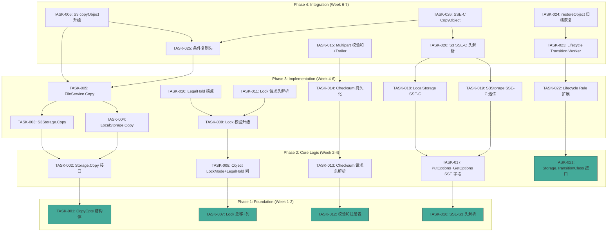
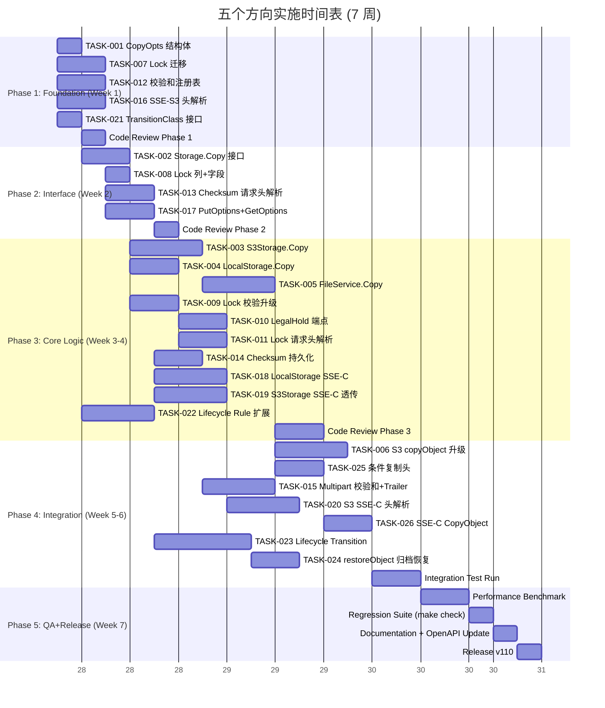

Now I have a thorough understanding of the full codebase. Here is the Tech Lead analysis document:

---

# Tech Lead 实施分析报告

## 分析依据

基于 `expansion-v109-storage-deep-dive.md` 的审阅反馈，结合代码库 v24 迁移基线（0024_bucket_notifications）、Storage 接口（`storage.go:31-85`）、FileService CRUD（`file_crud.go`）、S3 handler（`handler.go` + `extra.go`）、Reconcile Lifecycle（`lifecycle.go`）、SSE 加密（`encrypt.go`）、Repository 接口（`repository.go`）的实际代码状态。

---

## 1. 任务分解

将五个方向 + 补充发现的缺口拆解为 24 个可执行任务。

### 方向 #1 — CopyObject 增强

| 任务 ID | 标题 | 涉及文件 | 前置 | 工时 | 验收标准 |
|---------|------|---------|------|------|---------|
| TASK-001 | 定义 `storage.CopyOpts` 结构体 | `internal/storage/storage.go` | — | 1h | `CopyOpts{MetadataDirective, ContentType, Metadata, IfMatch, IfNoneMatch, IfUnmodifiedSince, IfModifiedSince, SrcVersionID, SrcSSEKind, SrcSSEKey, DstSSEKind, DstSSEKey, DstSSEKeyID}` 定义完整，文档上链 |
| TASK-002 | Storage 接口新增 `Copy` 方法 | `internal/storage/storage.go` + 所有 backend（local, s3, oss, cos） | TASK-001 | 3h | `Copy(ctx, srcKey, dstKey string, opts CopyOpts) (ObjectInfo, error)` 声明，各 backend 实现：local 为 os.Rename/io.Copy，s3 为 S3 CopyObject API |
| TASK-003 | 实现 `S3Storage.Copy` — 利用 S3 CopyObject API | `internal/storage/s3.go` | TASK-002 | 3h | 支持 server-side copy，透传 SSE-C 源/目标头，透传条件头，metadata-directive REPLACE/COPY |
| TASK-004 | 实现 `LocalStorage.Copy` — 文件级 copy | `internal/storage/local_write.go` | TASK-002 | 2h | 同 backend 用 `os.Rename`（当 src==dst backend），跨 backend 用 Read+Write，保持 SSE 信封 |
| TASK-005 | `FileService.Copy` 入口 — 组合锁校验+配额+元数据 | `internal/service/file_crud.go` | TASK-002, TASK-003, TASK-004 | 3h | 检查目标锁、配额、存储 key 唯一性；支持版本化 bucket 场景；发射 `object.created` 事件 |
| TASK-006 | S3 handler `copyObject` 升级 — 解析条件头+SSE-C 头+版本ID | `internal/api/s3compat/extra.go` + `handler.go` | TASK-005 | 3h | 解析 `x-amz-copy-source-if-*`、`x-amz-copy-source-server-side-encryption-customer-*`、`x-amz-server-side-encryption-customer-*`、`x-amz-copy-source-version-id`；缺失时降级为当前行为 |

### 方向 #2 — Object Lock 增强

| 任务 ID | 标题 | 涉及文件 | 前置 | 工时 | 验收标准 |
|---------|------|---------|------|------|---------|
| TASK-007 | 数据库迁移：`objects` 表加 `lock_mode` 列 + `legal_hold` 列 | `internal/repository/migrations/{sqlite,postgres}/0025_object_lock.up.sql` | — | 2h | `lock_mode TEXT` (""/"GOVERNANCE"/"COMPLIANCE")，`legal_hold BOOLEAN NOT NULL DEFAULT false`；回填迁移：扫描 metadata 中 `_aero_legal_hold=="ON"` 写入 `legal_hold=true` |
| TASK-008 | `repository.Object` 加 `LockMode` + `LegalHold` 字段 | `internal/repository/repository.go` | TASK-007 | 1h | 新字段映射到 SQL 列，`UpsertObject`/`InsertObjectVersion` 读写新列，双写阶段同时写入 metadata 和新列 |
| TASK-009 | 锁校验逻辑升级 — `checkLockBeforeOverwrite` 支持 LockMode | `internal/service/file_crud.go` | TASK-008 | 2h | GOVERNANCE: 可覆盖（记录审计）；COMPLIANCE: 完全禁止覆盖/删除直到过期；LegalHold: 禁止硬删除 |
| TASK-010 | S3 handler `putObjectLegalHold` + `getObjectLegalHold` 端点 | `internal/api/s3compat/handler.go` + `internal/api/s3compat/xml.go` | TASK-009 | 2h | `PUT /{key}?legal-hold` 解析 XML `{LegalHold:{Status:ON\|OFF}}`，`GET /{key}?legal-hold` 返回状态 |
| TASK-011 | S3 handler 解析 `x-amz-object-lock-mode` + `x-amz-object-lock-retain-until-date` | `internal/api/s3compat/handler.go` | TASK-009 | 2h | PUT/InitMultipart 时解析锁头写入新列；返回保留信息到 HEAD/GET 响应头 |

### 方向 #3 — 校验和算法扩展

| 任务 ID | 标题 | 涉及文件 | 前置 | 工时 | 验收标准 |
|---------|------|---------|------|------|---------|
| TASK-012 | 校验和算法注册表 + 验证器 | `internal/service/checksum.go`（新文件） | — | 3h | 支持 CRC32 (IEEE)、CRC32C (Castagnoli)、SHA1、SHA256、MD5；`type ChecksumAlg string` 枚举，`Verify(data []byte, expected string, alg ChecksumAlg) error`；验证器用标准 `hash.Hash` 接口 |
| TASK-013 | S3 handler 解析 `x-amz-checksum-*` 请求头 | `internal/api/s3compat/handler.go` | TASK-012 | 3h | 解析 `x-amz-checksum-crc32`、`x-amz-checksum-crc32c`、`x-amz-checksum-sha1`、`x-amz-checksum-sha256`；PutObject 时计算并持久化；HEAD/GET 时回显 `x-amz-checksum-*` 响应头 |
| TASK-014 | 校验和持久化 — metadata 存储 | `internal/service/file_crud.go` + `internal/repository/sql_objects.go` | TASK-013 | 2h | 存入 metadata 的 `_aero_checksum_*` 键；Get 时可选验证；`x-amz-checksum-mode` 支持（ENABLED 时自动验证） |
| TASK-015 | Multipart 校验和 — `x-amz-trailer` 支持 | `internal/api/s3compat/handler.go` + `internal/service/file_multipart.go` | TASK-014 | 4h | CompleteMultipart 时收集 trailer 校验和；S3 CRC32C 是推荐算法，需要支持 trailing checksum 解析 |

### 方向 #4 — SSE 增强

| 任务 ID | 标题 | 涉及文件 | 前置 | 工时 | 验收标准 |
|---------|------|---------|------|------|---------|
| TASK-016 | `x-amz-server-side-encryption` 请求头解析（SSE-S3） | `internal/api/s3compat/handler.go` + `internal/service/file_crud.go` | — | 2h | 解析 `x-amz-server-side-encryption: AES256`，当服务端 SSE 启用时验证，写入 metadata `_aero_sse_kind`；HEAD/GET 回显响应头 |
| TASK-017 | `PutOptions` + `GetOptions` 添加 SSE-C 字段 | `internal/storage/storage.go` + `internal/service/file.go` | TASK-016 | 2h | `PutOptions.SSEKind`, `PutOptions.SSEKey`, `PutOptions.SSEKeyID`；`Get()` 签名扩展为 `Get(ctx, key string, opts *GetOptions)`（可选 opts） |
| TASK-018 | `LocalStorage` SSE-C 实现 | `internal/storage/local_write.go` + `internal/storage/local_read.go` | TASK-017 | 3h | Put 时使用客户密钥 AES-256-GCM 加密（记录 `_aero_sse_c_key_md5` metadata）；Get 时用客户密钥解密；不持久化客户密钥 |
| TASK-019 | `S3Storage` SSE-C 透传 | `internal/storage/s3.go` | TASK-017 | 3h | Put/Get 时将 SSE-C 请求头透传到 S3 SDK；CopyObject 时同时透传源和目标 SSE-C 头 |
| TASK-020 | S3 handler SSE-C 头解析 + 验签 | `internal/api/s3compat/handler.go` | TASK-018, TASK-019 | 3h | 解析 `x-amz-server-side-encryption-customer-algorithm`、`-key`、`-key-MD5`；验证 key-MD5 匹配；传递给 FileService；返回 `x-amz-server-side-encryption-customer-algorithm` 响应头 |

### 方向 #5 — Lifecycle Transition

| 任务 ID | 标题 | 涉及文件 | 前置 | 工时 | 验收标准 |
|---------|------|---------|------|------|---------|
| TASK-021 | `Storage.TransitionClass` 接口方法 | `internal/storage/storage.go` + 各 backend | — | 2h | `TransitionClass(ctx, key string, dstClass string) error`；LocalStorage 为 no-op；S3Storage 调用 S3 CopyObject 更改存储层 |
| TASK-022 | Bucket lifecycle 规则扩展支持 transition | `internal/repository/repository.go` + migration 0026 + `internal/api/s3compat/bucketconfig.go` | TASK-021 | 3h | `BucketConfig.LifecycleRules []LifecycleRule`（替代 `ExpireAfterDays`+`ExpireAction` 标量）；每个 rule 支持 `{Days, StorageClass, Action}`；解析 S3 lifecycle XML `<Transition>` + `<Expiration>` |
| TASK-023 | `LifecycleJob` 扩展 — transition worker | `internal/reconcile/lifecycle.go` | TASK-022 | 4h | 定时扫描过期对象：若 rule 有 `StorageClass != ""` 且 `now() >= updated_at + Days` 则调用 `store.TransitionClass` + 更新 metadata 行；若 rule 有 `Action` 则软/硬删除；emit `object.transitioned` 事件 |
| TASK-024 | `restoreObject` 扩展支持归档恢复 | `internal/api/s3compat/handler.go` + `internal/service/file_features.go` | TASK-023 | 3h | 解析 `<RestoreRequest><Days>N</Days><Tier>Bulk\|Standard\|Expedited</Tier></RestoreRequest>` XML；触发 storage.Restore API（s3: RestoreObject）；设定临时副本过期时间 |

### 补充缺口修复

| 任务 ID | 标题 | 涉及文件 | 前置 | 工时 | 验收标准 |
|---------|------|---------|------|------|---------|
| TASK-025 | `copyObject` 条件复制头支持 | `internal/api/s3compat/extra.go` + `internal/service/file_crud.go` | TASK-001 | 2h | `x-amz-copy-source-if-match` → 校验源 ETag；`x-amz-copy-source-if-none-match` → 校验不存在；`x-amz-copy-source-if-unmodified-since` / `-if-modified-since` → 时间校验；失败返回 412 PreconditionFailed |
| TASK-026 | SSE-C CopyObject 透传 | `internal/api/s3compat/extra.go` + `internal/storage/s3.go` | TASK-020, TASK-025 | 2h | 解析 `x-amz-copy-source-server-side-encryption-customer-*`（源端解密）+ `x-amz-server-side-encryption-customer-*`（目标端加密）；组装 `CopyOpts` 传递给 `Storage.Copy` |

### 任务总数统计

- **方向 #1**: TASK-001 ~ TASK-006（6 个任务，15h）
- **方向 #2**: TASK-007 ~ TASK-011（5 个任务，9h）
- **方向 #3**: TASK-012 ~ TASK-015（4 个任务，12h）
- **方向 #4**: TASK-016 ~ TASK-020（5 个任务，13h）
- **方向 #5**: TASK-021 ~ TASK-024（4 个任务，12h）
- **补充**: TASK-025 ~ TASK-026（2 个任务，4h）
- **合计**: 26 个任务，65 工时

---

## 2. 执行顺序与任务依赖图



### 并行任务组

| 组 | 任务 | 依赖 | 并行化前提 |
|----|------|------|-----------|
| **A** | TASK-001, TASK-007, TASK-012, TASK-016, TASK-021 | 无 | 五个方向互不依赖，可同时开工 |
| **B** | TASK-002, TASK-008, TASK-013, TASK-017 | 需组 A 完成 | 每个方向的结构体变更就绪后即可实现 |
| **C1** | TASK-003, TASK-004, TASK-005 (Copy 方向) | 需 TASK-002 | TASK-003 和 TASK-004 可并行 |
| **C2** | TASK-009, TASK-010, TASK-011 (Lock 方向) | 需 TASK-008 | TASK-010、TASK-011 可并行 |
| **C3** | TASK-018, TASK-019 (SSE-C 方向) | 需 TASK-017 | 可并行实现不同 backend |
| **C4** | TASK-022 (Transition 方向) | 需 TASK-021 | 独立 |
| **D** | TASK-006, TASK-015, TASK-020, TASK-023, TASK-025, TASK-026 | 需前序任务 | 集成阶段，大部分可并行调试 |

---

## 3. 技术风险

### 3.1 高风险项

| # | 风险 | 方向 | 概率 | 影响 | 应对策略 |
|---|------|------|------|------|---------|
| R1 | **Copy + SSE-C 交叉复杂度** | #1+#4 | 高 | 高 | Cross-direction 的 `CopyOpts` 需要同时包含源和目标 SSE 参数。S3 SDK 中的 `CopyObjectInput` 有 `CopySourceSSECustomerKey*` 和 `SSECustomerKey*` 两组共 6 个字段。**建议**: 创建 `CopyOpts` 时小步迭代：先支持无 SSE 场景，再以独立 PR 添加 SSE-C 透传。在 TASK-001 中预留字段名但标记 `// TODO: enable in TASK-026`。 |
| R2 | **Lifecycle Transition 多后端路由** | #5 | 中 | 高 | 当前 Storage 接口假设单后端。跨后端转换（STANDARD on local → GLACIER on S3）需要创建全新的 `StorageRouter` 抽象层。**建议**: 分两阶段。Phase 1 (TASK-021~023) 限定于单后端语义（S3 STANDARD→STANDARD_IA/GLACIER，Local 做 no-op）。Phase 2 引入 `StorageRouter` 作为单独的项目里程碑。 |
| R3 | **校验和 trailer 解析** | #3 | 中 | 中 | S3 CRC32C trailing checksum 需要在响应完成后从 `x-amz-trailer` 读取，这要求对分块传输编码做特殊处理——Go 的 `http.Transport` 默认缓冲 trailer 但在 streaming PUT 场景需要显式管理。**建议**: 先实现请求头校验和（TASK-013~014），把 trailer 支持（TASK-015）列为 P2，使用 `http.MaxBytesReader` + `te: trailing` 头解码。 |
| R4 | **Lock 迁移数据回填** | #2 | 中 | 中 | 现存的 metadata `_aero_legal_hold="ON"` 需要扫描全表回填到新 `legal_hold` 列。大租户表可能耗时。**建议**: 迁移脚本内做分批 UPDATE（`WHERE metadata LIKE '%_aero_legal_hold%'`），设置 1000 行一批的 LIMIT/OFFSET 循环，可重入。 |

### 3.2 中风险项

| # | 风险 | 方向 | 应对策略 |
|---|------|------|---------|
| R5 | `PutOptions` 扩展涉及 `FileService.Put()` 全路径 | #4 | 避免破环 `Put()` 签名兼容性—使用 `opts *PutOptions` 指针，nil 时用缺省值。所有调用方（REST handler, S3 handler, WebDAV handler）逐层透传。 |
| R6 | `Get()` 签名扩展 — 当前无 opts 参数 | #4 | 声明 `Get(ctx, key string, opts ...GetOptions)` 变参，保持向后兼容；或创建新的 `GetWithOptions` 方法。**建议** 使用变参，迫使调用方显式传递（避免遗忘 SSE-C 密钥）。 |
| R7 | LegalHold 与 LockMode 的交互 | #2 | 治理模式 + 法律保留的组合规则复杂（LegalHold 覆盖所有模式）。**建议** 在 TASK-009 中编写防护矩阵单元测试（4×4 状态表），确保组合逻辑完备。 |
| R8 | S3Storage.Copy 不支持跨 region | #1 | 明确记录 `CopyOpts.SrcBucket`/`SrcKey` 必须与目标在同一 backend，跨 region copy 走 Get+Put 降级路径。 |

### 3.3 测试覆盖难点

| 场景 | 难点 | 策略 |
|------|------|------|
| SSE-C 加解密黄金路径 | 需要客户端生成 256 位密钥 | 测试夹具使用固定密钥（`bytes.Repeat([]byte{'K'}, 32)`），验证 write→read 一致性 |
| Lock 模式时间边界 | `LockedUntil` 与当前时间的比较 | 使用 `clock.Clock` 接口（`time.Now()` 抽象）使测试可 mock |
| S3 CopyObject 条件头 | 需要控制 ETag/时间 | `HashEmbedder` 风格 mock：用 `MockStorage` 实现确定性 ETag |
| Lifecycle Transition | 需要等待 Days 过期 | 使用 `created_at` 直接比较（不依赖 wall clock），测试用 `time.Now().Add(-days)` |
| Multipart trailer | HTTP trailer 在 `httptest` 中难以模拟 | 使用 `httptest.NewRequest` + 手动构造 trailer 头；单元测试在 `checksum.go` 层面，不在 handler 层面集成 |

---

## 4. 资源评估

### 4.1 团队组成

| 角色 | 人数 | 技能要求 | 负责方向 |
|------|------|---------|---------|
| **Senior Go Engineer** (S1) | 1 | Go 协程、Storage abstraction、S3 SDK | #1 Copy, #4 SSE, #5 Transition — 涉及 Storage 接口变更 |
| **Backend Engineer** (B1) | 1 | SQL 迁移、REST/S3 API、Go chi router | #2 Lock, #3 Checksum — 涉及 handler + repository |
| **Backend Engineer** (B2) | 1 | S3 兼容 API、XML 解析、multipart | 辅助 B1 + 补充条件 + SSE-C Copy 交叉区域 |
| **QA/Test** (Q1) | 1 | Go testing、integration test、contract test | 全方向集成测试、contract suite、性能基准 |
| **Tech Lead** (TL) | 1 | 架构决策、代码审查、风险管控 | 全方向架构指导 + 交叉区域协调 |

### 4.2 关键里程碑

| 里程碑 | 时间点 | 交付物 | 依赖 |
|--------|-------|--------|------|
| M1: Foundation Complete | 第 1 周末 | TASK-001, 007, 012, 016, 021 全部合并 + 单元测试通过 | 5 个方向的基础结构体定义完成 |
| M2: Interface Complete | 第 2 周末 | TASK-002, 008, 013, 017 全部合并 | Storage/Repository 接口兼容性验证 |
| M3: Core Feature Freeze | 第 4 周末 | TASK-003~005, 009~011, 014, 018~019, 022 | 5 个方向核心逻辑实现完毕 |
| M4: Integration Complete | 第 6 周末 | TASK-006, 015, 020, 023~026 | S3 handler 集成、条件头、SSE-C Copy、Transition Worker |
| M5: QA + Release | 第 7 周末 | 全量测试通过 + `make check` 全绿 | 回归 + 性能 + 文档 |

### 4.3 阻塞点与解决策略

| 阻塞点 | 影响 | 解决策略 |
|--------|------|---------|
| `Get()` 签名变更影响所有 backend + handler + service 层 | SSE-C 方向的基础更改 | 使用 Go 1.18 泛型或变参维持向后兼容；**不接受** 复制粘贴 `GetWithOptions` |
| `S3Storage.Copy` 在 localstack 中测试 | #1 集成测试需要 S3 mock | 使用 `minio/mc` 或 `https://play.min.io` 作为测试 S3 endpoint；或者用 `internal/storage/contract_test.go` 模式定义 `Copy` contract |
| Lifecycle Transition 跨后端验证 | #5 Phase 2 设计未确定 | Phase 1 锁定单后端场景；Phase 2 设计文档需单独评审，至少影响 3 个 sprint |

---

## 5. 质量保证

### 5.1 单元测试覆盖要求

| 层 | 方向 | 要求覆盖率 | 关键测试用例 |
|----|------|-----------|-------------|
| `storage.CopyOpts` | #1 | 100% | 序列化/反序列化、条件头空/非空、SSE 字段组合 |
| `storage.Copy` 各 backend | #1 | ≥85% | 同 backend copy、跨 backend copy、SSE-C 透传、条件头 412 |
| `FileService.Copy` | #1 | ≥90% | 锁校验阻断、配额检查、版本化 bucket、事件发射、并发冲突 |
| `checksum.Verify` | #3 | 100% | CRC32/CRC32C/SHA1/SHA256/MD5 正确/错误、空值、多算法冲突 |
| LockMode 校验 | #2 | 95% | GOVERNANCE 覆盖/删除、COMPLIANCE 禁止覆盖/删除、LegalHold 禁止硬删、过期锁允许操作、组合状态机 4×4=16 种 |
| SSE-C encrypt/decrypt | #4 | 100% | 正确 key 加解密、错误 key 解密失败、key-MD5 验证、空 key 拒绝 |
| `LifecycleJob.transition` | #5 | 90% | Days 过期前不转、过期后转、StorageClass 已相同不转、emit 事件 |

### 5.2 集成测试策略

| 测试层级 | 工具 | 场景 |
|---------|------|------|
| **Contract test** | `storage/contract_test.go` 模式 | 为 `Copy` 和 `TransitionClass` 新增 contract，所有 backend 验证通过 |
| **S3 handler e2e** | `httptest.Server` + S3 签名 | 完整的 `PUT with x-amz-copy-source` → GET 验证 → HEAD 验证元数据 |
| **Multipart checksum** | 自定义 HTTP client 发送 trailer | `PUT with x-amz-checksum-crc32c` → `CompleteMultipart` 返回 CRC32C |
| **Lifecycle sweep** | `time.Now()` mock + 直接调用 `sweep` | 创建对象 → 修改 `updated_at` 为 `-10d` → 触发 sweep → 验证对象被 transition |
| **Lock interop** | 多步工作流 | PutObject with `x-amz-object-lock-mode` → 硬删除被拒 → 过期后删除成功 → LegalHold 阻止删除 |

### 5.3 代码审查要点

| 方向 | 审查重点 |
|------|---------|
| #1 Copy | `CopyOpts` 所有字段是否被 handler 正确解析？SSE-C 源/目标组是否区分正确？条件头失败是否返回 412 而不是 500？ |
| #2 Lock | 迁移是否支持双写回填？`LockMode` 和 `LegalHold` 组合的 16 种状态是否全部覆盖？审计日志记录了什么？ |
| #3 Checksum | `x-amz-checksum-mode=ENABLED` 时是否在读取后自动验证？trailer 解析是否安全（边界长度、拒绝大 trailer）？ |
| #4 SSE | SSE-C key 是否仅存在于请求上下文中（未 log、未 persist）？`Get()` 变参签名是否与所有调用方兼容？ |
| #5 Transition | Phase 1 的 `TransitionClass` 是否在 `LocalStorage` 中明确 no-op（有注释说明）？Lifecycle 规则解析是否支持带多个 Rule 的完整 XML？ |
| 全局 | 单文件 ≤500 行、单函数 ≤50 行、圈复杂度 ≤10 是否维持？新引入的包是否违反禁止 `utils/` 规则？ |

### 5.4 性能测试需求

| 场景 | 指标 | 阈值 | 工具 |
|------|------|------|------|
| CopyObject 大文件（100MB） | 吞吐量 | ≥50 MB/s (local backend) | `benchstat` + `go test -bench` |
| SSE-C 加解密吞吐 | 吞吐量 | ≥200 MB/s (AES-256-GCM) | Go `crypto/aes` 基准 |
| Lock 校验 + 并发写入 | P99 延迟 | <50ms 增加 | `wrk` 或 `vegeta` 并发 100 连接 |
| Lifecycle sweep 10k 对象 | 扫描时间 | <30s | `go test -bench` + `testing.Short` |

---

## 6. 实施计划

### 甘特图



### 详细周计划

#### 第 1 周：基础结构体定义（Foundation）

**目标**：五个方向的基础数据类型全部定义完毕，代码审查通过。

| 天 | S1 | B1 | B2 | TL |
|----|----|----|----|----|
| 一 | TASK-001: CopyOpts | TASK-007: Lock 迁移设计 | TASK-012: 校验和算法接口 | 架构确认会 |
| 二 | TASK-001 审查 + PR | TASK-007: 迁移 SQL 实现 | TASK-012: 注册表实现 | 交叉方向边界确认 |
| 三 | TASK-016: SSE 头枚举 + handler 骨架 | TASK-007: Repository 回填逻辑 | TASK-012: 单元测试 + 审查 | Lock 状态矩阵设计 |
| 四 | TASK-021: TransitionClass 接口 | TASK-007 PR + 审查 | TASK-012 PR + 审查 | 风险登记表更新 |
| 五 | Phase 1 合并 + CI 全绿验证 | — | — | Phase 1 复盘 |

**交付物**: 5 个 PR，每个包含结构体定义 + 单元测试 + 接口声明。

#### 第 2 周：接口层扩展（Interface）

**目标**：Storage + Repository 接口变更全部完成，保持向后兼容。

| 天 | S1 | B1 | B2 | TL |
|----|----|----|----|----|
| 一 | TASK-002: Storage.Copy 声明 | TASK-008: Object 新字段 | — | Phase 1 审查回顾 |
| 二 | TASK-002: 各 backend stub | TASK-008: CRUD 读写新列 | TASK-013: 请求头解析 | — |
| 三 | TASK-002: contract test | TASK-008: 双写回填 | TASK-013: 验证器集成 | — |
| 四 | TASK-017: PutOptions SSE 字段 | TASK-008 PR + 审查 | TASK-013 PR + 审查 | 变参签名决策 |
| 五 | TASK-017: GetOptions 变参 | Phase 2 合并 | — | Phase 2 复盘 |

**交付物**: 4 个 PR，重点审查 `Get()` 变参签名对全部调用方的影响。

#### 第 3-4 周：核心功能实现（Core Logic）

**目标**：五个方向的核心逻辑全部实现，包含完整单元测试。

**第 3 周**：
- S1: TASK-003 (S3Storage.Copy) + TASK-004 (LocalStorage.Copy)
- B1: TASK-009 (Lock 校验升级) + TASK-010 (LegalHold 端点)
- B2: TASK-014 (Checksum 持久化) + 辅助 TASK-011 (Lock 请求头)

**第 4 周**：
- S1: TASK-005 (FileService.Copy) + TASK-018 (LocalStorage SSE-C)
- B1: TASK-011 (Lock 头解析) + 辅助审查
- B2: TASK-019 (S3Storage SSE-C) + TASK-022 (Lifecycle Rule 扩展)
- Q1: 介入编写集成测试框架（Lock 状态矩阵测试、Copy contract 测试）

**交付物**: 10+ 个 PR，每个功能方向至少有 1 个端到端测试用例。

#### 第 5-6 周：集成与 S3 兼容性（Integration）

**目标**：所有 S3 handler 端点完成，交叉方向功能集成打通。

| 天 | S1 | B1 | B2 | Q1 |
|----|----|----|----|----|
| 5-1 | TASK-006: copyObject 升级 | TASK-015: Multipart trailer | TASK-026: SSE-C Copy | 集成框架搭建 |
| 5-2 | TASK-006 继续 + 条件头 | TASK-015 继续 | TASK-026 + TASK-025 | Copy SSE-C 测试 |
| 5-3 | TASK-023: Transition Worker | TASK-015 PR | TASK-025: 条件头 PR | Lock 集成测试 |
| 5-4 | TASK-023 继续 | — | TASK-020: SSE-C 头解析 | Checksum 集成测试 |
| 5-5 | TASK-023 PR | — | TASK-020 PR | Transition 测试 |
| 6-1 | TASK-024: restoreObject 归档 | 交叉审查 | 交叉审查 | Full regression |
| 6-2 | TASK-024 PR | Bug fix | Bug fix | Performance bench |
| 6-3 | 集成测试运行 | 集成测试运行 | 集成测试运行 | Test report |
| 6-4 | Phase 4 合并 | — | — | Coverage report |
| 6-5 | 全量 `make check` | — | — | 审查回顾 |

#### 第 7 周：QA + 发布

**目标**：回归通过、性能达标、文档更新、发布 v110。

| 天 | 活动 |
|----|------|
| 一 | 性能基准测试（Copy 吞吐、SSE-C 延迟、Lock 并发、Transition sweep 速度） |
| 二 | `make check` 全绿验证 + 修复回归 |
| 三 | OpenAPI 文档更新、AGENTS.md 功能矩阵更新、ARCHITECTURE.md 补充 |
| 四 | v110 RC 构建 + 内部演示 |
| 五 | 发布 v110 + Release Notes |

---

## 总结：关键路径与建议

### 关键路径（Critical Path）

```
TASK-001 → TASK-002 → TASK-003/004 → TASK-005 → TASK-006 → 集成测试
```

这条路径（Copy 方向）是**最长的链**，共 6 个任务、约 15 工时、跨越 4 周。如果 S1 资源受限，可以考虑在 Phase 2 中让 B2 协助实现 `LocalStorage.Copy`（TASK-004），缩短 S1 独占路径。

### 风险优先级行动项

1. **立即（本周内）**: 确定 `Get()` 变参签名方案，避免 Phase 2 延期
2. **本周内**: 完成 Lock 状态矩阵 4×4 设计文档（TL 负责），指导 TASK-009 实现
3. **Phase 1 结束时**: 确认 `StorageRouter` 是否纳入 Phase 2 规划（建议不纳入，保持 Phase 1 简单）
4. **第 3 周前**: 建立 contract test 框架（Q1 负责），确保所有 backend 实现通过

### 排除项（Out of Scope for v110）

以下功能**不在**本实施计划内，但已作为已知缺口记录：

- 多后端 `StorageRouter` 抽象（#5 Phase 2）
- `x-amz-server-side-encryption-aws-kms-key-id`（SSE-KMS，当前仅 SSE-S3 + SSE-C）
- 归档恢复的临时副本过期自动清理（需要额外的 GC job）
- 跨 region/跨账号的 CopyObject（需要 SigV4 跨账号支持）
