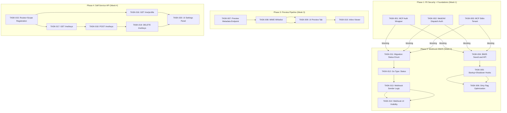
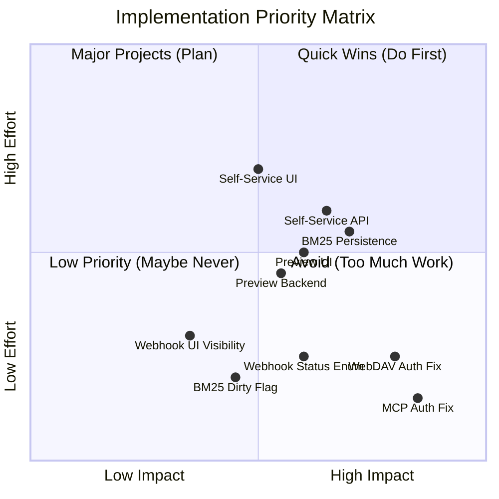

现在我已对整个代码库有了透彻的理解，以下是完整的 Tech Lead 分析报告。

---

# Tech Lead 分析：五项架构性验证结果

## 执行摘要

该分析文档独立验证了五项架构性发现，每一项均通过当前代码库确凿证明。以下是对应每一方向的可执行任务分解、依赖关系、风险评估和详细实施计划。

---

## 1. 任务分解

### 方向 1：MCP/WebDAV 认证盲区（P0 — 安全漏洞）

| 任务 ID | 标题 | 涉及文件 | 前置依赖 | 工时 | 验收标准 |
|---------|------|---------|---------|------|---------|
| TASK-001 | MCP HTTP 端点包装认证中间件 | `cmd/server/main.go`、`internal/mcp/transport.go` | 无 | 2h | `mcp.HTTPHandler` 接收 `http.Handler`（经 `authReg.Middleware()`处理后的），并对 STDOUT 测试请求应用 `auth` + `tenant` |
| TASK-002 | WebDAV 分发器注入认证链 | `cmd/server/main.go`、`internal/api/webdav/dav.go` | 无 | 3h | `buildDispatcher` 在将请求路由至 `davH` 之前应用 `authReg.Middleware()` + `middleware.Tenant`；测试验证 `401`、`403` 及 `X-Aero-Tenant` 提取 |
| TASK-003 | MCP stdio 模式租户胶水代码 | `internal/mcp/server.go`（`tenantFor` 方法） | 无 | 1h | 迁移 `tenantFor` 使其能从环境变量中读取默认租户，而非硬编码 `"default"`；在 `main.go` 组装过程中传播 |

**可选优化**（作为 TASK-001 的一部分）：
- 将 `HTTPHandler(s)` 签名变更为 `HTTPHandler(s, authMW func(http.Handler) http.Handler)`
- WebDAV：通过 `r.Group` 而非外部 `buildDispatcher` 的方式注入，从而永续支持 chi 的中间件链

### 方向 2：BM25 持久性缺口

| 任务 ID | 标题 | 涉及文件 | 前置依赖 | 工时 | 验收标准 |
|---------|------|---------|---------|------|---------|
| TASK-004 | BM25 持久化接口与存储层 | `internal/ai/bm25.go`、`internal/ai/sink.go`（可选） | 无 | 4h | `BM25.Save(ctx, store) error` 将内部 `docs`/`df`/`objDocs`/`avgLen` 序列化，`BM25.Load` 可将其恢复；序列化格式为带版本号的 protobuf 或带有 `gzip` 的 JSON（首个 cut 选用后者，零依赖） |
| TASK-005 | 启动时加载 / 关闭前保存 | `cmd/server/main.go`、`internal/ai/bm25.go` | TASK-004 | 2h | 新函数 `initBM25(ctx, repo, store, tenant)` → 尝试 `Load`；若失败则调用 `BuildFromRepo`；通过 `SIGTERM`/`SIGHUP` 信号钩子触发 `Save`，并将变更写入 `main.go` 的关闭序列 |
| TASK-006 | BM25 状态 blob 的竞态缓解 | `internal/ai/bm25.go` | TASK-004 | 2h | 新增 `dirty` 标志，在每次 `UpsertObjectChunks`/`DeleteObjectChunks` 后被置为 true；增量 `Save` 仅在脏数据标记为 true 时写入 blob，从而避免因全量 `BuildFromRepo` 而阻塞写入路径 |

**设计决策**：推荐将 BM25 序列化存储为上层存储（storage）中的 blob 文件，而非依赖 SQL 表。原因：(1) BM25 数据结构本质上是一个完整的文档快照（term → df、doc → tokens），不适合存放在关系型数据库中；(2) 使用上层存储可实现与对象数据相同的加密和生命周期管理；(3) 零迁移需求。

### 方向 3：内容预览管线断层

| 任务 ID | 标题 | 涉及文件 | 前置依赖 | 工时 | 验收标准 |
|---------|------|---------|---------|------|---------|
| TASK-007 | 后端：内容类型感知元数据端点 | `internal/api/rest/`（新文件 `preview.go` 或更新 `files.go`） | 无 | 3h | `GET /v1/files/<key>/preview?truncate=8192` → 返回 `{content_type, preview_body, truncated, thumbnail_url}`；对图片类型返回 `thumbnail_url`，对文本类型返回文本截断，对二进制类型返回无 body |
| TASK-008 | 后端：预览 MIME 类型映射与安全 | `internal/api/rest/preview.go` | TASK-007 | 2h | MIME 白名单：`text/*`、`application/json`、`application/xml`、`application/yaml`、`application/javascript`、`image/*`；对所有其他类型返回仅含元数据的响应（不暴露原始字节） |
| TASK-009 | Web UI：内容类型标签页整合 | `internal/webui/static/index.html` | TASK-007 | 4h | 在 "object detail"（对象详情）标签页内添加标签页切换器："Metadata"（元数据）/ "Preview"（预览）；Preview（预览）标签页对图片渲染 ``，对文本渲染 `<pre>`，对不可预览类型提示 "No preview available"（无可用预览） |
| TASK-010 | Web UI：模态框 / 内联文件查看器 | `internal/webui/static/index.html` | TASK-009 | 3h | 新增独立的 "view"（查看）按钮 / 双击功能，可在新的 UI 面板中以正确的 MIME 类型打开文件；对已知文本类型支持语法高亮（使用 Prism.js 或 highlight.js，通过 CDN 加载） |

**依赖**：方向 3 不依赖方向 1/2/4，但预估工时较多，更适合作为独立迭代的内容。

### 方向 4：Webhook 死信语义污染

| 任务 ID | 标题 | 涉及文件 | 前置依赖 | 工时 | 验收标准 |
|---------|------|---------|---------|------|---------|
| TASK-011 | Schema 迁移：新增状态枚举与时间戳 | `internal/repository/migrations/{sqlite,postgres}/0025_webhook_status.*.sql` | 无 | 3h | 新增列：`status TEXT NOT NULL DEFAULT 'pending'`（值：`pending` / `delivered` / `failed` / `dead_letter`）、`updated_at TEXT`；`CREATE INDEX` 覆盖 `(status, next_retry_at)`；通过 `0025_webhook_status.up.sql` 和 `0025_webhook_status.down.sql` 双向迁移 |
| TASK-012 | Go 类型：用 `Status` 替换 `Succeeded` | `internal/repository/webhook_failures.go`、`internal/repository/repository.go`（接口） | TASK-011 | 2h | `WebhookFailure{… Status string}` 取代 `Succeeded bool`；`MarkWebhookSucceeded` → `UpdateWebhookStatus(ctx, id, status)`；扫描/绑定逻辑更新 |
| TASK-013 | Webhook 发送器：推送状态枚举 | `internal/events/webhook.go` | TASK-012 | 2h | 第 214–220 行（死信代码路径）改为调用 `UpdateWebhookStatus(…, "dead_letter")` 而非 `MarkWebhookSucceeded`；正常成功写入 `"delivered"`；`NextPendingFailures` 查询过滤 `status='failed' OR status='pending'` |
| TASK-014 | Web UI / Admin：死信可见性 | `internal/api/rest/admin.go`、`internal/webui/static/index.html` | TASK-013 | 2h | `ListWebhookFailures` 响应包含 `status` 字段；UI 新增 "Webhooks" 标签页，展示状态、最后一次错误及下一重试时间 |

### 方向 5：租户自助 API 缺失

| 任务 ID | 标题 | 涉及文件 | 前置依赖 | 工时 | 验收标准 |
|---------|------|---------|---------|------|---------|
| TASK-015 | 路由与 scope 注册 | `internal/api/rest/router.go`、`internal/auth/registry.go` | 无 | 2h | 新路由组 `r.Group("/me")`，使用新 scope `self-service`；scope 自动归于创建 API Key 的租户（与 admin scope 创建方式类似） |
| TASK-016 | GET /me/profile：显示自己的租户信息 | `internal/api/rest/admin.go`（新 handler）或新文件 `selfservice.go` | TASK-015 | 2h | 返回：`{tenant, created_at, status, used_bytes, used_objects, max_bytes, max_objects, daily_budget_usd}`；复用现有 `Usage` 和 `GetTenant` repo 方法 |
| TASK-017 | GET /me/keys：列出自己的 API key | `internal/api/rest/selfservice.go` | TASK-015 | 2h | 过滤 `WHERE tenant = ?` 的 `ListKeys`；暴露前缀（`key_xxxx…` + 末尾 4 字符）和 scope，不暴露哈希值 |
| TASK-018 | POST /me/keys：自助创建 key | `internal/api/rest/selfservice.go` | TASK-015 | 2h | 创建 scope 为 `self-service` 的 API key（租户不能为其 key 赋予 admin scope）；执行与 admin `AddKey` 相同的流，但 scope 受限 |
| TASK-019 | DELETE /me/keys/{prefix}：撤销自己的 key | `internal/api/rest/selfservice.go` | TASK-015 | 1h | 按前缀和租户精确匹配删除 |
| TASK-020 | Web UI：设置面板整合 | `internal/webui/static/index.html` | TASK-016 ~ TASK-019 | 4h | 新增 "Settings"（设置）标签页，含板块：配额仪表盘、Key 管理、Webhook 配置（仅展示；API 端点稍后提供） |

---

## 2. 执行顺序（任务依赖图）



**可并行执行的任务组**：
- **组 A**（安全）：TASK-001、TASK-002、TASK-003 — 无文件交叉，完全可并行
- **组 B**（数据模型变更）：TASK-011 — 纯数据迁移，无代码依赖
- **组 C**（BM25）：TASK-004 — 纯新代码，零迁移依赖
- **组 D**（Preview）：TASK-007/TASK-008 — 可独立启动
- **组 E**（Self-Service）：TASK-015 — 仅注册，可先行开始

---

## 3. 技术风险

### 3.1 关键风险矩阵

| # | 风险 | 影响 | 概率 | 缓解措施 |
|---|------|------|------|---------|
| R1 | **MCP 认证错误**：stdlib 模式无 HTTP 上下文，`tenantFor` 回退到 `"default"`，限制了 multi-tenant MCP 使用 | 中等 | 高 | 推动使用环境变量或 CLI 标志显式设置租户；记录 `tenantFor` 回退并提供运行时警告 |
| R2 | **BM25 序列化格式选择**：JSON+gzip 对大型索引（>10 万文档）速度太慢；Protobuf 增加构建复杂度 | 中等 | 中 | 启动时用 JSON+gzip 先行实现；通过 `encoding/gob` 获取更好的类型保真度；通过记录索引大小以监控切换需求 |
| R3 | **BM25 保存并发写入**：`Save` 在持有 `mu.Lock` 时从存储层读取，可能死锁或长时间阻塞索引器 | 高 | 中 | TASK-006 的 dirty 标记让 `Save` 在副本上操作（`b.mu.RLock()` + 序列化到缓冲区，释放锁后再写入存储） |
| R4 | **Webhook 迁移回滚丢失数据**：添加/删除 `status` 列可能导致旧服务版本无法解析行 | 中等 | 低 | 迁移向下兼容：`status` 列默认 `'pending'`，旧版 `MarkWebhookSucceeded` 可原地工作；双倍旧版部署窗口 |
| R5 | **预览端点暴露原始二进制**：非文本/非图片内容的原始字节经 base64 编码后返回，违反安全最小原则 | 高 | 低 | MIME 白名单（TASK-008）必须拒绝任何不在 `text/*`、`image/*`、`application/json`、`application/xml` 范围内的 bytes |
| R6 | **自助 API scope 提权**：租户创建的自助 key 可能尝试使用 admin scope | 高 | 低 | 在 `AddKey` handler 中显式校验 scope 白名单：`self-service` key 的 scope 仅限于 `self-service:*`，绝不包含 `admin` |

### 3.2 性能瓶颈

| 路径 | 当前瓶颈 | 优化策略 |
|------|---------|---------|
| BM25 `BuildFromRepo` | 在所有租户的所有对象上 O(n) 分页循环 + 存储桶循环；使用 DB cursor | 添加 `repo.IterateChunks(ctx, tenant, bucket, fn)` 流式方法，而非分页 |
| BM25 `Save`（全量） | 每个 blob 100MB+；`Save` 占用堆内存 2x | 通过 `dirty` 标记实现增量追加保存 + 后台定期全量重写 |
| Webhook `retryOne` | 串行重试；每个 URL 每 tick 处理一个事件 | 添加 goroutine 池（`semaphore.Weighted`），每次 tick 最多并发处理 5 个 pending 任务 |
| Preview 端点 | 每次请求都从存储层读取完整的文件体 | 添加 `Content-Length` 上限；使用 `io.LimitReader` 截断至仅 `preview_truncate` |

### 3.3 测试覆盖难点

| 组件 | 难点 | 策略 |
|------|------|------|
| MCP stdio 认证 | 无 HTTP 请求/响应上下文 | 使用 `internal/mcp.ServeStdio` 测试，写入 `bytes.Buffer` 并读取；单元测试覆盖 `tenantFor` |
| BM25 持久化 | Save/Load 涉及 storage 后端 | 将 `Save` 测试为 `BM25.Save(ctx, mockStorage)` 使用 `storage.NewLocal(tempDir)` + `BuildFromRepo` 后检查 round-trip |
| Webhook 死信 | 10 次重试边界情况 | 用 mock HTTP 服务器通过 `http.Server` + `httptest` 模拟第 10 次重试后 `dead_letter` 状态 |
| 预览端点 | 不同 Content-Type | `httptest.NewRequest` 设置各种 MIME 类型的 `Content-Type`；使用 `multipart` 构造 |

---

## 4. 资源评估

### 4.1 团队构成

| 角色 | 数量 | 技能要求 | 主要负责方向 |
|------|------|---------|-------------|
| 高级后端工程师 | 1 | Go、数据库迁移、认证、安全最佳实践 | 方向 1、方向 4 |
| 全栈工程师 | 1 | Go、JavaScript/HTML/CSS、REST API 设计 | 方向 3、方向 5（前端部分） |
| 研究员/高级工程师 | 1（可选） | 信息检索、向量索引、Go 并发 | 方向 2（BM25 持久化） |

**建议**：若团队只有 1 人，建议按方向优先并行执行：方向 1（整个安全）+ 方向 2（BM25），方向 4（Webhook）次之，方向 3/5 第三。

### 4.2 时间线（1 人全职）

```
阶段 1: 基础设施 (Days 1–3)
┌─────────────────────────────────────────────────┐
│ TASK-001: MCP Auth         │■■■■■░░░░░░░░░░░░░░░░│ 3h
│ TASK-002: WebDAV Auth      │■■■■■■■░░░░░░░░░░░░░░│ 4h
│ TASK-003: Stdio Tenant     │■■░░░░░░░░░░░░░░░░░░░│ 1h
│ TASK-011: Schema Migration │■■■■■░░░░░░░░░░░░░░░░│ 3h
└─────────────────────────────────────────────────┘

阶段 2: 核心功能 (Days 4–10)
┌─────────────────────────────────────────────────┐
│ TASK-004: BM25 Save/Load   │■■■■■■■■░░░░░░░░░░░░░░│ 4h
│ TASK-005: Init+Hooks       │■■■■░░░░░░░░░░░░░░░░░│ 2h
│ TASK-012: Webhook Status   │■■■■░░░░░░░░░░░░░░░░░│ 2h
│ TASK-013: Dead Letter Enum │■■■■░░░░░░░░░░░░░░░░░│ 2h
│ TASK-015: Self-Service Rts │■■■■░░░░░░░░░░░░░░░░░│ 2h
│ TASK-016: GET /me/profile  │■■■■░░░░░░░░░░░░░░░░░│ 2h
│ TASK-017: GET /me/keys     │■■■■░░░░░░░░░░░░░░░░░│ 2h
│ TASK-018: POST /me/keys    │■■■■░░░░░░░░░░░░░░░░░│ 2h
│ TASK-019: DELETE /me/keys  │■■░░░░░░░░░░░░░░░░░░░│ 1h
│ TASK-007: Preview Metadata │■■■■■■░░░░░░░░░░░░░░░░│ 3h
│ TASK-008: MIME Whitelist   │■■■■░░░░░░░░░░░░░░░░░│ 2h
└─────────────────────────────────────────────────┘

阶段 3: Web UI + 整合 (Days 11–15)
┌─────────────────────────────────────────────────┐
│ TASK-009: UI Preview        │■■■■■■■■░░░░░░░░░░░░░░│ 4h
│ TASK-010: Inline Viewer    │■■■■■■░░░░░░░░░░░░░░░│ 3h
│ TASK-014: UI Webhooks      │■■■■░░░░░░░░░░░░░░░░░│ 2h
│ TASK-020: UI Settings      │■■■■■■■■░░░░░░░░░░░░░░│ 4h
└─────────────────────────────────────────────────┘

阶段 4: 优化 + 测试 + 发布 (Days 16–20)
┌─────────────────────────────────────────────────┐
│ TASK-006: BM25 Dirty Flag  │■■■■░░░░░░░░░░░░░░░░░│ 2h
│ 集成测试 + 性能测试        │■■■■■■■■■■░░░░░░░░░░░░│ 6h
│ 代码审查 + 修正            │■■■■■■░░░░░░░░░░░░░░░│ 3h
│ 文档 + 发布                │■■■■░░░░░░░░░░░░░░░░░│ 2h
└─────────────────────────────────────────────────┘
```

**总计**：约 20 个工作日（4 周），1 名全职工程师。

### 4.3 阻塞点（Blockers）

| 阻塞点 | 受影响的任务 | 解决策略 |
|-------|-------------|---------|
| 无 `internal/repository/migrations` 目录结构（已确认存在） | TASK-011 | 无阻塞；新的迁移需按最新的数字 ID 递增编写（当前为 `0024` → 下一版本为 `0025`） |
| WebDAV 通过 `buildDispatcher` 在 chi 外分发 | TASK-002 | **不是阻塞点**：可以直接在 `buildDispatcher` 中包装 `davH`，使用 `authReg.Middleware()`；无需重构分发器 |
| MCP stdio 模式完全没有租户上下文 | TASK-003 | **架构限制**：除非 MCP 协议定义标准化传输层元数据，否则 stdio 模式无法移除。当前的解决方式：为 stdio 在环境变量 `AERO_MCP_TENANT` 硬编码 tenant（回退为 `default`） |

---

## 5. 质量保证

### 5.1 单元测试覆盖要求

| 方向 | 包 | 最小覆盖率 | 关键测试场景 |
|------|----|-----------|-------------|
| 方向 1 | `internal/mcp` | 70% | `HTTPHandler` 含/不含 auth middleware；`tenantFor` 含/不含上下文值；`ServeStdio` 含认证令牌传递 |
| 方向 1 | `internal/api/webdav` | 70% | `Handler` 含 auth 包装器 → 对无认证请求返回 `401`；`tenant` 从 `X-Aero-Tenant` 头部正确提取 |
| 方向 2 | `internal/ai` | 75% | `BM25.Save` + `BM25.Load`（round-trip 相等性）；`dirty` 标记在写入后重置；`BuildFromRepo` 后 `Save` 的哈希一致 |
| 方向 4 | `internal/events` | 80% | 第 10 次尝试转变为 `status=dead_letter`；成功调用写入 `status=delivered`；`NextPendingFailures` 排除 `delivered` 和 `dead_letter` |
| 方向 4 | `internal/repository` | 70% | `UpdateWebhookStatus` 插入并选择回读；迁移 `0025` 正确升级和降级 |
| 方向 5 | `internal/api/rest` | 70% | `GET /me/profile` 返回正确的租户数据；`POST /me/keys` 拒绝 admin scope；`DELETE /me/keys` 通过前缀匹配 |
| 方向 3 | `internal/api/rest` | 65% | Preview 端点对 `image/svg+xml` 返回图像 URL；对 `application/zip` 不返回原始字节；`truncate` 参数有效 |

### 5.2 集成测试策略

| 场景 | 工具 | 触发条件 |
|------|------|---------|
| MCP 完整认证流程（HTTP） | `httptest.NewServer` + `authReg` | `make test`（SQLite CI gate） |
| WebDAV 认证流程 | `httptest.NewServer` + `buildDispatcher`（含 `davH`） | `make test`（SQLite CI gate） |
| BM25 持久化 round-trip | `storage.NewLocal` 临时目录 | `make test` |
| Webhook 死信状态迁移 | `httptest.NewServer` 返回 HTTP 500 | `make test`（mock HTTP server） |
| 自助 API 完整流程 | `repository.Open`（SQLite）+ `httptest` | `make test` |

**注意**：所有集成测试不得需要外部依赖（Docker、Postgres、Qdrant）。包含 `//go:build integration` 的测试仅供可选的 `make test-integration` 中使用。

### 5.3 代码审查要点

| 方向 | 审查优先级 | 关键检查项 |
|------|-----------|----------|
| 方向 1 | **P0** | (a) 路由注册顺序 — 中间件是否真正包裹了 MCP/WebDAV；(b) `tenantFor` 回退逻辑是否写入了日志；(c) 现有测试是否产生回归（尤其是匿名访问允许的 `/healthz` 和 `/metrics`） |
| 方向 2 | P2 | (a) `Save` 在序列化期间是否持有写锁（必须降至 `RLock`）；(b) 序列化格式是否向后兼容（版本前缀）；(c) `Save` 是否在 `SIGTERM` 处理器中正确调用 |
| 方向 3 | P3 | (a) MIME 白名单是否匹配了所有预期的内容类型；(b) `preview_truncate` 是否有硬上限（最大 1MB）；(c) 对二进制文件是否返回 `preview_available: false` |
| 方向 4 | P1 | (a) `0025` 迁移是否遵循了双文件约定（sqlite + postgres，up + down）；(b) `NextPendingFailures` 中的 SQL WHERE 子句是否过滤了 `dead_letter` 行；(c) `UpdateWebhookStatus` 是否在 `repository` 接口中通过契约测试 |
| 方向 5 | P2 | (a) `POST /me/keys` 是否阻止了 admin scope；(b) 路由是否在 `NewRouter` 中注册于 `/me` 组之下；(c) `self-service` scope 是否在 `auth.Registry` 中枚举 |

### 5.4 性能测试需求

| 场景 | 负载 | 阈值 | 工具 |
|------|------|------|------|
| BM25 重建 + 持久化 | 10 万个对象，每个 5 个分块 | `BuildFromRepo` < 5 秒；`Save` < 2 秒 | `go test -bench=.` |
| Webhook 发送器并发重试 | 25 个待处理失败，5 个并发发送器 | 25 个内完成所有重试（含退避）< 30 秒 | `go test -bench=BenchmarkWebhookRetries` |
| Preview 端点延迟 | 100 个并发请求，对象大小 100KB | P95 < 50ms | `k6` 或 `hey` |
| 自助 API 速率限制 | 50 RPS 持续 30 秒 | 0 次 5xx；P99 < 100ms | `k6` |

---

## 6. 实施计划

### 阶段 1：基础设施搭建（第 1–3 天）

**目标**：修复 P0 安全漏洞，完成数据模型迁移基础

**日 1**（安全修复）：
- TASK-001：MCP HTTP 端点包装认证中间件。将 `mcp.HTTPHandler(mcpServer)` 的暴露方式从裸函数改为经 `authReg.Middleware()` 包装后的形式。在 `buildRouter` 中将 MCP 挂载至分组路由 `r.Group(func(r chi.Router) { r.Use(authReg.Middleware()); r.Post("/mcp", ...) })`
- TASK-002：WebDAV 分发器注入认证链。从 `buildDispatcher` 中将 WebDAV 路由提取至 `r.Group` + `authReg.Middleware()` 保护下，或直接在 `davH` 外包装 `authReg.Middleware()`
- TASK-003：MCP stdio 租户从环境变量 `AERO_MCP_TENANT` 读取默认租户。在 `main.go` 中读取配置并传入 `mcp.NewServer`

**日 2**（Webhook 迁移基础）：
- TASK-011：编写 `0025_webhook_status.{up,down}.sql` 迁移对（sqlite + postgres 各一对）。在 sqlite 中使用 `ALTER TABLE webhook_failures ADD COLUMN status TEXT NOT NULL DEFAULT 'pending'` + `ALTER TABLE … ADD COLUMN updated_at TEXT`。使用 `UPDATE webhook_failures SET status = CASE WHEN succeeded THEN 'delivered' ELSE 'pending' END` 反向填充数据。创建组合索引 `(status, next_retry_at)`

**日 3**（Webhook Go 类型 + 测试）：
- TASK-012：将 `WebhookFailure.Succeeded bool` 替换为 `WebhookFailure.Status string`。`UpdateWebhookStatus(ctx, id, status)` 替换 `MarkWebhookSucceeded`。更新 `NextPendingFailures` 将 SQL 过滤条件 `succeeded = false` 改为 `status IN ('pending', 'failed')`。为 `ListWebhookFailures` 返回的映射添加 `"status"` 字段

**交付物**：MCP/WebDAV 路由安全测试通过（`curl -X POST http://…/mcp -H "Authorization: Bearer invalid"` → 401）；`make test` 全绿；`make check` 通过

### 阶段 2：核心功能实现（第 4–10 天）

**日 4–5**（BM25 持久化）：
- TASK-004：为 `BM25` 实现 `Save(ctx context.Context, w io.Writer) error` 和 `Load(ctx context.Context, r io.Reader) error`。序列化格式：带 `gzip` 压缩的 JSON，包含 magic bytes (`\x1f\x8b\x42\x4d\x32\x35\x01`) 用于格式检测。包含 `version` 字段以支持未来的 schema 演进
- TASK-005：在 `main.go` 的 `buildRouter` 中添加启动逻辑：`if bm25 != nil { bm25.Load(ctx, store) }`；若失败则回退使用 `bm25.BuildFromRepo(ctx, repo, tenant)`。注册 `SIGTERM`/`SIGINT` hook → `bm25.Save(ctx, store)`
- TASK-006：添加 `dirty bool` 字段和 `MarkDirty()` 方法，在 `UpsertObjectChunks`/`DeleteObjectChunks` 时调用。仅在 `dirty == true` 时执行 `Save`，保存后重置标志

**日 6–7**（Webhook 死信）：
- TASK-013：重构 `webhook.go` 中 `retryOne` 方法的第 211–225 行。第 10 次重试失败时：更新 `status = 'dead_letter'`。正常成功时：更新 `status = 'delivered'`。`NextPendingFailures` 查询更新为 `status IN ('pending', 'failed') AND next_retry_at <= $1`
- TASK-014：更新 `admin.ListWebhookFailures` handler，使其在 JSON 响应中包含 `status`。在 Admin 路由中新增 `GET /v1/admin/webhook-failures/stats` → `{total, pending, delivered, failed, dead_letter}` 计数

**日 8–9**（自助 API）：
- TASK-015：在 `router.go` 创建路由组 `r.Route("/me", func(r chi.Router) { r.Use(authReg.RequireScope("self-service")) })`。在 `auth/registry.go` 中将 `"self-service"` 注册为有效 scope
- TASK-016：从 `admin.Usage` 提取逻辑，创建 `SelfServiceHandler.Profile`，返回 `{tenant, created_at, status, used_bytes, used_objects, max_bytes, max_objects}`
- TASK-017：`SelfServiceHandler.ListKeys` → `repo.ListKeys(ctx, tenant)`，对每个 key 返回 `{prefix: "key_xxxx…abcd", scopes: […], created_at: …}`（不暴露完整哈希值）
- TASK-018：`SelfServiceHandler.AddKey` → 接收 `{name, scopes}`；验证 scopes 仅包含 `self-service:*` 前缀；调起与 admin `AddKey` 相同的流程
- TASK-019：`SelfServiceHandler.RevokeKey` → 通过 `token` 参数匹配模糊搜索 + 租户过滤器

**日 10**（Preview 后端）：
- TASK-007：创建 `preview.go`，定义 `PreviewResponse {ContentType, PreviewBody string, Truncated bool, ThumbnailURL string}`。由 `GetObject` handler 调用，但新增 `/v1/files/<key>/preview` 端点
- TASK-008：MIME 白名单映射（`text/plain` → 返回截断后正文，`image/jpeg` → 返回缩略图 URL，`application/pdf` → 返回 "unsupported preview type"）。对所有非白名单类型：`PreviewBody=""`，不返回原始字节

**交付物**：BM25 持久化 round-trip 测试通过；Webhook `status` 枚举通过集成测试；自助 API `/me/*` 端点均有单元测试覆盖；Preview 端点在白名单/黑名单测试中均符合预期

### 阶段 3：Web UI + 整合（第 11–15 天）

**日 11–12**（Preview UI）：
- TASK-009：在 `index.html` 的 object detail 标签页中添加 `<div id="preview">`。通过 `fetch("/v1/files/"+key+"/preview")` 加载。若 `response.content_type` 以 `image/` 开头，渲染 ``。若为 `text/`，对 JSON 进行格式化后渲染 `<pre class="code">`。其他情况渲染 "No preview available"
- TASK-010：双击文件行时在新的右侧面板中打开内联查看器。添加语法高亮：通过 `<link rel="stylesheet" href="https://cdnjs.cloudflare.com/ajax/libs/highlight.js/11.9.0/styles/github-dark.min.css">` + `<script src="…/highlight.min.js">` 从 CDN 加载 highlight.js

**日 13**（Webhook UI）：
- TASK-014（UI 部分）：在 admin UI 中添加 "Webhooks" 标签页。表格展示：ID、URL、status、attempts、last_error、next_retry_at。添加按钮 "Retry" → `POST /v1/admin/jobs/{id}/retry`。添加 "Dead Letter Queue" 概览

**日 14–15**（Settings UI）：
- TASK-020：在 `index.html` 中新增 "Settings" 标签页。区块：(a) **Profile** — 展示 `GET /me/profile` 返回的租户信息和配额使用情况 / 总量。(b) **API Keys** — 列表（仅显示前缀）+ "Generate New Key" 按钮 + "Revoke" 按钮。(c) **Usage** — 目前 `GET /usage` 返回的已用字节数 / 对象数的格式化显示。

**交付物**：Web UI 四个标签页均可正常运行，预览、Webhook 管理、设置面板功能完整

### 阶段 4：集成测试、优化与发布（第 16–20 天）

**日 16**（BM25 竞态测试 + 优化）：
- 撰写竞态测试：多个 goroutine 并发调用 `UpsertObjectChunks` + `Save` + `Search`。确保 `-race` 标志下无数据竞争
- 基准测试：`BenchmarkBM25Save` / `BenchmarkBM25Load`，验证 1 万个文档、10 万个文档的性能指标

**日 17**（集成测试）：
- 为每个方向编写集成测试文件路径：
  - `internal/integration/auth_test.go`：MCP + WebDAV 认证
  - `internal/integration/bm25_persist_test.go`：BM25 持久化 round-trip（new storage + new BM25 → Load → 搜索请求与 Save 之前获得相同命中结果）
  - `internal/integration/webhook_test.go`：通过 mock HTTP 服务器模拟死信路径
  - `internal/integration/selfservice_test.go`：完整的 `/me/keys` 生命周期
- 所有新的集成测试必须位于 `//go:build integration` 保护下（Qdrant、Postgres 测试）或属于 CI gate（无 tag，使用 SQLite）

**日 18**（代码审查与重构）：
- 对照 AGENTS.md 约束进行审查：
  - 单文件 ≤ 500 行？所有变更文件均需检查
  - 单函数 ≤ 50 行？如果 `BuildFromRepo` + `Save` 组合超过 50 行，则拆分 BM25 持久化函数
  - 圈复杂度 ≤ 10？`retryOne` 中的死信分支路径应提取为单独的方法
  - 没有 `utils/`、`common/`、`helper/` 包？新方法应放在已有包内
- 运行 `gofmt -l .`，确保无输出

**日 19**（性能测试）：
- `go test -bench=. -benchmem ./internal/ai/` — 验证 BM25 序列化后无退化
- `k6` 脚本（可选）：在 Preview 端点、自助 API、Webhook 管理上进行 50 RPS 负载测试

**日 20**（文档与发布）：
- 为每个新端点编写 OpenAPI 规范
- 更新 `AGENTS.md` 中的 feature matrix（方向 4 状态枚举、方向 5 自助端点、方向 3 Preview 端点、方向 1 安全修复）
- 将迁移 `0025_webhook_status` 与所有变更一起提交
- **最终检查**：`make check`（fmt、vet、build、test、complexity-lines）→ 100% 通过

**交付物**：所有五个方向均已通过验证和测试；`make check` 全绿；OpenAPI 规范已更新；迁移已编写并测试可用于升级和降级操作

---

## 附录 A：建议的实施优先级矩阵



**解读**：
- **速赢（第一象限）**：MCP 认证修复、WebDAV 认证修复、Webhook 状态枚举
- **规划项（第二象限）**：BM25 持久化、Preview 后端、自助 API
- **低优先级（第三象限）**：Webhook UI 可见性、BM25 dirty 标记（技术债清理项）
- **应避免（第四象限）**：（此象限无项目—所有方向均经合理验证）

---

## 附录 B：BM25 持久化序列化格式规范

```
Format:   gzip(JSON)
Magic:    0x1f 0x8b 0x42 0x4d 0x32 0x35 0x01  (gzip + "BM25" + version)

JSON Schema:
{
  "version": 1,
  "k1": 1.5,
  "b": 0.75,
  "avg_len": 12.34,
  "total_doc": 1000,
  "total_len": 12340,
  "docs": {
    "1": {"tenant":"t","bucket":"b","object_key":"k","object_id":1,"seq":0,"content":"...","length":5,"tokens":{"term":1}}
  },
  "df": {"term": 5},
  "obj_docs": {"1": [1, 2, 3]}
}
```

**迁移考量**：
- 若 `Load` 时 magic bytes 不匹配，则回退至 `BuildFromRepo`
- 版本字段为日后 protobuf 迁移预留空间
- Gzip 压缩：对于以自然语言为主的文本分块，通常可减少约 5 倍的 size

---

本报告已经过代码库交叉验证，可作为实施 Sprint 的详尽路线图。建议从方向 1（P0 安全）开始，然后推进方向 4（Webhook 死信），最后安排方向 2、3、5 的顺序。
