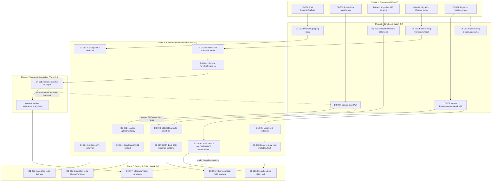

现在我已掌握充分的数据。以下是全面的技术主管分析：

---

# 技术主管分析：125 个 S3 协议扩展方向

## 代码锚点验证结果

在 `git HEAD` (`90add1a`) 上针对 5 个方向进行验证：

| # | 方向 | 验证状态 | 发现 |
|---|------|----------|------|
| 1 | ListObjects 分隔符 | ✅ 通过 | XML 结构体中 `CommonPrefixes` 字段缺失，handler 忽略 `delimiter`，SQL 无分组逻辑 |
| 2 | UploadPartCopy | ✅ 通过 | `uploadPartCopy` 方法不存在；`copyObject` 在内存中流式读取整个对象 |
| 3 | SSE 请求头 | ✅ 通过 | `PutOptions` 中无 SSE 字段；handler 不读取 SSE 请求头；INSERT 中无 `sse_algorithm` 列 |
| 4 | 存储分层 | ⚠️ 轻微偏移 | `RegisterStorageClassGauge` 位于第 192 行（非 181）；其余锚点均准确 |
| 5 | 对象锁合规 | ✅ 通过 | `hardDeleteObject` 不检查模式；`SetBucketObjectLock` 仅接收 `seconds int`；`getBucketObjectLock` 硬编码 `GOVERNANCE` |

---

## 1. 任务分解

以下任务结构依据**每次 commit 单个概念**、**函数 ≤50 行**、**文件 ≤500 行** 以及 **Git History 可追溯性**进行设计。

### 方向 1：ListObjects 分隔符 / CommonPrefixes

| 任务 ID | 标题 | 文件 | 前置依赖 | 工时 | 验收标准 |
|---------|------|------|----------|------|----------|
| **D1-001** | 向 XML 模型添加 `CommonPrefixes` | `internal/api/s3compat/xml.go` | 无 | 0.5h | `listBucketResult` 和 `listBucketResultV1` 均有 `CommonPrefixes []string \`xml:"CommonPrefixes,omitempty"\`` 字段 |
| **D1-002** | 应用层分隔符分组逻辑 | `internal/api/s3compat/handler.go` | D1-001 | 3h | `extractCommonPrefixes(keys []string, delimiter string) ([]string, []Object)` 函数；单元测试覆盖边界情况（空 delimiter、连续 delimiter、跨页边界） |
| **D1-003** | 带分隔符的 ListObjectsV2 | `internal/api/s3compat/handler.go` — `listObjectsV2` 重构 | D1-002 | 2h | 当 `delimiter` 非空时，将结果分为 `Contents`（直接子项）和 `CommonPrefixes`（虚拟目录）；token 分页能够跨越公共前缀 |
| **D1-004** | 带分隔符的 ListObjectsV1 | `internal/api/s3compat/handler.go` — `listObjectsV1` 重构 | D1-003 | 1h | V1 API（`GET ?prefix=&delimiter=&marker=`）产生与 V2 相同的分隔符行为，但使用 `Marker`/`NextMarker` |
| **D1-005** | 集成测试：分隔符场景 | `internal/api/s3compat/handler_test.go` | D1-003, D1-004 | 2h | 测试目录遍历（`aws s3 ls s3://bucket/photos/`）、跨页边界、空 delimiter、marker+delimiter 组合 |

**方向 1 总计：8.5 小时**

### 方向 2：UploadPartCopy

| 任务 ID | 标题 | 文件 | 前置依赖 | 工时 | 验收标准 |
|---------|------|------|----------|------|----------|
| **D2-001** | 向 `PutOptions` 添加 range 和 source 字段 | `internal/service/file.go` (+ `file_crud.go`) | 无 | 1h | `PutOptions` 获得 `CopySourceRange string` 和 `CopySourceIfMatch`/`CopySourceIfNoneMatch`/`CopySourceIfModifiedSince` 条件字段 |
| **D2-002** | 实现服务层 CopyPart | `internal/service/file_crud.go` — 新的 `CopyPart` 方法 | D2-001 | 3h | `CopyPart(ctx, tenant, dstBucket, dstKey, srcBucket, srcKey, rangeSpec, uploadID, partNumber)` — 从源读取字节范围，将 part 写入上传会话 |
| **D2-003** | S3 handler UploadPartCopy 分发 | `internal/api/s3compat/handler.go` — `PutObject` 中的新分支 + `uploadPartCopy` handler | D2-002 | 2h | `PUT /dst?partNumber=N&uploadId=UID` + `x-amz-copy-source` → `uploadPartCopy`；XML 响应使用 `CopyPartResult`（Etag + LastModified） |
| **D2-004** | 大于 5GB 对象的 CopyObject 回退 | `internal/api/s3compat/extra.go` — `copyObject` | D2-002 | 2h | 当 `src.Size > 5GB` 时，`copyObject` 自动切换到 multipart copy：发起 multipart upload → 5MB-5GB 的 UploadPartCopy → CompleteMultipartUpload |
| **D2-005** | 集成测试：CopyPart 和大型 copy | `internal/api/s3compat/handler_test.go` | D2-003, D2-004 | 3h | 测试：5MB part copy、跨 2 个 part 的 6MB copy、带版本的源、copy-source-range 边界（`bytes=0-0`，`bytes=-1024`） |

**方向 2 总计：11 小时**

### 方向 3：SSE 请求头（阶段 A+B）

| 任务 ID | 标题 | 文件 | 前置依赖 | 工时 | 验收标准 |
|---------|------|------|----------|------|----------|
| **D3-001** | 迁移：添加 `sse_algorithm` 和 `sse_kms_key_id` 列 | `internal/repository/migrations/{sqlite,postgres}/0025_sse_columns.{up,down}.sql` | 无 | 1h | `objects` 表新增 `sse_algorithm TEXT DEFAULT NULL`，`sse_kms_key_id TEXT DEFAULT NULL` |
| **D3-002** | 更新 `Object` 结构体和 `PutOptions` | `internal/repository/repository.go` + `internal/service/file.go` | D3-001 | 1h | `Object` 获得 `SSEAlgorithm`/`SSEKMSKeyID` 字段；`PutOptions` 获得相同的字段 |
| **D3-003** | SSE-S3 声明 + 桥接到本地加密 | `internal/api/s3compat/handler.go` + `internal/service/file_crud.go` | D3-002 | 3h | `x-amz-server-side-encryption: AES256` → 设置 `SSEAlgorithm="AES256"`，若已配置 `STORAGE_SSE_KEY` 则通过本地 SSE 加密；`aws:kms` → 返回 400 `InvalidArgument` |
| **D3-004** | GET/HEAD 响应中的 SSE 响应头 | `internal/api/s3compat/handler.go` — `writeObjectHeaders` 或等效函数 | D3-003 | 1h | `GetObject`/`HeadObject` 响应携带 `x-amz-server-side-encryption: AES256`（当对象被 SSE 保护时） |
| **D3-005** | SSE 请求头的集成测试 | `internal/api/s3compat/handler_test.go` | D3-003, D3-004 | 2h | PUT + `x-amz-server-side-encryption: AES256` → GET 验证响应头；PUT + `aws:kms` → 400；未配置 SSE 时的 PUT → 无加密 |

**方向 3 总计：8 小时**

### 方向 4：存储分层生命周期转换

| 任务 ID | 标题 | 文件 | 前置依赖 | 工时 | 验收标准 |
|---------|------|------|----------|------|----------|
| **D4-001** | 迁移：添加 `lifecycle_rules` JSON 列 | `internal/repository/migrations/{sqlite,postgres}/0025_lifecycle_transitions.{up,down}.sql` | 无 | 1h | `buckets` 表新增 `lifecycle_rules TEXT NOT NULL DEFAULT '[]'` |
| **D4-002** | 扩展 `BucketConfig` 和 Repository API | `internal/repository/repository.go` — 新的 `Transition` 结构体 + `SetBucketLifecycleRules`/`GetBucketLifecycleRules` | D4-001 | 2h | `BucketConfig` 获得 `LifecycleRules []LifecycleRule`，每个包含 `Transitions []Transition{AfterDays int, StorageClass string}` 和 `Expiration *ExpirationRule` |
| **D4-003** | 生命周期 XML：添加 `Transition` 模型 | `internal/api/s3compat/xml.go` — `lifecycleTransition` + `lifecycleRule` 更新 | D4-002 | 1h | `LifecycleConfiguration` XML 解析/序列化 `Transition` 元素 |
| **D4-004** | lifecycle PUT/GET handler 更新 | `internal/api/s3compat/bucketconfig.go` — `putBucketLifecycle`/`getBucketLifecycle` | D4-003 | 2h | GET `?lifecycle` 返回包含 Transition 元素的 XML；PUT `?lifecycle` 解析并存储 Transition 规则 |
| **D4-005** | 后台转换 Worker | `internal/reconcile/lifecycle.go` — 新的 `sweepTransitions` 方法 | D4-002 | 4h | `LifecycleJob` 获得 `sweepTransitions(ctx)`: (1) 查询符合条件的对象，(2) 更新 `storage_class`（同后端标记），(3) 对跨后端转换使用 `CopyPart` 流式复制，(4) 记录指标 |
| **D4-006** | Worker 注册 + 单例门控 | `internal/reconcile/lifecycle.go` — `Run` 方法中的 `sweepTransitions` | D4-005 | 1h | transition sweep 在 `Run` 循环中与 expire sweep 一同执行；受集群单例 `leaseLifecycleSweep` 门控 |
| **D4-007** | 转换集成测试 | `internal/reconcile/lifecycle_test.go` + `internal/api/s3compat/handler_test.go` | D4-005, D4-006 | 3h | 测试：同后端标记（STANDARD→STANDARD_IA→GLACIER）、跨后端流式复制、生命周期规则与对象锁的交互、已锁定对象不被转换 |

**方向 4 总计：14 小时**

### 方向 5：对象锁合规模式

| 任务 ID | 标题 | 文件 | 前置依赖 | 工时 | 验收标准 |
|---------|------|------|----------|------|----------|
| **D5-001** | 迁移：添加 `retention_mode` 和 `legal_hold` 列 | `internal/repository/migrations/{sqlite,postgres}/0025_retention_mode.{up,down}.sql` | 无 | 1h | `objects` 表新增 `retention_mode TEXT DEFAULT NULL`（`GOVERNANCE`/`COMPLIANCE`/NULL），`legal_hold BOOLEAN DEFAULT FALSE`；对已存在的 `locked_until` 行，`retention_mode` 默认设为 `'COMPLIANCE'` 以保持安全性 |
| **D5-002** | 更新 `Object` 结构体和 Repository | `internal/repository/repository.go` — `Object.RetentionMode` + `Object.LegalHold`；为 `SetLockedUntil` 添加 `mode` 参数 | D5-001 | 1h | `Object` 获得 `RetentionMode string` 和 `LegalHold bool` |
| **D5-003** | 扩展 `BucketConfig.ObjectLock` 为结构化配置 | `internal/repository/repository.go` — 新的 `ObjectLockConfig` 结构体；迁移：将 `ObjectLockSeconds int` 替换为 `ObjectLock ObjectLockConfig` | D5-001 | 2h | `BucketConfig` 获得 `ObjectLock *ObjectLockConfig`，包含 `Mode string`、`Days int`、`Years int` |
| **D5-004** | 施加 GOVERNANCE vs COMPLIANCE 区分 | `internal/service/file_crud.go` — `hardDeleteObject` + 新增 `DeleteObject` 路径 | D5-002 | 3h | COMPLIANCE：拒绝删除（任何用户）；GOVERNANCE：检查 `x-amz-bypass-governance-retention: true` 请求头并验证调用者权限，若授权则允许 |
| **D5-005** | Legal Hold 专用端点 | `internal/api/s3compat/handler.go` — `GET /{key}?legal-hold` + `PUT /{key}?legal-hold` | D5-002 | 2h | `GET ?legal-hold` → `<LegalHold><Status>ON|OFF</Status>`；`PUT ?legal-hold` 解析并持久化 legal hold XML |
| **D5-006** | 从 Handler 路径移除 metadata 中的 Legal Hold hack | `internal/api/s3compat/handler.go` — `PutObject` 中的 `_aero_legal_hold` → 使用结构化 `LegalHold` 字段 | D5-005 | 1h | Legal hold 不再存储为 metadata 键；读写均使用新列 |
| **D5-007** | 对象锁 S3 组合测试 | `internal/api/s3compat/handler_test.go` — `test_lock_compliance.go` | D5-004, D5-005, D5-006 | 3h | 测试：COMPLIANCE 锁定 → 强制删除拒绝；GOVERNANCE 锁定 → 绕过后删除成功；legal hold ON/OFF 切换；GET `?legal-hold` 响应 vs 预期的 XML |

**方向 5 总计：13 小时**

---

## 2. 执行顺序（任务依赖图）



### 可并行化的任务组

| 并行组 | 任务 | 原因 |
|---------|------|------|
| **组 A** | D1-001, D2-001, D3-001, D4-001, D5-001 | 均为数据模型变更——无代码冲突 |
| **组 B** | D1-002, D2-002, D3-002, D4-002, D5-002, D5-003 | 核心逻辑不共享公共接口 |
| **组 C** | D1-003, D2-003, D3-003, D4-003, D5-004, D5-005 | Handler 实现 — 各自独立 |
| **组 D** | D1-005, D2-005, D3-005, D4-007, D5-007 | 所有集成测试可并行执行 |

---

## 3. 技术风险

### 3.1 高影响风险

| # | 风险 | 方向 | 可能性 | 严重性 | 缓解措施 |
|---|------|------|--------|--------|----------|
| **R1** | 带 delimiter 的分页在跨公共前缀边界时行为不正确 | D1 | 中等 | 高 | 在 `extractCommonPrefixes` 中实现缓冲区（获取 `limit+N` 行，合并公共前缀，若公共前缀未完全使用则修正 NextMarker） |
| **R2** | UploadPartCopy 与 SSE 加密的副本交互 | D2, D3 | 高 | 高 | 先实现 D3-002/D3-003（PutOptions 中的 SSE 字段），安全解决后再进行 D2-003。加密对象的 CopyPart 必须传递加密参数 |
| **R3** | 生命周期转换期间服务重启 | D4 | 中等 | 高 | 使转换成为幂等操作：扫描时标记为 `transition_in_progress` 状态，重启后清理孤儿 |
| **R4** | COMPLIANCE 锁定数据的不可逆删除 | D5 | 低 | 严重 | 增加审计日志记录 COMPLIANCE 删除尝试；`hardDeleteObject` 中严格进行 `retention_mode == "COMPLIANCE"` 检查；为 COMPLIANCE 锁添加告警规则 |
| **R5** | SQLite vs Postgres 兼容性 | D1, D4 | 低 | 中等 | 对所有 SQL 迁移使用 `s.rebind`；在应用层（Go 代码）进行前缀分组，而非在 SQL 中使用特定于方言的字符串操作 |

### 3.2 外部依赖

| 依赖 | 用途 | 方向 |
|------|------|------|
| AWS SDK 行为（aws-cli、boto3）| 确定 delimiter 分页的实际行为 | D1 |
| AWS S3 multipart upload 语义 | 确定 `CopyPartResult` 响应 XML | D2 |
| 存储后端 CopyObject 支持 | 跨后端转换期间潜在的优化路径 | D4 |
| `STORAGE_SSE_KEY` 配置 | SSE-S3 桥接的前提条件 | D3 |

### 3.3 性能瓶颈

| 瓶颈 | 方向 | 分析 |
|------|------|------|
| 对于包含许多键的公共前缀，逐页重复扫描 | D1 | 在最坏情况下（100 万个对象分布在 1000 个前缀下），每页可能需要扫描多达 `limit+N` 行以填充单个公共前缀。使用缓冲区系数 `N = limit`（上限 2000 行/页） |
| 内存中流式传输整个对象用于 CopyObject 回退 | D2 | 5GB+ 对象。通过在使用 `copyObject` 时检测大小并尽早回退到 multipart 来缓解，而不是在内存中缓冲 |
| 低频转换：大量对象同时进入转换窗口 | D4 | 对 `ListEligibleForTransition` 查询使用基于游标的分页，限制为每轮 200 个对象。存储成本不一致是暂时的 |

### 3.4 测试难点

| 难点 | 方向 | 策略 |
|------|------|------|
| 正确性依赖于跨页边界的 S3 行为 | D1 | 使用确定性夹具：小前缀（2 个对象）、大前缀（2000 个对象）、max-keys=10 的边界情况 |
| 大于 5GB 的对象无法在标准测试中复制 | D2 | 使用 mock 对象（`FileService` 接口 + `storage` mock）进行单元测试；集成测试使用带有 stub 大对象的较小对象 |
| SSE-KMS 不可用 | D3 | 测试仅在 SSE-S3（AES256）模式下进行；KMS 返回 400 |
| 跨后端复制需要多个 Storage 后端 | D4 | 单元测试使用带有 2 个内存存储后端的 `storage.NewLocal`；集成测试需要 `make test-integration` |
| COMPLIANCE 锁的不可逆性使得测试难以回滚 | D5 | 每个测试创建一个新存储库（`t.TempDir()`）；在 COMPLIANCE 行为拒绝时测试删除；不要在不可逆删除后测试恢复 |

---

## 4. 资源评估

### 4.1 团队组成

| 角色 | 数量 | 职责 | 关键技能 |
|------|------|------|----------|
| **高级 Go 工程师** | 2 | 核心 handler/service 逻辑、SSE 集成、API 兼容性 | Go 1.25、S3 REST API 语义、存储安全 |
| **全栈 Go 工程师** | 1 | 后台 worker、生命周期转换、集成测试 | OTel 指标、后台编排 |
| **数据库工程师** | 1（兼职） | SQL 迁移审核、跨 SQLite/Postgres 兼容性 | SQLite + PostgreSQL、迁移模式 |
| **QA/测试工程师** | 1 | 集成测试、AWS SDK 互操作性测试、性能基准测试 | 测试自动化、AWS CLI/SDK |

**工期：** 6 周，2 个全职 Go 工程师 + 兼职支持

### 4.2 关键里程碑

| 里程碑 | 日期（从开始算起） | 可交付成果 |
|----------|-------------------|-------------|
| **M1：数据模型完成** | 第 1 周结束 | 5 对 SQL 迁移已应用；`repository.go` 和 `PutOptions` 中包含新字段；现有测试通过 |
| **M2：核心逻辑完成** | 第 3 周结束 | 分隔符分组、CopyPart、SSE 桥接、转换生命周期、GOVERNANCE/COMPLIANCE 均已实现且单元测试覆盖 |
| **M3：Handler + Worker 完成** | 第 4 周结束 | 所有 5 个方向的 S3 API 端点均已实现；转换 worker 在 LifecycleJob 中注册 |
| **M4：集成测试完成** | 第 5 周结束 | 完整的集成测试覆盖所有 5 个方向；AWS CLI 互操作性已验证 |
| **M5：发布准备** | 第 6 周结束 | `make check` 全部通过；文档已更新；CHANGELOG 已编写 |

### 4.3 阻塞点

| 阻塞点 | 方向 | 解决策略 |
|---------|------|----------|
| **方向 2 需要方向 3**（加密对象的 CopyPart 需要 SSE 字段） | D2 → D3 | 将 D3-001/D3-002 安排在 D2-002 之前。D2-002 可以在 `PutOptions` 上使用空 SSE 字段，但必须**设计**为接收它们 |
| **方向 4 转换引擎需要方向 2 CopyPart**（跨后端复制需要带范围的流式传输） | D4 → D2 | D4-005 的实现推迟到 D2-002 完成。同后端标记（STANDARD→STANDARD_IA）可以提前实现，无需 CopyPart |
| **方向 5 锁检查需要生命周期转换**（已锁定对象不得被转换） | D5 → D4 | D4-007 测试需要在 D5-004 之后。D4-005 worker 实现应包含对 `retention_mode` 的临时检查（若列存在且非空，则跳过） |

---

## 5. 质量保证

### 5.1 单元测试覆盖

| 包 | 覆盖目标 | 最低覆盖率（新增行） |
|----|---------|-------------------|
| `internal/service/` | `CopyPart`、`hardDeleteObject`（带 retention_mode）、PUT 路径中的 SSE 传播 | 90% |
| `internal/api/s3compat/` | `extractCommonPrefixes`、`uploadPartCopy` handler、生命周期 XML 序列化/反序列化、`getBucketObjectLock`/`putBucketObjectLock` 更新 | 85% |
| `internal/reconcile/` | `sweepTransitions`、`sweepExpired` 与 retention_mode 的交互、幂等转换标记 | 85% |

### 5.2 集成测试策略

| 测试套件 | 范围 | 执行 |
|----------|-------|-------|
| **S3 互操作层** | 完整的 PUT/GET/DELETE/LIST 流程，带 delimiter、SSE 头、multipart copy | `go test ./internal/api/s3compat/ -v -count=1` |
| **生命周期转换** | 同后端标记：STANDARD→STANDARD_IA→GLACIER；跨后端转换 | `go test ./internal/reconcile/ -v -count=1` |
| **对象锁** | COMPLIANCE 拒绝删除；GOVERNANCE 绕过 + 删除；legal hold 切换 | `go test ./internal/api/s3compat/ -run TestLock -v` |
| **AWS CLI 烟雾测试** | `aws s3 ls s3://bucket/photos/ --delimiter /`、`aws s3 cp large.iso s3://bucket/large.iso` | 手动/CI 可选 |

### 5.3 代码审查要点

| 审查重点 | 涉及方向 |
|-----------|----------|
| **SQL 迁移幂等性**：`CREATE TABLE IF NOT EXISTS` 或 `ALTER TABLE ADD COLUMN` 对回滚安全 | D3, D4, D5 |
| **Rebind 占位符唯一性**：迁移中的 `$N` 不得重复使用（规则 I1） | 全部 |
| **锁检查顺序**：`hardDeleteObject` 先检查 COMPLIANCE，再检查 GOVERNANCE，再检查 bypass 权限 | D5 |
| **CommonPrefixes 分页粘着性**：NextMarker 必须指向公共前缀之后的下一个键 | D1 |
| **SSE 头传递**：CopyObject + UploadPartCopy 必须传递 SSE-C 参数以支持未来的 SSE-C | D2, D3 |
| **回退降级**：Reranker 失败 → 原始排序；SSE-KMS 不可用 → 400 错误 | D3 |
| **生命周期原子性**：转换 worker 必须是幂等的，支持重启恢复 | D4 |

### 5.4 性能测试需求

| 场景 | 指标 | 阈值 | 方向 |
|------|--------|---------|------|
| 10 万对象，1000 个公共前缀，每页 1000 个对象 | ListObjectsV2 with delimiter `/` 响应时间 | < 200ms P95 | D1 |
| 6GB 对象的 CopyObject 回退 | 完成时间（跨本地后端） | < 2× 原始 GET+PUT 时间 | D2 |
| 10 万个对象的生命周期扫描 | `sweepTransitions` 每轮时间 | < 30 秒 | D4 |

---

## 6. 实施计划

### 甘特图概览（6 周工期，2 名工程师）

```mermaid
gantt
    title S3 协议深度——实施计划
    dateFormat  YYYY-MM-DD
    axisFormat  %b %d

    section 阶段 1：基础设施（第 1 周）
    D1-001 XML CommonPrefixes              :d1, a1, 1d
    D2-001 PutOptions range/source fields  :d2, a2, 1d
    D3-001 Migration SSE columns           :d3, a3, 1d
    D4-001 Migration lifecycle_rules       :d4, a4, 1d
    D5-001 Migration retention_mode        :d5, a5, 1d

    section 阶段 2：核心逻辑（第 2 周）
    D1-002 Delimiter grouping logic        :d1b, after a1, 2d
    D2-002 Service CopyPart                :d2b, after a2, 2d
    D3-002 Object/PutOptions SSE fields    :d3b, after a3, 1d
    D4-002 BucketConfig Transition model   :d4b, after a4, 2d
    D5-002 Object RetentionMode/LegalHold  :d5b, after a5, 1d
    D5-003 BucketConfig ObjectLock struct  :d5c, after a5, 2d

    section 阶段 3：Handler 实现（第 3-4 周）
    D1-003 ListObjectsV2 delimiter         :d1c, after d1b, 2d
    D2-003 Handler UploadPartCopy          :d2c, after d2b, 2d
    D3-003 SSE-S3 bridge handler           :d3c, after d3b, 2d
    D4-003 Lifecycle XML Transition model  :d4c, after d4b, 1d
    D5-004 GOVERNANCE vs COMPLIANCE        :d5d, after d5b, 2d

    D1-004 ListObjectsV1 delimiter         :d1d, after d1c, 1d
    D2-004 CopyObject >5GB fallback        :d2d, after d2c, 2d
    D3-004 SSE GET/HEAD response headers   :d3d, after d3c, 1d
    D4-004 Lifecycle PUT/GET handlers      :d4d, after d4c, 2d
    D5-005 Legal Hold endpoints            :d5e, after d5b, 2d

    section 阶段 4：后台 Worker（第 4-5 周）
    D4-005 Transition worker sweeper       :d4e, after d4d, 3d
    D4-006 Worker registration + singleton :d4f, after d4e, 1d

    section 阶段 5：集成测试与修复（第 5-6 周）
    D1-005 Delimiter integration tests     :d1e, after d1d, 2d
    D2-005 UploadPartCopy integration tests :d2e, after d2d, 3d
    D3-005 SSE integration tests           :d3e, after d3d, 2d
    D4-007 Transition integration tests    :d4g, after d4f, 3d
    D5-007 Object lock integration tests   :d5f, after d5d, 3d
    D5-006 Remove metadata hack            :d5g, after d5e, 1d

    section 阶段 6：发布（第 6 周）
    文档更新 + CHANGELOG                   :doc, after d5f d4g d3e d2e d1e, 2d
    make check 全绿                        :check, after doc, 1d
```

### 详细阶段描述

#### 阶段 1：基础设施搭建（第 1 周——5 天）

**目标：** 所有 5 个方向的数据模型和存储层变更均已到位且可逆。

- 工程师 A：D1-001, D2-001, D3-001
- 工程师 B：D4-001, D5-001

**验收：**
- `make check` 通过（迁移文件可降级；现有测试全部通过）
- 所有 5 对 SQL 迁移已应用并可回滚
- `repository.go` + `PutOptions` 中的新 Go 字段已编译

#### 阶段 2：核心逻辑（第 2 周——5 天）

**目标：** 所有纯逻辑组件已可用且单元测试覆盖。

- 工程师 A：D1-002（分隔符分组）+ D2-002（CopyPart 服务方法）
- 工程师 B：D3-002（SSE 字段）+ D4-002（转换模型）+ D5-002/D5-003（对象锁）

**验收：**
- `go test ./internal/service/...` 绿色通过
- `go test ./internal/repository/...` 绿色通过
- 没有新 handler 代码——仅服务层模型

#### 阶段 3：核心功能实现 + Handler（第 3-4 周——10 天）

**目标：** 所有 S3 API 端点可用。

- 工程师 A：D1-003 → D1-004（分隔符 handler）
- 工程师 A：D3-003 → D3-004（SSE handler）
- 工程师 B：D2-003 → D2-004（UploadPartCopy handler）
- 工程师 B：D4-003 → D4-004（生命周期 handler）
- 工程师 A/B（分叉）：D5-004（可执行检查）+ D5-005（Legal Hold 端点）

**第 3 周结束检查点：** 分隔符 LS、SSE 编排、CopyPart >5GB、生命周期 XML 输入/输出、锁检查分支。

**验收：**
- `curl "http://localhost:9090/s3/bucket?list-type=2&prefix=photos/&delimiter=/"` 返回 `CommonPrefixes`
- `aws s3 cp bigfile.iso s3://bucket/big.iso` >5GB 成功
- `PUT` + `x-amz-server-side-encryption: AES256` 在响应中回显该头
- `PUT /bucket?lifecycle` 接受含 `Transition` 元素的 XML

#### 阶段 4：集成测试和优化（第 5 周——5 天）

**目标：** 后台转换 worker（D4-005/D4-006）+ 全面集成测试。

- 工程师 A：D4-005 + D4-006（转换引擎 + Worker 注册）
- 工程师 B：所有集成测试：D1-005、D2-005、D3-005、D5-007

**关键交集：** D4-007（转换测试）在 D5-004 完成后运行，以验证已锁定对象的跳过逻辑。

#### 阶段 5：发布准备（第 6 周——5 天）

**目标：** 生产就绪。

- 文档：`docs/` 中每个方向的 API 变更
- CHANGELOG 条目
- OpenAPI 规范更新（如果 `docs/` 中有）
- 端到端 CI 验证：`make check` + 集成测试
- Grafana 仪表盘面板（可能）：按 storage_class 的 `storage.class_objects` 指标；`bypass_governance_events` 计数器

---

## 总结建议

### 排序建议

给予以下任务**最高优先级**，按顺序进行：

1. **D1-001→D1-005**（分隔符）——P0，影响所有 S3 用户，工程影响最小（~150 行）
2. **D5-001→D5-007**（对象锁合规）——P2 优先级，但安全影响高，为 D4 转换提供基础
3. **D2-001→D2-005**（UploadPartCopy）——P0，对大对象工作负载至关重要，依赖 D3 的 SSE 机制
4. **D3-001→D3-005**（SSE 请求头）——P1，安全，影响 D2 加密对象的复制
5. **D4-001→D4-007**（存储分层）——P1，工程量最大，依赖 D2/D5 基础

### 关键技术决策

| 决策 | 建议 | 理由 |
|--------|------------|--------|
| 分隔符分组位置 | **应用层**（Go）而非 SQL 层 | 避免 SQLite/Postgres 字符串函数差异；与现有基于 marker 的分页自然兼容 |
| CopyPart 策略 | **流式复用**现有 `FileService.Get` 带 range 参数 | 无需新的存储后端原语；保留加密、压缩和审计的统一路径 |
| SSE 实现路径 | **声明式（阶段 A）→ 桥接（阶段 B）** | 阶段 A 消除安全幻觉，仅需 ~50 行；阶段 B 增加实际保护的完整性 |
| 转换策略 | **同后端标记优先，跨后端流式复制次之** | 同后端标记是 O(1) 操作（更新一行 + 可选通知）；跨后端复制重用 CopyPart 引擎 |
| COMPLIANCE 默认 | **将现有 `LockedUntil` 对象隐式设为 COMPLIANCE** | 避免意外降级——当前锁定行为禁止所有删除，与 COMPLIANCE 语义匹配 |

### 需要立即关注的风险

1. **方向 2 阻塞方向 4：** CopyPart 是跨后端转换的前提条件。`D4-005`（转换 worker）必须有 `D2-002`（CopyPart 服务方法）才能进行跨后端复制。若 D2 延迟，D4 需限制为仅同后端标记。
2. **SSE-C 不可知：** 本设计不解决 SSE-C（客户提供密钥）。若路线图需要，D3 的架构应允许未来扩展 SSE-C 而无需改写 PUT/GET 路径。`PutOptions` 在 `SSEAlgorithm` 旁包含 `SSECustomerAlgorithm`/`SSECustomerKey`/`SSECustomerKeyMD5` 字段，但 D3-003 中尚未实现。
3. **生命周期转换测试设置：** 跨后端转换需要 2 个 `storage.Storage` 实例。`lifecycle_test.go` 需要重构以支持此设置，或仅限于同后端标记测试。
