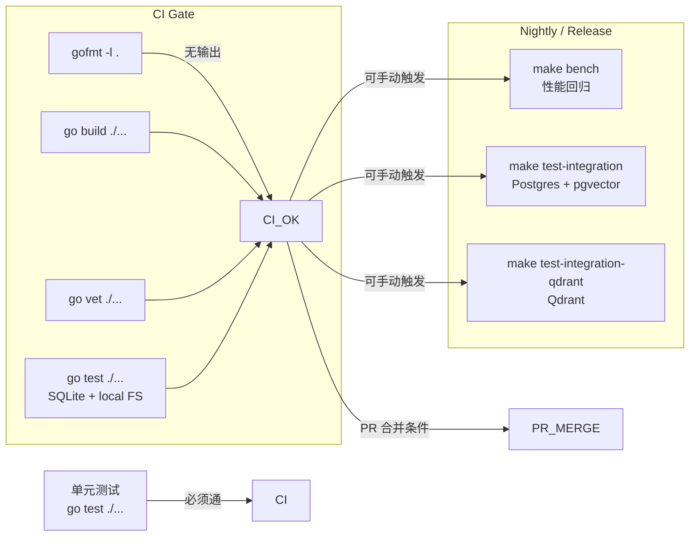
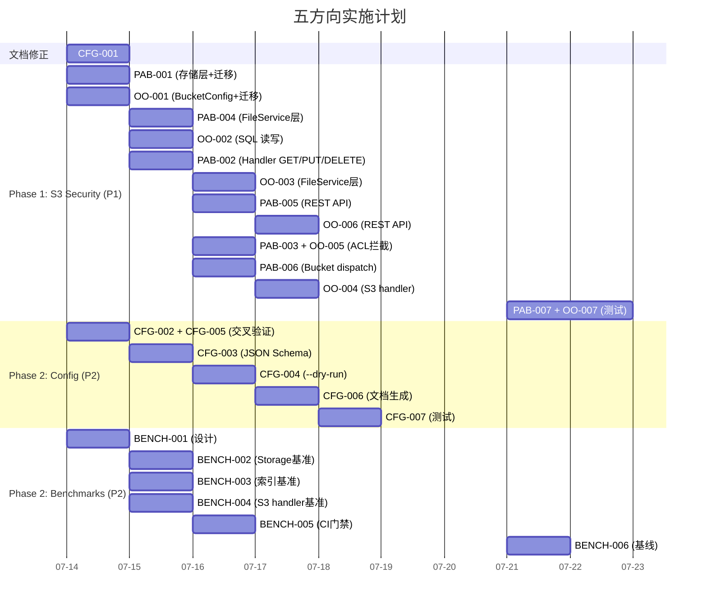

以下是我作为 Tech Lead 的完整分析报告。

---

# Tech Lead 分析报告：五方向技术债务评估与实施计划

## 执行摘要

本报告基于验证结论，对 5 个方向进行了任务分解、风险识别和资源评估。关键判断：

| 方向 | 优先级 | 技术风险 | 建议策略 |
|------|--------|---------|---------|
| **PublicAccessBlock** | P1 🔴 | 低风险，纯新增逻辑 | 立即排期，2-3天 |
| **Object Ownership** | P1 🔴 | 低风险，需 schema 变更 | 与 PAB 并行 |
| **性能基准测试** | P2 🟡 | 中风险，定义关键路径 | 缓启动，迭代建立 |
| **配置验证增强** | P2 🟡 | 低风险，增量改进 | 修正文档后实施 |
| **S3 Select** | P3 🟢 | 高风险，协议复杂 | 按需评估，暂不实施 |

---

## 1. 任务分解

### 1.1 方向一：S3 PublicAccessBlock（P1 — 数据泄露防护）

当前状倃：`x-amz-acl: public-read` 在 `PutObject`（handler.go:114-115）和 `createBucket`（handler.go:573-575）中被无条件接收，无任何阻止机制。

| 任务 ID | 标题 | 涉及文件 | 前置依赖 | 工时 |
|---------|------|---------|---------|------|
| **PAB-001** | 新增 `PublicAccessBlockConfig` 模型与存储层 | `internal/repository/repository.go`, `internal/repository/sql_buckets.go`, `migrations/{sqlite,postgres}/0025_public_access_block.{up,down}.sql` | 无 | 3h |
| **PAB-002** | 在 S3 handler 中实现 `GetPublicAccessBlock` / `PutPublicAccessBlock` / `DeletePublicAccessBlock` | `internal/api/s3compat/handler.go`, `internal/api/s3compat/bucketconfig.go`（或新建 `public_access_block.go`） | PAB-001 | 3h |
| **PAB-003** | 在 `PutObject` 和 `createBucket` 中增加 `x-amz-acl` 的 PAB 校验 | `internal/api/s3compat/handler.go`（约第114-115行和第573-575行） | PAB-002 | 2h |
| **PAB-004** | 在 `FileService` 层添加 `PublicAccessBlocked` 查询与缓存 | `internal/service/acl.go`（或新建 `public_access_block.go`） | PAB-001 | 2h |
| **PAB-005** | REST API 暴露 PublicAccessBlock 配置 | `internal/api/rest/router.go`, 新建 `internal/api/rest/public_access_block.go` | PAB-001 | 2h |
| **PAB-006** | 新增 `?publicAccessBlock` 子资源到 S3 bucket dispatch | `internal/api/s3compat/handler.go` → `dispatchBucketSubresource` | PAB-002 | 1h |
| **PAB-007** | 测试覆盖：单元 + S3 兼容性测试 | `internal/api/s3compat/handler_test.go`, `internal/repository/sql_buckets_test.go`, `internal/service/acl_test.go` | PAB-003, PAB-004 | 3h |

**估算总计：16h（2人天）**

### 1.2 方向二：S3 Object Ownership（P1 — S3 合规）

当前状态：`BucketConfig` 无 `ObjectOwnership` 字段；数据库无 `object_ownership` 列；`BucketOwnerEnforced` 模式完全缺失。

| 任务 ID | 标题 | 涉及文件 | 前置依赖 | 工时 |
|---------|------|---------|---------|------|
| **OO-001** | `BucketConfig` 增加 `ObjectOwnership` 字段 + 数据库迁移 | `internal/repository/repository.go`, `migrations/{sqlite,postgres}/0026_object_ownership.{up,down}.sql` | 无 | 2h |
| **OO-002** | 在 `GetBucketConfig` / 查询中读写 `object_ownership` | `internal/repository/sql_buckets.go` | OO-001 | 2h |
| **OO-003** | `FileService` 新增 `SetBucketOwnership` / `GetBucketOwnership` | `internal/service/bucket.go`（或新建 `ownership.go`） | OO-002 | 2h |
| **OO-004** | S3 handler：`?ownership` 子资源 GET/PUT | `internal/api/s3compat/bucketconfig.go` | OO-003 | 2h |
| **OO-005** | `BucketOwnerEnforced` 模式下阻止 `x-amz-acl` | `internal/api/s3compat/handler.go`（PutObject 和 createBucket 中的 ACL 写入点） | OO-004, PAB-003（可复用 ACL 拦截逻辑） | 2h |
| **OO-006** | REST API 暴露 ObjectOwnership | `internal/api/rest/router.go`, 新建 `internal/api/rest/ownership.go` | OO-003 | 1h |
| **OO-007** | 测试覆盖 | 各层对应测试文件 | OO-005 | 3h |

**估算总计：14h（约1.75人天）**

### 1.3 方向三：性能基准测试（P2 — 质量保障）

当前状态：零 `func Benchmark`，零 CI 门禁。

| 任务 ID | 标题 | 涉及文件 | 前置依赖 | 工时 |
|---------|------|---------|---------|------|
| **BENCH-001** | 确定关键性能路径并设计基准测试场景 | 文档产出 | 无 | 2h |
| **BENCH-002** | Storage 层基准：`local` 后端的 `Put` / `Get` / `Delete` 吞吐 | `internal/storage/local_test.go` | BENCH-001 | 2h |
| **BENCH-003** | 索引层基准：BM25 检索、向量检索延迟 | `internal/ai/search_test.go`, `internal/ai/embedder_test.go` | BENCH-001 | 2h |
| **BENCH-004** | S3 handler 端到端基准：多合一上传/下载 | `internal/api/s3compat/handler_bench_test.go`（新建） | BENCH-001 | 2h |
| **BENCH-005** | 在 Makefile 中添加 `bench` 目标和性能回归门禁 | `Makefile`, CI 配置 | BENCH-002, BENCH-003, BENCH-004 | 1h |
| **BENCH-006** | 定义基线值并集成到 CI 管道 | CI 配置（如 GitHub Actions） | BENCH-005 | 2h |

**估算总计：11h（约1.5人天）**

### 1.4 方向四：配置验证增强（P2 — 运维改进）

当前状态：已有 `Validate()` 方法，但不完善。优先修正验证报告中的不准确描述。

| 任务 ID | 标题 | 涉及文件 | 前置依赖 | 工时 |
|---------|------|---------|---------|------|
| **CFG-001** | 修正配置验证分析文档中的不准确描述 | 分析文档 | 无 | 1h |
| **CFG-002** | 新增交叉字段验证：`AI_INDEX_ENABLED && AI_EMBED_PROVIDER=""`、`AI_CHAT_PROVIDER && !AI_INDEX_ENABLED` 等 | `internal/config/config.go` → `Validate()` | 无 | 2h |
| **CFG-003** | 生成 `config.schema.json`（JSON Schema）用于部署时校验 | 新建 `deploy/config.schema.json`，从 `Config` 结构体反射生成 | 无 | 3h |
| **CFG-004** | 实现 `--dry-run` / `--validate` 模式，仅做配置校验后退出 | `cmd/server/main.go` | CFG-002 | 2h |
| **CFG-005** | 添加范围检查：端口范围、RPS 上限、超时合理性等 | `internal/config/config.go` → `validateRateLimits` 等 | 无 | 1h |
| **CFG-006** | 增加配置文档生成（Markdown 表） | `internal/config/config.go` → `PrintHelpTable()`, `deploy/config-help.sh` | 无 | 3h |
| **CFG-007** | 完善测试覆盖：新增交叉验证场景 | `internal/config/config_test.go` | CFG-002, CFG-005 | 2h |

**估算总计：14h（约1.75人天）**

### 1.5 方向五：S3 Select（P3 — 大数据集成）

当前状态：完全缺失，影响 Spark/Presto/Athena 集成。

| 任务 ID | 标题 | 涉及文件 | 前置依赖 | 工时 |
|---------|------|---------|---------|------|
| **S3S-001** | SQL 解析引擎选型与 PoC（sqlparser 库评估） | 文档产出，`go.mod` 新增依赖 | 无 | 4h |
| **S3S-002** | 实现 `SelectObjectContent` handler 框架（`?select` + `?select-type=2`） | `internal/api/s3compat/handler.go`, `internal/api/s3compat/select.go`（新建） | 无 | 4h |
| **S3S-003** | CSV/JSON 输入解析 + 列投影 | `internal/api/s3compat/select.go` | S3S-002 | 6h |
| **S3S-004** | SQL WHERE 子句过滤引擎 | `internal/api/s3compat/select.go` | S3S-001, S3S-003 | 8h |
| **S3S-005** | SSE 输出格式（记录/帧协议） | `internal/api/s3compat/select.go` | S3S-002 | 3h |
| **S3S-006** | S3 Select 集成测试 + 与大数据工具互操作性验证 | `internal/api/s3compat/select_test.go`, `internal/integration/` | S3S-005 | 6h |

**估算总计：31h（约4人天）**

> **决策建议：** S3 Select 实施成本高（31h+）、复杂度高、且错误解析可能导致安全漏洞。建议此项不做"现在实施"评估，而是 **标记为 backlog**，在有明确客户需求时启动。

---

## 2. 执行顺序与并行策略

### 2.1 任务依赖关系图

```mermaid
graph TD
    subgraph "Phase 1 (Week 1-2): S3 Security"
        PAB001[PAB-001: 存储层 + 迁移]
        PAB002[PAB-002: Handler GET/PUT/DELETE]
        PAB003[PAB-003: PutObject ACL 拦截]
        PAB004[PAB-004: FileService 层]
        PAB005[PAB-005: REST API]
        PAB006[PAB-006: Bucket dispatch]
        PAB007[PAB-007: 测试]

        OO001[OO-001: BucketConfig + 迁移]
        OO002[OO-002: SQL 读写]
        OO003[OO-003: FileService 层]
        OO004[OO-004: S3 handler]
        OO005[OO-005: BucketOwnerEnforced 拦截]
        OO006[OO-006: REST API]
        OO007[OO-007: 测试]

        PAB001 --> PAB002
        PAB002 --> PAB003
        PAB002 --> PAB006
        PAB001 --> PAB004
        PAB004 --> PAB005
        PAB003 --> PAB007
        PAB002 --> PAB007

        OO001 --> OO002
        OO002 --> OO003
        OO003 --> OO004
        OO003 --> OO006
        OO004 --> OO005
        OO005 --> OO007
    end

    subgraph "Phase 2 (Week 2-3): Config + Benchmarks"
        CFG002[CFG-002: 交叉验证]
        CFG003[CFG-003: JSON Schema]
        CFG004[CFG-004: --dry-run]
        CFG005[CFG-005: 范围检查]
        CFG006[CFG-006: 文档生成]
        CFG007[CFG-007: 测试]

        BENCH002[BENCH-002: Storage 层基准]
        BENCH003[BENCH-003: 索引层基准]
        BENCH004[BENCH-004: S3 handler 基准]
        BENCH005[BENCH-005: CI 门禁]
        BENCH006[BENCH-006: 基线]

        BENCH001[BENCH-001: 设计文档] --> BENCH002
        BENCH001 --> BENCH003
        BENCH001 --> BENCH004
        BENCH002 --> BENCH005
        BENCH003 --> BENCH005
        BENCH004 --> BENCH005
        BENCH005 --> BENCH006

        CFG002-->CFG007
        CFG005-->CFG007
    end

    subgraph "Blocked / Deferred"
        S3S001[S3S-001: SQL parser PoC]
        S3S002[S3S-002: Handler 框架]
        S3S003[S3S-003: CSV/JSON 解析]
        S3S004[S3S-004: WHERE 过滤]
        S3S005[S3S-005: SSE 输出]
        S3S006[S3S-006: 集成测试]

        S3S001-->S3S002
        S3S002-->S3S003
        S3S003-->S3S004
        S3S002-->S3S005
        S3S004-->S3S006
        S3S005-->S3S006
    end

    %% Cross-phase dependencies
    PAB003 -.->|复用 ACL 拦截逻辑| OO005
```

### 2.2 并行任务组

| 并行组 | 任务集合 | 前提条件 | 开发人员 |
|--------|---------|---------|---------|
| **Group A** | PAB-001 + OO-001（存储层 + DB 迁移） | 无 | 1人 |
| **Group B** | BENCH-001 + CFG-001 + CFG-003（设计/文档类） | 无 | 1人 |
| **Group C** | PAB-002~PAB-006 + OO-002~OO-006（Handler + Service 层） | Group A 完成 | 2人 |
| **Group D** | CFG-002 + CFG-005（验证逻辑） | 无 | 1人 |
| **Group E** | BENCH-002~BENCH-004（基准测试编写） | BENCH-001 完成 | 1人 |
| **Group F** | PAB-007 + OO-007 + CFG-007 + BENCH-005~006（测试 + CI） | Groups C/D/E 完成 | 2人 |

---

## 3. 技术风险分析

### 3.1 高风险项

| 风险 | 涉及方向 | 影响 | 缓解策略 |
|------|---------|------|---------|
| **ACL 拦截性能损耗** | P1 方向 | 每次 PutObject 多一次数据库查询 | 使用 bucket config 内存缓存（已存在 `GetBucketConfig`）；引入 LRU 缓存或带 TTL 的本地缓存 |
| **迁移回滚复杂度** | P1 方向 | `0025` 和 `0026` 迁移可能冲突 | 严格遵循 `down.sql` 完整回滚；Postgres 和 SQLite 同时测试 |
| **`--dry-run` 环境差异** | CFG 方向 | 开发/生产环境配置差异导致校验绕过 | 始终读取环境变量（而非假想值）；`--dry-run` 必须等价于 `Load()` + `Validate()` |
| **性能基线不稳定性** | BENCH 方向 | CI 环境噪声（CPU 争用、磁盘 I/O）导致误报 | 使用统计方法：运行 5 次取 p50/p90；设定±20% 告警阈值而非硬阻断 |
| **SQL 解析安全隐患** | S3S 方向 | 用户输入 SQL 注入到文件系统 | 使用带沙箱的 SQL parser（如 `pingcap/tidb/parser`），仅允许 SELECT；禁止子查询和 JOIN；设置解析超时 |

### 3.2 中等风险项

| 风险 | 涉及方向 | 缓解策略 |
|------|---------|---------|
| **PAB 与 Object Ownership 的交互逻辑** | P1 方向 | 当 `BucketOwnerEnforced=true` 时，`PublicAccessBlock.BlockPublicAcls` 冗余但无害；整体拒绝 `x-amz-acl` |
| **JSON Schema 与代码结构同步** | CFG 方向 | 通过 `go generate` + 模板自动生成，避免手动维护 |
| **基准测试增加 CI 耗时** | BENCH 方向 | 基准测试作为独立的 `make bench` 任务，不阻塞 `make check`；仅 nightly CI 运行性能回归 |

### 3.3 外部依赖评估

| 依赖 | 方向 | 必要性 | 替代方案 |
|------|------|--------|---------|
| SQL parser 库（如 `pingcap/tidb/parser`, `xwb1989/sqlparser`） | S3S | 必需 | 手写简单解析器（不推荐，成本和风险更高） |
| 反射 + 模板库（如 `alecthomas/jsonschema`） | CFG-003 | 可选 | 手写 JSON Schema |

---

## 4. 资源评估

### 4.1 团队配置

| 角色 | 技能要求 | 人数 | 负责任务 |
|------|---------|------|---------|
| **Go 后端工程师（高级）** | 熟悉 Go 1.25、S3 API 协议、数据库迁移模式 | 2人 | P1 方向（PAB + OO）+ CR 审查 |
| **Go 后端工程师（中级）** | 熟悉 Go、测试框架、CI 配置 | 1人 | BENCH + CFG 方向 |
| **SRE / 运维工程师（兼职）** | 熟悉 Docker、Prometheus、告警规则 | 0.5人 | BENCH-006 基线定义 + CI 管道 |

> **最佳配置：** 3 名全职开发（2 senior + 1 mid）+ 1 名兼职 SRE，共 3.5 FTE。

### 4.2 关键里程碑

| 里程碑 | 时间点 | 交付物 | 验收标准 |
|--------|-------|--------|---------|
| **M1: 存储层完成** | Day 3 | 迁移文件 + Repository 方法 | `go test ./internal/repository/` 全绿 |
| **M2: ACL 拦截上线** | Day 6 | PAB-003 + OO-005 合并 | `x-amz-acl: public-read` 被 `BlockPublicAcls=true` 拒绝；S3 兼容性测试通过 |
| **M3: 配置增强完成** | Day 8 | `--dry-run`、JSON Schema、交叉验证 | `make check` 全绿；`./aero-vault --dry-run` 合法退出码 |
| **M4: 基准测试基线** | Day 10 | 存储/索引/Handler 三项基准 | `make bench` 可重复执行，基线值记录到 `docs/benchmarks.md` |
| **M5: 全面回归门禁** | Day 12 | CI 含基准回归告警 | PR 中 `make check` + `make bench`（非阻塞）执行 |
| **M6: 文档修正** | Day 1 | 修正后的配置分析文档 | 不准确描述全部修正，补充已有验证能力说明 |

### 4.3 阻塞点（Blockers）

| 阻塞点 | 影响任务 | 解决策略 | 负责人 |
|--------|---------|---------|-------|
| 迁移编号冲突（PAB=0025, OO=0026 但需确认最新 migration） | PAB-001, OO-001 | 先读 `migrations/sqlite/` 和 `migrations/postgres/` 目录，取最大编号+1；**当前最大为 0024** | 开发人员 |
| PAB 与 OO 的拦截逻辑在 S3 handler 中可能冲突 | PAB-003, OO-005 | 提取 `shouldBlockACL(tenant, bucket) bool` 统一方法，同时检查 PAB 和 Ownership | Tech Lead |
| `dispatchBucketSubresource` 增长过快 | PAB-006 | 考虑将子资源 dispatch 拆分成独立文件（如 `subresource.go`），避免单个文件超 500 行 | 开发人员 |

---

## 5. 质量保证

### 5.1 单元测试覆盖要求

| 范围 | 要求覆盖率 | 关键测试场景 |
|------|-----------|-------------|
| `config.Validate()` | ≥ 90% | 合法配置、每种非法组合（5+ 场景）、边界值 |
| `repository` 新方法 | ≥ 85% | CRUD + 查询、NULL/空值、并发写入 |
| `service` 新方法 | ≥ 80% | `PublicAccessBlocked()` 真/假、`BucketOwnerEnforced()` 真/假、缓存穿透 |
| S3 handler | ≥ 70% | `Get/Put/DeletePublicAccessBlock`、ACL 被阻止/放行、`BucketOwnerEnforced` 下拒绝 |
| Storage 基准测试 | 可重复性 | 连续 5 次运行 p50 偏差 ≤ 15% |

### 5.2 集成测试策略

### 5.3 代码审查要点

| 审查项 | 审查人 | 注意点 |
|--------|-------|-------|
| **迁移双文件** | Senior | 两个方向（sqlite + postgres）的 up/down 是否配对、编号连续 |
| **I1 规则检查** | Senior | `$N` 占位符是否独立复用；时间格式是否为 `RFC3339Nano` |
| **I3 规则检查** | Senior | storageKey 生成是否保持 `path.Join` 模式，无反向解析 |
| **500 行限制** | Auto/Harness | 修改后的 `handler.go` 是否超过 500 行（当前已 890+ 行！需拆分） |
| **ACL 拦截逻辑** | All | `shouldBlockACL` 是否正确处理 PAB vs OO 优先级 |

### 5.4 性能测试需求

| 测试场景 | 度量指标 | 目标值 | 测试工具 |
|---------|---------|-------|---------|
| Storage Put (1KB object) | 吞吐 (ops/sec) | ≥ 10,000 | `go test -bench=BenchmarkStoragePut` |
| Storage Put (1MB object) | 吞吐 (ops/sec) | ≥ 500 | `go test -bench=BenchmarkStoragePutLarge` |
| BM25 检索（10K chunks） | p50/p99 延迟 | ≤ 5ms / ≤ 20ms | `go test -bench=BenchmarkSearchBM25` |
| Vector 检索（10K chunks） | p50/p99 延迟 | ≤ 10ms / ≤ 50ms | `go test -bench=BenchmarkSearchVector` |
| S3 PUT handler | 延迟 p50/p99 | ≤ 15ms / ≤ 100ms（local） | `go test -bench=BenchmarkS3Put` |
| S3 GET handler | 延迟 p50/p99 | ≤ 10ms / ≤ 50ms（local） | `go test -bench=BenchmarkS3Get` |

---

## 6. 实施计划

### 6.1 甘特图

### 6.2 各阶段汇总

| 阶段 | 时间范围 | 工作内容 | 人力投入 | 关键交付 |
|------|---------|---------|---------|---------|
| **Day 1** | 2026-07-14 | 文档修正 + 存储层 + 迁移 + 设计 + 基础验证 | 3人 | 修正后文档、0025+0026 迁移、BENCH 设计文档、CFG 交叉验证 |
| **Day 2-4** | 2026-07-15~17 | Handler/Service 实现 + Config 增强 | 3人 | PAB/OO Handler 实现、`--dry-run`、JSON Schema |
| **Day 5-7** | 2026-07-18~20 | ACL 拦截联调 + 基准测试编写 + 测试覆盖 | 3人 | ACL 拦截完成、Storage/索引/Handler 基准可运行 |
| **Day 8-10** | 2026-07-21~23 | 全面测试 + CI 门禁 + 集成测试 | 3人 | `make check` + `make bench` 回归门禁、新功能全绿 |

### 6.3 工时汇总

| 方向 | 估算工时 | 人力天（按8h） | 并行度 |
|------|---------|--------------|-------|
| PAB (P1) | 16h | 2 | 可并行1-2人 |
| Object Ownership (P1) | 14h | 1.75 | 可并行1-2人 |
| Benchmarks (P2) | 11h | 1.5 | 可并行1人 |
| Config (P2) | 14h | 1.75 | 可并行1人 |
| S3 Select (P3) | 31h | 4 | 推荐 backlog |
| **合计（不含 P3）** | **55h** | **~7 人天** | **3 人全职 → ~3 日历天** |
| **合计（含 P3）** | **86h** | **~11 人天** | **3 人全职 → ~5 日历天** |

---

## 7. 最终建议

### 立即实施（P1，第1优先级）
**S3 PublicAccessBlock + Object Ownership** 是两个互相独立但高度相关的安全功能。
- **建议分配 2 人并行开发**：一人负责 PAB（含迁移），另一人负责 OO（含迁移），两者在 Day 5 时合并 ACL 拦截逻辑。
- 合并后的 `shouldBlockACL()` 方法可放置于 `internal/service/acl.go`，同时查询两个条件。
- 当前 `handler.go` 已 890+ 行，**强烈建议**将 `dispatchBucketSubresource` 及所有子资源 handler 拆入 `bucketconfig.go`（已有部分）和新建 `public_access_block.go`，确保单个文件 ≤ 500 行。

### 本周启动（P2，第2优先级）
**Config 验证增强** 与代码库已有能力的偏差已修正，实施成本低（14h），运维收益高。可分配 1 人并行开发。

**性能基准测试** 是中长期质量基建。建议先由 1 人完成 BENCH-001 设计文档，然后在本周后半段开始编写基准代码。关键点：**不必追求完美的"真正性能"数据，先建立可重复的基准框架**，后期逐步迭代。

### 暂缓（P3）
**S3 Select** 实施成本高（31h+），协议复杂，且有 SQL 解析安全风险。标注为 backlog，在出现明确客户需求或大数据集成场景时重新评估。实施前需先完成 `go.mod` 依赖注入和 SQL parser PoC（4h 内可完成评估）。

### 关键提醒

1. **行号更新**：分析文档引用的行号（425-432, d499-510）需更新为当前代码（568, 384 等）
2. **handler.go 拆分**：当前 890+ 行，已超过 500 行限制。在实施过程中必须拆分
3. **迁移编号**：当前最大 migration 为 0024（bucket_notifications），PAB = 0025, OO = 0026
4. **`make check`**：每次 commit 前运行，确保不破坏 CI gate
