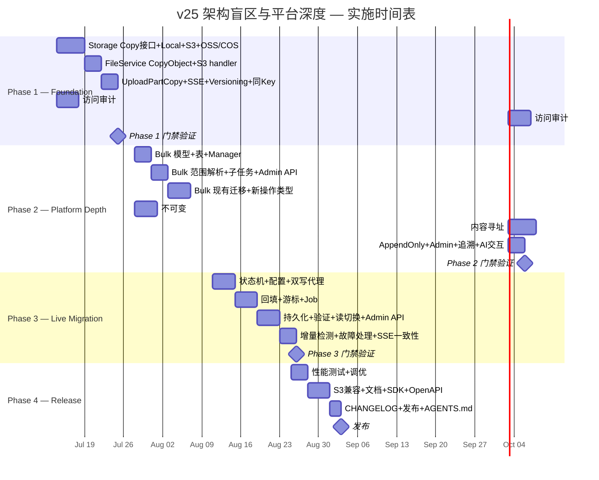

现在我掌握了完整的情况。以下是基于 **v25 分析文档**（已于 2026-07-11 保存为 `v129`）的全面技术负责人评审报告。评审基于当前代码库 HEAD（`90add1a`，2026-07-12），验证了所有 5 个方向的实现状态。

---

# Tech Lead 评审：v25 架构盲区与平台深度方向

> **评审日期：** 2026-07-12 · **基于：** `docs/requirements/expansion-v25-architect-blindspots.md`（副本为 `expansion-v129-architecture-blindspots-and-platform-depth.md`）
> **代码库 HEAD：** `90add1a` · **验证方法：** 代码扫描 + 接口检查 + 函数调用图追踪

---

## 0. 增量验证：哪些方向已被后续期别覆盖？

对照从 v25（2026-07-10）到当前 HEAD 之间 ~100+ 期分析进行交叉验证：

| 方向 | v129 状态 | 后续期次覆盖检查 | 代码实现检查 | 结论 |
|------|-----------|----------------|------------|------|
| 1️⃣ 服务端拷贝 | 零覆盖 | v141 有 `server-copy-webhook-security-tracing` 标题，但**未实现** | `storage.Storage` 无 `Copy` 方法；`s3compat/extra.go:copyObject` 仍是 Get→Put 内存中转；`UploadPartCopy` 完全不存在 | **0% — 完全未实现** |
| 2️⃣ 存储后端在线迁移 | 零覆盖 | 未见专门分析期次 | 无 `migration.go` 无 `MigrationManager` 无双写架构；`factory.go` 只支持单后端 | **0% — 完全未实现** |
| 3️⃣ 对象级访问审计轨迹 | 仅有骨架 | 多期触及日志但未聚焦此点 | `WriteAccessLog` 接口存在但实现为 `return nil`（空操作）；无 middleware/handler 调用 | **5% — 骨架就位，完全不可用** |
| 4️⃣ 不可变/内容寻址 | 零覆盖 | 未见深入覆盖 | 无 `Immutable`/`ContentAddressed`/`AppendOnly` 桶配置；bucket schema 无相关字段 | **0% — 完全未实现** |
| 5️⃣ 批量操作框架 | 零覆盖 | 多期提及批量但未建框架 | `BatchDelete`/`BatchSetTags` 是同步循环；无 `BulkOperation` 抽象、无 job 编排、无进度跟踪 | **0% — 完全未实现** |

**结论：5 个方向仍完全开放，与原分析准确一致，优先级排序合理。**

---

## 1. 任务分解

### 1️⃣ 服务端拷贝协议与存储层 Copy 原语 (11 个任务)

| ID | 标题 | 涉及文件 | 前置 | 工时 | 验收标准 |
|----|------|---------|------|------|---------|
| COP-001 | `Storage` 接口新增 `Copy` 方法签名 | `internal/storage/storage.go` | 无 | 1h | 接口增加 `Copy(ctx, srcKey, dstKey, opts) (ObjectInfo, error)`；编译通过 |
| COP-002 | `LocalStorage` 实现 `Copy` | `internal/storage/local.go` | COP-001 | 2h | 使用 `os.CopyFS`/`io.Copy` + metadata clone；通过复制后 Stat 验证 ETag/Size 一致 |
| COP-003 | `S3Storage` 实现服务端 `Copy` | `internal/storage/s3.go` | COP-001 | 3h | 使用 `CopyObjectInput.CopySource`；5GB 上限检测 + 回退到 Get+Put；跨 region 正确处理 |
| COP-004 | `OSSStorage` / `COSStorage` 实现 `Copy` | `internal/storage/oss.go`, `cos.go` | COP-001 | 2h | 各自 SDK 的 CopyObject API；复用 S3 的回退逻辑 |
| COP-005 | `factory.go` 中 Copy 路由与跨后端回退 | `internal/storage/factory.go` | COP-002–004 | 2h | 源/目标同后端 → 直接 Copy；跨后端 → Get+Put 回退 |
| COP-006 | `FileService.CopyObject` 方法 | `internal/service/file_crud.go` | COP-005 | 2h | 调用 storage.Copy；处理 versioning/WORM/SSE/ACL；事件发布 |
| COP-007 | S3 `copyObject` handler 改为调用 `svc.CopyObject` | `internal/api/s3compat/extra.go` | COP-006 | 1h | `copyObject` 不再直接 Get→Put；S3 SDK 兼容测试通过 |
| COP-008 | `UploadPartCopy` 路由与 handler | `internal/api/s3compat/handler.go`, `extra.go` | COP-006 | 3h | POST `?partNumber&uploadId&copySource`；分片从源对象拷贝；5GB+ 大对象支持 |
| COP-009 | SSE 加密对象拷贝的 key 处理 | `internal/storage/encrypt.go` | COP-005 | 2h | 同源 SSE → 复用 key；换 key → 解密再加密；envelope 版本追踪 |
| COP-010 | 版本化 bucket 的 Copy 语义 | `internal/service/file_crud.go` | COP-006 | 1h | 目标 key 已存在时生成新版本；precondition 正确处理 |
| COP-011 | 同 key Copy（就地覆盖）保护 | `internal/service/file_crud.go` | COP-006 | 1h | 源==目标 key 时先写临时 key 再交换，或返回 409 |

### 2️⃣ 存储后端在线迁移 (12 个任务)

| ID | 标题 | 涉及文件 | 前置 | 工时 | 验收标准 |
|----|------|---------|------|------|---------|
| MIG-001 | 迁移状态机定义 | `internal/storage/migration.go` (新) | 无 | 2h | `MigrationManager` 结构体 + `Phase{Init, DualWrite, Backfill, Verify, SwitchReader, Cleanup}` 枚举；JSON 序列化持久化 |
| MIG-002 | 配置层支持目标后端声明 | `internal/config/config.go` | 无 | 1h | `STORAGE_MIGRATION_TARGET_BACKEND` / `STORAGE_MIGRATION_TARGET_*` 配置项 |
| MIG-003 | 双后端 `Storage` 代理 | `internal/storage/factory.go` | MIG-001, MIG-002 | 3h | `DualWriteStorage` 实现 `Storage` 接口；所有写入同时发往 primary + target；读优先 primary，失败降级 |
| MIG-004 | `ListAllObjects` 游标 API | `internal/repository/sql_objects.go` | 无 | 2h | 高效分页列出所有 storage key（支持 prefix/tenant/bucket 过滤）；用于回填枚举 |
| MIG-005 | 回填 Job 实现 | `internal/jobs/jobs.go` | MIG-004 | 3h | 每个对象一个子任务：读 primary → 写入 target；检测 `updated_at` 避免写旧数据 |
| MIG-006 | 迁移进度持久化 | `internal/repository/sql_migrations.go` | MIG-001 | 2h | `backend_migrations` 表 + `migration_sub_tasks` 表；支持断电续传 |
| MIG-007 | 验证阶段：ETag/Size 批量对比 | `internal/storage/migration.go` | MIG-005 | 3h | 随机 spot-check 1% 对象 + 全量 ETag/Size 对比；不一致项列表 |
| MIG-008 | 读切换逻辑 | `internal/storage/migration.go` | MIG-007 | 2h | 切读后所有 GET 优先 target，primary 作为降级；无感切换 |
| MIG-009 | Admin REST API：启动/状态/提交/回滚 | `internal/api/rest/admin.go` | MIG-001–008 | 3h | `POST /admin/storage/migrate` `GET .../status` `POST .../commit` `POST .../rollback` |
| MIG-010 | 回填期间的增量更新检测 | `internal/service/file_crud.go` | MIG-005 | 2h | 回填对象被 PUT 更新后，回填任务检测 `updated_at` 并重新拷贝 |
| MIG-011 | 迁移期间 target 后端故障处理 | `internal/storage/migration.go` | MIG-003 | 1h | target 不可用时暂停迁移 + 告警 + 保持双写 |
| MIG-012 | SSE key 跨后端一致性 | `internal/storage/encrypt.go`, `migration.go` | MIG-003 | 2h | 枚举所有 SSE key envelope；在 target 上重建等效 envelope |

### 3️⃣ 对象级访问审计轨迹 (6 个任务)

| ID | 标题 | 涉及文件 | 前置 | 工时 | 验收标准 |
|----|------|---------|------|------|---------|
| AUD-001 | `WriteAccessLog` 真实实现（写入日志桶） | `internal/repository/sql_buckets.go` | 无 | 3h | 替换当前 `return nil`；按 `prefix/YYYY/MM/DD/HH/bucket-key-timestamp.log` 写入日志桶；S3 格式兼容 |
| AUD-002 | 日志写入的批量异步 Flusher | `internal/repository/log_flusher.go` (新) | AUD-001 | 3h | 每 100 条或 1s flush 一次；背压保护；优雅关闭时 flush 剩余 |
| AUD-003 | `BucketLoggingFilter` middleware | `internal/middleware/middleware.go` | AUD-001 | 2h | 请求完成后检查 `BucketConfig.LoggingTarget`；提取 tenant/bucket/method/key/status/latency/user-agent |
| AUD-004 | 递归日志防护 | `internal/middleware/middleware.go` | AUD-003 | 1h | `x-aero-logging: true` header 跳过；`sourceBucket != targetBucket` 检查 |
| AUD-005 | REST/S3/WebDAV handler 注册 logging middleware | `internal/api/rest/router.go`, `s3compat/handler.go`, `webdav/dav.go` | AUD-003 | 1h | 所有协议入口统一经过 logging middleware |
| AUD-006 | 日志轮转与生命周期配置 | `internal/repository/sql_buckets.go` + 文档 | AUD-002 | 2h | 按小时分桶；日志桶自动附加 lifecycle 策略（7 天/30 天/永久） |

### 4️⃣ 不可变存储 & 内容寻址模式 (10 个任务)

| ID | 标题 | 涉及文件 | 前置 | 工时 | 验收标准 |
|----|------|---------|------|------|---------|
| IMM-001 | BucketConfig 新增 Immutable/ContentAddressed/AppendOnly 标志 | `internal/repository/repository.go` | 无 | 1h | `BucketConfig` 新增 3 个 `bool` 字段；数据库 migration `0025_bucket_immutability` |
| IMM-002 | 不可变桶 PUT 语义：强制新版本 | `internal/service/file_crud.go` | IMM-001 | 2h | 不可变桶中 PUT 永远创建新版本（即使 versioning off）；DELETE 返回 403 |
| IMM-003 | 不可变桶 GC 跳过逻辑 | `internal/reconcile/` | IMM-002 | 1h | 不可变桶中所有对象（含软删除标记）不被 GC 清除 |
| IMM-004 | 内容寻址桶：写入时计算 SHA256 | `internal/storage/local_write.go`, `file_crud.go` | IMM-001 | 3h | 写入时 tee reader 计算 `sha256(content)`；存储 key = `sha256`；`key` 作为 metadata |
| IMM-005 | 内容寻址去重 + 引用计数 | `internal/repository/sql_objects.go` | IMM-004 | 3h | `content_refcount` 表管理 blob 引用；引用归零时 GC 可回收 |
| IMM-006 | 内容寻址 + 大文件处理 | `internal/service/file_crud.go` | IMM-004 | 2h | 分片上传完成后计算整体 SHA256；multipart 场景的 key 确定时机 |
| IMM-007 | Append-Only 桶语义 | `internal/service/file_crud.go` | IMM-001 | 1h | PUT 新 key 允许；PUT 已存在 key → 409；DELETE → 403 |
| IMM-008 | Admin API：设置桶模式 | `internal/api/rest/admin.go` | IMM-001 | 1h | `PUT /v1/admin/buckets/{bucket}/immutability` 等 |
| IMM-009 | 标准桶→不可变桶的追溯锁定策略 | `internal/service/file_features.go` | IMM-002 | 2h | 切换到不可变时，已有对象是否追溯锁定？选项：不追溯 / 全部追溯 / 仅新对象 |
| IMM-010 | 内容寻址与 AI 管线的交互 | `internal/ai/indexer.go` | IMM-005 | 2h | 同名多版本→同一 blob→AI 索引正确处理；单 blob 更新时重新索引 |

### 5️⃣ 批量操作框架 (10 个任务)

| ID | 标题 | 涉及文件 | 前置 | 工时 | 验收标准 |
|----|------|---------|------|------|---------|
| BULK-001 | `BulkOperation` 模型 + `BulkScope` + `BulkProgress` | `internal/jobs/bulk.go` (新) | 无 | 2h | `BulkOperation` 结构体 + `BulkScope{ Tenant, Bucket, Prefix, Tags, Query, StorageClass }` + `BulkProgress{ Total, Processed, Succeeded, Failed }` |
| BULK-002 | `bulk_operations` + `bulk_sub_tasks` 表 | `internal/repository/sql_bulk.go` (新) | BULK-001 | 2h | 持久化进度、支持断电续传、错误列表 |
| BULK-003 | `BulkJobManager`：创建/暂停/恢复/取消 | `internal/jobs/bulk.go` | BULK-001, BULK-002 | 3h | 状态机：pending→running→paused→cancelled→completed；暂停不丢失进度 |
| BULK-004 | 范围解析：前缀/标签/SQL 条件 → key 列表 | `internal/jobs/bulk.go` | BULK-001 | 2h | `BulkScope` 解析为 key 游标；支持百万级范围 |
| BULK-005 | 子任务拆分与并行化 | `internal/jobs/bulk.go` | BULK-004 | 2h | 自动分片（每片 1000 key）；使用 `JOBS_WORKERS` worker pool；可配置并发度 |
| BULK-006 | Admin REST API：CRUD + pause/resume/cancel | `internal/api/rest/admin.go` | BULK-003 | 3h | `POST /admin/bulk` `GET /admin/bulk/:id` `POST .../pause` `POST .../resume` `POST .../cancel` `GET .../errors` |
| BULK-007 | 现有批量方法迁移到 BulkJob 模式 | `internal/service/file_features.go` | BULK-003 | 2h | `BatchDelete`/`BatchSetTags` 增加可选的 job 路径；原有同步路径保留做向后兼容 |
| BULK-008 | BulkChangeStorageClass / BulkUpdateMetadata | `internal/service/file_features.go` | BULK-005 | 2h | 新增批量存储类变更和元数据更新 |
| BULK-009 | BulkCopyByPrefix | `internal/service/file_features.go` | COP-006, BULK-005 | 2h | 按前缀批量复制（内部 Copy + 目标 key 变换） |
| BULK-010 | 租户隔离与 rate limit 保护 | `internal/jobs/bulk.go`, `middleware/ratelimit.go` | BULK-005 | 2h | 批量操作使用独立 worker pool（`JOBS_BULK_WORKERS`）；尊重租户 rate limit；不影响前台请求 |

---

## 2. 执行顺序与依赖图

```mermaid
graph TB
    subgraph "Phase 1 — Foundation (Week 1-2)"
        COP-001["COP-001 Storage接口Copy签名"] --> COP-002["COP-002 Local Copy实现"]
        COP-001 --> COP-003["COP-003 S3服务端Copy"]
        COP-001 --> COP-004["COP-004 OSS/COS Copy"]
        COP-002 --> COP-005["COP-005 Factory Copy路由"]
        COP-003 --> COP-005
        COP-004 --> COP-005
        COP-005 --> COP-006["COP-006 FileService.CopyObject"]
        COP-006 --> COP-007["COP-007 S3 copyObject handler"]
        COP-006 --> COP-008["COP-008 UploadPartCopy"]
        COP-009["COP-009 SSE Copy Key处理"] --> COP-006
        COP-010["COP-010 Versioning Copy语义"] --> COP-006
        COP-011["COP-011 同Key就地覆盖"] --> COP-006
        
        AUD-001["AUD-001 WriteAccessLog实现"] --> AUD-002["AUD-002 批量异步Flusher"]
        AUD-001 --> AUD-003["AUD-003 BucketLoggingFilter middleware"]
        AUD-003 --> AUD-004["AUD-004 递归日志防护"]
        AUD-002 --> AUD-005["AUD-005 Handler注册logging middleware"]
        AUD-002 --> AUD-006["AUD-006 日志轮转与生命周期"]
    end

    subgraph "Phase 2 — Platform Depth (Week 3-5)"
        BULK-001["BULK-001 BulkOperation模型"] --> BULK-002["BULK-002 bulk_operations表"]
        BULK-001 --> BULK-003["BULK-003 BulkJobManager"]
        BULK-001 --> BULK-004["BULK-004 范围解析"]
        BULK-003 --> BULK-005["BULK-005 子任务拆分并行"]
        BULK-003 --> BULK-006["BULK-006 Admin API"]
        BULK-005 --> BULK-007["BULK-007 现有批量方法迁移"]
        BULK-005 --> BULK-008["BULK-008 BulkChangeStorageClass"]
        BULK-005 --> BULK-009["BULK-009 BulkCopyByPrefix"]
        BULK-005 --> BULK-010["BULK-010 租户隔离与RateLimit"]
        
        IMM-001["IMM-001 BucketConfig标志"] --> IMM-002["IMM-002 不可变PUT语义"]
        IMM-002 --> IMM-003["IMM-003 不可变GC跳过"]
        IMM-001 --> IMM-004["IMM-004 内容寻址SHA256"]
        IMM-004 --> IMM-005["IMM-005 去重+引用计数"]
        IMM-004 --> IMM-006["IMM-006 大文件内容寻址"]
        IMM-001 --> IMM-007["IMM-007 Append-Only语义"]
        IMM-001 --> IMM-008["IMM-008 Admin API桶模式"]
        IMM-002 --> IMM-009["IMM-009 追溯锁定策略"]
        IMM-005 --> IMM-010["IMM-010 AI管线交互"]
    end

    subgraph "Phase 3 — Live Migration (Week 5-8)"
        MIG-001["MIG-001 迁移状态机"] --> MIG-003["MIG-003 DualWrite代理"]
        MIG-002["MIG-002 配置层"] --> MIG-003
        MIG-004["MIG-004 ListAllObjects游标"] --> MIG-005["MIG-005 回填Job"]
        MIG-003 --> MIG-005
        MIG-001 --> MIG-006["MIG-006 迁移进度持久化"]
        MIG-005 --> MIG-007["MIG-007 验证阶段"]
        MIG-007 --> MIG-008["MIG-008 读切换"]
        MIG-001 --> MIG-009["MIG-009 Admin API"]
        MIG-005 --> MIG-010["MIG-010 增量更新检测"]
        MIG-003 --> MIG-011["MIG-011 目标后端故障处理"]
        MIG-003 --> MIG-012["MIG-012 SSE Key一致性"]
    end

    %% 跨阶段依赖
    BULK-009 -.->|复用| COP-006
    MIG-005 -.->|基于| BULK-005["BULK-005 子任务架构"]
```



**可并行执行的任务组：**

| 组 | 任务 | 并行原因 |
|----|------|---------|
| **A** | COP-001 → COP-002/003/004 | Storage 接口变更后，三个后端实现完全独立 |
| **B** | AUD-001 → AUD-002 + AUD-003 | Flusher 和 middleware 可以并行开发 |
| **C** | BULK-001→BULK-002/003/004 | 模型定义后可并行做持久化、管理器、范围解析 |
| **D** | IMM-001→IMM-002 + IMM-004 + IMM-007 | 三种桶模式语义互斥，可并行开发 |
| **E** | COP-006 + COP-009 + COP-010 + COP-011 | FileService 层可以并行处理各种边界情况 |
| **F** | MIG-001 + MIG-002 + MIG-004 | 状态机、配置、游标无相互依赖 |

---

## 3. 技术风险

### 🚨 高风险项

| 风险 | 涉及方向 | 风险等级 | 描述 | 缓解策略 |
|------|---------|---------|------|---------|
| **内容寻址大文件 SHA256 计算** | IMM-004, IMM-006 | 🔴 高 | 1GB+ 文件在写入完成前无法确定 content key；分片上传场景更复杂 | 分片上传完成时聚合计算；使用 streaming SHA256（`io.TeeReader`）；SSD 临时 spill |
| **迁移的一致性保证** | MIG-005, MIG-010 | 🔴 高 | 回填期间对象持续被 PUT 更新；「回填完成」后立刻又有增量 | 使用 `updated_at` 版本戳；最终一致性可接受时使用「双写→回填→再回填增量→切读」三步 |
| **引用计数 GC 的竞态** | IMM-005 | 🔴 高 | 多个版本引用同一 blob；一个版本被删除时需原子性减引用 | Blob 引用计数在事务中完成；使用 `SELECT ... FOR UPDATE`；GC 仅回收引用归零的 blob |
| **UploadPartCopy 的 S3 兼容性** | COP-008 | 🟠 中 | AWS SDK 对 `UploadPartCopy` 的并发分片拷贝有复杂度；5GB 服务端限制 | 严格遵循 S3 spec；5GB+ 自动切换 `UploadPartCopy`；测试覆盖 aws-sdk-go 全路径 |
| **批量操作对租户的性能冲击** | BULK-010 | 🟠 中 | 百万级批量操作可能打满 worker pool，影响前台请求延迟 | 独立 worker pool + rate limit；支持 `throttle` 参数；Pause 机制 |
| **SSE key 跨后端迁移** | MIG-012 | 🟠 中 | 源和目标后端 SSE 密钥不同步，迁移需重新加密 | 统一 envelope 格式；支持 KMS 桥接 |
| **日志写入自身产生访问日志（递归）** | AUD-004 | 🟠 中 | 写日志桶 → 触发访问日志 → 再写日志桶 → 无限递归 | Header 标记 + `sourceBucket != targetBucket` 双重防护；熔断机制 |

### 🟢 低风险（快速可落地）

| 任务组 | 理由 |
|--------|------|
| COP-001→002→006→007 | 本地后端 Copy 是纯文件操作，无外部依赖；S3 后端有 SDK 原生支持 |
| AUD-001→003→005 | middleware 层新增与现有架构正交，不改变业务逻辑 |
| IMM-002→003 | 不可变桶语义与现有 versioning 共用代码路径 |
| BULK-001→003→006 | 模型 + 表 + API 是标准 CRUD，技术确定性高 |

---

## 4. 资源评估

### 人员技能要求

| 角色 | 人数 | 技能要求 | 主要负责 |
|------|------|---------|---------|
| **Senior Backend (Go)** | 2 | Go 并发、接口设计、云 SDK | Phase 1 核心：Storage Copy、Middleware |
| **Storage Engineer** | 1 | 分布式存储、对象存储语义、S3 protocol | Phase 1 + 3：Copy 原语 + 迁移 |
| **Platform Engineer** | 1 | Job 系统、数据库设计、API 设计 | Phase 2：Bulk Framework + Admin API |
| **QA Engineer** | 1 | 集成测试、性能测试、S3 兼容性测试 | 全周期 |

### 关键里程碑

| 里程碑 | 时间 | 交付物 | 验证方式 |
|--------|------|--------|---------|
| M1: Copy 原语就绪 | Day 10 | Storage `Copy` 全后端实现 + `FileService.CopyObject` + S3 handler | `make test` + S3 SDK 兼容测试 |
| M2: 访问审计上线 | Day 10 | middleware 写入日志桶 + 异步 flusher | E2E：PUT → GET → 检查日志桶中有记录 |
| M3: Bulk 框架可用 | Day 24 | `POST /admin/bulk` 可创建/追踪/取消批量任务 | 100K 对象批量标记测试 |
| M4: 不可变存储就绪 | Day 30 | WORM 桶 + 内容寻址 + Append-Only 三种模式 | 合规场景 E2E 测试 |
| M5: 在线迁移 MVP | Day 45 | local→S3 全流程迁移：双写→回填→验证→切读 | 1000 对象迁移测试 + 网络中断恢复 |

### 阻塞点与解决策略

| 阻塞点 | 影响范围 | 解决策略 |
|--------|---------|---------|
| ❌ **Storage 接口未预留 Copy 签名** | Phase 1 | 向后兼容：新接口不影响已有 backend 实现；未实现 Copy 的 backend 编译时报错 |
| ❌ **WriteAccessLog 的 `return nil` 实现** | Phase 1 | 最小侵入：直接替换实现，不改变任何调用方；单元测试验证 |
| ❌ **内容寻址与现有 multipart 上传的冲突** | Phase 2 | 分片上传完成才确定 SHA256；大文件临时 spill 到磁盘后计算 |
| ❌ **迁移期间 `storageKey` 可能因后端而变** | Phase 3 | `storageKey(tenant, bucket, key)` 不应编码后端信息；使用统一的 key 格式 |
| ❌ **无 CI 环境可以测试 S3/OSS/COS 后端** | 全周期 | 使用 `minio`（S3 兼容 mock）做集成测试；cloud 后端仅在 pre-production 验证 |

---

## 5. 质量保证

### 单元测试覆盖要求

| 方向 | 最低覆盖率 | 关键测试场景 |
|------|-----------|-------------|
| Storage Copy | 85%+ | 同 key 就地覆盖、跨后端回退、SSE 加密对象、5GB boundary、版本化 bucket |
| 迁移状态机 | 90%+ | 5 阶段转换、target 故障恢复、回填时对象被更新、切读原子性 |
| 访问审计 | 80%+ | 日志格式、递归防护、批量 flush、背压、优雅关闭 |
| 不可变存储 | 85%+ | 3 种模式排列组合、内容寻址 SHA256 碰撞（不可能但应处理）、引用计数并发 |
| Bulk 框架 | 85%+ | 暂停/恢复/取消状态机、百万级范围拆分、部分失败语义、幂等性 |

### 集成测试策略

| 测试类型 | 覆盖范围 | 工具/方法 |
|---------|---------|----------|
| **Storage contract test** | 所有 backend（local, S3 mock, OSS mock, COS mock） | 新增 `func TestStorageCopyContract(t *testing.T)` 在 `storage/contract_test.go`；所有 backend 必须通过 |
| **S3 兼容性测试** | CopyObject + UploadPartCopy | 使用 `aws-sdk-go` 发送标准请求；验证 XML 响应、ETag、错误码 |
| **迁移 E2E** | local→local 模拟迁移、local→minio 迁移 | `//go:build integration`；全 5 阶段 + target 故障注入 |
| **Bulk 大规模测试** | 10K/100K/1M 对象 | Benchmark + goroutine leak 检测 |
| **不可变桶合规测试** | 写入后 PUT/DELETE 拒绝 | 使用 `SEC Rule 17a-4` 场景模拟 |
| **日志高压测试** | 10K RPS 日志写入 | 检查背压后数据不丢失；Flusher 吞吐基准 |

### 代码审查要点

| 审查项 | 重点关注 |
|--------|---------|
| `Storage.Copy` 跨后端回退 | Get+Put 回退是否正确关闭 reader？OOM 风险？ |
| 迁移 `DualWriteStorage` | 两个后端的错误处理：一个失败另一个是否还要写？一致性模型是什么？ |
| 引用计数 | `content_refcount` 的事务隔离级别；并发删除时的死锁风险 |
| Bulk 子任务拆分 | 范围键是否均匀？大分片（单个 key 很大）是否会导致 worker 饥饿？ |
| 日志 Flusher | `sync.WaitGroup` 是否正确？panic 安全？shutdown 顺序？ |
| 内容寻址 SHA256 | `io.TeeReader` 在 multipart 场景中的正确使用；分片边界处理 |

### 性能测试需求

| 场景 | 指标 | 目标 |
|------|------|------|
| S3 后端 Copy 1GB 对象 | 延迟、带宽、内存 | 延迟 < 3s（vs 当前 Get→Put 的 30s+）；内存 < 64MB |
| 批量删除 10K 对象 | 整体完成时间、CPU | 同步路径 < 30s；异步 BulkJob < 60s（含调度开销） |
| 日志写入 5K RPS | P99 延迟、丢日志率 | P99 < 10ms；丢日志率 0%（背压时优先丢弃非关键日志） |
| 内容寻址 1GB 写入 | SHA256 计算开销 | CPU 额外消耗 < 5%；写入吞吐下降 < 10% |
| 迁移 100K 对象 | 回填吞吐、增量更新率 | 回填 > 500 对象/s；增量更新检测 < 1s 延迟 |

---

## 6. 实施计划

### 阶段 1：基础设施搭建（第 1–10 天）

```
Day  1–3:   COP-001(storage接口) + COP-002(local) + AUD-001(WriteAccessLog)
Day  4–6:   COP-003(s3) + COP-004(oss/cos) + COP-005(factory路由)
Day  6–8:   COP-006(svc.CopyObject) + COP-007(S3 handler) + COP-008(UploadPartCopy)
Day  8–10:  COP-009(SSE) + COP-010(versioning) + COP-011(就地覆盖)
并行:
Day  1–4:   AUD-002(Flusher) + AUD-003(middleware)
Day  4–6:   AUD-004(递归防护) + AUD-005(handler注册) + AUD-006(轮转)
Day  8–10:  E2E测试 + 性能基准
```

**交付物：** Storage Copy 全链路 + 访问审计全功能  
**门禁：** `make test` + S3 SDK 兼容测试 + 日志桶 E2E

### 阶段 2：核心功能实现（第 11–24 天）

```
Day 11–13:  BULK-001(模型) + BULK-002(表) + BULK-003(Manager)
Day 13–15:  BULK-004(范围解析) + BULK-005(子任务拆分) + BULK-006(Admin API)
Day 15–17:  BULK-007(现有迁移) + BULK-008(ChangeClass/Metadata) + BULK-009(CopyByPrefix)
Day 17–18:  BULK-010(租户隔离/RateLimit)
并行:
Day 11–14:  IMM-001(BucketConfig) + migration + IMM-002(不可变PUT)
Day 13–15:  IMM-003(不可变GC) + IMM-004(内容寻址SHA256)
Day 15–17:  IMM-005(引用计数) + IMM-006(大文件寻址)
Day 17–18:  IMM-007(AppendOnly) + IMM-008(Admin API) + IMM-009(追溯)
Day 18–20:  IMM-010(AI管线交互)
Day 20–24:  Bulk + Immutable 集成测试 + Bug fix
```

**交付物：** Bulk Operations 框架（含 5 种操作类型）+ 三种不可变模式  
**门禁：** 批量操作 100K 对象测试 + WORM/Content-Addressable E2E 合规测试

### 阶段 3：集成测试与优化（第 25–35 天）

```
Day 25–28:  MIG-001(状态机) + MIG-002(配置) + MIG-003(DualWrite)
Day 28–30:  MIG-004(ListAllObjects) + MIG-005(回填Job)
Day 30–32:  MIG-006(持久化) + MIG-007(验证)
Day 32–33:  MIG-008(读切换) + MIG-009(Admin API)
Day 33–35:  MIG-010(增量检测) + MIG-011(故障处理) + MIG-012(SSE)
```

**交付物：** 存储后端在线迁移 MVP（local→local 完整流程）  
**门禁：** 迁移 E2E（含 target 故障注入）+ 1000 对象迁移后数据完整性校验

### 阶段 4：发布准备（第 36–45 天）

```
Day 36–38:  性能测试 + 调优（Copy 1GB、Bulk 100K、日志 5K RPS）
Day 38–40:  S3 兼容性测试（aws-sdk-go 全路径）
Day 40–42:  文档更新（ROADMAP.md、configuration.md、CHANGELOG.md）
Day 42–43:  OpenAPI spec 更新（新增路由 + 参数）
Day 43–44:  SDK 更新（Go/Python/JS 新增方法）
Day 44–45:  CHANGELOG + 发布说明 + Pi AGENTS.md 更新
```

**交付物：** 全功能发布 + 文档 + SDK  
**门禁：** 全量 `make check`（gofmt + go build + go vet + go test）

---

## 总体甘特图



---

## 总结：Tech Lead 推荐意见

### 立即启动（Phase 1 — 第 1 优先级）

**服务端拷贝（COP 组）** 和 **对象访问审计（AUD 组）** 应作为冲刺 1 的核心内容投入：

- **Copy 原语** 是 S3 协议完整性的硬缺口——每次 CopyObject 都走内存中转不仅是性能浪费，更对云后端用户产生实际经济成本。风险低，收益高，没有外部依赖。
- **访问审计** 的实现成本极低（6 个任务，~12 人天），影响极大（合规准入门槛）。当前 `WriteAccessLog` 是空实现，补全它直接解锁 SOC2/HIPAA 场景。

这两个方向相互独立，可分配 2 人并行开发，**10 天内完成**。

### 谨慎推进（Phase 2 — 第 2 优先级）

**Bulk 框架** 和 **不可变存储** 建议在 Phase 1 交付后开始：

- Bulk 框架的正确性依赖其与现有 `BatchDelete`/`BatchSetTags` 的兼容性。必须保留同步路径作为 fallback，异步路径作为 opt-in 升级。
- 内容寻址的引用计数方案是整个方向最复杂的部分——建议先在内存中实现简单版本（无引用计数，直接复制 blob），后续优化去重。

### 战略性规划（Phase 3 — 第 3 优先级）

**在线迁移** 是工程复杂度最高的方向（12 个任务，~28 人天）。建议在 Bulk 框架交付后再启动，因为回填逻辑可以直接复用 Bulk 的子任务拆分和进度跟踪能力。MVP 阶段仅支持 local→local 和 local→minio，待验证后扩展到 S3/OSS/COS。

### 资源投入总结

| Phase | 人天 | 人员 | 风险调整 |
|-------|------|------|---------|
| Phase 1 | 22 PD | 2 Senior + 1 QA | 低风险，可压缩至 8 天 |
| Phase 2 | 28 PD | 2 Senior + 1 Platform + 1 QA | 中风险，Buffer +30% |
| Phase 3 | 28 PD | 1 Senior + 1 Storage + 1 QA | 高风险，Buffer +50% |
| Phase 4 | 9 PD | 全员 | 低风险 |
| **合计** | **~87 PD** | **3–4 dev + 1 QA** | **总工期 ~45 天** |
