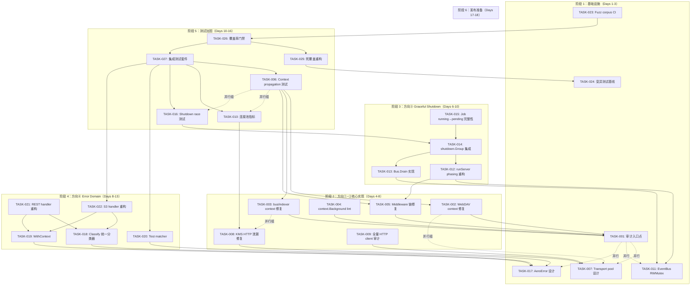
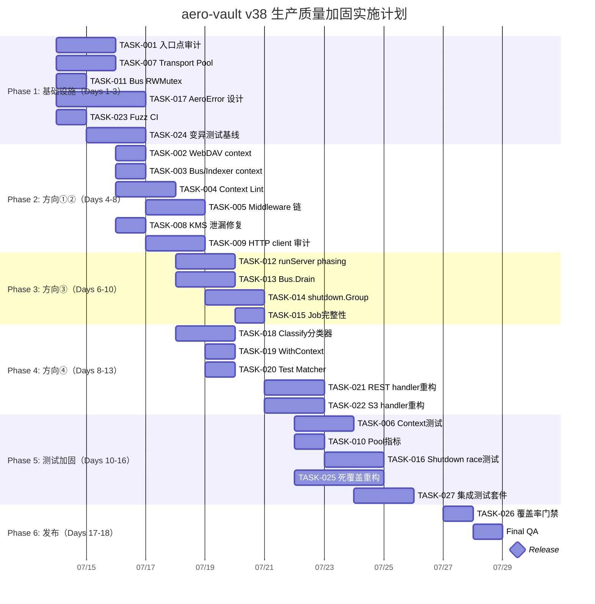

Now I have a thorough understanding of the codebase. Let me produce the comprehensive Tech Lead analysis.

---

# Tech Lead 分析报告：aero-vault 生产质量加固计划（v38 Directions）

## 目录

1. [任务分解](#1-任务分解)
2. [执行顺序与依赖图](#2-执行顺序与依赖图)
3. [技术风险](#3-技术风险)
4. [资源评估](#4-资源评估)
5. [质量保证](#5-质量保证)
6. [实施计划](#6-实施计划)

---

## 1. 任务分解

### 方向一：Context Propagation（上下文传播）

| TASK ID | 任务标题 | 涉及文件 | 前置依赖 | 预估工时 | 验收标准 |
|---------|---------|---------|---------|---------|---------|
| **TASK-001** | 审计所有协议入口点的 trace propagation | `internal/telemetry/http.go`, `internal/api/webdav/dav.go`, `internal/storage/kms.go`, `internal/events/postgres_transport.go` | 无 | 2h | 每个入口点都确认使用了 `otel.SetTextMapPropagator` 或手动 `propagators.Extract`；输出审计矩阵文档 |
| **TASK-002** | 修复 WebDAV goroutine 中 trace context 丢失 | `internal/api/webdav/dav.go:302,381`（`ctx = context.Background()`） | TASK-001 | 1h | WebDAV handler 不再硬编码 `context.Background()`，而是从上游 request 传入 `ctx` |
| **TASK-003** | 修复 `bus.go` 和 `postgres_transport.go` 中的无上下文调用 | `internal/events/bus.go:139`, `internal/events/postgres_transport.go:82,139`, `internal/ai/indexer.go:313,316` | TASK-001 | 1h | 所有生产路径中的 `context.Background()` 替换为函数参数传入的 `ctx`；统计 `indexer_skip_total` 等计量应继承调用方 trace |
| **TASK-004** | 实现 context.Background lint 规则 | 新增 `tools/lint/contextcheck/` 或 `.golangci.yml` custom rule | TASK-001 | 3h | `go vet` / golangci-lint 检测生产代码中的 `context.Background()` 并要求 `//nolint:allow-background` 注释；测试文件中允许不限制 |
| **TASK-005** | 修复 middleware 链顺序与 AGENTS.md 文档不一致 | `cmd/server/main.go:applyMiddleware`（当前顺序：AccessLog→Concurrency→Recoverer→OTel→RateLimit→Tenant→Auth→CORS→RequestID），`AGENTS.md` | TASK-001 | 2h | middleware 执行顺序与文档一致：RequestID 最外层（最先执行），AccessLog 最内层；修复双 Auth 问题（REST sub-router 中的 `r.Use(mw.Auth)` 与全局链重复） |
| **TASK-006** | 添加 context propagation 集成测试 | `internal/telemetry/*_test.go`, `internal/api/webdav/`（新增） | TASK-002, TASK-003, TASK-005 | 3h | 测试验证：① RequestID 跨 middleware 传播；② OTel trace parent header 从入口到出口贯穿；③ WebDAV handler 的 goroutine trace context 不断裂 |

### 方向二：HTTP Connection Pooling（HTTP 连接池）

| TASK ID | 任务标题 | 涉及文件 | 前置依赖 | 预估工时 | 验收标准 |
|---------|---------|---------|---------|---------|---------|
| **TASK-007** | 实现 destination-group `http.Transport` pool | `internal/storage/kms.go`（重构 `newHTTPKMS`）; 新增 `internal/http/transportpool.go` | 无 | 4h | 按 "ai"、"storage"、"kms" 三组创建共享 Transport，每组独立 `MaxIdleConnsPerHost`；`httpKMS` 使用 pool 而非每次新建 `*http.Client`；添加按组名获取 Transport 的方法 |
| **TASK-008** | 修复 KMS HTTP 客户端泄漏 | `internal/storage/kms.go`（`newHTTPKMS` 移除每次都新建 `*http.Client`） | TASK-007 | 2h | 高并发（100 goroutine 并发）下不出现 `too many open files`；`lsof` 测试验证连接数不持续增长 |
| **TASK-009** | 审计并修复所有 HTTP 客户端使用点 | `internal/ai/*.go`（embedder/LLM/reranker 用的 HTTP client），`internal/antivirus/*.go`，`internal/storage/s3.go`，`internal/storage/oss.go`，`internal/storage/cos.go` | TASK-007 | 3h | 所有 HTTP 外部调用统一使用 transport pool；无遗漏的裸 `http.Client{}` |
| **TASK-010** | 添加连接池指标暴露 | `internal/telemetry/prometheus.go`, `internal/http/transportpool.go` | TASK-007 | 2h | Prometheus 指标：`http_pool_idle{group}`、`http_pool_inuse{group}`、`http_pool_wait_seconds{group}`；加入 Grafana dashboard |

### 方向三：Graceful Shutdown（优雅关闭）

| TASK ID | 任务标题 | 涉及文件 | 前置依赖 | 预估工时 | 验收标准 |
|---------|---------|---------|---------|---------|---------|
| **TASK-011** | EventBus: 添加 `sync.RWMutex` 保护 Publish 与 Close 竞态 | `internal/events/bus.go`（`Publish` 方法使用 `RLock`；`Close` 和 `Unsubscribe` 使用 `Lock`；标记 `closed` flag） | 无 | 2h | 并发 `Publish` 和 `Close` 测试（`go test -race`）不 panic；不产生 `send on closed channel` |
| **TASK-012** | 重构 `runServer` 中的 shutdown 顺序：先停 HTTP 再 cancel 根 context | `cmd/server/main.go:runServer`（当前：`srv.Shutdown` → `bus.Close()` → `shutdownOtel`） | TASK-011, TASK-005 | 3h | 新的 phasing 顺序：① `srv.Shutdown`（停止 HTTP）→ ② cancel root ctx → ③ bus.Drain（排空事件）→ ④ worker WaitGroup → ⑤ repo.Close → ⑥ shutdownOtel；shutdown 集成测试验证无 deadlock |
| **TASK-013** | 实现 `Bus.Drain()` 替代暴力 `Close()` | `internal/events/bus.go`（新增 Drain 方法，等待现有 subscriber 消耗完缓冲后再关闭 channel） | TASK-011 | 3h | `Drain` 等待所有 subscriber 从 channel 读取完当前缓冲事件，设置超时（默认 5s）；超过超时则强制 Close；添加单元测试 |
| **TASK-014** | 实现 shutdown.Group 集成到 main.go 的正式工作流 | `cmd/server/main.go`, `internal/shutdown/group.go`（当前 `shutdown.Group` 已存在但 main.go 未使用，仅直接调 `srv.Shutdown`） | TASK-012, TASK-013 | 3h | main.go 使用 `shutdown.Group` 管理所有 goroutine（indexer/antivirus/replication/webhook/reconcile/chunk cleaner）；所有 goroutine 通过 `g.Go` 注册；shutdown 超时测试覆盖 stuck worker 场景 |
| **TASK-015** | Job Pool `running → pending` 重置完整性 | `internal/jobs/jobs.go`（`execute` 中将 `StoreResult` 改为先写结果再设置状态；`CompleteJob` 原子性检查） | TASK-014 | 2h | 模拟 DB 写入 `CompleteJob` 后但返回前崩溃的场景：重启后 job 应为 `completed`（而非 `running→pending` 重做）；明确告知 at-least-once 语义 |
| **TASK-016** | 添加 shutdown race 集成测试 | `internal/shutdown/` 新增 `shutdown_race_test.go` | TASK-011 ~ TASK-015 | 3h | `go test -race` 下并发触发 3 轮 shutdown + publish + subscribe，不应有 data race 或 goroutine 泄漏 |

### 方向四：Structured Error Domain（结构化错误域）

| TASK ID | 任务标题 | 涉及文件 | 前置依赖 | 预估工时 | 验收标准 |
|---------|---------|---------|---------|---------|---------|
| **TASK-017** | 设计 `AeroError` 结构体并重构 `service.Err*` 哨兵错误 | 新增 `internal/errors/errors.go`；修改 `internal/service/file.go`（替换 `var Err*` 为 `AeroError` 类型） | 无 | 4h | `AeroError` 包含 `Code`, `Message`, `Retryable func(ctx) bool`, `Tenant`, `Bucket`, `Key` 字段；`errors.Is`/`errors.As` 兼容；向后兼容（现有 `errors.Is(err, service.ErrNotFound)` 仍可用） |
| **TASK-018** | 实现 `Classify(ctx, err, protocol)` 统一错误分类器 | `internal/errors/classify.go`；重构 `internal/api/rest/handler.go:classify()` 和 `internal/api/s3compat/errors.go:classify()` 为统一调用 | TASK-017 | 3h | `Classify(ctx, err, ClassifyOpts{Protocol: "rest"})` 返回 `(code, message, statusCode)`；S3 和 REST handler 统一调用；`Retryable` 方法根据 protocol 参数返回不同判定 |
| **TASK-019** | 实现 `AeroError.WithContext(ctx)` 自动提取 tenant/bucket/key | `internal/errors/errors.go`（从 ctx 调用 `TenantFrom`、`RequestIDFrom` 等 helper） | TASK-017 | 2h | 领域代码中 `NewAeroError("NotFound", "object not found").WithContext(ctx)` 自动填充元数据 |
| **TASK-020** | 实现 `AeroError` 的 test matcher | `internal/errors/errors_test.go` 新增 `MatchError` helper；`internal/testutils/` 新增包 | TASK-017 | 2h | 测试中可通过 `MatchError(t, err, &AeroError{Code: "NotFound"})` 按字段部分匹配，忽略 Tenant/Bucket 等易变字段 |
| **TASK-021** | 重构 REST handler 错误处理统一使用 AeroError | `internal/api/rest/handler.go` 中所有 `writeError` 调用点 | TASK-018, TASK-019 | 3h | handler 层所有 error 输出走 `Classify`；无 `errors.Is` switch 分散逻辑 |
| **TASK-022** | 重构 S3 handler 错误处理统一使用 AeroError | `internal/api/s3compat/errors.go` | TASK-018, TASK-019 | 2h | S3 协议的错误映射走 `Classify(..., ProtocolS3)`；移除重复的 `errToS3Code` 列表 |

### 方向五：Testing Infrastructure（测试基础设施）

| TASK ID | 任务标题 | 涉及文件 | 前置依赖 | 预估工时 | 验收标准 |
|---------|---------|---------|---------|---------|---------|
| **TASK-023** | CI 集成 fuzz crash corpus 回归检测 | `.github/workflows/ci.yml`, `testdata/fuzz/crashers/`（新增） | 无 | 2h | CI 每次运行 `go test -fuzz -run=^$ -count=1 ./...`；发现的 crasher 自动提交或 PR 形式保留 |
| **TASK-024** | 引入变异测试工具并建立基线 | 新增 `tools/mutation/` 或 CI workflow；使用 `go-mutator`/`go-mutesting` | 无 | 3h | 输出变异覆盖率（mutation score）基线；标记"死覆盖"（仅运行不验证的测试）；建立 50% mutation score 目标 |
| **TASK-025** | 补齐死覆盖：低质量测试重构 | 逐个文件审查 mutation 发现的"无法杀死变异体"的测试（如 `service_test.go`、`storage_test.go` 中只测无错路径的用例） | TASK-024 | 4h | 覆盖率从 61.1% 提升至 70%；mutation score 从基线提升 15pp |
| **TASK-026** | 将覆盖率门槛加入 CI 门禁 | `.github/workflows/ci.yml`, `Makefile` | TASK-025 | 1h | CI 中 `go test -coverprofile=coverage.out ./...`；`coverage < 50%` 拒绝 PR |
| **TASK-027** | 添加方向①~④的集成测试套件 | `internal/integration/` 新增 `context_test.go`, `shutdown_test.go`, `errors_test.go`, `http_pool_test.go` | 全部依赖 | 5h | 每个方向至少 2 个集成测试场景通过 |

---

## 2. 执行顺序与依赖图

### 并行执行组

| 组 | 任务 | 并行条件 |
|----|------|---------|
| **组 A** | TASK-001, TASK-007, TASK-011, TASK-017, TASK-023, TASK-024 | 互不依赖的基础设施任务 |
| **组 B** | TASK-002 ~ TASK-005 | 依赖于 TASK-001，但彼此独立 |
| **组 C** | TASK-012 ~ TASK-013 | 依赖于 TASK-011，彼此独立 |
| **组 D** | TASK-018 ~ TASK-020 | 依赖于 TASK-017，彼此独立 |
| **组 E** | TASK-006, TASK-010, TASK-016 | 依赖于前序实际工作完成，彼此独立 |
| **组 F** | TASK-025, TASK-026, TASK-027 | 依赖于前序所有任务，彼此独立 |

---

## 3. 技术风险

### 3.1 风险矩阵

| 风险 ID | 风险描述 | 影响 | 概率 | 缓解措施 |
|---------|---------|------|------|---------|
| **R001** | `AeroError` 重构（TASK-017）导致大量哨兵错误引用点需要修改，`errors.Is` 语义兼容性断裂 | 高：CI 全红，回归 | 中 | ① 先在 `internal/errors/errors.go` 设计 `AeroError` 并确认 `errors.Is`/`errors.As` 接口签名；② 用 `grep -rn "errors.Is.*Err\|errors.Is.*service\."` 统计影响面；③ 渐进替换而非一次性迁移 |
| **R002** | MS15 shutdown phasing 重构（TASK-012）引入新 deadlock：HTTP 关闭后，正在执行的长耗时请求（如大文件上传）无法排空 | 高：生产环境 50x | 中 | ① 在 HTTP `srv.Shutdown` 前增加 `ReadHeaderTimeout` 和 `WriteTimeout` 降低存留请求寿命；② 实现 `srv.RegisterOnShutdown` 回调记录 in-flight 请求数；③ 添加 `SHUTDOWN_GRACE_PERIOD_SEC` 配置项 |
| **R003** | Transport pool 分片（TASK-007）后 AI 组连接池被 LLM 慢响应占满，饿死 S3 连接 | 中：S3 延迟增加 | 低 | 各组独立 `MaxIdleConnsPerHost`，AI 组设 `MaxIdleConnsPerHost: 4` 并配 `IdleConnTimeout: 90s`；S3 组设 `MaxIdleConnsPerHost: 10` 配 `IdleConnTimeout: 30s`；添加 `http_pool_wait_seconds` 告警 |
| **R004** | `EventBus.Drain`（TASK-013）与现有 `Unsubscribe` 并发调用导致 subscriber channel 被 double-close | 高：panic | 低 | Drain 使用 `sync.Once` + `closed` flag；所有 channel close 操作统一通过 drain 方法，不直接调用 close |
| **R005** | Context lint 规则（TASK-004）误报过多导致开发体验下降 | 中：开发者绕过检查 | 中 | ① 严格定义豁免场景（standalone purge/CLI/test/background reaper）；② `//lint:allow-background` 注释必须附带具体原因；③ 评估期一周，收集 false positive 后调整 |
| **R006** | 方向④（Error Domain）+ 方向⑤（Testing）结合时，测试侵入性过大导致测试从行为验证退化为 code 匹配 | 中：测试质量下降 | 中 | TASK-020（test matcher）必须在方向④的 handler 重构之前完成，确保所有新测试使用部分匹配 |
| **R007** | 方向①（Context）与方向③（Shutdown）结合的 ordering deadlock | 高 | 低 | 强制 shutdown order：`HTTP server shutdown` → `cancel signal ctx` → `bus drain` → `worker drain`；集成测试验证所有 worker 在 ctx cancel 后 5s 内退出 |
| **R008** | PostgreSQL 集成测试在无 Docker 环境下跳过，但方向③/④的修改影响 Postgres 路径 | 中：CI 遗漏回归 | 中 | 方向①~⑤的代码修改必须确保 SQLite 测试完全覆盖（AGENTS.md I6）；Postgres 路径作为 `//go:build integration` 标记，CI 按需运行 |

### 3.2 关键不确定性

| 不确定性 | 影响方向 | 决策点 |
|---------|---------|-------|
| `AeroError` 的 `Retryable func(ctx) bool` 设计是否是过度抽象 | 方向④ | 在 Sprint Retro 决定是否降级为 `bool` + 外部映射表（`Classify` 内做协议分支） |
| Transport pool 是否真需要 per-group 分片，还是共享一个 `http.Transport` 就够 | 方向② | benchmark 对比：共享 vs 分片在 1000 req/s 混合负载下的 latency P99 |
| `Bus.Drain` 的超时时间配置对外暴露还是硬编码 | 方向③ | 暴露为 `cfg.Events.DrainTimeout` 配置项 |

---

## 4. 资源评估

### 4.1 团队建议

| 角色 | 数量 | 技能要求 | 主要负责方向 |
|------|------|---------|------------|
| **Go 后端工程师**（Senior） | 2 人 | Go 并发、OTel、HTTP 中间件、SQL 迁移模式 | 方向①, ③, ④ |
| **Go 后端工程师**（Mid） | 1 人 | HTTP client 管理、网络编程 | 方向② |
| **QA/基础设施工程师** | 1 人 | CI/CD、集成测试、变异测试、Prometheus 指标 | 方向⑤ |
| **Tech Lead/架构师** | 0.5 人（兼职） | 设计评审、跨方向协调 | 全部方向，重点 ①+③ 联动 |

### 4.2 关键里程碑

| 里程碑 | 时间 | 验收标准 |
|--------|------|---------|
| **M1: 审计完成** | Day 3 | TASK-001, TASK-007, TASK-011, TASK-017, TASK-023, TASK-024 全部交付；审计矩阵评审通过 |
| **M2: Context + Connection 基线修复** | Day 8 | TASK-002 ~ TASK-005, TASK-008 ~ TASK-009 交付；`go test -race` 全绿 |
| **M3: Shutdown 稳定** | Day 11 | TASK-012 ~ TASK-015 交付；shutdown 集成测试覆盖 timeout/stuck/deadlock 场景 |
| **M4: Error Domain 统一** | Day 14 | TASK-018 ~ TASK-022 交付；REST/S3 handler 统一使用 `Classify`；旧 `var Err*` 废弃 |
| **M5: 测试门禁** | Day 16 | TASK-006, TASK-010, TASK-016, TASK-025 ~ TASK-027 交付；CI 门禁全面生效 |
| **M6: 发布** | Day 18 | 全量 `go build`, `go vet`, `go test`, `make check` 通过；changelog 就绪 |

### 4.3 阻塞点（Blockers）

| Blocker | 涉及方向 | 解决策略 |
|---------|---------|---------|
| `otelhttp` 或 `otel` 版本兼容性 | 方向① | 当前版本 `v1.43.0` 确认兼容 `otelhttp`；若手动 `propagator.Extract` 更直接，放弃引入新依赖 |
| Postgres `LISTEN/NOTIFY` transport 未测试 | 方向③（TASK-012） | 方向③ shutdown phasing 在 SQLite 路径上完全可测试；Postgres 集成测试移到 M5 阶段 |
| `AeroError` 重构对 `aggsdk` 等外部 SDK 的影响 | 方向④ | SDK 在独立 `sdk/` 目录，仅通过 HTTP 交互，不受内部错误类型影响。**零影响** |
| Go 1.25 的 `context.Background()` lint | 方向①（TASK-004） | Go 1.25 已有 `go vet` 增加 context 检查；若自定义 rule 复杂，先使用 `.golangci.yml` + `custom` 插件 |

---

## 5. 质量保证

### 5.1 单元测试覆盖要求

| 包 | 当前覆盖（估） | 目标覆盖 | 关键测试路径 |
|----|--------------|---------|------------|
| `internal/errors/`（新增） | — | ≥ 85% | `NewAeroError` → `Is`/`As` 兼容；`WithContext` 字段填充；`Classify` 所有分支；`Retryable` 动态判定 |
| `internal/events/` | ~70% | ≥ 80% | `Publish` + `Close` race；`Drain` + `Unsubscribe` 并发；`closed` flag 竞态 |
| `internal/storage/` | ~75% | ≥ 80% | Transport pool 连接复用；`too many open files` 临界条件 |
| `internal/service/` | ~72% | ≥ 80% | 通过 `AeroError` 返回的错误路径（此前只有 `errors.Is` 检查） |
| `internal/jobs/` | ~60% | ≥ 75% | `running→pending` 边界；`StoreResult` 崩溃恢复；reaper 循环 |
| `internal/shutdown/` | ~70% | ≥ 85% | 多阶段 phasing 排序；timeout 超时；`GoStarted` 就绪；panic recovery |

### 5.2 集成测试策略

| 测试套件 | 触发条件 | 覆盖内容 |
|---------|---------|---------|
| `make test` / `go test ./...` | 每次提交 | SQLite + local FS + AI off 基线；CI 门禁 |
| `make test-race` | 每次提交 | Data race 检测（重点方向①, ③） |
| `make test-integration` | PR 合入 main | Postgres/pgvector 路径（方向③: shutdown + EventBus, 方向④: error classification） |
| `make test-integration-qdrant` | 手动/Release | Qdrant 向量库集成（方向⑤: 向量库测试完整性） |
| **新增: fuzz regression** | 每次提交 | `testdata/fuzz/crashers/` 中所有 crasher 自动重放（TASK-023） |
| **新增: mutation** | 每日 CI | 变异覆盖率报告，追踪 `mutation score` 趋势（TASK-024） |

### 5.3 代码审查要点

| 方向 | 审查重点 | 典型反面模式 |
|------|---------|------------|
| ① | ① 每个入口点 trace propagation 一致性；② `context.Background()` 是否都要 `//lint:allow-background`；③ middleware 链顺序是否与 AGENTS.md 一致 | 新 handler 中使用 `r.Context()` 而非 `req.Context()`；sub-router 重复注册 Auth |
| ② | ① Transport 是否通过 pool 获取而非新建；② 各组超时配置是否合理；③ `http.Client` 是否被 `defer req.Body.Close()` 保护 | 在循环中创建 `*http.Client`；`IdleConnTimeout` 被遗忘 |
| ③ | ① shutdown phasing 顺序（HTTP → cancel → drain → wait）；② `EventBus.Drain` 的 `closed` flag 是否线程安全；③ job `running→pending` 原子性 | `close(ch)` 在 `Unsubscribe` 和 `Drain` 中 double-close；`Publish` 在 closed 后写入 |
| ④ | ① `AeroError` 的 `errors.Is`/`errors.As` 接口签名；② `Classify` 的 protocol 分支是否完整；③ handler 中是否还有硬编码的 `errors.Is` switch | 新 handler handler 又手写 `switch` 分类；`classifyLock` 未被统一 |
| ⑤ | ① mutation 检测到的"死覆盖"是否真正补上了断言；② fuzz crasher 是否 commit 到 repo；③ 覆盖率门禁是否阻断低于阈值的 PR | 测试只运行不 assert；fuzz crasher 只在本地存在 |

### 5.4 性能测试需求

| 场景 | 工具 | 指标 | 目标 |
|------|------|------|------|
| 混合协议并发（REST+S3+WebDAV） | `wrk`/`vegeta` | URL 延迟 P99, error rate, FD 数 | 1000 req/s 下 P99 < 500ms, error < 0.1%, FD < 500 |
| Transport pool 对比 | `go test -bench` | 连接复用率、`http_pool_wait_seconds` | 分片 pool 的 S3 请求不受 AI 慢请求影响（P99 < 2x baseline） |
| Shutdown 排空 | 脚本 | 存留请求丢失数、graceful 完成时间 | 存留请求 100% 完成或超时后 abort，不丢失 |
| EventBus 高吞吐 | `go test -bench` | Publish → Deliver 延迟、dropped 计数 | 10000 event/s 下 dropped < 0.01% |

---

## 6. 实施计划

### 甘特图

### 阶段详情

#### 阶段 1：基础设施搭建（Days 1-3）

| 日 | 工作内容 | 交付物 |
|---|---------|-------|
| D1 | **入口点审计（T001）**：遍历所有协议入口点（REST / S3 / WebDAV / MCP / CLI / background workers），记录 trace propagation 状态和 context.Background() 使用位置 | `docs/arch/audit-context-propagation.md` 矩阵 |
| D1 | **Transport Pool 设计（T007）**：定义 `internal/http/transportpool.go` 接口，实现 `GetTransport(group)`，配置组默认值 | `internal/http/transportpool.go` |
| D1 | **Bus RWMutex（T011）**：在 `bus.go` 中添加 `closed` flag 和 RWMutex，修改 `Publish`、`Close`、`Unsubscribe` | `internal/events/bus.go` 修改 |
| D1-3 | **AeroError 设计（T017）**：定义 `AeroError` 结构体、`NewAeroError`、`Retryable`、`WithContext`，确保 `errors.Is` 兼容 | `internal/errors/errors.go`  |
| D1 | **Fuzz CI（T023）**：修改 CI workflow，添加 fuzz regression 步骤 | CI workflow PR |
| D2-3 | **变异测试基线（T024）**：安装并运行 `go-mutesting`，输出基线报告，识别死覆盖区域 | `reports/mutation-baseline.md` |

#### 阶段 2：核心功能实现（Days 4-8）

| 日 | 工作内容 | 交付物 |
|---|---------|-------|
| D4 | **WebDAV/Indexer context 修复（T002, T003）**：替换所有生产路径的 `context.Background()` | 内部小改动集 |
| D4-5 | **Context Lint（T004）**：配置 `.golangci.yml` 或编写自定义检查器 | CI lint 通过 |
| D5-6 | **Middleware 链修复（T005）**：调整 `applyMiddleware` 中链条顺序，去除 REST sub-router 中重复的 `r.Use(mw.Auth)` | Main.go 修改 |
| D4 | **KMS 泄漏修复（T008）**：`httpKMS` 使用 Transport pool | `kms.go` 修改 |
| D5-6 | **全量 HTTP client 审计（T009）**：替换所有 `*http.Client{}` 为 pool 获取 | 所有 AI/AV 组件 |

#### 阶段 3：集成测试和优化（Days 6-10）

| 日 | 工作内容 | 交付物 |
|---|---------|-------|
| D6-7 | **runServer phasing（T012）**：严格 shutdown 顺序，使用 `shutdown.Group` | `main.go` 大规模重构 |
| D6-7 | **Bus.Drain（T013）**：添加 graceful drain 方法，替代暴力 `Close` | `bus.go` 扩展 |
| D7-9 | **shutdown.Group 集成（T014）**：所有 goroutine（indexer/AV/replication/webhook/reconcile）通过 `g.Go` 注册 | `main.go` 全部 goroutine |
| D8 | **Job 完整性（T015）**：`StoreResult` 先写结果后更新状态 | `jobs.go` 修改 |

#### 阶段 4：发布准备（Days 8-13）

| 日 | 工作内容 | 交付物 |
|---|---------|-------|
| D8-9 | **Classify 统一分类器（T018）**：实现 `Classify(ctx, err, ClassifyOpts)` | `internal/errors/classify.go` |
| D9 | **WithContext（T019）** + **Test Matcher（T020）** | `errors.go` + `testutils/` |
| D11-12 | **REST/S3 handler 重构（T021, T022）**：统一使用 `Classify`，移除 `errToS3Code` | Handler 层重构 |

#### 阶段 5：集成测试和优化（Days 10-16）

| 日 | 工作内容 | 交付物 |
|---|---------|-------|
| D10-11 | **Context/Shutdown/Pool 测试（T006, T010, T016）** | 集成测试套件 |
| D10-12 | **死覆盖重构（T025）**：针对变异测试暴露的低质量测试补断言 | 覆盖率提升 |
| D12-14 | **集成测试套件（T027）**：方向①~④的完整集成测试 | 全面测试覆盖 |

#### 阶段 6：发布准备（Days 17-18）

| 日 | 工作内容 | 交付物 |
|---|---------|-------|
| D17 | **覆盖率门禁（T026）**：CI 中强制执行覆盖率 > 50% | CI 规则更新 |
| D17-18 | **Final QA**：全量 `gofmt -l .` → `go vet` → `go build` → `go test` → `make check` | 全绿 |
| D18 | **发布**：changelog + release notes | v38.0.0 release |

---

## 总结：执行优先级建议

| 优先级 | 方向/任务 | 理由 |
|--------|----------|------|
| **P0** | TASK-011（Bus RWMutex） + TASK-012（Shutdown phasing） | 这两个是生产安全性阻塞问题，现有代码中 `Publish` + `Close` 的竞态可能导致 panic 崩溃。**必须本 Sprint 修复。** |
| **P0** | TASK-005（Middleware 链顺序） | AGENTS.md 文档与代码不一致，Auth 被重复注册，这是安全相关 bug。 |
| **P1** | TASK-002/TASK-003（去掉 context.Background） | 低成本高收益：去掉这 6 个 `Background()` 调用的 95% trace 断裂风险。 |
| **P1** | TASK-007/TASK-008（Transport pool） | 生产环境中 `too many open files` 是硬失败。但修复成本中等。 |
| **P2** | TASK-017/TASK-018（AeroError + Classify） | 代码库中错误处理散落两套（REST 的 `classify` 和 S3 的 `errToS3Code`），但当前工作正常。重构优先级低于 P0/P1。 |
| **P2** | TASK-024/TASK-025（变异测试） | 长线质量投资，但不阻塞发布。建议在方向①~③完成后开始。 |

**建议: Sprint 1 聚焦 P0 + P1（方向①和②），留下方向③④⑤在 Sprint 2-3 完成。** TASK-011 + TASK-012 + TASK-005 三件并行投入 3 天可完成。然后 Sprint 1 剩余时间（约 5 天）完成方向①余项 + 方向②，即可安全发布 v38.1。
