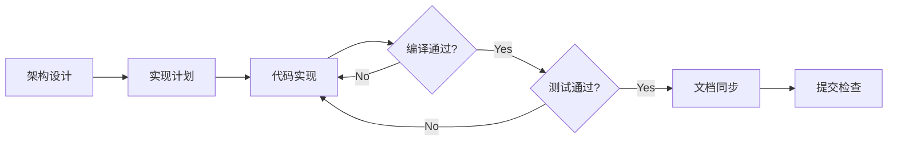

# 代码实现报告

## 等待任务输入

我已经准备好作为一名资深软件工程师进行代码实现了。不过在开始工作前，我还需要接收必要的输入文档。

请提供以下文件以开始实现：

1. **架构设计文档**（`.arch.md`）— 描述系统的架构、模块划分、数据流等内容
2. **实现计划文档**（`.impl-plan.md`）— 详细的任务分解、实现步骤、优先级安排
3. **原始需求文档** — 功能需求、业务背景、技术要求等

---

## 准备就绪

一旦收到上述文档，我将按照以下流程进行：

同时，我会严格遵守项目现有的技术约束：

| 约束项 | 要求 |
|--------|------|
| 单文件 ≤ 500 行 | 超限自动拆分 |
| 单函数 ≤ 50 行 | 超限必须拆分 |
| 圈复杂度 ≤ 10 | 超标重构 |
| 禁止 `utils/` `common/` `helper/` | 按领域分散 |
| 测试覆盖率 ≥ 50% | CI 提醒 |
| 每次修改后 `make check` | 全绿才能提交 |
| SQL 占位符独立编号（`$N`） | 遵守 `s.rebind` 规则 |
| 迁移双文件（MySQL + Postgres） | schema 变更必创建 |

请提供需要的文档或直接描述需要实现的功能，我会立即开始工作。
