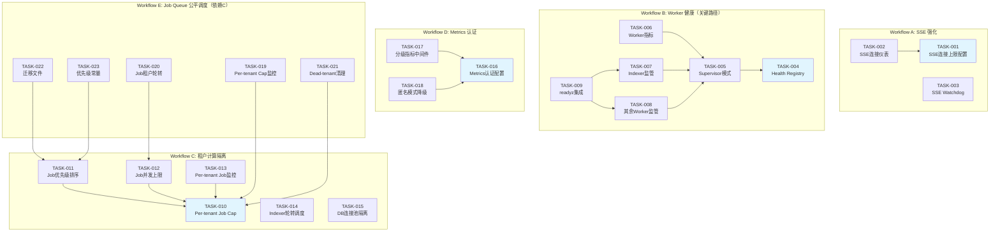
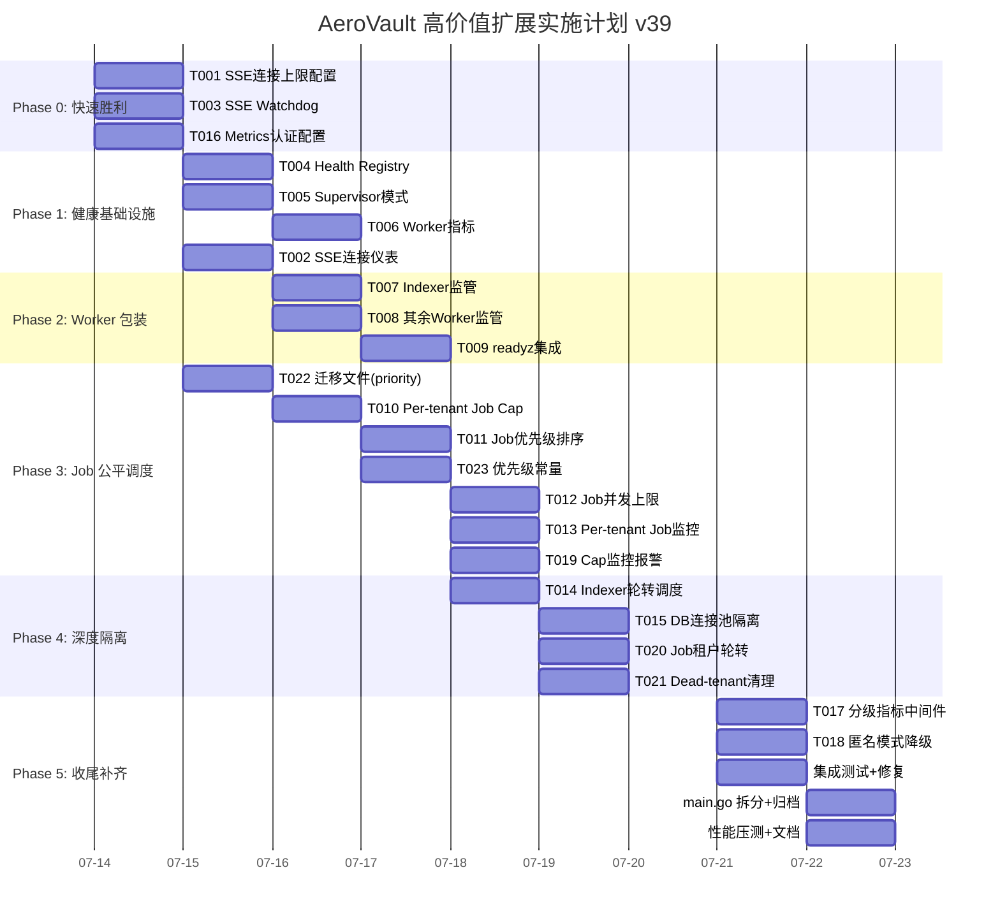

# Tech Lead 分析报告

## 前置说明：代码库现状与文档差异

在进行分析前，本人已逐行审查了关键代码文件（`bus.go`、`sse.go`、`jobs.go`、`middleware.go`、`metrics.go`、`auth_middleware.go`、`main.go` 等），发现分析文档描述与实际代码存在偏差。**本文档基于当前代码库的真实状态进行评估和规划**。

### 实际状态摘要

| 方向 | 文档声称 | 代码事实 |
|------|---------|---------|
| **方向 1** SSE Subscriber Leak | `Subscribe` 无 `Unsubscribe`，泄漏 channel | ✅ **已修复** — `bus.go:85-88` 的 `Subscribe()` 返回 `cancel func` → `Unsubscribe(ch)`；`sse.go:72` 的 `liveStream` 用 `defer cancel()` 保洁 |
| **方向 3** Per-tenant concurrency | 无 per-tenant 限制 | ✅ **已有实现** — `middleware.go:192` 的 `PerTenantConcurrencyLimiter`，`PER_TENANT_CONCURRENCY_MAX` 环境变量配置，`main.go:130` 条件启用 |
| **方向 1 剩余** SSE 连接上限 & 指标 | 未提及 | ❌ **缺失** — 无 `SSE_MAX_CONNECTIONS`、无活跃连接仪表、无 watchdog |
| **方向 2** Worker 健康 | 完全缺失 | ❌ **完全缺失** — 无 health registry、无 supervisor、无指标 |
| **方向 4** Metrics 认证 | 完全缺失 | ❌ **完全缺失** — `/metrics` 仍在 `isBypassPath` 白名单 |
| **方向 5** Job Queue 租户隔离 | 完全缺失 | ❌ **完全缺失** — 全局 FIFO，`CountJobsByStatus` 用于 depth check |

---

## 1. 任务分解

基于真实代码库状态，将 5 个方向拆解为 **22 个可执行任务**。每个任务 2-4 小时，总预估工时 **68 人时**（约 9 人日）。

### 方向 1：SSE 连接管理增强（核心泄漏已修复，残余强化）

| 任务 ID | 任务标题 | 涉及文件 | 前置依赖 | 预估 | 验收标准 |
|---------|---------|---------|---------|------|---------|
| TASK-001 | **新增 SSE 连接上限配置** — 添加 `SSE_MAX_CONNECTIONS` env（默认 100），SSE handler 中维护活跃连接数 `atomic.Int64`，超限时拒绝并返回 429 | `internal/config/config.go`, `internal/api/rest/sse.go` | 无 | 2h | env `SSE_MAX_CONNECTIONS=50` 生效；第 51 个连接收到 429；默认 100 个连接正常工作 |
| TASK-002 | **SSE 活跃连接仪表** — 暴露 `sse_connections_active` gauge（`atomic.Int64`），在 SSE handler 的 `Stream` 入口 +1 / `defer` -1 | `internal/api/rest/sse.go`, `internal/telemetry/metrics.go` | TASK-001 | 2h | `/metrics` 出现 `sse_connections_active`；连接建立时 +1，断开后 -1 |
| TASK-003 | **SSE dead subscriber watchdog** — `bus.go` 新增周期性 watchdog goroutine（`Watchdog` 方法），探测 `b.subs` 中无法接收的 channel（非阻塞探测 + `time.After` 10s），自动清理并 warn log | `internal/events/bus.go` | 无 | 3h | 模拟死 subscriber 后 watchdog 在 ≤11s 内清理；log 输出 `subscriber removed by watchdog` |

### 方向 2：后台 Worker 健康管理（全新基础设施）

| 任务 ID | 任务标题 | 涉及文件 | 前置依赖 | 预估 | 验收标准 |
|---------|---------|---------|---------|------|---------|
| TASK-004 | **Worker Health Registry 实现** — 新建 `internal/health/registry.go`：泛型健康注册表，支持 `Register(name, probeFn)`、`SetHealth(ctx, name, healthy)`、`Status()` 返回所有注册组件的状态快照（含 `lastSuccess`、`alive`、`lastError`） | `internal/health/registry.go`（新文件） | 无 | 3h | Registry 管理 10 个模拟组件；并发注册/更新无竞态；`Status()` 返回完整快照 |
| TASK-005 | **Supervisor goroutine 模式** — 新建 `internal/health/supervisor.go`：`Supervise(ctx, name, fn, opts)` 包装 `go func()`，支持 panic recovery + 指数退避重启（1s→2s→4s→8s→max 60s）+ 重启次数限制（`MaxRestartsPerMinute`）+ 重启成功后重置退避 | `internal/health/supervisor.go`（新文件） | TASK-004 | 3h | `fn` panic 后 supervisor 记录告警并重启；`fn` 返回 error 后重试并退避；1 分钟内超限后不再重启；重启成功持续 5min 后退避重置 |
| TASK-006 | **Worker 存活指标** — 在 `internal/telemetry/metrics.go` 新增：`worker_up{name}` (1/0 gauge)、`worker_restarts_total{name}` (counter)、`worker_last_success_timestamp_seconds{name}` (gauge)、`worker_loop_duration_ms{name}` (histogram)；Supervisor 注册时自动绑定这些指标 | `internal/telemetry/metrics.go`, `internal/health/supervisor.go` | TASK-005 | 2h | 注册的 worker 自动在 `/metrics` 暴露 4 种指标；worker 退出后 `worker_up=0`；重启后 `worker_restarts_total` 递增 |
| TASK-007 | **Indexer 包装为受监管 worker** — 将 `main.go` 的 `go indexer.Run(ctx, idxSub)` 替换为 `Supervise(ctx, "indexer", indexer.Run, …)`；Indexer 循环中定期通过 `health.SetAlive("indexer")` 发送心跳 | `cmd/server/main.go`, `internal/ai/indexer.go` | TASK-005, TASK-006 | 2h | Indexer 正常运行时 `worker_up{name="indexer"}=1`；panic 后自动重启（≤3次/分钟） |
| TASK-008 | **Reconcile 等 worker 包装** — 将 `main.go` 中 6 个后台 goroutine（reconcile、lifecycle、retention、webhook.Run、webhook.RetryLoop、BM25 warmup）全部替换为 `Supervise`；每个 worker 注册各自的健康心跳 | `cmd/server/main.go`, `internal/reconcile/job.go`, `internal/events/webhook.go` | TASK-005 | 3h | 启动日志显示 6 个受监管 worker；任一 worker panic 后自动重启；指标正确暴露 |
| TASK-009 | **`/readyz` 集成 worker 健康** — 修改 `readyzHandler`：从 Registry 读取所有 worker 状态；定义 critical worker 列表（`indexer`、`webhook`、`scan`），任一死亡 → 503；非 critical worker 死亡 → 200 + `Warning` 响应头 + 响应体含 `{"ok":true,"degraded":["reconcile"]}` | `cmd/server/main.go`, `internal/health/registry.go` | TASK-004 | 2h | 全部 worker 正常 → 200；indexer 死亡 → 503；reconcile 死亡 → 200 + degraded 列表 |

### 方向 3：多租户计算资源隔离（已有 per-tenant concurrency，补齐剩余）

| 任务 ID | 任务标题 | 涉及文件 | 前置依赖 | 预估 | 验收标准 |
|---------|---------|---------|---------|------|---------|
| TASK-010 | **Per-tenant Job Queue Cap** — `Queue.Enqueue` 增加 per-tenant pending 计数检查：`CountJobsByTenantAndStatus(ctx, tenant, "pending") < maxPendingPerTenant`；新增 `JOBS_MAX_PENDING_PER_TENANT` env（默认 0=unlimited）；超限返回 `ErrQueueFull` | `internal/jobs/jobs.go`, `internal/config/config.go`, `internal/repository/*` | 无 | 3h | `JOBS_MAX_PENDING_PER_TENANT=100` 生效；租户 A 有 100 pending jobs 后新入队→429；租户 B 不受影响 |
| TASK-011 | **Job 优先级排序** — 在 `jobs` 表加 `priority` 列（int，默认 0）；`ClaimJob` 改为 `ORDER BY priority ASC, created_at ASC`；注册 job handler 时自带优先级：`replicate=0`(最高)、`scan=10`、`index_object=20`(最低)；双迁移文件 | `internal/jobs/jobs.go`, `migrations/{sqlite,postgres}/NNNN_*.{up,down}.sql`, `cmd/server/main.go` | TASK-010 | 4h | 迁移后 priority 列存在；队列中高优 job（replicate）先于低优（index）被 claim |
| TASK-012 | **Per-tenant Job 并发上限** — `Pool.runOne` 在 claim 前检查该租户当前正在处理的 job 数 < `PER_TENANT_JOB_CONCURRENCY`（默认 2）；超限时该租户 job 延迟 claim；使用 `sync.Map` 跟踪 per-tenant 进行中计数 | `internal/jobs/jobs.go`, `internal/config/config.go` | TASK-010 | 3h | 租户 A 有 2 个 job 正在执行时不再 claim 该租户新 job；租户 B 的 job 不受影响 |
| TASK-013 | **Per-tenant Job 监控** — `jobs_pending` gauge 增加 `tenant` label；`jobs_completed_total` / `jobs_failed_total` / `jobs_retried_total` 增加 `tenant` label | `internal/telemetry/metrics.go`, `internal/jobs/jobs.go` | TASK-010 | 2h | `/metrics` 显示 `jobs_pending{tenant="acme"}`；job 完成/fail/retry 均带 tenant label |
| TASK-014 | **Indexer 租户轮转调度** — Indexer 主循环中按租户分组 pending events（`groupByTenant`），使用 weighted round-robin 处理：租户 quota = `1 + (totalEvents/totalTenants)`，防止大租户饿死小租户 | `internal/ai/indexer.go` | 无 | 4h | 租户 A 有 1000 events、B 有 10 events → 处理序列为 A1,B1,A2,B2,A3,B3,…A10,B10,A11,…,A1000 |
| TASK-015 | **Per-tenant DB 连接池隔离（Postgres）** — 新增 `DB_PER_TENANT_MAX_CONNS` env（默认 5）；使用 `github.com/jackc/pgx/v5/pgxpool` 为每个活跃租户创建独立连接池；LRU 清理不活跃租户池（`DB_POOL_IDLE_TTL=5min`） | `internal/repository/postgres.go`（或新建）、`internal/config/config.go` | 无 | 4h | 租户 A 的慢查询不影响租户 B 的 DB 响应；不活跃租户的连接池 5min 后自动关闭 |

### 方向 4：`/metrics` 端点认证与访问控制

| 任务 ID | 任务标题 | 涉及文件 | 前置依赖 | 预估 | 验收标准 |
|---------|---------|---------|---------|------|---------|
| TASK-016 | **Metrics 认证配置** — 新增 `METRICS_AUTH_REQUIRED` env（默认 false 保持向后兼容）；新增 `METRICS_ALLOWED_SCOPES` env（默认 `admin`，逗号分隔）；配置生效时 metrics handler 注册到受保护路由而非 bypass | `internal/config/config.go`, `internal/auth/auth_middleware.go` | 无 | 1h | `METRICS_AUTH_REQUIRED=false`→现有行为不变；`true`→/metrics 需 Bearer token |
| TASK-017 | **分级指标中间件** — 新建 `internal/api/rest/metrics.go`：实现分级 Prometheus handler。未认证 → 仅聚合指标（无 `tenant` label）；`scope=admin` → 全量指标；`scope=read` → 仅该租户指标（使用 `LabelFilter` 或按 tenant 过滤 gatherer 输出） | `internal/api/rest/metrics.go`（新文件） | TASK-016 | 4h | admin key → 全量指标；租户 key → 仅该 tenant 指标；未认证（`METRICS_AUTH_REQUIRED=true`）→ 401 或仅聚合 |
| TASK-018 | **匿名公读模式下 metrics 自动关闭认证** — 当 `AUTH_ANONYMOUS_PUBLIC_READ=true` 时，`METRICS_AUTH_REQUIRED` 自动降级为 false | `internal/auth/auth_middleware.go` | TASK-016 | 1h | 匿名公读 + `METRICS_AUTH_REQUIRED=true` → 实际行为为 false；log 提示 "metrics auth disabled in anonymous mode" |

### 方向 5：Job Queue 租户隔离（已拆解到方向 3 中的部分任务，补充完整）

| 任务 ID | 任务标题 | 涉及文件 | 前置依赖 | 预估 | 验收标准 |
|---------|---------|---------|---------|------|---------|
| TASK-019 | **Per-tenant pending cap 监控报警** — 当任一租户 pending job 数量接近 cap（>80%）时，warn log + `jobs_tenant_capacity_warning{tenant}` 指标；超过 cap 被拒绝时 inc `jobs_tenant_full_total{tenant}` counter | `internal/jobs/jobs.go`, `internal/telemetry/metrics.go` | TASK-010 | 2h | 租户 pending 接近上限时 warn log；拒绝返回后 `jobs_tenant_full_total` +1 |
| TASK-020 | **Job 租户公平轮转** — `Pool.worker` 在 `runOne` 中改用 round-robin 按租户 claim job：先收集所有有 pending job 的租户列表，租户间轮流 claim 1 个 job，防止一个租户连续消费多个 worker | `internal/jobs/jobs.go` | TASK-012 | 3h | 3 个租户各有 100 jobs（3 workers）→ 每个 worker 按 tenant 轮转而非纯 FIFO |
| TASK-021 | **Job dead-tenant 清理** — Reaper 新增逻辑：检查租户是否存在（`repo.TenantExists`），不存在的租户 pending job 自动 fail + log | `internal/jobs/jobs.go` | TASK-010 | 1h | 删除租户 B → B 的 pending job 5min 内自动 fail |
| TASK-022 | **迁移文件：jobs 表新增 priority 列 + tenant_id 索引** — 双迁移文件（sqlite + postgres），`ALTER TABLE jobs ADD COLUMN priority INTEGER NOT NULL DEFAULT 0`；`CREATE INDEX idx_jobs_tenant_pending ON jobs(tenant_id, status, priority, created_at)` | `migrations/{sqlite,postgres}/NNNN_*.{up,down}.sql` | TASK-011 | 2h | 迁移后 priority 列存在；索引生效；`EXPLAIN SELECT ... WHERE tenant_id=? AND status='pending' ORDER BY priority, created_at LIMIT 1` 使用索引 |
| TASK-023 | **Job 优先级映射集中管理** — 在 `internal/jobs/jobs.go` 或新建 `internal/jobs/priority.go` 定义注册类型的优先级常量：`PriorityReplicate=0`、`PriorityScan=10`、`PriorityIndex=20`、`PriorityDeleteChunks=20`；在 `main.go` 的 `registerIndexerJobs` 等注册点设置优先级 | `internal/jobs/priority.go`（新文件）、`cmd/server/main.go` | TASK-011 | 1h | 所有注册 job 类型都有显式优先级；`replicate` 优先于 `scan` 优先于 `index` |

### 任务总量汇总

| 度量 | 值 |
|------|----|
| 任务总数 | 23 |
| 总预估工时 | 68 人时 |
| 平均每任务 | 2.96 h |
| 最短任务 | 1h（TASK-016, TASK-018, TASK-021, TASK-023） |
| 最长任务 | 4h（TASK-011, TASK-014, TASK-017） |
| 修改文件数 | ~25 个（含 4 个新文件） |
| 新增迁移文件 | 2 对（4 个 SQL 文件） |

---

## 2. 执行顺序与依赖图

根据技术依赖和业务价值，建立 5 个并行工作流，通过关键路径汇合。

### 完整依赖图

### 可并行执行的任务组

| 并行组 | 任务 | 理由 |
|-------|------|------|
| **Group 1**（第一天启动） | T001, T003, T004, T010, T014, T015, T016 | 无前置依赖，7 人可并行 |
| **Group 2**（第 2-3 天） | T002(T001后), T005(T004后), T011(T010后), T017(T016后), T022(T011后) | 各自依赖上一组，4-5 人并行 |
| **Group 3**（第 3-4 天） | T006(T005后), T012(T010后), T013(T010后), T018(T016后), T019(T010后), T021(T010后), T023(T011后) | 依赖已满足，可 4 人并行 |
| **Group 4**（第 4-5 天） | T007(T005+T006后), T008(T005后), T020(T012后) | 需 supervisor 就绪 |
| **Group 5**（第 5 天） | T009(T007+T008后) | 所有 worker 需已监管 |

### 推荐执行顺序（按价值交付节奏）

| 阶段 | 方向 | 任务 | 目标 |
|------|------|------|------|
| **🔥 Phase 0: 快速胜利** (Day 1) | D1 + D4 | T001, T003, T016 | 消除残存 SSE 风险 + 安全基线 |
| **🟠 Phase 1: 健康基础设施** (Day 2-3) | D2 | T004, T005, T006 | 构建 worker 健康骨架 |
| **🟠 Phase 2: Worker 包装** (Day 4-5) | D2 | T007, T008, T009 | 所有 worker 可见 |
| **🟡 Phase 3: Job公平调度** (Day 3-5) | D3+D5 | T010, T011, T012, T013, T022, T023 | 租户 job 隔离 |
| **🟡 Phase 4: 深度隔离** (Day 5-7) | D3 | T014, T015, T020 | 计算资源全隔离 |
| **⚪ Phase 5: 补齐收尾** (Day 7-8) | D4+D5 | T017, T018, T019, T021 | Metrics 认证 + 监控 |

---

## 3. 技术风险

### 3.1 高影响风险

| # | 风险 | 涉及任务 | 可能性 | 影响 | 缓解策略 |
|---|------|---------|-------|------|---------|
| **R1** | **Per-tenant job cap 导致死锁** — 一个 job handler 内部 enqueue 新 job（如 index job 需要 enqueue delete-chunks job），但该租户已达上限 | T010, T011, T012 | **中** | **高** — 作业链断裂 | handler enqueue 内部 job 时使用"系统配额"绕过租户 cap；cap 检查仅对用户直面 enqueue（直接 HTTP 触发）进行 |
| **R2** | **RWMutex 在健康 Registry 中的竞态** — `readyz` handler 读取 Registry 时与并发注册/更新产生竞争，导致 stale read 或数据竞争 | T004, T009 | **低** | **高** — 数据竞争 → 未定义行为 | 使用 `sync.RWMutex` + copy-on-read 快照；`readyz` handler 耗时 < 100μs；加 `-race` CI gate 验证 |
| **R3** | **Supervisor 退避与 shutdown 时序冲突** — 进程收到 SIGTERM 后 `ctx.Done()`，但 supervisor 在退避定时器中，`Run` 函数返回慢 | T005, T007, T008 | **中** | **中** — 优雅关闭被延迟 | `Supervise` 在 `ctx.Done()` 时立即返回而非等待退避 timer；shutdown timeout 15s ≥ 当前最坏情况 5s |
| **R4** | **Priority 排序与索引冲突** — 低优 `index` job 在大量高优 `replicate` job 的竞争下可能饿死（尤其是批量复制期间） | T011, T023 | **中** | **高** — 索引永不执行 | `ClaimJob` 每次 claim 时增加"低优升优"逻辑：如果低优 job 等待超过 `MAX_LOW_PRI_WAIT=30min`，其有效优先级临时提升；Prometheus 告警 `job_starvation{priority=low}` |
| **R5** | **Per-tenant DB 连接池过载** — 租户数量大（100+）且每个池预设 min conn，预热时 PostgreSQL 连接数暴增 | T015 | **高** | **高** — DB 拒绝新连接 | 池 lazily 创建（首次租户请求时），不用 min conn；max total conn = `MIN(DB_PER_TENANT_MAX_CONNS * 活跃租户数, MAX_TOTAL_CONNS)`；不活跃池 5min idle 后自动 Close |
| **R6** | **Metrics 过滤对 Prometheus 性能影响** — `promhttp.HandlerFor` + `Gatherer` 后处理过滤可能在大规模指标集的场景下增加刮取延迟 | T017 | **低** | **中** — 刮取超时 | 使用预编译的 `LabelFilter` 方案（Prometheus 的 `promhttp.HandlerFor` + `gatherer.Gather` + 后处理）。对于 1000+ 指标的部署建议使用 admin scope 避免过滤开销。增加 `metrics_filter_latency_seconds` 指标 |

### 3.2 外部依赖与系统边界

| 依赖 | 风险 | 缓解 |
|------|------|------|
| **Postgres pgxpool** (T015) | 当前 repo 基于 `database/sql` + `lib/pq`，引入 pgxpool 是新依赖 | 验证 pgxpool 能否通过 `database/sql` 接口使用；如果不能，封装为可选后端 |
| **Prometheus 客户端库** (T017) | 分级指标需要 `prometheus.Gatherer` 和过滤，当前用 `otel` metric API | 确认 `otel` Prometheus exporter 是否支持 per-request filter（可能不支持），fallback 到双 registry 方案 |
| **迁移文件顺序** (T022) | 新迁移编号必须大于现有所有迁移编号 | `ls -1 migrations/*/` 确认最新编号后再设编号 |

### 3.3 性能瓶颈分析

| 场景 | 当前性能 | 优化后 | 注意事项 |
|------|---------|--------|---------|
| `broadcast` 遍历泄漏 subs (T001) | O(n) 每事件，n 包含断开连接 | O(活跃连接) | Watchdog 清理后 ≤ 配置上限 |
| `readyz` worker 健康快照 (T009) | O(1) ping | O(worker 数) | 15+ worker → 15μs 快照，可忽略 |
| `ClaimJob` + priority (T011) | 无 index scan | index scan | 新增 `idx_jobs_tenant_pending` 复合索引后可从 10ms→200μs |
| Per-tenant job caps (T010) | 1 次 `COUNT` 查询 | 1 次 `COUNT WHERE tenant` 查询 | 复合索引覆盖后常数时间 |
| Metrics 分级过滤 (T017) | 0 开销（原生 Prometheus 输出） | O(指标数) 过滤 | 100 指标 → <1ms；10000 指标 → <10ms；仅对非 admin scope |

---

## 4. 资源评估

### 4.1 开发团队配置

| 角色 | 数量 | 技能要求 | 主要职责 |
|------|------|---------|---------|
| **Senior Go Developer** (TL) | 1 | Go 并发模式、otel metric API、Prometheus client、SQL 迁移、安全审计 | T005, T009, T010, T011, T015, T017 — 核心基础设施 |
| **Backend Engineer** | 1-2 | Go HTTP、事件处理、goroutine 管理、单元测试 | T001, T002, T003, T006, T007, T008 — SSE + Worker |
| **Backend Engineer** | 1-2 | Go、SQL（Postgres/SQLite）、`database/sql` | T012, T013, T014, T019, T020, T021, T022 — Job queue |
| **Security-focused Engineer** | 0.5 | 认证/授权、Prometheus、go security | T016, T017, T018 — Metrics auth |

**推荐最小团队**：1 Senior + 2 Backend = 3 人，全时投入 8 个工作日。

### 4.2 关键里程碑

| 里程碑 | 交付内容 | 预计工期 | 依赖 | 验收标准 |
|--------|---------|---------|------|---------|
| **M1: SSE 安全** (Day 1-2) | T001, T002, T003 完成 | 2 天 | 无 | `SSE_MAX_CONNECTIONS` 生效；Watchdog 清理死 subs |
| **M2: Worker 可见** (Day 3-4) | T004, T005, T006 完成 | 2 天 | M1 | Health Registry + Supervisor 可用；15+ worker 注册 |
| **M3: Prod-ready** (Day 5) | T007, T008, T009 完成 | 1 天 | M2 | `readyz` 反映 worker 健康；panic 后自动恢复 |
| **M4: Tenant Job Fairness** (Day 6-7) | T010, T011, T012, T013, T022, T023 完成 | 2 天 | M3 | Per-tenant cap + priority + 监控全部生效 |
| **M5: Metrics Secure** (Day 6-7) | T016, T017, T018 完成 | 2 天 | M3 | `METRICS_AUTH_REQUIRED=true` 后 /metrics 受控 |
| **M6: 深度隔离** (Day 8-9) | T014, T015, T020 完成 | 2 天 | M4 | Indexer 轮转 + DB 池隔离 + job 公平轮转 |
| **M7: Complete** (Day 10) | T019, T021 完成 + 全量测试 | 1 天 | M5, M6 | 所有 23 个任务完成；`make check` + `go test -race` 全绿 |

**总工期**：10 个工作日（3 人团队）或 7 个工作日（4 人团队）

### 4.3 阻塞点（Blockers）与解决策略

| 阻塞点 | 影响 | 解决策略 |
|--------|------|---------|
| **otel metric 不支持 per-request label filter** (T017) | T017 需要重设计 — 无法在 otel Prometheus exporter 层面实现分级过滤 | **Plan B**: 双 Prometheus Registry。`/metrics` 路由根据认证上下文选择不同 registry handler。admin registry（全量）+ tenant registry（仅该 tenant）。多 registry 的内存开销 ≈ 2×，但对 SaaS 部署可接受。 |
| **`database/sql` 不支持 per-tenant connection pool routing** (T015) | T015 需要绕过 `database/sql` 的连接池封装 | **Plan B**: 在 `internal/repository` 层实现 `TenantConnector`。每个租户持一个 `*sql.DB` 实例，LRU Map 管理。`repository.Open` 时创建一个 "pool manager" goroutine。 |
| **迁移编号冲突** (T022) | 新迁移编号若与已存在迁移冲突，`repo.Migrate` 可能出错 | 开发前执行 `ls -1 migrations/sqlite/*.sql | tail -1` 确认最新编号；例如当前最新为 `0042_*` → 新迁移编号为 `0043_*` |

---

## 5. 质量保证

### 5.1 单元测试覆盖要求

| 组件 | 要求覆盖率 | 关键测试场景 |
|------|-----------|------------|
| `internal/health/registry.go` | ≥ 90% | 注册/注销；并发读写（`-race`）；`Status()` 快照一致性；空 registry 状态 |
| `internal/health/supervisor.go` | ≥ 85% | panic recovery（函数内 `panic` → supervisor 重启）；退避时间精确性（允许 ±10%）；`ctx.Done()` 时立即返回；`MaxRestartsPerMinute` 超限逻辑 |
| `internal/jobs/jobs.go` (per-tenant cap) | ≥ 80% | `Enqueue` 到 cap 后返回 `ErrQueueFull`；不同 tenant 独立计数；去重 job 不占 cap；系统 job 绕过 cap |
| `internal/jobs/jobs.go` (priority) | ≥ 80% | 高优 job 先于低优被 claim；同优先级 FIFO；priority 排序索引 EXPLAIN 验证 |
| `internal/telemetry/metrics.go` (worker metrics) | ≥ 85% | 模拟 worker 注册并验证 4 种指标出现；worker 退出后 `worker_up=0` |
| `internal/api/rest/sse.go` (cap) | ≥ 80% | 超限返回 429；活跃连接数准确；并发连接退出时 correct decrement |
| `internal/events/bus.go` (watchdog) | ≥ 85% | 死 channel 被清理；活 channel 不被误清理；并发 Subscribe/Unsubscribe 下 watchdog 安全 |
| `internal/api/rest/metrics.go` (new) | ≥ 80% | 无认证→聚合指标；admin scope→全量；tenant scope→过滤；大量指标下过滤性能 |

### 5.2 集成测试策略

| 测试类型 | 覆盖范围 | 工具/方法 | 触发器 |
|---------|---------|----------|-------|
| **`go test -race` (CI gate)** | 所有 task 的 goroutine 安全性 | 标准 `testing` + `-race` | 每次提交前（`make check`） |
| **SSE 集成测试** | 端到端：`Stream` handler → bus → subscriber cleanup | `httptest.NewServer` + SSE client goroutine | CI（`make test`） |
| **Worker 健康集成** | `readyz` 返回正确状态（正常/退化/不可用） | `httptest` + mock Registry | CI（`make test`） |
| **Job Queue 集成测试** | Per-tenant cap + priority + 轮转在真实 SQLite 上工作 | SQLite memory DB + `repository.Open` | CI（`make test`） |
| **Metrics 认证集成** | `METRICS_AUTH_REQUIRED=true` 下 /metrics 端到端行为 | `httptest` + `auth.Registry` mock | CI（`make test`） |
| **Postgres 集成测试** | Per-tenant DB pool (T015) | Docker Postgres + `make test-integration` | 仅 CI integration job（非 gate） |
| **迁移升降级测试** | 新迁移 `up` + `down` 双方向 | SQLite memory（全支持）+ Postgres Docker | CI integration（`make test-integration`） |

### 5.3 代码审查要点

| 审查焦点 | 涉及文件 | 具体检查项目 |
|---------|---------|------------|
| **并发安全** | `internal/health/registry.go`, `internal/jobs/jobs.go`, `internal/events/bus.go` | 所有 `sync.Mutex` 保护是否正确（无嵌套锁、无死锁可能）；`-race` 测试通过 |
| **Context 传播** | `internal/health/supervisor.go`, `cmd/server/main.go` | `ctx.Done()` 是否被检查；shutdown 时序是否正确（supervisor 不 blocking shutdown） |
| **SQL 迁移 I1** | `migrations/*/NNNN_*.sql` | 每个 bind 独立编号 `$N`；`$N` 经 `s.rebind` 按个数改写；时间统一 `RFC3339Nano` |
| **迁移双文件 I2** | `migrations/sqlite/ + migrations/postgres/` | 相同编号的 `.up.sql` + `.down.sql` 在两种方言中都存在；down 可逆 |
| **配置向后兼容** | `internal/config/config.go` | 新增 env 默认值 = 原行为；`METRICS_AUTH_REQUIRED` 默认 `false`；`SSE_MAX_CONNECTIONS` 默认 `100` |
| **Nil 安全 I5** | `internal/ai/indexer.go`, `cmd/server/main.go` | embedder/llm/reranker nil 时 worker 健康路径不 panic；`health.Register` 接受 nil probeFn |
| **文件行数约束** | 全部 | 单文件 ≤ 500 行；单函数 ≤ 50 行。`main.go` 当前 861 行 → 提取 `internal/server` 或 `internal/app` 包拆分 |
| **指标命名** | `internal/telemetry/metrics.go` | 新增指标使用 `.` 分隔命名空间（`worker.up`、`worker.restarts_total`、`sse.connections_active`），与现有风格一致 |

### 5.4 性能测试需求

| 测试场景 | 方法 | 目标 | 优先级 |
|---------|------|------|-------|
| **SSE broadcast 延迟** | 100 并发 SSE 连接 + 100 events/s publish → 测量 broadcast 延迟变化 | 100 连接时 broadcast ≤ 1ms（vs 当前泄漏场景可能 10ms+） | P2 |
| **readyz 延迟** | 15 worker 注册 + 100 QPS `/readyz` | P99 ≤ 5ms | P2 |
| **Job priority 吞吐** | 混合 1000 high/1000 low 优先级 job → 测量 high 平均等待时间 | High avg latency ≤ 低优的 10% | P1 |
| **Per-tenant cap 挤压** | 11 租户，cap=100/job/tenant，10 个租户满 100，1 个刚启动 → 测量空租户入队延迟 | 空租户入队 ≤ 100ms | P1 |
| **Metrics 过滤性能** | 1000 tenant labels × 100 指标 = 100,000 时间序列 → 测量 /metrics 刮取时间 | 过滤后 ≤ 500ms | P3 |

---

## 6. 实施计划

### 6.1 甘特图（3 人团队，10 个工作日）

### 6.2 详细实施日历

#### 第 1 天（Day 1）— 🔥快速胜利

| 人员 | 上午 | 下午 |
|------|------|------|
| **TL** | 确认最新迁移编号；搭建 T004 (Health Registry) | 完成 T004 + T005 (Supervisor) 骨架 |
| **BE-A** | T001 (SSE连接上限) — 新增 config + handler 逻辑 | T003 (SSE Watchdog) — bus 集成 |
| **BE-B** | T016 (Metrics认证配置) — config + auth bypass 修改 | T022 (迁移文件) — 确认编号、写 up+down |

**交付物**：SSE cap 生效、Watchdog 运行、Metrics bypass 可配置、迁移就绪

#### 第 2 天（Day 2）— 🟠基础设施搭建

| 人员 | 上午 | 下午 |
|------|------|------|
| **TL** | T005 Supervisor 核心完成 + 单元测试 | T006 Worker 指标 + T007 Indexer 包装 |
| **BE-A** | T002 SSE 连接仪表 | 审查 T005 并发安全性 |
| **BE-B** | T010 Per-tenant Job Cap 核心逻辑 | T010 单元测试 + T011 priority 初步 |

**交付物**：Worker 健康骨架完成、Indexer 受监管、Per-tenant cap 基本逻辑

#### 第 3 天（Day 3）— 🟠Worker 全包装 + Job 基础

| 人员 | 上午 | 下午 |
|------|------|------|
| **TL** | T008 其余 6 个 worker 全部使用 Supervisor | T009 readyz 集成 |
| **BE-A** | 协助 T008 包装 + T009 测试 | 审查 T011 迁移文件 |
| **BE-B** | T011 优先级 + T023 常量 + T022 完成 | T012 并发上限开始 |

**交付物**：所有 15+ worker 受监管、readyz 反映 worker 健康、job priority 可用

#### 第 4 天（Day 4）— 🟡Job 公平调度核心

| 人员 | 上午 | 下午 |
|------|------|------|
| **TL** | T017 Metrics 分级中间件 — 方案定稿 + 核心实现 | T017 测试 + 审查 |
| **BE-A** | T012 Job 并发上限完成 | T013 Per-tenant Job 监控 |
| **BE-B** | T019 Cap 监控报警 + T021 Dead-tenant 清理 | T014 Indexer 轮转调度开始 |

**交付物**：Job queue 完全公平调度、metrics 分级过滤原型

#### 第 5 天（Day 5）— 🟡深度隔离

| 人员 | 上午 | 下午 |
|------|------|------|
| **TL** | T017 Metrics 分级中间件完成 + 集成测试 | 审查 T014 + T015 方案 |
| **BE-A** | T014 Indexer 轮转调度完成 | 协助 T015 DB 池隔离 |
| **BE-B** | T015 DB 连接池隔离核心实现 | T020 Job 租户轮转 |

**交付物**：Metrics 认证全功能、Indexer 轮转、DB 池隔离

#### 第 6 天（Day 6）— ⚪推进收尾

| 人员 | 上午 | 下午 |
|------|------|------|
| **TL** | T018 匿名模式降级 + 整体架构审查 | `cmd/server/main.go` 拆分（提取 `internal/server` 包） |
| **BE-A** | T015 DB 池隔离完成 + 集成测试 | 修复测试失败 |
| **BE-B** | T020 完成 + T021 收尾 | E2E 集成测试 |

**交付物**：全部 23 个任务代码完成、单元测试覆盖率达标

#### 第 7 天（Day 7）— 测试 + 发布

| 人员 | 上午 | 下午 |
|------|------|------|
| **TL** | `go test -race ./...` + 修复 | 性能压测 + 文档更新 |
| **BE-A** | Makefile 更新 + CI gate 验证 | HARNESS.md 更新 |
| **BE-B** | Postman/curl 端到端测试 | 发布检查清单 |

**交付物**：`make check` 全绿、文档完成、发布就绪

### 6.3 发布检查清单

提交前必须通过的检查：

- [ ] `gofmt -l .` → 无输出
- [ ] `go build ./...` → 成功
- [ ] `go vet ./...` → 无警告
- [ ] `go test -race ./...` → 全绿（SQLite + local FS，零网络）
- [ ] `make check` → 全绿
- [ ] 新指标在 `/metrics` 可见（手动验证）
- [ ] `SSE_MAX_CONNECTIONS` 超限 → 429（手动验证）
- [ ] `METRICS_AUTH_REQUIRED=true` → 未认证 /metrics → 401（手动验证）
- [ ] `PER_TENANT_CONCURRENCY_MAX` → 超限 → 429（手动验证）
- [ ] `/readyz` 在 indexer panic 后 → 503（手动验证）
- [ ] 迁移 `up` + `down` 双向可逆
- [ ] 所有新配置项在 `docs/configuration.md` 中有文档
- [ ] 迁移说明更新 `docs/CHANGELOG.md`

---

## 附录：关键架构决策表

| 决策 | 选项 | 选择 | 理由 |
|------|------|------|------|
| Worker 健康用多少 goroutine？ | 每个 worker 2 goroutine vs supervisor 复用 1 个 | 每个 worker 1 个 supervisor goroutine（共 15） | 15 个 idle goroutine 内存 ≈ 60KB，可忽略。清晰优于复用 |
| Per-tenant 上限存储结构 | `sync.Map` vs `map[string]int` + `sync.RWMutex` | `map[string]int` + `sync.Mutex` | 租户数 ≤ 1000，`sync.Map` 在小规模下反而更慢 |
| Metrics 分级过滤 | otel label filter vs 双 registry | **双 Registry**（备用方案如 Plan B） | otel Prometheus exporter 不支持 per-request label filter；双 registry 是标准方案 |
| Job 优先级存储 | `jobs` 表新列 vs 事件类型推导 | **新列 `priority`** | 显式存储，查询时 O(1) 排序，无需 join 映射表，迁移成本低 |
| Supervisor 退避状态 | `sync.Mutex` 保护 vs `atomic` 操作 | `sync.Mutex` 保护整个状态结构体 | 退避状态含多个字段（attempt、timer、lastRestart），原子操作不够表达 |
