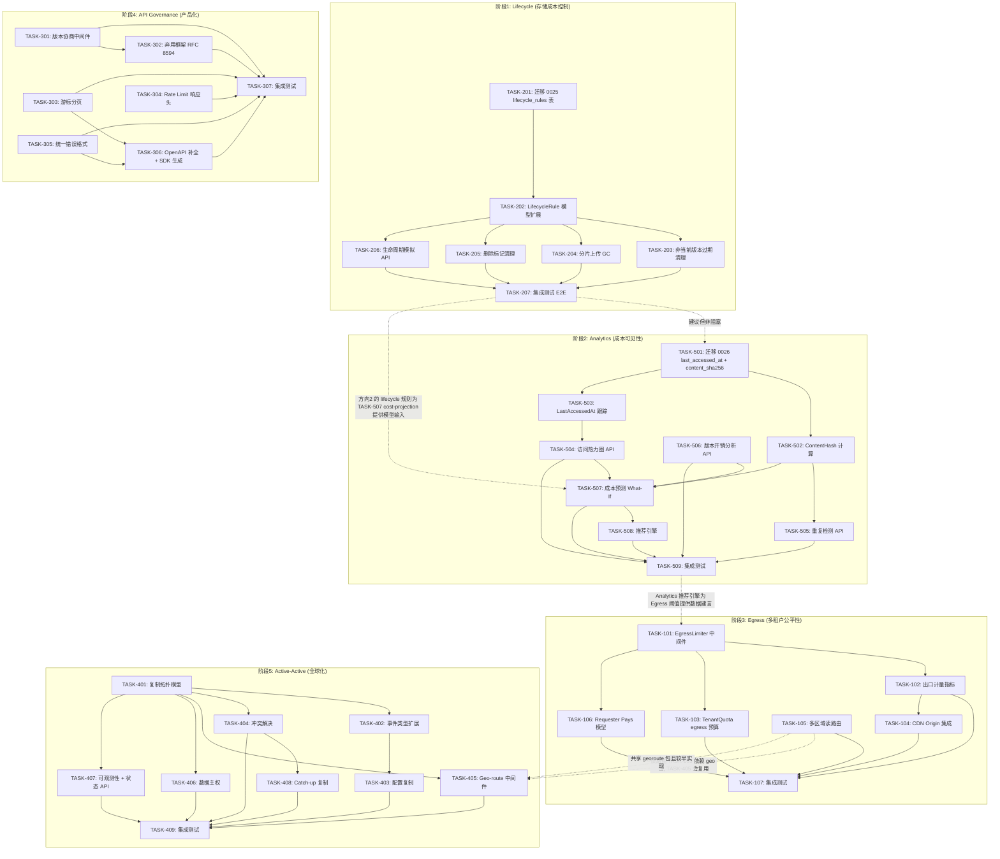
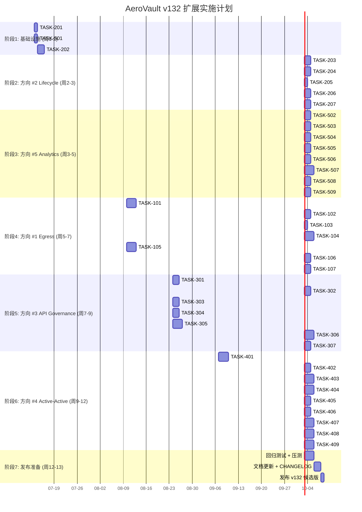

现在我已完整阅读并理解了所有 5 个方向。以下是全面的 Tech Lead 分析。

---

# 技术领导分析报告：AeroVault v132 高价值扩展方向

## 1. 任务分解

### 方向 #2：综合性生命周期管理（存储成本控制，最急切）

| 任务 ID | 标题 | 涉及文件 | 前置依赖 | 预估工时 | 验收标准 |
|---------|------|---------|---------|---------|---------|
| **TASK-201** | 迁移 0025：创建 `lifecycle_rules` 表 | `migrations/{sqlite,postgres}/0025_lifecycle_rules.{up,down}.sql`, `internal/repository/repository.go` | 无 | 3h | 双驱动迁移文件创建；`repo.Migrate` 生成表；查询 `lifecycle_rules` 返回空结果 |
| **TASK-202** | BucketConfig 模型扩展 + LifecycleRule 类型定义 | `internal/repository/repository.go`, `internal/api/rest/dto.go`, `internal/config/config.go` | TASK-201 | 4h | `LifecycleRule` 包含 `NoncurrentVersionRule` / `AbortMPURule` / `ExpiredDelMarkerRule`；复用的 CRUD 方法 |
| **TASK-203** | 非当前版本过期清理 (sweepNoncurrentVersions) | `internal/reconcile/lifecycle.go`, `internal/repository/sql_objects.go` | TASK-202 | 4h | 版本化桶中，非当前版本超过 `NoncurrentDays` 后硬删除；保留 `NewerVersions` 最新 N 个；跳过 `locked_until` |
| **TASK-204** | 不完整分片上传 GC (sweepAbandonedUploads) | `internal/reconcile/lifecycle.go`, `internal/service/file_multipart.go`, `internal/repository/repository.go` | TASK-202 | 3h | 超 `DaysAfterInitiation` 的分片上传自动调用 `AbortMultipart`；指标 `multipart_uploads_aborted_total` |
| **TASK-205** | 过期删除标记清理 | `internal/reconcile/lifecycle.go` | TASK-202 | 2h | 当前版本是删除标记且无非当前版本 → 硬删除该行；listing 不再出现已清除的标记 |
| **TASK-206** | 生命周期模拟 API | `internal/api/rest/admin.go`, `internal/reconcile/lifecycle.go` | TASK-202 | 4h | `POST /v1/buckets/{bucket}/lifecycle/simulate` 纯只读分析；返回 `matched_objects`/`bytes_saved`/`mpu_aborted` |
| **TASK-207** | 集成测试 + 模拟数据 E2E | `internal/reconcile/lifecycle_test.go`, `internal/repository/repository_test.go` | TASK-203~206 | 4h | 各 sweep 函数有 table-driven 测试；模拟 API 验证；`RECONCILE_CLUSTER_SINGLETON` 正确防护 |

**方向 #2 小计：24h（3 人·天）**

---

### 方向 #5：存储成本与分析引擎（可量化收益，为 #1 和 #2 提供数据基础）

| 任务 ID | 标题 | 涉及文件 | 前置依赖 | 预估工时 | 验收标准 |
|---------|------|---------|---------|---------|---------|
| **TASK-501** | 迁移 0026：添加 `last_accessed_at` + `content_sha256` 列 + 索引 | `migrations/{sqlite,postgres}/0026_analytics_columns.{up,down}.sql`, `internal/repository/repository.go` | 无 | 2h | `ALTER TABLE` 双驱动；索引创建正确；存量数据两列为 NULL |
| **TASK-502** | ContentHash 计算与存储 | `internal/service/file_crud.go`, `internal/service/file_multipart.go` | TASK-501 | 3h | PUT/CompleteMultipart 时计算 SHA-256 并写入 `content_sha256`；存量对象为空 |
| **TASK-503** | LastAccessedAt 跟踪（EventAccessed 消费者） | `internal/service/file_crud.go`, `internal/repository/sql_objects.go` | TASK-501 | 3h | GET/HEAD 异步更新 `last_accessed_at`（event-driven，不阻塞响应） |
| **TASK-504** | 访问模式热力图 API | `internal/api/rest/admin.go`, `internal/repository/sql_analytics.go` | TASK-503 | 4h | `GET /v1/admin/analytics/access` 支持 `from/to/granularity` 参数；返回 bucketed 访问计数 + 字节分布 |
| **TASK-505** | 重复检测 API | `internal/api/rest/admin.go`, `internal/repository/sql_analytics.go` | TASK-502 | 3h | `GET /v1/admin/analytics/duplicates` 按 content_sha256 分组；列出重复对象 + wasted_bytes |
| **TASK-506** | 版本开销分析 API | `internal/api/rest/admin.go`, `internal/repository/sql_analytics.go` | TASK-501 | 3h | `GET /v1/admin/analytics/version-overhead` 返回 `current_bytes`/`version_bytes`/`ratio`；逐桶明细 |
| **TASK-507** | 成本预测与 What-If 分析 | `internal/api/rest/admin.go`, `internal/service/analytics.go` | TASK-504~506 | 5h | `POST /v1/admin/analytics/cost-projection` 支持 transition/expire_versions 假设组合；返回 savings 明细 |
| **TASK-508** | 推荐引擎 | `internal/service/analytics.go`, `internal/api/rest/admin.go` | TASK-507 | 4h | `GET /v1/admin/analytics/recommendations` 基于规则自动生成优化建议；规则可配置阈值 |
| **TASK-509** | 集成测试 + 分析查询性能基准 | `internal/service/analytics_test.go`, `internal/api/rest/admin_test.go` | TASK-504~508 | 4h | 各 API 端点 table-driven 测试；百万行级性能测试报告；分页/超时正确 |

**方向 #5 小计：31h（约 4 人·天）**

---

### 方向 #1：出口治理与多区域流量管理

| 任务 ID | 标题 | 涉及文件 | 前置依赖 | 预估工时 | 验收标准 |
|---------|------|---------|---------|---------|---------|
| **TASK-101** | EgressLimiter 中间件（token-bucket 带宽限流） | `internal/middleware/egress.go`, `internal/middleware/middleware.go` | 无 | 5h | 写入响应时从桶扣除字节；桶空时新请求返回 429 + `Retry-After`；已有连接不中断 |
| **TASK-102** | 每租户出口计量 + Prometheus 指标 | `internal/telemetry/metrics.go`, `internal/middleware/egress.go` | TASK-101 | 3h | `egress_bytes_total{tenant}` counter；`egress_bandwidth_limit` gauge |
| **TASK-103** | TenantQuota 出口预算字段 | `internal/repository/repository.go`, `migrations/0027_quota_egress.sql`, `internal/config/config.go` | TASK-101 | 2h | `egress_bytes_budget` + `egress_reset_at` 字段；迁移文件双驱动 |
| **TASK-104** | CDN Origin 集成 | `internal/service/file_features.go`, `internal/api/rest/router.go`, `internal/config/config.go` | TASK-101 | 5h | `STORAGE_CDN_MODE` 免认证 CIDR 白名单；Cache-Control 配置 API；优化 Range 请求 |
| **TASK-105** | 多区域读路由（geo/latency） | `internal/georoute/router.go`, `internal/middleware/georoute.go` | 无（独立） | 6h | 新包 `internal/georoute/`；`NearestRegion(ip)` 基于 GeoIP；302 重定向 + `X-Aero-Region` 头 |
| **TASK-106** | Requester Pays 模型 | `internal/service/file_crud.go`, `internal/api/s3compat/handler.go`, `internal/api/rest/handler.go` | TASK-101 | 4h | 桶级 `requester_pays` 配置；`x-amz-request-payer` 请求头解析；出口计入请求方租户 |
| **TASK-107** | 集成测试 + E2E 带宽限流测试 | `internal/middleware/egress_test.go`, `internal/service/file_features_test.go` | TASK-101~106 | 4h | 带宽桶满返回 429；CDN 白名单 bypass 计量；Requester Pays 跨租户计费正确 |

**方向 #1 小计：29h（约 3.5 人·天）**

---

### 方向 #3：API 治理与 SDK 成熟度

| 任务 ID | 标题 | 涉及文件 | 前置依赖 | 预估工时 | 验收标准 |
|---------|------|---------|---------|---------|---------|
| **TASK-301** | API 版本协商中间件 | `internal/middleware/version.go`, `internal/middleware/middleware.go` | 无 | 4h | `Accept-Version` 头解析；`X-Aero-API-Version` 响应；不支持版本返回 400 |
| **TASK-302** | 弃用框架（RFC 8594） | `internal/middleware/deprecation.go`, `internal/middleware/middleware.go`, `internal/config/config.go` | TASK-301 | 3h | 路由模式匹配；`Deprecation`/`Sunset`/`Link` 头自动注入 |
| **TASK-303** | 标准化游标分页 | `internal/api/rest/dto.go`, `internal/api/rest/handler.go`, `internal/repository/sql_objects.go` | 无 | 4h | `?cursor=...&limit=100` 请求格式；`next_cursor`/`total` 响应；`marker` 向后兼容 |
| **TASK-304** | Rate Limit 标准响应头 | `internal/middleware/ratelimit.go` | 无 | 3h | `X-RateLimit-Limit`/`Remaining`/`Reset`/`Resource` 头；三个维度（全局 RPS / AI RPS / Egress） |
| **TASK-305** | 统一错误格式 | `internal/api/errors.go`, `internal/api/rest/handler.go`, `internal/api/s3compat/xml.go`, `internal/mcp/server.go` | 无 | 5h | `APIError` 共享结构体；`toJSONError`/`toS3XMLError`/`toMCPError` 转换器；`service.Err*` 到 Code 映射 |
| **TASK-306** | OpenAPI 规范补全 + SDK 生成管线 | `internal/api/rest/openapi.json`, `Makefile`, `ci/check-openapi.sh` | TASK-303,305 | 6h | openapi.json 覆盖所有路由 + schema；`make sdk-python`/`sdk-js`/`sdk-go` 可用；CI 检查路由一致性 |
| **TASK-307** | 集成测试 + 多协议错误格式验证 | `internal/api/errors_test.go`, `internal/middleware/version_test.go`, `internal/middleware/deprecation_test.go` | TASK-301~306 | 4h | 各中间件 table-driven 测试；S3 XML 错误映射正确；降级版本兼容旧客户端 |

**方向 #3 小计：29h（约 3.5 人·天）**

---

### 方向 #4：Active-Active 多区域复制与地理分布

| 任务 ID | 标题 | 涉及文件 | 前置依赖 | 预估工时 | 验收标准 |
|---------|------|---------|---------|---------|---------|
| **TASK-401** | 复制拓扑模型（多目标、双向） | `internal/replication/replication.go`, `internal/config/config.go`, `internal/repository/repository.go` | 无 | 6h | `ReplicationRule` 支持多 `ReplicaTarget`；`REPLICATION_RULES` JSON 配置解析；`Object.Region`/`ReplicaStatus` |
| **TASK-402** | 事件类型扩展（deleted/config_*）+ 复制 worker 扩展 | `internal/repository/repository.go`, `internal/eventbus/eventbus.go`, `internal/replication/replication.go` | TASK-401 | 4h | `EventDeleted`/`EventConfigCreated`/`EventConfigUpdated` 发布；Worker.Run 处理所有事件类型 |
| **TASK-403** | 配置跨区域复制 | `internal/replication/config_replication.go`, `internal/service/file_features.go` | TASK-402 | 5h | Bucket 创建/Versioning/Lifecycle/CORS/ACL 变更事件 → 发送到目标区域并执行等价调用 |
| **TASK-404** | 冲突解决（LWW + Lamport clock） | `internal/replication/conflict.go`, `internal/repository/repository.go` | TASK-401 | 6h | `ReplicaVersion` (Lamport timestamp+region) 字段；复制时比较时间戳；同时时间戳时 region ID 小的胜出 |
| **TASK-405** | 区域间读路由中间件 | `internal/georoute/router.go`, `internal/middleware/georoute.go`（与 TASK-105 共享） | TASK-401 | 4h | GET/HEAD 请求最优区域计算；`X-Aero-Region` 头；当前非最优时 302 |
| **TASK-406** | 数据主权/地理围栏 | `internal/replication/geofence.go`, `internal/repository/sql_objects.go` | TASK-401 | 4h | `x-aero-allowed-regions`/`forbidden-regions` 元数据；复制 worker 前置检查；桶级默认配置 |
| **TASK-407** | 复制可观测性 + 状态 API | `internal/telemetry/metrics.go`, `internal/api/rest/admin.go`, `internal/replication/replication.go` | TASK-401 | 5h | 7 个新 Prometheus 指标；`GET /v1/replication/status` 全局状态；`GET /v1/files/{key}/replication-status` |
| **TASK-408** | Catch-up 复制（网络分区恢复） | `internal/replication/catchup.go`, `internal/jobs/jobs.go` | TASK-401,404 | 6h | 区域恢复后批量扫描落后对象；分页比较 `ReplicaVersion`；队列调度 throttled |
| **TASK-409** | 集成测试 + 网络故障模拟 | `internal/replication/replication_test.go`, `internal/georoute/router_test.go` | TASK-401~408 | 5h | 双向复制循环检测；网络断开恢复后 catch-up；冲突解决确定性验证；Geo 路由正确性 |

**方向 #4 小计：45h（约 5.5 人·天）**

---

## 2. 执行顺序与任务依赖图

采用验证报告建议的微调顺序 **#2 → #5 → #1 → #3 → #4**，理由已在前期验证中阐述：Analytics 为 Lifecycle 量化收益，为 Egress 提供费用依归数据。

### 并行任务组

| 组 | 包含任务 | 说明 |
|----|---------|------|
| **组 A** | TASK-201, TASK-501 | 两个迁移任务互相独立，可并行由同一人实施 |
| **组 B** | TASK-203, TASK-204, TASK-205 | 三个 sweep 函数可并行开发，共享 TASK-202 的输出 |
| **组 C** | TASK-504, TASK-505, TASK-506 | 三个分析 API 查询独立，可并行实现 |
| **组 D** | TASK-301, TASK-303, TASK-304, TASK-305 | API 治理子方向互相独立，可并行开发 |
| **组 E** | TASK-301+302, TASK-303+306 | 可以在组 D 内由不同开发者并行 |
| **组 F** | TASK-402, TASK-404, TASK-406 | 复制 worker 扩展、冲突解决、地理围栏独立逻辑，可并行 |
| **组 G** | TASK-104, TASK-105 | CDN 与读路由可并行（但 TASK-105 与 TASK-405 共享 geo 路由包，需协调接口） |

---

## 3. 技术风险

### 3.1 高风险项

| # | 风险 | 涉及方向 | 影响 | 缓解策略 |
|---|------|---------|------|---------|
| **R1** | **Active-Active 循环复制**：区域 A→B→A 的无限事件循环 | #4 | 🔴 灾难性 — 存储与带宽被耗尽 | `ReplicaVersion` + `ReplicaRegion` 标记；复制事件写入时跳过本区域源发的事件；raft 日志级原籍标记 |
| **R2** | **LastAccessedAt 写入争用**：高并发 GET 场景下，`last_accessed_at` 更新成为数据库写入热路径 | #5 | 🟠 性能退化 | 异步 EventBus 消费者 + 批量写（batch update every 60s）；内存写缓冲合并相同 key 的更新 |
| **R3** | **带宽桶精确度漂移**：多个 goroutine 同时扣除字节，并发安全导致超额放行 | #1 | 🟠 公平性失效 | 使用 `atomic.Int64` CAS 操作；允许 ±10% 超限作为缓冲区；最终以每日硬截止为准 |
| **R4** | **冲突解决分布式时钟偏差**：NTP 同步误差导致 LWW 时间戳顺序错乱 | #4 | 🟠 数据覆盖 | 使用 Lamport clock（逻辑时钟）而非 wall clock；区域 ID 作为 tiebreaker |
| **R5** | **SDK 生成覆盖率不可达 100%**：openapi-generator 不支持 SSE 流式客户端、预签名 URL 签名逻辑 | #3 | 🟢 80% 覆盖率但需人工补丁 | 生成的 SDK 作为基线 + 手写 `ext/` 扩展层；CI 中验证两者 API 签名一致 |
| **R6** | **分析查询超时/OOM**：百万级对象 `COUNT`/`GROUP BY` 在 SQLite 上性能差 | #5 | 🟠 租户隔离失效 | 默认时间范围限制（90 天）+ `statement_timeout`（30s）；流式分页；对 Postgres 环境使用物化视图 |

### 3.2 外部依赖风险

| 依赖 | 方向 | 风险描述 | 回退方案 |
|------|------|---------|---------|
| GeoIP 数据库 (MaxMind) | #1 | 商业许可 + 每月更新 | 使用免费 GeoLite2；fallback 到 CIDR 配置表 |
| openapi-generator-cli (Java) | #3 | Java 运行时的构建依赖 | 使用 `oapi-codegen` (Go-native) 替代 |
| 目标区域认证凭证 | #4 | 跨区域 API 密钥管理 | 使用短期令牌 + Vault/Keywhiz 集成；TLS mTLS |
| pgvector/pgFTS | #5 | 分析查询未使用向量但依赖 PG 能力 | SQLite 下限频扫描 + LIMIT 保护 |

### 3.3 性能瓶颈与优化策略

| 场景 | 瓶颈 | 优化策略 |
|------|------|---------|
| EgressLimiter 每次 `Write()` 扣减 | syscall 开销 | 每 64KB 批量扣减 + final flush on Close |
| 分析 `GROUP BY content_sha256` | 全表扫描大表 | `WHERE content_sha256 != ''` 部分索引 |
| Catch-up 复制批量扫描 | 跨区 API 调用延迟 | 并发生物（`semaphore.Weighted`）+ 速率限制 |
| 生命周期版本查询 `ORDER BY updated_at DESC OFFSET N` | OFFSET 在大版本集上低效 | 使用 `WHERE updated_at < (SELECT ... LIMIT 1 OFFSET N-1)` 游标优化 |

---

## 4. 资源评估

### 4.1 团队配置建议

| 角色 | 所需技能 | 人数 | 主要覆盖方向 |
|------|---------|------|------------|
| **高级 Go 工程师 A** | 并发编程、中间件、metrics、SQL | 1 | 方向 #1（EgressLimiter + CDN + Requester Pays） |
| **高级 Go 工程师 B** | SQL 建模、reconcile 框架、迁移 | 1 | 方向 #2（Lifecycle 扩展 + sweep 函数） |
| **中级 Go 工程师 C** | SQL 聚合、REST API、数据分析 | 1 | 方向 #5（Analytics API + 推荐引擎） |
| **中级 Go 工程师 D** | HTTP 中间件、OpenAPI、SDK | 1 | 方向 #3（API 治理 + OpenAPI 补全） |
| **高级 Go 工程师 E** | 分布式系统、复制、冲突解决、网络 | 1 | 方向 #4（Active-Active 复制 + 地理路由） |
| **QA 工程师** | Go 测试、docker-compose、CI/CD | 0.5 | 跨方向集成测试 + 性能基准 |

**总计：5 名开发 + 0.5 名 QA = 5.5 FTE（或 2 名高级 + 2 名中级 + 1 名专项在 6 周内串行完成）**

### 4.2 关键里程碑

| 里程碑 | 截止时间 | 交付物 | 依赖 |
|--------|---------|--------|------|
| **M1** 👑 | 第 1 周结束 | TASK-201~202, TASK-501 完成 | — |
| **M2** 🔴 | 第 3 周结束 | **方向 #2 完成**（TASK-207 全绿）| M1 |
| **M3** 🟠 | 第 5 周结束 | **方向 #5 完成**（TASK-509 全绿）| M2（部分并行） |
| **M4** 🔴 | 第 7 周结束 | **方向 #1 完成**（TASK-107 全绿）| M3 |
| **M5** 🟠 | 第 9 周结束 | **方向 #3 完成**（TASK-307 全绿）| M4（可并行 1 人） |
| **M6** 🔴 | 第 12 周结束 | **方向 #4 完成**（TASK-409 全绿 + 多区域 E2E）| M4 |
| **M7** ✅ | 第 13 周结束 | 回归测试 + 压测 + 发布 v132 候选版 | M2~M6 |

### 4.3 阻塞点与解决策略

| 阻塞点 | 影响 | 解决策略 |
|--------|------|---------|
| Active-Active 缺乏多区域测试环境 | #4 无法 E2E 验证 | 使用 Docker Compose 模拟多区域（不同端口 + 不同 `STORAGE_REGION`）；Mock 网络延迟和分区 |
| SQLite 上分析查询性能不足以支撑推荐引擎 | #5 TASK-508 失效 | 推荐引擎默认只在 Postgres 后端激活；SQLite 降级为 API 返回 `"not_available"` |
| EgressLimiter 内存中桶状态在进程重启后重置 | #1 配额清零 | 持久化到 `egress_meter` 表（每分钟写一次）；启动时从 DB 恢复 |
| OpenAPI 规范手工维护难以与路由同步 | #3 TASK-306 维护成本高 | 引入 `oapi-codegen` 的 `chi` 注册器，从代码生成 openapi.json；CI 检查路由与 spec 差异 |

---

## 5. 质量保证

### 5.1 单元测试覆盖要求

| 覆盖目标 | 最低覆盖率 | 测试框架 | 说明 |
|---------|---------|--------|------|
| TASK-101 EgressLimiter | 90%+ | `testing` + `httptest` | 桶满、桶空、并发扣减、Range 请求部分计量、CDN bypass |
| TASK-203~205 sweep 函数 | 85%+ | `testing` + table-driven | 版本保留 N 个、锁定跳过、删除标记仅在无版本时清理 |
| TASK-502 ContentHash | 95%+ | `testing` | 小对象、大对象（流式）、分片上传完成时计算；存量空字段 |
| TASK-503 LastAccessedAt | 85%+ | `testing` + mock clock | 异步更新不阻塞 GET；多次 GET 更新；不更新 HEAD |
| TASK-404 冲突解决 | 90%+ | `testing` + 模拟时钟 | LWW 时间戳比较、相同时间戳 region tiebreak、跨区覆盖 |
| TASK-305 统一错误格式 | 90%+ | `testing` | 所有 `service.Err*` 映射到正确 code + HTTP status；S3 XML 格式验证 |
| TASK-307 RateLimit 头 | 85%+ | `httptest` | 三个维度各自独立、窗口重置后 Remaining 归零 |

### 5.2 集成测试策略

| 测试范围 | 工具 | 环境 | 触发时机 |
|---------|------|------|---------|
| 生命周期 E2E | `testing` + `go test -run Lifecycle` | SQLite + local FS | 每次 PR |
| 分析 API 全链路 | `testing` + 预填充 10K 对象 | SQLite | 每次 PR |
| EgressLimiter 多租户场景 | `testing` + goroutine 并发模拟 | 内存 | 每次 PR |
| Active-Active 复制 + 冲突 | `docker-compose`（3 节点 aero-vault） | Docker | `make test-integration`（每周） |
| 网络分区恢复 Catch-up | `docker-compose` + `iptables` 断网 | Docker | `make test-integration-replication` |
| SDK 生成管道 | `make sdk-python` + `pytest` | CI agent | 每次 PR（openapi.json 变更时） |

### 5.3 代码审查要点

| 审查点 | 检查内容 | 违反后果 |
|--------|---------|---------|
| **I1 SQL 占位符复用** | `$N` 绑定时每个参数独立编号 | SQLite 静默绑错参数 → 数据损坏 |
| **I2 迁移双文件** | 每次 schema 变更有 `{sqlite,postgres}/N*_{up,down}.sql` | 升降级破坏 |
| **I3 存储 key 不反解析** | GC 使用精确 key 匹配，不解析 `path.Join` | 数据覆盖 |
| **EgressLimiter 并发安全** | `atomic` 操作检查；不可出现 `-n` 的桶余额 | 限流失效 |
| **LastAccessedAt 不阻塞 GET** | 使用 goroutine + select/channel 异步 | GET 延迟增加 |
| **复制循环检测** | `ReplicaRegion != originRegion` 断言 | 无限复制 |
| **CONFIG 默认值** | 所有新配置字段有安全默认值（opt-in=false） | 意外行为 |

### 5.4 性能测试需求

| 场景 | 指标 | 目标 | 工具 |
|------|------|------|------|
| EgressLimiter 并发下载 | 最大吞吐量下降 | < 5% 性能损失（无限流时） | `wrk` / `hey` |
| LastAccessedAt 异步写入 | P99 GET 延迟 | < 1ms 增加 | `pprof` / `trace` |
| Lifecycle sweep 百万对象 | 全量扫描时间 | < 5min/100 万对象 | `go test -bench` |
| Active-Active 复制延迟 | P99 复制完成时间 | < 10s | 内部 `replication_lag` 指标 |
| Analytics COUNT/GROUP BY | 查询时间（100 万行） | < 30s（SQLite）；< 5s（Postgres） | `EXPLAIN ANALYZE` |

---

## 6. 实施计划

### 阶段时间线（建议 13 周）

### 阶段详细说明

#### 阶段 1：基础设施搭建（第 1-2 周 · 5 天）

**目标：** 建立两个方向的数据模型基础，确保所有开发在正确的 schema 上进行。

| 天 | 活动 | 负责人 | 产出 |
|---|------|-------|------|
| 1-2 | TASK-201 + TASK-501 迁移文件（双驱动） | B + C | `0025_lifecycle_rules.{up,down}.sql` + `0026_analytics_columns.{up,down}.sql`；`repo.Migrate` 验证 |
| 3-5 | TASK-202 LifecycleRule 模型；`LifecycleRule` CRUD | B | `BucketConfig` 新增字段；`SetBucketLifecycle`/`GetBucketLifecycle` 支持全部规则 |

**里程碑 M1：** ✅ 迁移文件合并，所有开发在新 schema 基础上工作。

#### 阶段 2：核心功能 — 生命周期（第 2-3 周 · 6 天）

**目标：** 完全实现方向 #2，解决存储成本失控的核心痛点。

**并行安排：** TASK-203/204/205 可由两人并行（B 负责 TASK-203，另一人负责 TASK-204+205）。

| 活动 | 并行度 | 关键检查点 |
|------|--------|-----------|
| TASK-203 非当前版本过期 | 独立 | `SELECT ... WHERE deleted_at IS NOT NULL AND updated_at < $cutoff OFFSET $newer` 游标优化 |
| TASK-204 分片 GC | 独立 | 确认 `CreatedAt` + `DaysAfterInitiation` 判断正确；不考虑活跃分片 |
| TASK-205 删除标记清理 | 与 204 可合并 | 当前版本是删除标记且无现存非当前版本 → 硬删 |
| TASK-206 模拟 API | 依赖 TASK-202 完成 | 纯只读；不执行任何删除 |

**里程碑 M2（🔴 硬性）：** ✅ `lifecycle.go` 三个新 sweep 函数通过全部 table-driven 测试；模拟 API 返回正确预测；CI 全绿。

#### 阶段 3：核心功能 — 成本分析（第 3-5 周 · 12 天）

**关键路径：** ContentHash → 重复检测 → 成本预测 → 推荐引擎

**风险点：** LastAccessedAt 异步更新（TASK-503）不能阻塞 GET 响应。设计为：
1. GET 完成响应流式写入后，向 `EventBus` 发布 `EventAccessed`
2. 消费者（相同的 goroutine pool）异步批量 UPDATE
3. `last_accessed_at` 更新允许最多 60s 延迟

**里程碑 M3（🟠）：** ✅ 分析 API 端点全部通过；SQLite 上 10K 对象查询 < 5s；推荐引擎规则可配置。

#### 阶段 4：核心功能 — 出口治理（第 5-7 周 · 12 天）

**遵循 AGENTS.md 的中间件链顺序约束（I4）：** `RequestID→CORS→Auth→Tenant→RateLimit→EgressLimiter→OTel→Recoverer`

EgressLimiter 必须在 `RateLimit` 之后、`OTel` 之前，确保出口计量在鉴权和租户提取之后。

**CDN 集成注意事项（TASK-104）：**
- CDN 白名单 IP 必须能通过 `auth.Next` 无认证访问
- 但仅在 `STORAGE_CDN_MODE=true` 时激活
- 白名单检查应在 `Auth` 中间件中第一个执行（优于 JWT/API Key 检查）

**里程碑 M4（🔴 硬性）：** ✅ EgressLimiter 并发安全测试通过；CDN 白名单 bypass 正确；Requester Pays 跨租户计费验证。

#### 阶段 5：API 治理（第 7-9 周 · 10 天）

**低风险高价值方向：** 所有子任务独立性强，可安排最多 3 人并行。

**OpenAPI 补全策略：**
1. `router.go` + `oapi-codegen` 的 `chi` 注册器 → 从实际路由生成 OpenAPI spec
2. CI 步骤：`diff <(generate-openapi) openapi.json` 确保一致性
3. SDK 生成作为 `make sdk-*` 目标，但不替换现有 SDK（并行维护到 v133）

**里程碑 M5（🟠）：** ✅ deprecation 头对所有配置路由生效；游标分页与旧 marker 向后兼容；统一错误格式覆盖 100% 的 `service.Err*`。

#### 阶段 6：Active-Active 复制（第 9-12 周 · 18 天）

**最高复杂度方向，需 2 人协同开发。**

**关键设计决策（建议）：**
1. **复制拓扑存储：** 使用 `replication_rules` 新表（`migrations/0028`），而非仅环境变量
2. **冲突解决：** 初期仅实现 LWW，`version vector` 作为第二阶段（v133）
3. **Catch-up 复制：** 使用 `jobs` 表 + 批量扫描 + 速率限制（`BandwidthMax`）
4. **测试策略：** Docker Compose 3 节点，使用 `toxiproxy` 模拟网络分区

**里程碑 M6（🔴 硬性）：** ✅ 3 节点 Docker Compose E2E 测试通过；冲突解决确定性验证；网络分区恢复后 catch-up 完成；复制延迟 < 10s。

#### 阶段 7：发布准备（第 12-13 周 · 6 天）

| 活动 | 天数 | 产出 |
|------|------|------|
| 全量回归测试（`go test ./...`） | 1 | 基线全绿 |
| 性能压测（`make bench` + `wrk`） | 2 | P99 延迟报告；无 SLI 退化 |
| 文档 + CHANGELOG + OpenAPI 同步 | 2 | `CHANGELOG.md` 中 5 个方向标题 + 关键变更 |
| 发布候选版 v132-rc1 | 1 | Tag + Docker image + Release notes |

**里程碑 M7：** ✅ v132 候选版发布。

---

## 总结：核心建议

1. **执行顺序：#2 → #5 → #1 → #3 → #4**。此顺序最大化早期业务价值（存储成本控制），且 Analytics 为后续 Egress 和 Lifecycle 提供量化决策数据。

2. **最优先级（Week 1）：** 同时提交两个迁移（0025 + 0026）。避免后续冲突，并为所有开发统一 schema 基础。

3. **最需要重视的风险：** Active-Active 循环复制（R1）和 LastAccessedAt 写热路径（R2）。前者需要架构级设计评审，后者需要性能基准测试。

4. **人员安排建议：** 初始 2 人启动（B→#2, C→#5），第 5 周扩展到 4 人（A→#1, D→#3），第 9 周扩展到 5 人（E→#4）。QA 从第 2 周开始介入。

5. **重构承诺：** 遵守 AGENTS.md 的工程约束—单文件 ≤500 行、单函数 ≤50 行。方向 #4 的 `replication.go` 当前可能超 500 行，实施 TASK-401 时必须先拆分再修改。
