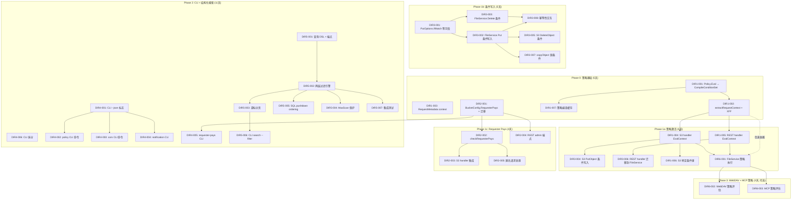
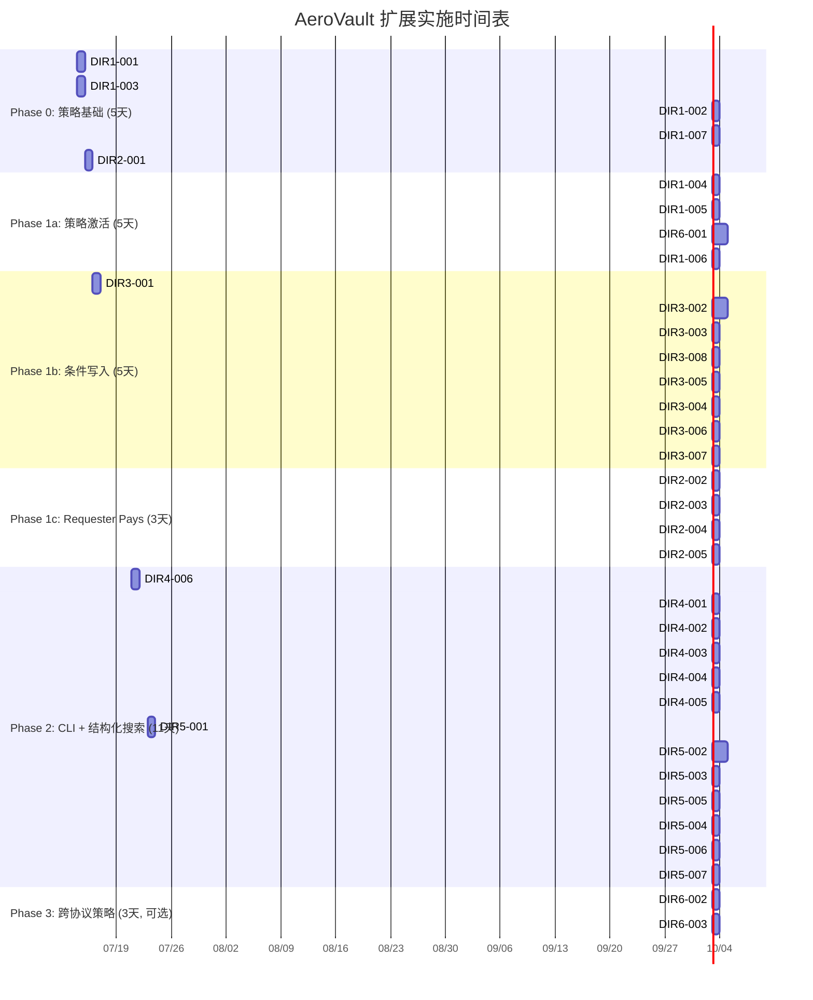

现在我有了完整的理解。让我提供 Tech Lead 分析。

---

# Tech Lead 分析：AeroVault 高价值扩展方向

## 前置背景

本次分析基于对代码库的完整验证和 `expansion-v134-high-value-extensions.out.arch.md` 文档。关键发现：

1. **`condition.go`（20+ 操作符的完整条件引擎）与 `policy.go`（仅检查 `IpAddress`/`NotIpAddress`）之间已存在架构脱节。** `ConditionContext`、`CompileConditionSet`、`EvalContext`、`PolicyDecision` 在 `condition.go` 中定义完好，但 `Policy.Eval(action, sourceIP string)` 完全未使用它们。这是一项**架构债务**，在添加新功能之前必须解决。

2. **`Put` 和 `Delete` 的 `FileService` 签名没有条件写入参数。** REST handler 在 `FileService` 之上自行处理 precondition 检查，而 S3 handler 完全跳过。这种跨协议的不一致性需要修复。

3. **桶策略检查在 REST handler（`rest/handler.go`）和 S3 handler（`s3compat/handler.go`）中分别实现。** 两个实现使用相同的模式（`checkBucketPolicy`），但 WebDAV 和 MCP 完全跳过了策略检查。

---

## 1. 任务分解

将评估中的五个方向拆解为可执行的任务。每个任务 2-4 小时，按方向分组。

### 方向 1：统一策略引擎（条件键集成）

| 任务 ID | 标题 | 涉及文件 | 前置依赖 | 工时 |
|---------|------|---------|---------|------|
| **DIR1-001** | 将 `Policy.Eval` 替换为使用 `CompileConditionSet` | `internal/auth/policy.go` | 无 | 3h |
| **DIR1-002** | 添加 `extractRequestContext(r)` 构建 `EvalContext`，含 `X-Forwarded-For` 支持 | `internal/auth/context.go`（新文件） | DIR1-001 | 4h |
| **DIR1-003** | 添加 `RequestMetadata` 上下文类型和中间件 | `internal/middleware/metadata.go`（新文件） | 无 | 2h |
| **DIR1-004** | 在 S3 handler 中使用 `EvalContext` 替换 `checkBucketPolicy` | `internal/api/s3compat/handler.go` | DIR1-001, DIR1-002 | 2h |
| **DIR1-005** | 在 REST handler 中使用 `EvalContext` 替换 `checkBucketPolicy` | `internal/api/rest/handler.go` | DIR1-001, DIR1-002 | 2h |
| **DIR1-006** | 添加 S3 特定条件键：`s3:prefix`、`s3:delimiter`、`s3:x-amz-acl`、`s3:x-amz-server-side-encryption` | `internal/auth/context.go`、`internal/api/s3compat/handler.go` | DIR1-002 | 4h |
| **DIR1-007** | 编译策略缓存（`sync.Map`，按 tenant/bucket） | `internal/auth/policy_cache.go`（新文件） | DIR1-001 | 2h |

**验收标准：** `Policy.Eval(ctx EvalContext)` 尊重所有 20+ 条件操作符。`StringEquals`、`Bool`、`DateLessThan` 等均通过测试。现有策略测试仍然通过。

### 方向 2：Requester Pays

| 任务 ID | 标题 | 涉及文件 | 前置依赖 | 工时 |
|---------|------|---------|---------|------|
| **DIR2-001** | 将 `RequesterPays` 字段添加到 `BucketConfig` + DB 迁移 | `internal/repository/repository.go`、`migrations/{sqlite,postgres}/NNNN_*.sql` | 无 | 3h |
| **DIR2-002** | 实现 `checkRequesterPays(ctx, bucket, tenant)` 逻辑 | `internal/service/file.go` | DIR2-001 | 3h |
| **DIR2-003** | 在 S3 handler `GetObject`/`HeadObject`/`ListObjectsV2` 中集成 Requester Pays 检查 | `internal/api/s3compat/handler.go` | DIR2-002, DIR1-004 | 2h |
| **DIR2-004** | 添加 REST API 管理端点：GET/PUT 桶 RequesterPays 配置 | `internal/api/rest/handler.go`、`router.go` | DIR2-001 | 2h |
| **DIR2-005** | 处理匿名请求的 Requester Pays 桶拒绝（S3 规范要求） | `internal/auth/auth_middleware.go`、`internal/api/s3compat/handler.go` | DIR2-002 | 2h |

**验收标准：** 匿名请求访问 Requester Pays 桶被拒绝。认证的非所有者租户在发送 `x-amz-request-payer` 时通过。桶所有者（admin scope）始终可以通过。可以在 REST API 中切换配置。

### 方向 3：条件写入

| 任务 ID | 标题 | 涉及文件 | 前置依赖 | 工时 |
|---------|------|---------|---------|------|
| **DIR3-001** | 将 `IfMatch`/`IfNoneMatch`/`IfUnmodifiedSince`/`IfModifiedSince` 添加到 `PutOptions` | `internal/service/file.go` | 无 | 2h |
| **DIR3-002** | 在 `FileService.Put` 中实现原子性条件写入（stat+check+upsert 在事务中） | `internal/service/file_crud.go` | DIR3-001 | 4h |
| **DIR3-003** | 在 `FileService.Delete` 中添加 `IfMatch`/`IfNoneMatch` 支持 | `internal/service/file_crud.go` | DIR1-001 | 3h |
| **DIR3-004** | 更新 S3 `PutObject` 以读取条件标头并传递给 `PutOptions` | `internal/api/s3compat/handler.go` | DIR3-002 | 2h |
| **DIR3-005** | 更新 S3 `DeleteObject` 以读取条件标头 | `internal/api/s3compat/handler.go` | DIR3-003 | 1h |
| **DIR3-006** | REST handler 迁移：使用 `FileService.Put` 的 `PutOptions.IfMatch` 而非自行检查 | `internal/api/rest/handler.go`、`conditional.go` | DIR3-002 | 2h |
| **DIR3-007** | 向 `copyObject` 添加 `x-amz-copy-source-if-*` 前置条件 | `internal/api/s3compat/extra.go` | DIR1-001, DIR3-002 | 3h |
| **DIR3-008** | 定义幂等性缓存命中与条件写入交互的语义 | `internal/middleware/idempotency.go`（需阅读） | DIR3-002 | 2h |

**验收标准：** S3 `PutObject` + `If-Match: "etag"` 在 etag 不匹配时返回 412。`PutObject` + `If-None-Match: "*"` 在对象存在时返回 412。`copyObject` + `x-amz-copy-source-if-none-match` 在源满足条件时返回 412。所有测试通过。

### 方向 4：CLI 扩展

| 任务 ID | 标题 | 涉及文件 | 前置依赖 | 工时 |
|---------|------|---------|---------|------|
| **DIR4-001** | 向 `upload`、`ls`、`search` 等现有命令添加 `--json`/`-o json` 输出标志 | `internal/cli/cli.go`、`internal/cli/cli_*.go` | 无 | 3h |
| **DIR4-002** | 添加 `policy set/get/delete` 命令 | `internal/cli/cli_admin.go`（新文件或扩展现有） | DIR1-001 | 4h |
| **DIR4-003** | 添加 `cors set/get/delete` 命令 | `internal/cli/cli_admin.go` | 无 | 3h |
| **DIR4-004** | 添加 `notification set/get/delete` 命令 | `internal/cli/cli_admin.go` | 无 | 4h |
| **DIR4-005** | 添加 `requester-pays set/get` 命令 | `internal/cli/cli_admin.go` | DIR2-001 | 2h |
| **DIR4-006** | 在 `cli.go` 中拆分过大的 `init()` 映射（保持在 ≤500 行约束内） | `internal/cli/cli.go`（可能拆分为多个文件） | 无 | 2h |

**验收标准：** 新命令以结构化 JSON 输出（`--json`）和人类可读文本形式工作。所有现有命令仍然有效。`cli.go` 保持在 ≤500 行。

### 方向 5：结构化搜索

| 任务 ID | 标题 | 涉及文件 | 前置依赖 | 工时 |
|---------|------|---------|---------|------|
| **DIR5-001** | 定义查询 DSL 结构和 POST 端点 | `internal/api/rest/search_objects.go`（新文件）、`router.go` | 无 | 3h |
| **DIR5-002** | 实现两层过滤引擎（安全推送 SQL 层 + 内存回退） | `internal/repository/sql_objects.go` | DIR5-001 | 4h |
| **DIR5-003** | 添加基于游标的分页支持 | `internal/repository/sql_objects.go`、`search_objects.go` | DIR5-002 | 3h |
| **DIR5-004** | 添加 `MaxScan` 保护（阈值 + 清晰错误） | `internal/repository/sql_objects.go` | DIR5-002 | 1h |
| **DIR5-005** | 为 `ordering` 添加 SQL pushdown：`size`、`created_at`、`content_type` | `internal/repository/sql_objects.go` | DIR5-002 | 2h |
| **DIR5-006** | 添加 CLI `search --filter` 使用新端点 | `internal/cli/cli.go` | DIR5-001, DIR4-001 | 2h |
| **DIR5-007** | 添加具有 50+ 对象 fixture 的集成测试 | `internal/api/rest/objects_search_test.go`（新文件） | DIR5-002 | 3h |

**验收标准：** `POST /v1/objects/search` 返回按标签、大小、content-type、storage-class 过滤的正确分页结果。游标分页正确。超过 `MaxScan` 返回清晰的错误。

### 附加补充方向

| 任务 ID | 标题 | 涉及文件 | 前置依赖 | 工时 |
|---------|------|---------|---------|------|
| **DIR6-001** | 将桶策略执行推送到 `FileService`（所有协议统一） | `internal/service/file.go`、`internal/middleware/metadata.go` | DIR1-003, DIR1-004, DIR1-005 | 4h |
| **DIR6-002** | 添加 WebDAV 策略评估 | `internal/api/webdav/handler.go`（需阅读） | DIR6-001 | 2h |
| **DIR6-003** | 添加 MCP 策略评估 | `internal/mcp/server.go`（需阅读） | DIR6-001 | 2h |

---

## 2. 执行顺序



**关键路径：** DIR1-001 → DIR1-002 → DIR1-004/1-005 → DIR3-004/3-006 → DIR3-002/3-003

### 并行任务组

| 并行组 | 任务 | 条件 |
|--------|------|------|
| **G1** | DIR1-001, DIR1-003, DIR2-001, DIR3-001, DIR4-006, DIR5-001 | 无前置依赖 |
| **G2** | DIR1-002, DIR1-007 | 需要 G1.DIR1-001 |
| **G3** | DIR1-004, DIR1-005 | 需要 G2.DIR1-002 |
| **G4** | DIR3-002, DIR3-003, DIR6-001 | 需要 G3.DIR1-004/1-005 |
| **G5** | DIR3-004, DIR3-005, DIR3-007, DIR3-006 | 需要 G4.DIR3-002 |
| **G6** | DIR2-002, DIR2-003, DIR2-004, DIR2-005 | 需要 G1.DIR2-001 |
| **G7** | DIR4-002/3/4/5, DIR5-002 | 需要 DIR4-001 |

---

## 3. 技术风险

### 3.1 高风险项

| 风险 | 概率 | 影响 | 缓解措施 |
|------|------|------|---------|
| **DIR3-002：条件写入的原子性** — `FileService.Put` 当前在写入存储之前检查锁，但 `stat`（来自 checkLockBeforeOverwrite）和 `put` 之间没有事务保护。对于条件写入，我们需要在同一个写入事务中进行 stat+check+upsert。 | **高** | **高** — 竞态条件可能导致静默覆盖 | 在 `Put` 开始时添加数据库事务（BEGIN + ROLLBACK/COMMIT）。条件检查在事务内进行。版本化桶的乐观锁使用 `UPDATE ... WHERE version_id = ?` 进行 CAS。 |
| **DIR1-001：现有策略在迁移时的行为变化** — 当前 `matchesConditions` 只检查 `IpAddress`/`NotIpAddress`。迁移到全 `CompileConditionSet` 可能会意外改变现有策略的行为。 | **中** | **严重** — 桶可能静默拒绝访问 | 分 3 步迁移：(1) 添加新路径，仅通过控制标志激活；(2) 运行集成测试套件并验证输出匹配；(3) 删除旧路径。在 `policy_test.go` 中彻底记录每个 S3 策略场景。 |
| **DIR5-002：内存过滤扩展性** — 安全 pushdown + 内存回退模型对大型桶（>100K 对象）效果不佳。 | **中** | **高** — 超时/内存耗尽 | 实施 `MaxScan` 阈值（默认 100K）。记录扩展限制。为 Postgres 用户提供 JSON pushdown 路径（使用 `json_extract` 处理标签）。 |
| **DIR3-007：`copyObject` 源条件 — 零字节复制和预签名 URL 语义** — S3 规范要求 `x-amz-copy-source-if-*` 作用于源的当前状态，而目标条件作用于目标。当前的 `copyObject` 实现是 GET+PUT，没有条件。条件源检查需要在调用 `Get` 源之前进行单独的 `Stat` 调用。 | **中** | **中** — 行为错误 | 在 copyObject 开始时添加显式的源 stat 和条件检查。使用 `evalS3GetPreconditions`（已在 `s3compat/conditional.go` 中存在）。 |
| **DIR2-001 + DIR2-005：Requester Pays 的匿名请求拒绝 — 与当前 auth 中间件的交互** — 如果 auth 中间件在 Requester Pays 检查之前拒绝匿名请求，则 Requester Pays 的“对匿名请求返回 403”规范要求可能无法正确实现。 | **低** | **中** | 在 auth 中间件中添加“Requester Pays 桶”例外：匿名请求通过 auth，然后 Requester Pays 检查返回正确的 S3 错误响应。 |

### 3.2 中等风险项

| 风险 | 缓解措施 |
|------|---------|
| **DIR3-008：幂等性-条件写入语义** — 幂等性缓存命中应该跳过条件检查（原始请求已满足）。但幂等性中间件在`rest/router.go`的 handler 组合中运行。需要仔细检查链接顺序。 | 幂等性中间件在响应中记录幂等性键加上已评估的条件状态。缓存命中返回存储的状态，不重新评估。 |
| **DIR1-006：`s3:prefix` 条件键可用性** — `s3:prefix` 仅在 `ListObjectsV2` 中可用（请求参数），但在 `GetObject` 或其他对象操作中不可用。条件键引擎需要“延迟求值”——仅在条件键需要时才提取值。 | 实现已经在 `ConditionContext.Get(key)` 中使用惰性求值模式。为 S3 特定键扩展 `extra` map。 |
| **DIR6-001：将策略推送到 FileService 的性能影响** — 每次 `Put`/`Get`/`Delete` 操作都需要加载 `BucketConfig`（已缓存）并评估策略。 | `BucketConfig` 已经由 `repo.GetBucketConfig` 缓存（每个操作一个调用）。策略条件在编译为 `func` 后不到 1μs。使用 DIR1-007 添加编译策略缓存以避免重复编译。 |
| **DIR4-002/3/4：CLI JSON/XML 输出格式** — `policy set` 和 `cors set` 需要从标准输入或文件参数中读取 JSON/XML。解析错误需要清晰的用户体验。 | 为所有“set”命令实施“从文件读取或从 STDIN 读取”模式。对 JSON 解析错误使用 `json.Decoder` 和清晰的错误包装。 |

### 3.3 外部依赖和系统假设

| 依赖 | 风险 | 缓解措施 |
|------|------|---------|
| **SQLite 事务隔离** — SQLite 仅支持可序列化隔离级别，因此并发写入在写操作期间将等待。这对于条件写入的“stat+check+upsert 在事务中”方法可以接受，但高并发场景可能看到争用。 | 记录 SQLite 的扩展限制。对于 Postgres 用户，使用 `SELECT ... FOR UPDATE` 进行悲观锁定。 |
| **`X-Forwarded-For` 信任配置** — `X-Forwarded-For` 可以被客户端伪造。需要可信代理列表。 | 添加 `TRUSTED_PROXY_CIDRS` 配置（默认空 = 仅使用 `RemoteAddr`）。在 `extractRequestContext` 中，仅当请求来自可信代理时才信任 `X-Forwarded-For`。 |

---

## 4. 资源评估

### 4.1 所需技能和人员

| 角色 | 数量 | 关键技能 | 覆盖范围 |
|------|------|---------|---------|
| **后端开发者 A（高年级）** | 1 | Go 并发、数据库架构、IAM/策略、事务语义 | Phase 0（策略统一）+ Phase 1b（条件写入） |
| **后端开发者 B（中年级）** | 1 | Go REST API 开发、CLI 构建、SQL 优化 | Phase 1c（Requester Pays）+ Phase 2（CLI + 结构化搜索） |
| **QA/测试工程师** | 1 | Go 测试、`httptest`、集成测试、S3 协议知识 | 从第 1 天开始交叉覆盖测试 |

**总人数：** 3（2 名开发 + 1 名 QA），排期为 3-4 周的 sprint

### 4.2 关键里程碑

| 里程碑 | 截止日期（工作天数） | 可交付成果 |
|---------|-------------------|-----------|
| **M0：基础就绪** | Day 5 | `Policy.Eval(ctx EvalContext)` 工作，所有条件操作符，X-Forwarded-For。所有现有策略测试通过。 |
| **M1：数据完整性** | Day 11 | S3 和 REST 上的条件写入工作。`copyObject` 源条件工作。所有写入前置条件测试通过。 |
| **M2：成本分配** | Day 14 | Requester Pays 完全实现（S3 + REST admin + CLI）。跨协议策略统一。 |
| **M3：可脚本化操作** | Day 20 | CLI `--json` 标志 + 所有 admin 命令。结构化搜索端点工作。 |
| **M4：发布候选** | Day 24 | 全集成测试套件通过。性能通过。文档更新。 |

### 4.3 阻塞点及策略

| 阻塞点 | 性质 | 策略 |
|--------|------|------|
| **`FileService.Put` 事务化** — 当前 `Put` 在写入存储后 upsert 元数据，不在事务中。添加事务需要检查 `repository.Repository` 接口是否暴露 `BeginTx`。 | 技术 | 添加 `Repository.BeginTx(ctx) (Tx, error)`，其中 `Tx` 具有 `Rollback`/`Commit` 方法 + 每个操作的方法变体（`TxCreateObject`、`TxUpdateObject`）。保持接口最小化。 |
| **`BucketConfig.Policy` 解析性能** — 每个策略评估重新解析 JSON。 | 性能 | DIR1-007（编译策略缓存）：编译一次，在 `GetBucketConfig` 调用之间缓存。使用 `sync.Map` 按 `(tenant, bucket)` 键控，在 `PutBucketPolicy` 上使其失效。 |
| **SQLite `INSERT ... ON CONFLICT` 限制** — 条件写入中的原子 upsert 需要在 PostgreSQL 和 SQLite 上工作。 | 兼容性 | SQLite 支持 `INSERT ... ON CONFLICT DO UPDATE`，与 PostgreSQL 9.5+ 相同。实现共享查询。仅在 `RETURNING` 子句上有所不同——为每个实现单独的函数。 |

---

## 5. 质量保证

### 5.1 单元测试覆盖要求

| 组件 | 现有覆盖率（估计） | 目标覆盖率 | 关键测试场景 |
|------|-------------------|-----------|-------------|
| `internal/auth/policy.go` | 60%（仅 IpAddress 测试） | **90%** | 每个条件操作符类型（8 个系列的测试）、DenyOverride、多重条件块、空策略、通配符、Principal 解析、`X-Forwarded-For` 回退、可信代理 CIDR |
| `internal/auth/condition.go` | 80%（验证） | **95%** | 所有 20+ 操作符，边缘情况：空上下文、未知键、无效日期格式、无效数字、`StringLike` 转义、边界 IP 范围 |
| `internal/service/file_crud.go` | 50% | **85%** | 条件 PUT（IfMatch 匹配/不匹配、IfNoneMatch CREATE、IfUnmodifiedSince）、条件 DELETE、事务回滚、幂等性-条件交互 |
| `internal/api/s3compat/handler.go` | 30% | **75%** | `PUT` + `If-Match: "etag"` → 412/200, `DELETE` + `If-None-Match` → 412, `copyObject` + `x-amz-copy-source-if-match` |
| `internal/cli/cli.go` | 20% | **70%** | 每个新命令的单元测试、`--json` 输出验证、错误输入、JSON 解析、API 错误传播 |

**约束：** 新的 `#nosec` 抑制必须包含解释性注释。所有新代码必须 `gofmt` 通过，`go vet` 无输出。圈复杂度 ≤10 通过 `gocyclo` 验证。

### 5.2 集成测试策略

| 焦点 | 方法 | 工具 | 环境 |
|------|------|------|------|
| **S3 条件写入** | `httptest.Server` + S3 SDK 客户端。PUT etag、PUT If-None-Match:*、PUT If-Match:wrong→412 | `net/http/httptest` + `github.com/aws/aws-sdk-go-v2/service/s3` | SQLite + local FS |
| **Requester Pays 拒绝** | 发送 GET 到 RequesterPays bucket 而没有 `x-amz-request-payer` → 403 | `httptest` | SQLite + local FS |
| **策略条件键** | 使用全条件块的 PUT 策略策略。然后验证请求是否被拒绝。 | `httptest` | SQLite + local FS |
| **结构化搜索** | 播种 50 个对象，过滤标签/大小/content-type。验证分页、游标、排序。 | `httptest` + fixture 数据 | SQLite + local FS |
| **CLI 端到端** | 启动服务器，通过 CLI 执行命令，验证 HTTP 输出 | Go `os/exec` | SQLite + local FS，临时端口 |

**Postgres 测试：** `//go:build integration` 保护。需要 Docker。CI gate 外。

### 5.3 代码审查要点

| 模块 | 审查重点 |
|------|---------|
| `internal/auth/condition.go` | 新的条件键（`s3:prefix` 等）是否正确实现了惰性求值模式？IP 匹配是 IPv4 和 IPv6 安全的吗？ |
| `internal/service/file_crud.go` | 事务边界是正确的吗？如果存储写入成功但元数据 upsert 失败，是否回滚？（当前：存储 blob 写后无法回滚。可接受，但需记录。） |
| `internal/api/s3compat/handler.go` | S3 错误响应是否符合 AWS 规范（正确的状态码 + XML 主体）？`x-amz-request-payer` 的 `x-amz-request-charged` 响应头是否存在？ |
| `internal/cli/cli*.go` | `--json` 标志是否适用于所有命令？退出码是否正确（0 = 成功，1 = 运行时错误，2 = 用法错误）？ |
| `migrations/` | 命名前缀是否与现有文件连续？`down` 迁移是否正确地反转了 `up`？SQLite/Postgres 之间是否存在方言差异？ |

### 5.4 性能测试需求

| 测试 | 工具 | 阈值 | 触发条件 |
|------|------|------|---------|
| 条件写入吞吐量 | `go-wrk` 或自定义 benchmark | 与无条件 PUT 相比 ≤10% 延迟增加（由于事务开销） | DIR3-002 合并后 |
| 策略评估延迟 | Go `benchmark` | `Policy.Eval` < 5μs（编译后） | DIR1-001 合并后 |
| 结构化搜索延迟（100K 对象） | 自定义 benchmark | `POST /v1/objects/search` 在大型数据集的过滤器上 < 500ms | DIR5-002 合并后 |
| CLI 启动时间 | `time` 命令 | `aero-vault cli help` < 100ms | DIR4-后各命令合并 |

---

## 6. 实施计划

### 总览：3-4 周 sprint（24 个工作日，2 名开发 + 1 名 QA）



### 每日节奏

```
09:00 - 09:15  每日站会（所有 3 人）
09:15 - 12:00  编码（开发 A：Phase 0/1，开发 B：Phase 1c/2）
12:00 - 13:00  午餐
13:00 - 15:00  编码 + 测试
15:00 - 16:00  代码审查（开发 A 审查开发 B，反之亦然）
16:00 - 16:30  QA 测试当前阶段的可交付成果
16:30 - 17:00  文档更新 + 提交
```

### 阶段 1 详细时间表（最关键的 10 天）

| 天 | 开发 A（策略 + 条件写入） | 开发 B（Requester Pays + CLI 基础） | QA |
|----|-----------------------|-----------------------------------|----|
| **D1** | DIR1-001（Policy + Condition 集成） | DIR1-003（RequestMetadata 上下文）+ DIR2-001（BucketConfig + 迁移） | 审查 condition.go/policy.go 测试 |
| **D2** | DIR1-002（extractRequestContext + XFF） | DIR3-001（PutOptions 新字段）+ DIR4-006（CLI 拆分） | 为现有策略编写集成测试 |
| **D3** | DIR1-004 + DIR1-005（S3/REST EvalContext） | DIR2-002（checkRequesterPays）+ DIR2-004（REST admin） | 验证策略不回归 |
| **D4** | DIR6-001（FileService 策略执行） | DIR2-003（S3 RequesterPays）+ DIR2-005（匿名拒绝） | 测试 Requester Pays 场景 |
| **D5** | DIR3-002（FileService 条件 PUT，事务） | DIR3-003（FileService 条件 DELETE）+ DIR1-007（缓存） | 审查条件写入的事务逻辑 |
| **D6** | DIR3-004 + DIR3-006（S3/REST 集成） | DIR4-001（CLI --json） | 测试 S3 条件写入（aws-sdk-go） |
| **D7** | DIR3-007（copyObject 源条件）+ DIR3-005（S3 Delete） | DIR3-008（幂等性-条件）+ DIR4-002（policy CLI） | 测试 copyObject 源条件 |
| **D8** | DIR1-006（S3 特定条件键） | DIR4-003 + DIR4-004（cors + notification CLI） | 全 Phase 1 集成测试运行 |
| **D9** | 性能测试 + 修复 | DIR4-005（requester-pays CLI）+ DIR5-001（查询 DSL） | 回归套件 |
| **D10** | Phase 1 文档 + 代码审查 | 错误修复 + 测试加固 | `make check` 门通过 |

### 发布检查清单

| 项目 | 标准 |
|------|------|
| ✅ `gofmt -l .` | 零输出 |
| ✅ `go vet ./...` | 零警告 |
| ✅ `go test ./...` | 全绿（零网络、零 Docker、SQLite + local FS） |
| ✅ `gocyclo` | 圈复杂度 ≤10 每个函数 |
| ✅ 文件长度 | 所有文件 ≤500 行 |
| ✅ 无 `utils/`、`common/`、`helper/` 包 | 无新违规 |
| ✅ 迁移 | 双 SQLite/Postgres 文件，无已应用迁移的编辑 |
| ✅ 新的 Storage backend？ | 通过 `storage/contract_test.go` |
| ✅ OpenAPI 更新 | 新端点添加到 `openapi.json` |

---

## 总结建议

### 必须做的（高优先级）

1. **立即开始 DIR1-001（Policy.Eval 集成）。** 这是其他所有工作的基础阻塞点。`condition.go` 中的代码已经编写完毕，但未被使用——这是一项“寻找已完成的 80%”的重构工作，而不是新功能开发。

2. **将条件写入作为 Phase 1 的下一个部分。** 评估是正确的：条件写入解决的是数据完整性问题，其紧迫性高于 Requester Pays（成本分配问题）。`PutOptions.IfMatch` 的设计最小且向后兼容。

3. **在 CLI 工作开始时添加 `--json` 标志。** 如果在所有命令中添加，需要一次性完成，这样以后就不需要重新访问每个命令。

### 值得做的（中优先级）

4. **将 Requester Pays 放在条件写入之后，但在结构化搜索之前。** 这是一项定义明确的功能（3-4 天），对多租户产品化有高感知价值。

5. **结构化搜索的 DSL 设计应记住未来的 S3 Select 兼容性。** SQL 表达式解析映射到 DSL 的能力是设计决策中需要考虑的因素。

### 可选（低优先级，Phase 3）

6. **WebDAV/MCP 策略执行。** 只有在获得证明协议是安全漏洞的报告（如 pentest 结果）后才执行。当前，这些协议供受信任的内部用户使用。

### 估计

| 阶段 | 工作日 | 累计 |
|-------|--------|-------------|
| Phase 0（策略基础） | 5 | 5 |
| Phase 1a（策略激活） | 5 | 10 |
| Phase 1b（条件写入） | 5 | 15 |
| Phase 1c（Requester Pays） | 3 | 18 |
| Phase 2（CLI + 搜索） | 11 | 29 |
| **总计（Phase 0-2）** | **24 天** | **约 5 周**（2 名开发人员并行 = 约 3 周日历时间） |

最后的数据：2 名开发人员 + 1 名 QA 在 **约 3 周日历时间** 内交付四个 P1 功能方向 + CLI 扩展。
