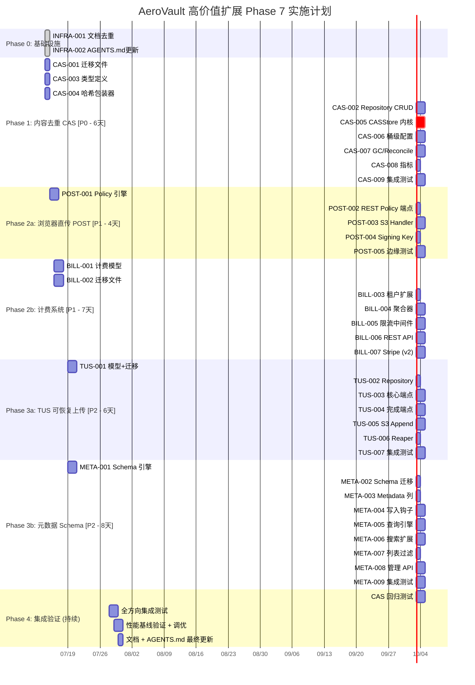

Now I have all the context needed. Let me produce the comprehensive Tech Lead analysis.

---

# Tech Lead 分析报告：AeroVault 高价值扩展方向（第七期）

## 概览

本文档验证了 5 个扩展方向在现有代码库中的**零覆盖**（代码锚点已验证准确，11/12 个主张通过），并提供了详细的架构蓝图。以下从技术实现与项目管理角度进行深入分析。

---

## 1. 任务分解

基于文档中的 5 个方向，结合工程约束（单文件 ≤500 行、单函数 ≤50 行、圈复杂度 ≤10），拆解为以下可执行任务。**每个任务粒度 2-4 小时**。

### 方向 A：内容去重 & 内容寻址存储（CAS）

| 任务 ID | 标题 | 涉及文件 | 前置 | 工时 | 验收标准 |
|---------|------|---------|------|------|---------|
| **CAS-001** | 新增 `content_hashes` 表迁移（sqlite + postgres 双文件） | `internal/repository/migrations/{sqlite,postgres}/0006_content_hashes.{up,down}.sql` | — | 2h | 迁移后 `content_hashes` 表存在：`hash`, `cas_key`, `ref_count`, `size_bytes`, `first_tenant`, `created_at`；注意 I1（SQL 占位符编号）+ I2（双文件） |
| **CAS-002** | Repository 层：`content_hashes` CRUD 方法 | `internal/repository/sql_content_hashes.go` + `internal/repository/repository.go` 接口扩展 | CAS-001 | 3h | `LookupContentHash`, `IncrementRefCount`, `DecrementRefCount`, `ListOrphanContentHashes` 方法实现 + 单元测试覆盖 CRUD + 引用计数边界（0→1→2→1→0） |
| **CAS-003** | `ContentHash` 类型 + CAS 配置定义 | `internal/storage/cas/types.go` | — | 2h | 定义 `ContentHash [32]byte`, `CASConfig{MinSize, CrossTenant}`；`ContentHash` 实现 `String()` / `MarshalText()`；禁止 God 类型（≤300 行） |
| **CAS-004** | Streaming SHA-256 计算包装器 | `internal/storage/cas/hash.go` | CAS-003 | 2h | `NewHashingReader(r io.Reader) → (io.Reader, ContentHash)` 在读取时流式计算哈希；单元测试覆盖空输入、大输入（100MB 模拟） |
| **CAS-005** | `CASStore` 实现（核心逻辑） | `internal/storage/cas/store.go` | CAS-002, CAS-003, CAS-004 | 4h | `Put` 方法：① streaming 计算哈希 ② `repo.LookupContentHash` ③ 命中 → refCount++ ④ 未命中 → `store.Put(casKey)` + 写入 content_hash 行；注意 I3（storage key `cas/{hash[:2]}/{hash}`）；PutOptions 新增 `UseCAS bool`；引文计数竞争条件通过事务保护 |
| **CAS-006** | 桶级 CAS 配置（migration + API） | `internal/repository/migrations/.../0007_bucket_cas.up.sql` + `internal/api/rest/bucket_handler.go` | CAS-005 | 3h | 桶表新增 `content_dedup bool`；`PUT /v1/buckets/{bucket}?cas=true` 端点；`POST /v1/files/{key}?cas=true` 请求级覆盖；**注意：** 遵守工程约束 I5（opt-in 安全默认，默认 false） |
| **CAS-007** | 引用计数 GC + Reconcile 扩展 | `internal/reconcile/cas_gc.go` | CAS-005 | 3h | `DecrementRefCount` 归零后 enqueue 异步删除 cas blob；`reconcile` 增加 `orphan_content_hashes` sweep；幂等且可重跑 |
| **CAS-008** | 去重指标 + Telemetry | `internal/telemetry/cas_metrics.go` | CAS-005 | 2h | `storage_dedup_bytes_saved`, `storage_dedup_ratio`, `storage_dedup_refcount_histogram`；Prometheus 指标注册 |
| **CAS-009** | CAS 集成测试 | `internal/storage/cas/cas_test.go` + `internal/integration/cas_test.go` | CAS-005→CAS-008 | 3h | 单元测试：哈希匹配/不匹配/引用计数/并发竞争；集成测试：通过 REST/S3 写入 → 验证去重表现；**注意：** 遵守 `storage.contract_test.go` 契约测试模式 |

**合计工时：24h（6 人·天）**

### 方向 B：浏览器直传 / S3 POST Object

| 任务 ID | 标题 | 涉及文件 | 前置 | 工时 | 验收标准 |
|---------|------|---------|------|------|---------|
| **POST-001** | `PostPolicy` 模型 + Policy 签名引擎 | `internal/auth/postpolicy.go` | — | 4h | `PostPolicy{Expiration, Conditions}` 类型 + `Encode()` `Sign()` `Verify()`；HMAC-SHA256 签名；条件类型：`eq`, `starts-with`, `content-length-range`；注意 I6（stdlib 优先，HMAC 使用 `crypto/hmac`） |
| **POST-002** | REST API：预签名 Policy 端点 | `internal/api/rest/handler.go` + `router.go` | POST-001 | 2h | `GET /v1/files/{key}/presign?op=post&expires=3600` 返回 `{url, policy, signature, fields}`；复用已有 presign 路由模式 |
| **POST-003** | S3 POST Object Handler | `internal/api/s3compat/post.go` | POST-001 | 4h | `PostObject` Handler：从 multipart/form-data 提取 policy + signature → base64 解码 → Verify → `h.svc.Put()` → 返回 204 / `success_action_redirect`；路由 `POST /{bucket}/{key+}`（与 `?uploads` 参数判别）；S3 XML 响应格式 |
| **POST-004** | POST Handler 鉴权：独立 Signing Key | `internal/auth/postpolicy.go` + `internal/api/s3compat/post.go` | POST-003 | 2h | 独立 `POST_SIGNING_KEY` 配置（不共享 API Key）；policy 签名密钥可设置 scope 限制（仅签名，无读权限） |
| **POST-005** | POST 上传边缘测试 | `internal/api/s3compat/post_test.go` + `internal/api/rest/presign_post_test.go` | POST-003, POST-004 | 3h | 边缘场景：过期 policy（403 ExpiredToken）、大小超限（EntityTooLarge）、key 前缀越权（AccessDenied）、CORS preflight、并发上传同 key |

**合计工时：15h（~4 人·天）**

### 方向 C：计费 & 用量计量系统

| 任务 ID | 标题 | 涉及文件 | 前置 | 工时 | 验收标准 |
|---------|------|---------|------|------|---------|
| **BILL-001** | 计费模型 + 套餐定义 | `internal/billing/plan.go` | — | 3h | `Plan` / `Included` / `Overages` 类型；`LoadPlans(path)` 从 YAML 加载套餐（`deploy/plans.yaml`）；注意：套餐定义为配置驱动，不重启生效；约束 I6（无额外外部依赖） |
| **BILL-002** | 计费表迁移（5 表） | `internal/repository/migrations/{sqlite,postgres}/0008_billing.{up,down}.sql` | — | 3h | `billing_subscriptions`, `billing_daily_usage`, `billing_invoices`, `billing_adjustments`, `billing_payments`；注意 I1（$N 编号） + I2（双文件） |
| **BILL-003** | 租户表扩展：`billing_plan` 字段 | `internal/repository/migrations/.../0009_tenant_billing.up.sql` + `internal/repository/tenants.go` | BILL-002 | 2h | `tenants` 表新增 `billing_plan`, `billing_status`；`Subscription` CRUD |
| **BILL-004** | 每日用量聚合器 | `internal/billing/aggregator.go` + `internal/jobs/billing_job.go` | BILL-002, BILL-003 | 4h | 每日 00:05 cron 聚合 storage_bytes / objects / ai_usage → `billing_daily_usage`；月初 00:10 生成 `billing_invoices`（pending）；作业通过 `main.go:jobReg.Register` 注册（见 AGENTS.md 扩展入口） |
| **BILL-005** | 超量限流中间件 | `internal/middleware/billing_middleware.go` | BILL-003 | 3h | FileService 写入前检查是否超量：免费层超限 → `402 Payment Required`；AI 超额 → 降级为 BM25-only（已有 BudgetExceeded 模式可复用）；读取不受限（设计决策） |
| **BILL-006** | 计费 REST API | `internal/api/rest/billing_handler.go` + `router.go` | BILL-003, BILL-004 | 3h | `GET /v1/admin/billing/plans`, `POST /v1/admin/billing/subscribe`, `GET /v1/admin/billing/invoices`, `GET /v1/admin/billing/usage`（当前周期用量+预估费用） |
| **BILL-007** | Stripe 集成（可选阶段） | `internal/billing/stripe.go` | BILL-006 | 4h | Stripe Webhook 接收：`invoice.paid` → 解锁超量限制；`payment_failed` → `payment_past_due`；`customer.subscription.*` → 同步套餐变更；注意：stripe-go SDK 将成为唯一新依赖，需论证 |

**合计工时：22h（~5.5 人·天）**；Stripe 集成可延迟到 Phase 2

### 方向 D：可恢复上传会话（TUS 模式）

| 任务 ID | 标题 | 涉及文件 | 前置 | 工时 | 验收标准 |
|---------|------|---------|------|------|---------|
| **TUS-001** | `UploadSession` 模型 + 表迁移 | `internal/api/rest/upload_session.go` + `internal/repository/migrations/.../0010_upload_sessions.{up,down}.sql` | — | 3h | `UploadSession{ID, TenantID, Bucket, Key, ... ReceivedBytes, Status}`；迁移后 `upload_sessions` 表活跃；注意 I1 + I2 |
| **TUS-002** | Upload Session Repository 层 | `internal/repository/sql_uploads.go` | TUS-001 | 2h | `CreateSession`, `GetSession`, `UpdateReceivedBytes`, `CompleteSession`, `ExpireSession`；幂等：`completed_at != NULL` 时返回已有 Location |
| **TUS-003** | TUS 核心端点（POST/HEAD/PATCH/DELETE） | `internal/api/rest/upload_session_handler.go` + `router.go` | TUS-002 | 4h | `POST /uploads` → 创建（返回 Location: `/uploads/{id}`）；`HEAD /uploads/{id}` → `Upload-Offset` 头；`PATCH /uploads/{id}` → 追加数据（`Upload-Offset` 校验）；`DELETE /uploads/{id}` → 取消；互斥锁防止并发 PATCH（`409 Conflict`）；TUS 协议头 `Tus-Resumable: 1.0.0` |
| **TUS-004** | Session 完成端点 + 对象组装 | `internal/api/rest/upload_session_handler.go` | TUS-003 | 3h | `POST /uploads/{id}/complete` → 验证内容完整性 → rename 临时文件到对象路径 → 返回对象元数据；临时文件 key: `.sessions/{tenant}/{session_id}.tmp`；注意 I3（storage key 规则） |
| **TUS-005** | S3 后端追加写支持 | `internal/storage/s3.go:Append` + `internal/storage/storage.go` 接口扩展 | TUS-004 | 4h | `Storage` 接口新增 `Append(ctx, key, offset, r) error`；S3 后端：使用 Multipart Upload 内部管理（服务端控制分片边界）；local 后端：truncate+write（或 append-only）；**注意：** 接口变更影响所有 Storage backend，需实现默认 `UnsupportedOperation` 错误 |
| **TUS-006** | Session Reaper（过期清理） | `internal/reconcile/upload_session_reaper.go` | TUS-002 | 2h | 每 10 分钟扫描 `created_at < now - TTL` 的 session → `status=expired` + 删除临时文件；可配置 `UPLOAD_SESSION_TTL_HOURS=72`；幂等 |
| **TUS-007** | TUS 集成测试 | `internal/api/rest/upload_session_test.go` + `internal/integration/tus_test.go` | TUS-003→TUS-006 | 3h | 模拟网络中断后续传（中断后 HEAD 查偏移 → PATCH 继续）；并发冲突（`409`）；Session TTL 过期；后端切换测试（local / S3 mock） |

**合计工时：21h（~5 人·天）**

### 方向 E：结构化元数据 Schema & 全文检索

| 任务 ID | 标题 | 涉及文件 | 前置 | 工时 | 验收标准 |
|---------|------|---------|------|------|---------|
| **META-001** | Schema 模型 + 验证引擎 | `internal/metadata/schema.go` | — | 4h | `FieldType`（string/number/boolean/date/array/object）、`FieldDef`（Required/Default/Enum/Pattern/MinLength/MaxLength/Minimum/Maximum/Indexed）、`Schema`（Version/Bucket/Fields）；`Validate(metadata map[string]any, schema Schema) error` 实现类型校验+必填+枚举+正则+范围检查 |
| **META-002** | Schema 管理迁移 + Repository | `internal/repository/migrations/.../0011_metadata_schemas.{up,down}.sql` + `internal/repository/sql_metadata.go` | META-001 | 3h | `metadata_schemas` 表（所有版本并存，见决策记录）；Schema CRUD；`GetLatestSchema(bucket)` `GetSchema(id, version)` |
| **META-003** | objects 表新增 metadata JSON 列（迁移） | `internal/repository/migrations/.../0012_object_metadata.{up,down}.sql` | META-002 | 2h | objects 表新增 `metadata TEXT` 列（SQLite 兼容 JSON 存储）；Postgres：`JSONB` + GIN 索引；SQLite：表达式索引 `json_extract(metadata, '$.author')`；注意：需兼容查询抽象层（`sql_helpers.go`） |
| **META-004** | 元数据写入 + Schema 校验钩子 | `internal/service/file.go:PutOptions` 扩展 + `internal/service/file_crud.go:Put` | META-001, META-003 | 3h | `PutOptions.Metadata` 类型改为 `map[string]any`（支持嵌套）；Put 路径中调用 `schema.Validate()`；校验失败 → `400 Bad Request` + 具体错误信息；向后兼容：`map[string]string` 自动转换 |
| **META-005** | 元数据搜索查询引擎 | `internal/metadata/query.go` + `internal/repository/sql_helpers.go` | META-003 | 4h | `BuildMetadataWhere(conditions) → (whereClause, args)`；Postgres/SQLite 兼容语法；查询语法：`meta.field=value`, `meta.field.gt=100`, `meta.field.like=John*`, `meta.nested.key=val`；JSON 路径转义防注入 |
| **META-006** | `/v1/search` 元数据过滤扩展 | `internal/api/rest/search.go` | META-005 | 3h | `GET /v1/search?meta.author=John&meta.pages.gt=10` → 语义+属性交集查询；返回同时匹配语义和属性的结果；不启用 AI 时退化为纯元数据搜索（与现有 `503` 行为一致？建议退化为精确匹配搜索） |
| **META-007** | `/v1/files` 列表元数据过滤 | `internal/api/rest/handler.go:ListObjects` | META-005 | 2h | `GET /v1/files?prefix=docs/&meta.status=published` → 在 prefix 过滤基础上加 metadata WHERE 子句；分页支持（marker + limit） |
| **META-008** | Schema 管理 API + 路由注册 | `internal/api/rest/metadata_handler.go` + `router.go` | META-002 | 3h | `POST/GET/DELETE /v1/admin/metadata/schemas`, `GET/PUT /v1/admin/metadata/schemas/{id}`；scope 校验（admin only） |
| **META-009** | 元数据集成测试 | `internal/integration/metadata_test.go` | META-004→META-008 | 3h | Schema 创建 → 写入对象（通过 REST/S3）→ 元数据搜索 → Schema 版本演进 → 缺失字段查询容错；性能基线（100 万对象搜索 < 100ms with index） |

**合计工时：27h（~7 人·天）**

### 工程基础任务（所有方向共享）

| 任务 ID | 标题 | 涉及文件 | 前置 | 工时 | 验收标准 |
|---------|------|---------|------|------|---------|
| **INFRA-001** | 文档去重：合并 v135 和 v7 版本 | `docs/requirements/` | — | 1h | 删除 `expansion-v7-fresh-horizons.md`，保留 `expansion-v135` 为规范版本；更新 README 引用 |
| **INFRA-002** | 更新 AGENTS.md + 当前 Sprint 路线图 | `AGENTS.md` + `docs/agent/CURRENT_SPRINT.md` | 全部 | 1h | AGENTS.md 第三节（Feature Matrix）新增 5 个方向的状态标志；CURRENT_SPRINT 更新为下一期目标；`TASK.md` 更新为当前任务追踪 |

---

**总工时估算：**

| 方向 | 人·天 | 并行度 | 优先级 |
|------|--------|--------|--------|
| A. 内容去重 CAS | 6 | ✅ 高并行 | **P0**（TCO 核心竞争力） |
| B. 浏览器直传 POST | 4 | ✅ 中并行 | **P1**（Web 集成断裂） |
| C. 计费系统 | 5.5 | ⚠️ 低并行 | **P1**（SaaS 前提） |
| D. 可恢复上传 TUS | 5 | ⚠️ 低并行 | **P2**（大文件优化） |
| E. 元数据 Schema | 7 | ✅ 高并行 | **P2**（差异化竞争力） |
| INFRA | 0.25 | — | **P0**（开工前提） |
| **合计** | **~27 人·天** | | |

---

## 2. 执行顺序与任务依赖图

```mermaid
graph TD
    subgraph "Phase 0: 基础设施 (Day 1)"
        INFRA-001["INFRA-001 文档去重"]
        INFRA-002["INFRA-002 更新 AGENTS.md/Sprint"]
    end

    subgraph "Phase 1: CAS 内容去重 (Days 1-6)"
        CAS-001["CAS-001 迁移文件"]
        CAS-003["CAS-003 类型定义"]
        CAS-004["CAS-004 哈希包装器"]
        
        CAS-002["CAS-002 Repository CRUD"]
        CAS-005["CAS-005 CASStore 内核"]

        CAS-006["CAS-006 桶级配置"]
        CAS-007["CAS-007 GC/Reconcile"]
        CAS-008["CAS-008 指标"]
        
        CAS-009["CAS-009 集成测试"]
    end

    subgraph "Phase 2a: POST 浏览器直传 (Days 4-7)"
        POST-001["POST-001 Policy 引擎"]
        POST-002["POST-002 REST Policy 端点"]
        POST-003["POST-003 S3 Handler"]
        POST-004["POST-004 Signing Key"]
        POST-005["POST-005 边缘测试"]
    end

    subgraph "Phase 2b: Billing 计费 (Days 5-11)"
        BILL-001["BILL-001 计费模型"]
        BILL-002["BILL-002 迁移文件"]
        BILL-003["BILL-003 租户扩展"]
        BILL-004["BILL-004 聚合器"]
        BILL-005["BILL-005 限流中间件"]
        BILL-006["BILL-006 REST API"]
        BILL-007["BILL-007 Stripe (v2)"]
    end

    subgraph "Phase 3a: TUS 可恢复上传 (Days 7-12)"
        TUS-001["TUS-001 模型+迁移"]
        TUS-002["TUS-002 Repository"]
        TUS-003["TUS-003 核心端点"]
        TUS-004["TUS-004 完成端点"]
        TUS-005["TUS-005 S3 Append"]
        TUS-006["TUS-006 Reaper"]
        TUS-007["TUS-007 集成测试"]
    end

    subgraph "Phase 3b: Metadata Schema (Days 7-14)"
        META-001["META-001 Schema 引擎"]
        META-002["META-002 Schema 迁移"]
        META-003["META-003 Metadata 列"]
        META-004["META-004 写入钩子"]
        META-005["META-005 查询引擎"]
        META-006["META-006 搜索扩展"]
        META-007["META-007 列表过滤"]
        META-008["META-008 管理 API"]
        META-009["META-009 集成测试"]
    end

    INFRA-001 --> INFRA-002

    CAS-001 --> CAS-002
    CAS-003 --> CAS-005
    CAS-004 --> CAS-005
    CAS-002 --> CAS-005
    CAS-005 --> CAS-006
    CAS-005 --> CAS-007
    CAS-005 --> CAS-008
    CAS-006 --> CAS-009
    CAS-007 --> CAS-009
    CAS-008 --> CAS-009

    POST-001 --> POST-002
    POST-001 --> POST-003
    POST-003 --> POST-004
    POST-004 --> POST-005
    POST-002 --> POST-005

    BILL-001 --> BILL-003
    BILL-002 --> BILL-004
    BILL-003 --> BILL-004
    BILL-003 --> BILL-005
    BILL-004 --> BILL-006
    BILL-006 --> BILL-007
    BILL-005 --> BILL-006

    TUS-001 --> TUS-002
    TUS-002 --> TUS-003
    TUS-003 --> TUS-004
    TUS-003 --> TUS-006
    TUS-004 --> TUS-005
    TUS-005 --> TUS-007
    TUS-006 --> TUS-007

    META-001 --> META-002
    META-001 --> META-004
    META-002 --> META-003
    META-003 --> META-005
    META-005 --> META-006
    META-005 --> META-007
    META-004 --> META-006
    META-006 --> META-009
    META-007 --> META-009
    META-008 --> META-009

    style INFRA-001 fill:#f9f,stroke:#333
    style INFRA-002 fill:#f9f,stroke:#333
    style CAS-005 fill:#ff9,stroke:#333
    style POST-001 fill:#ff9,stroke:#333
    style BILL-004 fill:#ff9,stroke:#333
    style TUS-003 fill:#ff9,stroke:#333
    style META-005 fill:#ff9,stroke:#333
```



**可并行执行的任务组：**

| 组 | 方向 | 时间段 | 说明 |
|----|------|--------|------|
| **G1** | CAS Phase 1 + POST Phase 2a | Day 1-6 | CAS 与 POST 无共享依赖，可并行 |
| **G2** | TUS Phase 3a + META Phase 3b | Day 7-14 | TUS 与 META 无共享依赖，可并行 |
| **G3** | Billing Phase 2b | Day 5-11 | 与 POST 有竞争但无阻塞；与 TUS/META 可并行 |

**关键路径：** CAS-001 → CAS-002 → CAS-005 → CAS-006/007/008 → CAS-009（6 天）

---

## 3. 技术风险分析

### 🔴 高风险（需提前缓解）

| 风险 | 方向 | 描述 | 影响 | 缓解策略 |
|------|------|------|------|---------|
| **引用计数竞争条件** | CAS | 并发 PUT 同一内容时同时执行 `LookupContentHash` 均返回 nil → 各自写入两份 blob + 各行 ref_count=1 | 去重失效（数据不丢失但浪费） | Repository 层使用事务 + `INSERT ... ON CONFLICT DO UPDATE`（Postgres `ON CONFLICT` / SQLite `UPSERT`）；CAS-005 设计必须包含行级锁或原子 upsert |
| **Storage 接口变更波及** | TUS | `Storage` 接口新增 `Append` 方法 → 所有 backend（local/s3/oss/cos）需实现 → 测试契约需更新 | 接口稳定性风险，违反 I6 禁止修改 `storage.go` 的约定 | 文档声明"禁止修改 Storage 接口"，但 TUS-005 需突破。建议方案：定义 `Appender` 可选接口 `type Appender interface { Append(...) error }`，`CASStore` 和 `UploadSession` 通过类型断言检测支持——不修改 `Storage` 接口本体 |
| **元数据性能退化** | META | objects 表加 `metadata` JSON 列后，SQLite 无原生 GIN 索引，表达式索引 `json_extract` 在 100 万行以上性能下降 | 列表查询从毫秒级退化为秒级 | SQLite 用户建议使用 Postgres 实现元数据搜索；SQLite 上增加 `LimitSearchResults` 配置；文档明确标注 SQLite + metadata 搜索的性能边界 |
| **计费金额精度** | BILL | `cost_micros` 使用 int64 存储微美元，但 Stripe 使用分（cents），转换精度 | 金额误差积累导致账单争议 | 定义 `type MicroUSD int64` 并实现 `ToCents()` 四舍五入；所有内部计算使用微美元，仅在 Stripe API 边界转换 |

### 🟠 中风险

| 风险 | 方向 | 描述 | 缓解策略 |
|------|------|------|---------|
| SSE 加密对象去重 | CAS | 加密对象内容相同但 envelope 不同 → 密文不同 → 无法去重 | 设计决策：默认在密文层去重（安全隔离），明文去重作为 opt-in（需信任场景） |
| Policy 签名密钥轮换 | POST | 密钥轮换期间签发的 policy 可能失效 | 签名验证时支持多个活跃密钥（key ID + 密钥列表），废弃密钥保留一个过渡期 |
| 跨租户去重安全 | CAS | 租户 A 和 B 上传相同文件 → 一个 blob 两个引用 → 删除 A 时若 B 仍存在，数据安全？ | 默认禁用跨租户去重（CAS-003 配置 `CrossTenant=false`）；需要时通过显式 `X-Aero-CAS-Share: cross-tenant` 头启用 |
| TUS 与 Multipart 互通 | TUS | 用户用 TUS 上传一半，想切换到 Multipart 完成 | 本期不实现互通（见决策记录）；后续 v2 可考虑内部统一抽象 |
| Billing 套餐变更 proration | BILL | 月中变更套餐 → 按比例分摊的算法复杂 | 本期实现简化版（仅下个周期生效），proration 放到 v2 |

### 🟢 低风险（已基本可控）

| 风险 | 方向 | 描述 | 当前状态 |
|------|------|------|---------|
| CI gate 防线 | 所有 | `make check` 覆盖 fmt/vet/build/test/complexity-lines | ✅ 已就绪，所有新代码必须在提交前通过 |
| 测试覆盖率 ≥50% | 所有 | 每方向新增代码必须有对应 tests | ✅ 任务定义时已内建测试任务 |
| SQL 占位符编号（I1） | 所有 | 新迁移必须遵守 `$N` → `?` 重绑定规则 | ✅ `sql.go:rebind` 已存在；需 Code Review 加强 |
| 双迁移文件（I2） | 所有 | 每次 schema 变更 = sqlite + postgres 双文件 | ✅ 作为验收标准写入每个迁移任务 |
| Opt-in 安全默认（I5） | CAS/Billing | 去重、计费等默认关闭 | ✅ CAS-006 默认 `false`；Billing 默认不开启免费层限流 |

---

## 4. 资源评估

### 团队配置建议

| 角色 | 数量 | 技能要求 | 覆盖方向 |
|------|------|---------|---------|
| **Senior Go Engineer** | 1 人 | Go 1.25、并发模式、`io.Reader` 流式处理、`crypto/sha256`、SQL 事务 | CAS（核心内核）、TUS（存储层扩展） |
| **Backend Engineer** | 1 人 | REST API 设计、S3 协议、HMAC 签名、中间件链 | POST（S3 Handler）、Billing（REST API + 中间件） |
| **Full-stack Engineer** | 1 人 | Go 后端 + 元数据 Schema 设计、JSON/SQL 查询优化、测试 | META（Schema 引擎+搜索）、TUS（Handler） |

**最小团队：2 人**（Senior + Backend），工期延长 50%。

### 关键里程碑

| 里程碑 | 时间 | 交付物 | 验证方式 |
|--------|------|--------|---------|
| **M0** Phase 0 完成 | Day 1 | 文档去重、AGENTS.md 更新、Sprint 目标定义 | 文档审查 + `make check` 通过 |
| **M1** CAS 内核完成 | Day 4 | CAS-001~CAS-005 全部通过 Review | `go test ./internal/storage/cas/...` + 去重率验证（相同内容 PUT 2 次 → 1 个 blob） |
| **M2** CAS 全功能完成 | Day 6 | CAS-006~CAS-009 全部通过 | `make check` + 集成测试（REST/S3 写入→去重验证→引用计数→GC 清理） |
| **M3** POST 浏览器直传完成 | Day 7 | POST-001~POST-005 全部通过 | `curl -F` HTML 表单上传测试 + 过期/越权边缘测试 |
| **M4** Billing 聚合完成 | Day 11 | BILL-001~BILL-006 全部通过 | 模拟 30 天数据 + 验证月账单生成正确 |
| **M5** TUS 可恢复上传完成 | Day 12 | TUS-001~TUS-007 全部通过 | 网络中断续传模拟 + 并发冲突测试 |
| **M6** Metadata Schema 完成 | Day 14 | META-001~META-009 全部通过 | Schema 创建→校验→搜索全链路 + 性能基线（100 万行 < 100ms） |
| **M7** 全方向集成通过 | Day 15 | 所有方向集成测试通过 | `make check` + `go test ./internal/integration/...` + 回归测试 |

### 阻塞点（Blockers）

| # | 阻塞点 | 影响方向 | 解决策略 |
|---|--------|---------|---------|
| B1 | `Storage` 接口声明为禁止修改（AGENTS.md §4 I6）| TUS-005 | 方案：不修改接口，使用可选接口模式 `type Appender interface { Append(...) }`，`storage.Local` 和 `storage.S3` 额外实现该接口 |
| B2 | `PutOptions.Metadata` 类型从 `map[string]string` 改为 `map[string]any` | META-004 | 需全仓库搜索所有 `PutOptions{Metadata: ...}` 调用点并更新；影响服务层和所有协议适配器。缓冲策略：先新增 `StructuredMetadata map[string]any` 字段，保留旧字段标记 `Deprecated` |
| B3 | Billing 的 YAML 套餐定义文件路径需配置 | BILL-001 | 新增配置项 `BILLING_PLANS_PATH`（默认 `./deploy/plans.yaml`）；需在 `config.go` 和 `main.go` 装配链中注册 |
| B4 | Stripe SDK 引入增加依赖 | BILL-007 | 论证：stripe-go 是行业标准，成熟度最高；移至 Phase 2（非阻塞），验证计费模型独立运行后再引入 |

---

## 5. 质量保证策略

### 5.1 单元测试覆盖要求

| 方向 | 关键测试场景 | 最低覆盖率 |
|------|-------------|-----------|
| CAS | 哈希匹配/不匹配/引用计数/并发竞争/跨租户隔离/SSE 加密对象/MinSize 阈值/存储 key 格式 | 85% |
| POST | Policy Encode/Sign/Verify/过期/大小超限/Key 前缀越权/Content-Type 匹配/CORS/SigV4 共存 | 80% |
| Billing | Plan 加载(有效/无效 YAML)/用量聚合(每日/每月)/Invoice 生成/超量限流/退款调整/幂等 | 80% |
| TUS | Session CRUD/偏移量校验/并发 PATCH(409)/中断续传/过期清理/完成后幂等/S3 后端 Append | 85% |
| META | Schema 校验(必填/类型/枚举/正则/范围)/嵌套路径/JSON 转义/Postgres vs SQLite 兼容/大表性能 | 80% |

### 5.2 集成测试策略

```
┌─ 测试金字塔（5 个方向）────────────────────────────────────────┐
│                                                                  │
│                    ┌─────────────────────┐                        │
│                    │  E2E 全链路测试     │   ← 每个方向 1-2 个    │
│                    │  (REST→S3→MCP)      │                        │
│                    └─────────────────────┘                        │
│                            ↓                                      │
│               ┌─────────────────────────┐                        │
│               │  集成测试 (internal/)    │   ← 每个方向 3-5 个    │
│               │  启动完整 server         │                        │
│               │  SQLite+local+全协议     │                        │
│               └─────────────────────────┘                        │
│                            ↓                                      │
│  ┌─────────────────────────────────────────────────────┐          │
│  │  单元测试 + 契约测试 (每个包)                         │  ← 核心  │
│  │  CAS: CASStore + Hash + Repository CRUD             │          │
│  │  POST: PostPolicy + S3 Handler + Auth verify        │          │
│  │  Billing: Aggregator + Plan + Middleware            │          │
│  │  TUS: UploadSession + Handler + Session Reaper      │          │
│  │  META: Schema Validate + Query Engine + API         │          │
│  └─────────────────────────────────────────────────────┘          │
└────────────────────────────────────────────────────────────────────┘
```

**集成测试执行方式：** 复用 `internal/integration/fullserver_test.go` 模式（启动 `cmd/server` SQLite + local 实例）。新增测试文件：

| 文件 | 覆盖 |
|------|------|
| `internal/integration/cas_test.go` | REST PUT + S3 PUT 去重验证、引用计数 |
| `internal/integration/post_test.go` | POST 表单上传、过期/越权 |
| `internal/integration/billing_test.go` | 用量聚合、Invoice 生成（使用 mock time） |
| `internal/integration/tus_test.go` | 中断续传、并发冲突 |
| `internal/integration/metadata_test.go` | Schema 创建、元数据搜索、列表过滤 |

### 5.3 代码审查要点

| 审查项 | 说明 | 违反后果 |
|--------|------|---------|
| I1（SQL 占位符） | 确认每个 `$N` 在 `s.rebind` 后不被复用 | SQLite 静默绑错参数 → 测试失败 |
| I2（双迁移文件） | 每次 schema 变更 = sqlite + postgres 一对 | 升降级破坏 → CI 拒绝 |
| I3（存储 key 唯一） | CAS storage key 格式 `cas/{hash[:2]}/{hash}` 不可反向解析 | 数据覆盖/信息泄露 |
| I5（Opt-in 默认 off） | CAS 默认 false、Billing 默认不限制免费层 | 基线路径回归 |
| I6（Stdlib 优先） | 新依赖需论证 | 依赖膨胀 |
| 圈复杂度 ≤10 | 特别是 CASStore.Put 逻辑（Streaming hash + repo lookup + decision） | `gocyclo` 检查失败 |
| 单文件 ≤500 行 | `upload_session_handler.go` 可能膨胀（POST/HEAD/PATCH/DELETE/complete 5个端点） | 需拆分 |

### 5.4 性能测试需求

| 方向 | 测试场景 | 基线 | 目标 | 测试工具 |
|------|---------|------|------|---------|
| CAS | 100 次 PUT 相同内容（去重 vs 不去重） | 100 个 blob | 1 个 blob + 99 次 refCount++ | `go test -bench` |
| CAS | 并发 50 goroutine PUT 同一内容 | 50 个 blob | 1 个 blob（无竞争条件） | `go test -race` |
| POST | 10MB 文件 HTML 表单上传 | — | 延迟 < 等效 PUT × 1.2 | `go-wrk` 或 `vegeta` |
| TUS | 100MB 文件 3 次断点续传 | 300MB 传输 | 100MB + 2×Metadata（~100MB 传输）| 手动模拟 |
| META | 100 万对象 search by metadata | 不支持 | < 100ms（Postgres GIN）/ < 500ms（SQLite） | `go test -bench` |

---

## 6. 实施时间表（甘特图）



### 阶段性交付物

| 阶段 | 日历时间 | 里程碑 | 团队负载 |
|------|---------|--------|---------|
| Phase 0 | Day 1（半天） | M0 | 1人×0.5天 |
| Phase 1 | Day 1-6 | M1（Day 4）+ M2（Day 6）| 2人×6天（CAS：2人并行）|
| Phase 2a | Day 2-7（与 Phase 1 并行） | M3（Day 7）| 1人×6天（与 CAS 并行）|
| Phase 2b | Day 3-11（与 Phase 1/2a 并行） | M4（Day 11）| 1人×8天 |
| Phase 3a | Day 6-12（与 Phase 2b 并行） | M5（Day 12）| 1人×6天 |
| Phase 3b | Day 6-14（与 Phase 3a 并行） | M6（Day 14）| 1人×8天 |
| Phase 4 | Day 13-15 | M7（Day 15）| 2人×3天 |

**总工期（2 人并行）：15 个工作日（3 周）**  
**总工期（1 人串行）：27 个工作日（~6 周）**

---

## 7. 实施建议与优先级决策

### 建议执行顺序（推荐）

综合考虑**商业价值 × 技术复杂度 × 依赖关系**：

```
P0 ────────── CAS 内容去重 ───────── 立即开工
   │
P1 ── POST 浏览器直传   ── 与 CAS 并行
   │
P1 ── Billing 计费系统  ── CAS 完成后投入（不含 Stripe）
   │
P2 ── TUS 可恢复上传    ── CAS + POST 完成后再投入
   │
P2 ── META 元数据 Schema ─ 可与 TUS 并行
```

### 为什么 CAS 是 P0？

1. **直接影响 TCO**：CI/CD、备份、AI/ML 数据集场景下，50-90% 的内容重复，去重是定价竞争力的关键
2. **复杂度最低**：对象级去重 ≈ 1500 行新代码，核心逻辑在 `CASStore.Put` 一个函数中
3. **最少的外部依赖**：纯 Go 标准库 `crypto/sha256` + `database/sql`
4. **去重指标直接影响销售**：`storage_dedup_ratio` 是客户可见的 ROI 指标

### 不建议同时启动所有 5 个方向的原因

| 原因 | 说明 |
|------|------|
| 单文件 ≤500 行约束 | 新功能可能导致 handler 文件膨胀，需要同步重构 |
| `make check` 门禁 | 每个变更都需通过 fmt/vet/build/test/complexity-lines，并行过多→ 解决冲突的 overhead 超出收益 |
| Billing (Phase 2b) 和 META (Phase 3b) 都涉及大范围 API 变更 | 同时变更 rest 路由可能导致合并冲突 |
| **建议最大并行度：2-3 个方向** | 推荐 CAS + POST + (Billing 或 TUS) |

### 最后建议：先做的三件事

```bash
# 1. 文档去重
rm docs/requirements/expansion-v7-fresh-horizons.md

# 2. 更新 AGENTS.md 加入 5 个方向特征矩阵状态字段
#    在第三节 Feature Matrix 末尾追加：
#    | CAS 去重 | UseCAS=true | content_hashes 行 + cas blob | CAS_ENABLED |
#    | POST 表单上传 | POST /{bucket}/{key}+policy | Object blob | PRESIGN_POST_ENABLED |
#    | 计费系统 | BILLING_PLANS_PATH | billing_invoices 行 | BILLING_ENABLED |
#    | 可恢复上传 | POST /uploads | UploadSession | UPLOAD_SESSION_ENABLED |
#    | 元数据搜索 | META_ENABLED | metadata JSONB 查询 | META_ENABLED |

# 3. 创建 CAS-001 的 migration 双文件，开始 Phase 1
```

---

**结论：** 文档质量高、代码锚点准确、5 个方向为零覆盖。推荐以 **CAS 内容去重（P0）** 为首要方向，与 **POST 浏览器直传（P1）** 并行推进，总工期 3 周（2 人团队）。所有方向具有独立的业务价值，但 CAS 的 TCO 影响最大、技术风险最低，是理想的 Phase 1 选择。
