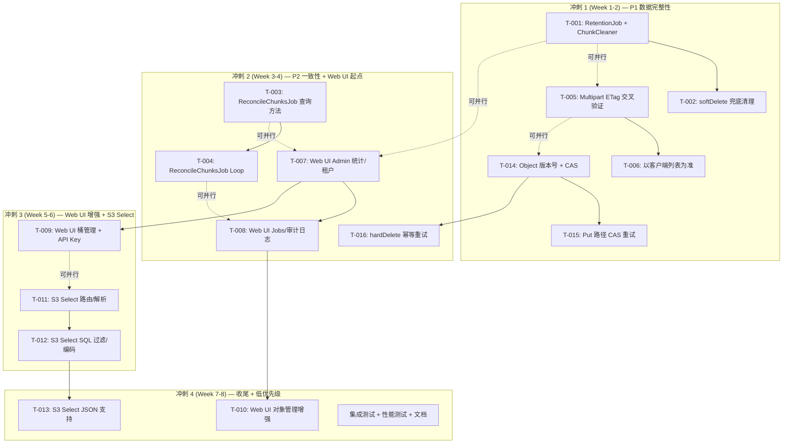

现在我掌握了足够的代码上下文。以下是完整的 Tech Lead 分析。

---

# Tech Lead 分析报告：工程完整性盲区修复

## 1. 任务分解

### 任务一览表

| ID | 标题 | 方向 | 涉及文件 | 前置依赖 | 预估(h) | 验收标准 |
|----|------|------|---------|---------|---------|---------|
| **T-001** | RetentionJob 注入 ChunkCleaner 接口 | D1-P1 | `internal/reconcile/retention.go`, `cmd/server/main.go` | — | ① `RetentionJob` 增加 `chunkCleaner` 字段 + `WithChunkCleaner` 方法 ② `purgeSoftDeleted` 硬删除前调用 `DeleteObjectChunks` ③ `main.go` 将 `indexer` 传入 ④ 单元测试覆盖非 nil/nil 分支 |
| **T-002** | softDeleteObject 同步兜底清理 chunk | D1-P2 | `internal/service/file_crud.go` | T-001 | ① `softDeleteObject` 增加 `chunkCleaner.DeleteObjectChunks` 同步调用 ② 失败仅 warn log，不阻塞软删除 ③ 单元测试验证幂等（重复删除不报错） |
| **T-003** | ReconcileChunksJob — repository 查询方法 | D1-P3 | `internal/repository/repository.go`, `internal/repository/sql_objects.go` | — | ① 新增 `ListOrphanChunkObjectIDs(ctx, before, limit) ([]int64, error)` ② 新增 `DeleteChunksByObjectIDs(ctx, []int64) (int64, error)` ③ SQLite/Postgres 双迁移无需变更 schema（chunk 表已有 `object_id` 列） ④ 单元测试验证 |
| **T-004** | ReconcileChunksJob — reconcile loop + otel metrics | D1-P3 | `internal/reconcile/chunks.go` (新文件), `internal/telemetry/metrics.go`, `cmd/server/main.go` | T-003 | ① 新增 `ReconcileChunksJob` ticker loop ② 定期扫描孤儿 chunk → 批量删除 ③ 导出 `chunk_orphan_count`, `chunk_reconciled_total` 指标 ④ 受 `RECONCILE_CLUSTER_SINGLETON` 保护 ⑤ 集成测试验证 |
| **T-005** | CompleteMultipart ETag 交叉验证 | D2-P1 | `internal/api/s3compat/extra.go`, `internal/api/s3compat/types.go`, `internal/service/file_multipart.go` | — | ① 解析 XML 到非空结构体 ② 客户端 PartNumber 在服务端有记录但 ETag 不匹配 → `InvalidPart` ③ 客户端 PartNumber 在服务端无记录 → `InvalidPart` ④ 验证通过后调用 `CompleteMultipart` ⑤ 单元测试覆盖 5 种边界 |
| **T-006** | CompleteMultipart 以客户端列表为准 | D2-P2 | `internal/api/s3compat/extra.go`, `internal/service/file_multipart.go` | T-005 | ① 将 part 数据传递给 `CompleteMultipart` ② 服务端只验证存在性 + ETag ③ 客户端列表的顺序用于组装 ④ 集成测试验证分片组装正确性 |
| **T-007** | Web UI 只读管理面板 — 存储统计 + 租户列表 | D3-P1a | `internal/webui/static/index.html`, `internal/webui/static/admin.js` (新文件) | — | ① 新增「Admin」标签页 ② 嵌入桶存储统计图表（对象数/字节数） ③ 租户列表（状态/配额使用率/预算使用率） ④ 数据通过 `/v1/admin/*` 和 `/v1/buckets/*/stats` 获取 ⑤ 支持分页 |
| **T-008** | Web UI 只读管理面板 — Jobs + 审计日志 | D3-P1b | `internal/webui/static/admin.js` | T-007 | ① Jobs 队列状态面板（pending/running/failed 计数） ② 审计日志流式列表（最新 50 条，时间筛选） ③ Webhook 失败列表 + 重试按钮 ④ 多租户切换器在所有面板生效 |
| **T-009** | Web UI 桶管理 + API Key 管理 | D3-P2 | `internal/webui/static/admin.js` | T-008 | ① 桶创建/删除（确认对话框） ② 桶配置编辑器（版本控制/CORS/策略） ③ API Key 列表/创建/吊销 ④ scope 校验：非 admin 隐藏操作按钮 |
| **T-010** | Web UI 对象管理增强 | D3-P3 | `internal/webui/static/index.html`, `internal/webui/static/app.js` | T-009 | ① 文件上传（指定 key + 进度条） ② 下载按钮 ③ 删除（含软/硬选项） ④ 版本列表浏览 ⑤ 标签编辑 ⑥ 响应式布局 |
| **T-011** | S3 Select CSV — 路由 + XML 解析 + 流式读取 | D4-P1a | `internal/api/s3compat/router.go`, `internal/api/s3compat/extra.go`, `internal/api/s3compat/types.go` | — | ① 注册 `?select&select-type=2` 路由 ② 解析 `SelectObjectContentRequest` XML ③ `dispatchBucketSubresource` 增加 `select` case ④ 单元测试覆盖 XML 解析 |
| **T-012** | S3 Select CSV — SQL 解析 + 过滤 + 结果编码 | D4-P1b | `internal/api/s3compat/select.go` (新文件) | T-011 | ① 使用 `expr` 库实现 SQL WHERE 过滤 ② 列投影（SELECT col1, col3） ③ 流式 CSV 行处理，不加载全文件 ④ 输出 S3 Select 事件格式 ⑤ 单元测试验证查询正确性 |
| **T-013** | S3 Select JSON 输入支持 | D4-P2 | `internal/api/s3compat/select.go` | T-012 | ① JSON Lines 解析 ② 文档模式解析 ③ 点号路径投影（`SELECT user.name`） ④ 单元测试覆盖嵌套 JSON |
| **T-014** | Object 版本号 + migration + UpsertObject CAS | D5-P1a | `internal/repository/repository.go`, `internal/repository/sql_objects.go`, `migrations/{sqlite,postgres}/NNNN_*.{up,down}.sql` | — | ① `Object` 增加 `Version int64` 字段 ② migration 双文件新增列 + 默认值 1 ③ `UpsertObject` 改为 `UPDATE ... WHERE version = oldVersion` ④ 版本不匹配返回 `ErrVersionConflict` ⑤ 单元测试验证 CAS |
| **T-015** | Put 路径 CAS 重试循环 | D5-P1b | `internal/service/file_crud.go` | T-014 | ① `Put` 中 `writePutObject` 检测 `ErrVersionConflict` ② 自动重新 GetObject + 重新 store.Put（新 storage_key） + 重试 UpsertObject ③ 最多重试 3 次 ④ 单元测试覆盖并发冲突场景 |
| **T-016** | hardDeleteObject 幂等重试 + ReconcileJob 补偿 | D5-P2 | `internal/service/file_crud.go`, `internal/reconcile/reconcile.go` | T-014 | ① `hardDeleteObject` 中 `HardDeleteObject` 失败后重试 3 次 ② ReconcileJob 检测 storage blob 已删除但 metadata 残留的对象（`GET storage → 404`）并清理 ③ 单元测试 + 集成测试 |

### 任务工时汇总

| 阶段 | 任务 | 工时(h) | 合计(h) |
|------|------|---------|---------|
| **Sprint 1** (P1 修复) | T-001~T-002, T-005~T-006, T-014~T-015 | 3+2+4+2+4+2 = **17** | 17 |
| **Sprint 2** (P2 + 一致性) | T-003~T-004, T-007~T-008, T-016 | 3+4+4+3+3 = **17** | 34 |
| **Sprint 3** (Web UI + S3 Select) | T-009, T-011~T-012 | 4+4+3 = **11** | 45 |
| **Sprint 4** (收尾) | T-010, T-013, 测试+文档+性能 | 4+3+8 = **15** | **60** |

**总计：16 个任务，约 60 人·时（2 名开发者并行缩短到约 30 人·天 = 4 周）**

---

## 2. 执行顺序与依赖图



### 并行执行策略

**并行组 A（Sprint 1，3 人并行）：**
- 开发者 1: T-001 → T-002（Direction 1 Phase 1+2，~1 天）
- 开发者 2: T-005 → T-006（Direction 2 Phase 1+2，~1.5 天）
- 开发者 3: T-014 → T-015（Direction 5 Phase 1，~1.5 天）

**并行组 B（Sprint 2，3 人并行）：**
- 开发者 1: T-003 → T-004（Direction 1 Phase 3，~2 天）
- 开发者 2: T-007 → T-008（Direction 3 Phase 1，~2 天）
- 开发者 3: T-016（Direction 5 Phase 2，~1 天）

**并行组 C（Sprint 3，2 人并行）：**
- 开发者 1: T-009（Direction 3 Phase 2，~1 天）
- 开发者 2: T-011 → T-012（Direction 4 Phase 1，~2 天）

**并行组 D（Sprint 4，2 人并行）：**
- 开发者 1: T-010 + T-013（Direction 3 Phase 3 + Direction 4 Phase 2，~2 天）
- 开发者 2: 集成测试 + 性能测试 + 文档（~2 天）

---

## 3. 技术风险

### 风险矩阵

| # | 风险 | 概率 | 影响 | 缓解措施 |
|---|------|------|------|---------|
| **R1** | `ReconcileChunksJob` 全表扫描 chunk 表在大数据量下导致性能问题 | **中** | **高** | ① 批次处理（limit 200，分页游标） ② 在 `chunk.object_id` 上建立索引（检查现有 DDL） ③ 导出 `chunk_scan_duration` 指标监控 ④ 设置 `RECONCILE_CHUNK_BATCH_SIZE` 配置 |
| **R2** | ETag 交叉验证破坏了已存在的客户端工作流 | **低** | **高** | ① 添加 `S3_ALLOW_INSECURE_MULTIPART` 逃生舱配置（默认 false） ② 在 release notes 明确标注协议行为变更 ③ 回归测试：验证 `aws-sdk-go` 和 `minio-go` 的 multipart 流程 |
| **R3** | CAS 乐观锁导致高并发场景下 Put 频繁冲突回滚 | **中** | **中** | ① 最大重试 3 次 + 指数退避 ② `writePutObject` 失败后 store.Put 的 blob 会被 ReconcileJob 清理 ③ 监控 `object_cas_retry_total` 指标，阈值报警 |
| **R4** | S3 Select SQL 解析库选择（`expr` vs `cel-go` vs 手写 parser） | **低** | **中** | ① 评估 `expr`（已有人使用、轻量、安全——禁止 DDL/DML） ② 如果表达式语法超需求，锁定 min SQL 子集 ③ 使用白名单函数 + 参数化查询防注入 |
| **R5** | Web UI 新增功能需要 JavaScript 能力，团队可能偏后端 | **中** | **低** | ① 使用 vanilla JS + fetch API，无框架依赖 ② 或引入 htmx（轻量、服务端渲染友好） ③ JS 代码保持在 single-file 内，不引入 npm build step |
| **R6** | Multipart 客户端列表验证改变 `CompleteMultipart` 的 service 接口签名 | **低** | **低** | ① 新增 `CompleteMultipartWithParts` 方法（保留旧接口向后兼容） ② 或添加 `[]Part` 可选参数 |
| **R7** | 版本号 migration 需要为现有数十万行设置默认值 1 | **低** | **中** | ① `ALTER TABLE ... ADD COLUMN version INTEGER NOT NULL DEFAULT 1` ② Postgres 瞬间完成，SQLite 需要重写表（大表慢） ③ 在低峰期执行 migration，或使用 batched backfill |

### 关键阻塞点（Blockers）

| Blocker | 涉及任务 | 解决策略 |
|---------|---------|---------|
| **S3 Select SQL parser 选择** | T-012 | 决策树：① 试用 `expr`（`github.com/expr-lang/expr`）：支持 `==` `>` `<` `&&` `||` `in`。② 如果不够 → `cel-go`（Google Common Expression Language）。③ 调研期限：Sprint 2 末尾 |
| **Object.Version 字段名与既有的 `VersionID` 语义冲突** | T-014 | `VersionID` 是版本化桶中的版本 ID（字符串，`@v<id>`）。新的 `Version` 字段应命名为 `RowVersion` 或 `Sequence` 避免混淆。建议：**`Seq int64`**（单调递增行版本号） |
| **Web UI 大量纯前端修改，测试策略** | T-007~T-010 | 后端 API 已有 `httptest` 测试覆盖；前端变更通过人工点击测试 + cypress 可选。不纳入 CI gate 强制 |

---

## 4. 资源评估

### 团队建议

| 角色 | 技能要求 | 数量 | 负责方向 |
|------|---------|------|---------|
| **Senior Go 后端工程师** | Go 1.25, SQLite/Postgres, 并发编程, S3 协议 | **2 人** | Direction 1, 2, 4, 5（全部后端逻辑） |
| **全栈/前端工程师** | HTML/CSS/JS, fetch API, 可视化（Chart.js 可选） | **1 人** | Direction 3（Web UI） |

**最低配置：** 2 名开发者（1 后端 + 1 全栈），Sprint 1~4 全周期

### 时间线

```
Week 1  ████████████████░░░░░░░░░░░░░░  Sprint 1: T-001, T-005, T-014 (P1)
Week 2  ████████████████░░░░░░░░░░░░░░  Sprint 1: T-002, T-006, T-015
Week 3  ██████████████████████████████  Sprint 2: T-003, T-007, T-016
Week 4  ██████████████████████████████  Sprint 2: T-004, T-008
Week 5  ██████████████████████████████  Sprint 3: T-009, T-011
Week 6  ██████████████████████████████  Sprint 3: T-012
Week 7  ██████████████████████████████  Sprint 4: T-010, T-013
Week 8  ██████████████████████████████  Sprint 4: 集成测试 + 性能 + 文档
```

**关键里程碑：**

| 里程碑 | 时间 | 交付物 | 验收标准 |
|--------|------|--------|---------|
| **M1** | Week 2 结束 | P1 修复完成 | ① Retention GC 清理 chunk ② Multipart ETag 验证通过 ③ CAS 乐观锁生效 ④ `make check` 全绿 |
| **M2** | Week 4 结束 | P2 一致性 + Web UI 起点 | ① ReconcileChunksJob 运行 ② hardDelete 幂等 ③ 管理标签页显示统计+租户 ④ 集成测试覆盖所有新路径 |
| **M3** | Week 6 结束 | Web UI 管理 + S3 Select CSV | ① 桶/Key 管理可操作 ② S3 Select CSV 返回正确过滤结果 ③ 产品 demo |
| **M4** | Week 8 结束 | 全量发布 | ① 全部 16 个任务完成 ② 性能基准测试不退化 ③ 文档更新 ④ `make check` + integration tests 全绿 |

---

## 5. 质量保证

### 5.1 单元测试覆盖要求

| 任务 | 新增测试文件/函数 | 覆盖场景 | 最低覆盖率 |
|------|-----------------|---------|-----------|
| T-001 | `internal/reconcile/retention_test.go` | chunkCleaner nil / non-nil / error / DeleteObjectChunks 调用计数 | 行覆盖 ≥ 80% |
| T-002 | `internal/service/file_crud_test.go` | softDelete 触发 ChunkCleaner / chunk 失败不阻断 / 幂等性 | ≥ 80% |
| T-003 | `internal/repository/*_test.go` | ListOrphanChunkObjectIDs 结果正确性 / DeleteChunksByObjectIDs 批量删除 | ≥ 90% |
| T-004 | `internal/reconcile/chunks_test.go` | loop 执行一次扫描+清理 / cluster singleton gating | ≥ 75% |
| T-005 | `internal/api/s3compat/extra_test.go` | 5 种边界（ETag 匹配/不匹配/缺失 PN/多余 PN/重复 PN） | ≥ 90% |
| T-006 | `internal/service/file_multipart_test.go` | part 列表传递正确 / 顺序控制 | ≥ 80% |
| T-014 | `internal/repository/*_test.go` | UpsertObject CAS 冲突返回 ErrVersionConflict / 重试后成功 | ≥ 90% |
| T-015 | `internal/service/file_crud_test.go` | Put 路径 CAS 重试 / 3 次失败后返回 ErrVersionConflict | ≥ 85% |
| T-016 | `internal/service/file_crud_test.go` | HardDeleteObject 失败后重试 / 2 次成功 / 最终失败 | ≥ 85% |
| T-011~T-012 | `internal/api/s3compat/select_test.go` | SQL 解析 / CSV 过滤 / 列投影 / 空结果 / LIMIT | ≥ 85% |
| T-013 | `internal/api/s3compat/select_test.go` | JSON Lines / 文档模式 / 嵌套路径 | ≥ 85% |

**新增代码整体行覆盖率目标：≥ 85%（后端）、≥ 70%（前端——手动测试补充）**

### 5.2 集成测试策略

```go
// 集成测试级别（按 CI gate 分类）

// === CI gate (make check) — SQLite + local FS ===
//   T-001~T-002: TestRetentionJobPurgeWithChunks
//   T-005~T-006: TestCompleteMultipartETagValidation
//   T-014~T-015: TestConcurrentPutCAS
//   T-016:        TestHardDeleteRetry

// === CI gate 外 (make test-integration) — Docker Postgres/pgvector ===
//   T-003~T-004: TestReconcileChunksJobOnPostgres (验证孤儿 chunk 发现逻辑)
//   T-011~T-013: TestS3SelectOnLargeCSV (5MB+ CSV)
//   T-005~T-006: TestMultipartWithRealParts (S3 SDK 循环写入 5 个 part)

// === 手动测试 ===
//   T-007~T-010: Web UI 人工点检清单（附截图对比基线）
```

### 5.3 代码审查要点

| 维度 | 审查重点 |
|------|---------|
| **安全性** | S3 Select SQL 注入防护（禁止 DDL/DML）; Web UI 中 admin scope 校验是否在前端和后端双层执行 |
| **并发安全** | `RetentionJob.purgeSoftDeleted` 和 `ReconcileChunksJob` 之间是否竞争（一个删除 blob，一个删除 chunk——无害但需确认顺序）；CAS 循环是否有 ABA 问题（Go 无 ABA，version 单调递增） |
| **幂等性** | ChunkCleaner 重复删除是否安全（`DeleteObjectChunks` 应该是幂等的——`DELETE FROM chunks WHERE object_id = ?`）；`CompleteMultipart` 重放行为（幂等返回同一结果） |
| **迁移兼容** | `Object.Seq` 新增字段不破坏序列化（`json:"seq"` tag）；`UpsertObject` 签名变更需要更新所有调用方（检查 `file_multipart.go` 中的 finalizeMultipartUpload 是否也调用 UpsertObject） |
| **错误处理** | ChunkCleaner 失败不阻断删除（warn log + continue）；ReconcileChunksJob 单批次失败不终止整个循环 |
| **观测性** | 每个新组件是否有适当 OTel metrics（删除计数、冲突计数、chunk 孤儿计数、扫描耗时 histogram） |

### 5.4 性能测试需求

| 场景 | 测试负载 | 基准 | 目标 |
|------|---------|------|------|
| ReconcileChunksJob 全量扫描 | 100 万 chunk 行 + 50 万 object 行 + 无索引 | < 30 秒/次 | < 10 秒/次（加索引后） |
| CAS 重试开销 | 10 个 goroutine 并发 Put 同一 key（非版本化桶） | 当前：最后一个成功，其他 blob 孤儿 | 目标：1 个成功，9 个重试后依次成功，0 孤儿 |
| S3 Select CSV | 100MB CSV, SELECT + WHERE, 10% 过滤率 | 当前：下载 100MB → client 处理 | 目标：服务端返回 10MB |
| Multipart ETag 验证 | 1000 part large object | 当前：0 额外开销 | 目标：验证耗时 < 总合并时间 5% |
| Web UI 管理面板 | 100 租户 + 1000 桶 | 当前：N/A | 目标：页面加载 < 2s |

---

## 6. 实施计划

### 阶段 1：基础设施搭建（Sprint 1，Day 1~10）

**目标：堵住所有 P1 数据完整性漏洞**

```
Day 1-2    T-001: RetentionJob + ChunkCleaner
           - 修改 retention.go: 加 chunkCleaner 字段 + WithChunkCleaner
           - purgeSoftDeleted 中调用 DeleteObjectChunks
           - main.go 注入 indexer
           - 单元测试

Day 2-3    T-002: softDeleteObject 兜底
           - file_crud.go: softDeleteObject 加 ChunkCleaner 调用
           - 确认幂等性
           - 单元测试

Day 3-5    T-005: Multipart ETag 交叉验证
           - types.go: 定义 CompleteMultipartUpload 结构体
           - extra.go: 解析 XML、遍历 PartNumber、交叉验证 ETag
           - 单元测试（5 种边界情况）

Day 5-6    T-006: 以客户端列表为准（协议合规）
           - 修改 service.CompleteMultipart 签名或新增方法
           - 传递验证后的 part 列表
           - 单元测试

Day 6-8    T-014: Object 版本号 + CAS
           - 双 migration: ADD COLUMN seq INTEGER NOT NULL DEFAULT 1
           - sql_objects.go: UpsertObject WHERE seq = oldSeq
           - 新错误类型 ErrVersionConflict
           - 单元测试

Day 9-10   T-015: Put 路径 CAS 重试循环
           - file_crud.go: writePutObject 检测 ErrVersionConflict → 重试
           - 指数退避 + 最大 3 次
           - 单元测试
           - 回归测试: make check 全绿

交付: M1 里程碑
```

### 阶段 2：核心功能实现（Sprint 2，Day 11~20）

**目标：修复 P2 一致性 + Web UI 管理面板起点**

```
Day 11-12  T-003: ReconcileChunksJob 查询方法
           - repository.go: 新方法 ListOrphanChunkObjectIDs, DeleteChunksByObjectIDs
           - sql_objects.go: SQL 实现（LEFT JOIN objects WHERE objects.id IS NULL）
           - 单元测试

Day 13-14  T-004: ReconcileChunksJob Loop
           - chunks.go: 新 Job 结构体 + ticker loop
           - main.go 注入
           - OTel metrics (chunk_orphan_count, chunk_reconciled_total)
           - 集成测试

Day 13-15  T-016: hardDeleteObject 幂等重试
           - file_crud.go: HardDeleteObject 失败重试 3 次
           - reconcile.go: 检测 storage 404 + metadata 残留的对象
           - 单元测试

Day 15-17  T-007: Web UI Admin 统计 + 租户
           - admin.js: fetch API 调用 /v1/buckets/*/stats, /v1/admin/tenants
           - index.html: Admin 标签 + 统计卡片
           - 手动测试

Day 18-20  T-008: Web UI Jobs + 审计日志
           - admin.js: /v1/admin/jobs, /v1/admin/audit, /v1/admin/webhook-failures
           - UI 渲染 + 分页
           - 手动测试

交付: M2 里程碑
```

### 阶段 3：集成测试和优化（Sprint 3，Day 21~30）

**目标：Web UI 管理操作 + S3 Select CSV**

```
Day 21-22  T-009: Web UI 桶管理 + API Key
           - 桶创建/删除确认对话框
           - 桶配置编辑器
           - API Key CRUD UI
           - scope 校验

Day 23-25  T-011: S3 Select CSV 路由 + 解析
           - router.go + types.go: 新路由 + XML 类型
           - select.go: 流式 CSV 读取 + expr SQL 解析
           - 单元测试 XML 解析

Day 26-28  T-012: S3 Select SQL 过滤 + 编码
           - select.go: WHERE 过滤 + 列投影 + LIMIT
           - S3 Select 事件帧编码
           - 单元测试查询正确性
           - 手动测试 S3 SDK 兼容性

Day 29-30  集成测试 + Bug 修复
           - 全量集成测试
           - 组合多个方向的边界情况
           - 文档（CHANGELOG, 配置说明, API 文档）

交付: M3 里程碑
```

### 阶段 4：发布准备（Sprint 4，Day 31~40）

**目标：低优先级功能 + 性能 + 文档**

```
Day 31-32  T-010: Web UI 对象管理增强
           - 上传（指定 key + 进度条）
           - 下载 + 删除 UI
           - 版本列表浏览 + 标签编辑
           - 响应式布局

Day 33-35  T-013: S3 Select JSON 支持
           - JSON Lines 模式
           - 文档模式
           - 点号路径投影
           - 单元测试

Day 35-37  性能测试
           - ReconcileChunksJob 100 万行基准
           - CAS 并发压力测试
           - S3 Select 大文件（100MB+）
           - Web UI 响应速度

Day 37-38  文档更新
           - docs/requirements/ 补充本轮分析
           - AGENTS.md 更新（新增组件说明）
           - openapi.json 补充 S3 Select
           - CHANGELOG.md

Day 39-40  全量回归 + 发布
           - make check 全绿
           - make test-integration 全绿
           - 人工验收测试（checklist）
           - Git tag + release notes

交付: M4 里程碑
```

---

## 补充建议

### 1. 关于 Object.Version 字段命名

分析文档建议使用 `Version` 作为 CAS 字段名，但 `Object` 结构体已有 `VersionID string` 用于 S3 版本化桶。两者语义不同，建议用 **`Seq int64`** 作为行版本号（类似 PostgreSQL 的 `xmin`），避免混淆。

### 2. S3 Select 的 SQL 解析库选择

推荐 `github.com/expr-lang/expr`，原因：
- 纯 Go、零 CGo、已用于多个生产项目
- 天然安全（不支持 DDL/DML）
- 语法子集可精确锁定（`==` `!=` `>` `<` `&&` `||` `in` `matches` `+` `-` `*` `/`）
- 编译一次、重复执行、性能好

不推荐手写 parser（复杂度高、测试量大）。

### 3. EventBus 补偿机制（Phase 之外的长期改进）

当前分析文档聚焦 Retention GC 和同步兜底，但 EventBus 满缓冲区丢事件（`bus.go:100-103`）这个问题本身值得后续修复。建议增加一个**重试 worker**：`IncEventDropped` 时写入一个 `dropped_events` 表，由独立 worker 定期重放。但此改动涉及面广（需定义重放策略、幂等性），不适合合入当前 Sprint，建议列为 **v1.5 技术债项**。

### 4. Web UI 的渐进增强路径

管理面板功能多、改动大。建议采用 **"读→写→管理"** 的三阶段渐进策略对齐 Sprint 2-4：

```
只读面板（Sprint 2）→ 可写操作（Sprint 3）→ 对象管理（Sprint 4）
```

每阶段都是独立可交付的，且早期阶段可为后续收集用户反馈。
