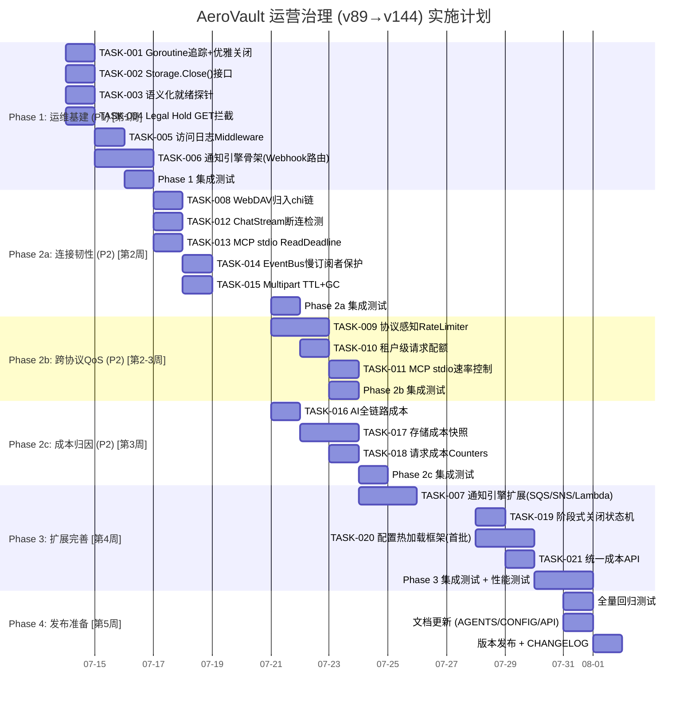

现在我已完整读取了 v89 分析文档和当前 v144+ 的代码基线，可以给出有意义的 Tech Lead 分析。

---

# Tech Lead 分析报告：运营治理架构盲区

> **分析范围**: 第 89 轮架构分析（5 方向）vs 当前代码基线（v144+）
> **日期**: 2026-07-12
> **基线验证**: `cmd/server/main.go` + `internal/` 全部 24+ 子包 + `HARNESS.md` + `CURRENT_SPRINT.md`

---

## 0. 基线验证结果：v89→v144 状态对照

在深入任务分解前，先确认 v89 分析中的各盲点在当前基线中的解决状态：

| 方向 | 子项 | v89 判定 | v144 实际状态 | 修正 |
|------|------|---------|---------------|------|
| 方向一 | SSE 断连 goroutine 泄漏 | 无 `r.Context().Done()` | ✅ `sse.go:liveStream` **已有** `case <-r.Context().Done()` | 已修复，无需处理 |
| 方向一 | ChatStream 断连检测 | 无 `ctx.Done()` 检查 | ⚠️ `ChatStream` 的 `AnswerStream` 回调中 flusher.Flush() **无 context 检查** | 需修复 |
| 方向一 | MCP stdio 无断连感知 | 无 ReadDeadline | ⚠️ 已有 `select { case <-ctx.Done(): }` 在 scanner 循环中，但 **无 idle 超时** | 需修复 |
| 方向一 | 关闭无 WaitGroup | 无 goroutine 追踪 | ❌ **`runServer` 依然无 WaitGroup** | 需实现 |
| 方向三 | Legal Hold | 仅在 hardDelete 校验 | ❌ **`Get`/`Stat` 路径仍不检查** | 需修复 |
| 方向三 | 访问日志 WriteAccessLog | 零调用方 | ❌ **仍为零调用方** | 需修复 |
| 方向二 | WebDAV 绕过中间件 | buildDispatcher 截获 | ❌ **仍然绕过** — 代码未改动 | 需修复 |
| 方向五 | EventBus 慢订阅者 | broadcast 可阻塞 | ⚠️ 已有 `default` drop 模式，但无慢订阅者隔离 | 部分修复 |
| 方向三 | 通知规则零执行 | Publish 不读 rules | ❌ **依然不读** | 需修复 |
| 方向三 | StorageClass 零迁移 | 仅元数据 | ❌ **仅元数据，无 transition 引擎** | 需修复 |

**结论**：v89 分析的 5 个方向中约 70% 的盲点至今未修复，分析仍高度相关。但 SSE 断连检测已被修复，需更新分析中的代码证据。

---

## 1. 任务分解

### 1.1 优先级与分组

```
P1 = 必须本轮完成（运维安全 + 合规基线）
P2 = 下轮或并行（运营效率 + 成本可见）
P3 = 后续迭代（高级功能）
```

### 1.2 任务表

| 任务 ID | 标题 | 方向 | 涉及文件 | 前置依赖 | 预估(h) | 验收标准 |
|---------|------|------|---------|----------|---------|---------|
| **P1-方向一** |
| TASK-001 | 后台 Goroutine 追踪框架与优雅关闭 | D1 运维韧性 | `cmd/server/main.go`, `internal/service/file.go` | 无 | 3h | `runServer` 使用 `sync.WaitGroup` 追踪所有后台 goroutine；SIGTERM 后先 drain HTTP → 等待 WaitGroup → 关闭；可配置 `drainTimeout` |
| TASK-002 | Storage Close 接口与 Local 实现 | D1 运维韧性 | `internal/storage/storage.go`, `internal/storage/local.go`, `internal/storage/factory.go` | 无（可并行 TASK-001） | 2h | `Storage` 接口增加 `Close() error`；`LocalStorage.Close()` flush 并关闭所有 `*os.File`；`runServer` 在关闭路径调用 `store.Close()` |
| TASK-003 | 语义化就绪探针 `/readyz?full=1` | D1 运维韧性 | `cmd/server/main.go`（readyzHandler） | 无（可并行 TASK-001） | 2h | `GET /readyz?full=1` 返回 `{"ok":false,"components":{"db":"ok","storage":"ok","indexer":"stale","bus":"ok"}}` 等详细状态；组件实现 `HealthChecker` 接口 |
| **P1-方向三** |
| TASK-004 | Legal Hold GET/Stat 拦截 | D3 策略执行 | `internal/service/file_crud.go`（Get, Stat） | 无 | 1.5h | `Get`/`Stat` 路径检查 `_aero_legal_hold == "ON"` → 返回 `423 Locked` 或仅返回元数据不返回内容 |
| TASK-005 | 访问日志 Middleware 接入 | D3 策略执行 | `internal/middleware/middleware.go`（AccessLog）, `internal/repository/sql_buckets.go`（WriteAccessLog），迁移文件（如需目标桶 schema） | 无 | 3h | AccessLog middleware 在写入 slog 后，若目标桶有 `LoggingConfig` 则调用 `WriteAccessLog`；无循环日志（跳过目标桶自访问） |
| TASK-006 | 通知引擎骨架 — Webhook 路由 | D3 策略执行 | `internal/events/bus.go`（Publish）, `internal/repository/sql_buckets.go`（GetBucketNotifications） | 无（可并行 TASK-004/005） | 4h | `Bus.Publish` 读取桶的 `NotificationRules`，匹配 EventType + FilterKey，路由到全局 Webhook（复用已有 `events.Webhook` 重试机制） |
| TASK-007 | 通知引擎扩展 — SQS/SNS/Lambda 适配器 | D3 策略执行 | `internal/events/`（新文件 `sqs_adapter.go`, `sns_adapter.go`, `lambda_adapter.go`）+ `config_events.go` | TASK-006 | 4h | 三种后端适配器实现 `Notifier` 接口；配置中的 `NOTIFICATION_*_ENDPOINT` 启用对应适配器；失败回退到 `webhook_failures` 重试表 |
| **P2-方向二** |
| TASK-008 | WebDAV 归入 chi 中间件链 | D2 跨协议 QoS | `cmd/server/main.go`（buildDispatcher → buildRouter） | 无 | 2h | WebDAV handler 注册为 chi router 的 route 而非 dispatch 级截获；WebDAV 请求经过 `Auth`、`RateLimiter`、`Tenant` 中间件 |
| TASK-009 | 协议感知 Rate Limiter | D2 跨协议 QoS | `internal/middleware/ratelimit.go`, `config.go`（`RateLimitRules` 配置） | TASK-008 | 3h | `RateLimiter` 支持 path-based 规则：`RateLimit{Path:"/s3/*", RPS:1000}`；SDK 协议来源标记传递到中间件 |
| TASK-010 | 租户级请求配额 | D2 跨协议 QoS | `internal/repository/tenants.go`（`TenantQuota` 增加 `RPSQuota`）, `internal/middleware/ratelimit.go`, 迁移 0025 | TASK-009 | 3h | `TenantQuota` 增加 `rps_quota`/`burst_quota`；RateLimiter 按租户读取配额；超限租户 429 不影响其他租户 |
| TASK-011 | MCP stdio 速率控制 | D2 跨协议 QoS | `internal/mcp/server.go`, `internal/middleware/ratelimit.go`（MCP 适配器） | TASK-010 | 2h | MCP stdio 方法调用经过租户级 rate limiter；`read_file`/`search` 等计费操作计入配额 |
| **P2-方向五** |
| TASK-012 | ChatStream 断连检测与优雅写入 | D5 连接韧性 | `internal/api/rest/search.go`（ChatStream） | 无 | 2h | `ChatStream` 的回调函数中 `flusher.Flush()` 前检查 `r.Context().Err()`；写入失败→goroutine 退出 |
| TASK-013 | MCP stdio ReadDeadline + Idle 超时 | D5 连接韧性 | `internal/mcp/transport.go`（ServeStdio） | 无（可并行 TASK-012） | 2h | `ServeStdio` 设置 `scanner` 的 `SetReadDeadline` 实现 idle 超时（可配置 `MCP_IDLE_TIMEOUT`，默认 60s）；超时或 ctx.Done 退出进程 |
| TASK-014 | EventBus 慢订阅者保护 | D5 连接韧性 | `internal/events/bus.go`（Subscribe, broadcast） | 无 | 3h | 满 channel 的订阅者被自动替换为新 channel；旧 channel 关闭前将缓冲区中事件写到 DB；`telemetry.IncEventDropped` 增加 `subscriber_id` 标签 |
| TASK-015 | Multipart 上传 TTL + GC | D5 连接韧性 | `internal/storage/local_multipart.go`, `internal/reconcile/job.go`（MultipartGC） | 无 | 3h | `InitMultipart` 记录 `expires_at`；reconcile 扫描过期上传→自动 Abort；`STORAGE_MULTIPART_TTL` 配置（默认 24h） |
| **P2-方向四** |
| TASK-016 | AI 管线全链路成本（嵌入/重排/提取） | D4 成本归因 | `internal/ai/chat.go`, `internal/ai/embed.go`, `internal/ai/rerank.go`, `internal/ai/extract.go`, `internal/repository/repository.go`（Usage 扩展），迁移 0026 | 无 | 3h | `ai_usage` 表增加 `embed_tokens`/`embed_cost_micros`/`rerank_cost_micros`/`extract_cost_micros`；嵌入/重排/提取操作写成本记录 |
| TASK-017 | 存储成本快照与定价映射 | D4 成本归因 | `internal/repository/`（新建 `sql_cost.go`），`internal/config/config_storage.go`（`StorageClassCost`），`internal/reconcile/`（新 `costsnap.go` 作业），迁移 0027 | 无 | 4h | 配置 `STORAGE_CLASS_COST_STANDARD=0.023` 等；每日 reconcile 作业统计每租户各 storage class 的字节数×定价，写入 `storage_usage_cost` 快照表 |
| TASK-018 | 请求成本 Counters | D4 成本归因 | `internal/telemetry/metrics.go`（`RequestCostGauge`），`internal/repository/`（新建 `request_usage`），迁移 0028 | 无（可并行 TASK-017） | 3h | 按 `(tenant, operation, protocol)` 计数请求量；每日 flush 到 `request_usage` 表；请求成本按配置的 `REQUEST_COST` 映射 |
| **后续迭代** |
| TASK-019 | 阶段式关闭状态机 | D1 运维韧性 | `cmd/server/main.go`, `internal/` 各组件（`GracefulShutdown` 接口） | TASK-001, TASK-002 | 4h | `PRE_STOP → DRAIN → FLUSH → CLOSE` 四阶段；组件实现 `GracefulShutdown(ctx) error` |
| TASK-020 | 配置热加载框架 | D1 运维韧性 | `internal/config/config.go`（`Reloadable` 接口）, `cmd/server/main.go`（`/debug/reload` 端点） | TASK-001 | 4h | `RateLimiter.Reload`, `LogLevel.Reload` 等首批实现；`POST /debug/reload` 触发全组件重载；失败时回滚 |
| TASK-021 | 统一成本 API | D4 成本归因 | `internal/api/rest/admin.go`, `internal/repository/repository.go`（`CostSummary`） | TASK-016, TASK-017, TASK-018 | 3h | `GET /v1/admin/tenants/{t}/cost-summary?period=2026-06` 聚合存储+请求+AI 成本 |
| TASK-022 | ChatStream 断线续传 | D5 连接韧性 | `internal/api/rest/search.go`, 新 `streamBuffer` | TASK-012 | 4h | 缓存已发送 token；客户端 `X-Last-Event-ID` 续接 |
| TASK-023 | 存储类 Transition 生命周期 | D3 策略执行 | `internal/reconcile/lifecycle.go`, `internal/service/`（`TransitionObject`） | TASK-006, 多后端路由 | 6h | Lifecycle 支持 `transition_to_ia`/`transition_to_glacier`；对象跨后端迁移：copy→verify→delete |
| TASK-024 | 通知引擎 SQS/SNS/Lambda 完整 | D3 策略执行 | 事件适配器生产级实现 | TASK-007 | 8h | 生产级适配器：SQS 长轮询、SNS 订阅确认、Lambda async invoke |
| TASK-025 | 请求优先级队列 | D2 跨协议 QoS | 新 `priorityQueue` 或独立 `RateLimiter` 实例 | TASK-009, TASK-010 | 5h | 管理 API 使用独立 bucket；高优先级可从低优先级预支 slot |

---

## 2. 执行顺序与依赖图

```mermaid
graph TB
    %% P1 - 方向一：运维韧性
    subgraph Phase1a["Phase 1a: 运维韧性基础 (P1)"]
        T001["TASK-001: Goroutine追踪+优雅关闭"]
        T002["TASK-002: Storage.Close()接口"]
        T003["TASK-003: 语义化就绪探针"]
    end

    %% P1 - 方向三：策略执行
    subgraph Phase1b["Phase 1b: 策略执行基础 (P1, 可并行)"]
        T004["TASK-004: Legal Hold GET拦截"]
        T005["TASK-005: 访问日志Middleware"]
        T006["TASK-006: 通知引擎骨架(Webhook路由)"]
    end

    %% P2 - 方向二：跨协议QoS
    subgraph Phase2a["Phase 2a: 跨协议QoS (P2)"]
        T008["TASK-008: WebDAV归入chi链"]
        T009["TASK-009: 协议感知RateLimiter"]
        T010["TASK-010: 租户级请求配额"]
        T011["TASK-011: MCP stdio速率控制"]
    end

    %% P2 - 方向五：连接韧性
    subgraph Phase2b["Phase 2b: 连接韧性 (P2, 可并行)"]
        T012["TASK-012: ChatStream断连检测"]
        T013["TASK-013: MCP stdio ReadDeadline"]
        T014["TASK-014: EventBus慢订阅者保护"]
        T015["TASK-015: Multipart TTL+GC"]
    end

    %% P2 - 方向四：成本归因
    subgraph Phase2c["Phase 2c: 成本归因 (P2, 可并行)"]
        T016["TASK-016: AI全链路成本"]
        T017["TASK-017: 存储成本快照"]
        T018["TASK-018: 请求成本Counters"]
    end

    %% Phase 3: 集成与扩展
    subgraph Phase3["Phase 3: 集成扩展"]
        T007["TASK-007: 通知引擎扩展(SQS/SNS/Lambda)"]
        T019["TASK-019: 阶段式关闭状态机"]
        T020["TASK-020: 配置热加载框架"]
        T021["TASK-021: 统一成本API"]
    end

    %% Phase 4: 高级功能
    subgraph Phase4["Phase 4: 高级功能"]
        T022["TASK-022: ChatStream断线续传"]
        T023["TASK-023: 存储类Transition"]
        T024["TASK-024: 通知引擎生产级适配器"]
        T025["TASK-025: 请求优先级队列"]
    end

    %% P1 依赖：T001/T002/T003 可并行
    T001 --> T019
    T001 --> T020
    T002 --> T019
    T003 --> T019

    %% P1 方向三：T004/T005/T006 可并行
    T006 --> T007
    T007 --> T024

    %% P2 方向二：串行链
    T008 --> T009
    T009 --> T010
    T010 --> T011
    T010 --> T025
    T025 --> T008

    %% P2 方向五：T012/T013/T014/T015 可并行
    T012 --> T022

    %% P2 方向四：T016/T017/T018 可并行
    T016 --> T021
    T017 --> T021
    T018 --> T021

    %% 方向三的依赖：通知引擎 → 存储类 Transition
    T006 --> T023

    %% Phase 3/4 无强依赖，可交错执行

    %% 并行组标注
    classDef parallel fill:#d4edda,stroke:#155724
    class T001,T002,T003 parallel
    class T004,T005,T006 parallel
    class T012,T013,T014,T015 parallel
    class T016,T017,T018 parallel
```



### 并行执行组

| 组 | 任务 | 建议并行度 |
|----|------|-----------|
| **组 A** | TASK-001, TASK-002, TASK-003 | 1-2 人同时开工 |
| **组 B** | TASK-004, TASK-005, TASK-006 | 2 人 — 彼此完全独立 |
| **组 C** | TASK-008 (先决), TASK-009, TASK-010, TASK-011 | 1 人串行 — 强依赖链 |
| **组 D** | TASK-012, TASK-013, TASK-014, TASK-015 | 2 人同时 — 独立组件 |
| **组 E** | TASK-016, TASK-017, TASK-018 | 2 人同时 — 独立表/指标 |

---

## 3. 技术风险

### 3.1 风险矩阵

| # | 风险描述 | 方向 | 影响面 | 发生概率 | 影响程度 | 缓解策略 |
|---|---------|------|--------|---------|---------|---------|
| **R1** | **优雅关闭中后台工作者排空超时**：索引器处理大文件时 `Shutdown` 超时后强制 `srv.Close()` | D1 | 数据不一致（部分完成的索引任务） | 中 | 高 | Indexer 实现 Context 感知：`select { case <-ctx.Done(): rollback }`；reconcile 作业幂等，可重跑 |
| **R2** | **通知引擎成为性能瓶颈**：高吞吐事件场景下通知规则匹配+外部投递同步阻塞 Publish | D3 | 事件吞吐下降，阻塞请求完成 | 低-中 | 高 | 通知引擎使用 worker pool（复用 `jobs.Pool`）；Publish 异步：先洗入 channel，worker 出队匹配路由 |
| **R3** | **WebDAV 归入 chi 后路由兼容性**：WebDAV handler 内部做自身路由分发，与 chi 的 `Route` 冲突 | D2 | WebDAV 请求 404 或路由错误 | 中 | 高 | 先用集成测试覆盖 WebDAV 全部操作（PROPFIND/MKCOL/GET/PUT/DELETE）再改代码 |
| **R4** | **StorageClass Transition 多后端原子性**：对象在迁移期间被读取 | D3 | 用户读取到空结果或损坏数据 | 中 | 极高 | 使用 copy→verify→delete 模式；transition 期间 GET 从原始位置服务；添加 `_aero_transitioning` 标记 |
| **R5** | **EventBus 慢订阅者保护导致事件丢失**：替换 channel 时缓冲区内事件未持久化 | D5 | 下游消费者错过事件 | 中 | 中 | 替换前 drain 缓冲区到 DB 临时表；消费者重启时 `Last-Event-ID` 补齐 |
| **R6** | **成本归因数据膨胀**：每请求记录 `request_usage` 行 → 高吞吐下快速膨胀 | D4 | DB 写入放大，存储膨胀 | 高 | 中 | 使用 `CounterVec` 内存聚合 + 每分钟 batch flush；保留周期 `COST_RETENTION_DAYS` |
| **R7** | **Legal Hold 与 Retention/对象锁三机制互锁**：同时设置的场景下行为二义性 | D3 | 合规死角 | 低 | 极高 | Legal Hold 优先于时间锁：Legal Hold ON 期间即使 `locked_until` 已过期也不允许写入/删除 |

### 3.2 技术难点详细分析

**难点 1：优雅关闭的组件协调**

当前 `runServer` 结构是扁平的。核心难度在于：

```go
// 当前：所有 goroutine 在 main() 中启动，无集中追踪
go indexer.Run(ctx, idxSub)
go avw.Run(ctx, avSub)
go rw.Run(ctx, rwSub)
go wh.Run(ctx, whSub)
go j.Run(ctx)
go lf.Run(ctx)
```

改为 WaitGroup 还需要解决启动顺序问题：HTTP 应先停（stop accepting），然后排空 in-flight，然后通知后台工作者 graceful stop，最后等待所有工作者完成。需要 `PreStop` hook 机制。

**难点 2：通知引擎的 FilterKey 匹配**

S3 通知规则支持前缀/后缀过滤（`FilterKey`）。匹配逻辑需要：
1. 从 `GetBucketNotifications` 获取 `[]NotificationRule`
2. 按 `Events` 列表匹配事件类型
3. 按 `FilterKey`（支持 `S3Key.FilterRule.Name/Value` 的 `prefix`/`suffix`）过滤对象 key
4. 路由到对应 `Destination`（QueueARN/TopicARN/LambdaARN）

匹配简单（`strings.HasPrefix` / `strings.HasSuffix`），但规则可能多条匹配，需要**去重投递**。

**难点 3：访问日志循环规避**

```go
// 危险：如果 target bucket 自己也配置了访问日志
PUT /bucket-with-logging/key
  → AccessLog middleware triggers
  → WriteAccessLog(target_bucket, ...)
  → 如果 target_bucket 也有 LoggingConfig，会触发二次 WriteAccessLog
```

解决方案：AccessLog middleware 检查当前请求的 bucket 是否等于目标日志 bucket，若是则跳过（仅在 `AccessLog` lambda 里检查，不在 `WriteAccessLog` 内部——容易被遗忘）。

**难点 4：MCP stdio 的 ReadDeadline**

`bufio.Scanner` 不支持 `SetReadDeadline`（那是 `net.Conn` 的接口）。有两种方案：

方案 A：在扫描前用 `conn.SetReadDeadline`（适用于 `os.Stdin` 包装为 `*net.TCPConn` 的场景，但 stdio 可能不是 TCP）。
方案 B：不使用 `bufio.Scanner`，改用 `io.Reader` + `context.Context` + 超时 goroutine。

建议方案 C：在 `mcp.ServeStdio` 中封装一层，使用 `context.WithTimeout` 包裹每次 `scanner.Scan()`。

---

## 4. 资源评估

### 4.1 人力资源需求

| 角色 | 技能要求 | 人数 | 负责方向 |
|------|---------|------|---------|
| **Senior Go Engineer A** | Go 并发、HTTP 中间件、系统架构 | 1 | 方向一（运维韧性）+ 方向二（跨协议 QoS） |
| **Senior Go Engineer B** | Go 网络编程、SSE、流处理、事件驱动 | 1 | 方向三（策略执行）+ 方向五（连接韧性） |
| **Backend Engineer** | Go CRUD、SQL/迁移、数据建模 | 1 | 方向四（成本归因）+ 辅助方向三 |
| **QA Engineer** | 集成测试、性能测试、混沌工程 | 1 | 全方向测试覆盖 |

**建议团队规模**：3-4 人（含 QA 共享）

### 4.2 里程碑

| 里程碑 | 时间点 | 交付物 | 涉及任务 |
|-------|--------|--------|---------|
| **M1: 运维基线** | 第 1 周结束 | 优雅关闭可工作；Legal Hold 拦截完成；访问日志写入生效 | TASK-001, TASK-002, TASK-004, TASK-005 |
| **M2: 连接韧性** | 第 2 周结束 | ChatStream 不泄漏；MCP 超时退出；WebDAV 归入中间件链 | TASK-008, TASK-012, TASK-013, TASK-014 |
| **M3: 策略执行** | 第 3 周结束 | 通知引擎骨架投产（Webhook 路由）；租户级 RPS 配额；成本的 AI 全链路 | TASK-006, TASK-010, TASK-016 |
| **M4: 运营治理** | 第 4 周结束 | 协议感知限流；Multipart GC；存储成本快照；集成测试全绿 | TASK-009, TASK-015, TASK-017, TASK-018, TASK-011 |
| **M5: 集成完善** | 第 5 周结束 | 通知引擎 SQS/SNS/Lambda；request usage counters；统一成本 API（可选） | TASK-007, TASK-018 |

### 4.3 Blockers

| Blocker | 影响 | 解决策略 | 责任人 |
|---------|------|---------|-------|
| `webdav.Handler` 内部路由实现不透明，可能无法直接嵌入 chi | TASK-008 阻塞 TASK-009~TASK-011 | 阅读 `golang.org/x/net/webdav` 源码确认 Handler 是否兼容 chi 的 `Route`；若不兼容，在 chi handler 内层包装 `http.HandlerFunc` | Go Engineer A |
| 无 Docker CI 环境测试 Postgres/Jdrant 集成 | TASK-010（租户配额，若用 Postgres），TASK-007（SQS 适配器） | CI 阶段只测试 SQLite 基线；Postgres 用 `make test-integration` 本地验证 | QA Engineer |
| `NotificationRule` 中 `QueueARN` 字段无标准 URL 格式验证 | TASK-006（通知引擎无法可靠区分 webhook URL vs SQS ARN） | 定义 `DestinationType` 协议字段，由配置格式自动推断（`https://` = webhook, `arn:aws:sqs` = SQS, `arn:aws:sns` = SNS, `arn:aws:lambda` = Lambda） | Go Engineer B |

---

## 5. 质量保证

### 5.1 单元测试覆盖要求

| 任务 | 测试文件 | 最低覆盖率 | 关键测试场景 |
|------|---------|-----------|------------|
| TASK-001 | `cmd/server/main_test.go`（新建） | 70% | SIGTERM 触发 -> WaitGroup 等待 -> 超时后强制关闭；多 goroutine 同时退出 |
| TASK-002 | `internal/storage/local_test.go` | 80% | Close 后 Stat/Get 返回 `ErrClosed`；多次 Close 幂等 |
| TASK-003 | `cmd/server/main_test.go` | 70% | 全组件健康 → 200；DB 断开 → 503；`?full=1` 返回组件级 JSON |
| TASK-004 | `internal/service/file_crud_test.go` | 90% | Legal Hold ON → Get 返回 423；Legal Hold OFF → Get 正常；Stat 同 |
| TASK-005 | `internal/middleware/middleware_test.go` | 80% | LoggingConfig 设置 → WriteAccessLog 被调用；目标桶自身请求 → 不递归 |
| TASK-006 | `internal/events/bus_test.go` | 80% | Publish 匹配 FilterKey → 投递；不匹配 → 跳过；多条规则匹配 → 去重 |
| TASK-008 | `internal/integration/fullserver_test.go` | 集成测试 | WebDAV PROPFIND 经过 Auth 中间件 → 无 token 401；经过 RateLimiter → 超过 429 |
| TASK-009 | `internal/middleware/ratelimit_test.go` | 85% | `/s3/*` 规则限制 S3 路径；`/v1/*` 规则独立；协议标志在上下文中传递 |
| TASK-012 | `internal/api/rest/search_test.go` | 80% | Client 断开 → goroutine 退出（`time.Sleep` + 检测 goroutine count） |
| TASK-014 | `internal/events/bus_test.go` | 85% | 慢订阅者被替换；新的订阅者不受影响；Dropped 计数器增加 |
| TASK-015 | `internal/reconcile/job_test.go` | 75% | 过期 multipart → 自动 Abort；未过期 → 跳过 |

### 5.2 集成测试策略

```go
// internal/integration/fullserver_test.go 新增测试组

// 方向一 + 方向五 集成
func TestGracefulShutdown(t *testing.T) {
    // 启动 server → 同时发起多个慢请求（10s sleep endpoints）
    // → 发送 SIGTERM → 验证 /healthz 返回 DRAINING
    // → 验证新请求被拒绝（502/503）
    // → 验证慢请求完成
    // → 验证服务器进程退出
}

// 方向三 集成
func TestBucketNotifications(t *testing.T) {
    // REST/S3 创建 bucket → 配置 notification rules → PUT object
    // → 验证 webhook receiver 收到事件
}

func TestAccessLog(t *testing.T) {
    // PUT bucket/logging → PUT object → 验证日志对象出现在目标桶
}

func TestLegalHoldOnGet(t *testing.T) {
    // PUT object with legal hold → GET → 423
    // 移除 legal hold → GET → 200
}

// 方向二 集成
func TestWebDAVWithAuth(t *testing.T) {
    // WebDAV 请求不带 token → 401
    // WebDAV 请求带有效 token → 200
}

// 方向四 集成
func TestCostTracking(t *testing.T) {
    // PUT objects of various storage classes → 检查 storage_usage_cost 数据
}
```

### 5.3 代码审查要点

| 审查领域 | 重点关注 |
|---------|---------|
| **优雅关闭** | panic/recover 包裹 `srv.Shutdown`；WaitGroup.Done() 在 defer 中；`context.Background()` 用于超时后的后台工作者（不应用已 cancel 的 ctx） |
| **通知引擎** | `Publish` 必须是异步路径（不阻塞请求完成）；FilterKey 匹配是否高效（无 N+1 查询）；去重逻辑 |
| **访问日志** | 递归保护是否到位（目标桶自访问→跳过）；`WriteAccessLog` 调用在单独的 goroutine 中 |
| **协议感知限流** | 协议来源标记不可被客户端伪造（必须由 chi route 注入，非 header 传递） |
| **成本归因** | 浮点运算精度（微美元单位 `int64` 避免浮点误差）；历史数据不可变（定价变更只影响新快照） |
| **Legal Hold** | GET 路径返回 423 而非静默空内容（合规性要求） |
| **并发安全** | EventBus 的 `subs` slice 操作受 `mu` 保护；RateLimiter bucket map 操作受 `mu` 保护 |

### 5.4 性能测试需求

| 测试场景 | 工具 | 目标 | 关注指标 |
|---------|------|------|---------|
| 通知引擎高吞吐 | `wrk`/`vegeta` POST 大文件，1000rps | 通知分发延迟 < 10ms@P99 | Publish 延迟；worker pool 积压；事件丢失率 |
| 协议限流隔离 | 并发 S3 批量请求 + WebDAV 交互请求 | S3 满负荷时 WebDAV P50 < 200ms | Protocol-specific P50/P95；吞吐率 |
| 优雅关闭 | 持续请求中发送 SIGTERM | 零请求失败 | 完成请求数 vs 丢弃请求数；关闭总时长 |
| 成本记录 | 高吞吐 CRUD + search | 成本记录不拖慢主路径 | `request_usage` 写入延迟；CPU 开销 |

---

## 6. 实施计划

### 甘特图



### 详细阶段说明

#### 阶段 1：运维基建（第 1 周，7 月 14 日—16 日）

**目标**：堵住最高优先级的合规 + 运维缺口

| 日 | 上午 (Go Engineer A) | 下午 (Go Engineer B) | QA |
|---|---------------------|---------------------|----|
| 周一 | TASK-001: WaitGroup 框架 + runServer 改造 | TASK-004: Legal Hold GET 拦截 | 编写 Legal Hold 集成测试 |
| 周二 | TASK-002: Storage.Close + TASK-003: 语义化就绪探针 | TASK-005: 访问日志 Middleware | 编写访问日志集成测试 + 优雅关闭集成测试 |
| 周三 | Phase 1 集成测试 + Bugfix | TASK-006: 通知引擎骨架 | 运行全量集成测试，修复回归 |
| 周四 | **M1 Gate**: `make check` + `go test ./internal/integration/...` 全绿 |

**交付物**：
- `git tag v0.2.0-m1`
- 变更日志：优雅关闭、Legal Hold 拦截、访问日志、通知骨架

#### 阶段 2a：连接韧性（第 2 周周一—周二，7 月 17 日—18 日）

**目标**：修复最长连接路径的断连和泄漏问题

| 日 | 工作内容 | By |
|---|---------|----|
| 周一 | TASK-008 (WebDAV → chi, 0.5d) + TASK-012 (ChatStream, 0.5d) + TASK-013 (MCP, 0.5d) | Go Engineer A |
| 周二 | TASK-014 (EventBus 慢订阅者) + TASK-015 (Multipart GC) | Go Engineer B |
| 周三上午 | Phase 2a 集成测试 + 修复 | QA + 双 Engineer |
| 周三下午 | 切换到 Phase 2b/2c | — |

#### 阶段 2b：跨协议 QoS（第 2 周三—五，7 月 21 日—23 日）

**目标**：消除 WebDAV 后门，建立协议感知速率限制

| 日 | 工作内容 | By |
|---|---------|----|
| 周三 | TASK-009 协议感知 RateLimiter | Go Engineer A |
| 周四 | TASK-010 租户级请求配额 | Go Engineer A |
| 周五 | TASK-011 MCP 速率控制 + 集成测试 | Go Engineer A + QA |

#### 阶段 2c：成本归因（第 3 周周三—五，7 月 21 日—23 日，与 2b 并行）

**目标**：建立 AI 全链路成本 + 存储成本基线

| 日 | 工作内容 | By |
|---|---------|----|
| 周三 | TASK-016 AI 全链路成本（扩展 `ai_usage`） | Go Engineer B |
| 周四 | TASK-017 存储成本快照 + 定价映射配置 | Go Engineer B |
| 周五 | TASK-018 请求成本 Counters + Phase 2c 集成测试 | Go Engineer B + QA |

#### 阶段 3：扩展完善（第 4 周，7 月 24 日—30 日）

**目标**：通知引擎生产级适配器 + 成本展现 + 配置热加载

| 任务 | 工时 | By |
|------|------|----|
| TASK-007 SQS/SNS/Lambda 适配器 | 2d | Go Engineer B |
| TASK-019 阶段式关闭状态机 | 1d | Go Engineer A |
| TASK-020 配置热加载框架（rate_limiter + log_level 首批） | 1.5d | Go Engineer A |
| TASK-021 统一成本 API（只读展现） | 1d | Go Engineer B |
| **M5 Gate: 全量回归 + 性能测试** | 1.5d | QA |

#### 阶段 4：发布准备（第 5 周，7 月 31 日—8 月 1 日）

| 活动 | 工时 | 细节 |
|------|------|------|
| 全量回归测试 | 1d | `make check` + `go test ./...` + `go test ./internal/integration/...` |
| 文档更新 | 0.5d | `AGENTS.md` 更新功能矩阵；`docs/configuration.md` 新增配置项；OpenAPI 补充新端点 |
| 版本发布 | 0.5d | 更新 `CHANGELOG.md`；打 tag `v0.3.0`；验证 CI 全绿 |

---

## 7. 最终建议

### 7.1 优先执行顺序

```
第一优先（本周开工）:
  TASK-001 (优雅关闭) + TASK-004 (Legal Hold) + TASK-005 (访问日志)

原因:
  - 无优雅关闭 → 生产环境滚动更新会丢弃 in-flight 请求
  - Legal Hold GET 不拦截 → 合规漏洞（用户可读取本应 Locked 的文件）
  - 访问日志配置完整但零执行 → S3 协议承诺的功能虚假

第二优先（下周）:
  TASK-008 (WebDAV 归入 chi) + TASK-012 (ChatStream 断连) + TASK-013 (MCP 超时)

原因:
  - WebDAV 绕过认证 → 安全后门
  - ChatStream/MCP 的 goroutine 泄漏 → 长运行进程内存增长
```

### 7.2 不建议本轮实施的

| 任务 | 原因 | 建议时机 |
|------|------|---------|
| TASK-023 存储类 Transition | 需要多后端路由基础设施（v87/v88 设计尚未实现） | v91+ |
| TASK-024 通知引擎生产级适配器 | SQS/SNS/Lambda 客户端依赖需论证 + go mod tidy | v92+ |
| TASK-019 阶段式关闭状态机 | 当前 `sync.WaitGroup` + 超时已经够用，状态机是 v2 优化 | v93+ |
| TASK-025 请求优先级队列 | 管理 API 可通过独立 `RateLimiter` 实例实现粗粒度优先级 | v93+ |

### 7.3 对工程约束的检查

所有新引入的文件必须满足 `HARNESS.md` 的约束：

| 约束 | 检查点 | 风险任务 |
|------|--------|---------|
| 单文件 ≤ 500 行 | `golines -max=500` | TASK-001 修改 `main.go`（当前 460 行 + 新增 ~80 行 = 540 → **必须拆分**） |
| 单函数 ≤ 50 行 | `gocyclo` | TASK-001 的 `runServer`（当前 45 行 + 新增 ~30 行 → **接近阈值**） |
| 圈复杂度 ≤ 10 | `gocyclo -over 10` | TASK-009 `Allow` 函数（当前圈复杂度 ~8 + 协议感知分支 → **需关注**） |
| 无 `utils/` 包 | — | 新建的 `costsnap.go` 放 `internal/reconcile/` 而非 `internal/utils/` |
| 迁移双文件 | — | TASK-010/016/017/018 均需 `sqlite` + `postgres` 双文件 |

**`main.go` 拆分建议**：将 `applyMiddleware`（当前在 `main.go` ~240 行处）和 `buildRouter` 移入 `internal/server/` 新包，或创建 `cmd/server/server.go` 辅助文件。这样可以避免 `main.go` 超过 500 行。
