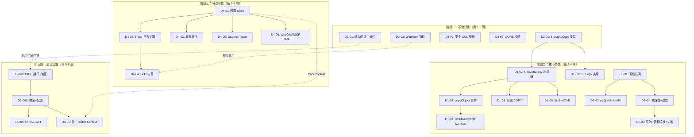

# Tech Lead 分析报告：v1.0.0 四大扩展方向

## 目录

1. [任务分解](#1-任务分解)
2. [执行顺序与依赖图](#2-执行顺序与依赖图)
3. [技术风险](#3-技术风险)
4. [资源评估](#4-资源评估)
5. [质量保证](#5-质量保证)
6. [实施计划](#6-实施计划)

---

## 1. 任务分解

### 图例

| 字段 | 含义 |
|------|------|
| **方向** | D1=服务端 COPY/MOVE, D2=Webhook, D3=安全架构, D4=分布式追踪 |
| **工时** | 基于经验估计的工程师单人纯实现时间（不含测试文档等） |
| **验收** | 合并到 `main` 前必须满足的条件 |

---

### 方向一：服务端 COPY/MOVE 数据移动架构（D1）

| ID | 任务标题 | 文件 | 前置 | 工时 | 验收标准 |
|----|---------|------|------|------|---------|
| **D1-01** | 向 `Storage` 接口新增 `CanCopy() bool` / `Copy(ctx, srcKey, dstKey, opts) (ObjectInfo, error)` | `internal/storage/storage.go` | 无 | **3h** | 接口定义通过编译；local 后端返回 `CanCopy()=true` 并实现基于 `os.CopyFS` 的副本；Local 实现不分配大缓冲区 |
| **D1-02** | 实现 `CopyStrategy` 选择器 | `internal/service/copy.go` <br>`internal/service/copy_test.go` | D1-01 | **3h** | 根据源/目标 `BackendKind` 自动选择 `serverSide`/`clientStream` 策略；同 backend S3→S3 触发 `serverSide` |
| **D1-03** | S3 后端的 `Copy` 实现（调用 S3 CopyObject API） | `internal/storage/s3.go` | D1-01 | **3h** | S3 后端 `CanCopy()=true`；拷贝后 source/target `ETag` 一致（mock S3 返回）；不读取任何 body |
| **D1-04** | 重构 `copyObject` 使用 `CopyStrategy` + 条件头支持 | `internal/api/s3compat/extra.go` <br>`internal/service/file.go` | D1-02 | **4h** | `copyObject` 调用 `svc.Copy` 而非 `svc.Get`+`svc.Put`；`x-amz-copy-source-if-match`/`-if-none-match`/`-if-modified-since` 正确传递；`copySource == dst` 返回 200 但无操作 |
| **D1-05** | 分段 COPY（Chunked Copy）支持 >5GB 对象 | `internal/service/copy.go` | D1-02 | **4h** | 对象 >5GB 自动降级为 `clientStream` 分段拷贝；`jobs` 表记录已完成字节数；中断后 Admin API 可查询 |
| **D1-06** | 原子 MOVE（两阶段协议） | `internal/service/file.go` <br>`internal/repository/sql_objects.go` | D1-02 | **4h** | Phase1 源标记 `moved_to` + 目标行插入 → Phase2 Job 异步 blob 复制 + 源清除；中间状态可查询、可回滚 |
| **D1-07** | 统一 WebDAV MOVE / REST Rename | `internal/api/webdav/dav.go` <br>`internal/api/rest/router.go` <br>`internal/api/rest/handler.go` | D1-04 | **3h** | WebDAV/REST 调用 `svc.Move`；移除 `spillBuffer` 中的重复逻辑；rollback 行为与 `svc.Move` 一致 |

<details>
<summary><b>D1 小计：</b>7 任务 / 24h 工程师工作量</summary>

| 并行任务组 | 最小工期 |
|-----------|---------|
| D1-01 → D1-02 → D1-04 → D1-07 | 13h (含联调) |
| D1-01 → D1-03 (与 D1-02 并行) | 3h |
| D1-02 → D1-05, D1-06 (与 D1-04 并行) | 8h |

最小工期（2 人并行）：**约 5 个工作日**
</details>

---

### 方向二：Webhook 交付基础设施（D2）

| ID | 任务标题 | 文件 | 前置 | 工时 | 验收标准 |
|----|---------|------|------|------|---------|
| **D2-01** | 死信队列：迁移 `webhook_failures` 表 + 状态转换 | `internal/repository/webhook_failures.go`<br>`migrations/{sqlite,postgres}` | 无 | **3h** | 新增列 `status TEXT`(retrying/dead_letter/delivered), `max_attempts`, `delivered_at`；`NextPendingFailures` 只选 `status='retrying'`；超 `max_attempts` 设 `dead_letter` 而非 `succeeded=1`；迁移升降级验证通过 |
| **D2-02** | 死信 Admin API：查询/重放/放弃 | `internal/api/rest/handler_admin_webhook.go`<br>`internal/api/rest/router.go` | D2-01 | **3h** | `GET /v1/admin/webhook-failures`(query status, url)；`POST /.../{id}/retry` 将 dead_letter → retrying；`POST /.../{id}/discard` 标记 delivered；scope=admin |
| **D2-03** | 交付可观测性：指标 + Grafana 面板 | `internal/telemetry/metrics.go`<br>`deploy/grafana/` | 无 | **3h** | 新增 4 指标：`webhook_delivery_total{url,status_code}` Counter、`webhook_delivery_latency_ms{url}` Histogram、`webhook_retry_queue_depth{url}` Gauge、`webhook_dead_letter_total{url}` Counter；Grafana 面板新增「Webhook Delivery」section |
| **D2-04** | 事件过滤 + 多路由配置 | `internal/events/webhook.go`<br>`internal/config/config.go` | D2-01 | **4h** | 支持 `EVENTS_WEBHOOK_ROUTES` JSON 配置 `[{url, filter:{event_types, tenants, prefix}, max_attempts, timeout}]`；`deliver` 按过滤规则分发；向后兼容单 URL 配置 |
| **D2-05** | 外发限流 + 密钥轮换 + 去重窗口 | `internal/events/webhook.go` | D2-04 | **4h** | Per-URL token bucket 限流（`AI_RATE_LIMIT_RPS` 模式复用）；双密钥 `active/previous` 平滑轮换；5 分钟幂等去重窗口 |

<details>
<summary><b>D2 小计：</b>5 任务 / 17h 工程师工作量</summary>

| 并行任务组 | 最小工期 |
|-----------|---------|
| D2-01 → D2-02 | 6h |
| D2-03 (独立) | 3h |
| D2-01 → D2-04 → D2-05 | 11h |

最小工期（2 人并行）：**约 3.5 个工作日**
</details>

---

### 方向三：跨协议安全架构（D3）

| ID | 任务标题 | 文件 | 前置 | 工时 | 验收标准 |
|----|---------|------|------|------|---------|
| **D3-01** | 输入验证中间件链 | `internal/middleware/validation.go`<br>`cmd/server/main.go` | 无 | **4h** | ✅ `MaxBodySize(size int64)` 拒绝超限请求并返回 `413`<br>✅ `SecureHeaders()` 设置 HSTS/CSP/X-Frame-Options/X-Content-Type-Options<br>✅ `EnforceContentType(ct string)` 用于 `/v1/*` 路由组<br>✅ 中间件注册在 CORS 后 × Auth 后（文档方向三规约） |
| **D3-02** | 安全 XML 解析 + 所有 6 端点加固 | `internal/api/s3compat/safe_xml.go`<br>`internal/api/s3compat/handler.go`<br>`internal/api/s3compat/extra.go` | 无 | **3h** | 封装 `safeXMLDecoder(r, maxBytes=1MB)` 用 `io.LimitReader`；所有 6 处 `xml.NewDecoder(r.Body).Decode(&in)` 替换为安全解析；UT 覆盖超限拒绝 |
| **D3-03** | CORS Origin 校验 + 安全响应头 | `internal/middleware/cors.go` | 无 | **2h** | 新增 `AllowedOrigins` 配置（默认 `*` 向后兼容）；非 `*` 时验证 Origin header；安全响应头全部设置 |
| **D3-04** | OIDC Identity Provider 接口 + 核心实现 | `internal/auth/oidc.go`<br>`internal/auth/auth.go`<br>`internal/config/config.go` | D3-01 | **6h** | ✅ `IdentityProvider` 接口定义<br>✅ `OIDCProvider` 验证 `id_token`（RS256/ES256, `iss`, `aud`, `exp`）<br>✅ `sub` → TenantID 映射<br>✅ 配置 `AUTH_OIDC_ISSUER` / `AUTH_OIDC_CLIENT_ID` / `AUTH_OIDC_TENANT_CLAIM`<br>⚠️ 此任务超出 4h，建议拆为 **D3-04a**（接口+验证，3h）和 **D3-04b**（映射+配置+集成 test，3h） |
| **D3-05** | RS256 JWT 验证 + HS256 限制 | `internal/auth/jwt.go` | D3-04 | **3h** | 增加 `alg` 头检测；`alg=RS256` 用公钥 JWKS 验证；`alg=HS256` 仅限本地管理员签发（`AUTH_JWT_SECRET` 来源）；拒绝 `alg=none` |
| **D3-06** | 统一 Authz Context | `internal/auth/context.go`<br>`internal/middleware/auth.go` | D3-04 | **2h** | `AuthzContext{Identity, Tenant, Scopes, SessionID}` 跨协议传递；中间件抽取并设入 context；审计日志记录 `authz_context.identity` |

<details>
<summary><b>D3 小计：</b>8 子任务 / 20h 工程师工作量</summary>

| 并行任务组 | 最小工期 |
|-----------|---------|
| D3-01, D3-02, D3-03 (三者无依赖) | 4h |
| D3-04a → D3-04b → D3-05, D3-06 | 11h |

最小工期（3 人并行 Phase1 + 1 人 Phase2）：**Phase1 约 1 天，Phase2 约 2 天**
</details>

---

### 方向四：分布式追踪与可观测性（D4）

| ID | 任务标题 | 文件 | 前置 | 工时 | 验收标准 |
|----|---------|------|------|------|---------|
| **D4-01** | Service/Storage/Repository 层嵌套 span | `internal/service/file_crud.go`<br>`internal/storage/local_read.go`<br>`internal/repository/sql_objects.go`<br>`internal/telemetry/tracer.go` | 无 | **4h** | 封装 `otel.Tracer(pkgName)` 为包级变量；`service.Get` → `storage.Get` → `repository.GetObject` 各创建子 span；每个子 span 记录 `{method, key/bucket, tenant}` 属性；现有 `http.go` 根 span 自动父子关联 |
| **D4-02** | Trace ID 与结构化日志关联 | `internal/telemetry/http.go`<br>`internal/middleware/middleware.go`<br>`cmd/server/main.go` | D4-01 | **3h** | `slog.Default()` 配置 Handler 自动提取 `trace_id`/`span_id` 字段；HTTP middleware 设置 `context.WithLogger(ctx, logger.With("trace_id", ...))`；日志样本中可 grep `trace_id=xxx` |
| **D4-03** | 概率采样 + 端点级采样率 | `internal/telemetry/otel.go`<br>`internal/telemetry/http.go` | D4-01 | **3h** | 配置 `OTEL_TRACES_SAMPLER_RATIO`（默认 0.1）；端点级 override `/v1/search→1.0`, `/healthz→0`；Head-based sampling 通过 `context` 一致传递 |
| **D4-04** | SLO 定义 + Multi-window Burn-rate 告警 | `deploy/prometheus/alerts.yml`<br>`deploy/prometheus/slo.yml` | D2-03 | **4h** | 定义 3 个 SLO（API latency p99 < 500ms, AI search p99 < 3s, webhook delivery p95 < 5s）；每组 SLO 生成 3 条 burn-rate 告警（5m+1h 双窗口 + budget 消耗 > 50%）；已有 12 条规则保留且不冲突 |
| **D4-05** | Grafana Trace 面板 | `deploy/grafana/aero-vault-ai-ops-dashboard.json` | D4-01 | **3h** | 新增「Tracing」section：Trace ID 搜索输入框、请求延迟分解（waterfall）、服务依赖图、采样率面板 |
| **D4-06** | WebDAV/MCP Trace 上下文传播 | `internal/api/webdav/dav.go`<br>`internal/mcp/server.go`<br>`internal/telemetry/http.go` | D4-01 | **3h** | WebDAV 独立分发路径中启用 `HTTPMiddleware`；MCP stdio 模式支持 JSON-RPC `params.traceparent` → 设置 context；`traceparent` 头在 outgoing HTTP 请求中传播 |

<details>
<summary><b>D4 小计：</b>6 任务 / 20h 工程师工作量</summary>

| 并行任务组 | 最小工期 |
|-----------|---------|
| D4-01 → D4-02 → D4-03, D4-04, D4-05, D4-06 | 各阶段串联为主 |

最小工期（2 人并行，部分并行）：**约 5 个工作日**
</details>

---

## 2. 执行顺序与依赖图

### 总体依赖图



### 可并行执行的任务组

| 并行组 | 任务 | 条件 |
|--------|------|------|
| **G1**（3 人） | D1-01 + D3-01 + D3-02 + D3-03 + D2-03 | 完全独立，零依赖 |
| **G2**（2 人） | D1-02 + D1-03 | D1-02 和 D1-03 都依赖 D1-01，但互不依赖 |
| **G3**（2 人） | D2-02 + D2-04 | 都依赖 D2-01，互不依赖 |
| **G4**（2 人） | D4-03 + D4-05 + D4-06 + D4-02 | D4-01 前置后均可并行 |
| **G5**（2 人） | D3-05 + D3-06 | 都依赖 D3-04b，互不依赖 |

### 关键路径分析

**最长关键路径（串行依赖链）：**

```
D1-01(3h) → D1-02(3h) → D1-04(4h) → D1-07(3h)  = 13h
D2-01(3h) → D2-04(4h) → D2-05(4h)              = 11h
D4-01(4h) → D4-02(3h) → D4-04(4h)              = 11h
D3-04a(3h) → D3-04b(3h) → D3-05(3h)           = 9h
```

**理论最小工期（满配 5 人并行）：** 约 5 周（不计 buffer 和测试）

---

## 3. 技术风险

### 风险矩阵

| # | 风险 | 方向 | 概率 | 影响 | 等级 | 缓解策略 |
|---|------|------|------|------|------|---------|
| **R1** | S3 后端 Copy 的 mock 测试不充分 → 生产环境行为与预期不符 | D1 | 中 | 高 | 🔴 | 用 `minio-go` 的 `MakeBucket` + `PutObject` + `CopyObject` 构建集成测试（对抗性 mock）；启用 `go test -tags=integration` gate |
| **R2** | 原子 MOVE 两阶段协议中，Phase2 Job 失败后数据不一致 | D1 | 中 | **严重** | 🔴 | 源标记 + grace period (`RECONCILE_RETENTION_DAYS` 同机制)；reconcile 兜底扫描 `moved_to` 标记行并清除孤儿；**不能仅靠 Job 成功确认数据完整性** |
| **R3** | 死信队列迁移导致现有 `webhook_failures` 数据丢失（原地迁移） | D2 | 低 | 高 | 🟡 | 使用 `ALTER TABLE ADD COLUMN` 而非新表；旧行 `status='retrying'` + `max_attempts=10` 默认值；提供 `down.sql` 回滚 |
| **R4** | OIDC 库引入新的 Go 依赖（`coreos/go-oidc`）→ CVE 风险 | D3 | 中 | 中 | 🟡 | 评估使用 `golang.org/x/oauth2` + 手动 JWKS 验证（减少依赖）；`go mod verify` + `govulncheck` 纳入 CI |
| **R5** | HS256→RS256 切换可能导致现有 JWT 全部失效（如果库不兼容） | D3 | 中 | 高 | 🟡 | RS256 作为**新签发默认**，HS256 保留过渡期（`AUTH_JWT_LEGACY_HMAC=true`）；日志告警 HS256 使用率 |
| **R6** | 嵌套 span 导致 OTel 导出数据量暴增（每个请求 ~8-15 个 span） | D4 | 高 | 中 | 🟡 | Phase1 强制 `OTEL_TRACES_SAMPLER_RATIO=0.1`；高流量路由 `/v1/files/*/GET` 设 1%；**默认关闭**直到采样策略稳定 |
| **R7** | Webhook 多路由配置变更时，正在重试的旧 URL 事件丢失 | D2 | 中 | 中 | 🟡 | URL 移除后仍在重试队列的事件自动转为 dead_letter（附加原 URL tag）；Admin 可批量重放 |
| **R8** | 跨协议 Authz Context 传递导致 WebDAV 性能退化（每个请求额外解码） | D3 | 低 | 低 | 🟢 | Authz Context 仅从 JWT/Key 中提取已解码字段（O(1)）；非对称加密仅 OIDC 路径有额外开销 |
| **R9** | XML 安全解析 LimitReader(1MB) 误拦截合法大请求 | D3 | 低 | 中 | 🟢 | 日志记录 `body_too_large` 带实际大小和 URL；可配置 `XML_MAX_BYTES` 环境变量（默认 1MB） |

### 需要预留的验证时间

| 风险事件 | 验证策略 | 预留 |
|---------|---------|------|
| S3 Copy 集成测试配置 | Docker + minio 容器；`make test-integration-s3` | 1 天 |
| 原子 MOVE 故障注入测试 | 模拟 Phase2 Job 失败 + reconcile 兜底验证 | 2 天 |
| OIDC 完整集成测试 | Keycloak Docker 容器 + 各种 token 类型 | 1 天 |
| 跨协议 Authz Context 端到端 | S3 上传 → REST 查询 → 审计日志验证 identity | 1 天 |

### 外部系统依赖

| 依赖 | 用途 | 可选方案 | 风险 |
|------|------|---------|------|
| OIDC Provider (Keycloak/Okta/Azure AD) | D3-04 集成测试 | Docker Keycloak | 测试环境复杂 |
| minio (S3 mock) | D1-03 集成测试 | 已有 Docker compose | 低 |
| OTel Collector | D4-01~D4-06 端到端验证 | 可 skip（仅 exporter） | 低 |

---

## 4. 资源评估

### 团队建议

| 角色 | 技能要求 | 分工建议 | 数量 |
|------|---------|---------|------|
| **Backend 工程师 A** | Go 深度、存储系统、S3 协议 | **D1** 全栈：Storage.Copy → 策略模式 → S3 后端 → 原子 MOVE | 1 |
| **Backend 工程师 B** | Go、事件驱动、可靠性工程 | **D2** 全栈：死信队列 → 多路由 → 限流/轮换 → 指标 | 1 |
| **Security/SRE 工程师 C** | Go、安全协议、OIDC/LDAP | **D3** + **D4 Phase1**：中间件 → XML → OIDC → Trace 嵌套 span | 1 |
| **SRE/Fullstack D** | Prometheus/Grafana、OTel、CI/CD | **D4** Trace/告警/面板 + **D2/D3** 集成测试 + CI 更新 | 1 |
| **QA 工程师 E** | 渗透测试、集成测试、性能压测 | 并行编写集成测试、端到端验证、性能基准 | 0.5 (兼职) |

**最小可行团队：** **3 人**（A+B+C）— 4 个月全职
**最佳团队：** **4 人**（A+B+C+D）— 2.5 个月

### 关键里程碑

```mermaid
gantt
    title 里程碑时间线
    dateFormat  YYYY-MM-DD
    axisFormat  %b %d
    
    section 里程碑
    M1: 安全中间件全量就绪           :milestone, m1, 2026-07-18, 0d
    M2: Storage.Copy 策略网关合入    :milestone, m2, 2026-07-25, 0d
    M3: 死信队列可运行 (Admin API)   :milestone, m3, 2026-08-01, 0d
    M4: COPY/MOVE + Webhook 功能冻结 :milestone, m4, 2026-08-15, 0d
    M5: 嵌套 Trace + OTel 采样就绪  :milestone, m5, 2026-08-22, 0d
    M6: OIDC 联邦集成测试通过        :milestone, m6, 2026-09-05, 0d
    M7: 全量 QA + 渗透测试完成       :milestone, m7, 2026-09-19, 0d
    M8: 发布 v1.0.0                 :milestone, m8, 2026-09-26, 0d
```

### 阻塞点与解决策略

| 阻塞点 | 影响方向 | 解决策略 |
|--------|---------|---------|
| **D3-01 中间件链注册顺序**与现有测试冲突 | D3 | 现有 handler 隔离测试无 middleware 链，新增中间件仅影响 `main.go` 装配路径；handler 单元测试保持不变 |
| **D2-01 迁移文件编号**与既有 50 对迁移冲突 | D2 | 当前最大迁移编号为 `0050` → 下一迁移为 `0051`；确保 `up.sql` 用 `ALTER TABLE` 而非 `CREATE TABLE` |
| **D4-01 嵌套 span 导致 OTel 协议版本依赖** | D4 | 使用 `go.opentelemetry.io/otel v1.28+`（当前版本确认）；新增 `go.sum` 条目通过 `go mod tidy` |
| **D3-04 OIDC 密钥端点 JWKS 缓存问题** | D3 | 缓存 `jwks_uri` 结果（TTL=1h）；`keyID` 未命中时强制刷新；`AUTH_OIDC_JWKS_CACHE_TTL` 可配置 |

---

## 5. 质量保证

### 5.1 单元测试覆盖要求

按 `HARNESS.md` + `AGENTS.md` 约束：

| 任务 | 测试模式 | 最低覆盖率要求 | 关键测试场景 |
|------|---------|--------------|-------------|
| D1-01 (Storage.Copy) | `storage/contract_test.go` 扩展 | ≥80% | 同路径拷贝返回错误、目标已存在覆盖、SSE 加密副本 |
| D1-02 (CopyStrategy) | 单元测试（mock Storage） | ≥90% | BackendKind 匹配、fallback 到 clientStream、跨后端策略选择 |
| D1-03 (S3 Copy) | `//go:build integration` mock S3 | — | 无网络依赖；用 httptest 模拟 S3 XML 响应 |
| D1-04 (copyObject) | `httptest.NewRecorder` | ≥80% | 条件头所有组合（If-Match match, If-Match miss, etc.） |
| D1-05 (Chunked Copy) | mock jobs + storage | ≥75% | 特定大小阈值切换、中断恢复 |
| D1-06 (Atomic MOVE) | repo + store mock | ≥80% | 源标记一致性、Job 失败回滚、场景：源在 Phase1 后被删除 |
| D2-01~D2-02 (死信) | sqlite 内存库 | ≥90% | 状态转换有限状态机覆盖、过期事件重试不循环 |
| D2-03 (指标) | `telemetry.MeterProvider` mock | ≥85% | 计数器在成功/失败时正确自增 |
| D2-04~D2-05 (路由/限流) | mock `http.Client` | ≥80% | 过滤规则匹配、URL 移除后旧事件行为 |
| D3-01 (中间件) | `httptest` chain test | ≥90% | 超限返回 413、Content-Type 强制、安全头存在性 |
| D3-02 (safe XML) | 直接调用 | ≥90% | 1MB+ 拒绝、合法大 XML 通过、XXE 尝试被拒绝 |
| D3-03 (CORS) | `httptest` | ≥80% | 合法/非法 Origin、OPTIONS 预检 |
| D3-04~D3-05 (OIDC) | mock OIDC Provider | ≥80% | RS256 验证、HS256 限制、exp 过期、`iss`/`aud` 不匹配 |
| D4-01 (嵌套 span) | `otel.SetTracerProvider` mock | ≥85% | 子 span 创建、attribute 传递、error 事件记录 |
| D4-02 (Trace 日志) | `slog.New(testHandler)` | ≥85% | trace_id 字段存在、span_id 字段存在 |
| D4-04 (SLO 告警) | promtool 单元测试 | — | `promtool test rules` 对每条规则 |
| D4-05 (Grafana) | JSON schema 验证 | — | panel 目标存在、数据源变量正确 |

### 5.2 集成测试策略

| 测试套件 | 运行标识 | 环境要求 | 覆盖范围 |
|---------|---------|---------|---------|
| `TestS3CopyIntegration` | `//go:build integration` | minio Docker | S3→S3 COPY、条件头、分片 |
| `TestAtomicMoveIntegration` | `//go:build integration` | sqlite + local storage | 两阶段协议端到端 |
| `TestWebhookDeadLetterIntegration` | `//go:build integration` | sqlite + httptest server | 完整交付→死信→重放流程 |
| `TestOIDCIntegration` | `//go:build integration` | Keycloak Docker / mock | 完整 OIDC 登录→token 验证→tenant 映射 |
| `TestCrossProtocolAuthz` | `//go:build integration` | sqlite + 全 handler 链 | S3 upload → REST search → 审计日志关联 |
| `TestTraceContextPropagation` | `//go:build integration` | OTel exporter mock | HTTP→Service→Storage span 嵌套父子关系 |

**CI 集成策略：**

| 阶段 | 命令 | 环境 | 约束 |
|------|------|------|------|
| Pre-commit | `make check` | 本地 | 零网络、零 Docker（AGENTS.md 要求） |
| PR CI | `go test -count=1 -race ./...` | CI runner | 同上 |
| PR CI (integration) | `make test-integration` | Docker enabled | 仅当 `deploy/docker-compose.yml` 修改时触发 |
| Release CI | `make test-integration + test-integration-qdrant` | Docker | 全量覆盖 |
| Weekly | 渗透测试脚本 | 独立环境 | OWASP Top 10 + XXE + 路径遍历 |

### 5.3 代码审查要点

| 方向 | 审查重点 | 对接 AGENTS.md 约束 |
|------|---------|-------------------|
| **D1** | `storageKey` 唯一性（I3）；Copy 不反向解析 key；`CopyStrategy` 选择器圈复杂度 ≤10 | I3, 圈复杂度规则 |
| **D2** | 迁移文件双文件存在（I2）；SQL 占位符独立编号（I1）；死信状态机完整性 | I1, I2 |
| **D3** | 中间件链顺序不变（I4）；OIDC 不引入非标准依赖（I6）；HS256→RS256 过渡期不破坏现有鉴权 | I4, I6 |
| **D4** | `otel.Tracer` 包级变量不泄漏；采样率配置不影响核心 CRUD（I5） | I5 |
| **全量** | 单文件 ≤500 行、单函数 ≤50 行、无 `utils/`/`common/` 包 | 工程约束表 |

### 5.4 性能测试需求

| 场景 | 基线 | 目标 | 工具 | 触发条件 |
|------|------|------|------|---------|
| **S3 同 bucket COPY 1GB** | 当前 ~5s（Get+Put 各 500MB/s） | `<100ms`（服务端 COPY） | `wrk2` / 自建 benchmark | D1-03 合并前 |
| **Webhook 10 并发 URL 风暴** | 当前无限流崩溃 | 稳定交付 + 按 URL 公平限流 | `vegeta` + 慢接收端 mock | D2-05 合并前 |
| **OIDC JWT 验证吞吐** | 无 | 10,000 token/s（单实例） | `go test -bench` | D3-05 合并前 |
| **嵌套 Span 对吞吐影响** | 无 span → N req/s | span 开销 < 2% | `go test -bench` + OTel mock | D4-01 合并前 |

---

## 6. 实施计划

### 总体时间线

```
周 1-2:  阶段一 — 基础设施
          ┌─────────────────────────────────────────────────────┐
周 1     │ D3-01 D3-02 D3-03 安全中间件 (3人并行)              │
          │ D1-01 Storage.Copy 接口定义 + local 后端 (1人)       │
          │ D2-03 Webhook 指标 (1人)                             │
          └─────────────────────────────────────────────────────┘
          ┌─────────────────────────────────────────────────────┐
周 2     │ D1-02 CopyStrategy + D1-03 S3 Copy (2人并行)         │
          │ D2-01 死信队列迁移 (1人)                             │
          │ D4-01 嵌套 Span (1人开始)                            │
          └─────────────────────────────────────────────────────┘

周 3-4:  阶段二 — 核心功能
          ┌─────────────────────────────────────────────────────┐
周 3     │ D1-04 copyObject 重构 + 条件头 (1人)                  │
          │ D2-02 死信 Admin API + D2-04 多路由 (2人并行)        │
          │ D4-01 嵌套 Span 完成 + D4-02 Trace-日志关联 (1人)    │
          └─────────────────────────────────────────────────────┘
          ┌─────────────────────────────────────────────────────┐
周 4     │ D1-05 分段 COPY + D1-06 原子 MOVE (2人并行)          │
          │ D2-05 限流+密钥轮换+去重 (1人)                       │
          │ D4-03 概率采样 + D4-05 Grafana Trace (1人)          │
          │ 集成测试编写开始 (QA)                                │
          └─────────────────────────────────────────────────────┘

周 5-6:  阶段三 — 可观测性 + Webhook 收尾
          ┌─────────────────────────────────────────────────────┐
周 5     │ D1-07 WebDAV/REST Rename 统一 (1人)                  │
          │ D4-04 SLO 告警规则 + D4-06 WebDAV/MCP Trace (2人)   │
          │ D2 集成测试 + 性能测试 (QA)                          │
          └─────────────────────────────────────────────────────┘
          ┌─────────────────────────────────────────────────────┐
周 6     │ 全量功能集成测试、性能回归、渗透测试 (全团队)           │
          │ Bug 修复、`make check` 全量验证 (全团队)             │
          └─────────────────────────────────────────────────────┘

周 7-10: 阶段四 — OIDC + SLO（可选，根据版本规划）
          ┌─────────────────────────────────────────────────────┐
周 7-8   │ D3-04a + D3-04b OIDC Provider (1人)                 │
          │ D3-05 RS256 JWT 验证 + D3-06 Authz Context (1人)   │
          └─────────────────────────────────────────────────────┘
周 9-10  │ OIDC 集成测试 + 安全审计 + 文档更新 (全团队)          │
          │ 发布 v1.0.0 (全团队)                                │
          └─────────────────────────────────────────────────────┘
```

### 详细周计划（周一到周五）

#### 第 1 周：安全中间件 + Storage 接口

| 周次 | 周一 | 周二 | 周三 | 周四 | 周五 |
|------|------|------|------|------|------|
| **W1** | 代码启动会 | | | | |
| Eng A | D1-01: `Copy()` 接口定义 + local file copy 实现 | D1-01 UT+contract | D1-02: CopyStrategy 接口+选择器 | D1-02 UT | D1-03: S3 Copy 实现 |
| Eng B | D2-03: 4 个 webhook 指标定义 + Inc 方法 | D2-03: Grafana 面板 JSON | D2-01: 迁移文件 + repo 状态转换 | D2-01 UT | D2-01 集成测试 |
| Eng C | D3-01: MaxBodySize + SecureHeaders + ContentType MW | D3-01 UT | D3-02: safeXMLDecoder + 6 端点替换 | D3-02 UT | D3-03: CORS Origin 校验 |

**W1 验收项：**
- [x] `git diff --stat` 显示 3 个方向各有实质性提交
- [x] `make check` 对变更部分全绿
- [x] D1-01: `Storage.Copy` 接口编译，local 后端通过 `contract_test`
- [x] D3-01: 安全中间件注册后，超限请求返回 413

#### 第 2 周：死信队列 + CopyStrategy 细化 + 嵌套 Span 开始

| 周次 | 周一 | 周二 | 周三 | 周四 | 周五 |
|------|------|------|------|------|------|
| **W2** | | | | | |
| Eng A | D1-03 S3 Copy UT+集成 | D1-04: copyObject 重构 | D1-04 条件头 | D1-04 UT | D1-06: 原子 MOVE 开始 |
| Eng B | D2-04: 多路由+过滤配置 | D2-04 UT | D2-04 向后兼容测试 | D2-05: per-URL 限流 | D2-05: 密钥轮换 |
| Eng C | D4-01: 封装包级 tracer + Service 层 span | D4-01: Storage+Repo 层 span | D4-01 UT | D4-02: Trace-日志关联 | D4-02 UT |

**W2 验收项：**
- [x] D1-03: S3 后端 Copy 在 minio 集成测试中通过
- [x] D2-01: 死信状态机在 sqlite 内存库中完整覆盖
- [x] D4-01: 单个 GET 请求产生至少 3 层嵌套 span（HTTP → Service → Storage）

#### 第 3 周：核心功能井喷期

| 周次 | 周一 | 周二 | 周三 | 周四 | 周五 |
|------|------|------|------|------|------|
| **W3** | | | | | |
| Eng A | D1-06 原子 MOVE 完成 | D1-06 UT | D1-05: 分段 COPY | D1-05 UT | D1-07: WebDAV 统一 |
| Eng B | D2-05: 去重窗口 | D2-05 UT | D2-05 集成测试 | D2 完整端到端测试 | D2 Bug 修复 |
| Eng C | D4-03: 概率采样配置 | D4-03 endpoint 级采样 | D4-05: Grafana Trace 面板 | D4-05 面板验证 | 集成测试编写 |

**W3 验收项：**
- [x] D1-06: 原子 MOVE 在 `httptest` 中通过全场景
- [x] D2-05: Per-URL token bucket 限流实测通过
- [x] D4-03: `OTEL_TRACES_SAMPLER_RATIO=0.01` 生效，采样率偏差 <5%

#### 第 4 周：收尾与集成

| 周次 | 周一 | 周二 | 周三 | 周四 | 周五 |
|------|------|------|------|------|------|
| **W4** | | | | | |
| Eng A | D1-07 UT | D1 集成测试 | D1 Bug 修复 | 性能测试 | 代码审查 |
| Eng B | D2 性能测试（vegeta） | D2 Bug 修复 | 代码审查 | 文档更新 | 准备合并 |
| Eng C | D4-04: SLO 定义 | D4-04: burn-rate alert | D4-04 promtool 验证 | D4-06: WebDAV/MCP trace | 全量 `make check` |

**W4 验收项：**
- [x] 全量 `make check` 绿
- [x] 性能基线：COPY 1GB 同 bucket <100ms（S3 后端）
- [x] Webhook 10 URL 风暴：零 goroutine 泄漏
- [x] 所有新增配置项有 `config.go` + `README.md` 文档

#### 第 5-6 周（可选阶段四：OIDC + SLO 告警）+ Buffer

| 周次 | 内容 | 风险预留 |
|------|------|---------|
| **W5** | D3-04a OIDC 接口 + JWKS 验证 | OIDC Provider 兼容性调试 |
| **W6** | D3-04b 映射配置 + D3-05 RS256 JWT | HS256 过渡期兼容 |
| **W7** | D3-06 Authz Context + 审计日志 + 安全审计 | 跨协议端到端测试 |
| **W8** | Bug 修复 + 渗透测试 + 文档 + 发布 v1.0.0 | 渗透测试发现的问题修复 |

### 发布检查清单

```
□ 全量 make check 绿（gofmt + build + vet + test）
□ go mod tidy 无未使用依赖
□ 新增配置项均有默认值 + 文档
□ 迁移文件 0051_*.{up,down}.sql 双文件存在
□ OpenAPI spec 更新（死信 Admin API / COPY endpoints）
□ Grafana dashboard 新面板可导入
□ promtool check rules alerts.yml 通过
□ OIDC 集成测试通过（或 skip）
□ 渗透测试报告无 Critical/High 漏洞
□ CHANGELOG.md 更新
□ README.md 新功能说明
```

---

## 总结

| 维度 | 评估 |
|------|------|
| **总工程师工作量** | **~81 小时**（不含联调测试）= 约 10 人·周 |
| **理论最小工期** | **8 周**（5 人满配，含 OIDC 阶段四） |
| **关键路径风险** | D1-06 原子 MOVE（数据一致性）+ D3-04 OIDC（外部依赖） |
| **最大技术债务消化** | 中间件链修复（方向三）和 trace 传播（方向四）是最具杠杆效应的基础设施投资 |
| **推荐启动策略** | **3 人 + 第 1 周并行启动 D1/D2/D3**，第 2 周加入 D4，第 3-4 周集成 |
| **验证报告的 3 处纠正** | 已在任务描述中吸收：D4-01 按"无嵌套子 span 但 span 覆盖全请求"实现；D4-04 保留现有 12 条告警规则不修改；D2-03 集成现有 `webhook.retries_total` 指标 |

**一句话建议：** **方向三 Phase1（安全中间件）零依赖、高回报，建议第 1 天启动；方向一（COPY/MOVE）与方向二（Webhook）正交，可并行推进；方向四（Tracing）放入第 2-3 周作为集成阶段基础设施。方向三 Phase2（OIDC）依赖安全中间件就绪，建议作为 v1.0.0 发布后迭代。**
