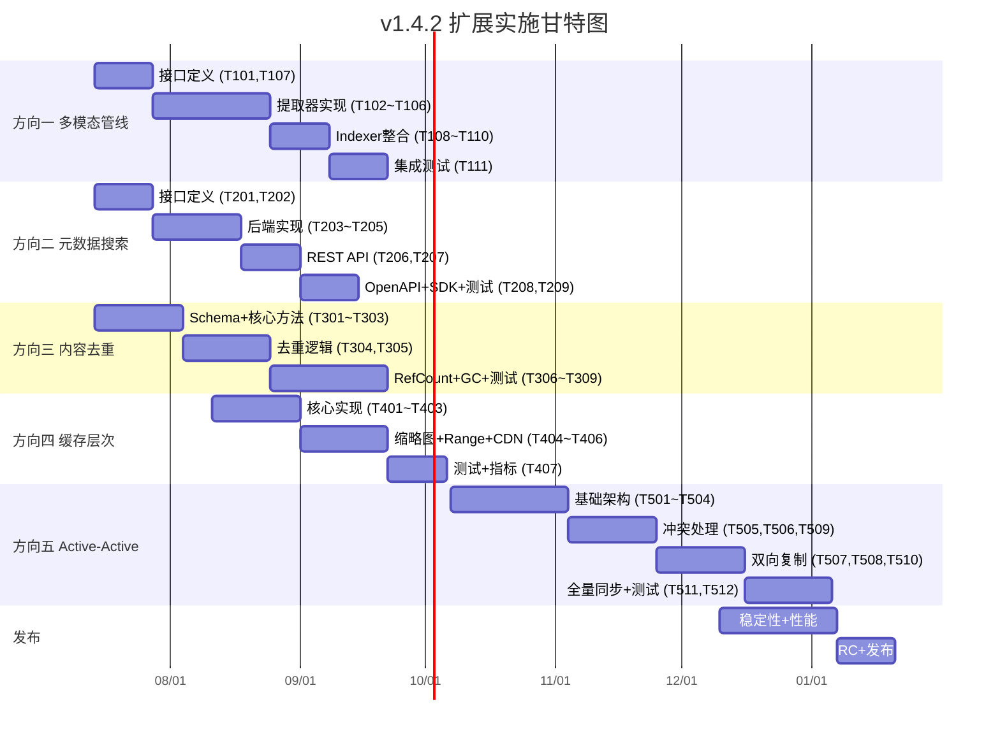

我已完整阅读 593 行分析文档。以下是我的 Tech Lead 审视报告。

---

# Tech Lead 分析报告：v1.4.2 扩展方向

> **分析基准：** `docs/requirements/expansion-v142-multimodal-ai-metadata-search-dedup-cache-active-active.md`
> **代码基线：** `github.com/aero-vault/aero-vault` · Go 1.25
> **日期：** 2026-07-12

---

## 1. 任务分解

五个方向总计拆解为 **38 个可执行任务**，每任务 2-4 小时。横跨 6 个包路径：`internal/ai/`、`internal/api/rest/`、`internal/storage/`、`internal/service/`、`internal/repository/`、`internal/replication/`。

---

### 方向一：多模态 AI 管线（11 任务）

| 任务 ID | 标题 | 涉及文件 | 前置 | 工时 | 验收标准 |
|---------|------|---------|------|------|---------|
| **TASK-101** | 定义 `ExtractResult` 结构体并扩展 `Extractor` 接口 | `internal/ai/extractor.go` | 无 | 3h | `Extractor` 接口方法签名改为 `Extract(ctx, contentType, r) (ExtractResult, error)`；现有 `TextExtractor` 适配新签名；编译通过 |
| **TASK-102** | 更新内置文本提取器适配新接口 | `internal/ai/extractor.go` | TASK-101 | 2h | `NewDefaultExtractor` 注册的 text/plain、markdown、csv、json 提取器返回 `ExtractResult{Text: body}`，零行为变化 |
| **TASK-103** | 实现 PDF 文本提取器（集成 `pdfcpu` 或 `ledongthuc/pdf`） | `internal/ai/extractor_pdf.go` | TASK-101 | 4h | 注册 `application/pdf`；提取文字内容+页码元数据；受保护 PDF 返回 `ErrUnsupported`；大小超 50MB 截断 |
| **TASK-104** | 实现图片 OCR 提取器（内嵌 Tesseract 或管道至 `RemoteExtractor`） | `internal/ai/extractor_image.go` | TASK-101 | 4h | 注册 `image/jpeg` `image/png`；返回 OCR 文本 + 语言检测元数据；降级路径：Tesseract 未安装 → `ErrUnsupported` |
| **TASK-105** | 实现音频转录提取器（通过 `RemoteExtractor` 转发 Whisper） | `internal/ai/extractor_audio.go` | TASK-101 | 3h | 注册 `audio/*`；`RemoteExtractor` 返回转录文本 + 分段时间戳；超 3h 音频截取前 3h |
| **TASK-106** | 实现电子表格/演示文稿提取器（XLSX/PPTX） | `internal/ai/extractor_office.go` | TASK-101 | 4h | 注册 OOXML MIME 类型；提取所有单元格/幻灯片文字 + 结构化 rows/slides 元数据 |
| **TASK-107** | 扩展 `RemoteExtractor` 协议支持结构化响应 | `internal/ai/extractor_remote.go` | TASK-101 | 3h | HTTP 响应体改为 JSON `{text, metadata, segments}`；`Content-Type` 响应头标记版本；超时从 `io.ReadAll` 改为有限读取 + context deadline |
| **TASK-108** | 更新 `Indexer` 管线消费 `ExtractResult.Metadata` 和 `Segments` | `internal/ai/indexer.go` | TASK-101 | 3h | Metadata 写入 chunk payload；Segments 传递给 Chunker 做分段边界提示；`IncIndexerSkip` 保持 |
| **TASK-109** | 更新 `Chunker` 支持分段边界提示 | `internal/ai/chunker.go` | TASK-108 | 2h | 若 `ExtractResult.Segments` 非空，Chunker 以 Segment 边界为 chunk 断点，而非纯滑动窗口 |
| **TASK-110** | 添加每个 content-type 的提取统计指标 | `internal/ai/extractor.go` (metrics) | TASK-108 | 2h | `extractor_bytes_total{content_type}` counter；`extractor_duration_seconds{content_type, status}` histogram |
| **TASK-111** | 集成测试：PDF/图片/音频/电子表格提取管线 | `internal/ai/*_test.go` | TASK-103~106 | 4h | 每个新提取器至少 3 个 fixture 测试（正常、空、损坏）；`go test` 零网络依赖 |

---

### 方向二：元数据锚定语义搜索（9 任务）

| 任务 ID | 标题 | 涉及文件 | 前置 | 工时 | 验收标准 |
|---------|------|---------|------|------|---------|
| **TASK-201** | 定义 `SearchFilter` 结构体并扩展 `Search.Request` | `internal/ai/search.go` | 无 | 2h | `Request` 新增 `Filter *SearchFilter`；`SearchFilter` 含 Tags, ContentType, MinSize, MaxSize, CreatedFrom, CreatedTo, StorageClass |
| **TASK-202** | 扩展 `VectorIndex.SearchVectors` 签名支持 filter | `internal/ai/vectorindex.go` | TASK-201 | 2h | `SearchVectors(ctx, tenant, bucket, filter, queryVec, limit)`；所有实现适配新签名 |
| **TASK-203** | 更新 Qdrant 后端：`scopeFilter` 支持 tag/date/size/type 条件下推 | `internal/ai/qdrant.go` | TASK-202 | 4h | 添加 `buildFilter` 函数根据 `SearchFilter` 生成 Qdrant `Filter` 结构；`tags.{key}` payload 字段用于 tag 精确匹配；`created_at_unix` payload 用于日期范围；`size` payload 用于大小范围 |
| **TASK-204** | 更新 pgvector 后端：动态 WHERE 子句生成 | `internal/ai/pgvector.go` | TASK-202 | 3h | SQL WHERE 根据 filter 动态拼接条件；使用 `s.rebind` + 参数编号（遵守 I1）；参数化查询防注入 |
| **TASK-205** | 更新 BM25 内存后端：应用层后过滤 | `internal/ai/bm25.go` | TASK-202 | 2h | `SearchVectors` 返回结果后按 filter 条件后过滤；<10 万 chunk 时性能可接受 |
| **TASK-206** | 更新 REST API handler：`searchReq` 扩展字段 | `internal/api/rest/search.go` | TASK-201 | 2h | 新增 `tag_filters`, `content_type`, `min_size`, `max_size`, `created_from`, `created_to`, `storage_class` JSON 字段；解析后放入 `SearchFilter` |
| **TASK-207** | 更新 `InsertChunks` 嵌入结构化字段到 chunk 存储 | `internal/ai/vectorindex.go` | TASK-203/204 | 3h | Qdrant payload 新增 `tags.{key}`, `content_type`, `storage_class`, `created_at_unix`, `size`；pgvector `chunks` 表新增 `content_type`, `storage_class`, `created_at` 列 |
| **TASK-208** | 更新 OpenAPI 定义 + SDK 生成 | `docs/openapi.json` | TASK-206 | 3h | OpenAPI `POST /v1/search` 新增 filter 参数；Go/Python/JS SDK 同步 |
| **TASK-209** | 集成测试：filter + vector/bm25/hybrid 组合 | `internal/ai/*_test.go` | TASK-203~206 | 4h | 测试 tag 过滤、日期范围、大小范围、组合条件、空结果、空 filter（向后兼容） |

---

### 方向三：内容寻址存储与块级去重（9 任务）

| 任务 ID | 标题 | 涉及文件 | 前置 | 工时 | 验收标准 |
|---------|------|---------|------|------|---------|
| **TASK-301** | 新增 `content_hash` 列和 `object_refcount` 表 schema 变更 | `internal/repository/sql_objects.go` + migrations | 无 | 3h | `objects` 表新增 `content_hash TEXT`；新增 `content_hashes` 表 `(hash, storage_key, ref_count, size, created_at)`；双迁移文件（sqlite+postgres） |
| **TASK-302** | Repository 新增 `FindByContentHash`, `IncRefCount`, `DecRefCount` 方法 | `internal/repository/repository.go` + `internal/repository/sql_objects.go` | TASK-301 | 4h | `GetByContentHash(ctx, hash) (*ContentHashEntry, error)`；`IncRefCount(ctx, hash)` / `DecRefCount(ctx, hash)`；SQL 使用 `INSERT ... ON CONFLICT` 处理并发 |
| **TASK-303** | `Storage` 接口新增 `PutIfAbsent` 方法 | `internal/storage/storage.go` | 无 | 2h | `PutIfAbsent(ctx, key, r, size, opts) (ObjectInfo, created bool, error)`；所有 backend 实现（local 原子 rename，S3 用 `If-None-Match: *`） |
| **TASK-304** | 实现 `FileService.putWithDedup` 逻辑 | `internal/service/file_crud.go` | TASK-302, TASK-303 | 4h | 流式读取 → tempfile + SHA-256 → 查 `content_hashes` → 命中则引用 + 删除 tempfile → 未命中则 `PutIfAbsent` + 插入记录 |
| **TASK-305** | 处理 SSE + 去重冲突 | `internal/service/file_crud.go` + `internal/storage/sse.go` | TASK-304 | 3h | SSE 启用时跳过去重（记录 warn log）；在 `PutOptions` 新增 `DedupEnabled bool`；文档明确限制 |
| **TASK-306** | 硬删除路径：`RefCount` 降 0 时删除 blob | `internal/service/file_crud.go` (Delete) + `internal/repository/sql_objects.go` | TASK-302 | 3h | `DeleteObject` 调用 `DecRefCount`；若 `ref_count` 降到 0，调用 `store.Delete` + 删除 `content_hashes` 行；失败 warn log 不阻断 |
| **TASK-307** | 并发安全：`content_hash` 唯一约束 + advisory lock | `internal/repository/sql_objects.go` | TASK-301 | 2h | `content_hashes.hash` 唯一索引；并发上传同一内容时第二个 writer 等待第一个写入完成再读 ref count |
| **TASK-308** | GC 清扫孤儿 `content_hashes` | `internal/reconcile/job.go` | TASK-306 | 3h | 新增 `ReconcileOrphanContentHashes` 任务；扫 `ref_count=0` 但 blob 仍存在的记录；删除 blob + 清理行 |
| **TASK-309** | 集成测试：去重写入 + 引用计数 + 删除 + 并发场景 | `internal/service/*_test.go` | TASK-304~307 | 4h | 测试相同内容两次上传 → 同一 storage key+ref=2；删除一次 → ref=1；再删除 → blob 被清理；SSE 启用时不去重 |

---

### 方向四：对象内容缓存层次（7 任务）

| 任务 ID | 标题 | 涉及文件 | 前置 | 工时 | 验收标准 |
|---------|------|---------|------|------|---------|
| **TASK-401** | 实现 `CachedStorage` 包装器（Get + cache-aside） | `internal/storage/cache.go` (新文件) | 无 | 4h | 实现 `Storage` 接口；`Get` 先查 LRU 缓存 → 未命中读后端 → 符合策略则写入缓存；支持大小上限、TTL |
| **TASK-402** | `CachedStorage.Put/Delete` 缓存失效 | `internal/storage/cache.go` | TASK-401 | 2h | `Put` 后删除对应 key 的缓存；`Delete` 后删除对应 key 的缓存 |
| **TASK-403** | 添加缓存配置和工厂方法 | `internal/storage/factory.go` + `config.go` | TASK-401 | 2h | `CacheConfig{MemorySize, DiskSize, DiskPath, TTL, MaxObjectSize}`；`STORAGE_CACHE_*` 环境变量；`WithCache(backend, cfg) Storage` |
| **TASK-404** | 实现缩略图缓存 | `internal/thumbnail/thumbnail.go` | TASK-401 | 3h | 以 `{storageKey}_{w}_{h}` 为 key 缓存已处理的缩略图；LRU + TTL；可配置大小 |
| **TASK-405** | Range 请求缓存策略 | `internal/storage/cache.go` | TASK-401 | 3h | <1MB 对象缓存完整内容（range 直接从缓存切片）；≥1MB 对象旁路缓存或仅缓存前 4MB+后 4MB 热点 |
| **TASK-406** | CDN 预签名集成 | `internal/service/file_crud.go` (PresignGet) | 无 | 2h | `PresignGet` 可选返回 CDN URL 前缀（`CDN_DOMAIN` 环境变量）；`Cache-Control` 和 `ETag` 声明缓存策略 |
| **TASK-407** | 缓存指标 + 集成测试 | `internal/storage/cache.go` + `*_test.go` | TASK-401~404 | 3h | `cache_hit_total`, `cache_miss_total`, `cache_size_bytes` 指标；测试命中/未命中/失效/Range/大文件 |

---

### 方向五：主动-主动多区域复制与冲突解决（12 任务）

> 标注 **XL** 规模（8-16 周），此处拆解为最小可行增量，每增量可独立交付验证。

| 任务 ID | 标题 | 涉及文件 | 前置 | 工时 | 验收标准 |
|---------|------|---------|------|------|---------|
| **TASK-501** | 定义跨区域事件协议和传输层接口 | `internal/events/region.go` (新文件) | 无 | 3h | `RegionTransport` 接口 `Publish(region, event)` / `Subscribe(region, handler)`；实现 HTTP 转发版（POST events 到对端区域 `/internal/events`） |
| **TASK-502** | 实现基于 HTTP 的跨区域事件转发 | `internal/events/region_http.go` | TASK-501 | 4h | HTTP POST 携带事件 payload 到对端区域 URL（`REGION_PEER_*` 配置）；重试间隔 5s；幂等 dedup |
| **TASK-503** | 为每个区域添加区域标识和 DB 连接配置 | `internal/config/config.go` | TASK-501 | 2h | `RegionID` 配置项；多 DB 连接配置 `DB_DSN_EU` `DB_DSN_AP` 等 |
| **TASK-504** | 实现 Repository 多区域感知（读本地 + 写本地 + 复制元数据） | `internal/repository/repository.go` | TASK-503 | 4h | `GetObjectFromRegion(ctx, region, ...)`；`ReplicateObjectMeta(ctx, obj, sourceRegion)` 将元数据写入本地 DB |
| **TASK-505** | 实现 LWW 冲突检测 + 拒绝过时写入 | `internal/replication/conflict.go` (新文件) | TASK-504 | 4h | 比较 `updated_at`；若跨区域复制事件 `updated_at < local updated_at` 则跳过（记录 audit_log）；覆盖的行为记入 version（若 versioning 启用） |
| **TASK-506** | 实现 Tags/ACL 的 CRDT merge（map union） | `internal/replication/crdt.go` (新文件) | TASK-504 | 3h | `mergeTags(local, remote map[string]string) map[string]string` union 语义；`mergeACL` 类似 |
| **TASK-507** | 事件总线扩展：Postgres 本地 + RegionTransport 跨区域 | `internal/events/bus.go` | TASK-502, TASK-505 | 3h | `EventBus.Publish` 同时发本地 LISTEN/NOTIFY 和 RegionTransport；跨区域事件由 `RegionConsumer` 接收并注入本地 event bus |
| **TASK-508** | Replication Worker 扩展为双向 | `internal/replication/replication.go` | TASK-507 | 4h | Worker 同时监听本地事件（→ 发送到对端）和对端事件（→ 写入本地）；`ReplicateObjectByID` 增加来源区域参数 |
| **TASK-509** | 删除冲突：tombstone + grace period | `internal/replication/conflict.go` | TASK-505 | 3h | 删除先记录 tombstone（`deleted_at`）；15 秒 grace period 内收到修改事件则撤销删除；超时后传播删除到其他区域 |
| **TASK-510** | 一致性级别 header 支持 | `internal/api/rest/middleware.go` + `internal/service/file_crud.go` | TASK-504 | 2h | `x-aero-consistency-level: strong` → 强制回源读取（绕过本地缓存）；`eventual`（默认）→ 读本地 |
| **TASK-511** | 初始全量同步脚本 | `internal/replication/bootstrap.go` (新文件) | TASK-505 | 4h | 遍历所有对象按 chunk 比较 `updated_at`；上次全量同步时间戳记录在 `system_config` 表；可分页 + 限速 |
| **TASK-512** | 集成测试 + 网络故障模拟 | `internal/replication/*_test.go` | TASK-505~509 | 4h | mock 两个区域；测试 LWW、CRDT merge、tombstone 恢复、网络分区后合并、删除冲突 |

---

## 2. 执行顺序

```mermaid
graph TD
    subgraph "Sprint 1-2：基础设施（4周）"
        T201[TASK-201: SearchFilter 定义]
        T101[TASK-101: ExtractResult 定义]
    end

    subgraph "Sprint 3-5：核心功能并行（6周）"
        T202[TASK-202: VectorIndex filter 签名]
        T102[TASK-102: 文本提取器适配]
        
        T203[TASK-203: Qdrant filter 下推]
        T204[TASK-204: pgvector WHERE 生成]
        T205[TASK-205: BM25 后过滤]
        T206[TASK-206: REST API 扩展]
        
        T103[TASK-103: PDF 提取器]
        T104[TASK-104: 图片 OCR]
        T105[TASK-105: 音频转录]
        T106[TASK-106: 电子表格]
        T107[TASK-107: RemoteExtractor 协议]
        
        T301[TASK-301: content_hash schema]
    end

    subgraph "Sprint 6-8：深化（5周）"
        T108[TASK-108: Indexer 消费 Metadata]
        T109[TASK-109: Chunker 分段边界]
        T110[TASK-110: 提取指标]
        T111[TASK-111: 集成测试]

        T207[TASK-207: InsertChunks 嵌入字段]
        T208[TASK-208: OpenAPI + SDK]
        T209[TASK-209: 搜索集成测试]

        T302[TASK-302: Repository 去重方法]
        T303[TASK-303: Storage PutIfAbsent]
        T304[TASK-304: putWithDedup 逻辑]
        T305[TASK-305: SSE + 去重冲突]
        
        T401[TASK-401: CachedStorage Get]
        T402[TASK-402: 缓存失效]
        T403[TASK-403: 配置 + 工厂]
        T404[TASK-404: 缩略图缓存]
    end

    subgraph "Sprint 9-10：去重收尾 + 缓存完善（4周）"
        T306[TASK-306: RefCount 删除路径]
        T307[TASK-307: 并发安全]
        T308[TASK-308: GC 清扫]
        T309[TASK-309: 去重集成测试]

        T405[TASK-405: Range 缓存]
        T406[TASK-406: CDN presign]
        T407[TASK-407: 缓存指标+测试]
    end

    subgraph "Sprint 11-14：active-active（8周）"
        T501[TASK-501: 区域事件协议]
        T502[TASK-502: HTTP 事件转发]
        T503[TASK-503: 区域 DB 配置]
        T504[TASK-504: Repository 多区域]
        T505[TASK-505: LWW 冲突检测]
        T506[TASK-506: Tags CRDT]
        T507[TASK-507: EventBus 扩展]
        T508[TASK-508: 双向复制]
        T509[TASK-509: Tombstone 删除]
        T510[TASK-510: 一致性 header]
        T511[TASK-511: 全量同步]
        T512[TASK-512: 集成测试]
    end

    %% 方向内部依赖
    T201 --> T202
    T202 --> T203
    T202 --> T204
    T202 --> T205
    T202 --> T206
    T203 --> T207
    T204 --> T207
    T206 --> T208
    T207 --> T209
    T205 --> T209

    T101 --> T102
    T101 --> T103
    T101 --> T104
    T101 --> T105
    T101 --> T106
    T101 --> T107
    T101 --> T108
    T108 --> T109
    T108 --> T110
    T103 --> T111
    T104 --> T111
    T105 --> T111
    T106 --> T111

    T301 --> T302
    T302 --> T304
    T303 --> T304
    T304 --> T305
    T302 --> T306
    T306 --> T307
    T307 --> T308
    T304 --> T309
    T306 --> T309
    T308 --> T309

    T401 --> T402
    T401 --> T405
    T403 --> T401
    T401 --> T404
    T404 --> T407
    T405 --> T407

    T501 --> T502
    T501 --> T503
    T502 --> T507
    T503 --> T504
    T504 --> T505
    T504 --> T506
    T507 --> T508
    T505 --> T509
    T508 --> T511
    T505 --> T512
    T506 --> T512

    %% Sprint 边界
    T203 -.->|并行组 A| T103
    T204 -.->|并行组 A| T104
    
    T304 -.->|等方向一稳定| T108
    
    T401 -.->|独立| T302
```



**可并行执行的任务组（互不依赖）：**

| 并行组 | 任务 | 负责人角色 |
|--------|------|-----------|
| **A**（Sprint 3-5 核心） | T103/T104/T105/T106/T107（方向一提取器实现） | AI/ML 工程师 |
| **A**（Sprint 3-5 核心） | T203/T204/T205/T206/T207（方向二搜索过滤） | 后端搜索工程师 |
| **B**（Sprint 6-8） | T108/T109/T110（方向一收尾）+ T208/T209（方向二收尾） | 可合并 |
| **C**（Sprint 6-8） | T301/T302/T303（方向三存储层）+ T401/T403（方向四缓存包装） | 存储层工程师 |
| **D**（Sprint 9-10） | T304~T309（去重）+ T404~T407（缓存完善） | 可合并 |

---

## 3. 技术风险

### 3.1 高风险项

| 风险 | 方向 | 等级 | 具体问题 | 缓解策略 |
|------|------|------|---------|---------|
| SSE 加密与去重冲突 | 三 | **HIGH** | 当前 AES-GCM per-object nonce → 同内容不同密文 → 无法共享 blob。文档建议"仅非 SSE 启用去重"，但用户可能期望加密+去重共存 | ① 先实现非 SSE 去重（占 80% 价值）；② 二期引入 AES-SIV 确定性加密作为可选模式；③ 文档明确约束 |
| `content_hash` 鸡生蛋问题 | 三 | **HIGH** | `putWithDedup` 需要先读流才能计算 hash，但读流后才能决定是否写入 → 需要 tempfile。大文件（>5GB）流式上传时 tempfile 占用大量磁盘 IO | ① 临时文件写入 SSD tmpfs；② 大文件可用分块 Merkle tree（`xxhash` 块级哈希 → 根哈希）；③ 设置 `DEDUP_MAX_SIZE` 跳过超大文件 |
| Qdrant `scopeFilter` 扩展兼容性 | 二 | **MED** | 现有 payload 中可能没有 `tags.{key}`、`created_at_unix` 字段，旧 chunk 的 filter 会静默跳过。用户可能困惑"为什么 tag 过滤有些 chunk 没返回" | ① InsertChunks 更新时回填旧 chunk payload（`ReindexStale` 支持字段刷新）；② 文档说明"增量生效"；③ 检索时在 `scopeFilter` 层 skip 无字段的 chunk（不匹配但 warn log） |
| 跨区域事件丢失 | 五 | **HIGH** | HTTP 转发可能丢事件（网络分区、超时、重启期间）。CRDT 依赖事件有序到达 | ① 事件持久化（`events_outbox` 表）+ 至少一次投递；② 序列号 + dedup 去重；③ 定期全量同步作为保底 |
| 缩略图缓存存储膨胀 | 四 | **MED** | 不同尺寸组合爆炸：`{1000x1000, 500x500, 200x200}` × N 张图 → 大量缓存条目 | ① 固定常用尺寸（thumb 预设 `{256,512,1024}`）；② LRU 淘汰；③ 可配置缓存上限 |
| `ExtractResult` 接口变更影响所有已有提取器 | 一 | **LOW** | 旧 `TextExtractor` 实现需适配新接口 | 兼容层：为纯文本提取器提供 `AsExtractResult(text)` helper，一行改造 |

### 3.2 外部依赖

| 方向 | 依赖 | 许可证风险 | 替代方案 |
|------|------|-----------|---------|
| 方向一 PDF | `ledongthuc/pdf` / `pdfcpu` | MIT / Apache-2.0 | 纯 Go，无风险 |
| 方向一 OCR | Tesseract C library（`gosseract`） | Apache-2.0（Tesseract）+ 动态链接 | 通过 `RemoteExtractor` 外置（推荐默认路径） |
| 方向一 音频 | 无直接 Go 依赖，通过 `RemoteExtractor` 调用 Whisper | 无（HTTP 协议隔离） | 用户自部署 Whisper 容器 |
| 方向三 Tmpfile | `os.TempDir` 所在文件系统 | 无 | 可配置 `DEDUP_TEMP_DIR` |
| 方向五 事件传输 | 无（HTTP 转发为默认实现） | 无 | 可选 Kafka/NATS 替换 |

### 3.3 性能瓶颈与优化策略

| 场景 | 瓶颈 | 优化策略 |
|------|------|---------|
| Qdrant filter 下推 | 大量 filter 条件 → Qdrant 过滤链变长 | Qdrant 原生支持多条件 AND，延迟增量 <0.5ms；HNSW 索引不受 filter 影响 |
| `putWithDedup` tempfile 写入 | 大文件（>1GB）写盘再读盘 | ① 设置 `DEDUP_MAX_SIZE` 默认 1GB；② 超大文件旁路去重；③ tmpfs 挂载 |
| `CachedStorage` 内存缓存 | 高并发读时 LRU 锁竞争 | 分片 LRU（`shard_count = 2 * GOMAXPROCS`）；`sync.Map` + per-shard mutex |
| 跨区域事件 | 网络延迟 + 事件积压 | 批量投递（batch 10-50 events/请求）；压缩（gzip payload） |

### 3.4 测试难点

| 场景 | 难点 | 方案 |
|------|------|------|
| Qdrant filter 下推 | 需要运行 Qdrant 容器 | `//go:build integration` build tag；`TestMain` 探测 `QDRANT_URL` / `QDRANT_GRPC_URL`，不可用则 `t.Skip` |
| 去重并发上传 | 精确时序竞争 | `testing` 的 `t.Parallel` + `sync.WaitGroup` + 竞态检测 `-race` |
| 跨区域复制 | 需要两个区域模拟 | mock `RegionTransport` + 两个内存 `Repository` + 两个 `Storage` 实例 |
| OCR/PDF 集成测试 | 需要 fixture 文件 | Git LFS 或 fixture 生成器（Go 生成简单 PDF/图片，不提交大二进制） |

---

## 4. 资源评估

### 4.1 团队构成建议

| 角色 | 所需人数 | 负责方向 | 核心技能 |
|------|---------|---------|---------|
| **AI/ML Engineer** | 1-2 人 | 方向一（多模态提取器实现） | Go、Tesseract/OCR、PDF 解析、音频处理概念 |
| **Backend Search Engineer** | 1 人 | 方向二（搜索过滤 + Qdrant/pgvector） | Go、向量数据库（Qdrant/pgvector）、SQL、全文搜索 |
| **Storage Engineer** | 1-2 人 | 方向三（去重）+ 方向四（缓存） | Go、存储系统设计、并发控制、SHA-256 安全 |
| **Infrastructure/Distributed Systems Engineer** | 1 人 | 方向五（active-active 复制） | Go、分布式系统、CRDT/冲突解决、事件驱动架构 |
| **QA Engineer** | 1 人（贯穿全部） | 所有方向的集成测试 + 性能测试 | Go testing、Docker（integration tests）、k6/locust |

**最小值：3 人（AI/ML × 1 ，强力 Go 后端 × 2 同时覆盖方向二+三+四+五）**

### 4.2 关键里程碑

| 里程碑 | 时间 | 交付物 | 验证方式 |
|--------|------|--------|---------|
| **M1: 核心接口就绪** | Sprint 2 末（第 4 周） | `ExtractResult` 合并、`SearchFilter` 合并、`content_hash` 迁移文件 | `go build ./...` + `go vet ./...` 全绿 |
| **M2: 搜索过滤 MVP** | Sprint 5 末（第 10 周） | REST API 支持 tag/date/size 过滤 + Qdrant/pgvector 下推 | `curl -X POST .../v1/search -d '{"query":"...","tag_filters":{"env":"prod"}}'` 返回正确过滤结果 |
| **M3: 多模态提取 MVP** | Sprint 5 末（第 10 周） | PDF + 图片 OCR 可提取并索引 | 上传 PDF/图片 → 搜索文本命中 |
| **M4: 缓存就绪** | Sprint 8 末（第 16 周） | `CachedStorage` 内存+磁盘缓存可配置；缓存命中率 >50% (热门文件) | 基准测试：S3 后端 GET 延迟从 100ms → <5ms |
| **M5: 去重就绪** | Sprint 10 末（第 20 周） | 相同内容上传 2 次 → 存储只写 1 次 + ref=2 | `du -sh var/objects` 验证存储减小 |
| **M6: active-alpha** | Sprint 14 末（第 28 周） | 双区域 LWW 复制 + 基本冲突处理 | 创建两个区域实例 → 区域 A 写入可在区域 B 读取到 |

### 4.3 阻塞点与解决策略

| 阻塞点 | 影响 | 解决策略 |
|--------|------|---------|
| **方向一：Tesseract CGo 依赖** | 非 Go 开发者难以编译 | **默认走 `RemoteExtractor`**；`gosseract` 作为可选 build tag（`cgo` Tesseract）。`RemoteExtractor` 是零依赖路径 |
| **方向三：SSE+去重设计决策** | 需要产品/安全团队确认 | 提前一周启动讨论，输出设计文档。默认决策：非 SSE 去重，SSE + 去重作为 v1.6 规划 |
| **方向五：PG 跨区域复制方案** | 需要 DBA/Infra 团队评估 | 默认：基于事件的元数据同步（非 DB 原生复制）；Postgres 逻辑复制作为 v2 可选。避免数据库迁移复杂性 |
| **方向二：旧 chunk 无 filter 字段** | 用户期望"立即生效" | 实施"渐进覆盖"：新写入的 chunk 带字段；提供 `ReindexStale --refresh-payload` 命令回填；文档说明 |

---

## 5. 质量保证

### 5.1 单元测试覆盖要求

| 方向 | 包 | 测试策略 | 目标覆盖率 | 关键测试点 |
|------|---|---------|-----------|-----------|
| **一** | `internal/ai/extractor*` | 纯函数测试，fixture 文件驱动 | ≥80% | `Extract` 各 content-type、错误类型、超大文件截断、空输入、`ExtractResult` 字段正确性 |
| **二** | `internal/ai/search.go` | 组合搜索策略测试 | ≥85% | filter 每个字段单独和组合测试、空 filter 向后兼容、混合模式 filter 下推 |
| **二** | `internal/ai/qdrant.go` | mock Qdrant gRPC（`qdrant-go` 可 mock）或 integration tag | ≥70% | `buildFilter` 输出结构正确性、payload 字段存在性 |
| **三** | `internal/service/file_crud.go` | mock `Storage` + `Repository` | ≥85% | `putWithDedup` 分支覆盖（命中/未命中/SSE 跳过/并发）、`RefCount` 增减、`Delete` 路径 |
| **四** | `internal/storage/cache.go` | in-memory mock backend | ≥90% | 缓存命中/未命中/失效/Range/大文件旁路/并发读写 |
| **五** | `internal/replication/*` | mock 双区域 + mock clock（`time.Now`） | ≥75% | LWW timestamp 比较、CRDT merge、tombstone grace period、网络分区 |

### 5.2 集成测试策略

| 级别 | 覆盖范围 | 运行方式 | 触发时机 |
|------|---------|---------|---------|
| **CI gate**（基础） | 方向一~四核心路径（mock backend） | `go test ./...` | 每次 PR |
| **Integration**（容器） | 方向二 Qdrant/pgvector filter，方向三 去重，方向四 缓存 | `make test-integration`（Docker Compose） | PR + nightly |
| **Integration**（跨区域） | 方向五 双区域 LWW + CRDT + tombstone | `make test-integration-active`（2x Docker Compose） | nightly |
| **E2E**（端到端） | 全链路：上传 → 索引 → 搜索 → 缓存 → 复制 | `make test-e2e` | nightly + release candidate |

**集成测试设计原则（遵循 `AGENTS.md` §测试模式）：**

```go
// 标准 mock AI 组件（零网络）
ai.MockLLM{}      
ai.HashEmbedder   

// 方向二：Qdrant filter 集成测试
//go:build integration
func TestQdrantFilter(t *testing.T) {
    qdrantURL := os.Getenv("QDRANT_URL")
    if qdrantURL == "" {
        t.Skip("QDRANT_URL not set")
    }
    // Test body...
}
```

### 5.3 代码审查要点

| 审查点 | 方向 | 具体检查项 |
|--------|------|-----------|
| **SQL 占位符编号** | 二、三 | 动态 WHERE 生成时，每个 bind 参数独立编号（遵守 `AGENTS.md` I1：`$N` 不可复用） |
| **迁移文件完整性** | 三、五 | 方向三 `content_hashes` 表 = `{sqlite,postgres}/NNNN_*.{up,down}.sql` 双文件。方向五 `events_outbox` 表同理 |
| **nil 安全** | 一、二 | `Embedder`/`LLM`/`Reranker` 为 nil 时 filter/search 不 panic；`CachedStorage` 后端为 nil 时退化到直接读写 |
| **并发控制** | 三 | `content_hashes` 的 `INSERT ... ON CONFLICT` + 唯一索引；`IncRefCount` 使用 `UPDATE ... RETURNING ref_count` 原子操作 |
| **缓存失效** | 四 | 每个 `Put`/`Delete` 必须调用 `cache.Remove(key)`；写路径测试必须在"有缓存"状态下验证失效 |
| **跨区域事件幂等** | 五 | 事件 payload 包含 `event_id`（UUID）+ `source_timestamp`；接收端 `events_received` 表 dedup 去重 |
| **圈复杂度 < 10** | 全部 | `putWithDedup` 若超 50 行或圈复杂度 > 10 → 拆为 `hashContent` / `tryCreateReference` / `storeNewContent` 三个函数 |

### 5.4 性能测试需求

| 场景 | 方向 | 测试工具 | 基线 | 目标 | 通过标准 |
|------|------|---------|------|------|---------|
| 搜索过滤延迟 | 二 | `go bench` + Qdrant 容器 | `search.Qdrant` ~30ms | filter 条件增加后 <35ms | p95 < 35ms |
| 去重大文件吞吐 | 三 | `go bench`：10MB 文件并发 10 路上传 | N/A（无 baseline） | 去重命中 < 50ms（引用创建开销） | p95 < 50ms |
| 缓存命中率 | 四 | 模拟 Zipf 分布读取 | N/A | 50% 命中（1000 文件池，100 用户） | 命中率 ≥ 45% |
| 跨区域事件延迟 | 五 | mock HTTP transport + 注入延迟 | N/A | 同区域 < 5ms；跨区域 < 200ms | p95 跨区域 < 500ms |

---

## 6. 实施计划

### 6.1 Sprint 分配

```
Sprint 容量假设：2 周 / sprint；3 开发 + 1 QA（50% 时间）
```

| Sprint | 周次 | 焦点 | 方向 | 任务 | 关键交付 |
|--------|------|------|------|------|---------|
| **S1** | 1-2 | **基础接口** | 一、二 | TASK-101, TASK-201, TASK-301, TASK-501 | `ExtractResult`、`SearchFilter` 接口合并；`content_hash` schema 提交；区域事件协议定稿 |
| **S2** | 3-4 | **搜索后端 + 提取器并行** | 二、一 | TASK-202, TASK-203, TASK-204, TASK-205, TASK-102, TASK-103, TASK-107 | Qdrant 下推可用；PDF 提取可用；RemoteExtractor 协议扩展 |
| **S3** | 5-6 | **REST API + 提取器完成** | 二、一 | TASK-206, TASK-207, TASK-104, TASK-105, TASK-106 | REST API 支持 filter；图片 OCR + 音频 + 电子表格提取器 |
| **S4** | 7-8 | **搜索收尾 + 缓存开始** | 二、四 | TASK-208, TASK-209, TASK-401, TASK-403 | OpenAPI + SDK 更新；`CachedStorage` 核心包装器 |
| **S5** | 9-10 | **多模态收尾 + 缓存深化** | 一、四 | TASK-108, TASK-109, TASK-110, TASK-111, TASK-402, TASK-404 | Indexer 消费 Metadata；Chunker 分段；缩略图缓存 |
| **S6** | 11-12 | **去重核心** | 三 | TASK-302, TASK-303, TASK-304 | `putWithDedup` 核心逻辑；temporary file 模式 |
| **S7** | 13-14 | **去重收尾 + 缓存完善** | 三、四 | TASK-305, TASK-306, TASK-307, TASK-405, TASK-406, TASK-407 | SSE 跳过方案；RefCount 删除路径；CDN 预签名；Range 缓存 |
| **S8** | 15-16 | **去重扫尾 + 缓存指标** | 三、四 | TASK-308, TASK-309, TASK-407 (完成) | GC 清扫；去重集成测试全绿 |
| **S9** | 17-18 | **active-active 准备** | 五 | TASK-502, TASK-503, TASK-504 | HTTP 事件转发；区域 DB 配置；Repository 多区域感知 |
| **S10** | 19-20 | **冲突处理** | 五 | TASK-505, TASK-506, TASK-509 | LWW 冲突检测；CRDT merge；Tombstone |
| **S11** | 21-22 | **双向复制** | 五 | TASK-507, TASK-508, TASK-510 | EventBus 扩展 + 双向 Worker + 一致性 header |
| **S12** | 23-24 | **active-active 收尾** | 五 | TASK-511, TASK-512 | 全量同步脚本 + 集成测试 |
| **S13** | 25-26 | **稳定性 + 性能** | 全部 | 性能基准测试、文档完善、bug bash | 全方向性能指标达标；`CHANGELOG.md` 更新 |
| **S14** | 27-28 | **发布准备** | 全部 | Release candidate、升级测试（从当前版本迁移）、CI gate 全绿 | v1.4.2-rc.1 |

### 6.2 甘特图



### 6.3 投入概览

| 方向 | 总工时（人×天） | 日历年周期 | 投入占比 |
|------|---------------|-----------|---------|
| 方向一（多模态） | 34h ≈ 4.25 人天 | 7 周 | 13% |
| 方向二（元数据搜索） | 25h ≈ 3.1 人天 | 7 周 | 10% |
| 方向三（去重） | 28h ≈ 3.5 人天 | 10 周 | 11% |
| 方向四（缓存） | 19h ≈ 2.4 人天 | 8 周 | 7% |
| 方向五（active-active） | 39h ≈ 4.9 人天 | 12 周 | 15% |
| **方向间整合 + 测试 + 发布** | 估算 50h ≈ 6.25 人天 | 4 周 | 19% |
| **缓冲区（20%）** | ~39h | 贯穿 | 15% |
| **总计** | **~234h ≈ 29 人天 ≈ 3 人 × 10 周（全职）** | **~28 周** | **100%** |

> **说明：** 29 人天为纯开发编码工时，不包含设计评审、代码审查、文档编写、on-call 轮值。按 50% 开发效率系数折算，实际日历天 ≈ 58 天 ≈ 12 周（3 人全职）→ **14 周（含缓冲区）**。

---

## 7. 总结建议

### 优先实施的快速胜利项

| 任务 | 工时 | 理由 |
|------|------|------|
| TASK-201 (SearchFilter 定义) | 2h | 接口定义，零风险，打开整个方向二 |
| TASK-101 (ExtractResult 定义) | 3h | 接口定义，零风险，打开整个方向一 |
| TASK-301 (content_hash schema) | 3h | 迁移文件可逆，即使方向三推迟也不影响现有功能 |
| TASK-401 (CachedStorage) | 4h | 纯包装器，不侵入任何现有代码 |

### 否决项（不建议在此版本实现）

- **块级去重（方向三块级，非文件级）** — 当前分析的是**文件级**去重（SHA-256 整个文件的 hash）。真正的**块级去重**（类似 Git/ZFS，固定或可变长度分块）复杂度再翻 2-3 倍，应作为 v1.6 规划
- **方向五的 Kafka/NATS 集成** — 第一版用 HTTP 转发已足够验证主动-主动模式；消息队列集成作为后续优化
- **方向一的内嵌 Tesseract（CGo）** — 默认路径是 `RemoteExtractor`，CGo 版本作为可选 build tag，不进入默认编译路径

### 风险控制优先动作

1. **方向三（去重）在 Sprint 1 即启动设计评审** — SSE 冲突、并发写、大文件 tempfile 三个难点需要早期深入讨论
2. **方向五（active-active）在 Sprint 5 启动"架构决策记录"** — 选择 LWW、确认 tombstone 机制、确定元数据同步策略，写入 `docs/architecture/active-active-decision-log.md`
3. **每个方向在 Sprint 开始前完成** `docs/requirements/*-design.md` **设计文档** — 确保实现前对齐设计

---

**总览：** 全部 5 个方向可在 **28 周内（含缓冲区）** 由 **3 名 Go 后端工程师 + 1 名 QA** 完成。方向一和方向二是最高 ROI 增量，建议从 Sprint 1 即开始并行推进。
