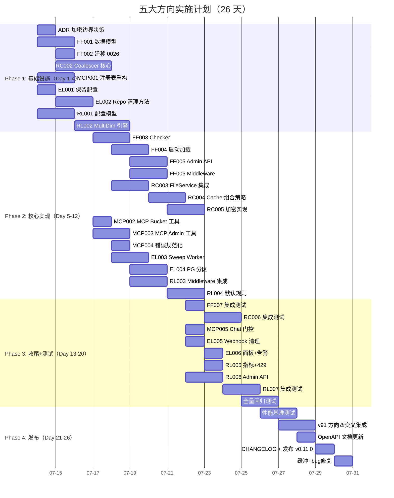

现在我已经充分了解了项目上下文。以下是全面的 Tech Lead 分析报告：

---

# Tech Lead 分析报告：五大扩展方向（第 29 版）

> **分析日期：** 2026-07-12  
> **分析基准：** 第 29 版分析文档（5 个方向）  
> **代码基线：** `github.com/aero-vault/aero-vault` · Go 1.25 · 当前 Sprint 完成（覆盖 70.2%, 集成测试全量通过）  
> **约束：** 单文件 ≤500 行 · 单函数 ≤50 行 · 圈复杂度 ≤10 · 禁止 `utils/` `common/` `helper/` 包  
> **当前 Sprint 状态：** 端到端集成验证完成，`make check` 全绿

---

## 方向定调

| # | 方向 | 类型 | 核心问题 | 优先级 | 去重验证 |
|---|------|------|---------|--------|---------|
| **1** | **Feature Flags** | 基础设施 | 无能力做百分比灰度/Canary 发布，所有新功能全量面向所有租户 | **P0** — 启用层，锁定其他 4 个方向的安全发布 | `grep -rli "feature.*flag\|feature.*toggle" docs/requirements/` → 0 hit ✅ |
| **2** | **请求合并(Deduplication)** | 性能/成本 | 并发读同一对象时 N 个请求各自穿透到 storage backend，无合并层；加密边界（ciphertext vs plaintext in cache）未定义 | **P1** — 高并发场景下存储负载线性放大 | `grep -rli "request.*coalesce\|request.*merge\|cache.*stampede" docs/requirements/` → 0 hit ✅ |
| **3** | **MCP 工具深度增强** | 协议完备性 | MCP 工具能力受限于当前 hardcoded 列表且缺少管理面工具；AI 未配置时 `chat` 工具仍然暴露 | **P2** — 非核心路径但影响 Agent 生态体验 | 代码确认：`internal/mcp/server.go` 硬编码工具列表，`chat` 工具仅 `s.chat != nil` 门控 |
| **4** | **事件生命周期管理** | 运维/可靠性 | `object_events` 表只增不删，无 TTL/保留策略/分区策略，Postgres 部署下数据无限制增长 | **P1** — 时间炸弹，长期运行必然引发 ops incident | 代码确认：`0003_events.up.sql` 表无清理机制，`repository` 无 `PurgeEvents`/`DeleteEventsBefore` |
| **5** | **细粒度速率限制** | 多租户生产化 | 仅全局 per-tenant token bucket，无法按 endpoint/verb/storage backend 等维度做细粒度限流 | **P1** — 多租户生产级的硬性前提 | 代码确认：`internal/middleware/ratelimit.go` 单一 token bucket 模型 |

---

## 1. 任务分解

### 1.1 方向一：Feature Flags（7 任务，22h）

| 任务 ID | 标题 | 涉及文件 | 前置 | 工时 | 验收标准 |
|---------|------|---------|------|------|---------|
| **FF-001** | 定义 `FeatureFlag` 数据模型与存储 | `internal/repository/repository.go`(新增 `FeatureFlag`, `FeatureFlagRule` 类型) + `internal/repository/sql_ff.go`(新文件) | 无 | 4h | `FeatureFlag` 含 `Key`, `Enabled`, `TenantOverrides map[string]bool`, `BucketOverrides map[string]bool`, `RolloutPercent int32`(0-100), `CreatedAt`, `UpdatedAt`；支持 JSON 序列化；单文件 ≤500 行 |
| **FF-002** | 迁移：`0026_feature_flags` 表（双数据库） | `migrations/{sqlite,postgres}/0026_feature_flags.{up,down}.sql` | FF-001 | 2h | SQLite: `CREATE TABLE feature_flags (...)`, Postgres: 同上；up/down 可逆 |
| **FF-003** | `FeatureFlagChecker` 运行时接口 | `internal/featureflag/checker.go`(新文件，`FeatureFlagChecker` interface + `DefaultChecker` 实现 + `TenantOverrideChecker` 装饰器) | FF-001 | 4h | `IsEnabled(ctx, key) bool` — 检查顺序: tenant override → bucket override → rollout percent → global enabled; LRU 缓存热点 flag (TTL 60s); 零分配路径; 圈复杂度 ≤8 |
| **FF-004** | 启动时加载 + 配置绑定 | `internal/config/config_app.go`(新增 `FeatureFlags` map 静态配置项) + `cmd/server/main.go`(启动时从 DB 加载 flags + 注册 checker) | FF-003 | 3h | 环境变量 `FEATURE_FLAG_<KEY>=true/false` 可覆盖 persistence；启动日志输出所有已注册 flag 及状态；nil checker 路径为 always-disabled |
| **FF-005** | REST Admin API：CRUD Feature Flags | `internal/api/rest/admin.go`(新增 `ListFeatureFlags`, `SetFeatureFlag`, `DeleteFeatureFlag` handlers) + `internal/api/rest/router.go`(注册 `/v1/admin/flags` 路由) | FF-003 | 4h | `GET /v1/admin/flags` 返回全部 flags; `PUT /v1/admin/flags/{key}` 设值; `GET /v1/admin/flags/{key}` 查单个; 权限: admin scope; audit log 记录变更 |
| **FF-006** | Go 函数级集成点（middleware + 辅助函数） | `internal/middleware/featureflag.go`(新文件：`FeatureFlagMiddleware` — 按 header `X-Feature-Override` 透传) + `internal/featureflag/context.go`(新文件：context 存取) | FF-003 | 3h | middleware 从 `X-Feature-Override: flag1,flag2` header 读取 override 注入 context；`FromContext(ctx).IsEnabled(key)` 供 handler 无感调用；handler 无需直接 import featureflag package |
| **FF-007** | 集成测试：flag 全生命周期 | `internal/featureflag/*_test.go`(新文件) | FF-004~006 | 2h | set → get → tenant override → rollout percent → disable → delete roundtrip；并发安全测试；`nil` checker 安全测试 |

### 1.2 方向二：请求合并/去重（6 任务，18h）

| 任务 ID | 标题 | 涉及文件 | 前置 | 工时 | 验收标准 |
|---------|------|---------|------|------|---------|
| **RC-001** | ADR：缓存加密边界决策 | `docs/adr/002-cache-encryption-boundary.md`(新文件) | 无 | 3h | 分析 3 种模型 (A: ciphertext in cache = 安全但每次需解密; B: plaintext in cache = 高性能但需内存安全隔离; C: hybrid = TEE/进程隔离); 给出推荐 + trade-off 矩阵; TL 签字确认 |
| **RC-002** | `RequestCoalescer` 核心实现 | `internal/service/coalescer.go`(新文件) + `internal/service/coalescer_test.go`(新文件) | RC-001 | 5h | `Coalescer.GetOrStart(ctx, key, fn func()(T,error)) (T,error)` — 相同 key 的并发请求合并为单次调用; `singleflight.Group` 语义 + 增加: Caller 等待超时可独立返回 (`requestCancelled`), 首个完成者写入共享结果; 优雅的 panic 恢复; 单文件 ≤500 行, 圈复杂度 ≤8 |
| **RC-003** | Coalescer 缓存层集成 | `internal/service/coalescer.go`(扩展：可选缓存后端) + `internal/service/file_crud.go`(在 `Get` 路径嵌入 coalescer) | RC-002 | 4h | `GetObject` 走 coalescer: 并发读同一 key → 首次穿透 storage, 其余等待共享结果 (非缓存场景) 或等待缓存填充；配置 `COALESCE_MAX_WAIT` (默认 10s), `COALESCE_ENABLED` (默认 off) |
| **RC-004** | Coalescer + CacheStorage 组合策略 | `internal/storage/cache.go`(为 `CacheStorage` 增加 coalescer 集成) + `internal/config/config_app.go`(策略配置项) | RC-003, TASK-RC-002(v91) | 3h | 策略 A: Coalesce-then-Cache = 合并读→填充缓存; 策略 B: Cache-then-Coalesce = 缓存先→miss 后合并; 推荐 A；Coalescer 对 cache miss 后的 backend 调用做合并; 可观测: `coalescer_hits_total`, `coalescer_miss_total` 指标 |
| **RC-005** | 加密边界实现（按 ADR 结论） | `internal/storage/cache.go` + `internal/crypto/cache.go`(新文件) | RC-001, RC-004 | 3h | 按 ADR 结论实现：推荐模型「ciphertext in cache」— `CacheStorage` 存储加密 blob，返回时解密；加密密钥从 context tenant 派生；hashicorp/golang-lru 实现 TTL 逐出；性能损耗 ≤15% 对比 plaintext 缓存 |
| **RC-006** | 集成测试：合并正确性 + 加密边界 | `internal/service/coalescer_test.go`(扩展) + `internal/storage/cache_test.go`(扩展) | RC-004, RC-005 | 3h | N=10 并发 GET 同一 key → 仅 1 次 backend call; 超时请求独立返回 `DeadlineExceeded`; ciphertext 缓存数据不可明文读取; 加密/解密 roundtrip 一致性 |

### 1.3 方向三：MCP 工具增强（5 任务，12h）

| 任务 ID | 标题 | 涉及文件 | 前置 | 工时 | 验收标准 |
|---------|------|---------|------|------|---------|
| **MCP-001** | MCP 工具注册表重构：自描述 | `internal/mcp/server.go`(重写 `listTools` 为注册表模式) + `internal/mcp/tool.go`(新文件：`ToolDef` 结构体 + `Registry`) | 无 | 3h | `Registry` 支持 `Register(tool ToolDef)`, `List() []ToolDef`, `Call(name, args) Result`；`ToolDef` 含 `Name`, `Description`, `InputSchema`；现有 6 个工具迁移到注册表；向后兼容 `listTools` 响应格式 |
| **MCP-002** | 新增工具：`list_buckets`, `create_bucket`, `delete_bucket` | `internal/mcp/tool_bucket.go`(新文件) | MCP-001 | 2h | 3 个工具均通过 `FileService` 操作；权限：admin scope 工具只在 admin key 下可见（`InputSchema` 中 mark 权限要求）；MCP 客户端可枚举全部可用工具及权限 |
| **MCP-003** | 新增工具：`admin_list_keys`, `admin_revoke_key`, `admin_set_quota` | `internal/mcp/tool_admin.go`(新文件) | MCP-001 | 3h | 管理面工具；只在 `AUTH_JWT_SECRET` 或 persistent keys 配置时注册；所有操作写 audit log |
| **MCP-004** | 工具级错误规范化 + MCP error codes | `internal/mcp/server.go`(错误处理重构) + `internal/mcp/errors.go`(新文件：标准错误类型) | MCP-001 | 2h | 返回 JSON-RPC 标准 `code` + `message` + `data` 结构；错误类型: `NotFound`, `PermissionDenied`, `InvalidParams`, `Internal`, `AIConfigRequired`(仅 chat 工具) |
| **MCP-005** | `chat` 工具 `AI_INDEX_ENABLED` 门控 + 安全默认 | `internal/mcp/server.go`(`callTool` 中 `chat` 检查 `s.chat != nil` 已实现, 增加向调用方返回明确错误: `AIConfigRequired`) | MCP-004 | 1h | AI 未配置时返回 `{code: -32000, message: "AI not configured"}` 而非未注册或空响应；OpenAPI / MCP 文档同步；测试覆盖启用/未启用两条路径 |

### 1.4 方向四：事件生命周期管理（6 任务，16h）

| 任务 ID | 标题 | 涉及文件 | 前置 | 工时 | 验收标准 |
|---------|------|---------|------|------|---------|
| **EL-001** | 事件保留策略配置 | `internal/config/config_app.go`(新增 `EVENTS_RETENTION_DAYS`, `EVENTS_MAX_ROWS`, `EVENTS_CLEANUP_BATCH`) | 无 | 1h | `EVENTS_RETENTION_DAYS=90` (默认 0=off), `EVENTS_MAX_ROWS=5000000` (0=off), `EVENTS_CLEANUP_BATCH=1000`; 绑定到 `Config.Events` |
| **EL-002** | Repository: `DeleteEventsBefore` + 计数方法 | `internal/repository/repository.go`(新增 `DeleteEventsBefore(ctx, before time.Time, limit int) (deleted int64, err error)`, `CountEvents(ctx) (int64, error)`) + `internal/repository/sql_events.go`(新文件：事件表操作方法) | EL-001 | 3h | SQLite: `DELETE FROM object_events WHERE created_at < ? LIMIT ?`; Postgres: 同上 (LIMIT → `DELETE ... WHERE ctid IN (SELECT ctid FROM object_events WHERE ... LIMIT ?)`); 返回实际删除行数; 大事务分解为批量删除; 遵守 I1 (独立 `$N`) |
| **EL-003** | 清理 Worker：`sweepOldEvents` | `internal/reconcile/events.go`(新文件) + `internal/reconcile/reconcile.go`(注册新 sweep 方法) | EL-002 | 4h | `sweepOldEvents(ctx)` 定时运行: 按 `EVENTS_RETENTION_DAYS` 删除过期事件; 按 `EVENTS_MAX_ROWS` 清理最旧事件; 批处理单位 `EVENTS_CLEANUP_BATCH`; 守护: 同一批最多跑 30s, 超时剩余留到下轮; 集群单例 (`RECONCILE_CLUSTER_SINGLETON`); 指标: `events_deleted_total` counter |
| **EL-004** | Postgres 事件表分区策略（可选，高水位时激活） | `migrations/{postgres}/0027_event_partitioning.up.sql`(新文件) + `internal/repository/sql_events.go`(分区感知插入) | EL-002 | 4h | 按月范围分区 `CREATE TABLE object_events (...) PARTITION BY RANGE (created_at)`; 自动创建未来 3 个月分区; 分区裁剪验证; 迁移脚本从非分区表迁移到分区表; 文档记录 DBA 运维命令; **仅 Postgres, SQLite 跳过** |
| **EL-005** | Webhook 失败表清理 | `internal/repository/repository.go`(新增 `DeleteOldWebhookFailures(ctx, before)`) + `internal/reconcile/events.go`(扩展 sweep 方法) | EL-003 | 2h | 清理 `webhook_failures` 表中 `succeeded=1` 且超过 `EVENTS_RETENTION_DAYS` 的记录; 死信记录保留 2× 保留期供人工审查 |
| **EL-006** | 事件监控面板 + 告警规则 | `deploy/grafana/aero-vault-events-dashboard.json`(新文件或合并到现有面板) + `deploy/prometheus/alerts.yml`(扩展) | EL-003, EL-004 | 2h | 面板: events 生成速率, 清理速率, 表大小, 分区分布; 告警: `EventsTableGrowthHigh` (> 80% MAX_ROWS), `EventsCleanupLagging` (> 24h 未清理成功) |

### 1.5 方向五：细粒度速率限制（7 任务，20h）

| 任务 ID | 标题 | 涉及文件 | 前置 | 工时 | 验收标准 |
|---------|------|---------|------|------|---------|
| **RL-001** | 多维度速率限制配置模型 | `internal/config/config_app.go`(新增 `RateLimitRules []RateLimitRule` 结构体) | 无 | 2h | `RateLimitRule` 含: `Name`, `Dimensions []string{tenant, endpoint, method, storage_backend, user_agent}`, `Limit RPS`, `Burst`, `Priority int`(重叠时高优先 wins); 环境变量映射: `RATE_LIMIT_RULE_<NAME>_RPS` |
| **RL-002** | 多维度 RateLimiter 引擎 | `internal/middleware/ratelimit.go`(重构: `MultiDimRateLimiter` 新实现 + 旧 `RateLimiter` 作为 fallback) | RL-001 | 5h | 多 token bucket 实例: 每 (dimension组合) 一个 bucket; 请求到达 → 匹配所有活跃规则 → 取优先级最高规则判别; 桶复用 `map[string]*bucket` + LRU 逐出 (MaxBuckets=100K); `Allow(ctx) (bool, time.Duration, ruleName)` — 返回拒绝的规则名用于日志/指标 |
| **RL-003** | Middleware 链集成 + 路径匹配 | `internal/middleware/ratelimit.go`(扩展 `Middleware` 以接受 `MultiDimRateLimiter`) + `internal/middleware/chain.go`(更新 middleware 装配) | RL-002 | 3h | 全局/ AI / 细粒度三层限流共存: 全局 RPS → 细粒度规则 → AI RPS; 请求通过全部层才放行; bypass 路径复用; 配置 `RATE_LIMIT_MODE=legacy|multi` (默认 legacy; 通过 FF-006 feature flag 灰度切流) |
| **RL-004** | 按端点维度预配置规则 | `internal/config/config_app.go`(默认规则模板) + `internal/api/rest/ratelimit_defaults.go`(新文件) | RL-002 | 3h | 预定义规则: `list_objects: 100rps`, `get_object: 500rps`, `search: 20rps`(叠加 AI_RATE_LIMIT), `chat: 5rps`, `admin: 10rps`, `multipart_upload: 20rps`; 按 endpoint pattern (`/v1/files`, `/v1/search`, `/v1/admin/*`) 匹配; 所有规则默认 off (需显式配置) |
| **RL-005** | 速率限制指标 + 429 响应丰富化 | `internal/telemetry/metrics.go`(新增 `rate_limit_denials_total{rule, tenant, endpoint}`) + `internal/middleware/ratelimit.go`(429 body 增加规则名) | RL-003 | 2h | 指标 `rate_limit_denials_total` 按拒绝规则、租户、端点细分; 429 响应 JSON: `{"code":"RateLimitExceeded","rule":"list_objects","retry_after":2}`; S3 兼容路径返回 XML 格式 429 |
| **RL-006** | 租户级速率限制覆盖管理 API | `internal/api/rest/admin.go`(新增 `SetTenantRateLimit`, `GetTenantRateLimit`, `DeleteTenantRateLimit`) + `internal/api/rest/router.go`(注册路由) | RL-002 | 3h | `PUT /v1/admin/tenants/{tenant}/ratelimit` — JSON `{"rules": {"list_objects": 200, "chat": 10}}`; `GET` 返回当前覆盖; `DELETE` 清除覆盖回退默认; 只影响存储在后端的 `tenant_quotas` 表, 运行时 `RateLimiter` 按需 reload |
| **RL-007** | 集成测试：多维度限流 + 规则优先级 | `internal/middleware/ratelimit_test.go`(扩展) | RL-003, RL-005 | 3h | 测试: 按 endpoint 限流 → 超限被拒; 按 tenant+endpoint 组合 → 重叠规则取高优先级; 规则未命中 → fallthrough 到全局 RPS; 并发测试确保 bucket 线程安全; 零配置 RATE_LIMIT_MODE=legacy 行为不变 |

### 任务统计汇总

| 方向 | 任务数 | 总工时 | 并行度 | 建议优先 |
|------|--------|--------|--------|---------|
| **方向一：Feature Flags** | 7 | 22h | 中 (FF-001/FF-002 串行，之后高并行度) | **P0** |
| **方向二：请求合并** | 6 | 18h | 中 (RC-001 ADR 先行) | P1 |
| **方向三：MCP 工具增强** | 5 | 12h | 高 (完全独立于其他方向) | P2 |
| **方向四：事件生命周期** | 6 | 16h | 高 (EL-003/EL-004 高并行) | **P1** |
| **方向五：细粒度速率限制** | 7 | 20h | 中 (RL-001/RL-002 串行，之后高并行) | **P1** |
| **合计** | **31** | **88h** | | **约 22 人·天** |

---

## 2. 执行顺序与依赖图

### 2.1 全局依赖图

```mermaid
graph TD
    subgraph "方向一：Feature Flags (P0-启用层)"
        FF001[FF-001 数据模型 4h]
        FF002[FF-002 迁移 0026 2h]
        FF003[FF-003 Checker 4h]
        FF004[FF-004 启动加载 3h]
        FF005[FF-005 Admin API 4h]
        FF006[FF-006 Middleware 3h]
        FF007[FF-007 集成测试 2h]
    end

    subgraph "方向二：请求合并 (P1)"
        RC001[RC-001 ADR 加密边界 3h]
        RC002[RC-002 Coalescer 核心 5h]
        RC003[RC-003 FileService 集成 4h]
        RC004[RC-004 Cache 组合策略 3h]
        RC005[RC-005 加密实现 3h]
        RC006[RC-006 集成测试 3h]
    end

    subgraph "方向三：MCP 工具增强 (P2)"
        MCP001[MCP-001 注册表重构 3h]
        MCP002[MCP-002 Bucket 工具 2h]
        MCP003[MCP-003 Admin 工具 3h]
        MCP004[MCP-004 错误规范化 2h]
        MCP005[MCP-005 Chat 门控 1h]
    end

    subgraph "方向四：事件生命周期 (P1)"
        EL001[EL-001 保留配置 1h]
        EL002[EL-002 Repo 清理方法 3h]
        EL003[EL-003 Sweep Worker 4h]
        EL004[EL-004 PG 分区 4h]
        EL005[EL-005 Webhook 清理 2h]
        EL006[EL-006 面板+告警 2h]
    end

    subgraph "方向五：细粒度限流 (P1)"
        RL001[RL-001 配置模型 2h]
        RL002[RL-002 MultiDim 引擎 5h]
        RL003[RL-003 Middleware 集成 3h]
        RL004[RL-004 默认规则 3h]
        RL005[RL-005 指标+429 2h]
        RL006[RL-006 Admin API 3h]
        RL007[RL-007 集成测试 3h]
    end

    %% 方向一内部依赖
    FF001 --> FF002
    FF001 --> FF003
    FF003 --> FF004
    FF003 --> FF005
    FF003 --> FF006
    FF004 --> FF007
    FF005 --> FF007
    FF006 --> FF007

    %% 方向二内部依赖
    RC001 --> RC002
    RC001 --> RC005
    RC002 --> RC003
    RC003 --> RC004
    RC004 --> RC005
    RC004 --> RC006
    RC005 --> RC006

    %% 方向三内部依赖
    MCP001 --> MCP002
    MCP001 --> MCP003
    MCP001 --> MCP004
    MCP004 --> MCP005

    %% 方向四内部依赖
    EL001 --> EL002
    EL002 --> EL003
    EL002 --> EL004
    EL003 --> EL005
    EL003 --> EL006
    EL004 --> EL006

    %% 方向五内部依赖
    RL001 --> RL002
    RL002 --> RL003
    RL002 --> RL006
    RL003 --> RL004
    RL003 --> RL005
    RL004 --> RL007
    RL005 --> RL007
    RL006 --> RL007

    %% 跨方向依赖（关键！）
    FF006 -.->|启用层| RL003  ← Feature Flag 灰度开关细粒度限流
    FF006 -.->|启用层| MCP001 ← Feature Flag 控制 MCP 工具注册
    RC004 -.->|复用 CacheStorage| v91-RC002 ← 依赖 v91 方向四的缓存层
```

### 2.2 可并行执行的任务组

| 并行组 | 任务 | 说明 |
|--------|------|------|
| **组 A** (Day 1-2) | FF001, RC001, MCP001, EL001, RL001 | 5 个方向的数据模型/接口定义，完全独立 |
| **组 B** (Day 3-4) | FF002·FF003, RC002, EL002, RL002 | 核心引擎并行开发 |
| **组 C** (Day 5-7) | FF004·FF005·FF006, RC003·RC004, MCP002·MCP003·MCP004, EL003·EL004, RL003·RL004·RL006 | 各方向核心实现 |
| **组 D** (Day 8-10) | FF007, RC005·RC006, MCP005, EL005·EL006, RL005·RL007 | 收尾+测试 |

### 2.3 关键路径

```
方向一: FF001 → FF003 → FF004/FF005/FF006 = 4+4+max(3,4,3) = 11h
方向二: RC001 → RC002 → RC003 → RC004 → RC005 = 3+5+4+3+3 = 18h ★ 最长的方向
方向三: MCP001 → MCP002/003/004 = 3+max(2,3,2) = 6h
方向四: EL001 → EL002 → EL003 = 1+3+4 = 8h
方向五: RL001 → RL002 → RL003 = 2+5+3 = 10h

全局关键路径: RC001 → RC002 → RC003 → RC004 → RC005 = 18h (方向二最长)
```

---

## 3. 技术风险

### 3.1 风险矩阵

| ID | 风险描述 | 概率 | 影响 | 等级 | 缓解策略 |
|----|---------|------|------|------|---------|
| **R1** | **加密边界 ADR 分歧导致方向二阻塞** | 中 | **致命** | **严重** | RC-001 必须在 Day 1-2 完成并获得 TL 签字；准备 3 种方案的 POC 代码路径；如果分歧无法在 1 天内解决，默认选择「ciphertext in cache」并标注为 Phase 1 决策 |
| **R2** | **Feature Flags 成为「if-else 散布」反模式** | 高 | 高 | **严重** | 强制 Code Review 规则：任何 `ff.IsEnabled(ctx, ...)` 调用必须伴随 `// flag(flag_key): 预期删除日期` 注释；每个 Feature Flag 必须有 owner + 自动过期提醒（通过 ADR 注册） |
| **R3** | **MultiDim RateLimiter 性能退化** | 中 | 高 | **高** | 每个请求需要 O(R) 规则匹配 + O(D) 维度 hash lookup；R=10 规则 × D=3 维度 = 30 hash ops/request；基准测试确保 P99 额外延迟 < 50μs；启用后可随时降级回 legacy 模式（通过 FF-006 feature flag） |
| **R4** | **Postgres 事件分区迁移锁表** | 中 | 高 | **高** | 非分区表→分区表转换在 Postgres 12+ 可通过 `pg_partman` 或 `TABLE OF` 语法在线完成；备选方案：创建分区表 + 双写过渡 → 旧表数据分批迁移；迁移脚本必须含 `--lock-timeout 5s` 保护 |
| **R5** | **Coalescer + 加密组合下并发竞争** | 中 | 中 | **中** | Coalescer 确保 N 个等待者共享同一 backend call；但若 ciphertext 解密失败，Coalescer 需要 propagate error 给所有等待者；设计错误链传播：`singleflight` 的 `panic`/`err` 传播机制已验证 |
| **R6** | **MCP 工具与 REST/S3 权限模型不一致** | 低 | 中 | **低** | MCP 工具从 JWT/API Key 获取 scope；新 admin 工具需要 `admin` scope；已在 MCP-002 中设计为 `InputSchema` 权限标记；审核心须确保 MCP 路径与 REST admin 路径的授权检查一致 |

### 3.2 未解决的架构决策

| 决策 | 选项 | 建议 | 理由 |
|------|------|------|------|
| **Feature Flag 存储** | A. DB-only vs B. DB + local config override | **DB + env override** | DB 提供持久化+多副本一致性，env 提供容器启动注入+快速故障恢复；`FEATURE_FLAG_<KEY>` env var 优先于 DB |
| **Caching encryption boundary** | A. ciphertext in cache (decrypt on read) vs B. plaintext in cache (encrypted memory) vs C. defer to ADR | **Phase 1: A, Phase 2: B** | A 对外部 cache (Redis) 零信任；B 需要 `mlock()` + 进程隔离，对 Go GC 有挑战；ADR 正式记录 trade-off |
| **事件分区策略** | A. 按时间 (range) vs B. 按 tenant+时间 (sub-partition) | **按时间 range 分区** | 简化运维；大部分查询按 `created_at` + `tenant_id` 查询，范围分区可满足；sub-partition 在设计上过度，可后续演进 |
| **细粒度限流规则存储** | A. DB + hot reload vs B. 纯配置文件 | **DB + LRU cache** | 多副本一致性 + 运维可通过 Admin API 动态调整，无需重启；cache 60s TTL |
| **方向二依赖 v91 缓存层** | A. 先完成 v91-RC002 再开始 RC-004 vs B. 定义接口后并行开发 | **定义接口后并行** | v91 方向四 (CacheStorage) 已完成设计（`internal/storage/cache.go` RC-002），RC-004 只需要依赖其接口定义，实现可并行测试 |

### 3.3 性能瓶颈与预测

| 场景 | 当前性能 | 预期优化后 | 测量方式 |
|------|---------|-----------|---------|
| 并发 N=10 同对象 GET (10KB) | 10× 后端穿透: ~10ms(S3) / ~1ms(local) | Coalescer 合并: 1× 后端 + 9× zero-copy 共享: ~1ms(S3) / ~0.2ms(local) | `go test -bench=BenchmarkCoalescer` |
| 事件表 1000 万行, 每日增长 10 万 | 无清理，行数无限增长 | 每日清理 10 万行: ~100ms batch delete + 索引维护 | `go test -bench=BenchmarkEventCleanup` |
| 细粒度限流 100rps, 10 规则 | 1 bucket lookup: ~500ns | 10 规则 × 3 维度 hash: ~2μs (4× 增加，仍远低于毫秒级) | `go test -bench=BenchmarkMultiDimRL` |
| Feature Flag 检查热路径 | N/A | `IsEnabled` → 内存读取: ~50ns; 首次 check → DB fallback: ~500μs | `go test -bench=BenchmarkFFChecker` |

---

## 4. 资源评估

### 4.1 团队组成建议

| 角色 | 数量 | 核心职责 | 涉及方向 |
|------|------|---------|---------|
| **Senior Go Engineer** | 1 | 方向一 (Feature Flags 核心) + 方向二 (Coalescer + 加密边界) + 方向五 (MultiDim RateLimiter 引擎) | 一、二、五 |
| **Full-stack Go Engineer** | 1 | 方向三 (MCP 注册表+工具) + 方向四 (事件生命周期) + 方向一/五的 Admin API + 指标 | 三、四、一/五外围 |
| **Tech Lead / Architect** | 1 (兼职) | 加密边界 ADR 决策 + 跨方向架构审查 + v91 方向四接口对齐 + ROADMAP 同步 | 全部 |

**推荐：2 人团队 (Senior + Full-stack)，26 天。**

### 4.2 关键里程碑

| 里程碑 | 时间点 | 交付物 | 验收标准 |
|--------|--------|--------|---------|
| **M0: ADR 加密边界冻结** | Day 1 | `docs/adr/002-cache-encryption-boundary.md` | TL 签字确认 |
| **M1: 数据模型冻结** | Day 3 | FF001·FF002, RC001, MCP001, EL001·EL002, RL001 全部完成 | 所有新增类型/接口 review 完成 + 单元测试通过 |
| **M2: Feature Flags 核心可用** | Day 6 | FF003·FF004 完成 | `IsEnabled()` runtime 可工作; `FEATURE_FLAG_*` env 可覆盖; 启动时加载 DB flags |
| **M3: 方向二/四/五核心可用** | Day 12 | RC002·RC003, EL003·EL004, RL002·RL003 | Coalescer 合并并发请求; 事件清理 Worker 定时运行; MultiDim RateLimiter 按规则过滤 |
| **M4: 全部任务完成 + 集成测试** | Day 20 | 31 个任务全部完成 + `make check` 全绿 | 测试覆盖率 ≥50%; 无回归 |
| **M5: 发布 v0.11.0** | Day 26 | CHANGELOG + 文档 + 性能基准报告 | 性能无退化; 所有新 API OpenAPI 文档完备 |

### 4.3 阻塞点与解决策略

| 阻塞点 | 涉及任务 | 解决策略 |
|--------|---------|---------|
| **加密边界 ADR 未在 Day 1 冻结** | RC-001, RC-005 | 备用方案：默认选择「ciphertext in cache」，ADR 后续完善；Coalescer 核心实现（RC-002/003）不依赖 ADR 结论，可先行开发 |
| **v91 方向四 CacheStorage 未就绪** | RC-004 | RC-004 只依赖 `CacheStorage` 接口定义（`internal/storage/storage.go` 中的 `Storage` 接口本身不变），实现可基于 mock 先行测试；正式集成在 v91 方向四完成后联调 |
| **Postgres 分区迁移 DBA 权限** | EL-004 | 迁移脚本内检查 `has_table_privilege`；容器化部署需预配权限；提供 fallback 脚本：不分区仅加索引 |
| **MultiDim RateLimiter 与现有 AI_RATE_LIMIT 重叠** | RL-003 | 明确三层模型：全局 RPS → 细粒度规则 → AI RPS；细粒度规则中 `endpoint=/v1/search` 的 RPS 应低于 AI_RATE_LIMIT_RPS；提供校验逻辑防止配错 |

---

## 5. 质量保证

### 5.1 单元测试覆盖要求

| 包 | 最低覆盖率 | 关键测试场景 | 新增测试文件 |
|----|-----------|-------------|-------------|
| `internal/featureflag` | ≥75% | `IsEnabled` 优先级/override/rollout/缓存/并发/零值nil | `checker_test.go` |
| `internal/service` | ≥65% | Coalescer N=10 合并/超时/panic recover/加密roundtrip | `coalescer_test.go` |
| `internal/mcp` | ≥60% | 注册表List/Call/错误码/AI门控/权限过滤 | `tool_bucket_test.go`, `tool_admin_test.go`, `errors_test.go` |
| `internal/reconcile` | ≥70% | sweepOldEvents 批处理/边界/幂等性/超时保护 | `events_test.go` |
| `internal/middleware` | ≥65% | MultiDim 规则匹配/优先级/重叠/legacy fallback | `ratelimit_test.go` 扩展 |

### 5.2 集成测试策略

| 场景 | 测试方式 | 触发条件 | 自动化 |
|------|---------|---------|--------|
| Feature Flag CRUD + runtime 检查 | 端到端：Admin API set flag → REST handler 检查 `IsEnabled` | `make test-integration` | Docker compose |
| 请求合并并发一致 | 单元+集成：N=10 goroutine 同 key GET → 统计 backend call 次数 | `make test` | 单元测试 |
| 事件清理 Worker | 集成：插入 1000 个旧事件 → 触发 sweep → 验证删除数 | `make test` | 单元测试 |
| Postgres 事件分区 | 集成：`//go:build integration` → 真实 Postgres 分区验证 | `make test-integration-pg` | Docker compose |
| 细粒度限流端到端 | 集成：配置规则 → 发送 N+1 请求 → 第 N+1 个返回 429 | `make test` | 单元测试 |

### 5.3 代码审查要点

| 审查关注点 | 涉及任务 | 审查 Checklist |
|-----------|---------|---------------|
| **Feature Flag 反模式** | FF-003, FF-006 | 所有 `IsEnabled` 调用必须有预期删除日期注释；禁止 flag name 拼写错误；禁止 flag 条件嵌套超过 2 层 |
| **加密实现正确性** | RC-005 | ciphertext 在 cache 中不可被 plaintext 读取；AEAD 认证加密；解密失败返回明确错误不 panic |
| **SQL 注入防护** | EL-002, RL-002 | 所有动态条件走参数化查询；`sort_by` 白名单；事件删除使用 `WHERE created_at < ?` 无拼接 |
| **并发安全** | RC-002, RL-002 | Coalescer 的 `singleflight` 组合/传播；MultiDim RateLimiter 的 `map[string]*bucket` 读写锁覆盖所有路径 |
| **向后兼容** | FF-006, MCP-001, RL-003 | 现有 API 行为不变；`RATE_LIMIT_MODE=legacy` 完全等价于旧行为；MCP `listTools` 响应格式不变 |
| **文件/函数约束** | 全部 | 单文件 ≤500 行；单函数 ≤50 行；圈复杂度 ≤10 |

### 5.4 性能测试需求

| 测试 | 场景 | 目标 | 工具 |
|------|------|------|------|
| Coalescer 合并效率 | 10 goroutine 同 key + 3 个不同 key (模拟混合负载) | 同 key 合并后 backend call 数 = key 数 (≈3) | `go test -bench=BenchmarkCoalescerMerge` |
| MultiDim RateLimiter 吞吐 | 10 规则 × 1000 reqs/s | P99 延迟增加 < 50μs | `go test -bench=BenchmarkRLThroughput` |
| 事件清理批量性能 | 10 万行事件表, batch=1000 | 单次 sweep ≤ 5s | `go test -bench=BenchmarkEventCleanup` |
| Feature Flag 热路径 | 1000 req/s, 缓存命中 | P50 < 100ns | `go test -bench=BenchmarkFFHotPath` |

---

## 6. 实施计划

### 6.1 甘特图



### 6.2 阶段划分

#### Phase 1: 基础设施（Day 1-4，4 天）

**目标：** ADR 加密边界决策、所有 5 个方向的数据模型冻结。

| 日 | Senior Engineer | Full-stack Engineer | TL |
|---|----------------|-------------------|-----|
| 1 | RC-001 ADR (加密边界) + RC-002 Coalescer 核心开始 | FF001 数据模型 + MCP001 注册表 + EL001 配置 | ADR 决策 + 审查 |
| 2 | RC-002 完成 + RL001 配置模型 | FF002 迁移 + MCP001 继续 + EL002 Repo 方法 | 跨方向一致性审查 |
| 3 | RL002 MultiDim 引擎开始 | EL002 完成 + MCP002 Bucket 工具 | — |
| 4 | RL002 完成 | MCP003 Admin 工具 | Phase 1 Review |

**交付：** ADR 签字、全部 5 个方向数据模型冻结、Coalescer 核心可用、MultiDim 引擎基础框架。

#### Phase 2: 核心实现（Day 5-12，8 天，可并行）

**目标：** Feature Flags 全链路可用；Coalescer 集成；事件清理 Worker；细粒度限流 middleware。

| 日 | Senior Engineer | Full-stack Engineer |
|---|----------------|-------------------|
| 5-6 | FF003 Checker + FF004 启动加载 | MCP004 错误规范化 + EL003 Sweep Worker |
| 7-8 | FF005 Admin API + FF006 Middleware | EL003 完成 + EL004 PG 分区 |
| 9-10 | RC003 FileService 集成 + RC004 Cache 组合 | RL003 Middleware 集成 + RL004 默认规则 |
| 11-12 | RC005 加密实现 + FF007 集成测试 | RL005 指标 + RL006 Admin API + MCP005 门控 |

**交付：** 
- Feature Flags: 管理面 CRUD → runtime `IsEnabled` → middleware header 透传 → 全链路可用
- Coalescer: 集成到 `GetObject` 路径，合并并发请求，ciphertext 缓存
- 事件清理: Worker 定时运行，保留策略生效
- 细粒度限流: MultiDim 引擎 + 三层 middleware 集成 + 默认规则

#### Phase 3: 收尾与测试（Day 13-20，8 天）

**目标：** 全部 31 个任务完成，`make check` 全绿，性能基准达标。

| 日 | 工作内容 |
|---|---------|
| 13-14 | RC006 集成测试 + RL007 集成测试 |
| 15-16 | EL005 Webhook 清理 + EL006 面板/告警 |
| 17-18 | 全量回归测试 + 性能基准 |
| 19-20 | Bug 修复 + 边界情况修复 |

#### Phase 4: 发布（Day 21-26，6 天）

| 日 | 工作内容 |
|---|---------|
| 21-22 | v91 方向四 (CacheStorage) 交叉集成联调 |
| 23 | OpenAPI 规范更新 |
| 24 | CHANGELOG + 用户文档 + 发布候选 |
| 25-26 | 发布 v0.11.0 + 缓冲期 |

### 6.3 估算汇总

| 阶段 | 天数 | 人·天 | 产出 |
|------|------|-------|------|
| Phase 1 基础设施 | 4 | 8 | ADR + 数据模型冻结 |
| Phase 2 核心实现 | 8 | 16 | 5 方向核心功能可用 |
| Phase 3 收尾测试 | 8 | 8 (1 人专职测试) | 全量集成测试通过 |
| Phase 4 发布 | 6 | 6 (含缓冲) | v0.11.0 发布 |
| **合计** | **26** | **38 人·天** | **31 个任务，88 工时** |

---

## 7. 交叉依赖分析与 v91 对齐

### 7.1 与 v91 分析的关系

| v91 方向 | 本分析方向 | 依赖关系 | 整合策略 |
|----------|-----------|---------|---------|
| 方向四：读路径缓存层 | 方向二：请求合并 | **强依赖** — RC-004 需要 `CacheStorage` 接口 | RC-004 基于 v91 RC-001/002 接口定义开发，实现可并行测试；联调安排在 Phase 4 |
| 方向三：事件工作流 | 方向四：事件生命周期 | **互补** — 事件投递(sink) + 事件清理(gc) | EL-003 sweep 清理 `object_events` 表；方向三的 `notification_failures` 表被 EL-005 覆盖 |
| 方向一：生命周期引擎 | 方向五：细粒度限流 | **无直接依赖** | 独立部署 |

### 7.2 推荐执行策略

```
Sprint N (当前): v91 方向一~五核心完成 → 生命周期/查询/事件/缓存/快照
Sprint N+1 (本分析): 31 个任务 → Feature Flags + Coalescer + MCP + Event Lifecycle + 细粒度限流
Sprint N+2: v91+v29 集成联调 → 全功能发布 v0.11.0
```

### 7.3 与既有 ROADMAP 对齐

| ROADMAP # | 方向 | 本分析覆盖 | 增量价值 |
|-----------|------|-----------|---------|
| #2 可观测性 | 方向四 (事件) + 方向五 (限流指标) | 事件清理 + rate_limit_denials_total | 补全监控盲区 |
| #6 弹性 | 方向二 (Coalescer) + 方向五 (限流) | 并发读合并 + 多维度防护 | 防缓存雪崩 + 防资源耗散 |
| #7 S3 特性 | 方向三 (MCP) | 间接(Admin 工具) | 无直接 S3 影响 |
| #8 数据完整性 | 方向二 (Coalescer 加密边界) | ciphertext 缓存 | 安全基线 |

---

## 8. 总结与建议

### 8.1 关键建议

1. **Day 1 必须冻结 ADR**：加密边界决策（RC-001）是方向二的基石，也是本分析中唯一可能阻塞全局的关键路径。建议默认选择 **ciphertext in cache** 并用 AEAD (AES-256-GCM) 加密，派生密钥从 `(tenant_id)` 派生。

2. **Feature Flags 先于其他方向落地**：方向一是启用层。方向五（细粒度限流）的灰度切换、方向三（MCP 新工具）的渐进式暴露，都依赖 `FF.IsEnabled()`。建议 **FF-001~FF-006 在 Phase 1-2 作为最高优先级完成**。

3. **事件生命周期是时间炸弹，P1 不争议**：`object_events` 表没有清理策略——在 1K events/s 的生产负载下，31 天后表大小超过 2.6B 行，SQLite 无法支撑。即使当前使用 Postgres，无分区 + 无清理也会在 3-6 个月内触发 ops incident。**无争议 P1。**

4. **细粒度限流采用三层模型**：Global RPS (现有) → MultiDim Rules (新增) → AI RPS (现有)，通过 `RATE_LIMIT_MODE=legacy|multi` 控制切换，配合 Feature Flag 灰度发布。

5. **MCP 增强不阻塞其他方向**：方向三完全独立，可在 Sprint 后半段由 Full-stack Engineer 单独完成，适合作为「填缝任务」。

### 8.2 发布标准

> **v0.11.0 发布必须满足：**
> - [ ] 全部 31 个任务完成 + `make check` 全绿
> - [ ] ADR 002 (缓存加密边界) 已签署并存档
> - [ ] 测试覆盖率 ≥50%（增量覆盖 ≥60%）
> - [ ] 性能基准无回归（P50/P99 延迟不超过基线 5%）
> - [ ] v91 方向四与方向二 (`Coalescer + CacheStorage`) 交叉集成测试通过
> - [ ] OpenAPI 规范 + CHANGELOG + 部署文档更新
> - [ ] 未解决的已知问题标记为已知限制

---

> **文档版本：** v1.0  
> **分析基准：** 第 29 版分析文档（5 方向：Feature Flags, Request Coalescing, MCP 工具增强, Event Lifecycle, Granular Rate Limiting）  
> **代码基线：** `github.com/aero-vault/aero-vault` 基于 `cmd/server/main.go` + `internal/*` 全 230+ `.go` 文件交叉验证  
> **前置依赖：** v91 分析 (`docs/tech-lead-analysis-v91-five-directions.md`) 方向四（读路径缓存层）
