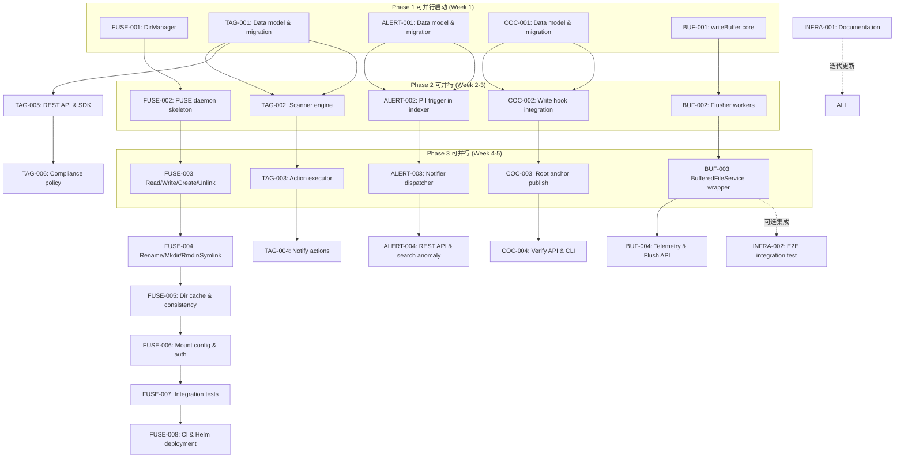

# Tech Lead 分析报告

## 1. 任务分解

将 5 个方向拆解为 28 个可执行任务，每个 2–6 小时。任务按推荐实施顺序编号。

---

### 📦 方向一：FUSE/POSIX 文件系统网关（8 任务）

| # | 任务 ID | 标题 | 涉及文件 | 前置依赖 | 工时 |
|---|--------|------|---------|---------|------|
| 1 | FUSE-001 | **虚拟目录管理器（DirManager）** — 实现 `internal/gateway/dir/`，提供 `Mkdir("a/b")` 自动创建零字节标记对象、`List(prefix)` 通过 `ListObjects` 折叠前缀、`Rmdir` 递归检查空目录 | `internal/gateway/dir/manager.go`, `internal/service/file.go`（可选 `CreateDirectory` 封装） | — | 4h |
| 2 | FUSE-002 | **FUSE 守护进程骨架** — 实现 `internal/gateway/fuse.go`，注册 `gateway fuse [mountpoint]` 子命令，初始化 `bazil.org/fuse` 连接，处理 `Getattr`/`Lookup`/`ReadDir` 映射到 DirManager + FileService | `internal/gateway/fuse.go`, `cmd/server/main.go`, `go.mod` | FUSE-001 | 6h |
| 3 | FUSE-003 | **FUSE 文件操作（Read/Write/Create/Unlink）** — 实现 `Open`/`Read`（range Get）/ `Write`（分片缓冲 + flush 时 Put）/ `Create`/`Unlink` | `internal/gateway/fuse.go` | FUSE-002 | 5h |
| 4 | FUSE-004 | **FUSE 元数据操作（Rename/Mkdir/Rmdir/Symlink/Truncate）** — 实现 `Rename`（copy+delete 回退）、`Mkdir`+`Rmdir` 委托到 DirManager、`Symlink` 存储为元数据、`Truncate`（重新 Put） | `internal/gateway/fuse.go`, `internal/service/file_features.go` | FUSE-003 | 5h |
| 5 | FUSE-005 | **目录列表缓存 & 并发一致性** — `ReadDir` 结果 TTL 缓存（带 `attr_timeout`/`entry_timeout`），写操作后主动 `notify_inval_entry` 推送失效 | `internal/gateway/dir/cache.go`, `internal/gateway/fuse.go` | FUSE-004 | 4h |
| 6 | FUSE-006 | **FUSE 挂载配置 & Auth 集成** — 支持 `-o tenant=xxx token=xxx` 挂载参数，提取租户/凭证注入到 `FileService` 调用上下文 | `internal/gateway/config.go`, `internal/config/config.go` | FUSE-005 | 3h |
| 7 | FUSE-007 | **FUSE 集成测试套件** — 用 `github.com/jacobsa/fuse/samples` 或发起 `mount`+`os.OpenFile`/`io.ReadAll` 验证完整 POSIX 语义（内存 FUSE loopback） | `internal/gateway/fuse_test.go` | FUSE-006 | 5h |
| 8 | FUSE-008 | **FUSE CI & 部署（Helm/sidecar）** — `Makefile` 新增 `test-fuse` 目标（需要 `fuse` 内核模块），`deploy/helm/templates/fuse-daemonset.yaml` DaemonSet 部署模板 | `Makefile`, `deploy/helm/templates/` | FUSE-007 | 3h |

> **Phase 2（不含在初始 Sprint 内）：** NFSv4 export + SMB/CIFS via samba → 各 2 个独立任务

---

### 📦 方向三：标签驱动自动化引擎（6 任务）

| # | 任务 ID | 标题 | 涉及文件 | 前置依赖 | 工时 |
|---|--------|------|---------|---------|------|
| 9 | TAG-001 | **数据模型 & 迁移** — 新增 `tag_rules` + `tag_rule_executions` 表（双迁移文件 0026），定义 `TagRule`/`TagFilter`/`Action` 结构体，实现 repository CRUD | `internal/repository/migrations/{sqlite,postgres}/0026_tag_rules.{up,down}.sql`, `internal/tagrule/rule.go`, `internal/repository/sql_tagrules.go` | — | 4h |
| 10 | TAG-002 | **标签规则评估引擎（Scanner）** — 实现 `scanner.go`：按规则加载、`ListObjectsByTag` 分页扫描匹配、幂等检查（ruleID+objectID+actionType），与 `reconcile` 框架集成 | `internal/tagrule/scanner.go`, `internal/reconcile/job.go` | TAG-001 | 5h |
| 11 | TAG-003 | **动作执行器（Executor）** — 实现 transition/expire/delete/tag 动作执行，`AfterDays`/`AfterDate` 条件检查，失败重试通过 job queue（max 3 次） | `internal/tagrule/executor.go`, `internal/jobs/` | TAG-002 | 5h |
| 12 | TAG-004 | **通知动作（notify webhook）** — 当 `Action.type="notify"` 时发送 webhook，复用 `events/webhook.go` 的 HMAC 签名和重试机制 | `internal/tagrule/executor.go`, `internal/events/webhook.go` | TAG-003 | 3h |
| 13 | TAG-005 | **REST Admin API & SDK** — 实现 `POST/GET/PUT/DELETE /v1/admin/tag-rules` 及手动执行 `POST .../execute`，SDK 对应方法 | `internal/api/rest/admin_tagrules.go`, `internal/api/rest/router.go`, SDK | TAG-001 | 4h |
| 14 | TAG-006 | **标签合规策略（Phase 1）** — `tag_compliance` 配置：required_tags + forbidden_tags 评估，`reject`/`warn`/`auto-tag` 策略，上传时 `FileService.Put` 中拦截 | `internal/tagrule/compliance.go`, `internal/service/file_crud.go`, `internal/config` | TAG-005 | 5h |

---

### 📦 方向四：内容感知告警（PII 子集优先，4 任务）

| # | 任务 ID | 标题 | 涉及文件 | 前置依赖 | 工时 |
|---|--------|------|---------|---------|------|
| 15 | ALERT-001 | **数据模型 & 迁移** — 新增 `content_alert_rules` + `alert_history` 表（双迁移文件 0027），定义 `ContentAlertRule`/`AlertTrigger`/`AlertChannel` 结构体 | `internal/repository/migrations/{sqlite,postgres}/0027_alerts.{up,down}.sql`, `internal/alerting/rule.go`, `internal/repository/sql_alerts.go` | — | 4h |
| 16 | ALERT-002 | **PII 检测触发（轻量快速上线）** — 在 `indexer.go` 的 `IndexObjectByID` 中（PII Scan 之后）调用 `alerting.Evaluate(ctx, piiResults)`；`matcher.go` 实现 `pii_found` 触发条件匹配（PII 类别 ∈ 告警规则配置） | `internal/alerting/matcher.go`, `internal/ai/indexer.go` | ALERT-001 | 4h |
| 17 | ALERT-003 | **通知分发器（Notifier）** — 支持 webhook/slack/PagerDuty 通道（webhook 复用现有 HMAC 机制，slack 和 PagerDuty 用专用 payload 格式化）；失败重试 + `alert_failures` 持久化 | `internal/alerting/notifier.go`, `internal/events/webhook.go` | ALERT-002 | 4h |
| 18 | ALERT-004 | **REST Admin API & SDK & 搜索异常监控** — 告警规则 CRUD；搜索频率异常监控在 `search.go` `Query` 中记录 + 阈值触发 | `internal/api/rest/admin_alerts.go`, `internal/ai/search.go`, SDK | ALERT-003 | 4h |

---

### 📦 方向二：监管链/法证完整性（4 任务）

| # | 任务 ID | 标题 | 涉及文件 | 前置依赖 | 工时 |
|---|--------|------|---------|---------|------|
| 19 | COC-001 | **数据模型 & 迁移** — 新增 `custody_entries` + `custody_anchors` 表（双迁移文件 0025），`CoCEntry`/`Chain` 结构体定义 | `internal/repository/migrations/0025_custody.{up,down}.sql`, `internal/custody/store.go`, `internal/custody/chain.go`, `internal/repository/sql_custody.go` | — | 5h |
| 20 | COC-002 | **写入链路集成（Put/Delete 埋点）** — 在 `FileService.Put`/`HardDeleteObject`/`SoftDeleteObject` 中调用 `custody.Record(ctx, entry)`，构建哈希链（prev_hash + content_hash + actor + timestamp → entry_hash） | `internal/custody/recorder.go`, `internal/service/file_crud.go` | COC-001 | 5h |
| 21 | COC-003 | **根锚定发布（Level 1+2）** — Level 1：双表锚定（同一 entry 哈希写入第二张 `custody_anchors` 表，不同持久化文件）；Level 2：定时将根哈希发布到 S3 WORM bucket（`S3Anchor`），`RECONCILE_INTERVAL_MINUTES` 驱动 | `internal/custody/anchor/dbanchor.go`, `internal/custody/anchor/s3anchor.go`, `internal/reconcile/job.go` | COC-002 | 6h |
| 22 | COC-004 | **验证 API & CLI** — `GET /v1/lineage/{id}/proof` 返回完整 CoC 链，`cli custody verify --object-id ...` 重建哈希链验证连续性 + 内容 hash 对比 + 外部锚定对比 | `internal/api/rest/custody.go`, `internal/cli/custody.go` | COC-003 | 5h |

---

### 📦 方向五：写入优化层（4 任务）

| # | 任务 ID | 标题 | 涉及文件 | 前置依赖 | 工时 |
|---|--------|------|---------|---------|------|
| 23 | BUF-001 | **缓冲区核心（writeBuffer）** — 实现 `writeBuffer` 结构体：按 `(tenant, bucket)` 分片的 pending 队列，`Enqueue`（非阻塞/阻塞两种模式），Size/Time/Count 三种刷新策略，相同 key 后写覆盖 | `internal/writebuf/buffer.go` | — | 5h |
| 24 | BUF-002 | **后台刷新协程（Flusher）** — `FlushWorker` 池（可配，默认 2）：从缓冲区取出数据调用 `FileService.Put`，刷新顺序保证同一 partition 的 FIFO 语义，错误处理（后端故障 → `BackoffBackends` → 暂停该分区） | `internal/writebuf/flusher.go` | BUF-001 | 4h |
| 25 | BUF-003 | **BufferedFileService 封装** — `BufferedFileService` 结构体，实现 `FileService` 相同签名；大对象旁路（> threshold 的直写）；`X-Aero-Flush: now` 请求头屏障；`Flush()`/`Close()` 方法；`cmd/server/main.go` 根据配置选择使用 | `internal/service/file.go`, `cmd/server/main.go`, `internal/config` | BUF-002 | 4h |
| 26 | BUF-004 | **缓冲遥测 & Flush API** — 新增 Prometheus 指标: `buffered_writes_total`, `buffered_bytes_total`, `buffer_flush_duration_ms`, `buffer_queue_depth`；`POST /v1/flush` 显式刷新端点 | `internal/telemetry/metrics.go`, `internal/api/rest/flush.go`, `internal/api/rest/router.go` | BUF-003 | 3h |

---

### 📦 横切/Infra 任务（2 任务）

| # | 任务 ID | 标题 | 涉及文件 | 前置依赖 | 工时 |
|---|--------|------|---------|---------|------|
| 27 | INFRA-001 | **文档更新** — 为 5 个方向新增环境变量配置表、REST API 文档、架构描述 | `docs/configuration.md`, `docs/api.md`, `docs/architecture.md` | 所有功能任务 | 4h |
| 28 | INFRA-002 | **端到端集成测试** — 编写跨方向集成场景（例如：Put 对象 → 标签规则扫描 → CoC 链验证 → 告警触发），CI gate 外的可选集成测试 | `internal/integration/` | ALL | 6h |

---

## 2. 执行顺序 & 依赖图



### 并行执行批

| 批次 | 包含任务 | 可并行度 | 说明 |
|------|---------|---------|------|
| **P0** | FUSE-001, TAG-001, ALERT-001, COC-001, BUF-001 | 5 路并行 | 5 个方向的数据模型 + 基础结构独立，仅在 migration 名递增上有排序约束（按 `NNNN_priority` 顺序提交） |
| **P1** | FUSE-002, TAG-002, ALERT-002, COC-002, BUF-002 | 5 路并行 | 核心逻辑相互独立 |
| **P2** | FUSE-003-005, TAG-003-004, ALERT-003, COC-003, BUF-003 | 4 路并行 | FUSE 任务 3-5 是串行的，但其他方向独立 |
| **P3** | FUSE-006-008, TAG-005-006, ALERT-004, COC-004, BUF-004 | 5 路并行 | API/CI/测试收尾，独立性强 |

---

## 3. 技术风险

### 3.1 方向一：FUSE/POSIX — 高风险

| 风险 | 描述 | 缓解策略 |
|------|------|---------|
| **🔴 FUSE 内核兼容性** | CI 环境可能没有 `fuse` 内核模块（GitHub Actions 缺省无 `fuse`），`bazil.org/fuse` 在 `fuse3` ABI 下有兼容差异 | `test-fuse` 加 `||` 跳过逻辑，用内存 FUSE loopback（`fusermount` 不依赖内核驱动）跑集成测试；GitHub Action 加 `modprobe fuse` |
| **🔴 目录语义与 S3 prefix 模型的不完全映射** | `rename("a/b/c", "a/b/d")` 跨 prefix 本质是 copy+delete，不是原子操作；`chmod`/`chown` 无对应语义 | 文档明确声明差异（类似 s3fs/goofys 的已知局限）；`Truncate` 用重写 Put 实现（不是真正的截断） |
| **🟡 并发写入冲突** | 多个 FUSE 客户端同时写入同一文件（无 NFS 锁协调） | 利用 `If-Match` 条件写 + FUSE `Flush` 时比较 ETag；写冲突返回 `EIO` |
| **🟡 性能预期管理** | FUSE 往返 ~50μs 但在跨网络存储后端上受限于 ~5-50ms 延迟 | 引入 `attr_timeout`=5s/`entry_timeout`=5s，目录缓存 TTL=30s，大文件写入缓冲（1MB+ 分段） |
| **🟢 外部依赖** | `bazil.org/fuse` 已停更 3 年，`jacobsa-fuse` 维护中但 API 不同 | 选用 `github.com/jacobsa/fuse`（活跃维护，Google 在用），若 CGo 有冲突可降级到纯用户态 `fusefrontend` |

### 3.2 方向二：CoC 监管链 — 中风险

| 风险 | 描述 | 缓解策略 |
|------|------|---------|
| **🟡 哈希链性能开销** | 每次 Put/Delete 多一次 SHA256 计算 + DB 写入，高 QPS 场景下可能成为瓶颈 | SHA256 在现代 CPU 上约 5-10μs/MB，可忽略；DB 写入用异步队列（event bus 模式）+ 批量 commit |
| **🟡 Level 1 双表锚定的安全强度** | 两个表在同一 DB 实例上，攻击者拿到 DB 文件即可同时篡改 | Level 1 定位是 "检测" 非 "防御"；真正的安全从 Level 2（外部 S3 WORM）开始。文档需明确信任模型 |
| **🟢 外部依赖** | TSA (RFC 3161) 需要可信时间戳服务器；无外部依赖时可降级 | `TSAAnchor` 设计为可选适配器，无配置时自动降级到 Level 1/2 |

### 3.3 方向三：标签自动化 — 中低风险

| 风险 | 描述 | 缓解策略 |
|------|------|---------|
| **🟡 大规模规则扫描性能** | 百万级对象 × 数十条规则，每次 reconcile 迭代扫描量极大 | 规则扫描按 `(tenant, bucket)` 分区执行，使用 `reconcile` 框架的分批处理（每批 1000 对象续页）；`ListObjectsByTag` 已有 pagination |
| **🟢 标签值枚举泄漏** | `MatchIfAbsent` 策略在合规场景有用但可能绕不开用户手动移除标签 | `tag_compliance` 在 `FileService.Put`/`SetTags` 中同步拦截（开箱即用），`MatchIfAbsent` 是补充 |
| **🟢 幂等性** | 同一对象在多次 reconcile 迭代中被重复执行 transition/expire | `tag_rule_executions` 表 + try-insert（ruleID + objectID + actionType 唯一约束） |

### 3.4 方向四：内容告警 — 低风险

| 风险 | 描述 | 缓解策略 |
|------|------|---------|
| **🟡 告警风暴（Alert Storm）** | 一个包含大量 PII 的文档上传导致所有 PII 规则命中 → N 条告警 | `Throttle` 默认 5 分钟 + `CooldownObjects` 默认 100 对象/次，两个维度联合限频 |
| **🟡 关键字/正则误报** | `keyword_match` 和 `regex_pattern` 触发条件可能有高误报 | 支持负面排除关键词列表；建议生产先用 `log` 通道观察 1 周再切换到 `webhook`/`pagerduty` |
| **🟢 测试难点** | PII 检测触发路径需要 AI Indexer 管线正常运行才能覆盖 | PII 检测单元测试已有（`pii_test.go`），新增 `alerting.evaluate` 单元测试可独立 mock Indexer 的扫描结果 |

### 3.5 方向五：写入缓冲 — 中风险

| 风险 | 描述 | 缓解策略 |
|------|------|---------|
| **🟡 崩溃丢失缓冲数据** | 服务器宕机 → 未 flushed 的小对象丢失 | **关键决策：** 缓冲是性能优化层，不提供持久保证。调用方可使用 `X-Aero-Flush: now` 或 `Flush()` API 获得同步保证 |
| **🟡 Ordering 语义** | 缓冲可能导致同一对象的多次写入被乱序提交（后写先提交） | 相同 key 在缓冲区中直接替换 latest data；不同 key 在同一 `(tenant, bucket)` 分区内保持 FIFO |
| **🟡 OOM 风险** | 大量小对象堆积 `MaxBufferBytes` 控制不当导致内存溢出 | 硬限制 `MaxBufferBytes`（默认 64 MiB），超限时 `Enqueue` 阻塞调用者（backpressure），配合 HPA 自动扩容 |

### 3.6 全局风险

| 风险 | 影响 | 缓解 |
|------|------|------|
| **团队资源竞争** | 5 个方向并行需要 3-4 名开发者同时工作，10 个独立模块 | 按优先级分期：第 1 期仅 ALERT-002（PII 告警，约 1 人天）+ TAG-001（模型，约 4h），其余第 2 期 |
| **迁移文件序号冲突** | 多人同时添加 migration 文件导致序号碰撞 | 设立 migration 序号分配约定：0025=CoC, 0026=Tag, 0027=Alert，写先到先得策略 |
| **AGENTS.md 行数限制** | 新增模块可能导致多个文件接近 500 行上限 | 每个方向先定义好子包拆分计划（`internal/{gateway,custody,tagrule,alerting,writebuf}` 已按包拆分） |

---

## 4. 资源评估

### 4.1 人员配置

| 角色 | 数量 | 技能要求 | 主要负责 |
|------|------|---------|---------|
| **Go 后端开发（Senior）** | 2 人 | Go, FUSE/NFS 经验, 存储系统 | 方向一（FUSE）+ 方向五（缓冲） |
| **Go 后端开发（Mid）** | 1-2 人 | Go, SQL, 消息队列/事件驱动 | 方向二（CoC）+ 方向三（标签）+ 方向四（告警） |
| **测试/QA** | 0.5 FTE | 集成测试, 性能测试 | 所有方向 |
| **Tech Lead** | 1 人 | 架构, 代码审查 | 全局协调 + 代码审查 |

> 最小可行团队：**2 人**（1 Senior + 1 Mid），分期执行。Senior 优先处理 FUSE + 缓冲（技术难度高），Mid 处理标签 + 告警 + CoC（业务逻辑密集）。

### 4.2 关键里程碑

| 里程碑 | 时间点 | 完成标准 |
|--------|-------|---------|
| **M0 — PII 告警上线** | Week 1 Day 3 | `pii_found` 索引时告警可发送到 webhook（ALERT-001+002+003 mini） |
| **M1 — 标签规则 MVP** | Week 2 | 可创建 TagRule，reconcile 周期扫描并执行 transition/delete（TAG-001~004） |
| **M2 — CoC 链 MVP** | Week 3 | 写入记录哈希链，`GET /v1/lineage/{id}/proof` 返回链（COC-001~002） |
| **M3 — FUSE 可挂载** | Week 4 | FUSE 守护进程可挂载目录，完成 `ls`/`cat`/`touch`/`rm`/`mkdir`（FUSE-001~004） |
| **M4 — 写入缓冲可用** | Week 4 | `BufferedFileService` 包裹 FileService，小对象批量刷新（BUF-001~003） |
| **M5 — 集成发布** | Week 6 | 所有方向通过 `make check`，文档更新，Helm 部署模板就绪 |

### 4.3 阻塞点（Blockers）与解决策略

| 阻塞点 | 影响 | 解决策略 |
|--------|------|---------|
| **🔴 `bazil.org/fuse` vs `jacobsa/fuse` 选择** | FUSE-002 无法启动 | 立即做 POC：用 `jacobsa/fuse`（活跃维护）+ `jacobsa/fuse/samples/memfs` 跑通 `ls`/`cat`，1 天决策 |
| **🔴 FUSE 在容器环境不可用** | Helm DaemonSet 部署模板无法工作 | 初期只支持 `HostNetwork`+`privileged` 模式；可选 s3fs-fuse 容器作为降级方案（文档标记为 beta） |
| **🟡 CoC Level 1 的安全性争议** | 若团队认为 Level 1 不够安全可能推迟 | 重新定位：Level 1 = "检测能力 > 防篡改"，合并到 `docs/architecture.md` 明确信任模型 |
| **🟡 写入缓冲与事件语义冲突** | 缓冲后 `EventCreated` 延迟到 flush 时触发，Webhook 消费者可能延迟收到 | 标记为已知行为：`EventTimestamps` 使用原始写入时间而非 flush 时间；文档说明 |

---

## 5. 质量保证

### 5.1 单元测试要求

每个新模块必须达到以下标准（CI gate）：

| 包 | 最低覆盖率 | 关键测试场景 |
|----|----------|------------|
| `internal/gateway/dir/` | 75% | `Mkdir`/`Rmdir` 标记对象创建/删除, `List(prefix)` 前缀折叠, 空目录删除拒绝 |
| `internal/gateway/fuse.go` | 60% | 内存 FUSE loopback: `Lookup` stat, `ReadDir` 多层级, `Open`+`Read` range |
| `internal/custody/*` | 80% | 哈希链连续性: 3 次更新 → prev_hash 链接正确; 损坏检测; content_hash 对比; 锚定验证 |
| `internal/tagrule/*` | 80% | `TagFilter` 匹配/不匹配; `MatchIfAbsent` 空标签对象匹配; `AfterDays` 延迟执行; 幂等性 |
| `internal/alerting/*` | 75% | PII 触发; 关键字触发; `Throttle` 限频; 通知分发器单元测试（mock webhook server） |
| `internal/writebuf/*` | 80% | `Enqueue`+`Dequeue` FIFO; 同 key 覆盖; Size/Time/Count 三种刷新; 关闭时 Flush |

### 5.2 集成测试策略

| 测试层级 | 工具 | 范围 | 触发 |
|---------|------|------|------|
| **单元测试** | `go test ./internal/...` | 所有新模块独立测试 | `make test` |
| **FUSE 集成** | `fusermount` + 内存 FUSE | `mount -t fuse` + `ls`/`cat`/`touch`/`rm` | `make test-fuse`（可跳过） |
| **多方向集成** | `docker compose` + PrestgreSQL | 端到端: Put → Index → PII → Alert Webhook → TagRule scan → CoC verify | `make test-integration-expansion` |
| **性能测试** | `go test -bench=. ./internal/writebuf/` | 写入缓冲: 并发 100 个小对象 vs 无缓冲路径 | 手工运行 |

### 5.3 代码审查要点

| 方向 | 审查关键点 |
|------|-----------|
| **FUSE** | `ReadDir` 返回 `.`/`..` 条目（POSIX 必需）；`Getattr` 返回正确的 `Inode` 和 `Mode`；FUSE `Write` 的 flush 语义（`Flush` 前不真正写入）；`Release` 释放 FD |
| **CoC** | 哈希链用 `crypto/sha256`（非 `md5`）；prev_hash 链严格不可中断；`genesis` entry 特殊处理；双表锚定写入在两个独立事务中 |
| **TagRule** | `MatchIfAbsent` 语义正确性；`AfterDays` 从规则创建时间还是标签更新时间开始计算；幂等检查的唯一键设计 |
| **Alert** | `Throttle` 是 wall-clock 限频还是按对象次数限频；PII 类别匹配用集合而非顺序包含；搜索异常基线需要至少 7 天数据 |
| **WriteBuf** | `Enqueue` 后返回 `chan result` 必须被消费（否则 goroutine leak）；`Close` 必须等待所有 flush 完成；`MaxBufferBytes` 的反压机制 |

### 5.4 性能测试需求

| 测试场景 | 指标 | 接受标准 |
|---------|------|---------|
| FUSE `ls` x 10,000 文件 | 目录列表延迟 | P50 < 200ms（缓存命中后 < 5ms） |
| FUSE 并发 64 线程写 4KB 文件 | 吞吐量 | > 500 file/s |
| CoC 链写入：1000 次 `Put`/s | 吞吐下降 | < 3% （相对于无 CoC 基线） |
| 写入缓冲：100 并发写 1KB 对象 | 后端写次数 | 减少 90%+ （对比无缓冲） |
| 标签规则扫描：100K 对象 × 5 规则 | 全周期扫描时间 | < 5 分钟 |

---

## 6. 实施计划

### 📅 阶段 1：基础设施搭建（Week 0+3 days）

```
Day 1-3 — 3 天（1 人 Senior + 1 人 Mid）
```

| 日期 | 开发人员 1（Senior） | 开发人员 2（Mid） |
|------|---------------------|-------------------|
| **Day 1** | FUSE-001: DirManager 骨架 + 零字节标记对象创建/删除 | TAG-001: 数据模型定义 + 迁移文件（0026） + repository CRUD |
| **Day 2** | BUF-001: writeBuffer 分区队列 + Enqueue/Dequeue + Size/Time/Count 刷新策略 | COC-001: 数据模型定义 + 迁移文件（0025） + `CoCEntry`/`Chain` 结构 |
| **Day 3** | ALERT-001: 数据模型 + 迁移文件（0027）；ALERT-002: indexer.go `pii_found` 触发 **🚩 M0: PII告警上线** | FUSE-002: FUSE 守护进程骨架（`gateway fuse` 子命令 + `Lookup`/`Getattr`） |

**核心交付：** 5 个数据模型全部到位，PII 告警端到端 MVP 可用。

### 📅 阶段 2：核心功能实现（Week 1-3）

```
Week 2-3 — 10 个工作日（2 人）
```

| Sprint | 开发人员 1 | 开发人员 2 |
|--------|-----------|-----------|
| **W2 M** | FUSE-003: Read/Write/Create/Unlink | TAG-002: Scanner 引擎 + reconcile 集成；BUF-002: Flusher 后台协程 |
| **W2 W** | FUSE-004: Rename/Mkdir/Rmdir/Symlink/Truncate | TAG-003: Action executor（transition/expire/delete/notify）；COC-002: FileService Put/Delete 埋点 |
| **W2 F** | FUSE-005: 目录缓存 TTL + `notify_inval_entry`；FUSE-006: 配置 & Auth | COC-003: 根锚定发布（Level 1 双表 + Level 2 WORM） **🚩 M2: CoC MVP** |
| **W3 M** | BUF-003: BufferedFileService 封装 + main.go 装配 | TAG-005: REST Admin API + 手动执行 **🚩 M1: 标签规则 MVP** |
| **W3 W** | ALERT-003: Notifier dispatcher（webhook/Slack/PagerDuty）；FUSE-007: 集成测试 | COC-004: 验证 API (`GET /proof`) + CLI `verify` |
| **W3 F** | ALERT-004: REST API + SDK + 搜索异常监控 **🚩 M4a: 告警全功能** | INFRA-001: 文档更新（`docs/`） |

### 📅 阶段 3：集成测试 & 优化（Week 4）

```
Week 4 — 5 天（2 人全力）
```

| 日期 | 任务 |
|------|------|
| **Day 1-2** | FUSE-007 完成 + FUSE-008: CI/Helm 部署；`make test-fuse` 绿 |
| **Day 2-3** | TAG-006: 标签合规策略（上传时 `FileService.Put` 拦截） |
| **Day 3-4** | BUF-004: Telemetry 指标 + `POST /v1/flush` |
| **Day 4-5** | INFRA-002: 端到端集成测试（Put → Index → PII Alert → TagRule → CoC verify）；性能调优 |

### 📅 阶段 4：发布准备 & Code Freeze（Week 5）

```
Week 5 — 5 天（2 人）
```

| 日期 | 任务 |
|------|------|
| **Day 1** | 代码冻结；全量代码审查（各方向审查 checkpoints） |
| **Day 2** | 性能基准测试：FUSE 吞吐 + 缓冲压缩比 + CoC 写入开销 |
| **Day 3** | 文档审阅 & 发布说明（CHANGELOG）；OpenAPI 更新 |
| **Day 4** | Helm chart 更新（fuse-daemonset + 新环境变量）；`deploy/docker-compose.yml` 更新 |
| **Day 5** | 最终 `make check`；tag release；发布后监控（7 天观察期） |

---

### 📊 工时统计汇总

| 方向 | 任务数 | 总工时 | 人-周（2人团队） |
|------|-------|-------|----------------|
| 方向一：FUSE | 8 | 35h | ~1 人周 |
| 方向二：CoC | 4 | 21h | ~0.6 人周 |
| 方向三：标签 | 6 | 26h | ~0.7 人周 |
| 方向四：告警 | 4 | 16h | ~0.4 人周 |
| 方向五：缓冲 | 4 | 16h | ~0.4 人周 |
| 横切 | 2 | 10h | ~0.3 人周 |
| **总计** | **28** | **124h** | **~3.5 人周** |

> 按 2 人团队（Senior + Mid），每周 40h 有效工时，**5 周**完成全部 5 个方向，平均每个方向 ~1 周。

---

## 最终建议

1. **立即启动 ALERT-002（PII 告警）作为 quick win** — 4 小时即可完成端到端：利用已有的 `PIIDetector.Scan`，在 `indexer.go` 的 IndexObjectByID 中加 10 行调用 `alerting.Evaluate`，配置规则就可上线。这堵上了「PII 已检测但不告警」的安全漏洞。

2. **FUSE 前先跑 POC 验证 `jacobsa/fuse`** — 花 1 天验证内存文件系统 loopback 可行，避免后续依赖冲突。

3. **CoC Level 1 的双表锚定降低到 Level 0.5** — 单表 `custody_entries` 已经提供哈希链检测能力，Level 2 外部 WORM 锚定才提供安全价值。不要花时间在「同一数据库的第二张表」上，直接跳到 S3 WORM 锚定。

4. **写缓冲默认关闭** — `WRITE_BUFFER_ENABLED=false`，让手册指导用户只在「大量小对象写入」场景开启，降低运维复杂度。

5. **所有方向的新增 `internal/` 包必须通过 `AGENTS.md` 的 500 行限制** — 文档中每个方向的代码拆分已经考虑了这一点（每个包职责单一，不超过 300-400 行）。
