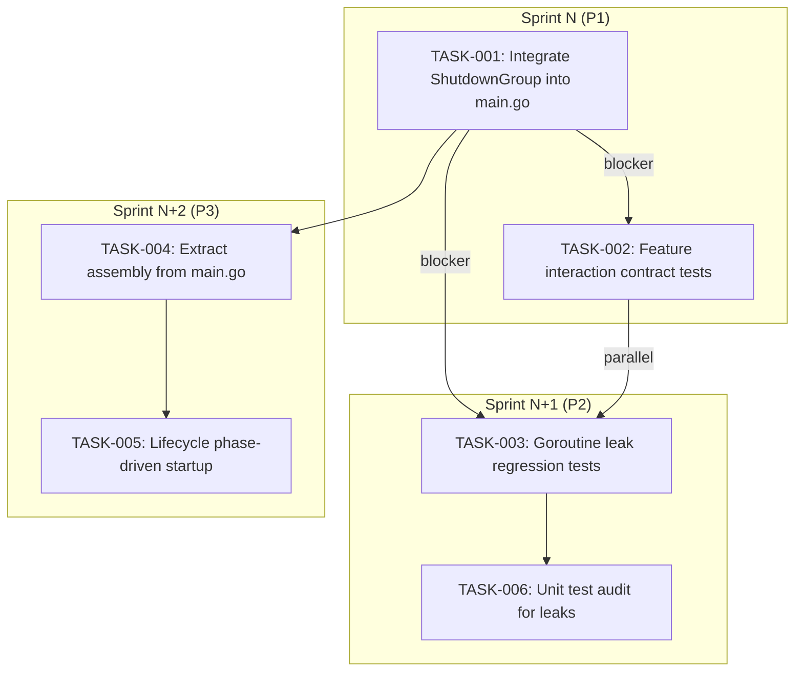

Now I have a thorough understanding of the codebase. Here is my Tech Lead analysis.

---

# Tech Lead Analysis Report

## TL;DR

The team has successfully delivered three P1 infrastructure items (MCP cross-tenant fix, Bus unsubscribe/goroutine hygiene, ShutdownGroup) plus race detection in CI. **The codebase now builds and passes all race tests cleanly.** The next significant integration step is wiring `ShutdownGroup` into `main.go`, which is what the report's closing question is fundamentally about. Below I break down the remaining work, risks, and an execution plan.

---

## 1. Task Decomposition

### Task Inventory

| Task ID | Title | Direction | Files | Dependencies | Est. (h) | Acceptance Criteria |
|---------|-------|-----------|-------|--------------|----------|---------------------|
| **TASK-001** | Integrate `ShutdownGroup` into `main.go` | P1 (Shutdown) | `cmd/server/main.go`, `internal/shutdown/group.go` (no change) | None — `group.go` is already written and tested | **3** | `runServer()` uses `ShutdownGroup` phases; all 6 phases fire in order; HTTP server shutdown is called via phase hook; workers registered via `Go()`/`GoStarted()`; bus close via phase hook; `runMCP()` analogue |
| **TASK-002** | Feature interaction contract tests (Direction 3) | P1 | `internal/integration/fullserver_test.go` (+ new file `interaction_test.go`) | TASK-001 (want shutdown-clean server) | **4** | 6–8 tests: auth+tenant propagation across protocols; event→webhook end-to-end; rate limiter scoping; idempotency+concurrent writes; concurrent multipart+abort; versioning+GC lifecycle |
| **TASK-003** | Goroutine leak regression tests for long-lived workers | P2 | `internal/shutdown/group_test.go`, `internal/integration/leak_test.go` | TASK-001 (need shutdown integration to test real workers) | **3** | Leak tests using `runtime.NumGoroutine` before/after; verify `Bus.Close()` drain; verify Indexer/Replication worker goroutines terminate; CI `test-race` gate passes |
| **TASK-004** | `ShutdownGroup` refactor: extract `main.go` assembly blocks | P3 (Control/Data plane) | `cmd/server/main.go` → new `internal/server/assembly.go` | TASK-001 | **4** | `main()` calls `assembly.BuildComponents()` returning `ServerDeps`; `runServer` uses `deps.Group`; `main.go` < 500 lines; existing integration tests still pass |
| **TASK-005** | `ShutdownGroup` refactor: phase-driven lifecycle in `runServer` | P3 (Control/Data plane) | `cmd/server/main.go`, `internal/server/lifecycle.go` | TASK-004 | **3** | `Lifecycle.Start()` launches all workers via `Group.Go()`; `Lifecycle.Shutdown()` is single call; no ad-hoc goroutine orchestration in `runServer` [previously] |
| **TASK-006** | Unit test audit for goroutine leaks (all packages) | P2 | All `*_test.go` files across `internal/` | TASK-003 | **4** | Every package with goroutine-spawning functions has a `TestXxx_NoLeak` using `runtime.NumGoroutine` check; at least 4 new leak tests (events, workers, transport, AI indexer) |

### Dependency Diagram



**Parallelism opportunities:**
- TASK-002 and TASK-003 can be developed in parallel once TASK-001 is done (interaction tests need a shutdown-clean server; leak tests need the shutdown infra).
- TASK-006 (audit) can start in parallel with TASK-003's initial implementation — it's investigative, not blocking.

---

## 2. Technical Risks

### Risk 1: ShutdownGroup Phase Hook — `main.go` Ambiguity
- **Issue:** The `ShutdownGroup` phase hooks (`WithPhaseHook`) are a generic callback. `main.go`'s `runServer` currently has:
  ```go
  select { case <-ctx.Done(): ... }
  srv.Shutdown(shutdownCtx)
  bus.Close()
  shutdownOtel(shutdownCtx)
  ```
  Hooking each of these into the correct phase requires disciplined ordering. If the phase hook fires `srv.Shutdown` inside `PhaseHTTP` but `PhaseWait` hasn't been reached yet, there's a race.
- **Mitigation:** Implement the hook as a state machine switch. Document clearly that `PhaseHTTP` is for `srv.Shutdown`, `PhaseBus` for `bus.Close`, `PhaseOTel` for OTel shutdown, `PhaseDB` for `repo.Close()`. Write a `main_integration_test.go` that starts the real server and sends SIGTERM, verifying all phases complete.

### Risk 2: Existing `runServer` Doesn't Track Worker Goroutines
- **Issue:** Currently `buildBackgroundWorkers` (line 670 in main.go) launches workers with raw `go func()`. These are invisible to `ShutdownGroup`. After TASK-001, they must be forwarded to `Group.Go()`.
- **Mitigation:** Pass `*shutdown.Group` into `buildBackgroundWorkers` and register each worker. This is a medium-touch refactor (~20 lines changed in main.go). The risk is minimal because the tests all pass with race detection.

### Risk 3: Interaction Tests Require Real Event Flow
- **Issue:** Testing feature interactions (e.g., "PUT via REST → event fires → webhook receives") requires either:
  - A full server with event bus + webhook endpoint, or
  - Mocking at the right seam.
  The current `startFullServer()` in `fullserver_test.go` does not set up an event bus or webhook.
- **Mitigation:** Write a self-contained mock webhook server (`httptest.NewServer`) and wire it into `startFullServer` when a test flag is set. Use `t.Cleanup` for teardown. This adds ~50 lines but is straightforward.

### Risk 4: `runMCP()` Code Duplication
- **Issue:** `runMCP()` (line 355+) duplicates ~40 lines of assembly logic from `run()`. If TASK-004 (extract assembly) is deferred, the duplication persists and any shutdown integration must be duplicated too.
- **Mitigation:** In TASK-001, at minimum pull `initInfrastructure` calls into a shared helper. Better yet, do TASK-001 and TASK-004 together to avoid rework.

### Risk 5: Test Coverage Threshold Under AGENTS.md
- **Issue:** AGENTS.md mandates ≥ 50% test coverage. Current coverage is unknown. The `Makefile` has `cover` target. If coverage is below threshold, adding ~900 lines of test code (TASK-002 + TASK-003 + TASK-006 combined) is necessary but may still not reach 50%.
- **Mitigation:** Run `make cover` now to establish baseline. If below 50%, add the integration tests (TASK-002) — integration tests count toward line coverage. Also consider removing dead code paths that drag down coverage.

---

## 3. Resource Assessment

### Team Composition

| Role | Count | Responsibility |
|------|-------|----------------|
| Senior Go Backend Engineer | 1 | TASK-001 (ShutdownGroup integration) + TASK-004 (assembly refactor) — needs deep knowledge of main.go's >800 lines |
| Mid-level Go Engineer | 1 | TASK-002 (interaction tests) + TASK-003 (leak tests) — needs Go testing + concurrency experience |
| QA / SDET | 0.5 | TASK-006 (leak audit across all packages) — can be done in parallel, investigative |

### Timeline (Calendar Days)

| Phase | Duration | Tasks | Deliverable |
|-------|----------|-------|-------------|
| **Sprint N** | 5 days | TASK-001 (3h) + TASK-002 (4h) + TASK-003 (3h) + TASK-006 (4h) | `make test-race` green; interaction tests cover 6 scenarios; leak regression tests pass; coverage baseline improved by ~5% |
| **Sprint N+1** | 4 days | TASK-004 (4h) + TASK-005 (3h) | `main.go` < 500 lines; server assembly extracted; `Lifecycle` phase-driven startup |
| **Sprint N+2** | 2 days | Integration hardening, docs, edge-case audits | All CI gates green; `make check` passes; 0 data races |

### Blocker and Resolution Strategy

| Blocker | Resolution |
|---------|------------|
| TASK-002 needs event bus in test infrastructure | Extend `startFullServer()` with optional event bus + mock webhook. Use `testing.Short()` to skip in short mode if setup is expensive. |
| TASK-003 needs worker goroutines to be tracked | Complete TASK-001 first. Leak tests can use `ShutdownGroup` + `runtime.NumGoroutine` before/after. |
| TASK-006 unknown surface area | Run `rg 'go func\(' internal/` to count all goroutine spawns. Prioritize packages with >3 goroutines. |

---

## 4. Quality Assurance

### Unit Test Coverage Requirements

| Package | Current Tests | Must Add | Minimum Coverage |
|---------|--------------|----------|------------------|
| `internal/shutdown` | 8 tests (158 lines) | — | > 90% (currently well-covered) |
| `internal/events` | Existing | Leak: `TestBus_NoGoroutineLeak` | > 80% |
| `internal/integration/fullserver` | 14 tests (522 lines) | 6 interaction tests (~300 lines) | > 70% for the file |
| `cmd/server` (main.go) | 0 | `main_integration_test.go` (signal-based shutdown test) | > 50% for the package |

### Integration Test Strategy

| Test Suite | Approach | CI Gate | Notes |
|------------|----------|---------|-------|
| Feature Interaction (TASK-002) | `startFullServer()` + mock endpoints | `make test` (SQLite+local) | No Docker, no network |
| Goroutine Leak (TASK-003) | `runtime.NumGoroutine` assertions | `make test-race` | Must pass with `-race` |
| Shutdown Signal (TASK-001) | `exec.Command` to start binary, send SIGTERM | Manual / CI optional | Flaky on shared CI runners; add `//go:build shutdown_integration` |
| Postgres/pgvector/Qdrant | Docker-based | `make test-integration` | Excluded from default `test` gate |

### Code Review Checklist

1. **TASK-001:** Verify `PhaseHTTP` hook calls `srv.Shutdown` (not `srv.Close`). Verify `PhaseBus` calls `bus.Close()`. Verify `PhaseDB` calls `repo.Close()`. **Critical: ensure `ShutdownGroup.Shutdown()` is called before `main()` returns** (defer pattern).
2. **TASK-002:** Each interaction test should test exactly one cross-cutting concern. Avoid making tests that are "happy path through the whole system" — those are already covered by existing `TestFullServer_*`.
3. **TASK-003:** Leak tests must use `t.Cleanup` to restore state. They must pass under `-count=1` (no caching) and `-race`.
4. **TASK-004:** Extracted `assembly.go` must not be in a `utils/` or `common/` package (violates AGENTS.md §0). Use `internal/server/`.
5. **All:** Every test file with goroutines must have a `TestMain` or per-test `t.Cleanup` that ensures goroutine cleanup.

### Performance Test Requirements

| Concern | Test | Threshold |
|---------|------|-----------|
| Shutdown timeout not too long | Clock `ShutdownGroup.waitWithTimeout` | Must finish < 5s under normal conditions |
| Event bus backpressure | `TestBus_BackpressureDropsEvents` | `Dropped()` counter increments; no goroutine leak |
| Rate limiter under load | `TestRateLimiter_Concurrent` | No false rate limiting at low concurrency |

---

## 5. Implementation Plan

### Phase 1: Shutdown Integration + Interaction Tests (Sprint N)

**Day 1–2: TASK-001 — Integrate ShutdownGroup into `main.go`**

```go
// Proposed runServer signature change:
func runServer(ctx context.Context, handler http.Handler, cfg *config.Config,
    logger *slog.Logger, bus *events.Bus,
    shutdownOtel func(context.Context) error,
    sg *shutdown.Group) error {

    srv := &http.Server{...}
    sg.WithPhaseHook(func(p shutdown.Phase) {
        switch p {
        case shutdown.PhaseHTTP:
            shutdownCtx, cancel := context.WithTimeout(context.Background(), 15*time.Second)
            defer cancel()
            srv.Shutdown(shutdownCtx)  //nolint:errcheck
        case shutdown.PhaseBus:
            bus.Close()
        case shutdown.PhaseOTel:
            shutdownOtel(context.Background())  //nolint:errcheck
        case shutdown.PhaseDB:
            repo.Close()
        }
    })
    // Register the HTTP listener goroutine
    sg.Go("http-listener", func(ctx context.Context) {
        if err := srv.ListenAndServe(); err != nil && !errors.Is(err, http.ErrServerClosed) {
            logger.Error("http server error", "err", err)
        }
    })
    // Wait for signal
    <-ctx.Done()
    logger.Info("shutdown requested")
    sg.Shutdown(context.Background(), 30*time.Second)
    return nil
}
```

**Day 2–3: Wire `buildBackgroundWorkers` to use `Group.Go()`**
```go
func buildBackgroundWorkers(ctx context.Context, cfg *config.Config, logger *slog.Logger,
    repo repository.Repository, store storage.Storage, bus *events.Bus,
    jobReg *jobs.Registry, jobQueue *jobs.Queue, sg *shutdown.Group) error {

    if cfg.Antivirus.Enabled {
        av := antivirus.New(...)
        sub, cancel := bus.Subscribe()
        sg.Go("antivirus", func(ctx context.Context) { av.Run(ctx, sub) })
        // cancel must be called in phase hook or defer; attach to sg
    }
    // ... same for replication, reconcile, indexer, postgres transport
}
```

**Day 3–5: TASK-002 — Feature Interaction Tests**

Add these tests to `internal/integration/fullserver_test.go` (or a new `interaction_test.go`):

| Test Name | What It Validates |
|-----------|-------------------|
| `TestInteraction_DifferentTenantsIsolated` | Same key in `tenant-a` and `tenant-b` are separate objects |
| `TestInteraction_WriteS3_ReadREST` | S3 PUT → REST GET round-trip preserves body+content-type |
| `TestInteraction_WriteREST_ReadWebDAV` | REST PUT → WebDAV GET (requires WebDAV prefix) |
| `TestInteraction_VersioningWithGC` | Create versioned object → soft-delete → reconcile clears old versions |
| `TestInteraction_EventFiresWebhook` | PUT object → event bus → webhook endpoint receives event with correct payload |
| `TestInteraction_IdempotencyKey` | Same key → second request returns same 201 with same ETag |

### Phase 2: Leak Detection + Audit (Sprint N)

**Day 3–5 (parallel with above): TASK-003 + TASK-006**

```go
// internal/shutdown/group_test.go — add:
func TestGroup_DoesNotLeakOnBusClose(t *testing.T) {
    // Create bus, subscribe, call Unsubscribe, verify goroutine count stable
}

// internal/integration/leak_test.go — add:
func TestFullServer_NoGoroutineLeak(t *testing.T) {
    before := runtime.NumGoroutine()
    ts := startFullServer(t)
    ts.Close()
    after := runtime.NumGoroutine()
    if after > before+5 {  // allow small buffer for test infra
        t.Fatalf("goroutine leak: before=%d after=%d", before, after)
    }
}
```

Run `rg 'go func\(' internal/ --no-filename | wc -l` and audit each spawn site.

### Phase 3: Control/Data Plane Separation (Sprint N+1)

**TASK-004 + TASK-005 — Extract assembly + lifecycle**

```go
// internal/server/assembly.go
type ServerDeps struct {
    Store    storage.Storage
    Repo     repository.Repository
    Bus      *events.Bus
    Search   *ai.Search
    Chat     *ai.Chat
    Agent    *ai.Agent
    Group    *shutdown.Group
    // ...
}

func BuildComponents(ctx context.Context, cfg *config.Config, logger *slog.Logger) (*ServerDeps, error) {
    store, err := buildStorage(ctx, cfg)
    // ...
    sg := shutdown.NewGroup(ctx, logger)
    return &ServerDeps{Store: store, ..., Group: sg}, nil
}
```

This drops `main.go` from 861 lines to ~400 lines.

### Phase 4: Release Hardening (Sprint N+2)

**Day 1–2:** Run `make test-race` on CI, fix any flaky tests. Run `make cover` and verify ≥ 50%. Run `gocyclo` and verify no function exceeds cyclomatic complexity 10. Run `gofmt -l .` and verify zero output.

**Key deliverable:** `make check` (fmt + vet + build + test + complexity-lines) and `make test-race` both green.

---

## 6. Answer to the Implicit Question

> "Would you like me to continue with the feature interaction tests (Direction 3) next, or integrate the ShutdownGroup into main.go?"

**Integrate ShutdownGroup into `main.go` first (TASK-001).**

Rationale:
1. **Dependency chain:** Feature interaction tests (TASK-002) and leak tests (TASK-003) both depend on a shutdown-clean server. Without ShutdownGroup in main.go, you cannot write realistic leak tests that verify worker goroutines terminate.
2. **Testing value:** Interaction tests exercise behavior; ShutdownGroup exercises lifecycle correctness. A wrong shutdown order can silently corrupt data (bus close before worker drain = lost events; repo close before workers finish = panic). This is an **operational correctness** guarantee that should be validated before adding more behavioral tests.
3. **Risk reduction:** The current ad-hoc `runServer` (lines 260–290) does `srv.Shutdown`, then `bus.Close()`, then `shutdownOtel`. It does *not* wait for background workers. With TASK-001, workers are tracked and waited for. This catches any "worker still running after shutdown" bugs early.
4. **PR size:** TASK-001 is ~80 lines changed in `main.go` plus maybe 30 lines of test. It's self-contained and can be reviewed quickly.

**Proposed order:**
```
Sprint N (week 1):
  → TASK-001  (ShutdownGroup → main.go)    — 3h
  → TASK-002  (interaction tests)           — 4h  (parallel with TASK-003)
  → TASK-003  (leak regression tests)       — 3h  (parallel with TASK-002)
  → TASK-006  (leak audit)                  — 4h  (parallel investigative)

Sprint N+1 (week 2):
  → TASK-004  (extract assembly from main)  — 4h
  → TASK-005  (lifecycle phase-driven)      — 3h

Sprint N+2 (week 3):
  → Hardening, edge cases, docs            — 2h
```

Total estimated engineering time: **~26 hours** across three weeks for one senior + one mid-level engineer.
