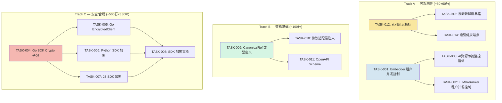
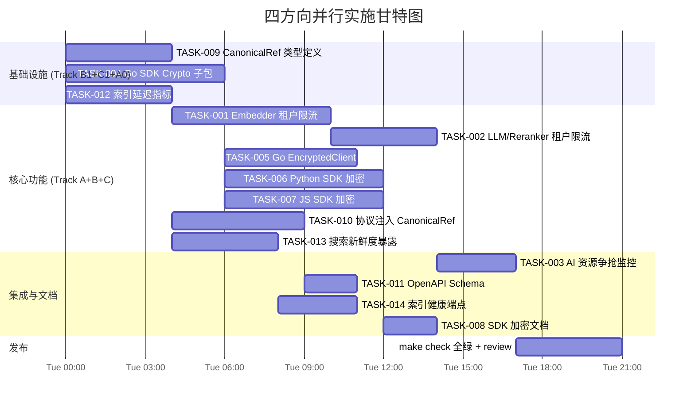

# Tech Lead 分析报告

## 目录
1. [任务分解](#1-任务分解)
2. [执行顺序与依赖图](#2-执行顺序与依赖图)
3. [技术风险](#3-技术风险)
4. [资源评估](#4-资源评估)
5. [质量保证](#5-质量保证)
6. [实施计划](#6-实施计划)

---

## 1. 任务分解

### 方向一：AI 跨租户资源争抢

**现状分析：** `internal/middleware/ratelimit.go` 已有 per-tenant token-bucket HTTP 限流（`RATE_LIMIT_RPS`/`AI_RATE_LIMIT_RPS`），`internal/middleware/middleware.go` 有 `PerTenantConcurrencyLimiter`（HTTP 并发层）。但 **AI 计算资源**（embedder、LLM、reranker）仍是共享无隔离的——一个租户的大量索引/搜索操作可以耗尽 embedder 的并发槽位、LLM 的 token 配额、或 reranker 的连接池。

**v39 方向五覆盖点：** Job Queue 级别的租户隔离（后台异步作业）。v78 聚焦**在线实时计算资源**（embed、LLM、reranker 调用）。去重声明应修正为"v78 补充在线路径隔离，与 v39 的后台作业隔离正交"。

#### TASK-001 Embedder 租户并发控制
- **方向**: 方向一 — AI 跨租户资源争抢
- **涉及文件**: `internal/ai/embedder.go` (须确认或新建)、`internal/ai/llm.go`、`internal/ai/rerank.go`
- **前置依赖**: 无
- **预估工时**: 3h
- **验收标准**:
  1. `Embedder` 接口增加 `WithTenantConcurrency(tenant string, maxConcurrent int)` 或通过 Semaphore 包装
  2. 新建 `internal/ai/tenantlimiter.go` 实现 per-tenant weighted semaphore（租户 key = tenantID）
  3. 现有 `CachingEmbedder` 或 `HTTPEmbedder` 包装在限流层内
  4. 单元测试验证：单租户超限时阻塞，闲置租户不占用槽位
  5. 限流配置通过 `main.go` 透传（`AI_EMBED_MAX_CONCURRENT_PER_TENANT`）

#### TASK-002 LLM / Reranker 租户并发控制
- **方向**: 方向一 — AI 跨租户资源争抢
- **涉及文件**: `internal/ai/llm.go`、`internal/ai/rerank.go`、`internal/ai/chat.go`、`internal/ai/agent.go`
- **前置依赖**: TASK-001（复用 `tenantlimiter` 组件）
- **预估工时**: 2h
- **验收标准**:
  1. LLM 和 Reranker 调用走统一 per-tenant semaphore
  2. `Chat.Answer` / `Chat.AnswerStream` 使用 LLM 限流器
  3. `Search.Query` 在调用 reranker 时使用 reranker 限流器
  4. 配置项 `AI_LLM_MAX_CONCURRENT_PER_TENANT` / `AI_RERANK_MAX_CONCURRENT_PER_TENANT`（默认=0 不限流）
  5. `TestTenantLLMIsolation` 验证：并发请求下租户 A 不阻塞租户 B（除非 A 占满全局上限）

#### TASK-003 AI 资源争抢监控指标
- **方向**: 方向一 — AI 跨租户资源争抢
- **涉及文件**: `internal/telemetry/metrics.go`、`internal/telemetry/prometheus.go`
- **前置依赖**: TASK-001（需要有观测对象）
- **预估工时**: 1.5h
- **验收标准**:
  1. 新增 Prometheus gauge: `ai_tenant_embed_inflight{tenant}` / `ai_tenant_llm_inflight{tenant}` / `ai_tenant_rerank_inflight{tenant}`
  2. 新增 counter: `ai_tenant_embed_deferred_total{tenant}`（因限流等待的请求计数）
  3. 指标在线程安全的 `tenantlimiter` 内自动更新
  4. 基准测试 `TestTenantLimiterMetrics` 验证指标正确性

### 方向二：SDK 客户端加密

**现状验证：** 三套 SDK（Go/Python/JS）的 `upload` / `get` 方法均只处理明文数据。服务端加密 (`internal/storage/encrypt.go`) 是 SSE-C/SSE-S3 风格的存储层加密——密钥传到服务端，与客户端加密（数据离客户端前已加密，服务端不可见密钥）本质不同。`/v1/files/*` REST 路径与 SDK 对应方法确认无加密路径。

#### TASK-004 Go SDK — Crypto 子包定义与密钥管理
- **方向**: 方向二 — SDK 客户端加密
- **涉及文件**: `sdk/go/aerovault/crypto.go`（新建）、`sdk/go/aerovault/crypto_test.go`（新建）
- **前置依赖**: 无
- **预估工时**: 3h
- **验收标准**:
  1. 定义 `Cipher` 接口：`Encrypt(plaintext []byte) (ciphertext []byte, keyID string, err error)` + `Decrypt(ciphertext []byte, keyID string) ([]byte, error)`
  2. 实现 `AES256GCM` 结构体：随机 nonce + AES-256-GCM，AAD = key 派生 context
  3. 实现 `Keychain`：内存密钥环，支持多版本 key（keyID → key），`AddKey(id string, key []byte)` / `CurrentKey() (id string, key []byte)`
  4. 单元测试：加密→解密 round-trip、keyID 不匹配时拒绝解密、`Keychain` 多版本切换

#### TASK-005 Go SDK — EncryptedClient 包装
- **方向**: 方向二 — SDK 客户端加密
- **涉及文件**: `sdk/go/aerovault/encrypted.go`（新建）、`sdk/go/aerovault/encrypted_test.go`（新建）
- **前置依赖**: TASK-004
- **预估工时**: 2.5h
- **验收标准**:
  1. `NewEncryptedClient(client *Client, cipher Cipher) *EncryptedClient`
  2. `Upload(ctx, key, r, opts)` — 加密明文后调用 `client.Upload`；增加自定义 header `X-Aero-Client-Encrypt: keyID;alg=AES256GCM`
  3. `Get(ctx, key)` — 读取后检测 `X-Aero-Client-Encrypt` header，按需解密；keyID 缺失或无法解密时返回错误
  4. 单元测试：mock Client + mock Cipher 验证加解密链；header 透传验证
  5. 文档注释说明 EncryptedClient 与 SSE-C 的关系差异

#### TASK-006 Python SDK — 客户端加密
- **方向**: 方向二 — SDK 客户端加密
- **涉及文件**: `sdk/python/aero_vault_crypto.py`（新建）、`sdk/python/test_aero_vault_crypto.py`（新建）
- **前置依赖**: TASK-004（接口概念对齐）
- **预估工时**: 3h
- **验收标准**:
  1. 参考 Go SDK 签名实现 Python `Cipher` / `AES256GCM` / `Keychain`（用 `cryptography` 或 `Crypto.Cipher`；若无依赖要求则用 stdlib `hashlib` + 纯 Python AES？建议依赖声明 optional）
  2. `EncryptedClient._upload_with_encryption` / `_get_with_decryption`
  3. 服务器头解析 `X-Aero-Client-Encrypt`
  4. 单元测试：加密→解密、密钥版本切换、错误 key 拒绝
  5. `pyproject.toml` 增加 optional dependency `[crypto]`: `cryptography>=42.0.0`

#### TASK-007 JS SDK — 客户端加密
- **方向**: 方向二 — SDK 客户端加密
- **涉及文件**: `sdk/js/aero-vault-crypto.js`（新建）、`sdk/js/aero-vault-crypto.d.ts`（新建）、`sdk/js/aero-vault-crypto.test.mjs`（新建）
- **前置依赖**: TASK-004（接口概念对齐）
- **预估工时**: 3h
- **验收标准**:
  1. 基于 Web Crypto API (`SubtleCrypto`) 实现 AES-256-GCM，无外部依赖
  2. `EncryptedClient` 类包装 `Client`，暴露 `uploadEncrypted` / `getEncrypted` 方法
  3. TypeScript 类型定义 `*.d.ts`
  4. 测试：Node.js `crypto.webcrypto` 或 `globalThis.crypto` 验证 round-trip
  5. README 更新说明客户端加密与 SSE-C 区别

#### TASK-008 SDK 客户端加密文档与示例
- **方向**: 方向二 — SDK 客户端加密
- **涉及文件**: `sdk/go/aerovault/example_test.go`、`sdk/python/README.md`、`sdk/js/README.md`
- **前置依赖**: TASK-005, TASK-006, TASK-007
- **预估工时**: 1h
- **验收标准**:
  1. Go SDK 的 `ExampleEncryptedClient_Upload` 和 `ExampleEncryptedClient_Get` 测试示例
  2. Python SDK 的 `encrypted_upload_get` 用法示例
  3. JS SDK 的 `encryptedClient` 示例片段
  4. 三份 README 增加"客户端加密"章节，说明适用场景和限制

### 方向三：跨协议对象身份

**现状详查：**
- `service.DefaultBucket = "default"` 在 MCP 和 WebDAV 中硬编码（共 12 处引用）
- S3 handler 通过 URL 参数 `/{bucket}/{key+}` 获取 bucket
- REST handler 通过 chi URL 参数或 `/v1/files/{key}` 路径，bucket 作为可选参数
- MCP 资源 URI 格式: `aero-vault://{tenant}/{bucket}/{key}`
- OpenAPI schema 位置: 静态文件或 `rest/` 下（待确认生成方式）
- **不存在** `CanonicalRef` 类型或类似概念

#### TASK-009 CanonicalRef 类型定义
- **方向**: 方向三 — 跨协议对象身份
- **涉及文件**: `internal/service/types.go`（新建）、`internal/service/types_test.go`（新建）
- **前置依赖**: 无
- **预估工时**: 2h
- **验收标准**:
  1. 定义 `CanonicalRef` 结构体: `{TenantID, Bucket, Key, VersionID *string}`
  2. `func (r CanonicalRef) StorageKey() string` — 调用 `service.storageKey` 逻辑
  3. `func (r CanonicalRef) S3Path() string` — `/{Bucket}/{Key}`
  4. `func (r CanonicalRef) MCPURI() string` — `aero-vault://{TenantID}/{Bucket}/{Key}`
  5. `func (r CanonicalRef) RESTPath() string` — `/v1/files/{Key}`
  6. `func ParseCanonicalRef(s string) (CanonicalRef, error)` — 解析 `aero-vault://` URI
  7. 单元测试覆盖所有编解码路径、特殊字符、版本 ID 情况

#### TASK-010 协议适配层注入 CanonicalRef
- **方向**: 方向三 — 跨协议对象身份
- **涉及文件**: `internal/api/rest/handler.go`、`internal/api/s3compat/handler.go`、`internal/mcp/server.go`、`internal/api/webdav/dav.go`
- **前置依赖**: TASK-009
- **预估工时**: 2.5h
- **验收标准**:
  1. 每个协议入口处（`Get`/`Put`/`Delete`/`List`/`Stat`）构造 `CanonicalRef`
  2. MCP `readResource` 中 URI 解析使用 `ParseCanonicalRef` 替代手写 split
  3. 日志 / 事件 payload 中包含 `CanonicalRef.String()` 或 JSON `canonical_ref`
  4. 所有硬编码 `DefaultBucket` 替换为协议层的实际 bucket（WebDAV 保留默认行为但记录 warning；MCP 保持 `DefaultBucket` fallback 但完善文档）
  5. 回归测试：现有所有 handler 测试不因 CanonicalRef 插入而行为改变

#### TASK-011 OpenAPI Schema 添加 canonical_ref
- **方向**: 方向三 — 跨协议对象身份
- **涉及文件**: `internal/api/rest/openapi.json`（确认位置）、`internal/api/rest/handler.go`
- **前置依赖**: TASK-009
- **预估工时**: 1h
- **验收标准**:
  1. OpenAPI `Object` schema 新增 `canonical_ref` 字段（`aero-vault://tenant/bucket/key` 字符串）
  2. REST handler 的所有 Object 返回体包含 `canonical_ref`
  3. `GET /v1/files/{key}` 响应包含 `canonical_ref`
  4. `List` 响应中每个对象包含 `canonical_ref`

### 方向四：索引新鲜度 SLA

**现状验证：**
- Indexer 在 `internal/ai/indexer.go` 中通过 event bus 实时驱动 + 每 5 秒轮询 backlog
- 搜索路径 `internal/ai/search.go` 无任何新鲜度感知
- 无 `staleness` 或 `last_indexed_at` 指标
- `internal/telemetry/metrics.go` 不追踪索引延迟
- 无 `X-Aero-Index-Lag` 响应头或新鲜度 `age` 字段

#### TASK-012 索引延迟指标 — indexer 侧
- **方向**: 方向四 — 索引新鲜度 SLA
- **涉及文件**: `internal/ai/indexer.go`、`internal/telemetry/metrics.go`、`internal/telemetry/prometheus.go`
- **前置依赖**: 无
- **预估工时**: 2h
- **验收标准**:
  1. 新增 Histogram：`indexer_lag_seconds{event_type="created|deleted"}` — 记录事件创建时间到索引完成的时间差
  2. 新增 Gauge：`indexer_backlog_depth` — 当前未消费事件数
  3. 新增 Counter：`indexer_processed_total{event_type,status="ok|skip|error"}`
  4. indexer 的 `handle` 方法在开始和结束时更新上述指标
  5. `drainBacklog` 成功/失败计数

#### TASK-013 搜索新鲜度暴露
- **方向**: 方向四 — 索引新鲜度 SLA
- **涉及文件**: `internal/ai/search.go`、`internal/api/rest/ai.go`、`internal/api/rest/handler.go`
- **前置依赖**: TASK-012
- **预估工时**: 2h
- **验收标准**:
  1. `Search.Query` 在返回 `[]Hit` 前，查询搜索所用索引的最新 chunk 写入时间（`repo.LatestChunkTimestamp(tenant)`)`
  2. 新增响应头 `X-Aero-Index-Age: <seconds-since-latest-chunk>`（在 REST handler 中设置）
  3. 如果索引 age 超过可配置阈值 `AI_INDEX_MAX_AGE_SECONDS`（默认 300），REST handler 在 JSON 响应中添加 `"stale": true`
  4. 非 AI 路径的设置处通过 context 或 response wrapper 传播
  5. 单元测试：mock repo 返回不同时间戳，验证 header 和 `stale` 字段

#### TASK-014 索引健康端点
- **方向**: 方向四 — 索引新鲜度 SLA
- **涉及文件**: `internal/ai/indexer.go`、`cmd/server/main.go`、`internal/api/rest/handler.go`
- **前置依赖**: TASK-012
- **预估工时**: 1.5h
- **验收标准**:
  1. 新增 `GET /v1/indexer/health` 端点（admin 作用域），返回 JSON：
     ```json
     {"backlog": 0, "lag_seconds": 1.5, "last_indexed_at": "2026-07-12T10:00:00Z", "status": "healthy|degraded|stalled"}
     ```
  2. `status = stalled` 当 `last_indexed_at` 超过 `AI_INDEX_MAX_AGE_SECONDS * 2`
  3. `status = degraded` 当 backlog > 1000
  4. 集成测试：通过真实 indexer + repo 验证

---

## 2. 执行顺序与依赖图



**并行组：**

| 并行组 | 包含任务 | 预估总工时 | 说明 |
|--------|---------|-----------|------|
| **Group A1** | TASK-001 | 3h | 依赖链起点 |
| **Group B1** | TASK-009 | 2h | 独立基础类型 |
| **Group C1** | TASK-004 | 3h | 三 SDK 加密基石 |
| **Group A0** | TASK-012 | 2h | 索引指标独立起点 |

**串行链汇总：**

| 链 | 路径 | 总工时 |
|----|------|--------|
| A | T012 → T013 → T014 | 5.5h |
| B | T009 → T010 → T011 | 5.5h |
| C | T004 → T005 → T008（+T006, T007 并行） | 6.5h |
| A2 | T001 → T002 → T003 | 6.5h |

**总工时估算：** ~24h（3 人·天）

---

## 3. 技术风险

### 3.1 高风险项

| 风险 | 方向 | 级别 | 描述 | 缓解策略 |
|------|------|------|------|---------|
| **Python SDK 加密依赖** | 方向二 | 🔴 **高** | Python SDK 当前零外部依赖。AES-256-GCM 需要 `cryptography` 包或纯 Python 实现（慢且不安全）。引入可选依赖会增加 CI 矩阵复杂度 | 1) 使用 `cryptography` 作为 optional dependency `[crypto]`；2) 主包不做强制依赖；3) 检测到未安装时 `EncryptedClient` 构造返回 `ImportError` |
| **JS 加密环境兼容性** | 方向二 | 🟡 中 | Node 18+ 的 `globalThis.crypto` 可用，但浏览器环境可能有 CSP 限制。Deno/Bun 的 `SubtleCrypto` API 略有差异 | 1) 用 feature detection 兜底；2) 测试矩阵覆盖 Node 18/20/22 + Deno；3) 优雅降级：不支持 Web Crypto 时抛错而非静默失败 |
| **CanonicalRef 回滚兼容** | 方向三 | 🟡 中 | 所有协议适配层批量修改。WebDAV 和 MCP 当前硬编码 `DefaultBucket` 已隐含技术债——改变其行为可能导致客户端意外 | 1) Phase 1 仅新增 CanonicalRef 类型但**不改动**协议层使用的 bucket 值；2) Phase 2 只做注入和日志记录，不改变业务语义；3) 与 WebDAV/MCP 相关的 `DefaultBucket` 替换放入 Phase 3 独立 PR |
| **Per-tenant semaphore 死锁** | 方向一 | 🟡 中 | 若一个请求链中调用 embed + llm + rerank 先后获取多个 semaphore，可能出现跨租户死锁（A 占 embed 等 llm，B 占 llm 等 embed） | 1) 使用**完全分层的 semaphore**（embed/llm/rerank 独立，不交叉等待）；2) 引入 `context.WithTimeout` 兜底；3) 在 `tenantlimiter` 中实现 `tryAcquire` 模式 |
| **索引新鲜度指标的精度** | 方向四 | 🟢 低 | 事件时间戳基于 `Event.CreatedAt`，但 event bus 是异步的（有缓冲 + 5s 轮询），lag 精度 ≈ 秒级 | 1) 文档明确声明精度为秒级；2) 不使用 lag 做硬性 cut-off；3) Grafana 面板标注"best effort" |

### 3.2 外部依赖

| 依赖 | 方向 | 用途 | 可选性 |
|------|------|------|--------|
| `cryptography` (Python) | 方向二 | AES-GCM 加密 | ✅ Optional `[crypto]` |
| Web Crypto API | 方向二 | JS AES-GCM | ❌ 必需（浏览器内置） |
| 现有的 `telemetry.Metrics` | 方向一、四 | 监控指标注册 | ✅ 已有 infra |
| Postgres `LISTEN/NOTIFY` | 方向四 | 跨实例索引延迟同步 | ❌ 仅集群模式用 |

### 3.3 性能考量

| 关注点 | 方向 | 说明 | 优化策略 |
|--------|------|------|---------|
| Per-tenant semaphore 开销 | 方向一 | 每次 AI 调用 1-2 次 map lookup + atomic | 使用 `sync.Map` + 分片锁；基准测试 <100ns/op |
| 加密/解密吞吐 | 方向二 | 大文件（>100MB）全量加解密可能显著影响上传/下载 | 1) 流式加密（`io.Reader` 包装）；2) 文档建议仅用于敏感文件；3) 不适用于流式媒体 |
| LatestChunkTimestamp 查询 | 方向四 | 每次搜索都查 DB 获取最新 chunk 时间 | 1) 内存缓存 5s；2) 用 `redis/atomic` 让 indexer push 而非 search pull；3) 或只在 `stale` 检测时查 |

---

## 4. 资源评估

### 4.1 人员要求

| 角色 | 数量 | 技能要求 | 覆盖方向 |
|------|------|---------|---------|
| **Go 后端工程师** | 1-2 | Go 并发编程、中间件设计、存储/SDK 开发 | 方向一、三、四 + Go SDK |
| **全栈/SDK 工程师** | 1 | Python + Node.js/Deno SDK 维护经验、密码学基础 | 方向二（三套 SDK） |

> **建议：** 1 位 Go 工程师可覆盖 Track A+B（~12h），另一位全栈工程师覆盖 Track C（~12h），并行 1.5 天可完成全部开发。

### 4.2 关键里程碑

| 里程碑 | 时间 | 依赖 | 交付物 |
|--------|------|------|--------|
| **M1 基础设施就绪** | 0.5 天 | — | TASK-009 (CanonicalRef), TASK-012 (index metrics), TASK-004 (crypto sub-pkg) |
| **M2 核心功能交付** | 1 天 | M1 | TASK-001/002/005/006/007/010/013 |
| **M3 集成 & 文档** | 0.5 天 | M2 | TASK-003/008/011/014 |
| **M4 发布准备** | 0.5 天 | M3 | `make check` 全绿、review、merge |

### 4.3 阻塞点

| Blocker | 方向 | 影响 | 解决策略 |
|---------|------|------|---------|
| Python 加密库决策 | 方向二 | 推迟 TASK-006 | 先完成 Go SDK（TASK-004/005）作为参考实现，Python/JS 参照实现 |
| CanonicalRef 与现有 HTTP handler 集成测试 | 方向三 | TASK-010 回归风险 | 每个协议适配层的改动拆分为独立 commit，配合 `handler_test.go` 确认行为不变 |
| Indexer 指标的安全暴露 | 方向四 | TASK-014 `/v1/indexer/health` 需要 admin scope | 复用现有的 `adm` handler 和 Admin scope 校验 |

---

## 5. 质量保证

### 5.1 单元测试覆盖率要求

| 任务 | 包 | 当前覆盖率 | 新增覆盖要求 | 断言重点 |
|------|-----|-----------|-------------|---------|
| TASK-001 | `internal/ai` | ~70% | ≥80% (新增文件) | semaphore acquire/release、超时、跨租户隔离 |
| TASK-002 | `internal/ai` | ~70% | ≥80% | LLM 限流+Chat 组合、rerank 限流+降级 |
| TASK-003 | `internal/telemetry` | ~75% | ≥90% | gauge/counter 正确递增、标签一致性 |
| TASK-004 | `sdk/go/aerovault` | ~60% | ≥90% | 加密→解密、key 版本切换、恶意数据拒绝 |
| TASK-005 | `sdk/go/aerovault` | ~60% | ≥85% | 端到端加解密链、header 透传、错误传播 |
| TASK-006 | `sdk/python` | ~30% | ≥80% | 同 TASK-004/005 |
| TASK-007 | `sdk/js` | ~25% | ≥80% | 同 TASK-004/005 |
| TASK-009 | `internal/service` | ~85% | ≥90% | 编解码正确性、特殊字符、版本 ID |
| TASK-010 | `internal/api/*/handler_test.go` | ~70% | ≥80% | 回归：现有测试不变 + 日志含 canonical_ref |
| TASK-011 | — | — | N/A | 仅 OpenAPI schema 修改，手工验证 |
| TASK-012 | `internal/ai` + `telemetry` | ~70% | ≥85% | 指标更新时机、event type 枚举 |
| TASK-013 | `internal/ai/search_test.go` | ~65% | ≥80% | header 设置、stale flag、age=0 边界 |
| TASK-014 | `internal/ai` | ~70% | ≥85% | 三种状态切换逻辑 |

### 5.2 集成测试策略

| 测试范围 | 测试场景 | 工具 | 何时运行 |
|---------|---------|------|---------|
| Per-tenant 限流 | 并发 N 个请求跨 3 个租户，验证每个租户不超过并发上限 | `go test -race -count=1` | PR CI |
| SDK 加密 round-trip | Go/Python/JS 各自加密→上传→下载→解密→验证相等 | pytest/node test + local server | PR CI + nightly |
| CanonicalRef 跨协议一致性 | REST 写 → S3 读 → MCP resource read，对比 `canonical_ref` | `go test -tags=integration` | nightly |
| 索引新鲜度 | 上传对象 → 轮询搜索直到 fresh + 验证 `X-Aero-Index-Age` | `go test -tags=integration` | nightly |

### 5.3 代码审查要点

| 审查重点 | 方向 | 检查项 |
|---------|------|--------|
| **并发安全** | 方向一 | `tenantlimiter` 的 map 访问是否加锁？`atomic` 操作是否一致？`TryAcquire` 是否有语境超时？ |
| **密钥管理安全** | 方向二 | `Keychain` 的 key 是否在内存中以 `[]byte` 形式存在（而非 string）？解密失败是否明确返回错误（不 panic）？AAD 是否包含 context？ |
| **协议兼容性** | 方向三 | 现有 handler test 是否全部通过？`DefaultBucket` 的行为是否在变更后一致？MCP 的 `readResource` URI 解析是否保持安全（tenant 边界检查保留）？ |
| **指标噪声** | 方向四 | `LatestChunkTimestamp` 查询是否加了缓存？`indexer_lag_seconds` 的起点是事件 `created_at` 还是 `publish_at`？ |
| **CI gate** | 全部 | `gofmt -l` 无输出、`go vet` 无警告、测试不过阈值的文件是否被标记？ |

### 5.4 性能测试需求

| 测试场景 | 方向 | 负载 | 成功标准 |
|---------|------|------|---------|
| Per-tenant 限流高并发 | 方向一 | 100 并发 × 5 租户 | p95 延迟 < 基准的 105%、零死锁 |
| SDK 加密大文件 | 方向二 | 10MB / 100MB 文件 | 加密开销 < 原始 upload 时间的 15% |
| 索引新鲜度高吞吐 | 方向四 | 1000 对象/s 连续写入 | 索引滞后峰值 < 30 秒 |

---

## 6. 实施计划



### 阶段划分

#### **阶段 1：基础设施搭建（天 1 上午）**

| 任务 | 负责 | 产出 |
|------|------|------|
| TASK-009 CanonicalRef 类型 | Go 工程师 | `internal/service/types.go` — 纯类型无外部依赖 |
| TASK-004 Go SDK Crypto 子包 | Go 工程师 | `sdk/go/aerovault/crypto.go` — 接口+实现+keychain |
| TASK-012 索引延迟指标 | Go 工程师 | 三个指标 + indexer hook |

**checkpoint:** `make check` 全绿，三项基础设施独立提交。

#### **阶段 2：核心功能实现（天 1 下午 — 天 2 上午）**

| 任务 | 负责 | 产出 |
|------|------|------|
| TASK-001 Embedder 租户限流 + TASK-002 LLM 限流 | Go 工程师 | `internal/ai/tenantlimiter.go` + 三处包装 |
| TASK-005 Go EncryptedClient | Go 工程师 | `sdk/go/aerovault/encrypted.go` |
| TASK-006 Python SDK 加密 | 全栈工程师 | `sdk/python/aero_vault_crypto.py` |
| TASK-007 JS SDK 加密 | 全栈工程师 | `sdk/js/aero-vault-crypto.js` |
| TASK-010 协议层 CanonicalRef 注入 | Go 工程师 | 4 个协议适配层修改 |
| TASK-013 搜索新鲜度暴露 | Go 工程师 | search + handler 联动 |

**checkpoint:** 每个子任务独立 PR，`make check` + 各 SDK 自测通过。

#### **阶段 3：集成测试和优化（天 2 下午）**

| 任务 | 负责 | 产出 |
|------|------|------|
| TASK-003 AI 资源争抢监控 | Go 工程师 | 三个 gauge + counter |
| TASK-011 OpenAPI Schema 更新 | Go 工程师 | `openapi.json` 修改 |
| TASK-014 索引健康端点 | Go 工程师 | `/v1/indexer/health` endpoint |
| TASK-008 SDK 加密文档 | 全栈工程师 | 三份 README 更新 |
| 跨协议集成测试 | Go 工程师 | 新增 `internal/api/canonicalref_test.go` |

**checkpoint:** 集成测试套件通过，Grafana dashboard 草案可用。

#### **阶段 4：发布准备（天 3 上午）**

| 活动 | 说明 |
|------|------|
| `make check` 最终验证 | gofmt + build + vet + test 全绿 |
| Code review | 聚焦并发安全（方向一）、密钥管理（方向二）、协议兼容回归（方向三）、指标设计（方向四） |
| CHANGELOG 更新 | 四个方向对应 changelog entry |
| 文档更新 | `docs/` 下相关文档刷新 |

---

## 补充建议

### 1. 去重声明修正

验证文档中方向一/四的 "去重需微调" 建议采纳，在 commit message 和 ADR 中明确标注：

> **方向一 vs v39 方向五：** v39 聚焦 JobQueue 后台异步作业隔离（`jobs.go` 中的租户路由）；v78 聚焦**在线** AI 计算资源（embed/llm/rerank 调用）的 per-tenant 并发控制。两者互补，不重叠。

> **方向四 vs v39 方向六：** v39 方向六是 Indexer 作业级运维监控（作业重试、死信）。v78 方向四是搜索一致性 SLA（`X-Aero-Index-Age` header + `stale` flag + 健康端点）。v39 可消费 v78 的指标作为上游。

### 2. 功能开关与 Opt-in 安全默认

遵循 AGENTS.md **I5 规则**：所有 AI 隔离功能默认为 off：
- `AI_EMBED_MAX_CONCURRENT_PER_TENANT = 0` → 不限流（行为不变）
- `AI_LLM_MAX_CONCURRENT_PER_TENANT = 0` → 不限流
- `AI_RERANK_MAX_CONCURRENT_PER_TENANT = 0` → 不限流
- 方向四的 `stale` 检测默认为 off（`AI_INDEX_MAX_AGE_SECONDS = 0` → 不检测）

### 3. 里程碑可逆性

| 方向 | 回滚策略 |
|------|---------|
| 方向一 | 删掉 tenantlimiter 包装即可恢复原状；指标不回调 |
| 方向二 | SDK 增加 `NewEncryptedClient` 而非修改 `Client` 结构 — 向后完全兼容 |
| 方向三 | Phase 1 (TASK-009) 纯新增无变更；Phase 2 (TASK-010) 每个 handler 可独立 revert |
| 方向四 | 指标和 header 是 additive，无 breaking change |

---

**结论：** 四个方向均无重大 blocking 依赖，可**三条 Track 并行推进**。Track A（可观测性）和 Track B（架构基础）风险最低，建议 Day 1 优先启动；Track C（安全/合规）工作量最大（~500 行跨三套 SDK）但独立性最强，适合由第二人并行。总工期约 **2.5-3 人·天**，建议以 3 个 PR 合并提交（Track A+B 一个 PR，Track C 一个 PR，文档一个 PR）。
