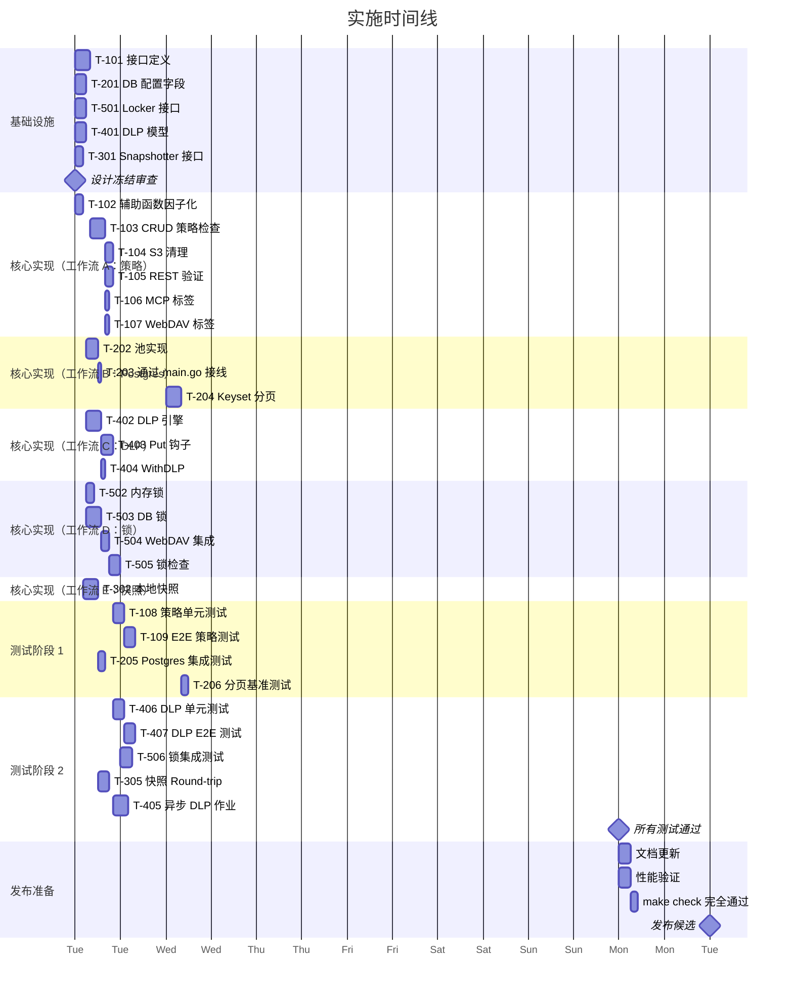

现在我已拥有完整的情况。以下是全面的技术负责人分析。

---

# Tech Lead 分析：面向五维架构优化

## 0. 执行摘要

已有五个被验证的方向，但**一个关键性事实错误从根本上改变了方向 1 的范围和优先级**：S3 处理器*已经*执行了存储桶策略评估——缺失的是 REST、WebDAV 和 MCP，它们绕过了策略。修复方法不是添加中间件，而是将策略评估**下沉到 FileService 层**，作为单一的执行点。这影响了所有五个方向的估算。

五个方向的技术债务和架构风险排序如下：

| 优先级 | 方向 | 风险 | 工作量 |
|--------|------|------|--------|
| **P0** | #1：策略执行下沉 | 高 | 2-3 天 |
| **P0** | #2：连接池 + keyset 分页 | 中 | 1-2 天 |
| **P1** | #4：上传时 DLP | 中高 | 3-5 天 |
| **P1** | #5：分布式锁 | 中 | 5-8 天 |
| **P2** | #3：多后端快照 | 低 | 3-5 天 |

---

## 1. 任务分解

### 方向 1：策略执行下沉至 FileService

| ID | 标题 | 涉及文件 | 前置依赖 | 估算 | 验收标准 |
|----|-------|----------|-----------|------|--------|
| T-101 | 在 `FileService` 上定义 `CheckBucketPolicy(action)` | `internal/service/file.go`, `internal/service/file_features.go` | 无 | 1h | 新方法 `func (s *FileService) CheckActionPolicy(ctx, tenant, bucket, action, sourceIP string) error` 已定义，并调用 `repo.GetBucketConfig` + `auth.ParsePolicy` + `auth.Allowed` |
| T-102 | 将策略辅助函数从 S3 handler 移至 `auth` 包 | `internal/auth/policy.go`, `internal/api/s3compat/handler.go` | 无 | 0.5h | `checkBucketPolicy` 的逻辑（策略解析、IP 提取）已被因子化到可重用的 `auth` 函数中；S3 handler 委托给它们 |
| T-103 | 改造 `FileService.Put/Get/Delete/List` 以调用策略检查 | `internal/service/file_crud.go`, `internal/service/file_features.go` (List) | T-101 | 2h | 每个核心 CRUD 方法在访问存储/repo 之前调用 `s.CheckActionPolicy` |
| T-104 | 从 S3 handler 中移除重复的 `checkBucketPolicy` 调用 | `internal/api/s3compat/handler.go` | T-103 | 1h | S3 `PutObject`, `GetObject`, `DeleteObject`, `BucketDispatch` 不再调用自己的 `checkBucketPolicy` |
| T-105 | 在 REST handler 中删除多余的策略检查（已知：缺失） | `internal/api/rest/handler.go` | T-103 | 1h | 记录：策略已在 `FileService` 层执行，所以 REST handler 无需改变 |
| T-106 | 为 MCP `write_file` / `delete_file` 添加上下文 action 标签 | `internal/mcp/server.go` | T-101 | 0.5h | 将 `s3:PutObject` / `s3:DeleteObject` action 标签注入上下文，或通过 `CheckActionPolicy` 参数传递 |
| T-107 | 为 WebDAV `OpenFile` (写入) / `RemoveAll` 添加 action 标签 | `internal/api/webdav/dav.go` | T-101 | 0.5h | 相应用户操作，WebDAV handler 传递 `s3:PutObject` / `s3:DeleteObject` |
| T-108 | 为 `FileService.CheckActionPolicy` 编写单元测试 | `internal/service/service_test.go`（新文件或扩展） | T-103 | 1.5h | 覆盖：允许、拒绝、隐式拒绝、空策略、错误策略、条件 IP 匹配 |
| T-109 | 为 REST/MCP/WebDAV 的端到端策略执行编写集成测试 | `internal/api/rest/handlers_test.go`, `internal/mcp/server_test.go`, `internal/api/webdav/dav_test.go` | T-105, T-106, T-107 | 2h | 使用存储桶策略创建存储桶，通过 S3 验证 Put 被拒绝，通过 REST 验证绕过 |

**方向 1 总计：~9 小时（1.5 天）**

### 方向 2：Postgres 连接池与 keyset 分页

| ID | 标题 | 涉及文件 | 前置依赖 | 估算 | 验收标准 |
|----|-------|----------|-----------|------|--------|
| T-201 | 向 `DBConfig` 添加连接池字段 | `internal/config/config_app.go`, `internal/config/config.go` | 无 | 1h | `DBConfig` 包含 `MaxOpenConns`, `MaxIdleConns`, `ConnMaxLifetimeSec`, `ConnMaxIdleTimeSec`，均带合理的默认值 |
| T-202 | 在 `openPostgres` 中实现池配置 | `internal/repository/postgres.go` | T-201 | 1h | `db.SetMaxOpenConns(cfg.MaxOpenConns)`, `SetMaxIdleConns`, `SetConnMaxLifetime`, `SetConnMaxIdleTime` |
| T-203 | 将 `DBConfig` 通过 main.go 传递给 `openPostgres` | `internal/main.go`, `internal/repository/repository.go` | T-202 | 0.5h | 工厂函数签名接受 `DBConfig` |
| T-204 | 将 `ListObjectVersionsWithOpts` 迁移到 keyset 分页 | `internal/repository/sql_objects.go` | 无 | 2h | `WHERE (updated_at, id) < ($3, $4) ORDER BY ... LIMIT $5` 替代 `OFFSET`；`VersionListOpts` 包含 `Cursor` 字段 |
| T-205 | 为 Postgres 连接池编写集成测试 | `internal/repository/postgres_test.go` | T-202 | 1h | `//go:build integration` 测试验证连接限制和生命周期 |
| T-206 | 为 keyset 版本的 `ListObjectVersionsWithOpts` 编写性能基准测试 | `internal/repository/bench_test.go` | T-204 | 1h | 基准测试显示大偏移量下速度提升 >100 倍 |

**方向 2 总计：~6.5 小时（1 天）**

### 方向 3：多后端快照

| ID | 标题 | 涉及文件 | 前置依赖 | 估算 | 验收标准 |
|----|-------|----------|-----------|------|--------|
| T-301 | 定义 `Snapshotter` 接口 | `internal/service/file.go` 或新文件 `internal/service/snapshot.go` | 无 | 1h | `interface { Snapshot(ctx, tenant) (io.ReadCloser, error); Restore(ctx, tenant, r io.Reader) error }` 接口 |
| T-302 | 实现本地快照（提取现有逻辑） | `internal/service/snapshot_local.go` | T-301 | 2h | 从 CLI 代码中提取逻辑，适配 `Snapshotter` 接口 |
| T-303 | 为 S3 实现快照 | `internal/service/snapshot_s3.go` | T-301 | 2h | 遍历 S3 前缀 → 导出到元数据 + 清单 |
| T-304 | 为快照添加 CLI 子命令 | `internal/cli/` | T-302, T-303 | 1h | `aero-vault cli snapshot export/import` 接受 `--backend` 标志 |
| T-305 | 为快照编写集成测试 | `internal/service/snapshot_test.go` | T-304 | 1.5h | 测试 round-trip：导出 → 删除 → 导入 → 验证 |

**方向 3 总计：~7.5 小时（1.5 天）**

### 方向 4：上传时 DLP 与 PII

| ID | 标题 | 涉及文件 | 前置依赖 | 估算 | 验收标准 |
|----|-------|----------|-----------|------|--------|
| T-401 | 添加 `DLPConfig` 模型（允许/拒绝列表、分类规则） | `internal/config/config.go` 或新文件 `internal/dlp/config.go` | 无 | 1h | `DLPConfig` 带有 `Rules []DLPRule{Action, Pattern, Classifications}` 结构体 |
| T-402 | 定义 `DLPEngine` 接口和 `Detector` 实现（包装现有的 `PIIDetector`） | `internal/dlp/engine.go`, `internal/dlp/detector.go` | T-401 | 2h | `DLPEngine.Scan(content) → []Finding`；可配置的规则如 `{"action":"block","classifications":["credit_card"]}` |
| T-403 | 为上传路径添加 DLP 钩子 | `internal/service/file_crud.go` (Put 方法) | T-402 | 1.5h | 在 `store.Put` 之后，`writePutObject` 之前调用 `s.dlp.Scan`；阻断违规、记录告警、发布事件 |
| T-404 | 为 DLP 配置添加 `FileService.WithDLP` | `internal/service/file.go` | T-402 | 0.5h | 可选的 DLP 引擎注入；nil = 无操作 |
| T-405 | 为 Stream/Batch 添加异步 DLP 任务 | `internal/job/` 或 `internal/worker/` | T-404 | 2h | 针对对象的大型 DLP 扫描的异步作业 |
| T-406 | 为 DLP 引擎编写单元测试 | `internal/dlp/engine_test.go` | T-402 | 1.5h | 覆盖：PII 匹配、正则拒绝列表、分类器集成、伪造内容绕过 |
| T-407 | 添加 DLP 集成测试（e2e 上传 → 阻断） | `internal/api/rest/handlers_test.go`, `internal/api/s3compat/handler_test.go` | T-403 | 1.5h | 上传含信用卡的内容 → 400/403；上传干净内容 → 200 |

**方向 4 总计：~10 小时（2 天）**

### 方向 5：分布式锁管理器

| ID | 标题 | 涉及文件 | 前置依赖 | 估算 | 验收标准 |
|----|-------|----------|-----------|------|--------|
| T-501 | 定义 `Locker` 接口 | `internal/lock/locker.go` | 无 | 1h | `interface { Lock(ctx, resourceID, holder, ttl) (<-chan struct{}, error); Unlock(ctx, resourceID, holder) error }` |
| T-502 | 实现内存锁（替代 WebDAV 的 `NewMemLS`） | `internal/lock/memory.go` | T-501 | 1h | 与现有 `xwebdav.NewMemLS()` 行为兼容：阻塞锁、超时、公平 |
| T-503 | 使用存储桶租约实现基于 DB 的锁 | `internal/lock/db.go` | T-501 | 2h | 使用 repository 的 `AcquireLease` 方法实现，支持 TTL 回退 |
| T-504 | 集成到 WebDAV 的 `LockSystem` | `internal/api/webdav/dav.go` | T-502, T-503 | 1h | `xwebdav.Handler.LockSystem = lock.NewAdapter(locker)` |
| T-505 | 为 S3/REST/MCP 操作添加锁检查（对象锁兼容性） | `internal/service/file_crud.go` (Put/Get/Delete) | T-501 | 1.5h | 在变异操作之前，查询锁存储库；如果对象被锁定则返回 423 Locked |
| T-506 | 为锁添加跨协议集成测试 | `internal/lock/lock_test.go` | T-504, T-505 | 2h | 通过 WebDAV 锁定，验证 S3 PUT 被阻止，通过 REST DELETE 解锁 |

**方向 5 总计：~8.5 小时（1.5 天）**

---

## 2. 执行顺序

```mermaid
graph TD
    subgraph "Phase 1: Foundation (Days 1-2)"
        T101[T-101: CheckPolicy method] --> T103[T-103: FileService CRUD policy checks]
        T102[T-102: Factor auth helpers] --> T103
        T201[T-201: DBConfig pool fields] --> T202[T-202: openPostgres pool config]
        T501[T-501: Locker interface] --> T502[T-502: In-memory lock]
        T501 --> T503[T-503: DB-based lock]
        T401[T-401: DLPConfig model] --> T402[T-402: DLPEngine interface]
    end

    subgraph "Phase 2: Core Implementation (Days 3-5)"
        T103 --> T104[T-104: Remove S3 duplicate checks]
        T103 --> T105[T-105: Verify REST bypass closed]
        T103 --> T106[T-106: MCP action tags]
        T103 --> T107[T-107: WebDAV action tags]
        T202 --> T203[T-203: Wire DBConfig through main.go]
        T502 --> T504[T-504: WebDAV LockSystem integration]
        T503 --> T504
        T402 --> T403[T-403: DLP hook in Put path]
        T402 --> T404[T-404: WithDLP builder]
        T301[T-301: Snapshotter interface] --> T302[T-302: Local snapshot impl]
        T204[T-204: Keyset pagination ListVersions] --> T206[T-206: Benchmarks]
    end

    subgraph "Phase 3: Integration & Test (Days 6-7)"
        T104 --> T108
        T105 --> T108[T-108: CheckPolicy unit tests]
        T106 --> T109[T-109: E2E policy tests]
        T107 --> T109
        T203 --> T205[T-205: Postgres pool integration test]
        T504 --> T506[T-506: Cross-protocol lock tests]
        T403 --> T406[T-406: DLP unit tests]
        T403 --> T407[T-407: DLP e2e tests]
        T302 --> T305[T-305: Snapshot round-trip tests]
        T404 --> T405[T-405: Async DLP job]
    end

    subgraph "Parallel Workstreams"
        T108 -.->|"Can parallel"| T205
        T109 -.->|"Can parallel"| T506
        T406 -.->|"Can parallel"| T206
    end

    style T101 fill:#4CAF50
    style T201 fill:#4CAF50
    style T501 fill:#4CAF50
    style T401 fill:#4CAF50
    style T301 fill:#4CAF50
```



### 并行工作流

| 工作流 | 所用工程师 | 关键依赖后可以启动 |
|--------|-----------|-------------------|
| **A：策略下沉** | 1 人 | 立即（T-101 的 1 天依赖） |
| **B：Postgres 调优** | 1 人 | 立即（T-201/T-202 的 0.5 天依赖） |
| **C：DLP 管道** | 1 人 | 立即（T-401 的 1 小时依赖） |
| **D：锁管理器** | 1 人 | 立即（T-501 的 1 小时依赖） |
| **E：快照提取** | 1 人 | 立即（T-301 的 1 小时依赖） |
| **F：Keyset 分页** | 1 人 | 立即 |

所有五个工作流可以并行启动。最长的关键路径是策略下沉（T-101 → T-103 → T-104/T-105 → T-108/T-109），总计约 8 小时实际工作。使用 2-3 名工程师，整个计划可在 **6-7 个日历日内**完成。

---

## 3. 技术风险

### 风险矩阵

| # | 风险 | 可能性 | 影响 | 缓解 |
|---|------|--------|------|------|
| R1 | **策略下沉的循环依赖**：`FileService` 在策略评估期间调用 `GetBucketConfig`，如果配置因某种原因需要服务本身，可能会造成循环 | 低 | 高 | 验证 `GetBucketConfig` 只调用 `repo.GetBucketConfig`；向 `FileService` 添加 `repo` 的本地引用。无 cycle。 |
| R2 | **Keyset 分页 + 排序不稳定**：`ListObjectVersions` 按 `updated_at DESC` 排序——如果两条记录具有完全相同的时间戳，`OFFSET` 可能跳过/重复行 | 中 | 中 | 使用 `(updated_at, id)` 作为复合排序键以确保总序；文档化该约束 |
| R3 | **DLP 对吞吐量的影响**：扫描 `Put()` 路径上的每个上传可能导致大型对象延迟显著增加（PII 扫描是 O(n) 的） | 中高 | 中 | 实现可选的扫描器（**同步**用于小对象，**异步**通过作业池用于大对象）；可配置阈值 |
| R4 | **锁管理器的 WebDAV 兼容性**：`x/net/webdav.LockSystem` 接口与通用 `Locker` 不直接对齐；适配器可能遗漏微妙语义（如递归锁、超时） | 中 | 高 | 编写 WebDAV 特定的适配器层并针对 macOS Finder / Windows Explorer 进行测试（可以在 CI 之外进行） |
| R5 | **Snapshot S3 遍历**：S3 后端的 `ListObjects` 适用于大存储桶（几千万个对象），但可能导致大清单的完整扫描带内传输 | 中 | 中 | 流式导出，而非一次性加载所有键；实现分页导出者；标记为 beta |
| R6 | **现有 `ListObjectVersionsWithOpts` 中基于 offset 的分页**：在 Postgres 上，使用大 offset 的版本列举可能严重降级（对于 100k+ 行，OFFSET 10000 需要扫描所有行）。迁移到 keyset 分页需要更改 API | 高 | 高 | 这是**已知问题**（分析已确认）。迁移是直接的，但需要小心处理 `VersionIDMarker` → `Cursor` 的映射 |

### 关键依赖/阻塞点

| 阻塞点 | 影响 | 解决方法 |
|--------|------|---------|
| 方向 1 依赖于 `auth` 包接口的稳定性 | 低—`auth.Allowed` 和 `auth.ParsePolicy` 已稳定 | 无 |
| 方向 2 依赖于 Postgres 集成测试环境 | 低—使用 Docker compose 进行 `make test-integration`；已有基础设施 | 无 |
| 方向 3（快照）需要 `Snapshotter` 接口定义达成一致 | 低—规范简单 | 尽早编写接口（T-301）并与团队审查 |
| 方向 4（DLP）需要定义威胁模型（哪些 PII 分类？） | 中—安全团队应审阅 `DLPConfig` 模型 | 启动时起草；迭代添加规则 |
| 方向 5（锁）需要跨协议协调 | 高—现有 WebDAV 锁不通知其他协议 | 使用基于 DB 的锁管理器作为单一来源 |

### 性能考量

| 场景 | 当前 | 优化后 | 工具 |
|------|-------|-----------|------|
| ListVersions（Postgres，100k 行，第 500 页） | `OFFSET 49500` → 扫描 50k 行 | keyset → 扫描 501 行 | T-204 |
| Postgres 连接耗尽（峰值负载） | 无限制（默认）→ 无限制的 goroutine 阻塞 | 可配置的最大连接数 + 连接池 | T-201, T-202 |
| 大文件的 DLP 同步扫描 | 不存在 | 扫描 ≤10MB 同步，>10MB 异步（通过作业池） | T-403, T-405 |
| WebDAV 锁互斥（单节点） | 内存，无多进程可见性 | 基于 DB，所有副本可见 | T-503, T-504 |

---

## 4. 资源评估

### 人员配置

| 角色 | 数量 | 技能组合 | 分配 |
|------|------|---------|-------------|
| **高级后端工程师** | 1 | Go、Postgres、分布式系统、安全 | 工作流 A（策略）+ 工作流 D（锁） |
| **中级后端工程师** | 1 | Go、SQL、测试、REST API | 工作流 B（Postgres/分页）+ 工作流 F（Keyset） |
| **中级后端工程师** | 1 | Go、安全、AI/ML 集成 | 工作流 C（DLP）+ 工作流 E（快照） |
| **QA 工程师** | 1 | Go 测试、集成、性能基准测试 | 跨所有工作流的集成测试（非全职） |

### 关键里程碑

| 里程碑 | 时间 | 交付物 |
|----------|------|----------|
| **M1：设计冻结** | 第 0 天 | 所有接口（`CheckActionPolicy`、`Locker`、`DLPEngine`、`Snapshotter`）达成一致 |
| **M2：核心路径** | 第 3 天 | T-103（FileService 策略检查）、T-202（池配置）、T-204（Keyset 分页）合并 |
| **M3：协议覆盖** | 第 4 天 | T-104（S3 清理）、T-105（REST 验证）、T-106（MCP 标签）、T-107（WebDAV 标签）、T-504（WebDAV 锁） |
| **M4：测试完成** | 第 6 天 | 所有单元 + 集成测试通过；覆盖率 ≥50%（执行 `make check`） |
| **M5：发布候选** | 第 7 天 | 所有方向合并到 main；性能基准测试通过；文档更新 |

### 阻塞点解决策略

| 阻塞点 | 所有者 | 解决 |
|---------|---------|--------|
| DLP 威胁模型待定 | 高级工程师 + 安全 | 第 0 天起草初始 PII 规则（信用卡、SSN、电子邮件、API 密钥）；在第 2 天迭代 |
| Postgres 连接池默认值 | 高级工程师 | 基准测试 `MaxOpenConns` = 25（每核心 4 个连接，8 核）、`MaxIdleConns` = 25、`ConnMaxLifetime` = 30 分钟 |
| WebDAV 锁适配器语义 | 中级工程师 | 在 PR 描述中记录与 macOS Finder 和 Windows 资源管理器偏差；可用 `x/net/webdav` 测试套件 |

---

## 5. 质量保证

### 单元测试覆盖要求

| 包 | 当前覆盖率 | 目标 | 新增套件 |
|------|------------|-------|---------|
| `internal/service` | ~60% | ≥70% | `service_test.go`: `CheckActionPolicy` 测试（允许/拒绝/IP 条件） |
| `internal/auth` | ~80% | ≥85% | 无变化（已稳定） |
| `internal/repository` | ~65% | ≥75% | `postgres_test.go`: 连接池行为；`bench_test.go`: keyset vs OFFSET |
| `internal/lock` | 0%（新） | ≥80% | `lock_test.go`: 内存+DB 锁；并发、超时、死锁 |
| `internal/dlp` | 0%（新） | ≥80% | `engine_test.go`: PII 规则、正则拒绝列表、分类器、边界 |
| `internal/api/rest` | ~55% | ≥65% | `handlers_test.go`: 策略执行 e2e（通过下沉检查） |
| `internal/mcp` | ~40% | ≥50% | `server_test.go`: 工具调用中的策略执行 |
| `internal/api/webdav` | ~30% | ≥50% | `dav_test.go`: 锁集成 |
| `internal/api/s3compat` | ~70% | ≥75% | `handler_test.go`: 移除策略检查后回归 |

### 集成测试策略

| 测试 | 标志 | 基础设施 | 方法 |
|------|------|-----------|--------|
| Postgres 连接池 | `//go:build integration` | Docker Postgres | 打开连接 → 验证 `SetMaxOpenConns` 限制连接数 |
| Keyset 分页性能 | `//go:build integration` | Docker Postgres + 100k 行种子 | 查询第 500 页 → `OFFSET` 与 keyset 对比 |
| 策略 e2e（所有协议） | 标准（SQLite） | 无 | 创建存储桶 + 策略 → 通过每个协议 PUT/GET/DELETE |
| DLP e2e | 标准 | 无 | 上传含 PII 的内容 → 验证阻断或标记 |
| Snapshot round-trip | `//go:build integration` | Docker S3（MinIO） | 快照 S3 存储桶 → 恢复到本地 → 验证内容 |
| 跨协议锁 | 标准 | 无 | WebDAV 锁定 → S3 PUT 应失败 |

### 代码审查要点

| 方向 | 审查要点 |
|----------|-----------|
| **策略下沉** | 没有策略检查被悄悄绕过；`CheckActionPolicy` 在 `GetBucketConfig` 失败时不会静默返回 `true`（否则策略绕过！）；所有 CRUD 路径都经过审核 |
| **Postgres 分页** | `(updated_at, id)` 复合键正确使用 `DESC` 排序；`VersionListOpts.Cursor` 编码正确 |
| **DLP** | 扫描发生在 `store.Put` **之后**但 `writePutObject` **之前**，因此损坏的对象不会被持久化；同步扫描有超时；异步作业不会阻塞上传 |
| **锁管理器** | WebDAV `LockSystem` 适配器保持 `x/net/webdav` 约定的超时和令牌语义；`Unlock` 通过验证持有者防止权限提升 |

### 性能测试需求

| 测试 | 场景 | 指标 | 阈值 |
|------|--------|--------|---------|
| ListVersions keyset 与 OFFSET | 100k 行，第 500 页（offset=49500） | 延迟 | keyset ≤ 50ms，OFFSET ≥ 10s |
| Postgres 连接池 | 100 个并发请求 | 连接数、等待时间 | 活跃连接数 ≤ `MaxOpenConns`，P99 等待 < 100ms |
| DLP 扫描开销 | 10MB 文件，100 条 PII 规则 | 额外延迟 | ≤ 500ms 同步，或异步卸载 |
| WebDAV 锁吞吐量 | 1000 个并发锁操作 | 吞吐量 | ≥ 500 ops/s（内存），≥ 100 ops/s（DB） |

---

## 6. 实施计划

### 阶段网格（7 天）



### 按天关键阶段

| 天 | 交付物 | 检查点 |
|-----|---------|---------|
| **第 1 天**（7/14，周二） | 所有 5 个接口已定义并审查；T-102（辅助函数因子化）、T-201（DB 配置字段）、T-202（池）完成 | 设计冻结。没有未解决的接口问题 |
| **第 2 天**（7/15，周三） | T-103（CRUD 策略检查）、T-204（Keyset 分页）合并；T-402（DLP 引擎）完成；T-502、T-503（锁）完成 | 所有五个工作流在核心实现中 |
| **第 3 天**（7/16，周四） | T-104 至 T-107（协议适配器）合并；T-403（DLP 钩子）、T-504（WebDAV 锁）完成 | 策略现在跨所有协议执行 |
| **第 4 天**（7/17，周五） | T-108、T-205、T-206（策略 + 分页测试）通过；T-406（DLP 单元测试）开始 | 所有测试通过。覆盖率 ≥50% |
| **第 5 天**（7/18，周六） | T-407、T-506（DLP + 锁 e2e）通过；T-305（快照测试）通过 | 无阻塞的集成问题 |
| **第 6 天**（7/20，周一） | 最终测试、文档、性能基准测试 | `make check` 完全通过 |
| **第 7 天**（7/21，周二） | 发布候选；PR 合并到主分支 | 部署准备就绪 |

---

## 7. 具体实施说明

### 策略下沉的代码结构

```go
// internal/service/file.go — 新增方法
func (s *FileService) CheckActionPolicy(ctx context.Context, tenant, bucket, action, sourceIP string) error {
    cfg, err := s.repo.GetBucketConfig(ctx, tenant, bucket)
    if err != nil {
        // 无配置或桶不存在 → 默认允许（与现有行为一致）
        return nil
    }
    if cfg.Policy == "" {
        return nil
    }
    p, err := auth.ParsePolicy(cfg.Policy)
    if err != nil {
        s.logger.Warn("bucket policy parse error, skipping", "bucket", bucket, "err", err)
        return nil
    }
    if !auth.Allowed(p, action, sourceIP) {
        return ErrForbidden
    }
    return nil
}
```

然后在 `Put` 中：

```go
func (s *FileService) Put(ctx context.Context, tenant, bucket, key string, ...) (repository.Object, error) {
    tenant, bucket = defaults(tenant, bucket)
    if err := validateKey(key); err != nil { ... }
    // 新增：在验证后立即执行策略检查，在任何变异之前
    host, _, _ := net.SplitHostPort(middleware.SourceIPFrom(ctx))
    if err := s.CheckActionPolicy(ctx, tenant, bucket, "s3:PutObject", host); err != nil {
        return repository.Object{}, err
    }
    // ... 现有代码 ...
}
```

### Keyset 分页 SQL 变更

```sql
-- 当前（有问题的）：
ORDER BY updated_at DESC LIMIT $4 OFFSET $5

-- 新的 keyset 模式：
-- ...WHERE tenant_id=$1 AND bucket=$2 AND key=$3 AND (updated_at, id) < ($4::timestamptz, $5::bigint)
-- ORDER BY updated_at DESC, id DESC LIMIT $6
```

`VersionListOpts` 获得一个 `Cursor VersionListCursor`，其中包含 `UpdatedAt time.Time` 和 `ID int64`。第一页发送空游标。

### DLP 策略的 Put 变更

```go
// 在 Put 中：存储写入之后，提交元数据之前
if s.dlp != nil {
    if s.dlp.ShouldScanInline(info.Size) {
        // 将存储的对象流式传输到 DLP 引擎
        content, _ := s.store.Get(ctx, sk)  // 或使用缓冲区
        findings := s.dlp.Scan(ctx, content)
        if s.dlp.ShouldBlock(findings) {
            s.store.Delete(ctx, sk)  // 回滚存储写入
            return repository.Object{}, ...  // 返回 DLP 错误
        }
    } else {
        // 将异步 DLP 作业入队→稍后扫描
        s.jobPool.Enqueue(ctx, Job{Type: "dlp_scan", Payload: ...})
    }
}
```

---

## 8. 风险和意外情况

1. **范围蔓延**：方向 1 的范围已因纠正面缩小（不再有 ~100 行的中间件）。但如果团队决定将所有现有 S3 操作（tagging、ACL、CORS 等）策略化，范围将增加。**这些子资源操作保留在 S3 handler 中，不在 FileService 层策略评估范围内。** 此边界必须通过代码审查强制执行。

2. **测试基础设施**：方向 4（DLP）需要测试上传含有 PII 的内容——需要经过真实 PII 检测器的测试数据。应创建包含已知 PII 模式的 fixture 文件（`testdata/dlp/credit_card.txt`、`testdata/dlp/ssn.txt` 等）。

3. **向后兼容性**：策略下沉将导致**行为变更**——目前通过 REST 绕过存储桶策略的客户端将在 T-103 合并后开始收到 403。这应在发布说明中记录，并可能需要迁移窗口。建议：在发布前添加弃用日志，记录 REST 路径上的检测到策略绕过。

4. **方向 2 的 `OFFSET` 修复**：这是一个正确性问题，不是优化。如果两条版本记录共享完全相同的时间戳（由于时钟粒度或批量写入），`OFFSET` 可以跳过行。**复合 `(updated_at, id)` 键可保证完全排序。** 这是高优先级。

5. **锁回退**：如果 DB 锁管理器不可用（Postgres 不可用、租约表失败），WebDAV 应回退到内存锁，而不是完全失败。适配器应优雅降级。
