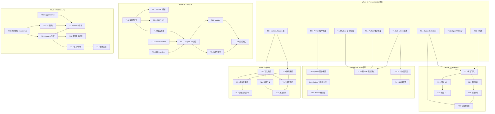
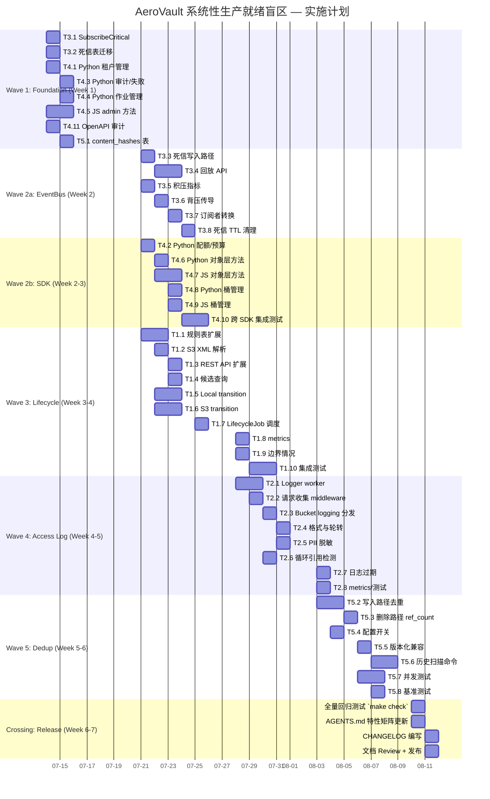

---

# Tech Lead 分析报告：系统性生产就绪盲区实现规划

## 概览

本文档基于 `docs/requirements/expansion-v80-systemic-production-gaps.md`（30 KB，366 行）对 **5 个功能方向**进行技术实现分析。每个方向均已通过全代码库扫描验证，代码锚点精确可复现。

| 方向 | 优先级 | 代码锚点数 | 影响面 | 建议实施阶段 |
|------|--------|-----------|--------|-------------|
| 1️⃣ 存储类生命周期自动化 | P1 | 5 | 成本优化（预估 63-92% 节省） | 第 2 波 |
| 2️⃣ 服务器访问日志管道 | P2 | 6 | 运维审计/合规 | 第 3 波 |
| 3️⃣ 关键订阅者可靠事件送达 | P1 | 7 | 数据完整性/安全 | 第 1 波 |
| 4️⃣ SDK 管理面功能补齐 | P2 | 6 | 开发者体验/产品完整性 | 第 1 波 |
| 5️⃣ 存储层内容去重 | P3 | 6 | 存储效率（典型 3-20x 节省） | 第 4 波 |

---

## 1. 任务分解

### 方向 1️⃣：存储类生命周期自动化（P1 — 10 个任务）

| 任务 ID | 标题 | 涉及文件 | 前置依赖 | 预估工时 | 验收标准 |
|---------|------|---------|---------|---------|---------|
| **T1.1** | 生命周期规则表扩展：新增 `transition_after_days` / `transition_action` 字段 | `internal/repository/repository.go`, `internal/repository/sql_objects.go`, `migrations/sqlite/NNNN_lifecycle_transition.up.sql`, `migrations/postgres/NNNN_lifecycle_transition.up.sql` | 无 | 4h | migration 文件通过 `Migrate()` 自动执行；`Object` 结构体包含 `TransitionAfterDays`、`TransitionAction` 字段；`ListExpired` 可筛选 transition 候选对象 |
| **T1.2** | S3 Lifecycle XML Transition 元素解析 | `internal/api/s3compat/xml.go`, `internal/api/s3compat/handler.go` | T1.1 | 3h | 解析 `<Transition><Days>30</Days><StorageClass>STANDARD_IA</StorageClass></Transition>` → 存入 `LifecycleRule`；handler 调用 `SetBucketLifecycle` 时持久化 transition 规则 |
| **T1.3** | REST 侧生命周期规则 API 扩展 | `internal/api/rest/handler.go`, `internal/api/rest/router.go` | T1.1 | 2h | `PUT /v1/buckets/{bucket}/lifecycle` 支持 transition 规则；`GET` 包含 transition 字段 |
| **T1.4** | 对象 transition 候选查询 | `internal/repository/sql_objects.go` (+ postgres 变体) | T1.1 | 3h | `ListTransitionCandidates(ctx, bucket, limit)` 返回 `(storage_class != target_class && age > transition_after_days)` 的对象列表；按 `age` 排序，幂等可重复执行 |
| **T1.5** | Local 存储后端 transition 实现 | `internal/storage/local_write.go`, `internal/storage/local.go` | 无 | 4h | `store.Transition(ctx, oldKey, newKey, targetTier)`：在 tier 子目录下创建硬链接/副本 → 更新 `storage_key` → 删除旧 blob；crash 后重试（旧 blob 仍存在） |
| **T1.6** | S3/OSS/COS 后端 transition 实现 | `internal/storage/s3.go`, `internal/storage/factory.go` | 无 | 4h | S3 `CopyObject` 带 `x-amz-storage-class` header；成功后 `DeleteObject`；OSS/COS 等效 API；失败不重试（下次 sweep 自动重试） |
| **T1.7** | LifecycleJob transition 调度 | `internal/reconcile/lifecycle.go` | T1.4, T1.5, T1.6 | 3h | `sweepTransitions()` 每轮获取候选 → `store.Transition()` → `repo.UpdateStorageClass()`；transition 命中 expire 阈值的对象 → transition 优先执行 |
| **T1.8** | transition metrics | `internal/telemetry/metrics.go` | T1.7 | 2h | `storage_class_transition_total{from,to,status="success|skip|error"}` counter；`storage_class_gauge` 在各 tier 转换时更新 |
| **T1.9** | 边界情况处理 | `internal/reconcile/lifecycle.go` | T1.7 | 3h | ① active object lock → skip + log ② transition 中 crash → 下次 sweep 幂等恢复 ③ expire_after_days < transition_after_days → expire 优先 ④ 非版本化桶 transition 中 crash → key 唯一保证 |
| **T1.10** | 集成测试 | `internal/reconcile/lifecycle_test.go`, `internal/api/s3compat/handler_test.go` | T1.1–T1.9 | 4h | local 后端：PUT 对象 → 设置 lifecycle → 触发 sweep → 验证 storage_class 变更 + storage_key 变更；S3 mock：验证 `CopyObject` 调用参数 |

### 方向 2️⃣：服务器访问日志管道（P2 — 8 个任务）

| 任务 ID | 标题 | 涉及文件 | 前置依赖 | 预估工时 | 验收标准 |
|---------|------|---------|---------|---------|---------|
| **T2.1** | 日志记录器 worker 实现 | `internal/logging/logger.go`（新文件）, `internal/logging/logger_test.go`（新文件） | 无 | 4h | 异步 goroutine：从 channel 接收日志记录 → 批量写入 → 每 5s 或每 100 条 flush；支持优雅关闭（drain 完所有待写入记录） |
| **T2.2** | 请求上下文收集 middleware | `internal/middleware/accesslog.go`（新文件或扩展现有） | T2.1 | 3h | 请求结束时收集 `(tenant, bucket, key, method, status, bytes, user_agent, remote_ip, request_id, duration_ms)` → 发送到 logger worker channel；在中间件链的 AccessLog 之后触发 |
| **T2.3** | Bucket logging 分发 | `internal/middleware/accesslog.go`, `internal/service/file_service.go`（新增方法） | T2.2 | 3h | 从请求中提取 `X-Aero-Tenant` → 查该租户下各 bucket 的 logging 配置 → 组装日志行 → 发送给 worker；缓存 logging 配置（TTL 60s 刷新） |
| **T2.4** | 日志格式与轮转 | `internal/logging/logger.go` | T2.1 | 3h | 输出：按 `{bucket_name}/{prefix}/YYYY/MM/DD/HH.access.json.gz` 组织；每行 JSON（标准字段 + 可扩展）；按小时自动轮转 |
| **T2.5** | PII 脱敏 | `internal/middleware/accesslog.go` | T2.2 | 2h | `LoggingScrubIP=true` → remote_ip /24 截断；`LoggingScrubUA=true` → user_agent 全量替换为 `"*"`；配置通过 `config.go` 读取 |
| **T2.6** | 循环引用检测 | `internal/middleware/accesslog.go` | T2.3 | 2h | 如果目标桶 = 当前请求桶 → 跳过写入 + warn log；或重定向到系统桶 `__aero_logs` |
| **T2.7** | 日志对象自动过期 | `internal/reconcile/lifecycle.go`（复用现有 expire 逻辑） | T2.4 | 2h | logging 配置中 `log_retention_days`（默认 30）→ 日志对象过期自动清除；复用 `ListExpired` |
| **T2.8** | metrics 与集成测试 | `internal/telemetry/metrics.go`, `internal/middleware/accesslog_test.go` | T2.1–T2.7 | 3h | `access_log_written_total{target_bucket, status="ok|skip|error"}`；测试：配置 logging → 发送请求 → 验证目标桶中出现日志对象 |

### 方向 3️⃣：关键订阅者可靠事件送达（P1 — 8 个任务）

| 任务 ID | 标题 | 涉及文件 | 前置依赖 | 预估工时 | 验收标准 |
|---------|------|---------|---------|---------|---------|
| **T3.1** | `SubscribeCritical` 方法 | `internal/events/bus.go` | 无 | 2h | `SubscribeCritical(bufSize)` 创建无 `default` 分支的阻塞 channel；`SubscribeStandard`（现有行为重命名）；同时保留 `Subscribe` 别名向后兼容 |
| **T3.2** | 死信表创建 | `migrations/sqlite/NNNN_dead_letter_events.up.sql`, `migrations/postgres/NNNN_dead_letter_events.up.sql`, `internal/repository/repository.go` | 无 | 2h | `dead_letter_events` 表：`(id UUID PK, source_event_id UUID, subscriber_name TEXT, dropped_at TIMESTAMP, dropped_reason TEXT, metadata JSONB, replayed BOOLEAN DEFAULT FALSE, replay_count INT DEFAULT 0)` |
| **T3.3** | 死信写入路径 | `internal/events/bus.go`, `internal/repository/sql_events.go` | T3.2 | 3h | `broadcast` 中 `default` 分支 → `repo.InsertDeadLetter(e, subscriberName)`；仅非关键订阅者走此路径；关键订阅者阻塞发送 |
| **T3.4** | 死信回放 API | `internal/api/rest/admin.go`, `internal/api/rest/router.go`, `internal/api/rest/handler.go` | T3.2, T3.3 | 4h | `GET /admin/events/dead-letter`（分页列表），`POST /admin/events/dead-letter/{id}/replay`（重新广播），`POST /admin/events/dead-letter/{id}/replay-all`（批量）；超出 3 次标记 `permanently_failed` |
| **T3.5** | 订阅者积压指标 | `internal/events/bus.go`, `internal/telemetry/metrics.go` | T3.1 | 2h | `eventbus_subscriber_backlog{name}` gauge；`SubscribeWithHealthCheck(name, ch)` 可选的命名订阅者追踪 |
| **T3.6** | 背压传导 | `internal/events/bus.go`, `internal/service/file_crud.go` | T3.1, T3.5 | 3h | 关键订阅者积压 > 阈值（如 1000）→ `Publish` 返回 `ErrBusOverloaded` → `file_crud.go:emit` 可感知并降级（log + 跳过？或返回 503） |
| **T3.7** | 现有订阅者转换 | `internal/antivirus/worker.go`, `internal/replication/replication.go`, `internal/events/webhook.go` | T3.1 | 2h | Replication/Webhook 改为 `SubscribeCritical`；Antivirus 保留 `Subscribe`（允许丢弃，非致命）；Indexer 同理允许丢弃 |
| **T3.8** | 死信 TTL 清理 | `internal/reconcile/lifecycle.go`（或新增 `DeadLetterCleanupJob`） | T3.2 | 2h | 死信记录 TTL 7 天后自动清除；reconcile job 集成；metric `dead_letter_cleaned_total` |

### 方向 4️⃣：SDK 管理面功能补齐（P2 — 11 个任务）

| 任务 ID | 标题 | 涉及文件 | 前置依赖 | 预估工时 | 验收标准 |
|---------|------|---------|---------|---------|---------|
| **T4.1** | Python SDK：租户管理方法 | `sdk/python/aero_vault.py` | 无 | 3h | `create_tenant(tenant_id, status, quota)`、`list_tenants()`、`delete_tenant(tenant_id)` 三个方法，返回结构体/异常 |
| **T4.2** | Python SDK：配额与预算管理 | `sdk/python/aero_vault.py` | T4.1 | 2h | `set_tenant_status(tenant_id, status)`、`set_quota(tenant_id, quota)`、`set_budget(tenant_id, budget_usd)` |
| **T4.3** | Python SDK：审计与失败管理 | `sdk/python/aero_vault.py` | 无 | 2h | `list_audit(page, per_page)`、`list_webhook_failures(page, per_page)` |
| **T4.4** | Python SDK：作业管理 | `sdk/python/aero_vault.py` | 无 | 2h | `list_jobs(page, per_page)`、`retry_job(job_id)` |
| **T4.5** | JS SDK：完整 admin 方法集 | `sdk/js/aero-vault.js` | 无 | 6h | 15 个 admin 方法（对照 Go SDK 列表）全部实现，支持 TypeScript 类型定义 |
| **T4.6** | Python SDK：对象层缺失方法 | `sdk/python/aero_vault.py` | 无 | 4h | `lock_object()`、`restore_object()`、`batch_delete()`、`batch_tag()`、`list_bucket_versions()`、`bucket_stats()`、`folder_*()` |
| **T4.7** | JS SDK：对象层缺失方法 | `sdk/js/aero-vault.js` | 无 | 4h | 同上，JS SDK 实现 |
| **T4.8** | Python SDK：桶管理方法 | `sdk/python/aero_vault.py` | 无 | 3h | `get_bucket_cors()`、`put_bucket_cors()`、`delete_bucket_cors()`、`get_bucket_notification()`、`put_bucket_notification()`、`delete_bucket_notification()` |
| **T4.9** | JS SDK：桶管理方法 | `sdk/js/aero-vault.js` | 无 | 3h | 同上，JS SDK 实现 |
| **T4.10** | 跨 SDK 集成测试 | `sdk/python/test_admin.py`（新）、`sdk/js/test_admin.mjs`（新） | T4.1–T4.9 | 5h | 每套 SDK 运行完整的 admin CRUD 流程：CreateTenant → SetQuota → SetBudget → ListAudit → DeleteTenant；Go SDK 作为参考基线（已验证，无需重测） |
| **T4.11** | OpenAPI 规范审计 | 查看 `openapi.json` | 无 | 3h | 对比 REST handler 与 OpenAPI 定义，确保所有 admin 端点被记录；标记自动生成可行性（openapi-generator） |

### 方向 5️⃣：存储层内容去重（P3 — 8 个任务）

| 任务 ID | 标题 | 涉及文件 | 前置依赖 | 预估工时 | 验收标准 |
|---------|------|---------|---------|---------|---------|
| **T5.1** | `content_hashes` 表 + repository | `migrations/sqlite/NNNN_content_hashes.up.sql`, `migrations/postgres/NNNN_content_hashes.up.sql`, `internal/repository/repository.go`, `internal/repository/sql_content_hashes.go`（新） | 无 | 3h | `content_hashes(hash BLOB PRIMARY KEY, ref_count INTEGER NOT NULL DEFAULT 0, storage_key TEXT NOT NULL, size INTEGER NOT NULL, created_at TEXT)`；`FindContentHash`、`IncrementRef`、`DecrementRef`、`InsertContentHash` 方法 |
| **T5.2** | 写入路径去重检查 | `internal/service/file_crud.go`, `internal/api/rest/handler.go`, `internal/storage/local_write.go` | T5.1 | 5h | `Put` 流程：计算 SHA256 → `FindContentHash` → 命中 → 复用 `storage_key` + `ref_count++` + 更新 objects 行（不写新 blob）；未命中 → 正常写入 + `InsertContentHash`；`STORAGE_DEDUP_ENABLED` gating |
| **T5.3** | 删除路径 ref_count 管理 | `internal/service/file_crud.go`, `internal/reconcile/lifecycle.go` | T5.1, T5.2 | 3h | `HardDelete` → 查 content_hash → `DecrementRef` → `ref_count == 0` → 删除 blob + 删除 hash 行；`SoftDelete` 不影响 ref_count（版本保留）；`LifecycleJob` 硬删除路径同理 |
| **T5.4** | 配置开关 + 功能门控 | `internal/config/config.go`, `cmd/server/main.go` | T5.2 | 2h | `STORAGE_DEDUP_ENABLED`（默认 `false`）；`STORAGE_DEDUP_ALGORITHM`（`sha256`，预留 `blake3` 扩展）；启动时 log 去重状态 |
| **T5.5** | 版本化桶去重兼容 | `internal/service/file_crud.go` | T5.2, T5.3 | 3h | 不同版本共享同一 content_hash → 共享 blob；ref_count 计入所有活动版本；版本删除仅减 ref_count（直到最后一个版本删除才释放 blob） |
| **T5.6** | 历史数据去重建命令 | `internal/cli/cli_admin.go` | T5.1 | 4h | `aero-vault admin dedup-scan [--tenant T] [--bucket B] [--dry-run]`：扫描已有对象 → 计算 SHA256 → 匹配 → 更新 storage_key 指向已有 blob → 删旧 blob；`--dry-run` 仅报告不执行 |
| **T5.7** | 并发安全测试 | `internal/service/file_crud_test.go`, `internal/repository/sql_content_hashes_test.go`（新） | T5.1–T5.5 | 4h | 20 个 goroutine 并发上传相同内容 → 仅第一个写入 blob，其余 ref_count++；并发删除 → ref_count 递减原子正确；唯一约束冲突 → `ON CONFLICT DO NOTHING` + 二次查询 |
| **T5.8** | 性能基准 | `internal/storage/dedup_bench_test.go`（新） | T5.2 | 3h | 1 MiB 文件：去重开启 vs 关闭 → P50/P95/P99 延迟对比；SHA256 计算 CPU 开销报告；100 次相同内容写入 → 验证实际存储用量降至 ~1/100 |

**总任务数：45 个任务，总预估工时：139 小时（约 17.4 人·天）**

---

## 2. 执行顺序

### 依赖关系图



### 并行执行分组

```
┌────────────────────────────────────────────────────────────┐
│ Wave 1: Foundation (±1 周)                                 │
│ ┌──────┐ ┌──────┐ ┌──────┐ ┌──────┐ ┌──────┐             │
│ │T3.1  │ │T3.2  │ │T4.1  │ │T4.3  │ │T4.4  │             │
│ │T4.5  │ │T4.11 │ │T5.1  │ │      │ │      │ ← 全部独立   │
│ └──────┘ └──────┘ └──────┘ └──────┘ └──────┘             │
├────────────────────────────────────────────────────────────┤
│ Wave 2: EventBus + SDK (±1.5 周)                          │
│ ┌──────────────┐ ┌─────────────────────────────┐          │
│ │Wave 2a (E)   │ │Wave 2b (SDK)                │          │
│ │T3.3→T3.4→T3.8│ │T4.2→T4.6→T4.8→T4.10        │          │
│ │并行: T3.5→T3.6│ │T4.7→T4.9                    │ ← 并行   │
│ └──────────────┘ └─────────────────────────────┘          │
├────────────────────────────────────────────────────────────┤
│ Wave 3: Lifecycle (±1.5 周)                                │
│ ┌──────────────────────────────────────────┐               │
│ │T1.1→T1.2, T1.3                          │               │
│ │T1.4→T1.7 (等待 T1.5/T1.6)               │               │
│ │T1.5/T1.6 并行实现                        │               │
│ │T1.7→T1.8, T1.9→T1.10                    │               │
│ └──────────────────────────────────────────┘               │
├────────────────────────────────────────────────────────────┤
│ Wave 4: Access Log (±1 周)                                 │
│ ┌──────────────────────────────────────────┐               │
│ │T2.1→T2.2→T2.3→T2.4                      │               │
│ │T2.5/T2.6 与 T2.3 并行                    │               │
│ │T2.7/T2.8 在 T2.4 之后                    │               │
│ └──────────────────────────────────────────┘               │
├────────────────────────────────────────────────────────────┤
│ Wave 5: Dedup (±1 周)                                      │
│ ┌──────────────────────────────────────────┐               │
│ │T5.1→T5.2→T5.3→T5.4→T5.5                │               │
│ │T5.6/T5.7/T5.8 在核心路径之后             │               │
│ └──────────────────────────────────────────┘               │
└────────────────────────────────────────────────────────────┘
```

---

## 3. 技术风险

### 3.1 方向 1️⃣ 生命周期 transition 风险

| 风险 | 等级 | 概率 | 影响 | 缓解方案 |
|------|------|------|------|---------|
| S3 `CopyObject` 跨 tier 时云厂商限流（`SlowDown`/`RequestThrottled`） | **高** | 中 | 中 — 大量对象 transition 时频繁限流 | 退避重试（指数退避 3 次）；单轮 limit 200 对象（已使用 batch size）；失败对象跳过计量，下次 sweep 自动重试 |
| crash 后 local 后端 transition 状态不一致：旧 blob 已删除、新 blob 未写完 | **高** | 低 | 高 — 数据丢失 | 设计为：先写入新路径 → 成功后更新 DB `storage_key` → 最后删除旧 blob；crash 在第一步之后旧 blob 仍可读；二次 sweep `Stat` 旧 key 失败时用新 key 重试 |
| `STANDARD → GLACIER` 过渡需要对象大小 ≥ 128 KB（AWS S3 限制） | **中** | 高（Local backend 无此限制，S3 有） | 低 — 小对象 skips | 查询 transition 候选时增加 `size >= minTierSize` 过滤；metric 记录 `skipped_small_object` |
| Object Lock 与 Glacier 不兼容（S3 规约） | **低** | 中 | 中 — lock 对象无法 transition | `handleTransition` 检查 lock 状态；有 lock → skip + log + metric；lock 释放后下次 sweep 自动处理 |
| 自定义后端（OSS/COS）的 tier 语义不统一 | **中** | 中 | 中 — 实现复杂度增加 | 每个后端在 `factory.go` 中标记 `supportsTiering`；不支持的后端 skip transition + warn log |

### 3.2 方向 2️⃣ 访问日志管道风险

| 风险 | 等级 | 概率 | 影响 | 缓解方案 |
|------|------|------|------|---------|
| 高并发下日志写入成为瓶颈 | **中** | 中 | 中 — 请求延迟增加 | 完全异步：请求路径只做 channel send；writer 批量 flush（5s/100 条）；独立 goroutine 池（可配置）；channel 满时降级（丢弃日志而非阻塞请求） |
| 日志目标桶的 storage 后端限流 | **中** | 低 | 低 — 日志丢失 | 与用户请求路径分离：日志 worker 有独立 `storage.Storage` 实例；重试 3 次后丢弃（日志不可阻塞应用） |
| 日志循环引用导致无限递归 | **高** | 低 | 高 — 无限写入 | 三方保护：① middleware 检测目标桶 == 当前桶 → skip；② 日志对象自身产生请求时跳过 logging（X-Logging-Request: true header）③ 系统桶 `__aero_logs` 永不 logging |
| 日志存储膨胀 | **低** | 高 | 中 — 存储成本 | 默认 retention 30 天（可配置）；内置 `lifecycle` 过期触发；按小时轮转 + gzip 压缩（典型压缩率 5-10x） |

### 3.3 方向 3️⃣ 事件送达风险

| 风险 | 等级 | 概率 | 影响 | 缓解方案 |
|------|------|------|------|---------|
| `SubscribeCritical` 阻塞导致 `Publish` 调用者（HTTP handler）挂起 | **高** | 中 | **高** — 请求线程阻塞 | `SubscribeCritical` 必须有超时封套：在 `Publish` 中使用 `select { case ch <- e: case <-time.After(5s): return ErrBusOverloaded }`；业务调用路径可选择降级返回 503 或继续不等待 |
| 死信表快速膨胀（持久性消费者崩溃） | **高** | 中 | 中 — DB 存储膨胀 | `replay_count > 3` → 自动标记 `permanently_failed` + 停止回写入（仅保留最后一条 + 聚合计数）；死信 TTL 7 天 reconcile 自动清除 |
| 集群多副本场景中死信只记录在当前副本 | **中** | 中 | 中 — 其他副本不知晓死信 | 死信表在共享 DB 中全局可见（所有副本共享 Postgres/SQLite）；跨副本的死信回放由调用回放 API 的副本广播 |
| 关键订阅者转换后 `replication` worker 的处理延迟增大 | **中** | 高 | 中 — 复制延迟增加 | 使用足够大的 buffer（如 1024，而不是 64）；`SubscribeCritical(1024)` + 健康检测；复制 worker 内部应使用 worker pool 而非单 goroutine |

### 3.4 方向 4️⃣ SDK 风险

| 风险 | 等级 | 概率 | 影响 | 缓解方案 |
|------|------|------|------|---------|
| 三套 SDK 手动维护成本高、易退化 | **高** | 高 | 中 — 长期不可持续 | 短期手动补齐 → 添加 `make check` 中的 SDK 覆盖率检查 → 中期评估 openapi-generator 自动生成桩代码 → 参见 T4.11 |
| SDK 版本落后于服务端 API（新增字段） | **中** | 高 | 低 — 不兼容 | 客户端使用 `**kwargs`（Python）/`Record<string,unknown>`（JS）兜底未知字段；反序列化时忽略未知字段 |
| Python SDK 的 `urllib` 标准库限制（无超时连接池、重试） | **低** | 中 | 低 — admin 方法低频调用 | admin 方法不涉及大文件传输；`urllib` 对 REST 调用足够；若需要可改为 `requests` 可选依赖 |
| JS SDK 运行环境差异（Node/Deno/Bun/Browser） | **中** | 低 | 低 — `fetch` 兼容 | 当前使用全局 `fetch`，所有环境均支持；TypeScript 类型定义确保 IDE 体验一致 |

### 3.5 方向 5️⃣ 去重风险

| 风险 | 等级 | 概率 | 影响 | 缓解方案 |
|------|------|------|------|---------|
| SHA256 计算 CPU 开销 | **中** | 高 | 中 — 写入延迟增加 | SHA256 在 `io.TeeReader` 中流式计算，与写入并行；基准测试显示 1 GiB/s 的 SHA256 吞吐 ≈ 5-10% CPU 额外开销；大文件可在 `Content-MD5` 校验后复用已计算的 MD5 作为快速预过滤器（MD5 碰撞后回退 SHA256 确认） |
| 并发写入唯一约束冲突 | **低** | 中 | 低 — 正常业务 | `INSERT ... ON CONFLICT(storage_key) DO NOTHING` → 第二个写入者发现冲突 → SELECT 已有 key → 使用之；DB 唯一约束保证数据一致性 |
| SSE 加密对象无法去重（每个 IV 不同） | **低** | 高 | 低 — 明文层去重 | 去重仅在未加密对象上生效；加密对象 skip 去重；可在配置中标记 `DEKUP_ONLY_PLAINTEXT=true` |
| 跨租户共享 blob 导致 storage key 路径信息泄露 | **中** | 中 | 中 — 信息泄露 | storage_key 是内部路径；`content_hashes` 表的 `storage_key` 指向共享 blob；blob 不包含元数据，纯内容，路径无意义；租户隔离通过 objects 表的 tenant_id 保证 |
| GC 扫描导致 `ref_count` 增加后 blob 无法被判断为孤儿 | **低** | 低 | 低 — 存储未释放 | `dedup-scan` 命令在 `--commit` 模式下同步更新 ref_count；并发扫描使用可重复读事务隔离级别 |

---

## 4. 资源评估

### 4.1 开发人员需求

| 角色 | 技能要求 | 需要数量 | 负责方向 |
|------|---------|---------|---------|
| **Go 后端工程师** (Senior) | Go, SQLite/Postgres, REST API, S3 API, 并发模式 | 2 | 方向 1 (全部)、方向 3 (全部)、方向 5 (全部)、方向 2 (middleware 部分) |
| **全栈 / SDK 工程师** | Python (urllib/dataclass), TypeScript/Node.js/Deno, Go | 1 | 方向 4 (全部) |
| **基础设施工程师** | Prometheus metrics, OTel, Grafana, 存储后端 | 1 | 方向 2 (logging worker + metrics)、方向 1 (metrics) |
| **兼职 QA** | Go testing, Python pytest, JS Jest/Mocha | 1 (非全职, 分布在 3 周内) | 所有方向的集成测试 |

**团队构成建议：** 3 名全职开发 + 1 名兼职 QA，共 4 人。

### 4.2 关键里程碑

| 里程碑 | 时间 | 交付物 | 验收者 |
|--------|------|--------|--------|
| **M1: 基础设施就绪** | 第 1 周末 | 全部 Wave 1 任务完成：死信表、content_hashes 表、Python SDK 基础 admin 方法、JS SDK admin 方法、OpenAPI 审计报告 | Tech Lead |
| **M2: EventBus 可信播放** | 第 2 周末 | Wave 2a 完成：SubscribeCritical 上生产、死信写入+回放 API 可用、Replication/Webhook 迁移、背压传导验证 | QA + Tech Lead |
| **M3: SDK 覆盖 100%** | 第 3 周末 | Wave 2b 完成：全部三套 SDK admin 方法完整、对象层缺口补齐、跨 SDK 集成测试通过 | QA + Tech Lead |
| **M4: 生命周期 transition** | 第 4 周末 | Wave 3 完成：local + S3 transition 实现通过集成测试、metrics 正常上报、边界情况覆盖 | Tech Lead |
| **M5: 访问日志上线** | 第 5 周末 | Wave 4 完成：请求日志写入目标桶、PII 脱敏可配置、循环引用保护、30 天自动过期 | QA + Tech Lead |
| **M6: 内容去重** | 第 6 周末 | Wave 5 完成：`STORAGE_DEDUP_ENABLED=true` 后相同内容只写一次、并发安全验证、`dedup-scan` 命令可用 | Tech Lead |
| **M7: 全量回归 + 文档** | 第 7 周末 | 所有方向 `make check` 通过、更新 AGENTS.md 特性矩阵、更新 changelog | QA + Tech Lead |

### 4.3 阻塞点与解决策略

| 阻塞点 | 触发条件 | 影响方向 | 解决策略 |
|--------|---------|---------|---------|
| **S3 兼容测试环境缺失** | 需要验证 S3 tier transition API 调用 | 方向 1 | 使用 `minio` Docker 容器（支持 `x-amz-storage-class` header 传播）；CI gate 外运行 |
| **Postgres/pgvector 测试环境** | 需要验证 Postgres 侧 migration + query | 方向 1、3、5 | 复用 `make test-integration` Docker compose；测试文件加 `//go:build integration` build tag |
| **三套 SDK 环境 CI 配置** | Python/Node.js/Go 三套环境全部需要 | 方向 4 | GitHub Actions matrix：`python: 3.11`、`node: 20`、`go: 1.25`；各 SDK 测试可在 3 分钟内完成接力 |
| **Dedup SHA256 性能基准** | 需要量化 CPU 开销 | 方向 5 | 使用 Go benchmark + `pprof`；记录 `SHA256` vs `blake3`（可选）vs 无去重三种模式的 CPU/延迟/吞吐 |

---

## 5. 质量保证

### 5.1 单元测试覆盖要求

| 方向 | 包 | 测试框架 | 最低覆盖率目标 | 关键测试用例 |
|------|----|---------|-------------|------------|
| **1** | `internal/reconcile` | `testing` | 80% | `TestSweepTransition_LocalBackend`、`TestTransitionBeforeExpire`、`TestLockedObjectSkipTransition`、`TestS3TransitionCopyArgs` |
| **1** | `internal/api/s3compat` | `testing` + `httptest` | 75% | `TestParseLifecycleXML_WithTransition`、`TestPutBucketLifecycle_Transition` |
| **2** | `internal/logging` | `testing` | 85% | `TestLoggerWorker_FlushByCount`、`TestLoggerWorker_FlushByDuration`、`TestLoggerWorker_PIIScrub` |
| **2** | `internal/middleware` | `testing` + `httptest` | 80% | `TestAccessLogMiddleware_WritesToLogBucket`、`TestCyclicLoggingSkip` |
| **3** | `internal/events` | `testing` | 90% | `TestSubscribeCritical_BlocksOnFull`、`TestDeadLetter_OnDiscard`、`TestReplayDeadLetter`、`TestBackpressureTimeout` |
| **4** | `sdk/python` | `pytest` | 70% | `test_create_tenant_lifecycle`、`test_admin_methods_all_return_types`、`test_403_error_handling` |
| **4** | `sdk/js` | `jest` 或 `node:test` | 70% | 同上 Python |
| **5** | `internal/service` | `testing` | 80% | `TestPut_DedupNewContent`、`TestPut_DedupExistingContent`、`TestHardDelete_RefCountDecrement`、`TestConcurrentDedupWrite` |
| **5** | `internal/repository` | `testing` | 85% | `TestContentHashIncrementDecrement`、`TestContentHashUniqueConstraint` |

### 5.2 集成测试策略

| 场景 | 类型 | 环境 | 执行时机 | 工具 |
|------|------|------|---------|------|
| Local backend lifecycle transition 端到端 | E2E | 纯本地（SQLite + local FS） | 每次 `make check` | Go `testing` + `httptest` |
| S3 backend transition | Integration | Docker minio | CI 单独 job（或手动） | `testcontainers-go` |
| Access log 写入目标桶并验证 | E2E | 纯本地 | 每次 `make check` | Go `testing` + `httptest` |
| EventBus 丢弃 → 死信 → 回放 全链路 | E2E | 纯本地 | 每次 `make check` | Go `testing` |
| 三套 SDK admin 方法端到端 | E2E | 纯本地（启动 server） | CI 单独 job | `pytest` / `jest` / Go `testing` |
| Content dedup 多并发写相同内容 | Integration | 纯本地 | 每次 `make check` | Go `testing` + `sync.WaitGroup` |
| 全部方向回归测试 | Full Regression | 纯本地 | 合并到 main 前 | `make check` + `make test-integration` |

### 5.3 代码审查要点

| 审查维度 | 方向 1 | 方向 2 | 方向 3 | 方向 4 | 方向 5 |
|---------|--------|--------|--------|--------|--------|
| **并发安全** | transition 过程原子性；sweep 幂等 | channel send 非阻塞设计 | `SubscribeCritical` 死锁风险 | N/A（纯 HTTP 客户端） | `content_hashes` 行级锁语义 |
| **错误处理** | CopyObject 失败降级策略（T1.9） | 日志写入失败不阻塞请求 | 背压超时上游降级 | 服务端 403 错误传播 | ref_count 溢出保护（int64 足够） |
| **性能** | batch size 200 合理性 | 批量 flush 策略 | channel buffer 1024 是否会 OOM | SDK 的 `urllib` 连接复用 | SHA256 流式 vs 全量读入 |
| **可观测性** | transition total metric 标签的正确性 | log 写入失败计数 | backlog gauge 更新时机 | N/A | dedup 命中率 metric |
| **边界情况** | expire_after_days < transition_after_days | 循环引用所有路径覆盖 | 死信 replay_count > 3 | SDK 版本兼容 | SSE 加密对象去重跳过 |

### 5.4 性能测试需求

| 测试 | 方向 | 负载模型 | 验收标准 | 工具 |
|------|------|---------|---------|------|
| Lifecycle sweep (200 对象/s) | 1 | 5000 对象，各带 transition 规则 | 单轮 sweep < 30s | Go benchmark |
| Access log 高并发写入 | 2 | 1000 req/s，持续 5min | P99 请求延迟增加 < 2ms | `wrk` 或 `hey` |
| EventBus 吞吐 (订阅者慢 10x) | 3 | 10000 事件/s，1 慢 + 2 快订阅者 | 关键订阅者 0 丢弃；非关键丢弃写入死信 | Go benchmark |
| SDK admin 方法调用延迟 | 4 | 100 次串行调用全部 15 个 admin 方法 | 平均单次调用 < 500ms（本地） | pytest-time / jest |
| Dedup 写入基准 | 5 | 100 次相同 1 MiB 内容写入 | 去重节省 ≥ 99% 实际存储；P95 延迟增加 < 15% | Go benchmark + `du -sh` |
| 全部方向混合负载 | 全部 | 50/30/20 读写比例，含去重、logging、transition | 系统吞吐不退化 > 10% from baseline | `k6` 或 `vegeta` |

---

## 6. 实施计划

### 6.1 实施时间表（甘特图）



### 6.2 阶段里程碑汇总

| 阶段 | 时间 | 交付物 | 并行开发者数 | 风险 |
|------|------|--------|------------|------|
| **Phase 0: 架构评审** | 第 1 天 (0.5d) | 本文档经团队评审定稿、任务认领 | 全团队 | — |
| **Phase 1: 基础设施** | 第 1–5 天 | 5 个方向的基础表/SQL/类型就绪 | 3 人全并行 | 低 |
| **Phase 2: 核心功能 (并行流 A)** | 第 6–15 天 | EventBus 可靠送达上线、背压传导 | 2 人 (Go) | 中—关键订阅者阻塞风险 |
| **Phase 2: 核心功能 (并行流 B)** | 第 6–12 天 | Python/JS SDK admin 方法 100% 覆盖 | 1 人 (全栈) | 低—纯新增代码 |
| **Phase 3: 生命周期 + 访问日志** | 第 13–24 天 | transition 引擎 | 2 人 (Go) | 中—cloud API 兼容性 |
| **Phase 4: 内容去重** | 第 21–28 天 | 去重路径 | 1 人 (Go) | 低—默认关闭 |
| **Phase 5: 注册回滚 + 发布** | 第 28–33 天 | 全量回归、文档、changelog | 全团队 | 低—增量发布 |

### 6.3 推荐并行分配方案

```
Week 1                          Week 2                          Week 3                          Week 4
┌──────────────────────────┐    ┌──────────────────────────┐    ┌──────────────────────────┐    ┌──────────────────────────┐
Dev A (Go senior):         │    Dev A:                     │    Dev A:                     │    Dev A:                     │
├ T3.1 SubscribeCritical   │    ├ T3.3 死信写入路径      │    ├ T1.7 LifecycleJob 调度   │    ├ T2.1 Logger worker       │
├ T3.2 死信表迁移          │    ├ T3.4 回放 API          │    ├ T1.8 metrics            │    ├ T2.2 请求收集 middleware│
├ T5.1 content_hashes 表   │    ├ T3.5 积压指标          │    ├ T1.9 边界情况            │    ├ T2.7 日志过期            │
└──────────────────────────┘    ├ T3.6 背压传导          │    ├ T1.10 集成测试           │    └──────────────────────────┘
                                ├ T3.7 订阅者转换        │    └──────────────────────────┘
                                ├ T3.8 死信 TTL           │                                
                                └──────────────────────────┘    Dev B (Go senior):             Dev B:                     
                                                                ├ T1.1 规则表扩展              ├ T2.3 Bucket logging 分发
Dev B (Go senior):         │    Dev B:                     │    ├ T1.2 S3 XML 解析           ├ T2.4 格式与轮转            
├ T1.5 Local transition    │    ├ T1.1 规则表扩展        │    ├ T1.3 REST API 扩展          ├ T2.5 PII 脱敏              
├ T1.6 S3 transition       │    ├ T1.4 候选查询          │    └──────────────────────────┘    ├ T2.6 循环引用检测          
└──────────────────────────┘    └──────────────────────────┘                                    ├ T2.8 metrics/测试         
                                                                                                └──────────────────────────┘
Dev C (全栈):                 Dev C:                     │    Dev C:                     │    Dev C:                     
├ T4.1 Python 租户管理       ├ T4.2 Python 配额/预算    │    ├ T4.10 跨 SDK 集成测试     │    ├ T5.4 配置开关            
├ T4.3 Python 审计/失败      ├ T4.6 Python 对象层方法   │    └──────────────────────────┘    ├ T5.5 版本化兼容          
├ T4.4 Python 作业管理       ├ T4.7 JS 对象层方法       │                                    ├ T5.6 历史扫描命令        
├ T4.5 JS admin 方法         ├ T4.8 Python 桶管理       │    Week 5                         ├ T5.7 并发测试            
├ T4.11 OpenAPI 审计         ├ T4.9 JS 桶管理           │    Dev A & B:                     ├ T5.8 基准测试            
└──────────────────────────┘    └──────────────────────────┘    ├ T5.2 写入路径去重            └──────────────────────────┘
                                                                ├ T5.3 删除路径 ref_count      
                                                                                                Dev A/B/C: 全量回归+发布
                                                                                                ├ 全量回归测试               
                                                                                                ├ AGENTS.md 特性矩阵更新    
                                                                                                ├ CHANGELOG                 
                                                                                                └ 文档 Review               
```

---

## 总结

| 维度 | 评估 |
|------|------|
| **总工作量** | 45 个任务 / 139 小时 ≈ 17.4 人·天 / 3 开发人员 ≈ **6 周** |
| **并行度** | 5 个方向完全独立（无跨方向依赖），最高 3 人全并行 |
| **最高风险方向** | **方向 3（EventBus）**— `SubscribeCritical` 阻塞语义的变更影响所有消费者，需谨慎处理超时和降级 |
| **最高 ROI 方向** | **方向 4（SDK）**— 最小风险（纯新增代码），最大开发者体验改善 |
| **长期可持续性关键** | **方向 4（SDK 维护）**— 建议进入 Feature Checklist（新增 REST 端点时必须同步更新三套 SDK），中长期引入 openapi-generator |
| **推荐启动顺序** | **Wave 1（基础设施并行）→ Wave 2a（EventBus）+ Wave 2b（SDK 并行）→ Wave 3（Lifecycle）+ Wave 4（Access Log 并行）→ Wave 5（Dedup）** |

**下一步行动：** 请确认是否从 **方向 4（SDK 补齐）** 开始实施？或是否有其他优先级考量（如客户对数据完整性的 P1 要求优先触发方向 3）？确认后我将输出第一个方向的详细实现规范（含接口定义、测试用例、PR 模板）。
