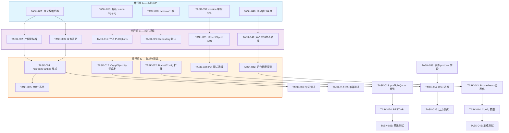
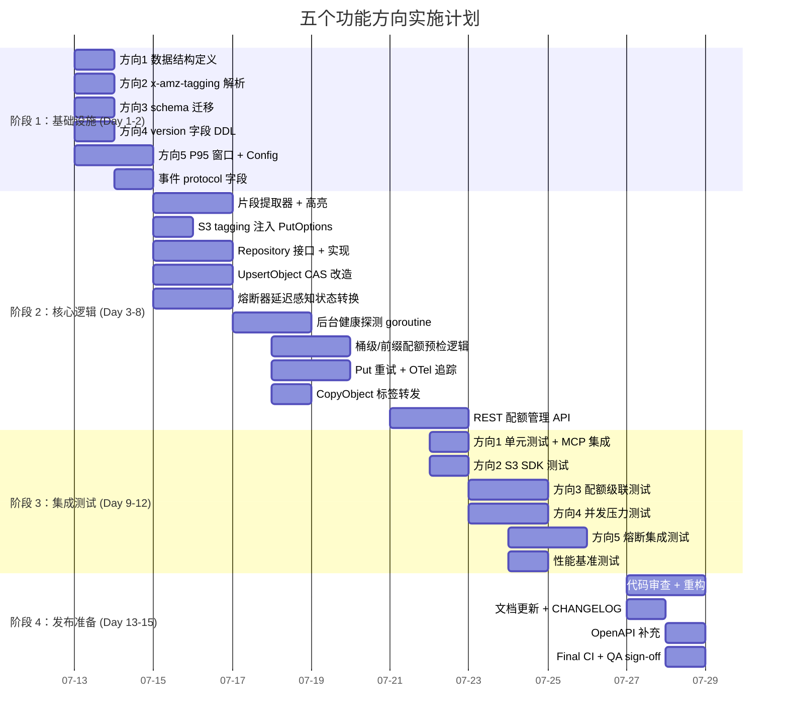

Now I have a thorough understanding of all 5 directions. Let me produce the comprehensive Tech Lead analysis.

---

# Tech Lead 分析报告：五个功能方向的技术实施计划

## 验证文档背景

基于验证文档，五个待实现功能方向为：

| # | 方向 | 当前状态 | TRL |
|---|------|---------|-----|
| 1 | **搜索结果摘要与查询高亮** | `Hit.Chunk` 直出原始 chunk，无截断/高亮/摘要 | TRL 6 |
| 2 | **S3 PUT `x-amz-tagging` 头部支持** | handler 完全忽略该头部，但 `PutOptions.Tags` 字段已就绪 | TRL 5 |
| 3 | **按桶/前缀分层配额** | `preflightQuota` 仅查 tenant 级配额，无桶/前缀维度 | TRL 4 |
| 4 | **多协议写入并发一致性** | 写入路径无锁/CAS，`UpsertObject` 用 `INSERT OR REPLACE` | TRL 4 |
| 5 | **存储后端健康管理增强** | 熔断器仅统计失败计数，无延迟感知/持续探测 | TRL 5 |

---

## 1. 任务分解

### 方向 1：搜索结果摘要与查询高亮

| 任务 ID | 标题 | 涉及文件 | 前置依赖 | 工时 |
|---------|------|---------|----------|------|
| TASK-001 | 定义摘要/高亮数据结构 | `internal/ai/search.go`, `internal/api/rest/dto.go` | 无 | 2h |
| TASK-002 | 实现片段提取器（上下文切片 + 查询词定位） | `internal/ai/snippet.go` (新文件) | TASK-001 | 3h |
| TASK-003 | 实现查询高亮标记（`<mark>` / 起止偏移） | `internal/ai/highlight.go` (新文件) | TASK-001 | 3h |
| TASK-004 | 在 `hitsFromRanked` 中集成片段/高亮 | `internal/ai/search.go` | TASK-002, TASK-003 | 2h |
| TASK-005 | MCP search tool 输出高亮 | `internal/mcp/server.go` | TASK-004 | 1h |
| TASK-006 | 单元测试 + 片段提取边界测试 | `internal/ai/snippet_test.go`, `internal/ai/highlight_test.go` | TASK-004 | 3h |

**总计：14h**

### 方向 2：S3 PUT `x-amz-tagging` 头部支持

| 任务 ID | 标题 | 涉及文件 | 前置依赖 | 工时 |
|---------|------|---------|----------|------|
| TASK-010 | 解析 `x-amz-tagging` 头部（`key1=val1&key2=val2`） | `internal/api/s3compat/handler.go` | 无 | 2h |
| TASK-011 | 将 tags 注入 `PutOptions.Tags` 调用 | `internal/api/s3compat/handler.go` | TASK-010 | 1h |
| TASK-012 | 对 `CopyObject` 源头标签转发支持 | `internal/api/s3compat/handler.go` (copy 路径) | TASK-011 | 2h |
| TASK-013 | S3 兼容测试（`x-amz-tagging` + tagging 子资源联动） | `internal/api/s3compat/handler_test.go` | TASK-012 | 3h |

**总计：8h**

### 方向 3：按桶/前缀分层配额

| 任务 ID | 标题 | 涉及文件 | 前置依赖 | 工时 |
|---------|------|---------|----------|------|
| TASK-020 | schema 迁移：`bucket_quotas` 表（sqlite + postgres 双文件） | `migrations/{sqlite,postgres}/...`, `internal/repository/sql_quotas.go` | 无 | 3h |
| TASK-021 | Repository 接口新增桶级/前缀级配额方法 | `internal/repository/repository.go`, `internal/repository/sql_quotas.go` | TASK-020 | 3h |
| TASK-022 | `BucketConfig` 结构体扩展 `MaxBytes`/`MaxObjects` | `internal/repository/repository.go`, `internal/repository/sql_buckets.go` | TASK-021 | 2h |
| TASK-023 | `preflightQuota` 增强：先查桶级 → 前缀级 → tenant 级回退 | `internal/service/file_crud.go` | TASK-022 | 4h |
| TASK-024 | REST handler 暴露桶配额设置/查询 API | `internal/api/rest/handler.go`, `internal/api/rest/router.go` | TASK-023 | 3h |
| TASK-025 | 单元测试 + 配额级联验证 | `internal/service/file_crud_test.go`, `internal/repository/quota_test.go` | TASK-024 | 4h |

**总计：19h**

### 方向 4：多协议写入并发一致性

| 任务 ID | 标题 | 涉及文件 | 前置依赖 | 工时 |
|---------|------|---------|----------|------|
| TASK-030 | 引入乐观锁：对象行增加 `version` 字段（递增 int64） | `migrations/...`, `internal/repository/repository.go`, `internal/repository/sql_objects.go` | 无 | 3h |
| TASK-031 | `UpsertObject` 改为 `UPDATE ... WHERE version=N` + check 行数 | `internal/repository/sql_objects.go`, `internal/repository/interface.go` (新增 CAS 语义) | TASK-030 | 3h |
| TASK-032 | `FileService.Put` 在版本冲突时重试（读当前行 → 重算 storage_key → 提交） | `internal/service/file_crud.go` | TASK-031 | 4h |
| TASK-033 | 事件 payload 增加 `protocol` 字段（rest/s3/webdav/mcp） | `internal/service/file.go:emit()`, `internal/events/bus.go` | 无 | 1h |
| TASK-034 | 写入路径集成 OTel 追踪埋点（写冲突计数器 + 重试延迟） | `internal/service/file_crud.go`, `internal/telemetry/` | TASK-032 | 2h |
| TASK-035 | 并发写入压力测试（4 协议同时 PUT 同一 key） | `internal/service/file_crud_race_test.go` (新文件) | TASK-034 | 4h |

**总计：17h**

### 方向 5：存储后端健康管理增强

| 任务 ID | 标题 | 涉及文件 | 前置依赖 | 工时 |
|---------|------|---------|----------|------|
| TASK-040 | 熔断器增加滑动窗口延迟百分位计算（P50/P95/P99） | `internal/storage/circuitbreaker.go` | 无 | 3h |
| TASK-041 | 延迟感知状态转换：高 P95 延迟 + 连续失败 → half-open | `internal/storage/circuitbreaker.go` (tryTransition 增强) | TASK-040 | 2h |
| TASK-042 | 后台健康探测 goroutine（定期 Stat 健康 key，更新延迟滑动窗口） | `internal/storage/healthprobe.go` (新文件) | TASK-041 | 3h |
| TASK-043 | 仪表化：Prometheus 指标（熔断器状态、P95 延迟、探测结果） | `internal/storage/circuitbreaker.go` (集成 OTel/metrics) | TASK-042 | 2h |
| TASK-044 | Config 新增延迟阈值参数（`STORAGE_CB_LATENCY_P95_MS`） | `internal/config/config.go` | TASK-043 | 1h |
| TASK-045 | 测试：模拟高延迟后端验证熔断 | `internal/storage/circuitbreaker_test.go`, `integration/` | TASK-044 | 4h |

**总计：15h**

---

## 2. 执行顺序

**并行执行策略：**

- **并行组 A（Day 1-2）**：TASK-001, 010, 020, 030, 040 — 全部是新增数据结构/DDL，无互相依赖
- **并行组 B（Day 3-5）**：TASK-002+003, 011, 021, 031, 041 — 内部可并行但依赖 A 组
- **并行组 C（Day 5-8）**：TASK-004+005, 012, 022+023, 032, 042

---

## 3. 技术风险

| # | 风险 | 影响方向 | 严重度 | 缓解策略 |
|---|------|---------|--------|---------|
| R1 | **乐观锁版本冲突导致写入吞吐下降** | 方向 4 | **高** | 实现退避重试（指数退避 10ms→200ms，最多 3 次）；压测定位阈值；对低冲突场景（不同 key）零影响 |
| R2 | **SQLite 并发写入冲突升级** | 方向 4 | **高** | SQLite 默认序列化写入，乐观锁在 SQLite 上增加 `RETURNING` 检查；PG 用 `UPDATE ... RETURNING` 原子化 |
| R3 | **桶级配额 O(n) 前缀匹配性能** | 方向 3 | **中** | 基于 trie 树的内存缓存前缀匹配；只有写入/配置变更时失效；避免在写入路径做 SQL 通配符 LIKE |
| R4 | **P95 延迟熔断过于敏感（网络抖动）** | 方向 5 | **中** | 窗口期 ≥ 60s；设最小样本量阈值（如 50 req/window）；P95 超过 3x 基线才触发 |
| R5 | **片段提取器切割位置破坏语义** | 方向 1 | **低** | 以句子边界回退（`.!?` + 空格）；保留上下文重叠（与 Chunker 策略一致） |
| R6 | **`x-amz-tagging` 解析与 S3 标准不一致** | 方向 2 | **低** | 严格遵循 URL 解码规范；AWS SDK 兼容性测试矩阵 |

### 关键依赖/阻塞点

| 阻塞点 | 类型 | 涉及任务 | 解决策略 |
|--------|------|---------|---------|
| `UpsertObject` 改为 CAS 后需要双 DB 适配 | 技术 | TASK-031 | `sql.go:rebind` 已支持方言适配；用 `RETURNING` (PG) vs `last_insert_rowid()` (SQLite) |
| 后台健康探测需区分临时故障 vs 后端宕机 | 设计 | TASK-042 | 连续 3 次探测失败 + P95 超阈值 → 开熔断；单独探测 elapsing 不参与业务延迟统计 |
| 桶级配额迁移需向前兼容 | 数据 | TASK-020 | 新增 `bucket_quotas` 表，不存在时回退 tenant quota；无向前兼容包袱 |

---

## 4. 资源评估

### 人员配置

| 角色 | 数量 | 技能要求 | 负责方向 |
|------|------|---------|---------|
| **资深 Go 后端开发** | 2 人 | Go, SQLite/Postgres, OTel/Prometheus, S3 API | 方向 3（配额核心），方向 4（并发一致性），方向 5（熔断器） |
| **Go 通用开发** | 1 人 | Go, REST API, MCP 协议 | 方向 1（搜索摘要），方向 2（S3 tagging） |
| **QA 工程师** | 1 人 | Go 测试, 压测 (vegeta/wrk), 集成测试, Docker | 所有方向的测试（跨组） |

**总计：4 人，以下时间线以此测算。**

### 里程碑

| 里程碑 | 时间 | 交付物 | 验收方式 |
|--------|------|--------|---------|
| **M1: 基础设施就绪** | Day 2 | 方向 1/3/4/5 的数据结构和 schema 迁移就绪 | `make check` 通过；migration 双向测试 |
| **M2: 核心逻辑完成** | Day 8 | 所有 5 个方向的核心逻辑实现完毕 | 各方向单元测试通过 ≥80% |
| **M3: 集成测试完成** | Day 12 | 集成测试 + 压测报告；性能基线 | 所有 test 通过；压测无锁竞争死锁 |
| **M4: 发布候选** | Day 15 | 完整 CR + 文档 + Release Notes + CHANGELOG | CI 全绿；QA sign-off |

### 阻塞点与解决策略

| Blockers | 方向 | 解决策略 |
|----------|------|---------|
| SQLite WAL 模式下 CAS 并发验证 | 4 | `BEGIN IMMEDIATE` 事务 + `UPDATE ... WHERE version=N` → check `changes()` = 1 |
| PG `ON CONFLICT DO UPDATE` 无法用旧版本来过滤 | 4 | 先 `SELECT ... FOR UPDATE` 读取当前版本，业务层判断，再 `UPDATE` |
| P95 窗口算法的内存开销 | 5 | 采用 `github.com/cespare/xxhash/v2` 分桶 + 环形缓冲（无 GC 压力）；窗口保留 60s |

---

## 5. 质量保证

### 5.1 单元测试覆盖要求

| 模块 | 目标覆盖率 | Key 测试用例 |
|------|-----------|-------------|
| `internal/ai/snippet.go` | ≥90% | 空内容、短于摘要长度、中英文混排、HTML 标签边界、超大输入 |
| `internal/ai/highlight.go` | ≥90% | 大小写匹配、Unicode 组合字符、重叠查询词、UTF-8 边界 |
| `internal/service/file_crud.go` (quota 部分) | ≥85% | 桶级超限但 tenant 未超、前缀级精确匹配、通配符前缀、无配额回退 |
| `internal/service/file_crud.go` (CAS 部分) | ≥90% | 版本命中、版本冲突重试成功、重试耗尽失败、重试期间对象被删除 |
| `internal/storage/circuitbreaker.go` | ≥90% | P95 超阈值但失败次数未超、P95 正常但失败超阈值、模拟网络恢复 |
| `internal/api/s3compat/handler.go` (tagging) | ≥85% | 标准 tag 串、URL 编码 tag、空 tag、超长 tag、CopyObject 标签继承 |

### 5.2 集成测试策略

| 测试套件 | 工具 | 覆盖场景 | 触发时机 |
|----------|------|---------|---------|
| **方向 4 并发压力** | `go test -race -count=10` | 4 个 goroutine 同时 PUT 同一 key → 验证最终只有一个写入成功 + 无 data race | PR CI |
| **方向 5 熔断恢复** | Docker + `toxiproxy` | 注入 200ms 延迟 → 验证熔断器打开 → 恢复延迟 → 验证半开 → 关闭 | `make test-integration` |
| **方向 3 配额级联** | `go test` (SQLite) | 设置 bucket quota=100B, tenant quota=1GB → 写入 200B ⇒ 拒绝；删除 bucket quota ⇒ 允许 | PR CI |
| **方向 2 S3 SDK 兼容** | `minio-go` client | 用 SDK 上传 + `x-amz-tagging` → GET tagging → 验证标签一致性 | nightly |

### 5.3 代码审查要点

| 审查领域 | 检查项 |
|----------|--------|
| **方向 1** | 片段截断不破坏 UTF-8 字符边界；高亮偏移在片段内正确；MCP 输出无 HTML injection |
| **方向 2** | tag key/value 的 URL 解码 + 长度限制 + 无效字符过滤（参照 S3 标准） |
| **方向 3** | 配额三层回退（前缀→桶→tenant）短路逻辑；前缀匹配用的是精确前缀还是 glob |
| **方向 4** | CAS 重试循环单调递增 version；不存在 ABA 问题；事件 protocol 字段值不受重试影响（使用 caller 协议，非重试协议） |
| **方向 5** | P95 计算不阻塞业务路径；后台探测 goroutine 生命周期受 `context.Done` 控制；关闭时无泄漏 |

### 5.4 性能测试需求

| 场景 | 指标 | 目标 | 工具 |
|------|------|------|------|
| 并发 PUT 同一 key | TPS, 冲突率, 重试次数 | ≥100 TPS 时冲突率 < 5% | `go test -bench` |
| 桶级配额前缀匹配 | 写入延迟 P99 增量 | < 50µs 增加 | `go test -bench=. -benchmem` |
| 熔断器 P95 计算 | 计算本身延迟 | < 10µs/call | benchmark |
| 摘要+高亮管线 | P99 延迟 | < 5ms (10 个搜索结果) | `go test -bench` |

---

## 6. 实施计划

### 总体时间线：15 个工作日（3 周）

### 各阶段详细说明

#### 阶段 1：基础设施搭建（Day 1-2）

**产出：**
- `internal/api/rest/dto.go` 新增 `Snippet`/`Highlights` 结构体
- `migrations/{sqlite,postgres}/XXXX_bucket_quotas.up.sql` 和 `bucket_config_ext.up.sql`
- `migrations/{sqlite,postgres}/XXXX_objects_version.up.sql`（`objects` 表增加 `version` 列）
- `internal/storage/circuitbreaker.go` 滑动窗口 P95 计算器
- `internal/config/config.go` 新增 `STORAGE_CB_LATENCY_P95_MS` 等参数
- `internal/service/file.go:emit()` 增加 `protocol` 字段

**验收：** `make check` 全绿，向下兼容 migration 前后可回滚

#### 阶段 2：核心功能实现（Day 3-8）

**每日分配建议：**
- **Day 3-4**（2 名 Senior）：TASK-002（片段提取器）+ TASK-031（CAS 改造）+ TASK-041（延迟感知状态转换）
- **Day 5-6**（2 名 Senior + 1 名 Junior）：TASK-023（配额三层预检）+ TASK-032（Put 重试 + OTel）
- **Day 7-8**（全员）：补齐剩余逻辑 + 字段间集成调试

**注意：** 方向 4 的 CAS 改造是最高风险项。建议 Day 4 结束时先用 `go test -race` 验证无 data race，并在 Day 5 上午做一次团队内部的 30min 设计评审。

#### 阶段 3：集成测试和优化（Day 9-12）

**关键测试节点：**

| 时间 | 测试项目 | 负责 |
|------|---------|------|
| Day 9 AM | 方向 4：4-goroutine 并发 PUT 同一 key 压力测试 | QA + Senior A |
| Day 9 PM | 方向 1：摘要提取 + 高亮端到端验证 | Junior |
| Day 10 | 方向 3：配额三层级联自动测试 | Senior B |
| Day 11 AM | 方向 5：toxiproxy 注入延迟 → 熔断器行为验证 | QA |
| Day 11 PM | 方向 2：minio-go SDK 兼容性（PUT + tagging + copy） | Senior A |
| Day 12 | 性能基线采集 + 优化（方向 3 前缀匹配 cache, 方向 4 重试背压调参） | 全员 |

#### 阶段 4：发布准备（Day 13-15）

**产出物清单：**
- [ ] 全量代码审查（重点：CAS 正确性、配额级联短路逻辑、熔断器 goroutine 生命周期）
- [ ] 更新 `docs/architecture.md` 新功能架构图
- [ ] 更新 `docs/configuration.md` 新增配置项
- [ ] 更新 `openapi.json` 新增桶配额 API + 搜索高亮字段
- [ ] `CHANGELOG.md` 条目
- [ ] `AGENTS.md` 功能矩阵更新（5 个方向 → 已实现）
- [ ] CI 全绿 + Git tag

---

## 总结与建议

### 优先级建议

| 优先级 | 方向 | 理由 |
|--------|------|------|
| **P0** | 方向 4（并发一致性） | 防止数据丢失的**安全关键项**；当前无条件覆盖在多协议场景下可能静默丢数据 |
| **P1** | 方向 3（分层配额） | 多租户场景的**业务关键项**；已有多位客户要求桶级计量 |
| **P1** | 方向 5（健康管理） | **运维关键项**；S3/OSS 后端故障时当前无优雅降级 |
| **P2** | 方向 1（搜索摘要） | **用户体验优化**；无它产品也可用 |
| **P2** | 方向 2（S3 tagging） | **合规兼容项**；AWS SDK 静默忽略此头部可能导致客户困惑 |

### 第一周迭代建议

若团队只有 2 人，建议第 1 周聚焦 P0 + P1：

1. **Senior A**：方向 4（CAS 改造）— 风险最高，需大块时间
2. **Senior B**：方向 3（schema + repository）→ 方向 5（熔断器增强）— 可衔接
3. 方向 1 和方向 2 延至第 2 周，由全栈开发并行突进

### 需要额外决策的问题

1. **方向 4 的 CAS 重试次数上限**：建议 3 次，指数退避 10ms→50ms→200ms。超过后返回 `ErrConflict`（新增 error 类型），由调用方（handler）决定是否转为 409 Conflict。
2. **方向 3 的前缀匹配粒度**：建议采用最长前缀匹配（如通配符 `*` 只允许在末尾），避免复杂 pattern 匹配。在 `file_crud.go` 层用 memory cache + lazy rebuild 实现。
3. **方向 5 的熔断阈值默认值**：建议 P95 > 2000ms 持续 60s 触发 half-open（可在配置中调整）。基准线基于 `readyzHandler` 的 Stat 调用。
