现在我已充分理解代码库。以下是全面的技术负责人分析。

---

# 技术负责人分析：架构盲区修复计划

## 1. 任务分解

我已将每个方向分解为可在 2–4 小时内完成的工作单元。每个任务具有明确的文件范围、前置依赖项和验收标准。

### 方向一：版本膨胀（P0 — Sprint N）

| 任务编号 | 标题 | 文件 | 前置依赖 | 工时 |
|----------|---------|-------|--------|------|
| TASK-001 | 添加 `BucketConfig.MaxVersions` 和 `NoncurrentDays` | `internal/repository/repository.go`（类型定义）；`internal/repository/sql_buckets.go`（迁移 + CRUD） | — | 3h |
| TASK-002 | 写入迁移文件（SQLite + Postgres）用于 `bucket_configs` 和 `object_version_retention` | `internal/repository/migrations/{sqlite,postgres}/XXXX_*.{up,down}.sql` | TASK-001 | 2h |
| TASK-003 | 在 `InsertObjectVersion` 中实现非当前版本淘汰 | `internal/repository/sql_objects.go`（`InsertObjectVersion` 末尾添加清理子句）；`internal/repository/sql.go`（新增查询，可选） | TASK-002 | 3h |
| TASK-004 | 为 `ListVersions` REST 端点添加分页 | `internal/service/file_features.go`（新增 `ListVersionsWithOpts`）；`internal/api/rest/router.go`（注册 `?limit&marker` 参数）；`internal/api/rest/response.go`（分页响应包装器） | TASK-001 | 3h |
| TASK-005 | 添加 `NoncurrentDays` 生命周期规则 | `internal/reconcile/lifecycle.go`（`sweepExpired` 分支处理非当前版本）；`internal/repository/sql_objects.go`（`ListNoncurrentExpired` 查询） | TASK-001 | 3h |
| TASK-006 | 在 `BucketConfig` 中添加 `MaxVersions` 并通过 S3 API 公开 | `internal/api/s3compat/xml.go`（S3 版本控制 XML 中添加 `MaxVersions` 字段）；`internal/api/s3compat/bucketconfig.go`（`putBucketVersioning` 解析）；不直接支持 S3，使用自定义扩展 | TASK-001 | 2h |
| TASK-007 | 连接 `main.go` 中的生命周期清理调度器 | `cmd/server/main.go`（将 `LifecycleJob` 连接到 `NoncurrentDays` 区域）；`internal/config/config.go`（如需要，新增配置） | TASK-005 | 2h |

### 方向二：上下文窗口溢出（P1 — Sprint N+1）

| 任务编号 | 标题 | 文件 | 前置依赖 | 工时 |
|----------|---------|-------|--------|------|
| TASK-008 | 添加 `AI_MAX_CONTEXT_TOKENS` 配置 + `ChatReq.MaxContextTokens` | `internal/config/config_ai.go`（添加字段）；`internal/ai/chat.go`（`ChatReq` 添加字段 + `Chat` 结构体添加默认值） | — | 2h |
| TASK-009 | 向 `LLM` 接口添加 Tokenizer 或近似 Token 计数 | `internal/ai/llm.go`（可选 `TokenCount(string) int`）；或实现基于回退的近似计数器（每 4 个字符约 1 个 token） | — | 3h |
| TASK-010 | 在 `buildChatPrompt` 中添加上下文预算强制执行 | `internal/ai/chat.go`（`buildChatPrompt`：迭代命中内容，累加 token，达到预算时截断；如果 0 个命中内容添加 budget，则返回错误） | TASK-008, TASK-009 | 4h |
| TASK-011 | 向 `Search` 添加 `MinScore` 相关性阈值 | `internal/ai/search.go`（添加 `MinScore float32`；在 `Query` 结果中过滤掉低分命中内容）；`internal/ai/chat.go`（在 `buildChatPrompt` 中使用） | TASK-008 | 3h |
| TASK-012 | 向 `Agent.Run` 添加上下文预算限制 | `internal/ai/agent.go`（跟踪 `messages` 中的总 token 数；在超过预算时强制结束循环） | TASK-008, TASK-009 | 3h |
| TASK-013 | 在 ChatStream 事件序列中添加 `context_overflow` 事件 | `internal/api/rest/chat.go`（在 token 计数截断时发送 `event: info\ndata: {"truncated":true,"total_tokens":N}\n\n`） | TASK-010 | 2h |

### 方向三：文件系统配额（P0 — Sprint N）

| 任务编号 | 标题 | 文件 | 前置依赖 | 工时 |
|----------|---------|-------|--------|------|
| TASK-014 | 将配额检查从“尽力而为”升级为“硬性强制” | `internal/service/file_crud.go`（`preflightQuota`：在 `qErr != nil` 时返回 `ErrQuotaUnavailable`，而非 nil）；`internal/service/errors.go`（添加 `ErrQuotaUnavailable`） | — | 2h |
| TASK-015 | 在存储写入周围添加事务性配额保留 | `internal/service/file_crud.go`（`Put` 中：在 `store.Put` 之前保留配额，在 `writePutObject` 中提交；回滚释放）；`internal/repository/sql_quota.go`（添加 `ReserveQuota`/`ReleaseQuotaReservation`） | TASK-014 | 4h |
| TASK-016 | 将配额检查添加到 `PresignPut` | `internal/service/file_features.go`（`PresignPut` 中添加 `preflightQuota` 检查）；`internal/api/rest/presign.go`（可选：在预签名 URL 的有效载荷中添加配额声明） | TASK-014 | 2h |
| TASK-017 | 向 `Storage` 接口添加磁盘容量 API | `internal/storage/storage.go`（添加 `Capacity(ctx) (free, total int64, err error)`）；`internal/storage/local_*.go`（Linux 上的 `syscall.Statfs` 实现）；`internal/storage/s3.go` 等（返回 -1，表示不受支持） | — | 3h |
| TASK-018 | 向 `BucketConfig` 添加 `PerTenantDiskLimit` 并在硬件容量限制之上强制执行 | `internal/config/config_storage.go`（可选：`STORAGE_PER_TENANT_DISK_LIMIT`）；`internal/service/file_crud.go`（`Put` 中结合配额 + 容量的检查） | TASK-017 | 3h |
| TASK-019 | 将 `AddTenantUsage` 移到事务中，以消除 TOCTOU | `internal/service/file_crud.go`（重构 `writePutObject`：在单个事务中合并 version/upsert + usage 更新）；`internal/repository/sql_objects.go`（添加 `UpsertObjectAndUsage` 组合方法） | TASK-014 | 4h |

### 方向四：重建索引进度（P2 — Sprint N+2）

| 任务编号 | 标题 | 文件 | 前置依赖 | 工时 |
|----------|---------|-------|--------|------|
| TASK-020 | 添加 `ReindexProgress` 结构体和 `Indexer` 进度字段 | `internal/ai/indexer.go`（添加 `Progress` 字段：`total/completed/failed/canceled` + `sync.RWMutex`；添加 `Progress()`/`Cancel()` 方法） | — | 3h |
| TASK-021 | 向 `ReindexStale` 添加进度报告 | `internal/ai/indexer.go`（`ReindexStale` 中：每 N 个对象后更新 `Progress`；检查 `canceled` 标志） | TASK-020 | 2h |
| TASK-022 | 添加 `GET /v1/admin/reindex/progress` + `POST /v1/admin/reindex/cancel` 路由 | `internal/api/rest/router.go`（注册路由）；`internal/api/rest/admin.go`（处理程序）；`internal/service/file_admin.go`（将 Indexer 的进度暴露到服务层） | TASK-021 | 3h |
| TASK-023 | 将 `startReindexOnStartup` 与全局上下文挂钩，以便优雅关闭中断它 | `cmd/server/main.go`（将 `ctx` 传递给重建索引；监听关闭信号）；`internal/ai/indexer.go`（尊重 `ctx.Done()`） | TASK-021 | 2h |

### 方向五：存储桶位置（P3 — Sprint N+3）

| 任务编号 | 标题 | 文件 | 前置依赖 | 工时 |
|----------|---------|-------|--------|------|
| TASK-024 | 添加 `S3_REGION` / `S3_BUCKET_LOCATION` 配置 | `internal/config/config_app.go`（`S3CompatConfig` 中添加 `Region string`）；`internal/config/config.go`（`Load` 中解析） | — | 1h |
| TASK-025 | 填充 `getBucketLocation` 响应中的 `Location` 字段 | `internal/api/s3compat/bucketconfig.go`（`getBucketLocation`：从配置读取区域，填充 `Location`）；`internal/api/s3compat/handler.go`（将配置传递给 `Handler`） | TASK-024 | 1h |
| TASK-026 | 更新 `TestBucketLocation` 以断言正确的 `Location` 值 | `internal/api/s3compat/bucketconfig_test.go`（添加区域断言，使用模拟配置） | TASK-025 | 1h |
| TASK-027 | 将 `S3_REGION` 挂接到 SigV4 签名验证（可选：`us-east-1` 仍然是可接受的默认值） | `internal/api/s3compat/sigv4.go`（验证时使用配置区域作为默认值） | TASK-024 | 2h |

---

## 2. 执行顺序

```mermaid
graph TD
    subgraph "Sprint N: Version Bloat + FS Quota (P0)"
        T001["TASK-001: BucketConfig MaxVersions/NoncurrentDays"]
        T002["TASK-002: Migration files"]
        T003["TASK-003: Non-current version eviction"] 
        T004["TASK-004: ListVersions pagination"]
        T005["TASK-005: NoncurrentDays lifecycle"]
        T006["TASK-006: S3 MaxVersions API"]
        T007["TASK-007: main.go lifecycle wiring"]
        
        T014["TASK-014: Hard quota enforcement"]
        T015["TASK-015: Transactional quota reserve"]
        T016["TASK-016: PresignPut quota check"]
        T017["TASK-017: Storage capacity API"]
        T018["TASK-018: PerTenantDiskLimit"]
        T019["TASK-019: Fix TOCTOU in AddTenantUsage"]

        T001 --> T002 --> T003
        T001 --> T005
        T003 --> T004
        T005 --> T007
        T006 --> T007
        
        T014 --> T015 --> T019
        T014 --> T016
        T017 --> T018
        T015 --> T019
    end

    subgraph "Sprint N+1: Context Window (P1)"
        T008["TASK-008: AI_MAX_CONTEXT_TOKENS config"]
        T009["TASK-009: Token counter impl"]
        T010["TASK-010: Context budget enforcement"]
        T011["TASK-011: MinScore threshold"]
        T012["TASK-012: Agent context limit"]
        T013["TASK-013: Stream truncation event"]

        T008 --> T010
        T009 --> T010
        T008 --> T012
        T009 --> T012
        T010 --> T011
        T010 --> T013
    end

    subgraph "Sprint N+2: Reindex Progress (P2)"
        T020["TASK-020: Progress struct + Indexer fields"]
        T021["TASK-021: Progress reporting in ReindexStale"]
        T022["TASK-022: Admin API routes"]
        T023["TASK-023: Graceful shutdown"]

        T020 --> T021 --> T022
        T021 --> T023
    end

    subgraph "Sprint N+3: Bucket Location (P3)"
        T024["TASK-024: S3_REGION config"]
        T025["TASK-025: Fill Location field"]
        T026["TASK-026: Fix location test"]
        T027["TASK-027: SigV4 region wiring"]

        T024 --> T025 --> T026
        T024 --> T027
    end

    %% 跨 sprint 依赖性
    T005 -.->|共享受限 bucket_configs 模式| T001
    T015 -.->|共用事务性重写区域| T019
    
    style T001 fill:#f96
    style T014 fill:#f96
    style T008 fill:#9cf
    style T020 fill:#9f9
    style T024 fill:#fc9
```



### 可并行执行的任务组

| 并行组 | 任务 | 理由 |
|--------------|------|---------|
| **组 A** | T001, T014, T017 | 无文件重叠；三个方向的基础设施 |
| **组 B** | T002, T016, T018 | 迁移（组 A 完成后）、预签名配额（独立）、磁盘限制（T017 完成后） |
| **组 C** | T008, T009, T020, T024 | 全部分离的配置/基础设施；在 sprint N+1 之前无文件冲突 |
| **组 D** | T022, T026, T027 | 独立的测试/路由任务，依赖于各自方向的 T021/T025 |

---

## 3. 技术风险

### 3.1 版本膨胀

| 风险 | 影响 | 缓解措施 |
|------|--------|-------------|
| **存储键冲突**：通过追加 `@v<id>` 对版本化存储键进行编码。针对非当前版本的淘汰清理必须使用精确的键匹配，而非反向解析，否则可能会删除活跃对象。 | 数据丢失 | 清理过程必须使用由 `ListNoncurrentExpired` 返回的、与活跃对象相同的 `StorageKey` 值。添加一个 `<storage_key, id>` 确认查询，检查该键是否仍被任何活跃行引用。（`repository.go` 中的 `StorageKeyReferenced` 已存在。） |
| **迁移向后兼容性**：添加 `MaxVersions` 列需要一个默认值（0 = 不受限制），以便现有存储桶在迁移后继续工作，其行为与迁移前一致。 | 部署期间静默行为改变 | `ALTER TABLE bucket_configs ADD COLUMN max_versions INTEGER NOT NULL DEFAULT 0`。迁移检查 0 意味着“无限制”。 |
| **大型现有存储桶的清理延迟**：一个拥有 10 万个版本的存储桶会给首次清理带来压力。 | 首次运行的 OOM/latency | 在 `sweepExpired` 中分批处理：`LIMIT 100`，在每次间隔内进行多次循环。配置 `MAX_DELETIONS_PER_CYCLE`。 |

### 3.2 上下文窗口溢出

| 风险 | 影响 | 缓解措施 |
|------|--------|-------------|
| **Token 计数不精确**：基于字符的近似值与 LLM 使用的实际 BPE tokenizer 不匹配。 | 上下文因过于激进而被截断，或窗口未被填满 | 使用保守的比率（每 2 个字符约 1 个 token 用于中文/日文/韩文，每 4 个字符约 1 个 token 用于拉丁文）。提供可插拔的 `TokenCounter` 接口，以允许 LLM 特定的 tokenizer。 |
| **LLM 供应商 tokenization 差异**：OpenAI、Anthropic、Google 对 token 的定义不同。 | 截断值存在误差 | 将 `MaxContextTokens` 设置为供应商保证上下文窗口的 80%。这是行业标准的安全裕度。 |
| **Agent 工具结果超出预算**：`read_file` 可以返回 4KB 的文本。经过 4 个步骤，每个步骤返回一个 4KB 的文档，仅一个步骤就可能消耗 1K+ tokens。 | Agent 过早截断 | 在将工具结果显示追加到消息历史之前，根据 token 预算对其进行修剪。设置每个工具结果的最大长度限制。 |

### 3.3 文件系统配额

| 风险 | 影响 | 缓解措施 |
|------|--------|-------------|
| **因配额不可用而拒绝写入**：如果数据库在 `preflightQuota` 期间宕机（从“静默跳过”变为“硬拒绝”），所有 PUT 操作将失败。 | 写入停机 | 添加断路逻辑：如果配额检查连续失败次数超过 N 次，则回退到“允许”（skip-on-error），并记录告警指标。这是对 #AGENTS.md 中“best-effort enforcement”默认值的审慎让步。 |
| **磁盘容量 API 不可移植**：`syscall.Statfs` 在 Linux 上有效，但在 macOS、Windows 或网络文件系统上可能因语义不同而失败。 | 非 Linux 部署中此功能被禁用 | 静默返回 `(-1, -1, nil)` = “未知”，以便调用方自然忽略它。 |
| **事务性保留导致死锁**：在写入之前保留配额行，在提交之前持有锁。 | 并发写入导致死锁 | 使用带有重试循环的无锁乐观并发控制（`UPDATE quota SET reserved = reserved + $size WHERE reserved + $size <= max_bytes`）。Postgres 可序列化隔离 + 重试。 |

### 3.4 重建索引进度

| 风险 | 影响 | 缓解措施 |
|------|--------|-------------|
| **具有进度结构的并发竞态**：如果 `ReindexStale` 和 `Progress()` 调用同时访问相同的字段，且没有适当的同步措施。 | 损坏的读/写数据 | 在 `Indexer` 上使用 `sync.RWMutex`。`Progress()` 获取 RLock，`ReindexStale` 获取写锁。或者使用 `atomic.Int64` 处理简单计数器。 |
| **取消请求与进行中的嵌入操作**：无法中断正在进行的 LLM/嵌入 HTTP 调用。 | 取消后延迟终止 | 在每次迭代之间检查 `canceled` 标志。嵌入调用接受 `ctx`；取消上下文以中止正在进行的 HTTP 请求。 |
| **在重建索引期间点击“取消”后出现陈旧进度状态**：用户取消，进度状态被重置，但工作线程仍在后台运行。 | 进度显示不准确 | 取消后：设置 `canceled = true`，然后 `Progress()` 返回“canceling”状态。仅在工作线程确认退出后将状态重置为“idle”。 |

### 3.5 存储桶位置

| 风险 | 影响 | 缓解措施 |
|------|--------|-------------|
| **现有 S3 客户端在区域迁移期间损坏**：更改区域值可能会使期望特定区域的现有预签名 URL 或 S3 客户端失效。 | 客户端崩溃 | 这是低风险：区域值仅影响 `?location` 响应和 SigV4 签名字符串。在转换期间允许通过 `S3_LEGACY_REGION` 配置覆盖。 |
| **SigV4 测试使用硬编码的 `us-east-1`**：`sigv4_test.go` 中的 30+ 个测试使用硬编码区域。 | 如果默认区域更改，测试会崩溃 | 让测试继续使用 `us-east-1` 作为 fixture；不要更改测试。配置区域仅用于运行时验证。 |

---

## 4. 资源评估

### 人员配置

| 角色 | 所需人数 | Sprint N (P0) | Sprint N+1 | Sprint N+2 | Sprint N+3 |
|------|---------|---------------|------------|------------|------------|
| 高级 Go 后端工程师 | 2 | T001–T007（版本） + T014–T019（配额） | T008–T013 | T020–T023 | T024–T027 |
| 中级 Go 工程师 | 1 | T002, T004, T006（独立） | T009, T011, T013 | T022 | T026, T027 |
| 质量保证工程师 | 1 | 测试 + 代码审查 | 测试 + 代码审查 | 测试 | 测试 |

### 关键里程碑

| 里程碑 | 开发任务 | 估算日期（从冲刺开始） |
|----------|--------------|---------------------------|
| **M1**：版本淘汰功能完成 | T001–T003, T005, T007 | 第 5 天 |
| **M2**：配额硬性强制完成 | T014–T016, T019 | 第 5 天 |
| **M3**：版本 + 配额集成完成 | T004, T006, T017–T018 | 第 8 天 |
| **M4**：上下文预算完成 | T008–T013 | 第 8 天（Sprint N+1） |
| **M5**：重建索引进度完成 | T020–T023 | 第 5 天（Sprint N+2） |
| **M6**：存储桶位置完成 | T024–T027 | 第 3 天（Sprint N+3） |

### 阻塞点与解决策略

| 阻塞点 | 方向 | 解决方案 |
|---------|---------|----------|
| **无 BPE tokenizer**：标准库不包含 LLM tokenizer。 | 上下文窗口 | 从 `github.com/pkoukk/tiktoken-go`（Go tiktoken 绑定）引入依赖。或者实现基于回退的近似（每 4 个字符 1 个 token），这在短期内足够安全——参见 #AGENTS.md 中关于依赖的 I6：需要一个合理性论证，但这确实属于这种情况。 |
| **Linux 上的 `Statfs`**：需要 `golang.org/x/sys/unix`。 | FS 配额 | `x/sys` 已经是 Go 工具链的近标准依赖；20KB 的开销是可以接受的。在无法导入的平台上静默 fallback。 |
| **TOCTOU 修复**：由于每个特定后端的存储位置发生在此时间点之后，无法预先保留存储容量（写入完成时才有“实际”大小）。 | FS 配额 | 在存储写入后、但嵌入式数据库写入之前，使用 `AddTenantUsage` 的乐观锁定。实际上，TOCTOU 窗口非常小（写入的 RTT 是本地文件系统纳秒级的）。记录指标，不阻塞。 |

---

## 5. 质量保证

### 5.1 单元测试覆盖要求

| 任务 | 包 | 最低覆盖率 | 关键场景 |
|------|---------|----------------|-----------------|
| T003 淘汰 | `repository` | 80% | `InsertObjectVersion`，超过 `MaxVersions`；更新时删除准确的非当前版本；`MaxVersions=0`（不受限制） |
| T010 上下文预算 | `ai` | 85% | 在预算内完美适配；超过时截断；预算=0（不受限制）；所有命中均被移除时的空上下文块；对 LLM 的 `Chat` 调用不会因空上下文而失败 |
| T012 Agent | `ai` | 80% | Agent 在预算用尽前停止；超过预算后强制结束；工具结果根据预算被修剪 |
| T014 硬配额 | `service` | 90% | `preflightQuota`，当存储不可用时返回 `ErrQuotaUnavailable`；严格检查完全耗尽的情况 |
| T019 TOCTOU | `service` | 85% | 同时写入同一租户；在写入失败之前发生配额耗尽；并发写入下的乐观锁定重试 |
| T017 容量 | `storage` | 70% | 本地文件系统返回正确的值；S3 后端返回 (-1,-1)；磁盘已满时 PUT 失败 |
| T022 重建索引进度 | `ai` + `api/rest` | 80% | `Progress()` 返回正确的计数器；取消中断 `ReindexStale`；取消后再次调用进度 |

### 5.2 集成测试策略

| 测试套件 | 方向 | 方法 |
|-----------|---------|---------|
| 版本淘汰 | 版本膨胀 | 插入 25 个版本，`MaxVersions=10`，验证仅保留 10 个。检查旧 blob 是否已从存储中清理。 |
| 生命周期 NoncurrentDays | 版本膨胀 | 设置 `NoncurrentDays=1`，创建 2 个版本，推进时间。运行 `sweepExpired`，验证旧版本已被清理。 |
| 上下文预算 + 流 | 上下文窗口 | 使用 `MockLLM` + 短预算。验证 `buildChatPrompt` 返回有限数量的命中内容。检查流中发送了 `truncated` 事件。 |
| 并发 PUT + 配额 | FS 配额 | 启动 10 个协程，`MaxBytes`=100KB。验证恰好达到配额边界。检查无负数的 `UsedBytes`。 |
| 磁盘容量限制 | FS 配额 | 创建一个 1KB 的本地存储根目录。验证达到容量限制时的 `ErrQuotaExceeded`。 |
| 重建索引取消 | 重建索引进度 | 启动耗时较长的重建索引（使用慢速模拟嵌入器），发送取消请求，验证重建索引在 1 秒内停止。 |
| `?location` 区域值 | 存储桶位置 | 使用 `S3_REGION=eu-west-1` 创建服务器，发送 `GET /bucket?location`，验证 `<LocationConstraint>eu-west-1</LocationConstraint>`。 |

### 5.3 代码审查要点

每个方向需要关注的内容：

| 方向 | 审查重点 |
|----------|-------------------|
| **版本膨胀** | 存储键精确匹配 `I3`：清理中的反向路径。清理相关的死锁：双重表锁定。迁移不可变 `I2`：不修改已应用的文件。 |
| **上下文窗口** | 对 `buildChatPrompt` 的零回归：现有聊天必须继续使用默认 `MaxContextTokens=0`（不受限制）。`agent.go`：追加到 `messages` 必须尊重预算。 |
| **FS 配额** | TOCTOU 窗口仍然存在（但有所缩小）。存储到 repo 写入之间出现 Panic/panic：blob 成为孤儿。用于配额保留的乐观锁定：重试循环逻辑。 |
| **重建索引进度** | `ReindexStale` 内的 `sync.RWMutex`：持有写锁时不得调用外部回调。取消后的清理：没有 goroutine 泄漏。 |
| **存储桶位置** | XML 向后兼容性：现有的 `LocationConstraint` 消费者必须能处理其中包含文本的情况。 |

### 5.4 性能测试需求

| 测试 | 方向 | 方法 | 要求 |
|------|---------|---------|----------|
| 高频率 PUT 下的版本淘汰 | 版本膨胀 | 向一个存储桶执行 5 万个 PUT，`MaxVersions=3`。 | 清理后，`SELECT COUNT(*)` 必须约为 3 ×（唯一键数量）。每 PUT 的延迟增加不超过 2%。 |
| 长上下文聊天延迟 | 上下文窗口 | 发送带有 K=20 的 `ChatReq`，每个命中内容包含 500 个字符。预算=8000。 | `buildChatPrompt` 需要 <5ms。LLM 调用被排除在外（仅限提示构建）。 |
| 并发配额保留 | FS 配额 | 从 50 个协程调用 PUT，`MaxBytes=1GB`（不触发限制）。 | 通过率 = 100%。`UsedBytes` 在 0.1% 范围内准确。 |
| 长重建索引进度轮询 | 重建索引进度 | 重建索引 10 万个对象，每 100 个对象轮询一次 `/progress`。 | 轮询延迟 <1ms。进度值在 5% 范围内准确。 |
| `?location` 延迟 | 存储桶位置 | 每秒 1000 个 `GET /bucket?location` 请求。 | P99 < 5ms（无数据库命中，纯内存）。 |

---

## 6. 实施计划

### Sprint N — 版本膨胀 + 文件系统配额（10 个工作日，2 个工程师）

```
Day   1 ██ T001 T014 T017  — 基础设施（BucketConfig + 配额 + 容量）
Day   2 ██ T002 T016 T018  — 迁移 + 预签名 + 磁盘限制
Day   3 ██ T015 T019       — 事务性预留 + TOCTOU 修复
Day   4 ██ T003            — 版本淘汰核心逻辑
Day   5 ██ T005            — NoncurrentDays 生命周期
       --- M1: 版本淘汰功能完成 ---
       --- M2: 配额硬性强制完成 ---
Day   6 ██ T004 T006       — ListVersions 分页 + S3 MaxVersions API
Day   7 ██ T007            — main.go 生命周期连接
Day   8 ██ 集成测试        — 版本 + 配额组合测试
       --- M3: 版本 + 配额集成完成 ---
Day   9 ██ 性能测试 + 修复  — 高频率 PUT 基准测试
Day  10 ██ 文档 + 代码审查日
```

### Sprint N+1 — 上下文窗口溢出（6 个工作日，1 名工程师）

```
Day   1 ██ T008 T009       — Config + Tokenizer
Day   2 ██ T010            — 预算强制执行（核心逻辑）
       --- M4.1: 预算核心完成 ---
Day   3 ██ T011 T012       — MinScore + Agent 限制
Day   4 ██ T013            — 流事件
       --- M4: 上下文预算完成 ---
Day   5 ██ 集成测试        — 边界场景 + 并行编辑测试
Day   6 ██ 性能 + 文档
```

### Sprint N+2 — 重建索引进度（5 个工作日，1 名工程师）

```
Day   1 ██ T020            — 进度结构体 + 字段
Day   2 ██ T021            — 重建索引进度报告
Day   3 ██ T022 T023       — API 路由 + 优雅关闭
       --- M5: 重建索引进度完成 ---
Day   4 ██ 集成测试        — 取消 + 并发测试
Day   5 ██ 文档 + 最终审查
```

### Sprint N+3 — 存储桶位置（3 个工作日，1 名工程师）

```
Day   1 ██ T024 T025       — 配置 + 位置填充
Day   2 ██ T026 T027       — 测试 + SigV4 挂接
       --- M6: 存储桶位置完成 ---
Day   3 ██ 集成测试 + 文档
```

### 总计：所有冲刺共 24 个工作日，2 名全职工程师

### 总工作量估算

| 方向 | 总任务数 | 总工时 | 工程师周数 |
|---------|-----------|-----------|----------------|
| 版本膨胀 | 7 (T001–T007) | 18h | 2.25 |
| 上下文窗口 | 6 (T008–T013) | 17h | 2.125 |
| FS 配额 | 6 (T014–T019) | 18h | 2.25 |
| 重建索引进度 | 4 (T020–T023) | 10h | 1.25 |
| 存储桶位置 | 4 (T024–T027) | 5h | 0.625 |
| **总计** | **27** | **68h** | **8.5** |

在实际 sprint 规划中，考虑加上 30% 的开销用于测试、代码审查、会议和上下文切换（每个工程师每天约 5.5 个有效编码小时）。因此，Sprint N（10 天，2 名工程师）大约有 110 个可用小时，覆盖了 P0 方向所需的约 36 个小时——留有充足的时间用于集成测试和润色。

---

## 摘要与执行层建议

1. **从 Sprint N 开始，优先处理 P0 方向**。在实施两个 P0 方向后，存储直接成本（版本膨胀）和数据完整性风险（FS 配额）才能得到缓解。按照所描述的并行化方式，两名工程师可以在一个为期两周的 sprint 中完成这两者。

2. **上下文窗口（P1）风险较低但影响用户**。由于提示构建中包含了解析逻辑，它是有界的工作——没有新的依赖项，除了 tokenizer（可以使用替代方案）。最适合让一名工程师在 P0 完成后的一个为期一周的 sprint 中处理。

3. **重建索引进度（P2）和存储桶位置（P3）可以作为“快乐时光”式的工作**，由一名工程师融入日常工作中。两者都是完全独立的，不需要架构层面的决策。

4. **在合并前设置 CI 门控**（如 #AGENTS.md 中所述）。每个 task 分支都必须通过 `make check`（gofmt、build、vet、test）——针对 P0 功能的每个变更，都应运行最小的 `make test-unit` 测试套件。重建索引进度和存储桶位置变更应运行完整的测试套件。

5. **需要每个团队协调的一个跨领域问题**：`BucketConfig` 修改（T001）会创建多个方向共同依赖的共享表模式。在 Sprint N 的第 1 天就合并 T001，以消除所有并行分支中枯燥的合并冲突。

要我生成任何这些迁移文件的骨架代码，或开始实施特定任务，请告诉我。
