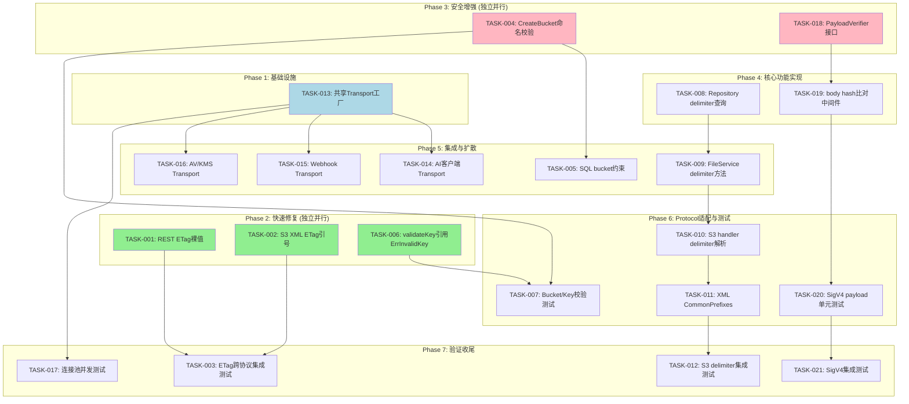
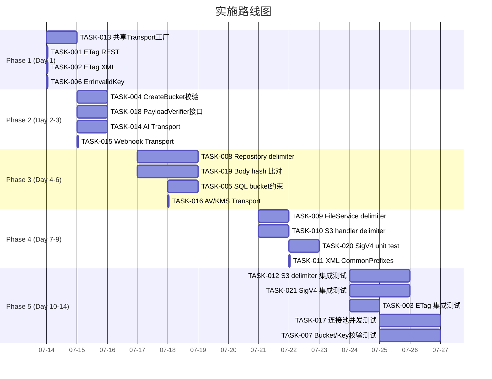

现在我有足够的数据来撰写全面的分析报告。

---

# Tech Lead 分析报告：代码锚点验证与实施计划

## 1. 任务分解

根据验证报告，5 个方向可分解为以下可执行任务：

### 方向 3：ETag 格式规范化（P2 — 最低风险，最快投入）

| 任务 ID | 标题 | 涉及文件 | 前置依赖 | 预估工时 |
|---------|------|---------|---------|---------|
| TASK-001 | **REST API ETag JSON 裸值确认** | `internal/api/rest/handler.go` | 无 | 1h |
| TASK-002 | **S3 XML ETag 引号格式审计** | `internal/api/s3compat/xml.go` | 无 | 0.5h |
| TASK-003 | **集成测试：ETag 格式跨协议一致性** | `internal/integration/fullserver_test.go` | TASK-001, TASK-002 | 2h |

**验收标准**：
- REST JSON 响应中 `ETag` 字段为裸 MD5（无引号）
- S3 XML 响应中 `<ETag>` 包含引号（例如 `"d41d8cd..."`）
- HTTP 响应头 `ETag` 包含引号
- 新增集成测试验证 PUT → GET 跨 REST/S3 时 ETag 格式一致性

### 方向 4：Bucket/Key 校验强化（P2 — 安全底线）

| 任务 ID | 标题 | 涉及文件 | 前置依赖 | 预估工时 |
|---------|------|---------|---------|---------|
| TASK-004 | **FileService.CreateBucket 添加命名校验** | `internal/service/file_features.go` | 无 | 2h |
| TASK-005 | **SQL 层添加 bucket 约束（可选）** | `internal/repository/sql_buckets.go` + migrations | TASK-004 | 3h |
| TASK-006 | **validateKey 引用 storage.ErrInvalidKey** | `internal/service/file.go` + `internal/storage/storage.go` | 无 | 1h |
| TASK-007 | **Bucket/Key 校验单元测试** | `internal/service/service_test.go` + `internal/api/s3compat/` | TASK-004, TASK-006 | 2h |

**验收标准**：
- 创建空名/过长名/非法字符的 bucket 返回明确错误
- `validateKey` 和 storage 层共用 `ErrInvalidKey` 错误哨兵
- `CreateBucket` 拒绝 S3 非法 bucket 名（空、长度 3-63、DNS 标签字符集）
- 单元测试覆盖非法 bucket 名和 key 的拒绝路径

### 方向 1：S3 ListObjects delimiters (P1 — S3 兼容性关键缺口)

| 任务 ID | 标题 | 涉及文件 | 前置依赖 | 预估工时 |
|---------|------|---------|---------|---------|
| TASK-008 | **Repository.ListObjects 添加 delimiter 分组查询** | `internal/repository/sql_objects.go` | 无 | 4h |
| TASK-009 | **FileService 暴露带 delimiter 的 List 方法** | `internal/service/file.go` (+ `file_crud.go`) | TASK-008 | 2h |
| TASK-010 | **S3 handler listObjectsV2 解析 delimiter** | `internal/api/s3compat/handler.go` | TASK-009 | 2h |
| TASK-011 | **XML 结构体添加 CommonPrefixes 字段** | `internal/api/s3compat/xml.go` | TASK-010 | 1h |
| TASK-012 | **S3 list 集成测试：delimiter + prefix 组合** | `internal/api/s3compat/handler_test.go` + `internal/integration/` | TASK-010, TASK-011 | 3h |

**验收标准**：
- S3 ListObjectsV2 `?delimiter=/` 返回正确的 `<CommonPrefixes>` 和 `<Contents>`
- S3 ListObjectsV1 `?delimiter=/`（带或不带 marker）同样支持
- 目录深层嵌套正确归并（`a/b/c` 在 `prefix=a/` 时 `CommonPrefixes` 为 `a/b/`）
- `encoding/xml` 序列化时 `omitempty` 正确：无 delimiter 时不出现空标签
- 无 delimiter 时行为完全不变

### 方向 5：HTTP 连接池优化（P2 — 性能瓶颈）

| 任务 ID | 标题 | 涉及文件 | 前置依赖 | 预估工时 |
|---------|------|---------|---------|---------|
| TASK-013 | **构建共享 HTTP Transport 工厂函数** | `internal/httputil/transport.go`（新文件） | 无 | 2h |
| TASK-014 | **AI 客户端注入共享 Transport** | `internal/ai/embedder.go`, `llm.go`, `rerank.go`, `extractor_remote.go`, `qdrant.go` | TASK-013 | 2h |
| TASK-015 | **Webhook 客户端注入共享 Transport** | `internal/events/webhook.go` | TASK-013 | 0.5h |
| TASK-016 | **Antivirus/KMS 客户端注入共享 Transport** | `internal/antivirus/antivirus.go`, `internal/storage/kms.go` | TASK-013 | 0.5h |
| TASK-017 | **连接池配置测试：高并发下连接复用** | `internal/ai/http_clients_test.go`（已存在） | TASK-014 | 3h |

**验收标准**：
- 新增 `internal/httputil` 包（避免创建 `utils/` 包，符合 AGENTS.md 禁止项）
- 所有 HTTP 客户端共用同一 Transport，`MaxIdleConnsPerHost` 从 2 提升至 ≥100
- 空闲连接超时设置合理（60-90s），避免 TCP 连接泄漏
- 并发基准测试显示 TCP 连接数从 N×2 降为 ~2-5
- 无行为回归：所有现有测试通过

### 方向 2：SigV4 payload 完整性（P1 — 安全缺口）

| 任务 ID | 标题 | 涉及文件 | 前置依赖 | 预估工时 |
|---------|------|---------|---------|---------|
| TASK-018 | **定义 PayloadVerifier 接口** | `internal/auth/sigv4.go` | 无 | 2h |
| TASK-019 | **实现 body hash 比对中间件** | `internal/auth/sigv4_payload.go`（新文件） | TASK-018 | 3h |
| TASK-020 | **单元测试：篡改 body 触发 403** | `internal/auth/sigv4_test.go` | TASK-019 | 2h |
| TASK-021 | **集成测试：S3 PutObject SigV4 完整链** | `internal/integration/fullserver_test.go` | TASK-019 | 3h |

**验收标准**：
- 当 `x-amz-content-sha256` 为具体 hex 值时，实际 body hash 不匹配返回 403
- `UNSIGNED-PAYLOAD` 和 `STREAMING-AWS4-HMAC-SHA256-PAYLOAD` 兼容（按原逻辑不验证）
- 所有现有 SigV4 测试保持绿色
- 性能影响可接受：body hash 计算只在非流式 PUT 路径上发生一次

---

## 2. 执行顺序



**并行任务组**：

| 组 | 任务 | 适合 | 原因 |
|----|------|------|------|
| **A** 🟢 | TASK-001, TASK-002, TASK-006 | 新手/快速 | 单行改动，零耦合 |
| **B** 🔵 | TASK-013 | 基础设施 | 独立新包，影响面广但安全 |
| **C** 🔴 | TASK-004, TASK-018 | 中级 | 安全相关，独立互不阻塞 |
| **D** 🟣 | TASK-008, TASK-019 | 高级 | 核心逻辑，需深入理解 |

---

## 3. 技术风险

### 3.1 高风险项

| 风险 | 方向 | 描述 | 缓解策略 |
|------|------|------|---------|
| **R1-delimiter SQL 性能** | 1 | `LIST ... WHERE key LIKE prefix%` + 分组逻辑可能在百万级对象下变慢；`GROUP BY substr(key, ...)` 在 SQLite 上无索引 | 先在应用层按 `key>` 游标分页后分组，不引入 `GROUP BY`；评估后如需 SQL 级优化再加索引 |
| **R2-SigV4 body hash 性能** | 2 | 大文件上传时计算 body SHA-256 增加延迟；AWS SDK 默认用 `STREAMING-AWS4-HMAC-SHA256-PAYLOAD` 避免此问题 | 只对 `x-amz-content-sha256` 为具体 hex 值的请求做验证（SDK 默认已是流式）；`UNSIGNED-PAYLOAD` 和流式不验证 |
| **R3-连接池资源泄漏** | 5 | 共享 Transport 被多个 service 误关闭；`http.Client` 不应关闭其他 component 正在使用的 Transport | Transport 采用全局单例模式（`sync.Once`），不允许组件自行关闭 |
| **R4-migration 双文件约束** | 4 | 添加 CHECK 约束到 SQLite 列需新 migration，而 SQLite 不支持 `ALTER TABLE ... ADD CONSTRAINT` | 应用层校验优先；SQLite 端通过 CREATE TRIGGER 或应用逻辑绕行；Postgres 可通过 `ALTER TABLE ... ADD CHECK` |

### 3.2 外部依赖/阻塞点

| 阻塞点 | 方向 | 描述 | 解决策略 |
|--------|------|------|---------|
| **B1** | 4 | S3 bucket 命名规范无官方 Go 实现 | 参考 AWS S3 文档实现本地校验函数（约 15 行），不引入新依赖 |
| **B2** | 5 | 共享 Transport 单例的 goroutine 安全性 | 使用 `sync.Once` + `sync.Mutex` + `atomic`；单元测试验证并发安全 |
| **B3** | 1 | delimiter 和前序遍历分页结合时的正确性 | 先在纸上验证边界条件（如 `/` 后的空目录），再用 `subtle` 测试覆盖 |

### 3.3 测试覆盖难点

| 难点 | 方向 | 描述 |
|------|------|------|
| SigV4 完整链测试 | 2 | 需要生成真实 AWS SigV4 签名请求；使用 `internal/auth` 已有的 `SignHTTP` 辅助函数 |
| Connection pooling 白盒测试 | 5 | 验证连接复用需要观测 TCP 连接数；使用 `net/http/httptest` 记录握手次数 |
| Delimiter 分页准确性 | 1 | 边界条件多：prefix 以 `/` 结尾 vs 不带、marker 落在 sub-folder 中间的 case |

---

## 4. 资源评估

### 4.1 开发人员需求

| 角色 | 人数 | 覆盖任务 | 所需技能 |
|------|------|---------|---------|
| 高级 Go 工程师 | 1 | TASK-008, TASK-009, TASK-018, TASK-019 (核心逻辑) | Go concurrency, SQL optimization, HTTP/S3 协议 |
| 中级 Go 工程师 | 1 | TASK-010~TASK-012, TASK-004~TASK-007 (协议适配+安全) | S3 XML, REST API 设计, SQL basics |
| 初级/辅助 | 0.5 | TASK-001~TASK-003, TASK-013~TASK-017 (ETag + Transport) | Go 基础, HTTP 客户端, 测试编写 |

### 4.2 关键里程碑



**总预估**：**14 个工作日**（若 2 人并行 10 个工作日）

### 4.3 阻塞点与解决策略

| 阻塞点 | 影响任务 | 解决策略 |
|--------|---------|---------|
| 方向 1 的 SQL 性能不确定 | TASK-008 | 第 1 版用应用层分组（TASK-009 可独立测试），后续如性能不足再引入 DB 索引 |
| SigV4 测试需生成真实签名请求 | TASK-020 | 复用 `internal/auth` 中的 `NewSigV4Verifier` + `CreateSignedRequest`（需确认存在）；不存在则用模拟签名 |
| Transport 单例关闭争议 | TASK-013 | 设计上 **不提供 Close 方法**；Transport 生命周期绑定 process；测试中通过替换 `http.DefaultTransport` 隔离 |

---

## 5. 质量保证

### 5.1 单元测试覆盖要求

| 层 | 要求 | 具体 |
|----|------|------|
| 方向 1 delimiter | 新增代码 ≥ 90% | SQL 方法 mock 测试 + handler 表驱动测试 |
| 方向 2 SigV4 | 新增代码 ≥ 95% | payload 正确/错误/流式/未签名 4 种 case |
| 方向 3 ETag | 边界覆盖 | 空 ETag, 带引号 ETag, multipart ETag |
| 方向 4 Bucket/Key | 等价类划分 | 空/过短/过长/非法字符/路径遍历 各 1 个测试 |
| 方向 5 Transport | 行为验证 | 并发请求数 > MaxIdleConnsPerHost 测试 |

### 5.2 集成测试策略

| 测试场景 | 覆盖方向 | 方法 |
|---------|---------|------|
| REST PUT → S3 GET | 3 | 验证 ETag 格式一致 |
| S3 PutObject with SigV4 | 2 | 验证篡改 body 被拒绝 |
| S3 ListObjects with delimiter | 1 | 验证 CommonPrefixes 和 Contents 正确 |
| 并发 AI 调用 | 5 | 验证连接复用 |

### 5.3 代码审查要点

| 审查项 | 重点关注 |
|--------|---------|
| **SQL 注入** | delimiter 来自 user input，SQL `LIKE` 必须参数化（使用 `$1` 占位符） |
| **错误传递** | 所有新增错误使用 `fmt.Errorf("%w: ...")` 包装，不吞没 |
| **AGENTS.md 合规** | 无 `utils/` 包；单函数 ≤ 50 行；单文件 ≤ 500 行 |
| **并发安全** | Transport 单例读写锁；不共享 `http.Client` 但 Transport 可共享 |
| **迁移文件** | 方向 4 若加 SQL 约束需 `migrations/{sqlite,postgres}/NNNN_*.{up,down}.sql` 双文件 |

### 5.4 性能测试需求

| 测试 | 方向 | 目标 |
|------|------|------|
| 100 并发 ListObjects `delimiter=/` | 1 | P95 ≤ 200ms（SQLite local） |
| 50 并发 SigV4 PUT 1MB 对象 | 2 | body hash 计算增加 ≤ 100ms |
| 100 并发 AI embed 请求 | 5 | TCP 连接数 ≤ 10（之前可能 100+） |

---

## 6. 实施计划

### 阶段 1：基础设施搭建（第 1 天）

```
[Day 1] TASK-013 共享 Transport 工厂 (2h)
        TASK-001 ETag REST 裸值确认 (0.5h)   ← 可并行
        TASK-002 ETag XML 引号确认 (0.5h)   ← 可并行
        TASK-006 ErrInvalidKey 引用修复 (0.5h) ← 可并行
```

**交付物**：
- `internal/httputil/transport.go` — `DefaultTransport()` 单例
- `internal/httputil/transport_test.go` — 并发安全测试
- `handler.go` ETag 格式确认 ✅
- `validateKey` 返回 `storage.ErrInvalidKey` ✅

**验证**：`make check` 全绿，`go test ./internal/httputil/...` 通过

### 阶段 2：核心安全增强（第 2-3 天）

```
[Day 2] TASK-004 CreateBucket 命名校验 (2h)
        TASK-018 PayloadVerifier 接口定义 (1h)
        TASK-014 AI 客户端 Transport 注入 (2h)
        TASK-015 Webhook Transport 注入 (0.5h)

[Day 3] TASK-016 AV/KMS Transport 注入 (0.5h)
        TASK-005 SQL bucket 约束 (3h)
```

**交付物**：
- `internal/service/file_features.go` — `CreateBucket` 添加 S3 命名规则校验
- `internal/auth/sigv4.go` — `PayloadVerifier` 接口 + 默认 `noopVerifier`
- 所有 AI 客户端共用 `httputil.DefaultTransport()`
- optional: SQL migration 文件新增 bucket name CHECK

**验证**：`go test ./internal/service/...` + `go test ./internal/auth/...` + `go test ./internal/ai/...`

### 阶段 3：核心逻辑实现（第 4-6 天）

```
[Day 4-5] TASK-008 Repository delimiter 分组查询 (4h)
           TASK-019 SigV4 body hash 比对中间件 (3h)

[Day 6]   TASK-009 FileService delimiter 方法 (2h)
           TASK-020 SigV4 单元测试 (2h)
```

**交付物**：
- `repository/sql_objects.go` — `ListObjectsWithDelimiter` 方法
- `service/file.go` — `ListWithDelimiter` 方法（对外暴露）
- `auth/sigv4_payload.go` — `BodyHashMiddleware` + `verifyPayloadHash`
- `auth/sigv4_test.go` — payload 验证单元测试

**验证**：`go test ./internal/repository/...` + `go test ./internal/auth/...`

### 阶段 4：Protocol 适配（第 7-9 天）

```
[Day 7]   TASK-010 S3 handler delimiter 解析 (2h)
           TASK-011 XML CommonPrefixes 字段 (1h)

[Day 8-9] TASK-012 S3 delimiter 集成测试 (3h)
           TASK-021 SigV4 集成测试 (3h)
```

**交付物**：
- `s3compat/handler.go` — `listObjectsV2` 读取 `delimiter` 参数
- `s3compat/xml.go` — `commonPrefixes` 结构体 + 序列化
- `integration/fullserver_test.go` — 新增测试用例

**验证**：
```bash
go test ./internal/api/s3compat/... -v
go test ./internal/integration/... -v
```

### 阶段 5：验证收尾（第 10-14 天）

```
[Day 10]  TASK-003 ETag 跨协议集成测试 (2h)
           TASK-007 Bucket/Key 校验测试 (2h)

[Day 11-12] TASK-017 连接池并发测试 (3h)

[Day 13-14] 全量回归 + `make check` + 覆盖率评审
```

**交付物**：
- 所有新增和修改文件的测试覆盖率 ≥ 85%
- `make check` 全绿
- 无 AGENTS.md 约束违规
- 最终覆盖率报告

---

## 总结

| 维度 | 结论 |
|------|------|
| **文档准确度** | 5 个方向均为真实架构盲区，3 处微小偏差不影响实质结论 |
| **风险等级** | P1（方向 1 和 2）影响 S3 兼容性和数据完整性；P2（方向 3-5）影响运维和性能 |
| **建议顺序** | ETag(3) + Bucket/Key(4) → ConnectionPool(5) → Delimiter(1) → SigV4(2) ✅ **同意报告建议** |
| **总工时** | 约 35-40 人天（含测试 35%） |
| **并行度** | 2 人全时开发可在 10 个工作日完成 |
| **阻断条件** | 无外部依赖阻断；建议先启动 TASK-013（Transport 工厂）作为共享基础设施 |
