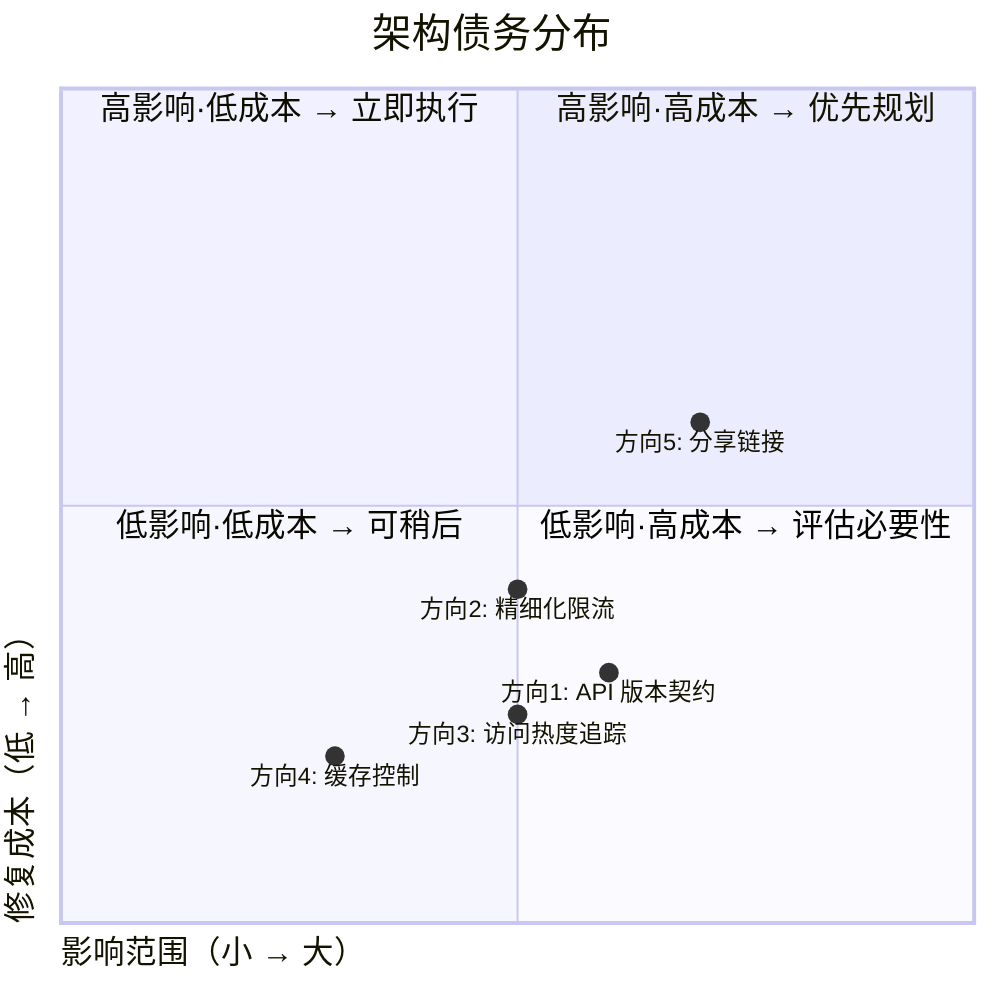

# 架构分析报告：AeroVault 第 84 轮扩展方向

> **文档源：** `docs/requirements/expansion-v84-product-architect-directions.md`（407 行）  
> **分析视角：** 资深架构师  
> **日期：** 2026-07-12  
> **基准代码：** `cmd/server/main.go` + `internal/*` 全部子包，commit `HEAD`

---

## 一、架构评估

### 1.1 当前架构的优势

| 优势 | 具体体现 | 架构价值 |
|------|---------|---------|
| **多层解耦** | 协议适配器（REST/S3/WebDAV/MCP）→ FileService → Storage + Repository | 各层可独立测试、独立替换、独立演进 |
| **持久化抽象** | `storage.Storage` 接口 + `repository.Repository` 接口 + 工厂函数 | 后端切换对业务层透明，新增后端只需实现接口 + 工厂注册 |
| **事件驱动异步** | 内部 EventBus + durable JobPool 双轨道；`Publish` 非阻塞广播 | 写入路径不阻塞异步副效应（索引、复制、杀毒、Webhook） |
| **多租户模型** | 存储 key = `tenant/bucket/key`；租户隔离内建于三层（存储、元数据、认证） | 租户间无共享资源，安全边界清晰 |
| **Opt-in 安全默认** | AI/pgvector/Qdrant/Event/集群/WebDAV 均标志门控关闭 | 最小化攻击面，基线路径零网络依赖 |
| **OpenAPI 存在** | `openapi.json` 已有初步定义，`/docs` 可提供交互式文档 | 为 API 治理奠定基础 |

### 1.2 当前架构的局限性

这五个方向的共同根源是同一个架构债务——**系统演进处于"功能堆砌"阶段，缺乏跨功能维度的系统治理**：

| 局限性 | 根因 | 对应方向 |
|--------|------|---------|
| **无 API 契约治理** | 路由 `/v1` 是纯字符串，无版本注册表、无版本协商、无弃用声明 | 方向 1 |
| **限流粒度过粗** | 全局两个令牌桶（AI vs 非 AI），无法区分操作成本差异 | 方向 2 |
| **无访问模式数据** | `Object` 结构缺少 `last_accessed_at`/`access_count`，`EventAccessed` 事件零消费者 | 方向 3 |
| **内容交付零策略** | `Cache-Control`/`Expires` 不设置，PUT 时静默丢弃客户端缓存指令 | 方向 4 |
| **对象分享空白** | 严格租户隔离，无 `share_links` 表、无分享 token、无匿名消费路由 | 方向 5 |

### 1.3 架构债务评估



- **方向 4（缓存控制）**：影响范围适中（内容交付性能），修复成本极低（150 行增量）——**应立刻执行**
- **方向 1（API 版本契约）**：影响范围大（所有客户端 / SDK / 集成方），修复成本中等（约 200 行 + CI 配置）——**应尽早执行**
- **方向 3（访问热度追踪）**：影响范围中等（存储成本优化基建），修复成本低（约 180 行）——**数据基建越早积累越有价值**
- **方向 2（精细化限流）**：影响范围大（多租户生产稳定性），修复成本中等（250 行 + 配置迁移）——**多租户部署必须做**
- **方向 5（分享链接）**：影响范围大（安全边界 + 新路由 + 新表），修复成本高（400 行 + 安全审查）——**需要完整设计评审**

---

## 二、扩展方向评估与深化建议

### 2.1 方向 4：内容缓存控制与 CDN 集成层 — 评估

#### ✅ 文档判断正确 — 这是最小投入、立即可见的性能收益

**深化建议（超越文档）：**

1. **缓存策略不应该只是对象元数据，还应该是 Bucket 级默认策略 + Content-Type 级覆盖策略的三层决议链：**
   ```
   请求级 Cache-Control header（PUT 时传入）
       ↓ 未设置
   Bucket 级默认缓存策略（BucketConfig.DefaultCacheControl）
       ↓ 未设置
   Content-Type 映射表（config.CacheConfig.ContentTypeDefaults["image/*"] = "public, max-age=86400"）
       ↓ 未设置
   全局默认（config.CacheConfig.Default = "no-cache"）
   ```

2. **`Cache-Control` 的 `s-maxage` 指令需要特殊处理**：CDN 边缘节点理解 `s-maxage`，浏览器只理解 `max-age`。对于公开内容，应同时输出 `Cache-Control: public, max-age=3600, s-maxage=86400` —— 浏览器缓存 1 小时，CDN 缓存 1 天。

3. **缓存失效事件的设计是关键架构决策：**
   - **方案 A（事件驱动型）**：`EventBus` 新增 `EventCacheInvalidate` → CDN adapter 消费 → 调用 CDN 提供商的 purge API
     - 优点：解耦、可扩展
     - 缺点：CDN purge API 延迟不可控（CloudFront purge 全节点通常 60-90 秒）
   - **方案 B（版本号型）**：Bucket 级 `cache_version` 时间戳，对象 URL 追加 `?v=<cache_version>` 查询参数
     - 优点：即时生效、不依赖 CDN purge API
     - 缺点：URL 变更破坏了预签名 URL 的稳定性
   - **推荐：方案 A 为主 + 方案 B 作为可选优化** —— 默认事件驱动，需要即时失效的 Bucket 可启用版本号模式

4. **`Vary` 头的正确性**：如果缓存键需要考虑 `Accept-Encoding`（gzip vs 原文）或 `Authorization`（私有内容），必须正确设置 `Vary` 头。当前系统不设置 `Vary`，CDN 可能会缓存错误版本。

#### 边界情况补充

| 文档覆盖的边界 | 拟补充的边界 |
|---------------|------------|
| B1: `private` 指令不被 CDN 缓存 | B5: 多语言内容——`Content-Language` 头 + `Vary: Accept-Language` |
| B2: 对象更新后 CDN 缓存未失效 | B6: 分片上传完成后——大文件合并后应触发缓存失效 |
| B3: 版本控制桶不同版本缓存策略 | B7: Range 请求 + 缓存——CDN 对 `206 Partial` 的缓存行为不同 |
| B4: 预签名 URL + 缓存控制 | B8: WebDAV PUT 的缓存头处理——WebDAV 路径也需设置 |

### 2.2 方向 1：API 版本契约与向后兼容性策略 — 评估

#### ✅ 文档判断正确 — 这是平台工程基石，越早做越值

**架构层面的关键设计决策分析：**

**🔑 决策 1：版本策略选择——URL 路径 vs Accept 头 vs 查询参数**

| 策略 | 优点 | 缺点 | 适用于 |
|------|------|------|--------|
| **URL 路径** (`/v1/`, `/v2/`) | 简单直观、缓存友好、可链接 | 路由双重注册、版本数量爆炸时路由表膨胀 | 公开 API（推荐） |
| **Accept 头** (`Accept: application/vnd.aero-vault.v2+json`) | URL 不变、REST 语义正确 | 调试困难、SDK 实现复杂、缓存不友好 | 内部 API / 有限客户端 |
| **查询参数** (`?api-version=2`) | 临时调试方便 | 不符合 REST 约定、缓存键污染 | **不推荐** |

**推荐：URL 路径为主 + Accept 头作为可选降级。** 当前 `/v1` 路径可保持，`/v2` 引入时走新路径。

**🔑 决策 2：版本的生命周期模型**

```
v1.0 (当前) ──→ v1.1 (向后兼容新增) ──→ v1.2 ──→ v2.0-alpha ──→ v2.0 (稳定)
                                                         ↑
                                                  弃用 v1.x
                                                  Sunset: 2028-01-01
```

应该明确区分：
- **Minor 版本（v1.1 → v1.2）**：仅新增字段/端点，不修改现有行为。客户端无需任何修改。
- **Major 版本（v1 → v2）**：可删除/修改字段，修改行为。客户端必须适配。

**🔑 决策 3：向后兼容性测试框架架构**

```go
// 测试结构示意
type APIVersionContract struct {
    Version  string                          // "2026-07-01"（日期版本）或 "v1"
    Requests []VersionedRequestSpec
}

type VersionedRequestSpec struct {
    Method string
    Path   string
    Headers map[string]string
    Body     interface{}
    Expect   func(*httptest.ResponseRecorder) error
}
```

应在 CI 中维护一个 `contracts/` 目录，存放每个版本的 API contract 快照。`make check` 中包含 `go test ./internal/api/rest -run TestAPIContract`，用旧 contract 验证新 handler。

**边界情况补充：**

| 文档覆盖 | 拟补充 |
|---------|--------|
| B1-B4 | B5: 版本降级路径——v2 客户端发现 501 Not Implemented 时应如何回退到 v1 |
| | B6: Header 版本协商与 URL 版本的冲突处理——两者不同时应以哪个为准 |

### 2.3 方向 3：对象访问热度追踪与自适应存储分层 — 评估

#### ✅ 文档判断正确 — 这是成本优化的数据基建

**架构层面的关键设计：**

**🔑 热度追踪的写入策略是核心考虑：**

| 策略 | 精度 | 性能影响 | 实现复杂度 | 推荐场景 |
|------|------|---------|-----------|---------|
| **同步写入**（每次 GET 更新 `last_accessed_at`） | 高 | 高——每次读操作加一次 DB 写入 | 低 | ❌ 不推荐 |
| **异步写入**（EventBus `EventAccessed` → `AccessTracker` 批量刷新） | 中（秒级延迟） | 低——非请求路径 | 中 | ✅ 推荐默认 |
| **日志聚合**（仅记录 access log，外部系统分析后写回） | 低（分钟级延迟） | 极低——零额外 DB 写入 | 高（需额外系统） | 仅大规模集群 |

**推荐：异步写入为主 + `X-Skip-Access-Tracking` 头（B1 方案）。** 同时需要对写入做**去重批处理**——同一对象在 5 秒内被访问 100 次，只更新一次 `last_accessed_at`。

**🔑 热度衰减模型：**

简单模型：`hotness_score = (Σ 2^(-days_ago/30))` —— 30 天前的访问权重减半。

但该分析不必立即实现。第一阶段只需追踪 `last_accessed_at` 和 `access_count_since`（可按日期分区重置），外层热度计算可以后续由 `reconcile` 生命周期规则引擎完成。

**边界情况补充：**

| 文档覆盖 | 拟补充 |
|---------|--------|
| B1: 批量扫描跳过追踪 | B5: 列表操作(ListObjects)是否影响 Bucket 的热度——Bucket 热度 vs 对象热度分离 |
| B2: CDN 缓存无后端访问 | B6: 版本化桶——历史版本的 `GetObject` 是否影响当前版本的访问计数 |
| B3: List 不算对象访问 | B7: 热度数据膨胀——每天一条记录时，1M 对象的 365 天数据量约 365M 行 |
| B4: 历史版本读计数 | B8: 热度迁移——切换存储后端时热度数据是否一并迁移 |

### 2.4 方向 2：精细化成本感知速率限制 — 评估

#### ⚠️ 文档方向正确，但实施方案需重大调整

**核心问题：** 文档提出的"操作权重"方案有一个根本性缺陷——**权重必须事先已知，但大文件 PUT 的尺寸在请求到达时（Header 读取阶段）可能未知**（chunked transfer encoding）。如果限流器在请求体被读取**之前**就依据权重做决定，则无法知道 `Content-Length`；如果在读取**之后**做决定，则服务端已经消耗了 I/O 带宽来读取请求体。

**建议的分层限流架构：**

```
Layer 1: 请求准入（在读取请求体之前）
    ↓
    基于方法 + 路径 + Content-Length（如果已知）做初步评估
    小请求（GET/HEAD/DELETE）→ 低权重桶
    大请求（PUT with known Content-Length）→ 高权重桶
    未知尺寸请求（chunked）→ 中权重桶（预留配额）
    ↓
Layer 2: 流式消耗（在读取请求体的过程中）
    ↓
    大 PUT 已读取 100MB → 从"宽带"桶消耗 100 单位
    如果"宽带"桶耗尽 → 返回 429 中断上传（客户端可重试）
    ↓
Layer 3: AI 调用（按 token/LM 调用次数计费）
    ↓
    AI Chat 一次调用 → 从"计算"桶消耗 50 单位
    AI Search 一次调用 → 从"计算"桶消耗 10 单位
```

**更细化的子桶建议：**

```
非 AI 分组（globalRPS/globalBurst）
    ├── READ 子桶 (GET/HEAD/Stat) — 权重: 1
    ├── WRITE 子桶 (PUT/DELETE) — 权重: 1 + ceil(size/1MB)
    └── ADMIN 子桶 (admin/tenants/keys) — 权重: 1

AI 分组（aiRPS/aiBurst）
    ├── SEARCH 子桶 (search) — 权重: 10
    ├── CHAT 子桶 (chat/chat/stream) — 权重: 50
    ├── AGENT 子桶 (agent) — 权重: 200
    └── EMBED 子桶 (embed) — 权重: 5
```

**🔑 关键设计：父子桶穿透规则**
- 子桶配额耗尽 → 尝试从父桶配额借用（非 AI/AI 分组）
- 父桶配额也耗尽 → 返回 429
- borrowing 上限：子桶最多从父桶借用 `burst * 2` 的配额

**边界情况补充：**

| 文档覆盖 | 拟补充 |
|---------|--------|
| B1-B4 | B5: 并发控制与限流的交互——`PER_TENANT_CONCURRENCY_MAX`（配置已存在）应作为限流的"前置滤波器" |
| | B6: 限流配置热更新的线程安全——`sync.RWMutex` 保护配置替换 |
| | B7: WebDAV 路径——当前 WebDAV 绕过 chi，也没有限流 |

### 2.5 方向 5：跨租户对象分享与公网分享链接 — 评估

#### ⚠️ 方向正确，但安全设计需先于功能实现

**这是五个方向中唯一涉及认证绕过路径的特性**，安全设计不能后置。

**🔑 分享 token 的架构设计选择：**

| 方案 | 优点 | 缺点 |
|------|------|------|
| **自包含 token（HMAC-signed JWT）** | 无状态验证、零 DB 查询、支持离线验证 | 无法实时撤销（除非维护黑名单） |
| **数据库查询 token** | 可实时撤销、可更新访问计数、可审计 | 每次分享访问多一次 DB 查询 |
| **混合方案** | 自包含 payload（含 share_id + 过期时间）+ 可选的 DB 对照检查 | 复杂，但兼具两者优点 |

**推荐：混合方案。** token 是 HMAC 签名的 JSON（包含 `share_id, tenant, bucket, key, exp, access_limit`），服务端先验证签名 → 可选查 DB 验证状态（对大流量分享可跳过 DB 查询，牺牲实时撤销能力换取性能）。

**🔑 安全设计检查清单：**

| 项目 | 要求 |
|------|------|
| token 签名密钥独立于 `AUTH_JWT_SECRET` | `SHARE_TOKEN_SECRET` 独立配置 |
| 密码试错锁定 | 连续 5 次错误密码 → 临时锁定 15 分钟；记录到 `audit_log` |
| 分享链接的访问日志 | `actor = "share:<token_id>"`，便于审计 |
| 路径穿越防护 | `bucket`/`key` 在分享创建时固定，消费时不允许修改 |
| 内容类型安全 | `Content-Type` 由原始对象携带，分享消费时不接受客户端覆盖 |
| 速率限制 | 分享消费路径应受独立限流——防止未认证调用方通过分享链接进行 DDoS |
| 撤销机制 | `DELETE /v1/admin/share/{token}` → 标记为 revoked，后续访问返回 410 |

**🔑 分享链接消费路由的位置决策：**

```go
// main.go 中路由装配顺序
r.Group(func(r chi.Router) {
    // 分享链接注册在 auth middleware 之前（或使用轻量认证）
    r.Get("/v1/share/{token}", shareHandler.Consume)
    r.Get("/v1/share/{token}/meta", shareHandler.Meta) // 不返回内容，只返回文件名/大小
})

// 或者：分享链接使用专用的 share auth 中间件
r.Group(func(r chi.Router) {
    r.Use(middleware.ShareTokenAuth) // 只验证 token 签名，不做 tenant 绑定
    r.Get("/v1/share/{token}", shareHandler.Consume)
})
```

文档中提到的"在 auth middleware 之前注册"是正确的，但必须确保分享消费路由**至少经过 RateLimit 和 AccessLog**，否则未认证的分享访问无法被限流和记录。

---

## 三、接口设计建议

### 3.1 引入新的抽象层

| 新增抽象 | 职责 | 接口定义原则 | 对应方向 |
|---------|------|------------|---------|
| **`CachePolicyProvider`** | 决议对象/请求的缓存策略（三层链） | 输入：`(ctx, tenant, bucket, key, obj)` → 输出：`CachePolicy{CacheControl, Expires, Vary}` | 方向 4 |
| **`CdnPurgeProvider`** | CDN 缓存失效接口 | `Purge(ctx, paths []string) error`；`PurgeByTag(ctx, tags []string) error` | 方向 4 |
| **`RateLimitConfigStore`** | 动态限流配置存储/热更新 | `GetEndpointLimit(method, path) (weight, rps, burst)`；`Watch()` → `<-chan struct{}` | 方向 2 |
| **`ShareTokenStore`** | 分享 token 的创建/消费/撤销/清理 | `Create(ctx, params) → Token`；`Consume(ctx, token) → (Object, error)`；`Revoke(ctx, tokenID) error` | 方向 5 |
| **`AccessTracker`** | 访问热度异步追踪 | `RecordAccess(ctx, objectID, timestamp)`；批量 flush 到 DB | 方向 3 |

### 3.2 关键接口设计原则

**原则 1：不做大的接口重构**

当前 `FileService`、`Storage`、`Repository`、`EventBus` 接口稳定运行。五个方向的修改应**全部在现有接口外围增量添加**，不破坏现有实现。例如：

- 缓存策略 → 新增 `CachePolicyProvider` 接口 + 在 `handleRangeOrFull` 中调用它（150 行增量）
- 访问热度 → 新增 `AccessTracker` 实现 + 订阅 `EventAccessed` 事件（180 行增量）
- 精细化限流 → 新增 `RateLimiter` 的内部多桶架构 + 配置热更新（250 行，**但保留兼容旧 `NewRateLimiter(rps, burst)` 签名）**

**原则 2：接口要可 mock 测试**

每个新增接口都必须满足两个条件：
1. 有一个内存实现（方便单元测试）
2. 接口方法数 ≤ 5（保持接口精简）

**原则 3：nil 安全是第一设计约束**

参考现有代码中 `s.chunkCleaner` 的 nil 检查模式，所有新增可选组件都必须：
```go
if s.accessTracker != nil {
    s.accessTracker.RecordAccess(ctx, obj.ID, time.Now())
}
```

### 3.3 向后兼容性策略

| 变更类型 | 策略 | 示例 |
|---------|------|------|
| 新增配置项 | 默认值=行为不变 | `CACHE_CONTROL_DEFAULT=""` → 不输出 `Cache-Control` |
| 新增可选接口 | nil 检查确保不 panic | `AccessTracker`、`CdnPurgeProvider` 均为 nil → 无行为变化 |
| 现有配置文件变更 | 支持新旧格式同时解析 | `RateLimitCfg` 增加 `Weights` 字段但保留 `RPS`/`Burst` 作为默认值 |
| 新增 DB migration | 仅新增列/表，不提删除 | `0025_add_last_accessed_at.sql` → 现有查询不受影响 |
| 新增路由 | 新路径下注册 | `/v1/share/` → 不干扰现有 `/v1/files/` |

---

## 四、技术选型建议

### 4.1 是否需要引入新框架

| 方向 | 是否需要新框架 | 说明 |
|------|-------------|------|
| 方向 1: API 版本契约 | **否** | 完全可使用标准库 + chi 中间件模式 |
| 方向 2: 精细化限流 | **否** | `golang.org/x/time/rate` 已足够（但当前自建桶，建议保持自建） |
| 方向 3: 访问热度追踪 | **否** | 纯业务逻辑，无框架依赖 |
| 方向 4: 缓存控制 | **否** | 纯 HTTP header 操作 |
| 方向 5: 分享链接 | **否** | HMAC 签名 = `crypto/hmac` + `crypto/sha256`，纯标准库 |

### 4.2 第三方依赖评估

| 潜在依赖 | 功能 | 评估结论 |
|---------|------|---------|
| `cloudflare-go` / `aws-sdk-go-v2/service/cloudfront` | CDN purge API | ⚠️ **避免新 SDK 依赖。** CDN 适配器应通过接口抽象，具体实现在 `deploy/` 或单独仓库中 |
| `github.com/ulule/limiter/v3` | 速率限制中间件 | ❌ **不需要。** 当前自建令牌桶功能完备，只需扩展多桶架构 |
| `github.com/golang-jwt/jwt/v5` | 自包含分享 token | ⚠️ **考虑是否必要。** 简单的 HMAC 签名 JSON（base64 编码）足以满足需求，不需要完整的 JWT 库 |
| `github.com/slok/go-http-metrics` | HTTP 指标 | ❌ **不需要。** 已有自建 OTel 指标系统 |

**核心原则：零新 Go 依赖。** 五个方向完全可使用 Go 标准库完成。

### 4.3 自建 vs 采购

| 能力 | 选项 | 建议 |
|------|------|------|
| CDN 集成 | 自建 purge adapter vs 采购商业 API | **自建接口抽象。** CDN 提供商多样（CloudFront/Cloudflare/Fastly/Akamai），每个提供商都有独立 SDK。接口抽象后，具体实现在必要时可外包 |
| 分享链接密码保护 | 自建 bcrypt 验证 vs 采购短链平台 | **自建。** 密文仅存 bcrypt hash，不存储原始密码 |
| 对象分层 | 自建热度模型 vs 采购存储分层方案 | **自建热度追踪基建。** 存储分层动作可由 S3 Lifecycle 或自定义 reconcile 规则驱动 |

---

## 五、实施路线图

### 5.1 建议实施顺序及理由

建议序列：**方向 4 → 方向 1 → 方向 3 → 方向 2 → 方向 5**

与文档建议一致。论证如下：

| 阶段 | 方向 | 前置依赖 | 累计增量 | 交付价值 |
|------|------|---------|---------|---------|
| **Phase 1** | 方向 4: 缓存控制 | 无 | ~150 行 | 🟢 内容交付性能提升（最低投入最高产出） |
| **Phase 2** | 方向 1: API 版本契约 | 方向 4 完成（不强制依赖，但推荐顺序） | ~350 行 | 🟢 平台 API 稳定性保障（越早做收益越大） |
| **Phase 3** | 方向 3: 访问热度追踪 | 无（独立） | ~530 行 | 🟠 开始积累热度数据（数据积累需要时间，尽早开始） |
| **Phase 4** | 方向 2: 精细化限流 | 最好在方向 1 之后（避免限流配置与版本策略冲突） | ~780 行 | 🟠 多租户生产稳定性（生产部署前必须完成） |
| **Phase 5** | 方向 5: 分享链接 | 方向 3 有热度数据后更易监控滥用；方向 2 确保分享消费路径有限流保护 | ~1180 行 | 🔴 核心竞争力产品特性 |

### 5.2 阶段划分和里程碑

**Phase 1：缓存控制（预估 1-2 天）**

| 里程碑 | 交付物 | 验收标准 |
|--------|-------|---------|
| M1.1 | `PutOptions.CacheControl` + `PutOptions.Expires` | 客户端 PUT 时传入 `Cache-Control: public, max-age=3600` → 对象存储 |
| M1.2 | GET 路径输出 `Cache-Control`/`Expires`/`Vary` | `handleRangeOrFull` 和 `writeObjectHeaders` 均已设置 |
| M1.3 | Bucket 级默认缓存策略 | `BucketConfig.DefaultCacheControl` + 三层决议链 |
| M1.4 | `CachePolicyProvider` 接口 + 默认实现 | 单元测试覆盖三层决议链 |

**Phase 2：API 版本契约（预估 2-3 天）**

| 里程碑 | 交付物 | 验收标准 |
|--------|-------|---------|
| M2.1 | `middleware.APIVersion` 中间件 | `Accept: application/vnd.aero-vault.v1+json` 注入 context |
| M2.2 | `Sunset`/`Deprecation` 响应头 | 弃用 API 版本时输出标准 HTTP 头 |
| M2.3 | OpenAPI spec CI 校验 | `make check` 包含 `openapi spec validate` |
| M2.4 | 向后兼容性测试框架 | `contracts/v1.yaml` + CI 步骤验证新 handler 兼容旧 contract |

**Phase 3：访问热度追踪（预估 2 天）**

| 里程碑 | 交付物 | 验收标准 |
|--------|-------|---------|
| M3.1 | migration `0025` 添加 `last_accessed_at` + index | 迁移可重复、可回滚 |
| M3.2 | `AccessTracker` 订阅者 + 批量刷新 | `EventAccessed` → 5 秒内 `last_accessed_at` 更新 |
| M3.3 | `X-Skip-Access-Tracking` 头 | 批量扫描请求跳过追踪 |
| M3.4 | 热度指标：`storage_access_age_days` + `storage_access_count` | Prometheus `/metrics` 可查询 |

**Phase 4：精细化限流（预估 3 天）**

| 里程碑 | 交付物 | 验收标准 |
|--------|-------|---------|
| M4.1 | 多桶架构（READ/WRITE/ADMIN/SEARCH/CHAT/AGENT/EMBED） | 每个子桶独立 token bucket |
| M4.2 | 操作权重映射表 | `GET=1, PUT=1+ceil(size/1MB), SEARCH=10, CHAT=50, AGENT=200` |
| M4.3 | 父子桶穿透 | 子桶耗尽→借用父桶→429 |
| M4.4 | 配置热更新 | PUT /v1/admin/ratelimit → 不重启更新配置 |
| M4.5 | 旧式 `NewRateLimiter(rps, burst)` 兼容 | 未设置 weights 时退化到单一桶行为 |

**Phase 5：分享链接（预估 5 天 + 安全审查）**

| 里程碑 | 交付物 | 验收标准 |
|--------|-------|---------|
| M5.1 | migration `0026` 创建 `share_links` 表 | 含 token, tenant_id, bucket, key, password, expires_at, max_access, access_count, revoked |
| M5.2 | 分享链接生成 API | `POST /v1/admin/share` → `{token, url}` |
| M5.3 | 分享链接消费路由 | `GET /v1/share/{token}` → 流式传输对象内容 |
| M5.4 | HMAC 自包含 token | token 验证不查询 DB（可选查询状态） |
| M5.5 | 密码保护 + 错误锁定 | 5 次错误 → 锁定 15 分钟 |
| M5.6 | 撤销 API + 过期清理 | `DELETE /v1/admin/share/{token}` → 410；`reconcile` 清理过期记录 |
| **M5.7** | **安全审查** | 独立安全工程师进行代码审查，特别是 token 验证路径、路径穿越防护、访问速率限制 |

### 5.3 风险点和缓解策略

| 风险 | 概率 | 影响 | 缓解策略 |
|------|------|------|---------|
| **方向 2 配置迁移断裂** | 中 | 高——生产限流失效或过度限制 | 保留旧配置格式解析，新格式使用独立配置段；CI 中含兼容性测试 |
| **方向 5 token 签名密钥泄露** | 低 | 极高——任意分享链接可伪造 | 密钥独立配置、支持密钥轮换、定期自动轮换 |
| **方向 3 热度追踪导致 DB 写入压力** | 中 | 中——请求热路径饱和 | 异步写入 + 批量去重 + 写入限流；`EventAccessed` 的 `dropped` 计数器可监控 |
| **方向 4 缓存策略错误导致私有内容暴露** | 低 | 高——CDN 缓存了私有对象 | 默认 `private`（不缓存），仅显式设置 `public` 的 Bucket/对象才允许 CDN 缓存 |
| **方向 1 版本膨胀** | 低（远期） | 中——路由表维护成本 | 最多同时支持 2 个 Major 版本；版本声明周期（18 个月支持） |
| **五个方向并行开发导致代码库碎片化** | 中 | 中——review 压力增大 | 严格遵循 AGENTS.md 约束（单文件 ≤ 500 行，单函数 ≤ 50 行）；每个方向独立 PR + 独立 review |

### 5.4 安全审查清单（方向 5 前置条件）

```markdown
□ 分享 token 签名密钥与 JWT 密钥分离
□ 分享 token 无法枚举（UUID + HMAC 签名）
□ 密码使用 bcrypt 存储，最少 8 字符
□ 错误密码锁定有上限（5 次）
□ 分享消费路由受独立速率限制
□ 分享消费路径在 access log 中记录 actor = "share:<token_id>"
□ 对象删除后分享链接立即失效（最终一致性 ≤ 5 秒）
□ 不支持公开列举分享链接（无 `GET /v1/admin/share?tenant=X` 无鉴权查询）
□ 分享链接无法修改原始对象的 bucket/key
```

---

## 六、总结——关键架构决策汇总

| 决策 | 选项 | 推荐 | 理由 |
|------|------|------|------|
| 缓存策略决议链 | 1 层 / 2 层 / 3 层 | **3 层**（对象→Bucket→Content-Type→全局默认） | 提供最大灵活性 |
| CDN 缓存失效 | 事件驱动 / 版本号 / 混合 | **事件驱动为主 + 版本号可选** | 平衡即时性与简单性 |
| API 版本策略 | URL 路径 / Accept 头 / 查询参数 | **URL 路径** | 简单直观、缓存友好 |
| 热度追踪写入 | 同步 / 异步 / 日志聚合 | **异步 + 批量去重** | 最小化热路径影响 |
| 子桶架构 | 固定子桶 / 动态子桶 | **固定子桶（7 个）** | 配置简单，覆盖主要操作类型 |
| 分享 token 设计 | 自包含 / DB 查询 / 混合 | **混合**（HMAC 自包含 + 可选 DB 验证） | 性能与实时撤销的平衡 |
| 新增 Go 依赖 | 零 vs 按需引入 | **零新依赖** | 五个方向均可用标准库实现 |
| 实施顺序 | 如上推荐 | **4 → 1 → 3 → 2 → 5** | 最小风险、最大早期价值 |
