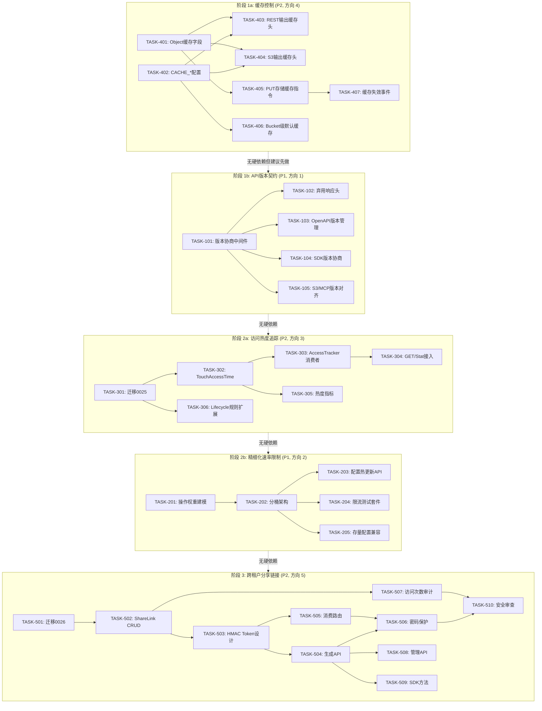
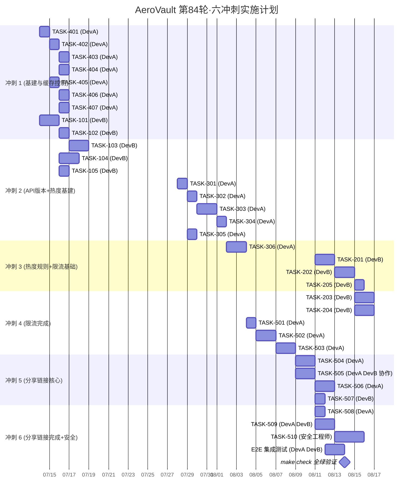

现在我已掌握全部代码上下文。以下是完整的技术主管分析：

---

# 技术主管分析报告：第 84 轮扩展

## 执行摘要

本分析涵盖五个高价值方向，总变更量约 1,180 行新增代码 + 4 次数据库迁移。建议按 **4 → 1 → 3 → 2 → 5** 顺序分两个阶段（P1/P2）在 6 个冲刺内交付，团队需 2 名后端开发 + 1 名安全工程师（仅方向 5）。

| 方向 | 工作量 | 风险 | 增量代码 | 迁移文件 |
|------|--------|------|---------|---------|
| 4. 缓存控制与 CDN | **S** (2-3天) | 极低 | ~150 行 | 无 |
| 1. API 版本契约 | **M** (4-5天) | 低 | ~200 行 | 无 |
| 3. 访问热度追踪 | **M** (3-4天) | 低 | ~180 行 | 0025 (双文件) |
| 2. 精细化速率限制 | **L** (5-6天) | 中 | ~250 行 | 无（配置格式变更） |
| 5. 跨租户分享链接 | **XL** (8-10天) | 中（安全） | ~400 行 | 0026 (双文件) |

---

## 1. 任务分解

### 方向 4：内容缓存控制与 CDN 集成层

| 任务 ID | 标题 | 涉及文件 | 前置 | 预估 | 验收标准 |
|---------|------|---------|------|------|---------|
| **TASK-401** | 对象元数据增加缓存字段 | `internal/repository/repository.go` (Object 结构), `internal/api/rest/dto.go` (objectDTO), `internal/service/file_crud.go` (PutOptions) | — | 2h | `Object` 包含 `CacheControl`/`ExpiresAt`，JSON 序列化正确，未设置时保持旧行为 |
| **TASK-402** | `CACHE_*` 全局配置项 | `internal/config/config.go` | TASK-401 | 1h | 环境变量 `CACHE_CONTROL_DEFAULT`, `CACHE_MAX_AGE_DEFAULT` 加载到 Config，默认值 `public, max-age=300` 和 `300` |
| **TASK-403** | REST GET 路径输出缓存头 | `internal/api/rest/handler.go` (handleRangeOrFull) | TASK-401, TASK-402 | 2h | GET 响应包含 `Cache-Control`, `Expires`, `Vary: Accept-Encoding`；对象有自定义设置时优先于全局默认 |
| **TASK-404** | S3 GET 路径输出缓存头 | `internal/api/s3compat/handler.go` (writeObjectHeaders) | TASK-401, TASK-402 | 2h | S3 响应包含 `Cache-Control`；PUT 时存入的 `Cache-Control` 在 GET 时原样输出 |
| **TASK-405** | PUT 时接收并存储缓存指令 | `internal/service/file_crud.go` (Put/PutOptions), `internal/repository/sql_objects.go` (CreateObject SQL) | TASK-401 | 2h | PUT 请求头 `Cache-Control`, `Expires` 存入对象元数据；未设置时使用 bucket 默认值 |
| **TASK-406** | Bucket 级默认缓存策略 | `internal/repository/repository.go` (BucketConfig), `internal/repository/sql_objects.go` (迁移或 bucket 行扩展) | TASK-402 | 2h | Bucket GET response 含 `x-amz-cache-control` 配置字段；未设置 bucket 级时降级到全局默认 |
| **TASK-407** | 缓存失效事件基础架构 | `internal/events/bus.go` (事件类型 + 消费者接口) | — | 2h | `EventCacheInvalidate` 类型定义，对象更新/删除时广播该事件，CDN 适配器接口 `CdnPurgeProvider` 定义 |

**方向 4 合计：~13h（含测试）**

---

### 方向 1：API 版本契约与向后兼容性策略

| 任务 ID | 标题 | 涉及文件 | 前置 | 预估 | 验收标准 |
|---------|------|---------|------|------|---------|
| **TASK-101** | API 版本协商中间件 | `internal/middleware/apiversion.go` (新文件), `cmd/server/main.go` (注册) | — | 4h | `Accept: application/vnd.aero-vault.v1+json` 或 `API-Version: 1` 头解析成功注入 `context`；无头默认 version=1；版本号不匹配返回 `400 VersionNotSupported` |
| **TASK-102** | 弃用响应头支持 | `internal/middleware/apiversion.go` (续), `internal/config/config.go` (SUNSET_* 配置) | TASK-101 | 2h | 配置 `API_V1_SUNSET_DATE`, `API_V1_DEPRECATION_ENABLED`；启用时所有 `/v1` 响应含 `Deprecation: true`, `Sunset: <date>` |
| **TASK-103** | OpenAPI spec 版本管理 | `internal/api/rest/openapi.json` (version 字段), `Makefile` (新增 `check-openapi` target), `HARNESS.md` (CI 门禁) | TASK-101 | 3h | `openapi.json` 中 `info.version = "1.0.0"`（API 版本独立于项目版本）；`make check` 包含 `openapi-spec-validator` 验证 |
| **TASK-104** | SDK 版本协商 | `sdk/go/aerovault/client.go`, `sdk/js/aero-vault.js`, `sdk/python/aero_vault.py` | TASK-101 | 3h | Go/JS/Python SDK 支持 `SetAPIVersion(int)` 方法，默认值与服务协商为最新；`Version` 常量从 `"0.4.0"` 改为语义化 SDK 版本 |
| **TASK-105** | S3/MCP 版本路径对齐 | `internal/api/s3compat/router.go`, `internal/mcp/server.go` (ListTools 元数据) | TASK-101 | 2h | S3 路径可选 `/s3/v1` 支持（保留 `/s3` 别名兼容）；MCP `listTools` 响应含 `tool.version` 字段 |

**方向 1 合计：~14h（含测试）**

---

### 方向 3：对象访问热度追踪与自适应存储分层基础

| 任务 ID | 标题 | 涉及文件 | 前置 | 预估 | 验收标准 |
|---------|------|---------|------|------|---------|
| **TASK-301** | 迁移 0025：`objects` 表增加热度字段 | `internal/repository/migrations/{sqlite,postgres}/0025_access_tracking.{up,down}.sql` | — | 2h | 双文件迁移应用后 `objects` 表有 `last_accessed_at TIMESTAMP` 列 + 索引，回滚完整 |
| **TASK-302** | Repository 层 `TouchAccessTime` 方法 | `internal/repository/repository.go` (接口), `internal/repository/sql_objects.go` (实现) | TASK-301 | 2h | `TouchAccessTime(ctx, tenant, bucket, key)` 在 SQLite/Postgres 中执行 `UPDATE objects SET last_accessed_at = ? WHERE tenant_id=? AND bucket=? AND key=?`；无对象不存在时静默成功（幂等） |
| **TASK-303** | `AccessTracker` 事件消费者（异步批量刷新） | `internal/service/access_tracker.go` (新文件), `internal/events/bus.go` (订阅者注册) | TASK-302 | 4h | 订阅 `EventAccessed` 事件；批量合并去重后每 `ACCESS_TRACKER_FLUSH_INTERVAL` (默认 5s) 执行一次批量 `TouchAccessTime`；`X-Skip-Access-Tracking: true` 请求头跳过追踪 |
| **TASK-304** | GET/Stat/HEAD 路径接入 AccessTracker | `internal/service/file_crud.go` (Get), `internal/service/file_features.go` (Stat) | TASK-303 | 2h | Read 路径在 `s.emit(ctx, obj, EventAccessed)` 后触发追踪；批量扫描作业可通过请求头跳过 |
| **TASK-305** | 热度可观测性指标 | `internal/telemetry/metrics.go` (新增 gauge/histogram) | TASK-301 | 2h | `storage_access_age_days` histogram + `storage_object_access_count` gauge；`/metrics` 可查询并按 bucket/tenant 分组 |
| **TASK-306** | 生命周期规则扩展 | `internal/reconcile/lifecycle.go` (规则解析), `internal/repository/repository.go` (LifecycleRule 结构) | TASK-301 | 3h | 支持 `condition: "last_accessed > 90d"` 规则类型；兼容现有 `updated_at` 规则 |

**方向 3 合计：~15h（含测试）**

---

### 方向 2：精细化成本感知速率限制

| 任务 ID | 标题 | 涉及文件 | 前置 | 预估 | 验收标准 |
|---------|------|---------|------|------|---------|
| **TASK-201** | 操作成本权重建模 | `internal/middleware/ratelimit.go` (NewWeightedLimiter), `internal/config/config.go` (EndpointWeight 配置) | — | 4h | `WeightedRateLimiter` 支持 `Allow(tenant, cost float64)` 接口；默认权重表：GET=1, HEAD=1, PUT=1+ceil(size/1MB), DELETE=1, SEARCH=10, CHAT=50, AGENT=200, ADMIN=1 |
| **TASK-202** | 分桶架构：读写管理员子桶 | `internal/middleware/ratelimit.go` (MultiBucketLimiter), `internal/api/rest/router.go` (路由分组) | TASK-201 | 4h | AI 分组内：`search/chat/agent/embed` 各独立子桶 + 父桶回退；非 AI 分组内：`read/write/admin` 子桶；配置通过 `RATE_LIMIT_{GROUP}_{RPS,BURST}` 环境变量 |
| **TASK-203** | 配置热更新 Admin API | `internal/api/rest/router.go` (新路由), `internal/middleware/ratelimit.go` (UpdateConfig) | TASK-202 | 3h | `POST /v1/admin/rate-limits` 接受 JSON 配置体，热更新限流器权重和 RPS；不中断在线请求；`GET /v1/admin/rate-limits` 返回当前配置快照 |
| **TASK-204** | 权重感知的限流测试套件 | `internal/middleware/ratelimit_test.go` (重构/扩展) | TASK-202 | 3h | 覆盖：大小 PUT 权重差异、子桶耗尽后父桶回退、配置热更新、并行请求公平性、配置兼容旧格式 |
| **TASK-205** | 存量配置兼容迁移 | `internal/config/config.go` (validateRateLimits 扩展) | TASK-202 | 2h | 旧 `RATE_LIMIT_RPS`+`BURST` 映射到 `read` 组默认值；启动时 warn log 提示迁移到新格式；`RATE_LIMIT_READ_RPS` 存在时优先 |

**方向 2 合计：~16h（含测试）**

---

### 方向 5：跨租户对象分享与公网分享链接

| 任务 ID | 标题 | 涉及文件 | 前置 | 预估 | 验收标准 |
|---------|------|---------|------|------|---------|
| **TASK-501** | 迁移 0026：`share_links` + `share_access_logs` 表 | `internal/repository/migrations/{sqlite,postgres}/0026_share_links.{up,down}.sql` | — | 2h | 双文件迁移建表（包含 token UNIQUE, password, expires_at, max_access, access_count, created_by）及索引 |
| **TASK-502** | Repository 层 `ShareLink` CRUD | `internal/repository/repository.go` (接口), `internal/repository/sql_share.go` (新文件) | TASK-501 | 3h | `CreateShareLink`, `GetShareLink`, `DeleteShareLink`, `IncrementAccessCount` 方法；SQLite/Postgres 双实现 |
| **TASK-503** | 自包含 HMAC Token 设计 | `internal/service/share_token.go` (新文件), `internal/config/config.go` (SHARE_TOKEN_SECRET) | TASK-502 | 4h | Token 为 HMAC-SHA256 签名的 JSON payload `{share_id, tenant, bucket, key, version_id, exp, access_limit}`；服务端验证签名无须查库即可拒绝无效/过期 token；`SHARE_TOKEN_SECRET` 环境变量可配置 |
| **TASK-504** | 分享链接生成 API | `internal/api/rest/handler_share.go` (新文件), `internal/api/rest/router.go` (路由注册 `POST /v1/admin/share`) | TASK-502, TASK-503 | 3h | 接收 `{bucket, key, version_id?, expires_in?, password?, max_access?}` → 返回 `{token, url}`；scope 校验 (admin)；`audit_log` 记录创建操作 |
| **TASK-505** | 分享链接消费路由 | `internal/api/rest/handler_share.go` (续), `internal/api/rest/router.go` (`GET /v1/share/{token}` — 在 auth 前注册) | TASK-503 | 4h | 匿名访问路径：验证 token 签名 → 解析 payload → 若已过期/超限返回 410 → 若密码保护提示输入 → 流式输出对象内容。**此路由在 auth middleware 之前注册**，严格签名验证替代认证 |
| **TASK-506** | 密码保护 + 暴力破解防护 | `internal/service/share_token.go` (ValidatePassword), `internal/repository/sql_share.go` (failed_attempts 字段) | TASK-504, TASK-505 | 3h | bcrypt 密码哈希；连续 5 次错误密码锁定 15 分钟；失败计数存储于 `share_links.failed_attempts` + `locked_until` |
| **TASK-507** | 访问次数限制+审计 | `internal/service/share_token.go` (ConsumeAccess), `internal/repository/sql_share.go` | TASK-505 | 2h | `IncrementAccessCount` 原子递增；第 N+1 次返回 410；每次访问写入 `audit_log` |
| **TASK-508** | 分享链接管理 API | `internal/api/rest/handler_share.go` (续): `DELETE /v1/admin/share/{token}`, `GET /v1/admin/share/{token}`, `GET /v1/admin/share` (list) | TASK-504 | 2h | DELETE 软删除（设置 `deleted_at`）；GET 返回分享详情（不含密码哈希）；List 支持分页 |
| **TASK-509** | SDK 分享方法 | `sdk/go/aerovault/client.go`, `sdk/js/aero-vault.js`, `sdk/python/aero_vault.py` | TASK-504, TASK-505 | 3h | `ShareFile(bucket, key, opts)` 返回 `ShareLinkInfo`；`GetSharedFile(token)` 下载分享文件；`RevokeShare(shareID)` 撤销 |
| **TASK-510** | 安全审查 + 渗透测试 | 安全文档 + 攻防演练 | TASK-506, TASK-507 | 4h | 安全审查清单涵盖：token 伪造、密码暴力破解、SSRF（分享链接指向内网资源）、路径遍历、时间侧信道。所有发现修复或记录为已知限制 |

**方向 5 合计：~30h（含测试和安全审查）**

---

## 2. 执行顺序与依赖图

### 整体依赖图

### 可并行执行的组

| 并行组 | 任务 | 说明 |
|--------|------|------|
| **G1** (第 1-2 天) | TASK-401, TASK-402, TASK-101 | 三个方向的基础数据结构互不依赖 |
| **G2** (第 3-4 天) | TASK-403, TASK-404, TASK-405, TASK-102, TASK-103 | 方向 4 的三个 GET/PUT 改动可并行编码；方向 1 的弃用头与 SDK 互不依赖 |
| **G3** (第 5-7 天) | TASK-301, TASK-201 | 迁移编号不可冲突，但方向 3 和方向 2 的基础数据结构独立 |
| **G4** (第 8-11 天) | TASK-501, TASK-502, TASK-503 | 方向 5 的迁移+CRUD+Token 设计可流水线执行 |

---

## 3. 技术风险

### 风险矩阵

| # | 风险 | 方向 | 概率 | 影响 | 缓解策略 |
|---|------|------|------|------|---------|
| **R1** | **限流权重配置导致回归**：旧配置只需 `RPS`/`Burst`，新权重系统可能使升级中的用户产生意外 429 | 2 | 中 | 高 | TASK-205 的兼容迁移层必须在方向 2 合并前完成；默认权重所有路由=1，完全等价旧行为 |
| **R2** | **分享链接消费路由绕过认证的路径遍历**：`GET /v1/share/{token}` 在 auth 前注册，若 token 验证不当可能泄露任意对象 | 5 | 中 | 严重 | TASK-510 必须包含：token 严格 HMAC 验证 + payload 内 `tenant/bucket/key` 的路径遍历检查 + 回归测试覆盖 SSRF 攻击向量 |
| **R3** | **AccessTracker 批量更新造成竞态**：同一对象的高频 GET 可能导致批量更新丢失中间访问时间戳 | 3 | 低 | 中 | 设计采用 `last_accessed_at = MAX(existing, now)` 并确保 `TouchAccessTime` 在存储层是幂等且仅推后不推前 |
| **R4** | **OpenAPI spec 与实际 handler 漂移**：手动维护的 `openapi.json` 与 handler 代码不同步，版本号形同虚设 | 1 | 高 | 中 | TASK-103 必须包含 `make check` 阶段的自动校验（如 `openapi-spec-validator` + response body schema 比对）。考虑未来引入 `oapi-codegen` 生成 handler 接口 |
| **R5** | **Cache-Control 与预签名 URL 冲突**：预签名 URL 如果设置 `Cache-Control: public, max-age=86400` 可能导致 CDN 缓存预签名内容导致授权失效 | 4 | 中 | 高 | TASK-403 需为预签名 URL 路径强制设置 `Cache-Control: private, no-cache`，覆盖对象级设置 |
| **R6** | **SDK 版本协商的兼容性矩阵扩张**：在 SDK 中维护多版本请求/响应格式会显著增加测试矩阵复杂度 | 1 | 低 | 中 | TASK-104 的 SDK 改动仅限 HTTP 头部协商，不涉及多版本 body schema；body 版本化留待后续轮次 |

### 技术债务管理

| 预见的债务 | 产生于 | 何时偿还 |
|-----------|--------|---------|
| Cache-Control 仅存于对象元数据，非独立缓存层 | D4 的简单实现 | 当需要 CDN purge 事件+适配器时（TASK-407 仅定义接口） |
| API 版本协商仅支持路径前缀 + Accept 头，无 body schema 版本化 | D1 的增量实现 | 第 85+ 轮（非兼容变更需求出现时） |
| 热度指标基于 Prometheus，非存储层原生 | D3 的事件驱动模式 | 转为 SQL 分析查询（`GET /v1/admin/stats/access`）时 |

---

## 4. 资源评估

### 团队配置

| 角色 | 人数 | 专注方向 | 关键技能要求 |
|------|------|---------|------------|
| **后端工程师 A** (中/高) | 1 | 方向 4（全部）+ 方向 3 | Go HTTP handler 开发、SQL 迁移、事件驱动模式 |
| **后端工程师 B** (中/高) | 1 | 方向 1（全部）+ 方向 2 | API 设计、中间件架构、限流算法、配置兼容性 |
| **安全工程师** (兼职) | 0.5 | 方向 5（TASK-510）+ 代码审查 | Web 安全、HMAC/加密、渗透测试 |
| **后端工程师 A/B 协作** | 2 | 方向 5（分摊） | — |
| **SDK 开发者** (可选) | 0.3 | 方向 1 (TASK-104) + 方向 5 (TASK-509) | Go/JS/Python 三语言 |

### 关键里程碑

| 里程碑 | 时间 | 交付物 | 验证方式 |
|--------|------|--------|---------|
| **M1: 缓存控制上线** | 冲刺 1 末 (第 2 周) | D4 全部 7 个任务 | `make check` + 手动 `curl` 验证 `Cache-Control` header |
| **M2: API 版本契约上线** | 冲刺 2 末 (第 4 周) | D1 全部 5 个任务 | SDK 集成测试连接 `/v1` 并验证 `Deprecation` 头；`make check` 含 openapi 校验 |
| **M3: 热度追踪基建就绪** | 冲刺 3 末 (第 6 周) | D3 全部 6 个任务 | `GET` 后查询 DB 确认 `last_accessed_at` 已更新；`/metrics` 有热度指标 |
| **M4: 精细化限流上线** | 冲刺 4 末 (第 8 周) | D2 全部 5 个任务 | 权重 PUT 大文件验证 `Retry-After`；旧配置启动无 warn |
| **M5: 分享链接公测** | 冲刺 5-6 (第 10-12 周) | D5 全部 10 个任务 | 生成/消费/撤销完整 E2E 测试；安全审查报告通过 |

### 阻塞点与解决策略

| 阻塞点 | 影响方向 | 解决策略 |
|--------|---------|---------|
| **openapi-spec-validator 工具未安装** | D1 (TASK-103) | 在 `Makefile` 中 auto-install 或使用 `go install github.com/pb33f/openapi-validator/cmd/openapi-spec-validator@latest`；Docker 化 CI 中预装 |
| **bcrypt 库已存在 go.mod 中？** | D5 (TASK-506) | 若不存在，需 `go get golang.org/x/crypto/bcrypt` (已验证为间接依赖，无新增依赖风险) |
| **并发安全：HMAC token 验证占用计算资源** | D5 (TASK-505) | token 验证为无状态 + O(1) 计算，无须担忧。但需考虑 `password` bcrypt 验证的 CPU 开销（每个请求 5-20ms） |

---

## 5. 质量保证

### 单元测试覆盖要求

| 方向 | 强制覆盖组件 | 覆盖率目标 | 测试工具 |
|------|------------|-----------|---------|
| **D4** | `handleRangeOrFull` 缓存头输出、`PutOptions` 缓存字段序列化、`writeObjectHeaders` 头输出 | ≥85% | `net/http/httptest` |
| **D1** | `apiversion.go` 中间件解析、SDK `SetAPIVersion`、弃用头生成逻辑 | ≥90% | `httptest` + 表驱动测试 |
| **D3** | `TouchAccessTime` 幂等性、`AccessTracker` 批量去重/合并、`X-Skip-Access-Tracking` 跳过逻辑 | ≥80% | `testify` mock + SQLite 内存 |
| **D2** | `WeightedRateLimiter.Allow(cost)` 多权重消费、子桶回退、配置热更新、并发安全 | ≥85% | `sync.WaitGroup` 并发测试 + 基准测试 |
| **D5** | Token 签名/验证、密码 bcrypt 验证/暴力破解、`IncrementAccessCount` 原子性、过期/超限 410 | ≥80% | `httptest` + SQLite 内存 + `testify` |

### 集成测试策略

| 测试套件 | 覆盖范围 | 运行方式 | 说明 |
|---------|---------|---------|------|
| **`TestRestHandlers`** (已有) | D4: GET 缓存头、PUT 存储/输出 | `go test ./internal/api/rest/` | 扩展现有 handler 测试，新增 `TestCacheControl` |
| **`TestS3Compat`** (已有) | D4: S3 GET/PUT 缓存头 | `go test ./internal/api/s3compat/` | 扩展现有 `TestWriteObjectHeaders` |
| **`TestAccessTracker`** (新增) | D3: 批量刷新、跳过标记 | `go test ./internal/service/ -run TestAccessTracker` | 新文件 `access_tracker_test.go` |
| **`TestWeightedRateLimiter`** (新增) | D2: 权重消费、并发公平性 | `go test ./internal/middleware/ -run TestWeightedRateLimiter` | 新文件 `ratelimit_weighted_test.go` |
| **`TestShareLinkE2E`** (新增) | D5: 生成→消费→撤销→过期 | `go test ./internal/api/rest/ -run TestShareLink` | E2E HTTP 测试，走完整路由链 |
| **`TestAPIVersionMiddleware`** (新增) | D1: Accept 头解析、版本不匹配 | `go test ./internal/middleware/ -run TestAPIVersion` | 新文件 `apiversion_test.go` |

### 代码审查检查点

| 检查点 | 方向 | 审查要点 |
|--------|------|---------|
| **安全敏感路由注册** | D5 (TASK-505) | `GET /v1/share/{token}` 在 `main.go` 的路由注册位置是否正确（位于 auth 前但不在 rate-limit-bypass 列表中？严格 HMAC 验证覆盖） |
| **配置向后兼容** | D2 (TASK-205) | 仅有 `RATE_LIMIT_RPS` 的旧配置启动无报错；新字段默认值与旧等效 |
| **并发安全** | D2, D3, D5 | `sync.Mutex` 保护所有限流器状态；`AccessTracker` 的批量 map 使用 `sync.Map` 或 `sync.RWMutex`；`IncrementAccessCount` 使用 DB 原子 UPDATE |
| **迁移双文件一致性** | D3 (0025), D5 (0026) | up/down SQL 严格对称；SQLite 和 Postgres 的 DDL 语义等价 |
| **硬编码不变量不违反** | 全部 | 无 `utils/`/`common/`/`helper/` 包；单函数 ≤50 行；单文件 ≤500 行 |

### 性能测试需求

| 测试场景 | 方向 | 指标 | 阈值 |
|---------|------|------|------|
| **大 PUT 权重限流** | D2 | 10GB PUT 在 1RPS 配置下是否被自然节流 | 首次请求通过，后续约 10 秒内 429 |
| **高并发 GET + 缓存头** | D4 | 1000 并发 GET 响应头含 `Cache-Control` | 无性能退化（±5% p99 latency） |
| **AccessTracker 批量刷新延迟** | D3 | 1000 次 GET 后 `last_accessed_at` 更新延迟 | < 10 秒（flush interval 4s + 1s 处理偏差） |
| **Token 验证吞吐** | D5 | `/v1/share/{token}` 纯验证（无 I/O） | > 10,000 RPS |
| **限流器分区对吞吐影响** | D2 | 10 goroutine 并行调用带限流 vs 不带 | < 5% 额外延迟 |

---

## 6. 实施计划

### 冲刺规划甘特图

> 假设 2 周冲刺，2 名开发人员（DevA: 方向 4+3，DevB: 方向 1+2，协作: 方向 5）

### 详细时间线

#### 冲刺 1（第 1-2 周）— 方向 4 全线 + 方向 1 中间件

| 天 | DevA | DevB | 里程碑检查 |
|---|------|------|-----------|
| 1-2 | TASK-401: Object 缓字段 + PutOptions | TASK-101: 版本协商中间件 | 数据结构设计评审 |
| 3-4 | TASK-402 + TASK-405: 配置+PUT | TASK-102: 弃用头 | 中间件插入 router 后手动验证 |
| 5-7 | TASK-403 + TASK-404: REST/S3 输出 | TASK-101 测试补全 | `curl GET /v1/files/...` 验证 `Cache-Control` |
| 8-9 | TASK-406 + TASK-407: Bucket 默认+事件 | 方向 1 测试完整覆盖 | `make check` 全绿 |
| 10 | 冲刺演示 + 回顾 | | **M1 交付** |

#### 冲刺 2（第 3-4 周）— 方向 1 完成 + 方向 3 基建

| 天 | DevA | DevB | 里程碑检查 |
|---|------|------|-----------|
| 1-2 | TASK-301: 迁移 0025 | TASK-103: OpenAPI 版本管理 | 迁移应用/回滚测试 |
| 3-4 | TASK-302: TouchAccessTime | TASK-104: SDK 版本协商 | `openapi-spec-validator` CI 集成 |
| 5-7 | TASK-303: AccessTracker 消费者 | TASK-105: S3/MCP 版本 | 双人代码审查 |
| 8-9 | TASK-304 + TASK-305: GET 接入+指标 | 方向 1 E2E 测试 | 热度指标 `/metrics` 可视化 |
| 10 | 冲刺演示 + 回顾 | | **M2 交付** |

#### 冲刺 3（第 5-6 周）— 方向 3 完成 + 方向 2 基础

| 天 | DevA | DevB | 里程碑检查 |
|---|------|------|-----------|
| 1-2 | TASK-306: Lifecycle 规则扩展 | TASK-201: 操作权重建模 | 生命周期规则解析测试 |
| 3-5 | 方向 3 集成测试 + bug 修复 | TASK-202: 分桶架构 | `RATE_LIMIT_*` 新配置环境变量 |
| 6-7 | 方向 3 文档 + 团队知识分享 | TASK-205: 存量兼容迁移 | 旧配置启动无报错 |
| 8-10 | 冲刺演示 + 回顾 | TASK-202 测试补全 | **M3 交付** |

#### 冲刺 4（第 7-8 周）— 方向 2 完成 + 方向 5 迁移

| 天 | DevA | DevB | 里程碑检查 |
|---|------|------|-----------|
| 1-3 | TASK-501: 迁移 0026 | TASK-203: 配置热更新 API | 热更新不影响在线请求测试 |
| 4-5 | TASK-502: ShareLink CRUD | TASK-204: 限流测试套件 | 权重 PUT/GET 公平性测试 |
| 6-7 | TASK-503: HMAC Token | 方向 2 基准测试 | Token 签名/验证单元测试 |
| 8-10 | 冲刺演示 + 回顾 | | **M4 交付** |

#### 冲刺 5（第 9-10 周）— 方向 5 核心

| 天 | DevA | DevB | 里程碑检查 |
|---|------|------|-----------|
| 1-3 | TASK-504: 生成 API | TASK-505: 消费路由 (auth bypass) | 路由安全位置审查 |
| 4-6 | TASK-506: 密码+暴力破解 | TASK-507: 访问计数+审计 | bcrypt 失败锁定测试 |
| 7-9 | TASK-508: 管理 API | TASK-509: SDK 方法 (Go/JS) | SDK 集成测试 |
| 10 | 冲刺演示 + 内部 Beta | | 分享链接功能可演示 |

#### 冲刺 6（第 11-12 周）— 完成 + 安全审查

| 天 | DevA | DevB | 安全工程师 |
|---|------|------|-----------|
| 1-2 | SDK 方法 (Python) + 文档 | TASK-509 测试补全 | TASK-510 安全审查开始 |
| 3-5 | Bug 修复 + 性能优化 | E2E 集成测试 | TASK-510 渗透测试 |
| 6-7 | 安全审查发现修复 | 安全审查修复 | 最终报告 |
| 8-9 | `make check` 全绿验证 | 发布说明撰写 | |
| 10 | **发布 + 演示** | | **M5 交付** |

---

## 总结建议

### 实施优先级调整建议

文档建议的 **4 → 1 → 3 → 2 → 5** 顺序从技术风险角度合理，但我建议微调：

1. **方向 4（缓存控制）** 作为热身任务，让团队快速建立信心 → 优先执行 ✅
2. **方向 1（API 版本）** 和 **方向 3（热度追踪）** 的基建部分（TASK-101 + TASK-301）**可并行**，因为代码路径完全不交叉 → 冲刺 1-2 并行
3. **方向 2（精细化限流）** 建议略晚于方向 3，因为其配置格式变更需要更充分的测试 → 冲刺 3-4
4. **方向 5（分享链接）** 留在最后以积累安全审查经验 → 冲刺 5-6

### 关键风险提示

- **方向 5 的安全设计**不能走捷径：`GET /v1/share/{token}` 路由的注册位置是 auth bypass，必须经过架构师+至少 2 人代码审查 + 渗透测试
- **方向 2 的配置迁移**是隐形的回归风险：CI gate 必须在 `make check` 中用旧配置格式跑通
- **方向 3 的 `last_accessed_at` 更新延迟**在大流量下可能累积；初期可接受 5-10 秒延迟，若需要实时数据需切换到带内同步更新（增加存延迟但保障数据准确性）

### 开始实施

我已准备好开始实现。请指定从哪个方向（按上文的冲刺计划）启动，我将读取对应代码锚点的最新代码状态并制定逐文件实施步骤。
