现在我已完整了解分析文档和代码库。以下是全面的技术负责人分析。

---

# Tech Lead 分析报告：第 85 轮跨层集成 — 实施蓝图

## 1. 任务分解

以下 5 个方向被分解为可执行的任务。每个任务 **2-4 小时**，其依赖关系、验收标准均已指定。遵循验证报告中修正后的优先级：**方向 2 → 方向 3 → 方向 1 → 方向 4 → 方向 5**。

---

### 方向 2：CB 可观测性（Ops 基础设施 — 最先完成）

| ID | 标题 | 文件 | 前置条件 | 时长 | 验收标准 |
|----|-------|-------|-----------|------|-------------|
| T2-01 | 向 `Storage` 接口添加 `Healthy() bool` | `internal/storage/storage.go`, `internal/storage/circuitbreaker.go`, `internal/storage/local.go`, `internal/storage/s3.go`, `internal/storage/oss.go`, `internal/storage/cos.go` | 无 | 2h | `Healthy()` 存在于 `Storage` 接口中，所有 4 个后端均已实现。`circuitBreaker`：`CBOpen` 时返回 `false`，否则返回 `true`。本地存储始终返回 `true`。 |
| T2-02 | 将 CB 指标挂接到 Prometheus | `internal/storage/factory.go`, `internal/telemetry/metrics.go` | T2-01 | 2h | `storage_backend_state{backend}`（gauge，0/1/2）和 `storage_backend_requests_total{backend,status}`（counter）在 `/metrics` 上可见。`recordOutcome` 会递增 counters。 |
| T2-03 | 扩展 readyz 以考虑 CB 状态 | `cmd/server/main.go`（`readyzHandler`） | T2-01 | 1h | 当任何后端的断路器处于打开状态时，`GET /readyz` 返回 `503`。Healthz 不受影响。 |
| T2-04 | Grafana 存储后端健康面板 | `deploy/grafana/` | T2-02 | 2h | 仪表盘包含 1 个状态面板（断路器状态时序图）和 1 个速率面板（请求/失败/Hz）。 |
| T2-05 | 当 failure_ratio > 10% 持续 5 分钟时触发 Prometheus 告警 | `deploy/prometheus/alerts.yml` | T2-02 | 1h | 规则 `HighStorageBackendFailureRate` 存在且可评估。 |

**方向 2 总工时：8 小时**

---

### 方向 3：AI Provider 弹性（AI 可靠性 — 第二）

| ID | 标题 | 文件 | 前置条件 | 时长 | 验收标准 |
|----|-------|-------|-----------|------|-------------|
| T3-01 | 为 AI providers 创建共享的 `HTTPClientProvider` | 新建 `internal/ai/http.go`，同时从 `storage.NewHTTPClient` 重构工具函数 | 无 | 2h | 包 `ai` 导出一个函数 `NewHTTPClient(tc TimeoutConfig) *http.Client`，该函数复用 `http.Transport` 连接池。 |
| T3-02 | 为 Embedder 实现 CB 包装器 | 新建 `internal/ai/cb_embedder.go`，`internal/ai/cb_llm.go`，`internal/ai/cb_reranker.go` | T3-01 | 4h | `CBEmbedder` 实现了 `ai.Embedder`，并在 `Storage` 模式之后包装了断路器逻辑。失败次数 > 阈值时，后续调用返回错误 `ErrAIProviderUnavailable`。 |
| T3-03 | 为 LLM 实现 CB 包装器 | 同 T3-02（`cb_llm.go`） | T3-01 | 2h | `CBLLM` 实现了 `ai.LLM`（`Chat` 和 `ChatStream`），并用 CircuitBreaker 保护两者。 |
| T3-04 | 为 Reranker 实现 CB 包装器 | 同 T3-02（`cb_reranker.go`） | T3-01 | 2h | `CBReranker` 实现了 `ai.Reranker`，并用断路器包裹。 |
| T3-05 | 为 RemoteExtractor 和 Antivirus Scanner 添加 CB 包装器 | `internal/ai/extractor_remote.go`, `internal/antivirus/scanner.go` | T3-01 | 2h | 远程提取器和 HTTP 杀毒软件都使用了共享的、支持 CB 的 HTTP 客户端。 |
| T3-06 | `main.go` 集成：在 builder 链中接入 CB | `cmd/server/main.go`（`buildEmbedder`, `buildLLM`, `buildReranker`, `buildScanner`） | T3-02, T3-03, T3-04, T3-05 | 2h | 构建函数返回包装后的 providers。配置 `AI_*_CB_ENABLED=true` 可激活。 |
| T3-07 | AI Provider 指标 | `internal/telemetry/metrics.go`, `internal/ai/cb_*.go` | T3-02, T3-06 | 2h | `ai_provider_requests_total{provider,status}` 和 `ai_provider_cb_state{provider}` 在 `/metrics` 上可见。 |

**方向 3 总工时：16 小时**

---

### 方向 1：后处理管道（平台化 — 第三）

| ID | 标题 | 文件 | 前置条件 | 时长 | 验收标准 |
|----|-------|-------|-----------|------|-------------|
| T1-01 | 定义 `Processor` 接口和 `Pipeline` 注册表 | 新建 `internal/pipeline/pipeline.go`，`internal/pipeline/processor.go` | 无 | 3h | `Processor` 接口定义了 `Name()`, `ContentTypes()`, `Process()`。`Pipeline` 提供了 `Register(p Processor)` 和 `Match(contentType) []Processor`。包含用于 content-type glob 匹配的辅助函数。 |
| T1-02 | 实现 Pipeline Runner（EventBus 消费者） | 新建 `internal/pipeline/runner.go` | T1-01 | 3h | Runner 订阅 `EventCreated`，通过 Content-Type 匹配 processors，并串行执行。失败时，将错误记录并排入 `jobs` 队列以进行重试（使用 `ErrWillProcessAsync` 模式处理大文件）。 |
| T1-03 | 从请求时路径迁移并实现 ThumbnailProcessor | 新建 `internal/pipeline/thumbnail.go`，从 `internal/thumbnail/thumbnail.go` 重构 | T1-02 | 3h | 对象上传后，ThumbnailProcessor 会异步生成 256px 的 JPEG 缩略图，并将其写入 `_processed/thumbnails/{key}`。REST `GET /thumbnail` 现在使用该文件（如果存在），否则回退为按需生成。 |
| T1-04 | 实现 MetadataExtractor（PDF 作为初始目标） | 新建 `internal/pipeline/metadata.go` | T1-02 | 3h | 上传 `application/pdf` 后，处理器提取（页数、标题、作者）并将其作为对象标签写入。 |
| T1-05 | Pipeline 指标和错误处理 | `internal/pipeline/runner.go`, `internal/telemetry/metrics.go` | T1-02 | 2h | `pipeline_processed_total{processor,content_type,status}` 计数器可见。失败会通过 jobs 重试。Processor panic 不会使 runner 崩溃。 |
| T1-06 | 在 main.go 中注册 Processor | `cmd/server/main.go`, `internal/pipeline/factory.go` 新建 | T1-02, T1-03, T1-04 | 2h | 启动时，thumbnail 和 metadata processor 已注册。ThumbnailProcessor 的 content-type pattern 为 `image/*`。 |

**方向 1 总工时：16 小时**

---

### 方向 4：S3 Batch Operations（批量管理 — 第四）

| ID | 标题 | 文件 | 前置条件 | 时长 | 验收标准 |
|----|-------|-------|-----------|------|-------------|
| T4-01 | 扩展 `jobs` 表以支持批处理跟踪 | 迁移：`migrations/{sqlite,postgres}/XXXX_batch_jobs.up.sql`，`internal/repository/repository.go`，`internal/repository/batch.go` 新建 | 无 | 4h | `batch_jobs` 表包含列：`id, type, status, manifest_ref, total_objects, completed_objects, failed_objects, report_prefix, created_at`。新增方法 `CreateBatchJob`, `UpdateBatchProgress`, `GetBatchJob`。 |
| T4-02 | 实现 `POST /v1/admin/batch` REST 端点 | `internal/api/rest/handler.go`, `internal/api/rest/router.go` | T4-01 | 3h | 接受 JSON 负载 `{type, objects:[], report_config}`，返回 `{batch_id, status, created_at}`。将作业排入 `jobs` 队列。 |
| T4-03 | 实现批处理作业处理器（复制、恢复、删除、设置标签） | 新建 `internal/jobs/batch_handler.go`，指向 `service.FileService` | T4-02, T1-00（作业基础设施已存在） | 4h | 每种操作类型都有一个处理程序，遍历对象清单并调用现有的 FileService 方法。部分失败会被跟踪到 `failed_objects`。 |
| T4-04 | 批处理进度 API | `internal/api/rest/handler.go`（`GET /v1/admin/batch/{id}`） | T4-02 | 2h | 返回 `{batch_id, status, total, completed, failed, created_at, completed_at}` |
| T4-05 | S3 XML 兼容端点 `POST /?batch` | `internal/api/s3compat/handler.go` | T4-02, T4-03 | 3h | 接受 S3 XML 批处理作业定义，映射到内部批处理模型，返回 XML 响应。 |
| T4-06 | 批量完成报告 | `internal/jobs/batch_handler.go` + `internal/events/bus.go` | T4-03 | 2h | 批处理完成后，通过 EventBus 发射 `batch.completed` 事件。将 CSV 报告写入配置的目标。 |

**方向 4 总工时：18 小时**

---

### 方向 5：访问治理（多租户企业 — 最后）

| ID | 标题 | 文件 | 前置条件 | 时长 | 验收标准 |
|----|-------|-------|-----------|------|-------------|
| T5-01 | 对象访问审计表 + 迁移 | `migrations/{sqlite,postgres}/XXXX_object_access_log.up.sql`，`internal/repository/repository.go`，`internal/repository/audit.go` | 无 | 3h | `object_access_log` 表包含 `id, tenant, bucket, key, operation, caller, protocol, created_at`。新增方法 `RecordObjectAccess(ctx, entry)`。 |
| T5-02 | 异步审计写入器（缓冲 + 批量刷新 + 采样） | 新建 `internal/repository/audit_writer.go` | T5-01 | 3h | `AuditWriter` 启动一个 goroutine，使用缓冲通道（缓冲区 128），每 500ms 或缓冲区满时批量刷新。支持 `AUDIT_SAMPLE_RATE=0.01`。刷新失败会记录日志但不会丢失审计跟踪（回退到直接写入）。 |
| T5-03 | 将审计钩子接入 GET/HEAD/LIST/DELETE | `internal/service/file_crud.go`（Get/Head/List/Delete） | T5-02 | 2h | 所有 4 个路径在被 `AUDIT_OBJECT_ACCESS=true` 启用后，通过 `AuditWriter` 记录访问审计。 |
| T5-04 | 操作加权限流 | `internal/middleware/ratelimit.go`，`internal/config/config.go` | 无 | 3h | RateLimiter 支持操作权重：PUT=2, DELETE=2, GET=1, LIST=1, Search=5, Chat=10。通过 `RATE_LIMIT_WEIGHTS=Get:1,Put:2,Delete:2,...` 配置。从请求上下文中提取操作类型。 |
| T5-05 | 扩展 TenantQuota 支持读取限制 | `internal/repository/quota.go`（迁移 + 字段），`internal/config/config.go` | 无 | 2h | `TenantQuota` 获得 `MaxReads`，`UsedReads` 字段和迁移。配额检查在 GET/HEAD 时进行。 |
| T5-06 | 创建 `AccessGovernance` 中间件 | 新建 `internal/middleware/governance.go` | T5-03, T5-04, T5-05 | 4h | 可选中间件，依次执行：配额 O(1) 检查 → 加权限流检查 → 审计写入。通过配置标志启用。如果任何检查失败，则返回 429 或 403。添加 < 2ms 延迟（审计异步写入）。 |

**方向 5 总工时：17 小时**

---

### 任务汇总表

| 方向 | 任务数 | 总工时 | 文件数 | 复杂度 |
|-----------|--------|---------|---------|----------|
| 2：CB 可观测性 | 5 | 8h | ~10 | S |
| 3：AI 弹性 | 7 | 16h | ~12 | M |
| 1：处理管道 | 6 | 16h | ~10 | M |
| 4：S3 Batch | 6 | 18h | ~14 | L |
| 5：访问治理 | 6 | 17h | ~15 | L |
| **总计** | **30** | **75h** | **~61** | |

---

## 2. 执行顺序与依赖图

```mermaid
graph TD
    subgraph "Phase 1: Ops Foundation (Week 1)"
        T2_01["T2-01: Healthy() on Storage"] --> T2_02["T2-02: CB Prometheus metrics"]
        T2_01 --> T2_03["T2-03: readyz CB check"]
        T2_02 --> T2_04["T2-04: Grafana panel"]
        T2_02 --> T2_05["T2-05: Prometheus alert"]
    end

    subgraph "Phase 2: AI Resilience (Week 2)"
        T3_01["T3-01: Shared HTTP client provider"] --> T3_02["T3-02: CB Embedder"]
        T3_01 --> T3_03["T3-03: CB LLM"]
        T3_01 --> T3_04["T3-04: CB Reranker"]
        T3_01 --> T3_05["T3-05: CB Extractor + Antivirus"]
        T3_02 --> T3_06["T3-06: main.go builder integration"]
        T3_03 --> T3_06
        T3_04 --> T3_06
        T3_05 --> T3_06
        T3_06 --> T3_07["T3-07: AI provider metrics"]
    end

    subgraph "Phase 3: Pipeline (Week 3-4)"
        T1_01["T1-01: Processor interface + Registry"] --> T1_02["T1-02: Pipeline runner (EventBus consumer)"]
        T1_02 --> T1_03["T1-03: ThumbnailProcessor"]
        T1_02 --> T1_04["T1-04: MetadataExtractor"]
        T1_02 --> T1_05["T1-05: Pipeline metrics + error handling"]
        T1_03 --> T1_06["T1-06: main.go factory wiring"]
        T1_04 --> T1_06
        T1_05 --> T1_06
    end

    subgraph "Phase 4: Batch Operations (Week 5-6)"
        T4_01["T4-01: DB migration + batch repo"] --> T4_02["T4-02: POST /v1/admin/batch REST"]
        T4_01 --> T4_03["T4-03: Batch job handlers"]
        T4_02 --> T4_04["T4-04: Batch progress API"]
        T4_02 --> T4_05["T4-05: S3 XML /?batch compat"]
        T4_03 --> T4_06["T4-06: Completion report + events"]
    end

    subgraph "Phase 5: Governance (Week 7-8)"
        T5_01["T5-01: Object access audit table"] --> T5_02["T5-02: Async audit writer"]
        T5_02 --> T5_03["T5-03: Audit hooks in GET/HEAD/LIST/DELETE"]
        T5_04["T5-04: Operation-weighted rate limiting"]
        T5_05["T5-05: TenantQuota read limits"]
        T5_03 --> T5_06["T5-06: AccessGovernance middleware"]
        T5_04 --> T5_06
        T5_05 --> T5_06
    end

    T2_02 -.->|informs| T3_07
    T1_02 -.->|reuses jobs.Pool| T4_03
    T2_03 -.->|readyz pattern| T5_06
```



**可并行的任务组：**
- **并行组 A**（第 1 周全部）：T2-01，T3-01 — 两者都对剩余的依赖项没有依赖关系
- **并行组 B**（第 2 周全部）：T3-02，T3-03，T3-04，T3-05 — 都在 T3-01 之后，彼此独立
- **并行组 C**（第 3 周全部）：T1-03，T1-04，T1-05 — 都在 T1-02 之后，彼此独立
- **并行组 D**（第 5 周全部）：T4-02，T4-03 — 都在 T4-01 之后，可以并行实现
- **并行组 E**（第 7 周全部）：T5-04，T5-05 — 彼此独立，与 T5-01 并行

---

## 3. 技术风险

### 风险 1：CB `Stats()` 中的 total 计数器语义不明确（T2-02）
| 属性 | 评估 |
|--------|----------|
| **问题** | `circuitBreaker.Stats()` 中的 `total` 是一个 60 秒滑动窗口的和，而不是累计计数。Prometheus 增量会更清晰，但 `recordOutcome` 当前在内部维护计数器。滑动窗口对于断路器行为有语义合理性，但与 Prometheus 指标的期望不符。 |
| **影响** | 工程师可能会将 `total=50` 误解为“自启动以来的请求”，而实际上它只是“过去 60 秒的请求”。 |
| **缓解措施** | 在 `circuitBreaker` 上添加一个 `totalRequests` 和 `totalFailures` 的原子累加器，用于 Prometheus 指标观测。让 `Stats()` 保持现有的滑动窗口语义以用于断路器逻辑。 |

### 风险 2：CB 误触发导致 AI provider 错误降级（T3-02 → T3-06）
| 属性 | 评估 |
|--------|----------|
| **问题** | AI provider（尤其是 LLM）可能偶发性超时（网络抖动、提供商节流）。如果断路器阈值设置过低，这些偶发性超时可能导致 `CBOpen`，从而阻止合法请求。 |
| **影响** | 搜索/聊天在高峰时段出现虚假的 503 错误。 |
| **缓解措施** | 初始阈值保守：`AI_PROVIDER_CB_FAILURE_THRESHOLD=10`（而不是存储的 5），`AI_PROVIDER_CB_RECOVERY_TIMEOUT=60s`。添加“半开状态下连续成功计数阈值”配置参数。使用 `ai_provider_cb_state` 仪表盘进行监控，并根据生产数据进行调优。 |

### 风险 3：审计写入器压力下的反压（T5-02）
| 属性 | 评估 |
|--------|----------|
| **问题** | 在 `AUDIT_SAMPLE_RATE=1.0` 的高吞吐量（100K QPS GET）下，异步审计写入器可能会在缓冲区填满时产生反压，从而延迟请求处理。 |
| **影响** | GET 延迟因审计缓冲区满而出现尖峰。 |
| **缓解措施** | 使用无锁循环缓冲区并设置可配置的大小。如果缓冲区达到 90% 容量，**丢弃事件**而非阻塞（审计丢失可接受，但请求失败不可接受）。`audit_dropped_total` 指标跟踪丢弃的事件。多级写入器：通道（非阻塞）→ 内部缓冲区 → 批量刷新。如果通道已满，则丢弃。 |

### 风险 4：大文件管道处理器（T1-03，T1-04）
| 属性 | 评估 |
|--------|----------|
| **问题** | `Processor.Process(ctx, obj, r io.Reader)` 传递 `io.Reader`，但 ThumbnailProcessor 在处理之前将整个文件读入内存。对于 500MB 的 PNG，这会消耗 ~1.5GB 的解码内存。 |
| **影响** | OOM 崩溃或 GC 压力，导致请求延迟尖峰。 |
| **缓解措施** | 在 Processor 返回 `ErrWillProcessAsync` 时，由 Pipeline Runner 将大文件分派到 `jobs.Pool`（由配置的 `PIPELINE_MAX_SYNC_BYTES` 触发，可能为 50MB）。异步处理器使用临时文件路径而不是 `io.Reader`。添加 `pipeline_processor_memory_bytes` 指标进行监控。 |

### 风险 5：批处理部分失败语义（T4-03）
| 属性 | 评估 |
|--------|----------|
| **问题** | 在 10 万次复制操作中，3000 次可能由于目标键已存在、网络故障等原因而失败。清理语义需要审慎设计——是全部成功/全部失败的事务，还是尽力而为？ |
| **影响** | 用户可能预期完全原子性，但云存储批量操作是尽力而为的（AWS S3 Batch 也是如此）。 |
| **缓解措施** | 明确记录为“尽力而为，有进度跟踪”。每个失败的对象都会记录到 `failed_objects` JSON。提供 `POST /v1/admin/batch/{id}/retry-failed` 来仅重试失败的对象。提供 `atomic:true` 选项，当批量操作无法预检时立即失败（但仅限于有限的排除列表检查）。 |

### 风险 6：治理中间件的延迟叠加（T5-06）
| 属性 | 评估 |
|--------|----------|
| **问题** | 在单个请求中串联配额检查 + 加权限流 + 审计写入会为每个请求增加 1-2ms 的开销。对于每天处理数百万个 GET 请求的系统，这是个累积成本。 |
| **影响** | P99 延迟增加 2-3ms。 |
| **缓解措施** | 审计写入完全异步。配额检查在 Redis 级别缓存（可选）。使用 `GOVERNANCE_CHECK_TIMEOUT=50ms` 上下文超时——如果治理检查超时，允许请求通过（失败开放策略优于失败关闭）。添加 `governance_check_duration_ms` 指标。 |

---

## 4. 资源评估

### 团队构成

| 角色 | 技能要求 | 人数 | 焦点 |
|------|----------------|--------|-------|
| **高级后端 1** | Go，OTel/Prometheus，存储系统 | 1 | 方向 2（CB），方向 3（AI CB），基础设施审查 |
| **高级后端 2** | Go，EventBus 模式，管道架构 | 1 | 方向 1（管道），方向 4（批处理） |
| **后端 3** | Go，SQL（迁移），多租户 SaaS | 1 | 方向 5（治理），方向 4 的 DB 部分 |
| **SRE / 平台工程师** | 0.5 FTE — Grafana，Prometheus 告警，部署配置 | 1（兼职） | T2-04，T2-05，部署审查 |
| **QA 工程师** | Go 测试，集成测试 | 1 | 跨所有方向编写合同 + 集成测试 |

**总团队规模：** 4 名工程师（3 名全栈后端 + 1 名兼职平台工程师）+ 1 名 QA

### 关键里程碑

| 里程碑 | 交付物 | 时间线 | 标准 |
|-----------|--------|----------|--------|
| **M1：Ops Foundation** | 所有 5 个方向 2 任务完成 | 第 1 周末 | 存储后端健康指标在 `/metrics` 上可见，readyz 反映 CB 状态 |
| **M2：AI Ready** | 所有 AI provider 通过 CB 保护 | 第 2 周末 | 所有面向外部的 AI provider 均包装有断路器。`ai_provider_*` 指标。 |
| **M3：管道就绪** | ThumbnailProcessor + MetadataExtractor 作为内置处理器运行 | 第 4 周末 | 上传 JPEG 后，缩略图在 `_processed/thumbnails/` 中可用。PDF 上传会设置标签。 |
| **M4：批量功能** | 批量复制、删除、恢复 API + S3 XML 兼容 | 第 6 周末 | `POST /v1/admin/batch` 创建 1 万个对象复制作业。进度可查询。 |
| **M5：治理到位** | 对象审计、加权限流、读取配额在生产中运行 | 第 8 周末 | 启用了 `AUDIT_OBJECT_ACCESS=true` 后，GET 会记录审计。PUT 消耗的令牌是 GET 的 2 倍。 |
| **M6：go vet + go test 全部通过** | CI gate 全部绿色 | 每个 PR | `gofmt -l .` 无输出。圈复杂度 ≤ 10。单文件 ≤ 500 行。 |

### 阻塞点与策略

| 阻塞点 | 方向 | 策略 |
|---------|-----------|----------|
| `Storage` 接口的 `Healthy()` 方法对所有后端的破坏性影响 | 2 | 将 `Healthy()` 添加为具有默认实现的接口方法（Go 1.20+ 接口方式）：`func (s *LocalStorage) Healthy() bool { return true }`。通过 `circuitBreaker` 的实例感知实现。 |
| AI CB 包装器需要大量的测试模拟 | 3 | 使用现有的 `MockLLM` 和 `HashEmbedder` 作为基础。为 CB 包装器创建 `ai_test.go`，使用 HTTP 测试服务器模拟故障。无需网络。 |
| 审计表在大流量下的写入负载 | 5 | 异步 `AuditWriter` 具有可配置的采样率和丢包容忍度。作为预防措施，添加 DBA 监控。 |
| S3 XML 解析需要严格的遵守 | 4 | 将 AWS S3 Batch Operations XML schema 作为 Go 结构体导入。使用 `encoding/xml` 进行严格的 schema 匹配。使用官方的 AWS 示例文档编写 XML 测试夹具。 |

---

## 5. 质量保证

### 单元测试覆盖

| 域 | 目标 | 方法 |
|----------|--------|---------|
| 断路器指标（T2-02） | `circuitBreaker` + Prometheus | 使用 `telemetry` 测试辅助函数创建受控的 `recordOutcome` 调用序列。断言 gauge 值。 |
| CB 包装器 AI provider（T3-02 → T3-05） | 所有 4 个包装器 | 使用 `httptest.NewServer` 注入故障：连接拒绝、HTTP 429、缓慢响应。断言 `CBOpen` 在达到阈值后发生，并在恢复后自动闭合。 |
| 管道处理器（T1-03，T1-04） | Processor 接口 + 缩略图 + 元数据 | Provide synthetic JPEG/PDF buffers. Assert thumbnail bytes are valid JPEG ≤ 256×256. Assert tags written. |
| 管道 Runner（T1-02） | 调度逻辑 + 故障恢复 | 使用可模拟的 `Processor` 触发 `EventCreated`。断言有序执行。断言故障会触发作业入队。 |
| 批处理处理程序（T4-03） | 部分故障 | 提交 100 个对象的清单，其中 10 个失败。断言 `failed_objects=10`，`completed_objects=90`，且可以重试失败的对象。 |
| 审计写入器（T5-02） | 缓冲 + 采样 | 以 100 条/秒的速度写入 1000 条审计记录，采样率为 0.1。断言大约写入了 100 条。断言缓冲区耗尽后没有数据丢失（允许在通道已满时丢弃）。 |
| 加权限流（T5-04） | 权重映射 | PUT 消耗 2 个令牌，GET 消耗 1 个。断言在相同的速率下，PUT 在 GET 之前受到限制。 |

**所有单元测试：** 零网络，零 Docker，标准 `testing` 包。SQLite 用于所有与存储库相关的测试。

### 集成测试策略

| 测试套件 | 范围 | 何时运行 |
|------------|-------|-----------|
| **CI gate**（`make test`） | 所有单元测试 + 合同测试 | 每个 PR / 提交 |
| **集成测试**（`make test-integration`） | Postgres/pgvector 下的批处理作业 + WAL 审计 | 每晚 / 合并前 |
| **Qdrant 集成**（`make test-integration-qdrant`） | AI provider 弹性 + 向量索引故障切换 | 每晚 |
| **存储后端合同**（`storage/contract_test.go`） | 所有后端（本地/S3/OSS/COS）上的 `Healthy()` + CB 指标 | 后端变更时 |

### 代码审查检查清单

每个 PR 必须验证：

| # | 检查点 | 适用于 |
|---|---------|----------|
| CR1 | 没有提交未使用的 `State()` / `Stats()` 调用（T2-01 除外，它是消费者） | 方向 2 |
| CR2 | AI CB 阈值从保守开始（`FailureThreshold=10`，`RecoveryTimeout=60s`） | 方向 3 |
| CR3 | 管道处理器在 `Process()` 中不阻塞写入路径（如果 > 50MB 则返回 `ErrWillProcessAsync`） | 方向 1 |
| CR4 | 批处理部分故障文档说明：尽力而为，带有进度跟踪 | 方向 4 |
| CR5 | 审计写入器永远不阻塞请求路径——使用带有 Drop 策略的通道 | 方向 5 |
| CR6 | 与 AGENTS.md 的兼容性：单文件 ≤ 500 行，单函数 ≤ 50 行，圈复杂度 ≤ 10 | 所有 |
| CR7 | OTel 指标包含 `{tenant, backend, status}` 属性（在合理范围内） | 所有 |
| CR8 | SQL 迁移遵循 I1（SQL 占位符不重复使用，时间使用 RFC3339Nano）和 I2（双文件） | 方向 4，5 |

### 性能测试需求

| 场景 | 目标 | 工具 |
|---------|------|------|
| 高并发 GET + 审计（T5-03） | 验证 < 2ms 延迟增加 | 带有审计开关的 `wrk -t4 -c100 -d30s GET /v1/files/…` |
| AI CB 误触发 | 在偶发 HTTP 429 下验证 P99 延迟不会激增 | Go 测试，使用 `httptest` 注入 2% 的 429 错误 |
| 管道大文件处理 | 验证 > 50MB 的文件分派给 `jobs.Pool` 而不是阻塞通道 | 使用 100MB 虚拟对象进行 E2E 测试 |
| 批量 10 万次复制 | 验证吞吐量（目标 > 500 对象/秒） + 内存使用 | 带有存储模拟的 Go Benchmark |

---

## 6. 实施计划

### 时间线概览（8 周 / 2 个冲刺）

```
周：       1             2             3             4             5             6             7             8
冲刺：     Sprint 1                    Sprint 2                    Sprint 3                    Sprint 4
方向：     [方向2→方向3]              [方向1→]                     [方向4→]                     [方向5→]
```

### 详细时间表

#### 冲刺 1：运营基础 + AI 弹性（第 1-2 周，24 小时）

| 天 | 活动 | 负责人 | 交付物 |
|-----|-----------|----------|-----------|
| **第 1 天** | T2-01：向 Storage 添加 `Healthy()`。所有 4 个后端的实现。 | 高级后端 1 | 通过所有存储合同测试的 PR |
| **第 2 天** | T2-02：将 CB 指标挂接到 Prometheus。T3-01：共享的 AI HTTP 客户端 provider。 | 高级后端 1 | `/metrics` 上的 `storage_backend_state` + `storage_backend_requests_total`。`ai.NewHTTPClient` 可用。 |
| **第 3 天** | T2-03：readyz CB 集成。T3-02：CB Embedder | 高级后端 1 + 后端 2 | readyz 在 CBOpen 时返回 503。CBEmbedder 测试通过。 |
| **第 4 天** | T3-03：CB LLM + T3-04：CB Reranker | 后端 2 | CBLLM + CBReranker 测试通过。 |
| **第 5 天** | T3-05：CB Extractor + Antivirus。T2-04：Grafana 面板 | 后端 2 + SRE | remoteExtractor + httpScanner 受 CB 保护。Grafana 仪表盘已更新。 |
| **第 6 天** | T3-06：main.go builder 链集成。T2-05：Prometheus 告警 | 高级后端 1 + SRE | `buildEmbedder` 返回 `CBEmbedder` 等。告警规则已部署。 |
| **第 7 天** | T3-07：AI provider 指标。冲刺审查 | 后端 2 | `ai_provider_*` 指标可见。已完成冲刺演示。 |

**冲刺 1 里程碑：** M1（运营基础）+ M2（AI Ready）— 8 个工作日

#### 冲刺 2：管道平台（第 3-4 周，16 小时）

| 天 | 活动 | 负责人 | 交付物 |
|-----|-----------|----------|-----------|
| **第 8-9 天** | T1-01：Processor 接口 + Pipeline 注册表 + content-type glob 匹配 | 后端 2 | `internal/pipeline/pipeline.go` 含接口和注册表。单元测试覆盖率 > 90%。 |
| **第 10-11 天** | T1-02：Pipeline Runner（EventBus 消费者）+ 错误处理 + `ErrWillProcessAsync` | 高级后端 1 | Runner 订阅 EventBus，匹配 content-type，执行处理器。失败→作业入队。 |
| **第 12-13 天** | T1-03：ThumbnailProcessor + T1-05：管道指标 | 后端 2 | 缩略图在 uploaded → `_processed/thumbnails/`。REST `GET /thumbnail` 优先使用预生成的版本。`pipeline_processed_total` 指标。 |
| **第 14 天** | T1-04：MetadataExtractor（PDF）+ T1-06：main.go 工厂注册 | 高级后端 1 | PDF 上传→标签带有元数据。两个处理器在启动时注册。 |

**冲刺 2 里程碑：** M3（管道就绪）— 7 个工作日

#### 冲刺 3：批量操作（第 5-6 周，18 小时）

| 天 | 活动 | 负责人 | 交付物 |
|-----|-----------|----------|-----------|
| **第 15-16 天** | T4-01：`batch_jobs` 表迁移 + 存储库方法。 | 高级后端 1 + 后端 3 | 双重迁移（SQLite + Postgres）。`CreateBatchJob`, `UpdateBatchProgress`, `GetBatchJob` 带测试。 |
| **第 17 天** | T4-02：`POST /v1/admin/batch` REST 端点 | 后端 2 | 接受 JSON → 返回 `batch_id`。路由注册 + OpenAPI。 |
| **第 18-19 天** | T4-03：批处理作业处理程序（复制/恢复/删除/设置标签）+ 部分故障跟踪 | 高级后端 1 | 每个操作类型的处理程序。`failed_objects` JSON 跟踪。 |
| **第 20 天** | T4-04：`GET /v1/admin/batch/{id}` 进度 API + T4-06：完成报告 | 后端 2 | 进度 JSON + 完成时 CSV 报告 + `batch.completed` 事件。 |
| **第 21 天** | T4-05：S3 XML `POST /?batch` 兼容端点 | 后端 3 | 接受 AWS Batch Operations XML → 映射到内部模型 → 返回 XML。 |

**冲刺 3 里程碑：** M4（批量功能）— 7 个工作日

#### 冲刺 4：访问治理（第 7-8 周，17 小时）

| 天 | 活动 | 负责人 | 交付物 |
|-----|-----------|----------|-----------|
| **第 22-23 天** | T5-01：`object_access_log` 表 + 迁移。T5-04：加权限流（可并行） | 后端 3（审计）+ 高级后端 1（限流） | 双重迁移 + `RecordObjectAccess`。RateLimiter 支持 `RATE_LIMIT_WEIGHTS` 配置。 |
| **第 24 天** | T5-02：异步 AuditWriter + 采样 + 缓冲区 + 丢弃 | 后端 2 | 带测试的 `AuditWriter`。可配置采样率 `0.01`。缓冲区满时丢弃。 |
| **第 25 天** | T5-03：将审计钩子接入 GET/HEAD/LIST/DELETE + T5-05：TenantQuota 读取限制 | 后端 3 | 由 `AUDIT_OBJECT_ACCESS=true` 启用时，4 个路径记录审计。`MaxReads` 存在于 quota 中，由 GET/HEAD 检查。 |
| **第 26-27 天** | T5-06：AccessGovernance 中间件（配额 + 限流 + 审计编排）+ 集成测试 | 高级后端 1 | 可选中间件，由 `ENFORCE_GOVERNANCE=true` 启用。所有三项检查可在上下文传递。延迟 < 2ms。集成测试涵盖 5 个场景。 |
| **第 28 天** | 收尾 + `make check` 全部通过 + 文档 + 压测 | 整个团队 | CI gate 全部绿色。`wrk` 基准测试显示 < 2ms 增量。AGENTS.md 更新。 |

**冲刺 4 里程碑：** M5（治理到位）+ M6（CI 全部绿色）— 7 个工作日

---

### 风险自缓冲区

| 风险区域 | 缓冲区 | 触发器 |
|---------------|--------|-----------|
| AI CB 阈值调优 | 第 2 周 + 2 天 | 在阶段 2 审查中对不稳定的 provider 行为进行回溯 |
| 大文件管道内存压力 | 第 4 周 + 1 天 | 内存基准测试显示 > 500MB RSS |
| S3 XML 兼容 gap | 第 5-6 周 + 2 天 | AWS Batch Operations XML 解析失败 |
| 审计写入器反压 | 第 7 周 + 1 天 | 压测显示在 50K QPS 下延迟 > 5ms |

**总交付时间：8 周（40 个工作日）× 3 名开发人员 = 120 人天，外加 1 名兼职 SRE 和 1 名兼职 QA。**

---

### 结论总结

**应在第 85 轮分析中按如下方式优先考虑这 5 个方向：**

1. **方向 2（CB 可观测性）** — 8 小时，回报最高：激活死代码，实现可见的存储健康。8 小时工作量，立竿见影的运营收益。
2. **方向 3（AI 弹性）** — 16 小时，生产关键：保护 AI workload，这些 workload 比存储更脆弱，且无任何熔断保护。复用现有的 CB 模式。
3. **方向 1（处理管道）** — 16 小时，平台化：开箱即用的自动化处理。请求时缩略图延迟变为零延迟预生成。
4. **方向 4（S3 批处理）** — 18 小时，合规性：大规模对象管理。在方向 1 之后，以利用作业池基础设施经验。
5. **方向 5（治理）** — 17 小时，多租户：影响面最广，放在最后，以利用前面方向积累的中间件经验。

**关键实施备注：**
- 方向 2 需要在 `Storage` 接口上添加 `Healthy()` 方法，前 85 轮均未发现这一点
- 方向 3 的 HTTP 超时表现在已修正（文档存在 3/4 的偏差）——核心论点仍然成立：连接池 + CB + 重试全部缺失
- 方向 5 的估算需要从 500 行提高到 1200-1500 行（验证报告指出）——治理中间件的编排层才是真正的复杂度所在
