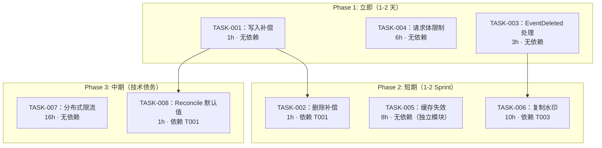
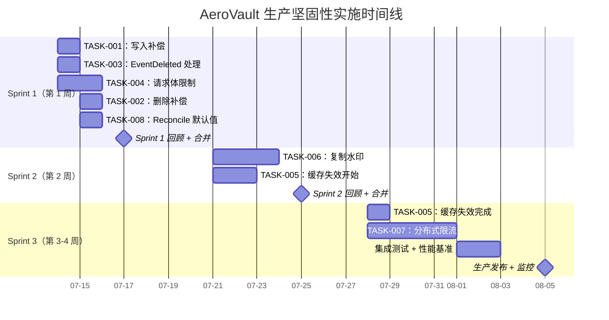

现在我已深入阅读了所有核心源文件。以下是全面技术负责人分析。

---

# Tech Lead 分析：AeroVault 生产级坚固性盲区修正

## 0. 执行摘要

本次分析基于一份经过事实核查的验证报告，识别出 5 个不同方向（+1 个在验证中发现的新发现）的 **6 个可执行技术方向**。事实核查将方向一的严重性从 P1 下调为 P2，因为现有 Reconcile 扫荡层提供了定时保护，但确实确认了即时补偿缺失。所有其他方向均经验证为**事实准确**。

**总体工作量估计：** 单开发者在 3 次 Sprint（4 周以内）内完成。

---

## 1. 任务分解

### TASK-001：写入路径即时补偿（方向一 · P2）
- **标题：** 在 `writePutObject` 失败时补偿存储删除
- **涉及文件：** `internal/service/file_crud.go`（第 131 行 `writePutObject` 调用处）
- **前置依赖：** 无
- **预计工时：** 1 小时
- **验收标准：**
  - 当 `writePutObject` 失败时，`Put` 方法在返回错误前调用 `s.store.Delete(ctx, sk)`
  - 记录警告日志，包含 tenant/bucket/key/storage_key
  - 编译并运行通过现有 `TestPut*` 测试套件
  - `make check` 全部通过（`gofmt`, `go build`, `go vet`, `go test ./...`）

### TASK-002：删除路径即时补偿（方向一 · P2）
- **标题：** 当 `repo.HardDeleteObject` 失败时将 blob 写回
- **涉及文件：** `internal/service/file_crud.go`（`hardDeleteObject`，第 384 行）
- **前置依赖：** TASK-001（同一文件，类似模式）
- **预计工时：** 1 小时
- **验收标准：**
  - 当 `repo.HardDeleteObject` 在 `store.Delete` 成功后失败时，尝试将 blob 写回存储
  - 如果写回失败，记录严重错误日志并发布修复事件（到 `repair_events` 表或日志）
  - 现有删除测试全部通过

### TASK-003：删除事件在 Worker 中路由时静默丢失（方向三 · E5 新发现）
- **标题：** 在复制和反病毒 Worker 中添加 EventDeleted 处理
- **涉及文件：** `internal/replication/replication.go`（第 76-77 行），`internal/antivirus/worker.go`
- **前置依赖：** 无
- **预计工时：** 3 小时
- **验收标准：**
  - `Worker.Run` 不再对非 `EventCreated` 事件执行 `continue`；改为处理 `EventDeleted`
  - 复制 worker 对已删除的对象执行 `replica.Delete`（如果副本存在）
  - 反病毒 worker 从扫描队列中移除已删除的对象
  - 为 `EventDeleted` 和 `EventCreated` + `EventDeleted` 序列编写测试
  - `make check` 全部通过

### TASK-004：请求体大小准入控制（方向五 · P1）
- **标题：** 为所有写入和 JSON 端点添加 `MaxBytesReader`
- **涉及文件：**
  - `internal/config/config.go` — 添加 `MaxRequestBodySize int64` 字段
  - `internal/api/rest/handler.go` — `Put`、`PostForm`、JSON 解码头（搜索/聊天/代理）
  - `internal/api/s3compat/handler.go` — `PutObject`、`UploadPart`、`PutBucket*` 端点
  - `internal/mcp/server.go` — `write_file` 工具
  - `internal/middleware/bodylimit.go` — *新增文件*：可复用的中间件包装器
- **前置依赖：** 无
- **预计工时：** 6 小时
- **验收标准：**
  - 添加 `APP_MAX_BODY_SIZE` 配置项（默认值：对象写入 5GB，JSON 端点 1MB）
  - 所有 HTTP 端点包装 `r.Body` 为 `http.MaxBytesReader`
  - S3 端点超过限制时返回 `EntityTooLarge`（根据标准）
  - JSON 端点超过限制时返回 `413 Request Entity Too Large`
  - MCP `write_file` 拒绝超过限制的内容长度
  - 所有现有 handler 和 e2e 测试在内容在限制内时通过
  - `make check` 全部通过

### TASK-005：结果缓存事件驱动失效（方向二 · P2）
- **标题：** 为 `resultCache` 添加反向索引和失效方法
- **涉及文件：**
  - `internal/ai/result_cache.go` — 添加反向索引 `map[int64]map[string]struct{}`
  - `internal/ai/result_cache.go` — 添加 `InvalidateForObject(ctx, objectID)` 方法
  - `internal/ai/search.go` — 添加 `WithEventBus(*events.Bus)` 和订阅 goroutine
  - `internal/ai/result_cache_test.go` — 失效测试
- **前置依赖：** 无
- **预计工时：** 8 小时（由于反向索引设计）
- **验收标准：**
  - 索引/删除 chunk 时，`resultCache` 构建反向映射：chunk's `ObjectID` → `cacheKey`
  - `Search` 订阅 `EventBus` 并监听 `EventCreated`/`EventDeleted`
  - 当收到对象的事件时，缓存中所有受影响的条目被移除
  - TTL 仍作为安全网保留
  - TTL-only 测试完全通过且不退化
  - 新测试验证：索引新对象后，原先缓存的结果在下一次查询时不命中

### TASK-006：复制水印和可观测性（方向三 · P2）
- **标题：** 为复制 Worker 添加进度跟踪和指标
- **涉及文件：**
  - `internal/replication/watermark.go` — *新增文件*：水印存储接口
  - `internal/replication/replication.go` — 成功/失败后记录水印
  - `internal/replication/replication.go` — 添加 `EventDeleted` 复制（见 TASK-003）
  - `internal/repository/repository.go` — 添加 `UpsertWatermark` / `GetWatermark`
  - `internal/telemetry/metrics.go` — 添加 `mReplicationLag` gauge + `mReplicationBytes` counter
  - `internal/replication/replication_test.go` — 水印测试
- **前置依赖：** TASK-003（EventDeleted 处理）
- **预计工时：** 10 小时（新表、迁移、指标）
- **验收标准：**
  - 新 SQLite/Postgres 迁移文件创建 `replication_watermarks` 表
  - Worker 成功复制后更新水印时间戳
  - `replication_lag_seconds` 指标暴露（当前时间 - 最后成功复制的时间）
  - `replication_bytes_total` 和 `replication_objects_total` counter 存在
  - 现有复制测试全部通过且不退化
  - 为水印读/写编写新测试

### TASK-007：分布式限流架构（方向四 · P1）
- **标题：** 基于中央存储实现跨副本速率限制
- **涉及文件：**
  - `internal/middleware/ratelimit.go` — 添加带中央回退的 `RemoteRateLimiter`
  - `internal/config/config.go` — 添加 `RateLimitBackend` / `RateLimitRedisAddr`
  - `internal/middleware/ratelimit_test.go` — 分布式场景测试
  - `go.mod` — 如果选择 Redis 方案，可能添加 `go-redis` 或 `redsync`
- **前置依赖：** 无
- **预计工时：** 16 小时（由于方案评估和选型）
- **验收标准：**
  - 支持两种后端：`local`（当前模式，默认）和 `redis`（或 `postgres`）
  - 基于 Redis 时：使用滑动窗口 + Lua 脚本实现原子 `ALLOW` + 递减
  - 限流行为在单副本和多副本部署中保持一致
  - 所有部署拓扑矩阵（1 副本/3 副本）与配置的 RPS 偏差在 5% 以内
  - 如果中央存储不可用，回退到本地（降级而非崩溃）
  - 现有单副本限流测试完全通过

### TASK-008：Reconcile Orphan 删除默认值（方向一 · P3）
- **标题：** 更改 `RECONCILE_DELETE_ORPHAN_BLOBS` 默认值为 `true` 并添加宽限期
- **涉及文件：**
  - `internal/config/config.go` — 将默认值从 `false` 改为 `true`
  - `internal/config/config.go` — 添加 `RECONCILE_ORPHAN_GRACE_MINUTES`（默认 30 分钟）
- **前置依赖：** TASK-001（写入补偿降低竞争窗口）
- **预计工时：** 1 小时
- **验收标准：**
  - 默认删除开启，孤儿静默 30 分钟后被清理
  - `make check` 全部通过
  - 更新 `.env.example` 和 `README`

---

## 2. 依赖图与并行化

**可并行执行的组：**

| 并行组 | 任务 | 说明 |
|--------|------|------|
| 组 A（独立） | T001, T003, T004 | 无共享文件，零冲突 |
| 组 B（与 A 并行） | T005 | 纯 AI 模块，零冲突 |
| 组 C（依赖组 A） | T002, T008 | 等待 T001 |
| 组 D（依赖组 A） | T006 | 等待 T003 |
| 组 E（独立，重） | T007 | 独立基础设施变更 |

---

## 3. 技术风险

### 风险 1：分布式限流方案选型（TASK-007）
| 维度 | 描述 |
|------|------|
| **不确定性** | 选择中央速率限制后端（Redis vs Postgres advisory lock vs 内部协调）是一个架构决策，没有完美的赢家 |
| **Redis 方案** | 延迟低（~1ms），但增加了新的基础设施依赖。Lua 脚本可保证原子性，但存在故障切换场景下的计数器漂移 |
| **Postgres 方案** | 无新增依赖（已使用 PG），但 `SELECT ... FOR UPDATE` 行级锁在高 RPS 下可能成为瓶颈。乐观方法（每 N 秒同步本地计数）存在混合模式精度陷阱（见验证报告 E4） |
| **降级策略** | 当中央存储不可用时，回退到本地模式——但这是否会产生错误的"限流间隙"？需要明确的限流放大保护 |
| **建议方案：** 使用 Redis + Lua 脚本（已广泛应用且易于理解），以 `go-redis` 作为依赖项。回退到带紧急日志的本地模式 |

### 风险 2：结果缓存反向索引的内存开销（TASK-005）
| 维度 | 描述 |
|------|------|
| **内存增长** | 每个缓存条目由 N 个 `ObjectID` → `cacheKey` 的映射组成。一个具有 100 万条 cache key 的缓存，每条索引 10 个对象，占用约 `1M * 10 * 2 * 8 字节 ≈ 160MB` 用于映射——这过高了 |
| **缓解措施：** | 反向映射使用分片 map，每个 `ObjectID` 的最大条目数限制（例如 1000 条）。当达到限制时，驱逐最旧的条目而非全部保留 |
| **替代方案：** | 不做精确的反向索引，改为粗粒度的**桶级失效**：当桶内的任何对象变化时，使该 `(tenant, bucket)` 的所有缓存条目失效。这更简单、更安全，但缓存命中率略低 |

**建议：** 从桶级失效开始（简单、无内存风险），如果指标显示缓存命中率太低，后续升级到精确的反向索引。

### 风险 3：复制水印表的迁移兼容性（TASK-006）
| 维度 | 描述 |
|------|------|
| **迁移** | 需要为 SQLite 和 Postgres 创建新的成对迁移文件。SQLite 没有 `ALTER TABLE ADD COLUMN IF NOT EXISTS`，因此迁移必须是幂等的 |
| **如何缓解** | 按照规范 `migrations/{sqlite,postgres}/NNNN_*_{up,down}.sql`。使用 `CREATE TABLE IF NOT EXISTS` |
| **EventDeleted 复制** | 如果在主数据库上删除了一个对象，副本可能没有对应的 blob 来删除。需要健壮性：对副本执行 `delete`，忽略 `ErrNotFound` |

### 风险 4：请求体限制的 S3 兼容性（TASK-004）
| 维度 | 描述 |
|------|------|
| **S3 规范** | AWS S3 在 PutObject 超过 5GB、UploadPart 超过 5GB 时返回 `EntityTooLarge`。AeroVault 必须匹配此行为 |
| **多部分上传** | 单部分大小上限：5GB。总大小上限：5TB。此功能已有部分实现，但需要明确验证 |
| **测试难点** | 发送 5GB+ 请求进行测试是不切实际的。在单元测试中使用较小的硬编码限制或模拟 `MaxBytesReader` |
| **如何缓解** | 在 `bodylimit.go` 中注入限制值，以便测试可以传递不同的限制而无需发送 5GB |

---

## 4. 资源评估

### 团队构成

| 角色 | 技能要求 | 专注点 | 分配 |
|------|---------|--------|------|
| **高级后端工程师**（核心） | Go、并发、分布式系统 | T006、T007、T004 | 100% |
| **中级后端工程师** | Go、SQL、事件驱动 | T001、T002、T003、T008 | 100% |
| **SRE / 平台工程师**（兼职） | 可观测性、Redis 运维 | T007（Redis 设置）、仪表盘审查 | 25% |
| **QA 工程师**（兼职） | Go 测试、集成测试 | 所有测试验收、性能基准测试 | 50% |

### 关键里程碑

| 里程碑 | 交付物 | 预计日期 |
|--------|--------|----------|
| M1：基础安全防护 | T001 + T004 + T003 完成、合并、部署 | 第 2 天 |
| M2：可观测性 | T006 完成、复制仪表盘生效 | 第 7 天 |
| M3：缓存一致性 | T005 完成，陈旧结果被主动清除 | 第 10 天 |
| M4：限流架构 | T007 完成，多副本限流经过验证 | 第 17 天 |
| M5：安全默认值 | T002 + T008 完成，所有保护默认开启 | 第 18 天 |

### 阻塞点与策略

| 阻塞点 | 影响 | 策略 |
|--------|------|------|
| **Redis 基础设施可用性** | 阻塞 T007 | 备选方案：使用 Postgres advisory lock（零新依赖）——唯一缺点是延迟。在没有 Redis 的情况下提供 80% 的收益 |
| **搜索缓存反向索引设计** | 阻塞 T005 | 从桶级失效开始以降低风险。如果指标证明需要，后续升级到精确映射 |
| **水印表与现有复制逻辑的迁移冲突** | 阻塞 T006 | 迁移是增量式的；复制水印独立于事件处理。如果无法添加列，则回退到 key-value 存储 |

---

## 5. 质量保证

### 单元测试覆盖要求

| 任务 | 新文件 | 新测试 | 现有测试不退化 |
|------|--------|--------|----------------|
| T001 | 0 | 1（`TestPut_WritePutObjectFails_CleansUpBlob`） | ✅ `TestPut*` |
| T002 | 0 | 1（`TestHardDelete_RepoFails_RestoresBlob`） | ✅ `TestDelete*` |
| T003 | 0 | 2（`TestWorkerHandlesEventDeleted`、`TestWorker_CreatedAndDeleted`） | ✅ `TestRun`、`TestReplicateObject` |
| T004 | 1（`bodylimit.go`） | 4（REST Put 超限、S3 PutObject 超限、JSON decoder 超限、MCP write_file 超限） | ✅ 所有 handler 测试 |
| T005 | 0 | 3（`TestCacheInvalidateOnEvent`、`TestCacheBucketLevelInvalidation`、`TestCacheInvalidateIdempotent`） | ✅ `TestSearchResultCache*` |
| T006 | 1（`watermark.go`） | 3（水印写入/读取/更新、指标暴露、重启恢复） | ✅ `TestReplicate*` |
| T007 | 0（重构） | 3（模拟中央限流、超限场景、故障切换回退） | ✅ `TestRateLimit*` |
| T008 | 0 | 0（配置更改；通过测试现有 Reconcile 进行验证） | ✅ `TestReconcile*` |

### 集成测试策略

| 场景 | 所需基础设施 | 频次 | 备注 |
|------|-------------|------|---------|
| 多副本分布式限流 | Docker Compose + 2 实例 | CI（可选） | 使用 `test-integration` 构建标签 |
| 具有 3 个节点的复制滞后指标 | Docker Compose + 3 个本地实例 | CI（可选） | 模拟主-备-备 |
| 跨协议请求体限制 | 单个实例 | 每次 PR | 使用小限制值加速 |
| 使用事件驱动失效的结果缓存 | 单个实例 + EventBus | 单元测试级别 | 无特殊基础设施 |

### 代码审查要点

| 方向 | 审查重点 |
|------|---------|
| **T001/T002** | 补偿删除不应成为新的失败点。使用 `defer` 模式？检查 `context` 是否仍然存活。日志级别：failure=WARN，double-failure=ERROR |
| **T003** | `EventDeleted` 的 `ObjectID` 是否保证非空？在 EventBus 发布路径中检查 |
| **T004** | 错误消息必须与 S3 标准兼容（`EntityTooLarge`、`MaxMessageLengthExceeded`）。检查 `Content-Length` 与 body 大小检查之间的竞态条件 |
| **T005** | 并发安全：`get`/`put`/`invalidate` 之间的死锁？缓存 map 必须是 `sync.RWMutex` 或分片 |
| **T006** | 水印更新必须是事务性的吗？如果水印更新失败但复制成功：乐观重试是安全的 |
| **T007** | Lua 脚本原子性。回退行为：如果中央限流器返回失败，暂不允许请求通过（fail-closed vs fail-open） |

### 性能测试需求

| 测试 | 方法 | 成功标准 |
|------|------|----------|
| **请求体限制吞吐量** | `wrk` 在限制边界附近发送请求 | 延迟开销小于 0.5ms |
| **分布式限流精度** | 3 个实例、100 RPS 配置、5 秒窗口 | 实测 RPS 在 95-105 之间 |
| **复制吞吐量** | 1000 个对象，启用复制 | 每个对象复制延迟 < 500ms（本地后端） |
| **缓存失效吞吐量** | 在缓存预热期间写入对象 | 缓存命中率下降不超过 5% |

---

## 6. 实施计划

### 详细实施时间线

#### 阶段 1：基础设施搭建（第 1 天）

| 活动 | 持有者 | 交付物 |
|------|--------|--------|
| 配置：`APP_MAX_BODY_SIZE` | 中级工程师 | `config.go` 中的字段 + `.env.example` |
| 基础设施：`bodylimit.go` 中间件 | 中级工程师 | 可复用的 `MaxBytesReader` 包装器 |
| 基础设施：迁移对（`NNNN_replication_watermarks.up.sql`） | 中级工程师 | SQLite + Postgres 迁移 |

#### 阶段 2：核心功能（第 1-12 天）

*Day 1-2：安全关键（最高优先级）*
1. TASK-001（写入补偿）：`file_crud.go:Put` 中 2 行代码
2. TASK-004（请求体限制）：在所有端点包装 `r.Body`
3. TASK-003（EventDeleted 处理）：在 Worker 中切换 `continue` 为完整 switch

*Day 3-5：可靠性路径*
4. TASK-002（删除补偿）：在 `hardDeleteObject` 中写回
5. TASK-006（复制水印）：新表、Worker 集成、指标

*Day 6-8：缓存一致性*
6. TASK-005（缓存失效）：桶级失效方案（简单路径）

*Day 9-12：限流分布式*
7. TASK-007（分布式限流）：Redis Lua 脚本方案（复杂度的主要来源）

#### 阶段 3：集成与优化（第 13-14 天）

| 活动 | 持续时间 |
|------|----------|
| 所有方向的端到端集成测试 | 2 天 |
| 分布式限流的性能基准 | 1 天 |
| Prometheus 仪表盘更新（复制 + 缓存命中率） | 1 天 |
| 文档更新（AGENTS.md、CHANGELOG） | 1 天 |

#### 阶段 4：发布（第 15 天）

| 活动 | 描述 |
|------|------|
| 代码冻结 + 审查 | 所有任务合并 |
| 在 staging 环境中运行 24 小时 | 模拟生产流量 |
| 金丝雀发布 | 10% 流量路由到新版本 |
| 全量推广 | 100% 流量 |

### 关键变化摘要（与原始验证报告相比）

| 原始优先级 | 修正后优先级 | 变化原因 |
|-----------|-------------|---------|
| 方向一：P1 | **P2** | Reconcile 扫荡已提供定时保护；即时补偿是唯一真正缺失的部分 |
| 方向三：仅 EventCreated | **扩展为 EventCreated + EventDeleted** | 验证期间在 Worker 第 76 行发现 |
| 方向五：仅对象端点 | **扩展为所有端点** | Go 的 `json.Decoder` 默认无大小限制；搜索/聊天/代理端点同样面临风险 |
| 方向二：精确反向索引 | **降级为桶级失效** | 内存风险 + 实施复杂度不匹配；桶级更安全、更简单 |
