现在我已全面掌握代码库，以下是资深技术主管的完整分析。

---

# 技术主管分析：第 87 轮架构与产品纵深盲区

## 1. 任务分解

以下分解遵循 2-4 小时的任务粒度，并融入了验证报告中的纠正：方向 1 和方向 3 已从 P1 降至 P2，LocalStorage 侧车原子写和 `RewrapObject` 的严重事实错误已纳入考量。

---

### 方向 1：EventBus 同步持久化 → 异步写入（P2，经验证修改）

| 任务 ID | 标题 | 涉及文件 | 前置依赖 | 工时 | 验收标准 |
|---------|------|---------|---------|------|---------|
| **TASK-001** | 添加 `EVENTS_WRITE_MODE` 配置选项 | `config/config.go`, `internal/events/bus.go` | 无 | 2h | `Bus` 在 `sync`/`async`/`batch` 模式下均可构造；默认 `sync` 保持向后兼容 |
| **TASK-002** | 实现异步写入器 goroutine 与缓冲通道 | `internal/events/bus.go`, `internal/events/async_writer.go`（新增） | TASK-001 | 3h | Publish 将事件追加到缓冲通道后立即返回；后台 goroutine 按 `InsertEvent` 逐一刷新；在 goroutine 关闭前进行优雅关闭 `drain` |
| **TASK-003** | 实现批处理刷新逻辑（按计数/时间触发） | `internal/events/async_writer.go` | TASK-002 | 3h | 当 N 个事件（可配置，默认 50）或 T 毫秒（可配置，默认 100ms）后，执行 `INSERT INTO ... VALUES (...), (...), (...)` 打包提交 |
| **TASK-004** | 在 `Publish` 中集成事务合并（将 `InsertEvent` 合并到上游事务） | `internal/events/bus.go`, `internal/service/file_crud.go` | 无 | 3h | 添加 `PublishInTx(ctx, tx, e)` 方法；FileService 在块中传递事务；回滚时取消事件 |
| **TASK-005** | 为所有三种模式添加集成测试 + 指标 | `internal/events/bus_test.go`, `internal/events/async_writer_test.go`, `internal/telemetry/metrics.go` | TASK-003, TASK-004 | 3h | 单元测试覆盖 sync/async/batch 路径；`events_write_latency` 直方图指标；SQLite 下的基准测试对比 |

**注意**：TASK-004（事务合并）是独立优化，无前置依赖——但提供了最大的延迟节省（无需额外 COMMIT）。TASK-002+003（异步/批处理）在不合并事务的情况下提供了 80% 的收益。

---

### 方向 2：S3 SelectObjectContent（P2）

| 任务 ID | 标题 | 涉及文件 | 前置依赖 | 工时 | 验收标准 |
|---------|------|---------|---------|------|---------|
| **TASK-010** | SQL 解析器模块（SELECT...FROM...WHERE...LIMIT 子集） | `internal/api/s3compat/select/parser.go`（新增路径） | 无 | 4h | 解析 `SELECT col1, col2 FROM s3object s WHERE s.col = 'val' LIMIT 100`；对 JOIN/UNION 返回错误；对不支持的类型返回错误 |
| **TASK-011** | CSV 与 JSON 行级流式读取器 | `internal/api/s3compat/select/reader.go`（新增） | 无 | 3h | 从 `io.Reader` 流式消费 CSV（`encoding/csv`）和 JSON Lines（逐行 `json.Decode`）；支持 GZIP 解压缩；支持可配置分隔符/引号 |
| **TASK-012** | S3 Select 事件流帧编码器 | `internal/api/s3compat/select/frame.go`（新增） | 无 | 3h | 实现 `SelectObjectContentEventStream` 帧格式：`Records` 事件 → `Stats` 事件 → `End` 事件；预签名 4 字节长度前缀 + CRC32 校验 |
| **TASK-013** | S3 路由与处理器注册 | `internal/api/s3compat/router.go`, `internal/api/s3compat/handler.go` | TASK-010, TASK-011, TASK-012 | 3h | `?select` 或 `SelectObjectContent` 操作路由到处理器；处理 `InputSerialization`/`OutputSerialization` XML 解析；通过 S3 签名验证 |
| **TASK-014** | Select 请求/响应的 XML 类型 | `internal/api/s3compat/xml.go` | 无 | 2h | 添加 `SelectObjectContentRequest`、`InputSerialization`、`CSVInput`、`JSONInput`、`OutputSerialization` 等 XML 序列化/反序列化结构体 |
| **TASK-015** | S3 Select 集成测试 | `internal/api/s3compat/select/select_test.go` | TASK-013 | 3h | 对 CSV 和 JSON 对象的查询覆盖完整结果、部分匹配、无匹配、空对象；具有 S3 兼容测试夹具的 HTTP 集成测试 |

**总计：18h（4.5 人天）**。可通过将 TASK-010（SQL 解析器）替换为 `expr` 或 `xwb1989/sqlparser` 等经过实战检验的库来加快速度——我**强烈推荐**使用现有库，而非自行编写解析器。

---

### 方向 3：LocalStorage 侧车元数据并发（P2，经验证修正）

验证确认**方向 3 不再为 P1**，因为：
- **E1（已解决）**：`writeMeta` 已使用 `os.CreateTemp` + `os.Rename`，因此原子写入侧车**已经存在**。侧车撕裂问题已解决。
- **E2（已解决）**：`rewrap.go` 已经实现了读-改-写（`RewrapObject`），因此重包装路径已经具备。

**剩余问题**：剩余的问题是**并发安全**（文件级锁定）和**大列表性能**（针对大量对象使用 1000× `readMeta` 的全量 JSON 解析）。

| 任务 ID | 标题 | 涉及文件 | 前置依赖 | 工时 | 验收标准 |
|---------|------|---------|---------|------|---------|
| **TASK-020** | 在 `local_meta.go` 中添加文件级锁定 | `internal/storage/local_meta.go` | 无 | 3h | 使用 `os.Flock`（Unix）或每个侧车的 `sync.Mutex` 映射以序列化并发写入；`writeMeta` 在写入期间持有锁；`readMeta` 可选持有共享锁 |
| **TASK-021** | 添加元数据缓存层，用于 List 操作 | `internal/storage/local_cache.go`（新增），`internal/storage/local_list.go` | TASK-020 | 4h | 基于 `sync.Map` 的 TTL 缓存（默认 10s），避免对频繁访问的对象重复解析 JSON；缓存失效在写操作时发生；可配置的 `STORAGE_META_CACHE_TTL` |
| **TASK-022** | 添加并发写入的竞态检测测试 | `internal/storage/local_test.go` | TASK-020 | 2h | `go test -race` 下具有 10 个并发 goroutine 写入同一 key 的测试通过 |
| **TASK-023** | 减少 List 路径中的 JSON 分配 | `internal/storage/local_meta.go`, `internal/storage/local_list.go` | TASK-021 | 2h | List 操作在 TTL 缓存内时不再读取或解析侧车文件；基准测试显示 1000 个对象速度提升 10 倍 |

---

### 方向 4：StorageClass 分层转换（P2）

| 任务 ID | 标题 | 涉及文件 | 前置依赖 | 工时 | 验收标准 |
|---------|------|---------|---------|------|---------|
| **TASK-030** | 扩展 BucketConfig 生命周期以支持转换操作 | `internal/repository/repository.go`, `migrations/{sqlite,postgres}/0026_transition_action.*` | 无 | 3h | `BucketConfig.TransitionDays` + `TransitionClass` 字段；相应的迁移；`SetBucketLifecycle` 接受转换规则；`GetBucketConfig` 返回转换规则 |
| **TASK-031** | 构建 TransitionEngine（数据搬运器） | `internal/reconcile/transition.go`（新增），`internal/storage/factory.go` | TASK-030 | 4h | `TransitionEngine` 枚举 `TransitionDays` 已过的对象；调用 `sourceStore.Get` → `targetStore.Put` → `repo.UpdateObjectStorage` → `sourceStore.Delete`；幂等（在元数据中标记转换 ID） |
| **TASK-032** | 在 `factory.go` 中实现 StorageClassRouter | `internal/storage/factory.go`, `internal/storage/storage.go` | 无 | 3h | `StorageClassRouter` 将 `STANDARD`/`STANDARD_IA`/`GLACIER` 映射到不同的后端实例；回退到默认后端；由 `STORAGE_CLASS_MAP` 配置（JSON，例如 `{"GLACIER":"s3://cold-bucket"}`） |
| **TASK-033** | 实现 RestoreObject（GLACIER 恢复） | `internal/service/file_restore.go`（新增），`internal/api/s3compat/handler.go` | TASK-032 | 4h | POST `/restore`（REST）+ S3 `POST ?restore` 将对象从冰川类迁移回标准存储；设置恢复有效期（默认 1 天）；幂等 |
| **TASK-034** | 将 TransitionEngine 集成到 LifecycleJob 定时器中 | `internal/reconcile/lifecycle.go`, `internal/reconcile/job.go` | TASK-031 | 2h | 每个 `ReconcileInterval` 周期运行转换扫描；记录转换后的计数指标；优雅降级处理存储后端临时故障 |
| **TASK-035** | StorageClass 转换集成测试 | `internal/reconcile/transition_test.go`, `internal/storage/local_test.go` | TASK-034 | 3h | 测试 LOCAL→LOCAL 转换；测试 STANDARD→GLACIER 元数据更新；测试转换期间失败并恢复；测试 `RestoreObject` 流程 |

---

### 方向 5：AI 全链路追踪断裂（P2）

| 任务 ID | 标题 | 涉及文件 | 前置依赖 | 工时 | 验收标准 |
|---------|------|---------|---------|------|---------|
| **TASK-040** | 为 Event 结构体添加 Traceparent + 迁移 | `internal/repository/repository.go`, `migrations/{sqlite,postgres}/0027_add_event_trace.*` | 无 | 2h | `Event.Traceparent string`；`events` 表中的可为 NULL 列（SQLite 中为 `TEXT`，Postgres 中为 `TEXT`） |
| **TASK-041** | 为 Job 结构体添加 Traceparent + 迁移 | `internal/repository/jobs.go`, `migrations/{sqlite,postgres}/0028_add_job_trace.*` | 无 | 2h | `Job.Traceparent string`；`jobs` 表中的可为 NULL 列 |
| **TASK-042** | 在 bus.Publish 中传播追踪上下文 | `internal/events/bus.go` | TASK-040 | 3h | `Publish` 从 `ctx` 提取 traceparent → 注入到 `Event.Traceparent`；使用 `otel.GetTextMapPropagator().Extract`/`Inject`；当 ctx 无父 span 时不设置 |
| **TASK-043** | Indexer/Replication/Antivirus 工作线程提取 traceparent 并创建子 span | `internal/ai/indexer.go`, `internal/replication/replication.go`, `internal/antivirus/worker.go` | TASK-041, TASK-042 | 4h | 工作线程从事件/job 中读取 `Traceparent` → `otel.GetTextMapPropagator().Extract` → 使用 `tracer.Start(ctx, "index_object", ...)` 创建子 span；请求无 trace 时的降级处理 |
| **TASK-044** | JobPool 在 handler 执行前提取 traceparent | `internal/jobs/jobs.go` | TASK-041 | 3h | `Pool.runWorker` 在调用 `h(ctx, job)` 前从 `job.Traceparent` 创建上下文 |
| **TASK-045** | Postgres NOTIFY 路径中的追踪传播 | `internal/events/postgres_transport.go` | TASK-042 | 2h | 通过 NOTIFY 传递时，序列化 traceparent 到事件 payload；`Deliver` 反序列化并设置 `Event.Traceparent` |
| **TASK-046** | 端到端追踪集成验证 | `internal/telemetry/trace_test.go` | TASK-043, TASK-044, TASK-045 | 3h | HTTP PUT → Event → Job → Indexer span 出现在单个 trace 中（使用 `memory.NewExporter` 进行进程内验证）；导出器中存在 parent-child 关系 |

---

## 2. 执行顺序

以下是任务的依赖图。**所有五个方向可并行执行**——它们之间无依赖关系。

```mermaid
graph TD
    subgraph 方向1: EventBus异步化
        T001[TASK-001: 配置选项] --> T002[TASK-002: 异步写入器]
        T002 --> T003[TASK-003: 批处理刷新]
        T004[TASK-004: 事务合并] --> T005[TASK-005: 集成测试]
        T002 --> T005
        T003 --> T005
    end

    subgraph 方向2: S3 Select
        T010[TASK-010: SQL解析器]
        T011[TASK-011: CSV/JSON流式读取]
        T012[TASK-012: 事件帧编码]
        T013[TASK-013: 路由+处理器]
        T014[TASK-014: XML类型]
        T010 --> T013
        T011 --> T013
        T012 --> T013
        T013 --> T015[TASK-015: 集成测试]
        T014 --> T013
    end

    subgraph 方向3: LocalStorage并发安全
        T020[TASK-020: 文件级锁定]
        T020 --> T021[TASK-021: 元数据缓存]
        T020 --> T022[TASK-022: 竞态检测测试]
        T021 --> T023[TASK-023: List路径优化]
    end

    subgraph 方向4: StorageClass分层转换
        T030[TASK-030: BucketConfig扩展]
        T030 --> T031[TASK-031: TransitionEngine]
        T032[TASK-032: StorageClassRouter]
        T031 --> T034[TASK-034: LifecycleJob集成]
        T032 --> T033[TASK-033: RestoreObject]
        T034 --> T035[TASK-035: 集成测试]
    end

    subgraph 方向5: AI全链路追踪
        T040[TASK-040: Event加Trace字段]
        T041[TASK-041: Job加Trace字段]
        T042[TASK-042: bus.Publish传播]
        T040 --> T042
        T042 --> T043[TASK-043: Worker提取]
        T041 --> T044[TASK-044: JobPool提取]
        T043 --> T046[TASK-046: 端到端验证]
        T044 --> T046
        T042 --> T045[TASK-045: Postgres NOTIFY]
    end
```



### 可并行化工作组

| 工作组 | 包含方向 | 建议负责人 |
|--------|---------|-----------|
| **组 A（基础设施）** | 方向 1 + 方向 3 | 1 名高级工程师 + 1 名中级工程师 |
| **组 B（S3 协议）** | 方向 2 | 1 名高级工程师 + 1 名中级工程师 |
| **组 C（存储层）** | 方向 4 | 1 名高级工程师 + 1 名中级工程师 |
| **组 D（可观测性）** | 方向 5 | 1 名高级工程师 |

**如果只能有一名工程师**，建议优先处理顺序为：方向 5 → 方向 1 → 方向 4 → 方向 3 → 方向 2。

---

## 3. 技术风险

### 3.1 方向 1：EventBus 异步化

| 风险 | 可能性 | 影响 | 缓解措施 |
|------|--------|------|---------|
| 优雅关闭时事件丢失 | 中 | 高 | 实现带超时的 `Bus.Drain(ctx)`；关闭前等待 in-flight 事件刷新 |
| 批处理刷新打乱了事件顺序 | 中 | 低 | 为 job 消费者添加 `Event.SequenceNumber` 列；索引器无需严格顺序 |
| 异步写入器成为瓶颈 | 低 | 中 | 缓冲通道 + 批处理；监控 `chan` 长度和刷新延迟 |
| 事务合并引入了 `Commit` 失败导致业务操作回滚 | 高 | 高 | 仅在 `sync` 模式下启用事务合并；`async`/`batch` 模式保持独立写入 |

**关键决策点**：`async` 模式是否应为默认？**否**——保持 `sync` 为默认以保证向后兼容。`EVENTS_WRITE_MODE=async` 可以作为选择加入的部署优化。

### 3.2 方向 2：S3 Select

| 风险 | 可能性 | 影响 | 缓解措施 |
|------|--------|------|---------|
| SQL 解析器复杂度被低估 | 高 | 中 | 使用 `github.com/xwb1989/sqlparser`（Vitess 派生）而非自行编写——节省约 3 天开发时间 |
| Parquet 支持使范围扩大 | 中 | 中 | **阶段 1 不包含** Parquet——仅 CSV + JSON。Parquet 延迟到后续迭代 |
| 事件流帧的 conformance 问题 | 中 | 高 | 使用 AWS SDK 的 `s3.NewSelectObjectContentEventStream` 作为参考实现；针对真实 S3 端点进行验证测试/s3test |
| 大对象（>1GB）时的内存压力 | 中 | 高 | 流式读取器：从不将整个对象加载到内存；每批 64KB 应用 WHERE 谓词 |

**关键依赖**：需要一个外部 SQL 解析器。Go 生态系统有 `xwb1989/sqlparser`（稳定，MIT 许可证）和 `pingcap/tidb/parser`（功能完整但依赖较重）。**推荐**：`xwb1989/sqlparser`，仅导入 `SELECT`/`WHERE`/`LIMIT` 子表达式。

### 3.3 方向 3：LocalStorage 侧车

| 风险 | 可能性 | 影响 | 缓解措施 |
|------|--------|------|---------|
| `os.Flock` 在 NFS/FUSE 上的行为 | 中 | 中 | 回退到 `sync.Mutex` 映射（进程内）；记录 `os.Flock` 在 NFS 上的行为 |
| 元数据缓存使测试变慢 | 低 | 低 | 使用可注入的 `Clock` 接口来使 TTL 在测试中可预测；提供 `WithCache(nil)` 用于绕过 |
| 缓存未命中时 List 性能仍受限于 `readdir` | 高 | 中 | 这是文件系统限制；对于 >100K 对象的情况，建议使用 S3 后端。不修复——记录在 README 中 |

### 3.4 方向 4：StorageClass 转换

| 风险 | 可能性 | 影响 | 缓解措施 |
|------|--------|------|---------|
| 转换期间数据损坏（传输后源被删除前崩溃） | 中 | 高 | 两阶段提交：①写入目标→②更新元数据→③删除源。如果步骤②失败，转换被标记为待处理，下次扫描重试 |
| 多副本读取旧元数据 | 中 | 中 | 转换更新元数据后，次级副本的下一次 `ListObjects` 会收敛；强一致性不是 Strict 要求 |
| `RestoreObject` 对超大对象（>5GB）的处理 | 低 | 中 | 使用 `store.Copy` 内部实现（如果存储后端支持服务器端复制）；否则流式传输 |
| 转换操作触发成本（S3 LIST/GET 请求费用） | 中 | 低 | 按对象级别的限制速率进行转换；可配置的每天最大转换次数 |

### 3.5 方向 5：AI 追踪

| 风险 | 可能性 | 影响 | 缓解措施 |
|------|--------|------|---------|
| `traceparent` 注入引入了对 OTel 的依赖恐慌 | 低 | 中 | 防御性 `otel.GetTextMapPropagator()` nil 检查；零值结构体 |
| 架构迁移增加了启动时间 | 低 | 低 | 为 `events.trace_id` 和 `jobs.traceparent` 添加可为 NULL 的列；无默认值 |
| 控制平面（JobPool）/数据平面（Indexer）使用不同的 tracer 实例 | 中 | 高 | 单例 TracerProvider（已在 `internal/telemetry/otel.go` 中设置）；所有消费者使用 `otel.Tracer("")` |
| Postgres NOTIFY 的 payload 大小限制（~8KB） | 低 | 中 | 将 traceparent（最多 55 字节）放入事件 payload 的 map；远低于 8KB 限制 |

---

## 4. 资源评估

### 人员配置

| 角色 | 所需数量 | 技能 | 分配方向 |
|------|---------|------|---------|
| **高级后端工程师** | 2 | Go、分布式系统、SQL、OTel | 方向 1（团队负责人）+ 方向 4 |
| **中级后端工程师** | 2 | Go、REST API、SQL、熟悉 S3 协议 | 方向 2 + 方向 3 |
| **高级 SRE/可观测性工程师** | 1 | OTel、分布式追踪、prometheus 指标 | 方向 5 |
| **QA 工程师** | 1 | Go 测试、集成测试、基准测试 | 所有方向 |

**最小可行团队**：2 名高级工程师 + 1 名中级工程师（通过推迟方向 2 减少 1 人）。

### 关键里程碑

| 里程碑 | 条件 | 目标日期（第 1 天起） |
|---------|------|------|
| **M1：基础设施就绪** | TASK-001、TASK-020、TASK-030、TASK-040、TASK-041、TASK-010 完成 | D8 |
| **M2：核心功能冻结** | TASK-002+003、TASK-013、TASK-021、TASK-031、TASK-043 完成；所有 CI 检查通过 | D18 |
| **M3：集成测试通过** | TASK-005、TASK-015、TASK-022、TASK-035、TASK-046 完成；`make check` 全绿 | D25 |
| **M4：发布准备** | 文档、指标、Grafana 面板更新；基准测试运行；回滚程序已记录 | D30 |

### 阻塞点

| 阻塞点 | 影响方向 | 解决策略 |
|--------|---------|---------|
| SQL 解析器第三方库选择 | 方向 2 | 在 S1 第 1 天原型测试 `xwb1989/sqlparser` 与 `pingcap/parser`；在 D2 做出决定 |
| `os.Flock` 在 macOS（开发） vs Linux（生产）上的行为 | 方向 3 | 对于不可用的 `flock`：在 `local_meta.go` 内使用构建标签或运行时 `GOOS` 检查回退到 `sync.Mutex` |
| 方向 4 中 Postgres 的 `SKIP LOCKED` 与 SQLite 的 `BEGIN IMMEDIATE` | 方向 4 | Transition Engine 已在 reconcile job 中运行（单例），因此并发问题最小——使用 repository 级别的事务 |
| OTel 的 `TextMapPropagator` 在生产中的采样率决策 | 方向 5 | 对于头部采样：从 HTTP 层传播 `traceparent`，由 `OTEL_TRACES_SAMPLER` 控制。对于尾部采样：稍后添加，超出当前范围 |

---

## 5. 质量保证

### 5.1 单元测试覆盖要求

| 文件 | 现有覆盖率 | 目标覆盖率 | 关键测试场景 |
|------|-----------|-----------|-------------|
| `internal/events/bus.go` | 中 | ≥80% | sync/async/batch 模式；Publish 失败（log）；优雅关闭；通道溢出 |
| `internal/events/async_writer.go` | 0%（新增） | ≥90% | 逐条刷新；批处理刷新；刷新期间关闭；上下文取消 |
| `internal/api/s3compat/select/*.go` | 0%（新增） | ≥85% | SQL 解析（正常路径 + 错误）；CSV/JSON 行读取；帧编码（单记录 + 多记录）；CRC32 验证 |
| `internal/storage/local_meta.go` | 中 | ≥85% | 并发写入（竞态检测）；锁定争用；原子重命名故障；`readMeta` 损坏的 JSON |
| `internal/storage/local_cache.go` | 0%（新增） | ≥90% | TTL 过期；显式作废；缓存未命中回退；大并发写 |
| `internal/reconcile/transition.go` | 0%（新增） | ≥80% | 成功的转换；故障并重试；幂等（重复扫描）；RestoreObject |
| `internal/ai/indexer.go` | 中 | ≥80% | 追踪传播（有/无父 span）；`traceparent` 格式错误 |
| `internal/jobs/jobs.go` | 中 | ≥80% | 追踪上下文创建；JobPool 中的 nil traceparent |

### 5.2 集成测试策略

| 测试套件 | 执行方式 | 覆盖内容 |
|---------|---------|---------|
| **标准 CI 套件** | `make test`（SQLite + local FS） | 所有方向的基础功能：事件发布、元数据锁定、索引追踪、StorageClass 元数据 |
| **S3 Select 套件** | `go test ./internal/api/s3compat/select/...` | 针对模拟 S3 服务器的 HTTP 集成。**零网络依赖** |
| **追踪验证** | `go test -run TestTrace ./internal/telemetry/...` | 进程内 `memory.NewExporter` 验证父子 span 关系 |
| **存储转换 E2E** | `go test -run TestTransition ./internal/reconcile/...` | Local→Local 转换全过程：源写入→转换→目标验证→源删除 |
| **并发压力测试** | `go test -race -count=10 ./internal/storage/...` | 10+ goroutine 并发写入同一 key 的竞态检测 |

### 5.3 代码审查要点

| 方向 | 审查重点 |
|------|---------|
| **方向 1** | 异步写入器在上下文取消时的关闭行为；`broadcast` 中 events 的深拷贝（共享底层引用？）；事件类型从有序变为最终一致性 |
| **方向 2** | 不将整个对象加载到内存（流式）；SQL 注入（WHERE 子句是纯表达式——无副作用）；事件帧中正确的 CRC32（AWS 规范要求） |
| **方向 3** | `flock` vs `sync.Mutex` 的正确回退；缓存 TTL 与 `readMeta` 的值语义（JSON 指针 vs 复制）；竞态检测测试应可重复且快速 |
| **方向 4** | 两阶段提交（先目标后源）；转换期间对象锁定确保一致性（Get 应工作，Put 应同步标记）；RestoreObject 临时存储的清理 |
| **方向 5** | 空 traceparent 不应崩溃；`TextMapPropagator` 线程安全（标准实现是安全的）；`events` 和 `jobs` 迁移必须是可逆的（存在 down.sql） |

### 5.4 性能测试需求

| 方向 | 基准测试 | 目标 | 当前基线（估计） |
|------|---------|------|----------------|
| **方向 1** | PUT 延迟（sync vs async vs batch） | async 模式下 p50 延迟降低 15%+ | ~50ms/次（SQLite） |
| **方向 2** | 在 500MB CSV 上 Select vs 完整下载 | 网络传输量减少 90%+；内存峰值 < 64MB | 完整下载：500MB/次 |
| **方向 3** | 对 10K 对象执行 List 操作（有/无缓存） | 从 5-20s（当前）降至带缓存 < 1s | ~10s（ext4，HDD） |
| **方向 4** | 1GB 对象的转换时间 | 在线性读写 + fsync 的预期范围内 | 无——当前不支持 |
| **方向 5** | 索引器端到端延迟（有/无追踪） | 追踪开销 < 请求时间的 1% | ~500ms（提取→分块→嵌入→写入） |

---

## 6. 实施计划

### 阶段 1：基础设施搭建（第 1-8 天）

同时启动所有五个方向的基础任务。**无阻塞依赖。**

```
第 1-2 天：     TASK-001（方向 1 配置）
                TASK-010（方向 2 SQL 解析器 —— 原型验证库选择）
                TASK-020（方向 3 文件级锁定）
                TASK-030（方向 4 BucketConfig —— schema 设计 + 迁移编写）
                TASK-040/041（方向 5 Event/Job 字段 + 迁移编写）

第 3-5 天：     TASK-002（方向 1 异步写入器）
                TASK-011/014（方向 2 CSV/JSON 读取器 + XML 类型）
                TASK-021（方向 3 元数据缓存 —— 含 TTL）
                TASK-031（方向 4 TransitionEngine —— 两阶段 commit 核心）
                TASK-042（方向 5 bus.Publish 追踪传播）

第 6-8 天：     TASK-003（方向 1 批处理刷新）
                TASK-012（方向 2 帧编码器）
                TASK-022（方向 3 竞态测试）
                TASK-032（方向 4 StorageClassRouter）
                TASK-043/044（方向 5 Worker + JobPool 追踪提取）
```

**阶段 1 结束标志**：所有基础设施迁移已应用；所有新组件可编译通过；`make check` 全绿（基础单元测试）。**里程碑 M1。**

### 阶段 2：核心功能实现（第 9-18 天）

```
第 9-12 天：     TASK-004（方向 1 事务合并）
                 TASK-013（方向 2 路由 + 处理器 —— Select 端点上线）
                 TASK-033（方向 4 RestoreObject）
                 TASK-045（方向 5 Postgres NOTIFY 传播）

第 13-15 天：    TASK-023（方向 3 List 路径优化 —— 基准测试）
                 TASK-034（方向 4 TransitionEngine → LifecycleJob 集成）

第 16-18 天：    整合 + 局部集成测试
                 TASK-005（方向 1 指标 + 基准测试）
                 方向 2 S3 处理器第一次端到端运行
                 方向 4 转换扫描 + 恢复首次集成测试
                 方向 5 tracer 内存导出器验证
```

**阶段 2 结束标志**：所有核心功能已合并到 `main` 分支；所有 CI 门控通过（`gofmt`、`build`、`vet`、`test`）。**里程碑 M2。**

### 阶段 3：集成测试和优化（第 19-25 天）

```
第 19-21 天：    TASK-015（方向 2 S3 Select 集成测试套件 —— 针对模拟服务器测试）
                 TASK-035（方向 4 StorageClass 完整集成测试）
                 TASK-046（方向 5 端到端追踪链路验证 —— OTel memory exporter）

第 22-23 天：    压力测试：
                 - 方向 1：1000 PUT/秒 burst（async 模式）
                 - 方向 2：500MB CSV Select 查询
                 - 方向 3：100K 对象 List + 10 goroutine 并发写入
                 - 方向 4：并发转换 + Restore 循环
                 - 方向 5：100 个 HTTP 请求 × 每个生成 3 个子 span 的追踪

第 24-25 天：    性能调优：
                 - 方向 1：批处理阈值调优（50 vs 100 vs 200）
                 - 方向 3：缓存 TTL 调优（5s vs 10s vs 30s）
                 - 方向 2：流式缓冲调优（32KB vs 64KB vs 128KB）
```

**阶段 3 结束标志**：所有集成测试通过；`go test -race -count=10` 全部无竞态；基准测试显示预期提升。**里程碑 M3。**

### 阶段 4：发布准备（第 26-30 天）

```
第 26 天：       文档更新：
                 - `docs/configuration.md`：新配置项（EVENTS_WRITE_MODE, STORAGE_META_CACHE_TTL, STORAGE_CLASS_MAP）
                 - `docs/architecture.md`：方向 2/4/5 架构决策记录
                 - CHANGELOG 条目

第 27 天：       Grafana 面板：
                 - 方向 1：events_write_latency 直方图，events_async_queue_depth
                 - 方向 5：trace_child_count，trace_depth
                 - 方向 4：transition_count，transition_duration

第 28 天：       回滚计划文档：
                 - 方向 1：EVENTS_WRITE_MODE=sync（默认值不受影响）
                 - 方向 2：S3 Select 路由前缀——可通过配置禁用
                 - 方向 3：STORAGE_META_CACHE_TTL=0 禁用缓存
                 - 方向 4：STORAGE_CLASS_MAP 留空则禁用转换
                 - 方向 5：迁移回滚（存在 down.sql）

第 29-30 天：    发布执行：
                 - 在 staging 环境进行最后的 E2E 测试
                 - 性能回归检查（与 v86 基线对比）
                 - 签署发布
```

**阶段 4 结束标志**：所有文档和监控就绪；发布已签署。**里程碑 M4。**

---

## 总工时汇总

| 方向 | 任务数 | 总工时 | 人日（8h） | 并行天数（3 人） |
|------|--------|--------|-----------|----------------|
| **方向 1**：EventBus 异步化 | 5 | 14h | 1.75 | 2 |
| **方向 2**：S3 Select | 6 | 18h | 2.25 | 3 |
| **方向 3**：LocalStorage 侧车 | 4 | 11h | 1.375 | 2 |
| **方向 4**：StorageClass 转换 | 6 | 19h | 2.375 | 3 |
| **方向 5**：AI 追踪 | 7 | 19h | 2.375 | 3 |
| **合计** | **28** | **81h** | **10.125** | **~13 天（3 名开发人员并行）** |

### 依赖关系决策日志

| 决策 | 选项 | 选定方案 | 理由 |
|------|------|---------|------|
| 方向 1 默认模式 | sync / async / batch | **sync**（向后兼容） | 保持现有行为；opt-in 性能优化 |
| 方向 2 SQL 解析库 | 自行编写 / `xwb1989/sqlparser` / `pingcap/tidb` | **`xwb1989/sqlparser`** | 最小依赖，良好的 SELECT 子集支持，MIT 许可证 |
| 方向 2 Parquet 支持 | 包含 / 排除 | **排除**（阶段 2） | Parquet 的列式读取大幅增加复杂度；CSV+JSON 覆盖 90% 的 Select 用例 |
| 方向 3 锁定策略 | `os.Flock` / `sync.Mutex map` / 两者 | **优先 `os.Flock`，回退 `sync.Mutex`** | 当可用时使用跨进程安全；进程内回退保持简单 |
| 方向 4 转换语义 | 移动 / 复制 | **复制 + 删除**（两阶段） | 复制后删除是在不牺牲安全性的情况下最小化停机时间的事实标准 |
| 方向 5 追踪模式 | 头部采样 / 尾部采样 | **仅头部采样**（阶段 1） | 头部采样简单、标准、足够；尾部采样添加了未满足的表达式评估流水线需求 |

---

**最终建议**：这是 30 天的项目，3 名开发人员有效并行工作。所有五个方向都带来了切实的技术或产品价值，并且以 P2 优先级，它们可以共同可靠地交付，无需过度扩张。方向 2（S3 Select）代表了最大的技术风险和产品价值——我建议**将其纳入阶段 1**，因为它的独立性和高用户可见影响，但要通过使用成熟的 SQL 解析器来降低风险。方向 5（AI 追踪）成本最低、风险最小，应该会有很好的投资回报率。
