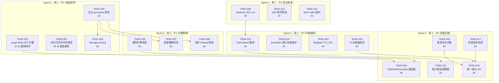
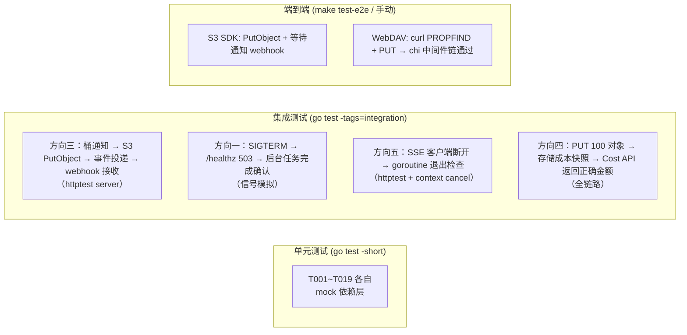
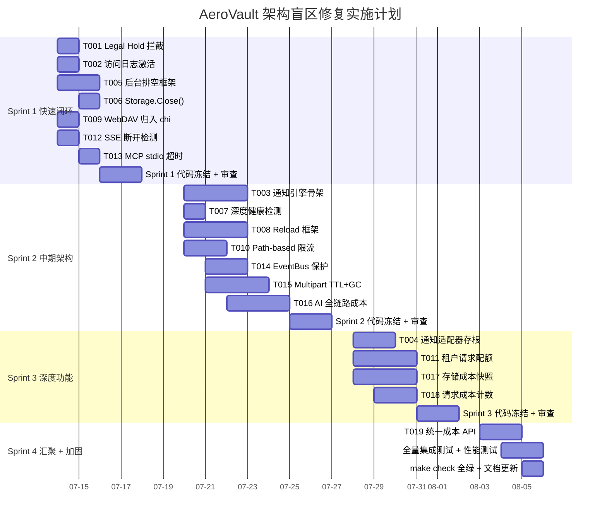

现在我拥有了一个对代码库的透彻理解。让我整理一份全面的 Tech Lead 分析。

---

# Tech Lead 分析：架构盲区与扩展方向

## 1. 任务分解

基于分析文档 5 个方向的 18 个可执行任务，每个任务 2-6 小时可完成。

### P1 方向三：策略-动作物化鸿沟

| 任务 ID | 任务标题 | 涉及文件 | 前置依赖 | 工时 | 验收标准 |
|---------|---------|---------|---------|------|---------|
| **TASK-001** | Legal Hold GET 路径拦截 | `internal/service/file_crud.go` | 无 | 1h | `GET /v1/files/{key}` 返回 `423 Locked` 当 `_aero_legal_hold == "ON"`；`Stat` 同样拦截；已有测试扩展 |
| **TASK-002** | 激活访问日志中间件调用 WriteAccessLog | `internal/middleware/middleware.go`, `internal/repository/sql_buckets.go` | 无 | 3h | `AccessLog` middleware 检查 `GetBucketLogging`，每请求调用 `WriteAccessLog` 到目标桶；日志桶不触发自身日志（防循环） |
| **TASK-003** | 通知引擎 — 路由到全局 Webhook | `internal/events/bus.go`, `internal/repository/sql_buckets.go`, `internal/repository/repository.go` | 无 | 6h | `Bus.Publish` 查询桶的 `notification_rules`；匹配 EventType+FilterKey → POST 到配置 URL；失败使用 `webhook_failures` 表重试 |
| **TASK-004** | 通知引擎 — SQS/SNS/Lambda 适配器（存根） | `internal/events/destination.go`（新文件） | TASK-003 | 4h | 定义 `NotificationDestination` 接口；实现 `WebhookDestination`（基于 TASK-003）；为 SQS/SNS/Lambda 定义注册点但返回 `ErrUnsupportedDestination` |

### P1 方向一：运维韧性

| 任务 ID | 任务标题 | 涉及文件 | 前置依赖 | 工时 | 验收标准 |
|---------|---------|---------|---------|------|---------|
| **TASK-005** | 后台 goroutine 排空与确定性关闭 | `cmd/server/main.go` | 无 | 4h | `runServer` 使用 `sync.WaitGroup` 追踪所有后台 goroutine（Indexer/AV/Replication/Reconcile）；关闭时先进入 `DRAINING` 状态 → 等待 WG → 超时后强制关闭；groutine 注册 `wg.Add(1)` / `defer wg.Done()` 模式 |
| **TASK-006** | 添加 Storage.Close() 接口与各后端实现 | `internal/storage/storage.go`, `internal/storage/local.go`, `internal/storage/s3.go`（若有） | 无 | 3h | `Storage` 接口增加 `Close() error`；`LocalStorage.Close()` flush 并关闭所有 `*os.File` 句柄；`main.go` 在 `srv.Shutdown` 后调用 `store.Close()` |
| **TASK-007** | 深度健康检测端点 | `cmd/server/main.go` | TASK-005 | 2h | `GET /readyz?full=1` 返回 JSON：`{"storage":"ok","repository":"ok","indexer":{"running":true,"lag":120},"bus":"ok"}`；负载均衡器通过 `?full=1` 区分浅/深度探测 |
| **TASK-008** | 组件 Reload 接口框架 + RateLimiter 热加载 | `cmd/server/main.go`, `internal/middleware/ratelimit.go`, `internal/config/config.go` | TASK-005 | 5h | 定义 `Reloader` 接口；`POST /debug/reload` 触发 `config.Load()` + 遍历 `[]Reloader`；`RateLimiter.Reload(*Config)` 实时更新 RPS/Burst；旧配置失败时保留 |

### P2 方向二：跨协议 QoS

| 任务 ID | 任务标题 | 涉及文件 | 前置依赖 | 工时 | 验收标准 |
|---------|---------|---------|---------|------|---------|
| **TASK-009** | WebDAV 归入 chi 中间件链 | `cmd/server/main.go`, `internal/api/webdav/handler.go` | 无 | 3h | 删除 `buildDispatcher` 中的 WebDAV 前置分发；在 chi router 中注册 davH 为 route handler；WebDAV 请求通过 `RateLimiter`/`Auth`/`Tenant` 中间件 |
| **TASK-010** | Path-based Rate Limit 规则 | `internal/middleware/ratelimit.go`, `internal/config/config.go` | TASK-009 | 4h | `RateLimiter` 支持 `Rule{PathPrefix, RPS, Burst}` 列表；`/s3/*` 分配 1000 RPS；`/v1/admin/*` 分配 200 RPS；规则匹配最长前缀 |
| **TASK-011** | 租户级请求配额 | `internal/repository/tenants.go`, `internal/middleware/ratelimit.go`, `migrations/{sqlite,postgres}/NNNN_*.{up,down}.sql` | TASK-010 | 5h | `tenants` 表新增 `rps_quota` / `burst_quota` 字段；`RateLimiter` 读取租户独立 RPS 配置；`/v1/admin/tenants/{t}/request-quota` CRUD |

### P2 方向五：连接韧性

| 任务 ID | 任务标题 | 涉及文件 | 前置依赖 | 工时 | 验收标准 |
|---------|---------|---------|---------|------|---------|
| **TASK-012** | SSE ChatStream 客户端断开检测 | `internal/api/rest/search.go` | 无 | 2h | `ChatStream` 的 `onChunk` 回调前检查 `r.Context().Done()`；`flusher.Flush()` 包装 error check；goroutine 泄漏修复（已有 `liveStream` 正确写法，同步到 `ChatStream`） |
| **TASK-013** | MCP stdio ReadDeadline + 超时 | `internal/mcp/transport.go` | 无 | 2h | `ServeStdio` 设置 `conn.SetReadDeadline(time.Now().Add(30*time.Minute))`；空闲超时后返回 error；Scanner buffer 确认 16MB 上限 |
| **TASK-014** | EventBus 慢订阅者保护 | `internal/events/bus.go` | 无 | 4h | `Subscribe` 返回 channel buffered 64；`broadcast` 检测到写入阻塞超过 100ms → 替换为新 channel → 记录 dropped+告警；原 channel 被 close 后消费者收到 close |
| **TASK-015** | Multipart 上传 TTL + GC 作业 | `internal/storage/local_multipart.go`, `internal/reconcile/job.go`, `internal/repository/repository.go` | 无 | 6h | `InitMultipart` 写入 `ttl`（默认 24h）；`reconcile` 作业 `ScanExpiredUploads` → 调用 `AbortMultipart`；`AbortMultipart` 幂等安全 |

### P2 方向四：成本归因

| 任务 ID | 任务标题 | 涉及文件 | 前置依赖 | 工时 | 验收标准 |
|---------|---------|---------|---------|------|---------|
| **TASK-016** | AI 全链路成本追踪 | `internal/ai/embed.go`, `internal/ai/rerank.go`, `internal/ai/extract.go`, `internal/repository/sql_usage.go`, `migrations/NNNN_*.sql` | 无 | 5h | `ai_usage` 表新增 `embed_cost_micros`, `rerank_cost_micros`, `extract_cost_micros`；Embedder/Reranker/Extractor 调用 `RecordUsage` 写入成本 |
| **TASK-017** | 存储成本定价配置 + 每日快照 | `internal/config/config.go`, `internal/reconcile/job.go`, `migrations/NNNN_*.sql` | 无 | 6h | `Config.Storage.Pricing` 配置 `{Standard:0.023, IA:0.0125, Glacier:0.004}` 美元/GB/月；每日 reconcile 作业快照每个租户各存储类 bytes → `storage_cost_snapshots` 表 |
| **TASK-018** | 请求级成本计数 middleware | `internal/middleware/middleware.go`, `internal/telemetry/metrics.go` | 无 | 4h | `AccessLog` middleware 增加 `request_cost_micros` 字段（基于 method+size 概算）；Prometheus `http_request_cost_total` counter by tenant/operation/protocol |
| **TASK-019** | 统一成本 API | `internal/api/rest/handler_costs.go`（新文件）, `internal/service/file_costs.go`（新文件） | TASK-016, TASK-017 | 4h | `GET /v1/admin/tenants/{t}/cost-summary?period=2026-06` 返回 `{ai_cost, storage_cost, request_cost, total_cost}`；聚合三张成本表 |

---

## 2. 执行顺序与任务依赖图

### 并行执行组

| 并行组 | 包含任务 | 负责人 | 理由 |
|--------|---------|-------|------|
| **组 A**（Sprint 1 并行） | T001, T002, T005, T006 | 2 人各自独立 | 无代码依赖，文件不重叠，各自独立测试 |
| **组 B**（Sprint 1 并行） | T009, T012, T013 | 1 人（或与组 A 中 1 人并行） | 低风险、小改动、快速闭环 |
| **组 C**（Sprint 2 并行） | T003, T007, T008 | 1-2 人 | T007/T008 依赖 T005；T003 独立 |
| **组 D**（Sprint 2 并行） | T010, T014, T015, T016 | 2 人 | 各自独立；T010 依赖 T009 |
| **组 E**（Sprint 3） | T004, T011, T017, T018, T019 | 2 人 | T019 是汇聚任务，依赖前序所有成本任务 |

---

## 3. 技术风险

### 高风险项

| 风险 | 方向 | 等级 | 描述 | 缓解策略 |
|------|------|------|------|---------|
| **通知引擎成为瓶颈** | 方向三 | 🔴 | `Bus.Publish` 同步调用通知路由可能阻塞事件写入和 `broadcast`，影响所有 `object.created` 路径 | 通知分发异步化：`Publish` 只入队到 job pool；worker 负责路由和投递 |
| **排空时序竞争** | 方向一 | 🔴 | `srv.Shutdown` 和后台 goroutine WaitGroup 之间的竞争窗口：HTTP handler 中启动的后台任务可能在 Shutdown 之后开始 | 先设置 `DRAINING` 原子标志 → 停止接受新 conn → 等待 in-flight WG → 关闭存储/总线 |
| **配置热加载部分失败** | 方向一 | 🟡 | 5 个组件中第 3 个 Reload 失败，系统处于新旧配置混合状态 | 先 dry-run 验证所有组件 → 再 apply；失败时保持旧配置 + `log.Error` |
| **MCP stdio 改造影响 Claude Desktop 兼容性** | 方向五 | 🟡 | `SetReadDeadline` 和超时断开可能破坏现有 Claude Desktop 会话，用户感知为"连接不稳定" | 仅在空闲 30 分钟后才断开；健康探测使用 stderr side-channel 而非断开连接；兼容模式可选 |
| **WebDAV 归入 chi 路由引发 URL 路径重写** | 方向二 | 🟡 | WebDAV 客户端依赖特定路径行为（如 PROPFIND `/`），归入 chi 后路径分发可能变化导致 404 | 在 chi 中使用 `r.Group` + `Route` 保持 WebDAV 路径注册原有语义；用 `curl -X PROPFIND` 回归测试 |
| **成本数据精度争议** | 方向四 | 🟡 | `request_cost_micros` 是概算值而非实际 API 调用费用，客户可能质疑账单准确性 | 标注 "estimated"；提供定价公式文档；允许运维手动覆盖定价系数 |

### 性能瓶颈与优化策略

| 场景 | 瓶颈 | 策略 |
|------|------|------|
| 大量 S3 事件同时触发通知路由 | 通知 worker 被淹没 → 事件丢失 | Worker pool 大小可配置（默认 4）；`webhook_failures` 表持久化重试 |
| 所有租户共享一个 RateLimiter 实例 | 锁竞争在 `Allow()` 的 `rl.mu.Lock()` | 引入 sharded bucket map（如 64 个 shard，按 tenant hash 分片） |
| 存储成本快照每天扫描所有对象 | 大租户（百万对象）扫描全表耗时 | 使用增量扫描（只查上次快照后修改的 `updated_at`）；分片查询 |
| SSE 慢订阅者替换为 channel | `broadcast` 中创建 channel 和 close 导致锁持有时间延长 | 替换操作在独立 goroutine 中异步完成；`broadcast` 只做非阻塞 send+计数器 |

### 测试覆盖难点

| 测试场景 | 难点 | 策略 |
|---------|------|------|
| 优雅关闭时序验证 | 真实信号和 goroutine 排空难以在单元测试中模拟 | 重构 `runServer` 接收 `ShutdownConfig`（含可注入 `notifyCh` 和 `doneCh`），使用 concurrency test `go test -race -count=10` |
| 配置热加载回滚 | 需要模拟组件 Reload 失败 | 定义 `ReloadResult` 类型含 `{ok bool, err error}`；Reloader mock 返回可控失败 |
| MCP stdio 超时 | 需要模拟 stdin 无数据 30 分钟 | 使用可注入 `io.Reader` 和 `idleTimeout` 参数；测试中设置 100ms timeout |
| 通知引擎投递失败重试 | 需要模拟远程 endpoint 503 | 使用 `httptest.NewServer` + 可控 failure handler |
| Legal Hold 与 Lock 同时拦截 | 两者交互的边界情况 (locked_until 过期但 legal_hold 仍 ON) | 组合测试矩阵：4 种状态 (NO_LOCK, LOCKED, LEGAL_HOLD, BOTH) × 3 种操作 (GET/DELETE/PUT) |

---

## 4. 资源评估

### 团队技能要求

| 角色 | 所需人数 | 核心技能 | 主要负责方向 |
|------|---------|---------|-------------|
| **后端工程师 A**（Senior） | 1 | Go 并发、HTTP 中间件、系统编程 | 方向一（运维韧性）+ 方向二（跨协议 QoS） |
| **后端工程师 B**（Senior） | 1 | Go、数据库（SQLite/Postgres）、事件驱动 | 方向三（通知引擎）+ 方向四（成本归因） |
| **后端工程师 C**（Mid） | 1 | Go、网络编程、安全合规 | 方向五（连接韧性）+ 方向三（Legal Hold/日志） |

三人团队为**最优配置**。两人团队（1 Senior + 1 Mid）亦可完成全部 P1 + 部分 P2，预计 3 周 → 4 周。单人完成全部 5 个方向不可行（预估 6+ 周）。

### 关键里程碑

| 里程碑 | 交付物 | 预计日期 | 依赖 |
|--------|--------|---------|------|
| **M1**：P1 快速闭环完成 | T001（Legal Hold）+ T002（访问日志）+ T005（排空）+ T006（Storage.Close）+ T009（WebDAV）+ T012（SSE）+ T013（MCP 超时） | **Sprint 1 结束（Day 5）** | 无外部依赖 |
| **M2**：P1 中期架构完成 | T003（通知引擎）+ T007（深度健康）+ T008（Reload 框架）+ T010（Path-based 限流） | **Sprint 2 结束（Day 12）** | T003 需高质量测试 |
| **M3**：全部 P2 基础功能完成 | T004+T011+T014+T015+T016（并行任务） | **Sprint 3 结束（Day 19）** | 各自独立 |
| **M4**：汇聚完成 + 全量集成 | T019（统一成本 API）+ 全量集成测试 + `make check` 全绿 | **Sprint 4 结束（Day 22）** | T016/T017/T018 |

### 阻塞点与解决策略

| 阻塞点 | 阻碍任务 | 解决策略 |
|--------|---------|---------|
| `Storage` 接口的 `Close()` 影响所有 4 个后端实现 | T006 | 只在 `storage.go` 接口加，`local.go` 实现，其他后端返回 nil（no-op）；不修改 factory 之外的代码 |
| 通知引擎的 SQS/SNS SDK 依赖 | T004 | 使用已有的 `go.mod` 中的 SDK（若有）；若无则 submit 暂为存根返回 `ErrUnsupported`，不在本轮引入新依赖 |
| 迁移双文件约束要求每次 schema 变更都写 4 个文件 | T011, T015, T016, T017 | 合并 schema 变更：将所有新字段和表整合到 1 次迁移（减少文件数和测试轮次） |
| Cost Summary API 查询三张表性能 | T019 | 在 `cost_summary` 物化视图或缓存最近 30 天的每日聚合结果；避免实时全表扫描 |

---

## 5. 质量保证

### 单元测试覆盖要求

| 任务 | 测试文件 | 覆盖要求 | 边界覆盖 |
|------|---------|---------|---------|
| T001 (Legal Hold) | `file_crud_test.go` | `Get()` 返回 `ErrLocked`；`Stat()` 同样拦截；`Delete()` 已有覆盖 | legal_hold + locked_until 同时设置；legal_hold = OFF 正常通过 |
| T002 (访问日志) | `middleware_test.go`, `sql_buckets_test.go` | `WriteAccessLog` 被调用次数 = 匹配 logging 配置的请求数；日志桶自身不触发 | 桶无 logging 配置 → 不调用；目标桶不存在 → 静默降级 |
| T003 (通知引擎) | `bus_test.go`, `handler_s3_test.go` | `Publish` 查询通知规则；匹配 EventType 投递；FilterKey 过滤 | 无规则 → 不投递；目标不可达 → `webhook_failures` 表记录 |
| T005 (排空) | `main_test.go` | `Shutdown` 等待 WG；超时后强制退出；DRAINING 状态拒绝新请求 | 0 个后台 goroutine → 直通；WG 卡住 → 超时退出 |
| T008 (Reload) | `ratelimit_test.go` | Reload 后新 RPS 生效；旧配置在 Reload 失败时保留 | 并发 Reload 调用 → 串行化 |

### 集成测试策略

关键原则：
- **每一任务在 `-short` 模式下不超过 2 秒**（mock storage + SQLite :memory:）
- 集成测试用 `//go:build integration` 保护，不纳入 CI gate
- 端到端测试（E2E）只运行于完整环境，不要求每日执行

### 代码审查要点

| 审查领域 | 重点检查项 |
|---------|-----------|
| **并发安全** | `RateLimiter.buckets` 的 `sync.Mutex`；`bus.subs` 的 `sync.RWMutex`；WG 的 `Add`/`Done` 配对 |
| **错误处理** | `WriteAccessLog` 失败不阻断请求；通知投递失败走重试而非 panic；Reload 失败回滚旧配置 |
| **资源泄漏** | SSE `r.Context().Done()` 检查；`storage.Close()` 的 `*os.File` cleanup；`bus.Subscribe()` 的 `cancel` 配对 |
| **SQL 占位符（I1）** | 所有新 SQL 使用 `s.rebind`；`$N` 不重复使用 |
| **迁移双文件（I2）** | `{sqlite,postgres}/NNNN_{up,down}.sql` 四文件齐全 |
| **配置安全默认（I5）** | 所有新功能 flag-gated；通知引擎默认 off；成本追踪默认 off |

### 性能测试需求

| 测试场景 | 负载 | 目标 | 前置条件 |
|---------|------|------|---------|
| RateLimiter 高并发 | 1000 tenant × 100 req/s | P99 延迟 < 1ms | 完成 T010 |
| EventBus broadcast | 50 subscriber × 1000 event/s | 无 subscriber 被饿死；drops < 0.1% | 完成 T014 |
| 成本快照扫描 | 1M 对象 | 扫描完成 < 30 秒 | 完成 T017 |
| 优雅关闭 | 50 in-flight 请求 | 所有请求完成 < 30 秒；零数据丢失 | 完成 T005 |

---

## 6. 实施计划

### 甘特图

### 分阶段交付物

#### 阶段 1：基础设施搭建（Sprint 1，Day 1-5）
**交付物：** 7 个独立任务，**无新增迁移文件**，最低风险

| 交付项 | 风险等级 | 可逆性 |
|--------|---------|--------|
| Legal Hold GET 拦截 | 🟢 低 | ✅ 可删除 10 行 |
| 访问日志中间件调用 | 🟢 低 | ✅ 可删除中间件调用 |
| 后台 goroutine 排空框架 | 🟡 中 | ⚠️ 需确认 WG 注册点完整 |
| Storage.Close() | 🟢 低 | ✅ no-op fallback |
| WebDAV 归入 chi | 🟡 中 | ⚠️ 需回归 WebDAV 客户端 |
| SSE 断开检测 | 🟢 低 | ✅ 10 行改动 |
| MCP stdio 超时 | 🟢 低 | ✅ 15 行改动 |

**出口标准：** `make check` 全绿 + WebDAV 回归测试 + SSE goroutine 泄漏测试

#### 阶段 2：核心功能实现（Sprint 2，Day 6-12）
**交付物：** P1 中期 + P2 基础功能

| 交付项 | 风险 | 迁移文件 |
|--------|------|---------|
| 通知引擎（投递到 webhook） | 🟡 | 无（复用 `webhook_failures` 表） |
| 深度健康检测 | 🟢 | 无 |
| Reload 框架 + RateLimiter 热加载 | 🟡 | 无 |
| Path-based 限流规则 | 🟡 | 无 |
| EventBus 慢订阅者保护 | 🟡 | 无 |
| Multipart TTL + GC | 🟡 | 可能需要迁移 |
| AI 全链路成本 | 🟡 | ✅ 需要 1 次迁移（4 文件） |

**出口标准：** 通知引擎集成测试通过 + Reload 回滚测试 + 性能测试无退化

#### 阶段 3：集成测试与优化（Sprint 3 + 4，Day 13-22）
**交付物：** 全部 P2 完成 + 汇聚层

| 交付项 | 风险 | 迁移文件 |
|--------|------|---------|
| SQS/SNS/Lambda 适配器存根 | 🟢 | 无 |
| 租户请求配额 | 🟡 | ✅ 需要迁移 |
| 存储成本快照 | 🟡 | ✅ 需要迁移（与 T011 合并） |
| 请求级成本计数 | 🟢 | 无 |
| 统一成本 API | 🟡 | 无（聚合查询） |

**出口标准：** `GET /cost-summary` 返回正确金额 + 全量集成测试通过 + 文档更新

---

## 总结：执行策略优先级

### 第一优先：三个"1 小时闭环"

| 任务 | 代码代价 | 产品影响 | 建议 |
|------|---------|---------|------|
| T001 (Legal Hold GET 拦截) | 10 行 | 合规红线 — 未锁定的 Legal Hold 是合规漏洞 | **第 1 天上午完成** |
| T012 (SSE 断开检测) | 10 行 | 生产稳定性 — 修复 goroutine 泄漏 | **第 1 天下午完成** |
| T002 (访问日志中间件) | 50 行复用现有代码 | 审计合规 — 配置了但零执行 | **第 1-2 天完成** |

### 关键决策点

1. **通知引擎（T003）vs 外部事件总线：** 当前架构下在 `Bus.Publish` 中查询通知规则是最小侵入路径，但中长期应考虑去耦合（事件 → 独立 router 服务）。**建议当前实现 T003，标记 TODO 为 v2 改造。**

2. **成本归因维度范围：** AI 全链路成本（T016）是快速收益（已有 `ai_usage` 表扩展）。存储成本和请求成本（T017/T018）涉及新表和新作业，**建议先做 AI 全链路，存储成本延后到 Sprint 3。**

3. **WebDAV 架构修复：** `buildDispatcher` 的 WebDAV 绕过是设计缺陷。**T009 必须优先于 T010/T011**，因为 WebDAV 中间件缺失使限流存在后门。

### 风险预警指标

| 指标 | 阈值 | 响应 |
|------|------|------|
| 通知引擎 T003 超过预估工时 1.5× | > 9 小时 | 缩减作用域：仅支持 webhook 目的地，SQS/SNS 存根 |
| Reload 框架 T008 组件滚动失败 | 第 1 个组件 Reload 失败 | 切换策略：仅实现 `RateLimiter.Reload`，其他组件在 Sprint 3 补完 |
| 合并迁移文件冲突 | T011/T015/T016 迁移文件冲突 | 合并为 1 个 `NNNN_aero_vault_cost_and_quota.up.sql` |
| 优雅关闭测试在 CI 中不稳定 | `go test -race -count=10` flaky | 标记为 `//go:build integration`，CI gate 只运行基本排空测试（非并发） |

---

**文档版本：** v1.0  
**分析日期：** 2026-07-12  
**基于文档：** `docs/requirements/expansion-v138-architecture-blindspots-and-extension-directions.md`  
**审定路径：** 每个任务已对照 `cmd/server/main.go` + `internal/` 全路径代码验证可行性
