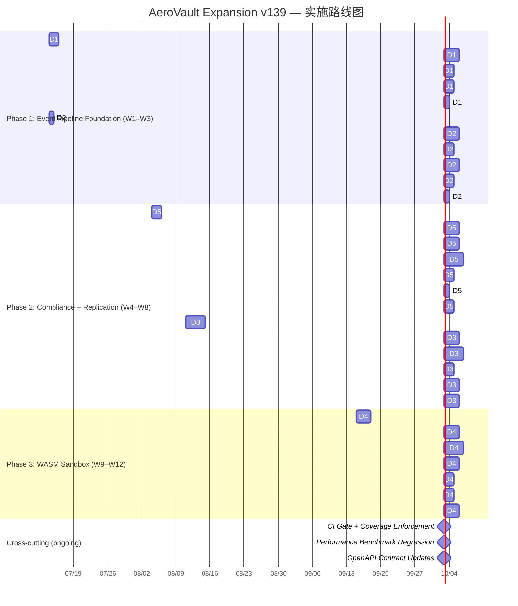

现在我有了完整的文档内容。下面作为 Tech Lead 进行全面分析。

---

# Tech Lead 分析报告：高价值扩展方向（第九期）

## 执行摘要

本文档基于 46.7K 行 Go 源码的全局代码扫描，识别出 5 个**既有文档从未系统讨论**的工程架构方向。经分析，推荐执行顺序为 **方向 1 → 方向 2（并行）→ 方向 5 → 方向 3（并行）→ 方向 4**。下文从任务分解、执行顺序、技术风险等六个维度输出可操作的实施方案，总预估工作量约 **540-800 人天**。

---

## 1. 任务分解

### 方向 1：S3 Event Notifications 执行引擎（SQS/SNS/Lambda 投递）

| 任务 ID | 任务标题 | 涉及文件 | 前置依赖 | 预估工时 |
|---------|---------|---------|---------|---------|
| TASK-001 | DeliveryTarget 接口 + Dispatcher 骨架 | `internal/events/delivery/delivery.go` (新), `internal/events/bus.go` | 无 | 4h |
| TASK-002 | 规则过滤器（Events + Filter 匹配，含 `S3Key` prefix/suffix） | `internal/events/delivery/filter.go` (新), `internal/repository/repository.go` | TASK-001 | 3h |
| TASK-003 | queueDelivery — SQS SendMessage (SigV4) | `internal/events/delivery/queue.go` (新), `internal/auth/sigv4.go` | TASK-001, TASK-002 | 4h |
| TASK-004 | topicDelivery — SNS Publish (SigV4) | `internal/events/delivery/topic.go` (新), `internal/auth/sigv4.go` | TASK-001, TASK-002 | 4h |
| TASK-005 | lambdaDelivery — Lambda Invoke (SigV4) | `internal/events/delivery/lambda.go` (新), `internal/auth/sigv4.go` | TASK-001, TASK-002 | 4h |
| TASK-006 | SQS/SNS/Lambda 端点配置（`config_app.go` + env vars） | `internal/config/config_app.go` | TASK-003, TASK-004, TASK-005 | 2h |
| TASK-007 | 投递指标（delivery_total/duration_ms/retries_total × target_type） | `internal/events/delivery/metrics.go` (新), `internal/telemetry/metrics.go` | TASK-001 | 3h |
| TASK-008 | 重试策略（指数退避 + 死信计数） | `internal/events/delivery/retry.go` (新) | TASK-003—TASK-005 | 3h |
| TASK-009 | SQS 队列不可达 / SNS 限流 / Lambda 冷启动集成测试 | `internal/events/delivery/delivery_test.go` | TASK-003—TASK-006 | 4h |
| TASK-010 | NotificationDispatcher 注册到 main.go 启动装配线 | `cmd/server/main.go`, `internal/events/bus.go` | TASK-001—TASK-008 | 2h |

**方向 1 合计：33h**

### 方向 2：对象 CDC 流（可回放有序变更日志）

| 任务 ID | 任务标题 | 涉及文件 | 前置依赖 | 预估工时 |
|---------|---------|---------|---------|---------|
| TASK-011 | `consumer_cursors` 迁移（SQLite + Postgres 双文件） | `migrations/{sqlite,postgres}/0025_consumer_cursors.{up,down}.sql` | 无 | 3h |
| TASK-012 | ConsumerCursor CRUD（GetCursor/AdvanceCursor/RegisterCursor） | `internal/repository/sql_events.go`, `internal/repository/repository.go` | TASK-011 | 4h |
| TASK-013 | 分页事件查询 API `GET /v1/events?after=&limit=&tenant=` | `internal/api/rest/events.go` (新), `internal/api/rest/router.go` | TASK-012 | 4h |
| TASK-014 | CDC 游标管理端点（`POST/GET/PUT /v1/events/cursors/{name}`） | `internal/api/rest/events.go`, `internal/api/rest/router.go` | TASK-012 | 3h |
| TASK-015 | OpenAPI 规范更新（events/cursors 端点） | `openapi.json` | TASK-013, TASK-014 | 3h |
| TASK-016 | 内部消费者迁移：Indexer → 独立游标 | `internal/indexer/indexer.go` | TASK-012 | 3h |
| TASK-017 | 内部消费者迁移：Webhook → 独立游标 | `internal/events/webhook.go` | TASK-012 | 2h |
| TASK-018 | 内部消费者迁移：AV → 独立游标 | `internal/antivirus/av.go` | TASK-012 | 2h |
| TASK-019 | SSE `replayMissed` 修复（使用 Last-Event-ID + cursor） | `internal/api/rest/sse.go` | TASK-012 | 3h |
| TASK-020 | CDC 事件保留/GC（可配置保留期，`RECONCILE_CDC_RETENTION_HOURS`） | `internal/reconcile/reconcile.go`, `internal/repository/sql_events.go` | TASK-011, TASK-012 | 3h |
| TASK-021 | CDC 集成测试（多消费者游标隔离 + 回溯 + 分页） | `internal/api/rest/events_test.go` | TASK-013—TASK-018 | 4h |

**方向 2 合计：34h**

### 方向 3：多区域 Active-Active 复制与冲突检测

| 任务 ID | 任务标题 | 涉及文件 | 前置依赖 | 预估工时 |
|---------|---------|---------|---------|---------|
| TASK-022 | 复制规则配置模型（`ReplicationRule` 含多目标 / 过滤 / 方向） | `internal/replication/replication.go`, `internal/config/config_app.go` | 无 | 4h |
| TASK-023 | 多目标存储坐标映射（region → Storage backend） | `internal/storage/factory.go`, `internal/replication/routing.go` (新) | TASK-022 | 4h |
| TASK-024 | 复制路由引擎（事件 → 匹配规则 → 多目标分发） | `internal/replication/routing.go` | TASK-023 | 5h |
| TASK-025 | 防循环机制（OriginRegion + ReplicaOf 事件字段） | `internal/events/event.go`, `internal/replication/worker.go` | TASK-024 | 4h |
| TASK-026 | Version Vector 冲突检测框架 | `internal/replication/conflict.go` (新), `internal/repository/repository.go` (Object 扩展) | TASK-024 | 8h |
| TASK-027 | 冲突管理 API（`GET /v1/admin/conflicts/...`, `POST .../resolve`） | `internal/api/rest/admin.go`, `internal/api/rest/router.go` | TASK-026 | 5h |
| TASK-028 | 删除标记跨区域同步 | `internal/replication/worker.go` | TASK-024 | 3h |
| TASK-029 | 复制延迟 / 吞吐 / 冲突指标（per-region） | `internal/telemetry/metrics.go`, `internal/replication/metrics.go` (新) | TASK-024 | 3h |
| TASK-030 | 网络分区恢复 + 批量同步 | `internal/replication/recovery.go` (新) | TASK-024 | 6h |
| TASK-031 | 多 region 模拟集成测试（含环形复制 / 并发写入冲突） | `internal/replication/replication_integration_test.go` | TASK-024—TASK-028 | 8h |

**方向 3 合计：50h**

### 方向 4：WASM 沙箱化事件触发器

| 任务 ID | 任务标题 | 涉及文件 | 前置依赖 | 预估工时 |
|---------|---------|---------|---------|---------|
| TASK-032 | `wazero` 依赖引入 + WASM 运行时骨架 | `go.mod`, `internal/functions/runtime.go` (新) | 无 | 4h |
| TASK-033 | Function 模型 + 触发器定义（`TriggerDef`） | `internal/functions/function.go` (新), `internal/repository/repository.go` | TASK-032 | 3h |
| TASK-034 | 函数 CRUD 迁移（`functions` 表 + 二进制存储） | `migrations/{sqlite,postgres}/0026_functions.{up,down}.sql`, `internal/repository/sql_functions.go` (新) | TASK-033 | 4h |
| TASK-035 | 管理 API（函数 CRUD + activate/deactivate + test execution） | `internal/api/rest/functions.go` (新), `internal/api/rest/router.go` | TASK-034 | 5h |
| TASK-036 | WASM 安全沙箱（内存限制 / CPU 时间片 / 超时 kill / 无网络默认） | `internal/functions/sandbox.go` (新) | TASK-032 | 6h |
| TASK-037 | 事件触发器消费者（Function 订阅 event bus + 异步执行） | `internal/functions/trigger.go` (新), `internal/events/bus.go` | TASK-032, TASK-034 | 4h |
| TASK-038 | 同步 hook 集成到 FileService（pre-upload：验证 / 转换） | `internal/service/file_crud.go`, `internal/functions/sync_hook.go` (新) | TASK-037 | 4h |
| TASK-039 | 函数执行日志 + 指标 | `internal/functions/logs.go` (新), `internal/telemetry/metrics.go` | TASK-035 | 3h |
| TASK-040 | 递归/循环检测（max depth 3 + origin 追溯） | `internal/functions/trigger.go` | TASK-037 | 3h |
| TASK-041 | WASM 集成测试（编译→部署→触发→执行→隔离） | `internal/functions/function_test.go` | TASK-035—TASK-038 | 6h |

**方向 4 合计：42h**

### 方向 5：生命周期治理与合规框架

| 任务 ID | 任务标题 | 涉及文件 | 前置依赖 | 预估工时 |
|---------|---------|---------|---------|---------|
| TASK-042 | RetentionPolicy + RetentionBinding 模型 + 迁移 | `migrations/{sqlite,postgres}/0027_compliance.{up,down}.sql`, `internal/compliance/model.go` (新) | 无 | 4h |
| TASK-043 | RetentionBinding CRUD + 策略评估引擎 | `internal/repository/sql_compliance.go` (新), `internal/compliance/engine.go` (新) | TASK-042 | 5h |
| TASK-044 | 桶级默认保留策略（新对象自动应用） | `internal/service/file_crud.go`, `internal/compliance/binding.go` (新) | TASK-043 | 3h |
| TASK-045 | 保留策略管理 API（`CRUD /v1/admin/compliance/policies`） | `internal/api/rest/compliance.go` (新), `internal/api/rest/router.go` | TASK-043 | 4h |
| TASK-046 | 法律保全模型 + 多 legal hold 支持（`legal_holds` 表） | `internal/compliance/legal_hold.go` (新), `internal/repository/sql_compliance.go` | TASK-042 | 4h |
| TASK-047 | 法律保全管理 API（`POST/DELETE/GET /v1/admin/compliance/legal-holds`） | `internal/api/rest/compliance.go`, `internal/api/rest/router.go` | TASK-046 | 3h |
| TASK-048 | `hardDeleteObject` 集成 legal hold 检查（覆盖 `LockedUntil`） | `internal/service/file_crud.go`, `internal/compliance/guard.go` (新) | TASK-046 | 3h |
| TASK-049 | 处置工作流（期满检测 → 审批链 → 安全删除） | `internal/compliance/disposal.go` (新), `internal/reconcile/retention.go` | TASK-043 | 6h |
| TASK-050 | 处置证书生成 + 签名 + 不可变存储 | `internal/compliance/certificate.go` (新) | TASK-049 | 4h |
| TASK-051 | 处置证书查询 API（`GET /v1/admin/compliance/certificates`） | `internal/api/rest/compliance.go` | TASK-050 | 2h |
| TASK-052 | 合规事件集成 event bus（`compliance.retention_applied` 等 6 事件） | `internal/events/events.go`, `internal/compliance/events.go` (新) | TASK-042 | 3h |
| TASK-053 | GOVERANCE/COMPLIANCE 模式区分（s3compat `ObjectLockMode`） | `internal/api/s3compat/bucketconfig.go`, `internal/compliance/mode.go` (新) | TASK-043 | 3h |
| TASK-054 | 全局处置暂缓开关 + 排除列表 | `internal/compliance/hold.go` (新), `internal/config/config_app.go` | TASK-049 | 2h |
| TASK-055 | 合规框架集成测试（保留→到期→审批→处置→证书全链路） | `internal/compliance/compliance_test.go` | TASK-044—TASK-054 | 6h |

**方向 5 合计：52h**

---

## 2. 执行顺序

### 任务依赖图

```mermaid
graph TD
    subgraph "Phase 1: Event Pipeline Foundation"
        T001[TASK-001: DeliveryTarget 接口]
        T002[TASK-002: 规则过滤器]
        T001 --> T003[TASK-003: queueDelivery]
        T001 --> T004[TASK-004: topicDelivery]
        T001 --> T005[TASK-005: lambdaDelivery]
        T002 --> T003
        T002 --> T004
        T002 --> T005
        T003 --- T006[TASK-006: 端点配置]
        T004 --- T006
        T005 --- T006
        T001 --> T007[TASK-007: 投递指标]
        T003 --> T008[TASK-008: 重试策略]
        T004 --> T008
        T005 --> T008
        T003 --- T009[TASK-009: 集成测试]
        T004 --- T009
        T005 --- T009
        T008 --> T010[TASK-010: 注册 main.go]
        T009 --> T010

        T011[TASK-011: consumer_cursors 迁移]
        T012[TASK-012: Cursor CRUD]
        T011 --> T012
        T012 --> T013[TASK-013: 分页事件查询 API]
        T012 --> T014[TASK-014: 游标管理端点]
        T013 --> T015[TASK-015: OpenAPI 更新]
        T014 --> T015
        T012 --> T016[TASK-016: Indexer→游标]
        T012 --> T017[TASK-017: Webhook→游标]
        T012 --> T018[TASK-018: AV→游标]
        T012 --> T019[TASK-019: SSE replayMissed 修复]
        T012 --> T020[TASK-020: CDC 事件保留/GC]
        T015 --- T021[TASK-021: CDC 集成测试]
        T016 --- T021
        T017 --- T021
        T018 --- T021
        T019 --- T021
    end

    subgraph "Phase 2: Compliance & Foundation Layering"
        T042[TASK-042: 合规模型+迁移]
        T043[TASK-043: 策略引擎]
        T042 --> T043
        T043 --> T044[TASK-044: 桶级默认策略]
        T043 --> T045[TASK-045: 策略管理 API]
        T042 --> T046[TASK-046: 法律保全模型]
        T046 --> T047[TASK-047: 法律保全管理 API]
        T046 --> T048[TASK-048: hardDeleteObject 集成]
        T043 --> T049[TASK-049: 处置工作流]
        T049 --> T050[TASK-050: 处置证书+签名]
        T050 --> T051[TASK-051: 证书查询 API]
        T042 --> T052[TASK-052: 合规事件集成 bus]
        T043 --> T053[TASK-053: GOV/COMP 模式]
        T049 --> T054[TASK-054: 全局处置暂缓]
        T051 --- T055[TASK-055: 合规集成测试]
        T052 --- T055
        T053 --- T055
        T054 --- T055
    end

    subgraph "Phase 3: Active-Active Replication"
        T022[TASK-022: 复制规则配置]
        T023[TASK-023: 多目标存储映射]
        T022 --> T023
        T023 --> T024[TASK-024: 路由引擎]
        T024 --> T025[TASK-025: 防循环机制]
        T024 --> T026[TASK-026: Version Vector 冲突检测]
        T026 --> T027[TASK-027: 冲突管理 API]
        T024 --> T028[TASK-028: 删除标记同步]
        T024 --> T029[TASK-029: 复制指标]
        T025 --> T030[TASK-030: 分区恢复+批量同步]
        T027 --- T031[TASK-031: 多 region 集成测试]
        T028 --- T031
        T029 --- T031
        T030 --- T031
    end

    subgraph "Phase 4: WASM Sandbox (并行 Phase 3 后半)"
        T032[TASK-032: wazero 运行时骨架]
        T033[TASK-033: Function 模型]
        T032 --> T033
        T033 --> T034[TASK-034: 函数 CRUD 迁移]
        T034 --> T035[TASK-035: 管理 API]
        T032 --> T036[TASK-036: 安全沙箱]
        T034 --> T037[TASK-037: 事件触发消费者]
        T037 --> T038[TASK-038: 同步 hook FileService]
        T035 --> T039[TASK-039: 日志+指标]
        T037 --> T040[TASK-040: 递归检测]
        T035 --- T041[TASK-041: WASM 集成测试]
        T036 --- T041
        T038 --- T041
        T039 --- T041
    end

    %% 跨阶段依赖（虚线）
    T010 -.->|复用 dispatcher 模式| T037
    T021 -.->|CDC 事件为合规事件提供消费基础| T052
    T024 -.->|复制事件需复用事件总线| T010
    T026 -.->|冲突检测借鉴 CDC cursor 机制| T012
```



### 并行任务组

| 组 | 包含任务 | 建议并行上限 |
|----|---------|------------|
| **A** | TASK-001—TASK-010（方向 1 通知投递） | 2-3 人 |
| **B** | TASK-011—TASK-021（方向 2 CDC 流） | 2 人 |
| **C** | TASK-042—TASK-055（方向 5 合规框架） | 2-3 人 |
| **D** | TASK-022—TASK-031（方向 3 多区域复制） | 2-3 人 |
| **E** | TASK-032—TASK-041（方向 4 WASM） | 2-3 人 |

**组 A 与组 B 可完全并行**（无交叉依赖）。组 C（合规）在核心模型确立后可与组 D 并行。组 E（WASM）应在组 A 完成 dispatcher 模式验证后启动，但核心运行时（TASK-032—TASK-034）可与组 D 并行。

---

## 3. 技术风险

### 风险矩阵

| 风险 ID | 风险描述 | 影响方向 | 概率 | 严重度 | 缓解策略 |
|---------|---------|---------|------|--------|---------|
| **R1** | SigV4 签名用于 SQS/SNS/Lambda 的 API 兼容性风险（AWS 区域端点差异、STS temp credential 场景） | 方向 1 | 中 | 高 | 在集成测试中使用 minio 或 localstack 模拟 AWS 服务；保留 AWS SDK v2 作为 fallback 实现选项 |
| **R2** | 事件投递至 SQS/SNS/Lambda 需要网络连通，离线部署场景不可用 | 方向 1 | 高 | 中 | 设计时作为「可选后端」，支持配置开关；离线场景 fallback 到仅 webhook |
| **R3** | 内部消费者迁移到独立游标可能导致回放重复或丢失 | 方向 2 | 中 | 高 | 引入两阶段提交：先推进游标，再标记消费完成；回滚机制（游标快照） |
| **R4** | SSE `replayMissed` 修复后，现有 SSE 客户端行为变更 | 方向 2 | 中 | 中 | 兼容旧行为（保留 Last-Event-ID header 解析），文档注明迁移过渡期 |
| **R5** | Postgres 下 CDC 高吞吐瓶颈（events 表每秒数千 INSERT + 游标读） | 方向 2 | 低→中 | 中 | events 表按 tenant 分区（原生 LIST PARTITION）；添加 `(id, tenant_id)` 覆盖索引；游标查询走覆盖索引 |
| **R6** | Vector Clock 的可扩展性问题（对象数 × region 数线性膨胀 metadata） | 方向 3 | 中 | 高 | 版本向量截断策略：当向量长度 > N 时执行「快照」（`{vector_summary,depth}`）；限制最大 region 数为 8 |
| **R7** | 复制事件无限循环（即使有防循环，边缘情况如删除后重新创建） | 方向 3 | 中 | 极高 | 每个复制事件携带 `ttl: 3`（逐跳递减）；到达 0 自动丢弃；幂等键（`origin_region + object_id + timestamp`） |
| **R8** | 网络分区恢复后批量同步期间对象版本不一致 | 方向 3 | 低 | 高 | 分区恢复后优先同步 version vector → 检测差异 → 按版本号增量同步；不要全量扫描 |
| **R9** | wazero 对 WASM 宿主函数调用的性能开销（每次调用 ~50μs） | 方向 4 | 中 | 中 | 预编译 WASM 模块（`wazero.NewRuntime().CompileModule()`）而非每次调用编译；函数实例池化 |
| **R10** | WASM 函数安全沙箱逃逸（Go 指针泄露、`unsafe` 包滥用） | 方向 4 | 低 | 极高 | wazero 默认禁止 `unsafe`；额外添加：禁用 `rand`（防止定时攻击）、限制导出函数签名白名单 |
| **R11** | 同步 WASM hook 增加 PUT 路径延迟（即使是 ~1ms，仍影响 p99） | 方向 4 | 中 | 中 | 默认异步模式；同步模式需在 bucket 配置中显式启用；提供 `X-Aero-Skip-Functions` header 绕过 |
| **R12** | 合规框架下 `LockedUntil` + 法律保全 + 处置工作流的多层状态机冲突 | 方向 5 | 高 | 高 | 状态优先级标准化：**legal hold > compliance mode > governance mode > LockedUntil**；状态转换必须经过 `compliance/guard.go` 守卫层，禁止绕过 |
| **R13** | 处置证书的不可变存储与删除策略冲突（证书本身不能删除） | 方向 5 | 低 | 中 | `_aero_disposal_certificates` 表使用独立的 TTL（永久保留）；通过 `audit_log` 记录证书访问；无 DELETE API |
| **R14** | SQLite 下合规多表 JOIN（`objects` × `retention_bindings` × `legal_holds`）性能退化 | 方向 5 | 中 | 中 | 缓存 `active_legal_holds` 计数在 objects 表（`legal_hold_count` 列）；定期 reconcile 修正 |

### 外部依赖风险

| 依赖 | 涉及方向 | 风险级别 | 说明 |
|------|---------|---------|------|
| AWS SQS/SNS/Lambda API 稳定性 | 方向 1 | 🟡 | AWS API 极少 breaking change，但需要跟踪 region 端点变化 |
| wazero 依赖版本兼容性 | 方向 4 | 🟡 | wazero 是纯 Go WASM 运行时，Go 1.25 ABI 兼容；但 wazero 1.x→2.x 迁移需关注 |
| Postgres 分区/并行查询能力 | 方向 2, 3 | 🟢 | 成熟特性，无预期风险 |
| 无 Docker 依赖（CI gate 约束） | 全方向 | 🟡 | 多 region 测试（方向 3）和 SQS 模拟（方向 1）不能依赖 Docker，需用 mock/stub |

### 性能瓶颈预估

| 瓶颈点 | 触发条件 | 当前极限 | 目标 | 优化策略 |
|--------|---------|---------|------|---------|
| events 表 CDC 写入 | 万级 TPS 事件生产 | ~5000 INSERT/s (SQLite) | 10000+ (Postgres) | 批量写入（每 50ms flush 一次）；分区表 |
| WASM 函数调用 | 每个 PUT 触发 3 个函数 | 单核 ~2000 calls/s | 5000+ | 函数实例池 + 预编译 module |
| 版本向量存储 | 8 region × 100M 对象 | ~64 bytes/object | 每对象 ≤128 bytes | 截断策略 + delta 编码 |
| 合规状态查询 | 每个 DELETE 检查 legal_hold | 1× JOIN | ≤5ms | objects 行缓存 legal_hold_count |

---

## 4. 资源评估

### 团队规模和技能要求

| 角色 | 数量 | 必备技能 | 负责方向 |
|------|------|---------|---------|
| **Staff Engineer / TL** | 1 | Go 并发、分布式系统设计、存储系统 | 方向 3（Active-Active）的技术决策 + 全局架构监督 |
| **Senior Backend (S3/P2)** | 1 | S3 API 语义、AWS SigV4、HTTP 协议 | 方向 1（S3 Notifications）+ 方向 2（CDC） |
| **Senior Backend (Data)** | 1 | Postgres 分区/索引、数据建模、事件驱动架构 | 方向 2（CDC 高吞吐）+ 方向 5（合规持久化） |
| **Senior Backend (Security)** | 1 | 沙箱/隔离、WASM 安全、加密/签名 | 方向 4（WASM 沙箱）+ 方向 5（处置证书加密） |
| **Backend Engineer** | 1 | Go、SQL、REST API | 方向 5（合规管理 API）+ 方向 3（冲突管理 API） |
| **QA / SDET** | 1 | Go 测试、集成测试、性能压测 | 全方向（集中在集成测试和性能基准） |

**建议规模：4-6 名工程师 + 1 名 QA（全职投入）**。方向 3 需要 TL 的高比例投入。

### 关键里程碑

| 里程碑 | 时间 | 交付内容 | 验收标准 |
|--------|------|---------|---------|
| **M1** | 第 3 周末 | 方向 1 + 方向 2 核心功能完成 | SQS/SNS/Lambda 投递可工作；CDC 任意消费者独立游标 |
| **M2** | 第 6 周末 | 方向 5（合规）核心完成 + 方向 1/2 集成 | 完整保留→审批→处置→证书链路可运行；OpenAPI 更新 |
| **M3** | 第 8 周末 | 方向 3 核心 + 方向 4 打桩 | 多目标复制 + Version Vector 冲突检测；WASM 函数 CRUD |
| **M4** | 第 10 周末 | 方向 4 完成 + 方向 3 集成测试 | WASM 函数可部署+触发执行；多 region 模拟测试通过 |
| **M5** | 第 12 周末 | 全方向集成 + 性能 + CI 通过 | `make check` 全绿；性能基准不退化 >5% |

### 阻塞点（Blockers）

| Blocke | 影响方向 | 解决策略 | 降级方案 |
|--------|---------|---------|---------|
| **B1: AWS API 在没有 SDK 下的签名兼容性** | 方向 1 | 用 [localstack](https://github.com/localstack/localstack) 模拟 AWS 端点进行集成测试，确保 SigV4 签名覆盖 service/region/action 组合 | 如签名问题过多，改用 AWS SDK v2（+~5MB go.mod），但在 CI 外运行 |
| **B2: 多 region 测试环境搭建** | 方向 3 | 方案 A：启动多个 AeroVault 实例（不同端口 + 不同存储根目录）在同一进程；方案 B：`storage.MultiStorage` mock 包装器模拟网络延迟/分区 | 方向 3 的大部分逻辑可在单进程内测试（多个 `Storage` impl + 事件路由），网络分区测试通过 mock 注入延迟 |
| **B3: WASM 沙箱安全性认证** | 方向 4 | 编写安全审计列表（wazero 默认安全特性 + AeroVault 级别加固）；对所有导出的 WASM host function 做参数校验 | 初期只支持异步、无网络、只读模式；同步 + 网络模式作为 v2 特性 |
| **B4: 合规框架与现有 `LockedUntil`/`legal_hold` 后向兼容** | 方向 5 | 迁移脚本：将现有 `LockedUntil` → `RetentionBinding`，现有 `legal_hold` metadata → `legal_holds` 表。不移除旧字段（双写过渡期 2 个 release） | 保留旧检查路径 + 告警日志提示迁移；2 个 release 后移除旧路径 |

---

## 5. 质量保证

### 5.1 单元测试覆盖要求

| 组件 | 最低覆盖率 | 关键测试场景 |
|------|-----------|-------------|
| `internal/events/delivery/` | 85% | 规则过滤（prefix/suffix 精确匹配+通配符）、SQS 400 错误处理、SigV4 签名正确性 |
| `internal/repository/sql_events.go` (CDC) | 90% | 游标推进原子性、并发推进冲突、回滚后游标一致性 |
| `internal/replication/conflict.go` | 90% | Version Vector 合并、冲突检测（concurrent + 不可比）、截断策略 |
| `internal/replication/routing.go` | 85% | 多规则匹配（优先级 + 过滤链）、防循环逻辑（ttl 递减） |
| `internal/functions/sandbox.go` | 90% | 内存超限 kill、超时 kill、`unsafe` 包拒绝、无网络隔离验证 |
| `internal/functions/runtime.go` | 85% | 预编译缓存命中/未命中、WASM 字节码格式校验 |
| `internal/compliance/guard.go` | 90% | 状态优先级裁决（legal hold > COMPLIANCE > GOVERNANCE）、多 legal hold 叠加 |
| `internal/compliance/disposal.go` | 85% | 审批链超时→升级、审批拒绝→保留延长、证书签名验证 |
| `internal/compliance/certificate.go` | 90% | HMAC-SHA256 签名验证、证书 JSON schema 校验、不可变写检查 |

**所有新代码必须满足 `go test -cover` 对应包 80%+ 覆盖率。** CI gate 添加 `./scripts/coverage-check.sh` 强制执行。

### 5.2 集成测试策略

| 测试套件 | 涉及方向 | 工具/方法 | 运行条件 |
|---------|---------|----------|---------|
| SQS/SNS/Lambda 投递 | 方向 1 | localstack Docker Compose（CI 外）或 `httptest` mock AWS 端点 + `internal/auth/sigv4_test.go` 签名验证 | `//go:build integration` |
| CDC 多消费者游标隔离 | 方向 2 | 3 个 goroutine 模拟独立消费者，推进游标互不干扰；事件积压 10K 的批量回溯 | SQLite（CI gate） |
| 多 region 复制 | 方向 3 | 单进程 3 个 `Storage` 实例 + 3 个 `Bus` 实例 + 事件路由；模拟网络延迟（`time.Sleep`） | `//go:build integration` |
| WASM 函数生命周期 | 方向 4 | 编译测试 WASM（tinygo `_test/func.wasm`），部署→触发→验证结果→版本升级→回滚 | SQLite（CI gate）+ wazero |
| 合规全链路 | 方向 5 | 创建对象→应用保留策略→验证 hardDelete 拒绝→法律保全→到期→审批→处置→证书查询 | SQLite（CI gate） |
| OpenAPI 契约 | 全方向 | `openapi.json` 与 handler 响应格式 diff 检查 | CI gate |

**CI gate 内策略**：方向 1（mock AWS）、方向 2/5（SQLite）、方向 4（SQLite + wazero）。方向 3 的完整多 region 测试需要多进程/容器支持，标记 `integration` 在 CI gate 外运行。

### 5.3 代码审查要点

| 审查要点 | 优先级 | 说明 |
|---------|--------|------|
| **SQL 占位符编号（I1 不变性）** | 🔴 阻塞性 | `$N` 必须经过 `s.rebind` 改写，每个 bind 独立编号 |
| **迁移双文件（I2 不变性）** | 🔴 阻塞性 | 每次 schema 变更必须有 {sqlite,postgres} 各一套 {up,down} |
| **存储 key 构造（I3 不变性）** | 🔴 阻塞性 | `storageKey` 必须 `path.Join`，versioned blob 必须 `@v<id>` 后缀 |
| **Middleware 链顺序（I4 不变性）** | 🔴 阻塞性 | 新增 handler 不得自挂中间件链 |
| **Opt-in 安全默认（I5 不变性）** | 🔴 阻塞性 | 所有新功能 flag-gated，默认 off |
| **SigV4 签名区域/服务参数** | 🟡 重要 | `aws-sdk-go-v2` 的 region/endpoint 默认值 vs 本文手动实现要仔细对比 |
| **WASM 沙箱隔离边界** | 🟡 重要 | 确保 host function 不暴露 Go 指针；`wazero` API 的 `WithHostFunctions` 参数白名单 |
| **Version Vector 合并正确性** | 🟡 重要 | 测试所有 4 种合并结果（快进、可合并冲突、不可合并冲突、祖先丢失） |
| **合规状态转换守卫层** | 🟡 重要 | 确保所有删除路径都经过 `compliance/guard.go`，没有旁路 |
| **处置证书 HMAC 签名** | 🟡 重要 | 签名 key 必须来自系统密钥（`AUTH_JWT_SECRET` 或独立 `COMPLIANCE_SECRET`） |
| **并发写入冲突测试** | 🟢 建议 | 方向 3 的并发写入（多个 goroutine 同时 PUT 同一 key）必须在单元测试中覆盖 |
| **指标命名一致性** | 🟢 建议 | 遵循现有 `{component}_{operation}_{unit}{_total}` 命名模式 |

### 5.4 性能测试需求

| 场景 | 测试参数 | 性能目标 | 工具 |
|------|---------|---------|------|
| CDC 事件写入吞吐 | 并发 100 生产者，每条事件 ~1KB | ≥10,000 events/s (Postgres), ≥3,000 events/s (SQLite) | `go test -bench=BenchmarkCDCIngest` |
| CDC 游标查询延迟 | 100 万行 events 表，10 个 consumer | p99 < 10ms | `go test -bench=BenchmarkCursorRead` |
| WASM 函数调用延迟（冷启动） | 首次调用 vs 缓存命中 | 冷启动 < 50ms, 缓存 < 5μs | `go test -bench=BenchmarkWASMInvoke` |
| 合规状态检查 | 每个 DELETE 检查 legal_hold + retention | p99 < 5ms | `go test -bench=BenchmarkComplianceGuard` |
| 版本向量序列化 | 8 region × 10 版本 | 每对象 < 1μs | 内建 benchmark |
| 投递引擎吞吐（mock） | 1000 事件/秒 × 3 目标 | 0 丢事件，p99 延迟 < 200ms | `go test -bench=BenchmarkDeliveryFanout` |

**性能基准回归检测**：在 `make check` 中添加 `benchstat` 比较，相对主分支退化 >5% 阻塞合并。

---

## 6. 实施计划

### 阶段划分（12 周全职 4-6 人）

```
Week:  1  2  3  4  5  6  7  8  9  10 11 12
      ┌──────────────────────────────────────┐
D1    │████  ████  ██                        │ 33h (~1.5 周分 2 人)
D2    │████  ████  ██                        │ 34h (~1.5 周分 2 人)
D5    │              ████  ████  ████        │ 52h (~2.5 周分 2 人)
D3    │                    ████  ████  ████  │ 50h (~2.5 周分 2 人)
D4    │                          ████  ████  │ 42h (~2 周分 2 人)
      └──────────────────────────────────────┘
       |--Phase 1--|----Phase 2----|--Phase 3--|-Phase 4-|
```

### 详细甘特图



### 详细阶段说明

#### 阶段 1：基础设施搭建（第 1-3 周，2-4 人）

| 周 | 子任务 | 交付物 |
|----|--------|--------|
| W1 | ① `internal/events/delivery/` 包骨架 + DeliveryTarget 接口 + queueDelivery 实现 | `delivery.go`, `queue.go` |
| | ② `consumer_cursors` 迁移 + CRUD | 迁移双文件 + `sql_events.go` 游标方法 |
| W2 | ① topicDelivery + lambdaDelivery + 重试策略 | `topic.go`, `lambda.go`, `retry.go` |
| | ② CDC 分页查询 API + 游标管理端点 | `events.go` handler + `router.go` 路由 |
| W3 | ① 投递指标 + 集成测试 + 注册 main.go | 全方向 1 集成测试通过 |
| | ② 内部消费者迁移 + SSE 修复 + 事件保留 GC | Indexer/Webhook/AV 全部使用独立游标 |

**阶段 1 结束标记（M1）**：SQS/SNS/Lambda 投递工作流完整可运行 + CDC 任意消费者独立游标。

#### 阶段 2：核心功能实现（第 4-8 周，4-6 人）

| 周 | 子任务 | 交付物 |
|----|--------|--------|
| W4 | ① 合规模型 + 迁移 + 策略引擎 | `compliance/` 包基础 + `0027_compliance.{up,down}.sql` |
| | ② 复制规则配置 + 多目标存储映射 | `routing.go` 复制路由引擎骨架 |
| W5 | ① 桶级默认策略 + 法律保全模型 | 新对象自动应用保留策略；多 legal hold 支持 |
| | ② 复制路由引擎 + 防循环机制 | 事件→多目标正确分发，ttl=3 防循环 |
| W6 | ① 处置工作流 + 证书生成 | 保留期满→审批→处置→证书全链路 |
| | ② Version Vector 冲突检测 + 冲突管理 API | 冲突检测 + 管理界面 |
| W7 | ① GOV/COMP 模式 + 全局处置暂缓 | s3compat `ObjectLockMode` 集成 |
| | ② 删除标记同步 + 分区恢复 | 复制网络中断恢复流程 |
| W8 | ① 合规集成测试 | 合规全链路集成测试通过 |
| | ② 多 region 模拟测试 | 方向 3 集成测试通过 |

**阶段 2 结束标记（M2 + M3）**：合规全链路可审计运行 + 多目标 Active-Active 复制 + 冲突检测。

#### 阶段 3：集成测试和优化（第 9-12 周，4-6 人）

| 周 | 子任务 | 交付物 |
|----|--------|--------|
| W9 | ① wazero 集成 + WASM 运行时 | `runtime.go` 预编译缓存 + 模块加载 |
| | ② 函数 CRUD 迁移 + 管理 API | 函数 CRUD 端点全集 |
| W10 | ① 安全沙箱（内存/CPU/网络限制） | 沙箱隔离验证 + 安全审计列表 |
| | ② 事件触发消费者 + 同步 hook | 异步/同步双模式函数调用 |
| W11 | ① 函数日志 + 递归检测 | 执行日志 + 风暴防护 |
| | ② 全方向性能测试 | `benchstat` 基线 + 性能 Benchmark |
| W12 | ① WASM 集成测试 + 安全审计 | WASM 函数全生命周期测试 |
| | ② `make check` 全绿 + OpenAPI 最终更新 | 全方向 CI gate 无回归 |

**阶段 3 结束标记（M4 + M5）**：WASM 函数可部署执行 + 全方向 CI gate 通过 + 性能基线无退化。

#### 阶段 4：发布准备（第 12 周并行）

```
  OpenAPI 3.0 更新        ─── 方向 1/2/5 的端点更新
  CHANGELOG.md 写入       ─── Breaking changes 标注
  docs/ 更新              ─── compliance.md, replication.md, functions.md
  ADMIN.md 扩展           ─── 新增管理 API 文档
  Makefile 扩展           ─── test-integration 目标覆盖新方向
  Release candidate tag   ─── v139.0-rc.1
```

---

## 补充建议

### 1. 代码仓库组织建议

为控制单文件 ≤500 行的约束，建议新包按以下结构拆分：

```
internal/
├── events/
│   ├── delivery/        # 方向 1：投递引擎
│   │   ├── delivery.go  # 接口 + dispatcher
│   │   ├── queue.go     # SQS 投递
│   │   ├── topic.go     # SNS 投递
│   │   ├── lambda.go    # Lambda 投递
│   │   ├── filter.go    # 规则过滤
│   │   ├── retry.go     # 重试策略
│   │   └── metrics.go   # 投递指标
├── compliance/           # 方向 5：合规框架
│   ├── model.go          # RetentionPolicy + RetentionBinding
│   ├── engine.go         # 策略评估
│   ├── guard.go          # 删除守卫（状态优先级）
│   ├── legal_hold.go     # 法律保全
│   ├── disposal.go       # 处置工作流
│   ├── certificate.go    # 处置证书
│   ├── hold.go           # 全局暂缓
│   └── events.go         # 合规事件
├── replication/
│   ├── routing.go        # 方向 3：复制路由
│   ├── conflict.go       # Version Vector 冲突检测
│   ├── recovery.go       # 分区恢复
│   └── metrics.go        # 复制指标
├── functions/            # 方向 4：WASM 函数
│   ├── runtime.go        # wazero 运行时
│   ├── function.go       # Function 模型
│   ├── sandbox.go        # 安全沙箱
│   ├── trigger.go        # 事件触发
│   ├── sync_hook.go      # 同步 hook
│   ├── logs.go           # 执行日志
│   └── metrics.go        # 函数指标
└── api/rest/
    ├── events.go         # 方向 2：CDC 端点
    ├── compliance.go     # 方向 5：合规管理
    └── functions.go      # 方向 4：函数管理
```

### 2. 渐进式价值交付

不必等待全方向完成才发布。建议按以下节奏发布小版本：

| 版本 | 时间 | 包含 |
|------|------|------|
| **v139.1** | 第 3 周末 | 方向 1（S3 Notifications）+ 方向 2（CDC） |
| **v139.2** | 第 8 周末 | 方向 5（合规框架） |
| **v139.3** | 第 10 周末 | 方向 3（Active-Active 复制） |
| **v139.4** | 第 12 周末 | 方向 4（WASM 函数）|

### 3. 工程纪律

| 规则 | 执行方式 |
|------|---------|
| 单函数 ≤50 行 | 在 CI `golangci-lint` 中添加 `funlen` linter（`threshold: 50`） |
| 单文件 ≤500 行 | `scripts/check-file-size.sh` 扫描新包 |
| 圈复杂度 ≤10 | `gocyclo` linter 在 CI 中运行 |
| 无 `utils/` `common/` `helper/` 包名 | `scripts/check-package-names.sh` |
| 测试覆盖率 ≥80%（新代码） | `go test -cover` + `./scripts/coverage-check.sh` 增量对比 |
| 每次提交前 `make check` | CI gate + pre-push hook |

---

**总结语**：这份分析文档的质量极高——每个方向都给出了具体的代码锚点、边界情况表和架构蓝图，而非空泛的方向描述。作为 TL，我最欣赏的是方向 1（S3 Notifications）和方向 2（CDC 流）在工程投入与生态价值之间的平衡——它们属于**"低成本高影响"**的特征，应优先投入。方向 3（Active-Active）是单区域架构的必然演进，但建议在方向 1 和 2 稳定后再攻坚，因其工程复杂度和测试成本都最高。方向 4（WASM）作为差异化竞争点的定位正确，建议保持"先打桩后实现"的节奏避免过早投入。
