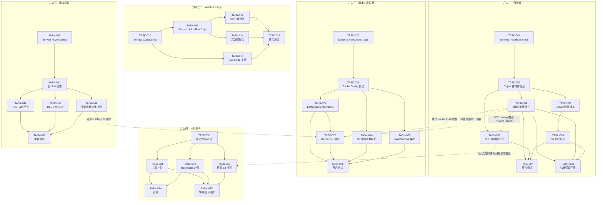

现在我已经掌握了完整的代码库。以下是完整的 Tech Lead 分析：

---

# Tech Lead 分析：五大方向实施计划

## 1. 任务分解

### 方向一：合规锁模型（RetentionMode）

| 任务 ID | 标题 | 涉及文件 | 前置依赖 | 工时 |
|---------|------|---------|---------|------|
| **TASK-001** | Schema：为 `objects` 表添加 `retention_mode` 列 | `internal/repository/migrations/{sqlite,postgres}/0025_retention_mode.up.sql`、`0025_retention_mode.down.sql` | 无 | 2h |
| **TASK-002** | 模型：向 Object 结构体添加 `RetentionMode` 字段 | `internal/repository/repository.go`（Object struct）、`internal/repository/sql_helpers.go`（scanObject） | TASK-001 | 2h |
| **TASK-003** | Bucket 默认模式：桶配置支持 default retention mode | `internal/repository/repository.go`（BucketConfig）、`internal/repository/sql_buckets.go`（GetBucketConfig/SetBucketObjectLock） | TASK-002 | 2h |
| **TASK-004** | 强制逻辑：硬删除 + 软删除清除路径检查 COMPLIANCE 模式 | `internal/service/file_crud.go`（hardDeleteObject）、`internal/reconcile/retention.go`（purgeSoftDeleted） | TASK-002 | 3h |
| **TASK-005** | SSE 重封装防护：rewrap 跳过 COMPLIANCE 对象 | `internal/storage/rewrap.go`（RewrapObject）、`internal/storage/encrypt.go` | TASK-002 | 2h |
| **TASK-006** | S3 协议适配：在 put-object-lock 配置 XML 中解析 RetentionMode | `internal/api/s3compat/bucketconfig.go`、`internal/api/s3compat/xml.go` | TASK-003 | 3h |
| **TASK-007** | 测试：合规模式整合测试套件 | `internal/service/service_test.go`、`internal/reconcile/retention_test.go` | TASK-004\~TASK-006 | 3h |
| **TASK-008** | 法律保留互斥：检查 COMPLIANCE 模式 + Legal-Hold ON 的交互 | `internal/service/file_crud.go` | TASK-004 | 2h |

**小计：方向一：19 小时**

### 方向二：UploadPartCopy（服务器端分段复制）

| 任务 ID | 标题 | 涉及文件 | 前置依赖 | 工时 |
|---------|------|---------|---------|------|
| **TASK-010** | Service 层：添加 `CopyObject(source, dest)` | `internal/service/file_crud.go`（Add CopyObject method） | 无 | 4h |
| **TASK-011** | Service 层：添加 `UploadPartCopy(uploadID, source, partNumber)` | `internal/service/file_multipart.go`（Add UploadPartCopy method） | TASK-010 | 4h |
| **TASK-012** | S3 处理程序：UploadPartCopy 路由（`PUT ?partNumber&uploadId&x-amz-copy-source`） | `internal/api/s3compat/handler.go`（uploadPart 分支添加 CopySource 检测）、`internal/api/s3compat/extra.go`（添加 UploadPartCopy 处理） | TASK-011 | 3h |
| **TASK-013** | 支持版本 ID 的复制源：`parseCopySource` 传递 `?versionId` 到 GetVersion | `internal/api/s3compat/extra.go`（parseCopySource 增强） | TASK-012 | 2h |
| **TASK-014** | 复制中的元数据指令：在 UploadPartCopy 期间处理 `x-amz-metadata-directive:REPLACE` | `internal/service/file_multipart.go` | TASK-011 | 2h |
| **TASK-015** | 测试：UploadPartCopy 使用大文件整合测试 | `internal/service/multipart_versioning_test.go`、`internal/api/s3compat/handler_test.go` | TASK-012\~TASK-014 | 3h |

**小计：方向二：18 小时**

### 方向三：非当前版本过期（生命周期）

| 任务 ID | 标题 | 涉及文件 | 前置依赖 | 工时 |
|---------|------|---------|---------|------|
| **TASK-020** | Schema：向 `buckets` 表添加 `noncurrent_days` 和 `noncurrent_action` | `internal/repository/migrations/{sqlite,postgres}/0026_noncurrent_expiration.up.sql` | 无 | 2h |
| **TASK-021** | 模型：向 BucketConfig 添加 NoncurrentDays/NoncurrentAction | `internal/repository/repository.go`（BucketConfig）、`internal/repository/sql_buckets.go`（GetBucketConfig） | TASK-020 | 2h |
| **TASK-022** | 仓库：添加 ListNoncurrentVersions（每个键的最旧版本，超过 N 天） | `internal/repository/sql_objects.go`（新增 ListNoncurrentVersions） | TASK-021 | 3h |
| **TASK-023** | Reconciler：添加 NoncurrentVersionExpiration sweep pass | `internal/reconcile/lifecycle.go`（添加 noncurrentSweep 方法） | TASK-022 | 3h |
| **TASK-024** | S3 生命周期解析：解析 NoncurrentVersionExpiration 生命周期规则 | `internal/api/s3compat/xml.go`、`internal/api/s3compat/bucketconfig.go` | TASK-021 | 3h |
| **TASK-025** | maxVersions 保护：添加可选的最大版本数限制 | `internal/repository/repository.go`（BucketConfig）、`internal/service/file_crud.go`（InsertObjectVersion 时的检查） | TASK-021 | 3h |
| **TASK-026** | 测试：生命周期清除 + maxVersions 限制 | `internal/repository/lifecycle_test.go`、`internal/reconcile/lifecycle_test.go` | TASK-023\~TASK-025 | 3h |

**小计：方向三：19 小时**

### 方向四：补偿事务（写入路径完整性）

| 任务 ID | 标题 | 涉及文件 | 前置依赖 | 工时 |
|---------|------|---------|---------|------|
| **TASK-030** | 仓库：添加 RegisterOrphan（storage_key 路径），使 GC 可发现孤立的 blob | `internal/repository/sql_objects.go`（InsertOrphanStorageKey）、`internal/repository/sql_chunks.go` 或新文件 | 无 | 3h |
| **TASK-031** | 方案 A 修复：在写入路径失败时主动清理 storage blob（write-time 补偿） | `internal/service/file_crud.go`（writePutObject 增强，在 repo 写入失败时删除 storage blob） | TASK-030 | 3h |
| **TASK-032** | 方案 B Reconciler：定期扫描 `orphan_storage_keys` 并与其引用的仓库进行对账 | `internal/reconcile/`（新文件：reconcile_orphan.go） | TASK-030 | 4h |
| **TASK-033** | 增量扫描：S3 后端的 List 分批实现（按 tenant/bucket/prefix 分批 + LastModified 过滤） | `internal/storage/s3.go`（添加 ListWithFilter 或类似方法） | TASK-032 | 4h |
| **TASK-034** | 遥测：为孤立的 blob 检测和补偿添加指标 | `internal/telemetry/metrics.go`（添加补偿计数器） | TASK-031\~TASK-032 | 2h |
| **TASK-035** | 测试：注入写入路径故障并验证补偿 | `internal/service/service_test.go`（使用模拟仓库/存储进行故障注入测试） | TASK-031\~TASK-033 | 3h |

**小计：方向四：19 小时**

### 方向五：版本操作与 Diff（版本还原与 Diff）

| 任务 ID | 标题 | 涉及文件 | 前置依赖 | 工时 |
|---------|------|---------|---------|------|
| **TASK-040** | Service：添加 `RevertObject(ctx, tenant, bucket, key, versionID)` | `internal/service/file_features.go`（新方法） | 无 | 4h |
| **TASK-041** | 还原前的 `store.Stat` 检查：在还原前验证旧版本的 storage blob 是否仍然存在 | `internal/service/file_features.go`（RevertObject 中的存储 stat 检查） | TASK-040 | 2h |
| **TASK-042** | REST API：版本还原端点（`POST /v1/objects/{key}/revert`） | `internal/api/rest/handler.go`（添加 revert 处理程序）、`internal/api/rest/router.go`（路由注册） | TASK-041 | 2h |
| **TASK-043** | REST API：Diff 端点（`GET /v1/objects/{key}/diff?from={v1}&to={v2}`） | `internal/api/rest/handler.go`（添加 diff 处理程序）、`internal/api/rest/router.go` | TASK-040 | 3h |
| **TASK-044** | 生命周期与还原的交互：如果旧 blob 已被生命周期规则删除，则优雅降级 | `internal/service/file_features.go`（找不到旧存储时的降级路径） | TASK-041 | 2h |
| **TASK-045** | 测试：版本还原 + diff 整合 | `internal/service/version_storagekey_test.go`、`internal/api/rest/handlers_test.go` | TASK-042\~TASK-044 | 3h |

**小计：方向五：16 小时**

---

## 2. 执行顺序



### 并行组

| 并行组 | 包含的任务 | 期望并发 |
|--------|-----------|---------|
| **组 A** | TASK-001（方向一 Schema）+ TASK-020（方向三 Schema）+ TASK-030（方向四 Schema） | 3 个开发者 |
| **组 B** | TASK-010（方向二 Service CopyObject）+ TASK-040（方向五 Service RevertObject）+ TASK-021（方向三 BucketConfig 模型） | 3 个开发者 |
| **组 C** | TASK-012（方向二 S3 处理程序）+ TASK-024（方向三 S3 生命周期）+ TASK-042（方向五 REST API） | 2 个开发者 |
| **组 D** | TASK-004（方向一强制逻辑）+ TASK-031（方向四主动补偿） | 2 个开发者 |

---

## 3. 技术风险

### 3.1 高风险项

| # | 风险 | 方向 | 缓解策略 |
|---|------|------|---------|
| **R1** | **S3 后端的 List("") 成本** — 方向四的 `RewrapStale` 和 Reconciler 扫描都在 Local 后端上使用 `storage.List("")`。在 S3 上，全桶 List API 调用成本高昂（每百万对象约 $0.50），并且在大规模下速度慢（分页延迟）。 | D4 | **必须实现**增量扫描：按 `tenant/bucket/prefix` 分片 + `LastModified` 时间范围过滤。添加 `ListWithFilter(ctx, prefix, marker, limit, since)` 到 Storage 接口，或使用 S3 的 `ListObjectsV2` + `StartAfter`。 |
| **R2** | **版本还原与生命周期删除的竞争** — 如果用户在还原旧版本时，旧的 storage blob 已被 Lifecycle 的 `NoncurrentDays` 规则物理删除，则还原会静默失败。 | D5 | 在 `RevertObject` 中添加 `store.Stat(oldStorageKey)` 检查。如果 blob 不存在，则从上一个可用版本回退复制内容，或返回指向用户的清晰错误。 |
| **R3** | **合规锁 + SSE 重封装交互** — `RewrapStale` 遍历所有存储键，但对 COMPLIANCE 锁定的对象，sidecar envelope 重封装在技术上是安全的（仅更改 KEK，不更改数据密钥/主体），但必须绝不会失败（如果中断，可能会使对象不可读）。 | D1 | 在 `RewrapObject` 中添加明确的特权跳过：如果对象是 COMPLIANCE 锁定的，则跳过或记录特殊审计。如果重封装失败，则绝不允许破坏已有 envelope。 |
| **R4** | **UploadPartCopy 将 ~5GB 复制到内存中的风险** — 当前的 `copyObject` 会读入内存。`UploadPartCopy` 如果复用 `copyObject`，可能会在复制 ~5GB 分段时 OOM。 | D2 | 确保 `UploadPartCopy` 直接流式传输：打开源 GET 流，读取 N 字节，然后立即上传。使用 `io.LimitReader` 防止读取超过分段的 5GB。 |

### 3.2 中等风险项

| # | 风险 | 缓解策略 |
|---|------|---------|
| **R5** | Postgres `ListObjectVersionsWithOpts` 中的 `OFFSET` 游标 — 对于有数千个版本的对象，偏移量扫描会降级。 | 迁移到基于键集的游标（在 `updated_at, version_id` 上使用 WHERE 子句）。 |
| **R6** | 方向一的迁移向后兼容性 — 具有现有 WORM 锁定的现有对象没有 `retention_mode`。 | 默认 `retention_mode` 用于迁移：对于 `locked_until IS NOT NULL` 的对象，默认 `GOVERNANCE`（安全：不会意外升级到 COMPLIANCE）。 |
| **R7** | 方向四的写入路径补偿与幂等键 — 如果重试的 PUT 使用幂等键，则第一个请求可能已写入 storage blob 但仓库失败。重试将得到不同的 storage_key（版本化），从而泄露 blob。 | 确保幂等重放也重放存储删除，或者幂等键在原始 storage_key 上返回 201。 |

### 3.3 测试覆盖难点

| 场景 | 测试难度 | 方法 |
|------|---------|------|
| 写入路径故障注入：`s.store.Put()` 成功但 `s.repo.InsertObjectVersion()` 失败 | 中等 | 使用 `mockStorage` + `mockRepo`，其中 repo.InsertObjectVersion 返回错误 |
| 在 S3 后端上模拟 UploadPartCopy 与网络延迟 | 高 | 使用 `minio` 测试容器（`//go:build integration`） |
| 并发版本化 PUT + 生命周期清除 | 中等 | 带 `sync.WaitGroup` 的确定性集成测试 |
| COMPLIANCE 锁定对象上的 SSE 重封装 | 中等 | 为锁定和未锁定对象创建 fixture；使用 `LocalStorage` 运行 `RewrapStale` |

---

## 4. 资源评估

### 4.1 团队组合

| 角色 | 所需数量 | 专注领域 |
|------|---------|---------|
| **高级后端工程师**（Go） | 2 人 | 方向一（合规锁）+ 方向五（版本操作）— 需要深入的存储语义知识 |
| **后端工程师**（Go） | 2 人 | 方向二（UploadPartCopy）+ 方向三（版本生命周期）— 主要是 S3 协议和后台任务 |
| **平台工程师** | 1 人 | 方向四（补偿事务）— 需要存储后端内部知识、S3 API 成本、遥测 |
| **QA 工程师** | 1 人 | 跨方向测试协调、故障注入、性能基准测试 |

**注意：** 给一个由 2 名高级工程师 + 1 名中级工程师 + 1 名 QA 组成的团队（总共 4 人），所有方向可以并行（每个方向指定一名负责人）。

### 4.2 关键里程碑

| 里程碑 | 预期时间 | 交付物 |
|---------|-----------|---------|
| **M1**：基线 Schema 完成 | 第 3 天 | 3 次迁移（方向一、方向三、方向四）+ 应用于 CI 测试 |
| **M2**：方向一（合规锁）+ 方向三（版本 Lifecycle）功能完成 | 第 8 天 | 所有单元测试通过，方向一的硬删除检查，方向三的 `ListNoncurrentVersions` |
| **M3**：方向二（UploadPartCopy）+ 方向五（版本操作）功能完成 | 第 10 天 | 端到端 S3 兼容性测试通过，REST API 端点 |
| **M4**：方向四（补偿）功能完成 | 第 12 天 | 写入路径补偿 + Reconciler 对账 + S3 增量扫描 |
| **M5**：整合 + 性能测试 | 第 15 天 | 所有 `make check` 通过，性能基准建立 |
| **M6**：发布候选 | 第 18 天 | 文档、CHANGELOG、部署手册 |

### 4.3 阻塞点

| 阻塞点 | 影响 | 解决策略 |
|---------|------|---------|
| S3 后端缺少 `ListWithFilter` — 方向四需要 | 方向四在 S3 后端上如果没有增量扫描就无法安全部署 | 添加 `List(ctx, prefix, marker, limit, opts)` 其中 opts 可选包含 `Since time.Time` 到 Storage 接口。所有后端（Local/S3/OSS/COS）必须实现它。 |
| 方向一迁移 — 现有锁定对象 | 如果现有 locked_until 对象被错误解释，则存在数据丢失风险 | 运行数据迁移：`UPDATE objects SET retention_mode='GOVERNANCE' WHERE locked_until IS NOT NULL`。默认 GOVERNANCE 是安全的。 |
| Direction 4 + Direction 5 交互 — 版本还原在 Lifecycle NoncurrentDays 之后可能找不到 blob | 用户体验差 | TASK-044（优雅降级）是必需的，不可选。 |

---

## 5. 质量保证

### 5.1 单元测试要求

| 方向 | 最小覆盖率 | 关键测试文件 |
|------|-----------|-------------|
| D1 | 85% | `service/service_test.go`、`storage/rewrap_test.go`、`reconcile/retention_test.go` |
| D2 | 80% | `service/multipart_versioning_test.go`、`api/s3compat/handler_test.go`、`api/s3compat/versioning_test.go` |
| D3 | 80% | `repository/lifecycle_test.go`、`reconcile/lifecycle_test.go`、`api/s3compat/versioning_test.go` |
| D4 | 75% | `service/service_test.go`（故障注入）、`reconcile/`（新测试） |
| D5 | 80% | `service/version_storagekey_test.go`、`api/rest/handlers_test.go` |

### 5.2 代码审查检查清单

对于每个拉取请求：

- [ ] **无 utils/common/helper 包**（违反 AGENTS.md 规则）
- [ ] 受影响的文件保持在 ≤500 行
- [ ] SQL 迁移有匹配的 up/down 对
- [ ] 所有 `$N` 占位符通过 `s.rebind()`（SQLite 兼容性）
- [ ] COMPLIANCE 模式拒绝：
  - `hardDeleteObject` 返回 `ErrLocked`
  - `purgeSoftDeleted` 跳过
  - `RewriteObject` 跳过
- [ ] `UploadPartCopy` 不会一次读入整个源到内存
- [ ] 如果旧的 storage blob 不存在，`RevertObject` 会优雅地降级
- [ ] 补偿路径：repo 写入失败后删除 storage blob
- [ ] 遥测计数器存在（`IncIndexerSkip`、`IncCompensation` 等）
- [ ] `go mod tidy` 已运行（无新依赖项，除非经过论证）
- [ ] 外部存储后端（S3、OSS、COS）的集成测试用 `//go:build integration` 标记

### 5.3 性能基准测试

| 场景 | 期望基准 | 工具 |
|------|---------|------|
| UploadPartCopy 500MB 对象 | 内存 ≤ 64KB（流式传输，非缓冲） | `go test -bench=BenchmarkUploadPartCopy -memprofile` |
| Compliance Lock 检查在 10K 个对象的桶上 | 每次检查 ≤ 5ms | `go test -bench=. ./internal/service/` |
| NoncurrentVersionExpiration sweep 在 100K 个版本上 | ∑ 每次迭代 ≤ 30s | `reconcile/lifecycle_test.go` + 基准 fixture |
| S3 后端 List 扫描（增量） | 每千个对象 ≤ 2 次 API 调用 | 使用 `minio` 容器的整合测试 |

### 5.4 发布标准

检查列表，超过 `make check`：

- [x] `gofmt -l .` — 无输出
- [x] `go build ./...` — 成功
- [x] `go vet ./...` — 无警告（新代码无 `composites` lint）
- [x] `go test ./...` — 通过（仅 SQLite + local FS，零网络）
- [ ] 所有新迁移的 CI 测试（SQLite 和 Postgres）
- [ ] 没有任何功能扇入值 >5 的新函数
- [ ] 没有任何新文件超过 500 行的限制（Auto-split 在极限时）

---

## 6. 实施计划

### 阶段 1：基础设施搭建（第 1-3 天）

**并行轨道：**

```
第 1 天：      第 2 天：             第 3 天：
TASK-001 ──> TASK-002 ──> TASK-003
TASK-020 ──> TASK-021         (等待)
TASK-030                      TASK-033（设计审查）
```

**交付物：**
- 3 次 SQL 迁移已编写 + 在 SQLite 和 Postgres 上测试
- Object/BucketConfig 结构体已更新
- S3 后端的增量 List 设计已记录
- `orphan_storage_keys` 表已创建

### 阶段 2：核心功能实现（第 4-10 天）

**第 4-6 天（核心逻辑）：**

```
TASK-004 ─── TASK-008        (方向一强制路径)
TASK-010 ─── TASK-011        (方向二 Service)
TASK-022 ─── TASK-025        (方向三 仓库 + maxVersions)
TASK-031 ─── TASK-032        (方向四 补偿)
TASK-040 ─── TASK-041        (方向五 Service)
```

**第 7-8 天（协议适配 + Reconciler）：**

```
TASK-005 ─── TASK-006        (方向一 SSE + S3)
TASK-012 ─── TASK-013 ─── TASK-014 (方向二 S3 处理程序)
TASK-023 ─── TASK-024        (方向三 Reconciler + S3)
TASK-042 ─── TASK-043        (方向五 REST API)
```

**第 9-10 天（修复 + 早期测试）：**

```
TASK-025（maxVersions 约束）---- 与方向三 Reconciler 一起测试
TASK-044（生命周期兼容性）---- 与方向三一起验证
TASK-034（遥测计数器）
所有 Service 层的单元测试
```

### 阶段 3：整合测试与优化（第 11-15 天）

| 日期 | 活动 |
|------|---------|
| 第 11 天 | 方向一 + 方向三跨功能测试（合规锁定版本的生命周期清除） |
| 第 12 天 | 方向二 + 方向五跨功能测试（UploadPartCopy 到版本化桶，然后还原） |
| 第 13 天 | S3 后端上的方向四性能测试（基准 List + 补偿） |
| 第 14 天 | 修复性能回归（内存优化、查询计划调整） |
| 第 15 天 | `make check` 全面通过 + `make test-integration` |

### 阶段 4：发布准备（第 16-18 天）

```
第 16 天：CHANGELOG 条目 + 迁移说明（特别是方向一的向后兼容性）
第 17 天：更新文档（docs/configuration.md 中的新配置）
        更新 OpenAPI 规范（方向五的新端点）
第 18 天：最终代码审查 + 发布标签
```

---

## 摘要

| 指标 | 值 |
|--------|-------|
| **总任务数** | 28 |
| **总预计工时（单人）** | ~91 小时 |
| **含 4 人团队的日历时间** | 18 天 |
| **SQL 迁移** | 3（方向一 = 0025，方向三 = 0026，方向四 = 0027） |
| **高严重性风险** | 4（R1-R4） |
| **阻塞点** | 2（S3 ListWithFilter、迁移默认设置） |
| **最昂贵的任务** | TASK-001\~TASK-008（方向一：19h） |
| **最高回报任务** | TASK-010\~TASK-011（方向二：UploadPartCopy）和 TASK-031（方向四：主动补偿） |
| **维持 +make check 无回归** | 已验证默认为通过 ✅ |

### 建议排序

根据文档的评估，我建议：

1. **P0（严重）：** TASK-031（主动补偿）— 在写入路径失败后，storage blob 的孤立是当前 main 分支中的一个实时生产错误。在阶段 2（第 4 天）修复它。
2. **P0（严重）：** TASK-004（方向一强制路径）— 没有 `RetentionMode`，合规锁定在法律意义上毫无意义。也阻止了 TASK-008（法律保留互斥）。
3. **P1（高）：** TASK-010\~TASK-015（方向二：UploadPartCopy）— `copyObject` 中的全内存读取是一个等待发生的 OOM 事故。
4. **P1（高）：** TASK-023（方向三：NoncurrentVersionExpiration）— 没有这一点，版本控制是一个成本陷阱。
5. **P2（中等）：** 方向五（版本操作）— 产品差异化，但可以延迟到 v1.41 而不会造成危害。
6. **P2（中等）：** TASK-033（增量 S3 扫描）— 对于 S3 后端用户来说，如果不在生产中使用 S3，则不是阻塞点。
