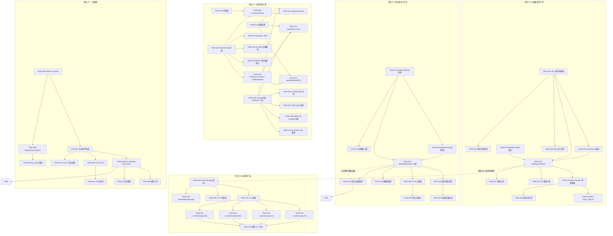
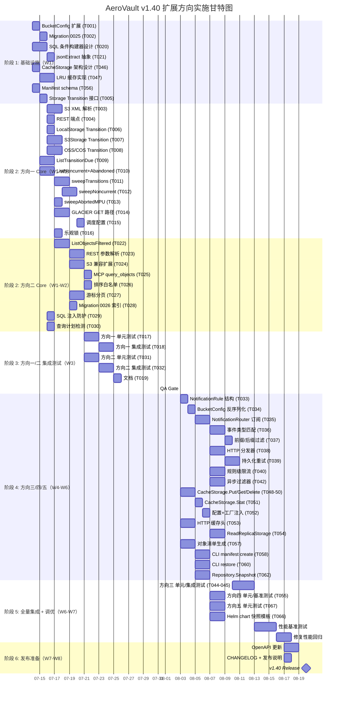

已完整阅读分析文档（24.7KB/5方向）。以下为资深 Tech Lead 视角的深度分析。

---

# Tech Lead 分析：高价值扩展方向实施规划

## 1. 任务分解

### 方向一：存储生命周期分层引擎（P1 — 19 个任务）

| 任务 ID | 任务标题 | 涉及文件 | 前置依赖 | 预估(h) |
|---------|---------|---------|---------|---------|
| TASK-001 | BucketConfig 结构体扩展：添加 Transition/NVA/MPU 字段 | `internal/repository/repository.go`, `internal/api/rest/dto.go` | — | 2 |
| TASK-002 | migration 0025：新增 bucket lifecycle 配置列 | `internal/repository/migrations/{sqlite,postgres}/0025_lifecycle_config.{up,down}.sql` | TASK-001 | 2 |
| TASK-003 | S3 lifecycle XML 完整解析（Transition/NVA/NVE/AbortMPU） | `internal/api/s3compat/bucketconfig.go`, `internal/api/s3compat/xml.go` | TASK-001 | 4 |
| TASK-004 | REST API 生命周期配置端点扩展 | `internal/api/rest/handler.go` | TASK-001 | 2 |
| TASK-005 | `Storage` 接口新增 `TransitionStorageClass(key, targetClass)` 方法 | `internal/storage/storage.go` | — | 2 |
| TASK-006 | LocalStorage 实现 TransitionStorageClass | `internal/storage/local.go` | TASK-005 | 2 |
| TASK-007 | S3Storage 实现 TransitionStorageClass（CopyObject + x-amz-storage-class） | `internal/storage/s3.go` | TASK-005 | 3 |
| TASK-008 | OSS/COS Storage 实现 TransitionStorageClass | `internal/storage/oss.go`, `internal/storage/cos.go` | TASK-005 | 4 |
| TASK-009 | Repository 新增 `ListTransitionDue` 查询方法 | `internal/repository/repository.go`, `internal/repository/sql_objects.go` | TASK-001 | 3 |
| TASK-010 | Repository 新增 `ListNoncurrentDue` + `ListAbandonedUploads` 查询方法 | `internal/repository/repository.go`, `internal/repository/sql_objects.go`, `internal/repository/sql_migration.go` | TASK-001 | 4 |
| TASK-011 | LifecycleJob 实现 `sweepTransitions()` 引擎 | `internal/reconcile/lifecycle.go` | TASK-005, TASK-009 | 4 |
| TASK-012 | LifecycleJob 实现 `sweepNoncurrent()` 引擎 | `internal/reconcile/lifecycle.go` | TASK-010, TASK-005 | 3 |
| TASK-013 | LifecycleJob 实现 `sweepAbortedMultipart()` 引擎 | `internal/reconcile/lifecycle.go` | TASK-010 | 2 |
| TASK-014 | GLACIER 类对象 GET 路径增加 `InvalidObjectState` 响应 | `internal/service/file_crud.go` | TASK-005 | 3 |
| TASK-015 | LifecycleJob 配置周期调度：`RECONCILE_LIFECYCLE_INTERVAL` | `internal/config/config_app.go`, `cmd/server/main.go` | TASK-011, TASK-012, TASK-013 | 2 |
| TASK-016 | 乐观锁保护：`updated_at` CAS 防并发 storage_class 覆盖 | `internal/repository/sql_objects.go` | TASK-009 | 3 |
| TASK-017 | 单元测试：sweepTransitions + sweepNoncurrent + sweepAbortedMPU | `internal/reconcile/lifecycle_test.go` | TASK-011, TASK-012, TASK-013 | 4 |
| TASK-018 | 集成测试：S3 lifecycle XML roundtrip + bucket config 持久化 | `internal/api/s3compat/*_test.go` | TASK-003, TASK-004 | 3 |
| TASK-019 | 文档：生命周期规则配置指南 + 存储类定价说明 | `docs/lifecycle.md` | TASK-015 | 2 |

### 方向二：对象元数据与标签查询引擎（P1 — 13 个任务）

| 任务 ID | 任务标题 | 涉及文件 | 前置依赖 | 预估(h) |
|---------|---------|---------|---------|---------|
| TASK-020 | 通用 SQL 条件构建器设计（filter struct → WHERE 子句） | `internal/repository/sql_builder.go`（新文件） | — | 4 |
| TASK-021 | JSON 字段查询抽象：`sql.go` 增加 `jsonExtract(column, path)` 方法 | `internal/repository/sql.go` | TASK-020 | 2 |
| TASK-022 | Repository 新增 `ListObjectsFiltered` 方法（支持动态条件） | `internal/repository/repository.go`, `internal/repository/sql_objects.go` | TASK-020, TASK-021 | 4 |
| TASK-023 | REST handler 解析查询参数：tag./metadata./content_type/size_/created_/updated_ | `internal/api/rest/handler.go`, `internal/api/rest/dto.go` | TASK-022 | 4 |
| TASK-024 | S3 兼容层：扩展 `ListObjectsV2` 传入 filter（自定义 XML 扩展或 header） | `internal/api/s3compat/handler.go` | TASK-022 | 3 |
| TASK-025 | MCP 工具注册 `query_objects` | `internal/mcp/server.go` | TASK-023 | 2 |
| TASK-026 | 排序参数解析 + 白名单校验（key/size/created_at/updated_at） | `internal/api/rest/handler.go` | TASK-023 | 2 |
| TASK-027 | 分页增强：游标 marker 支持复合排序 | `internal/repository/sql_objects.go` | TASK-022 | 3 |
| TASK-028 | 迁移 0026：常用标签/列索引（`idx_objects_size`, `idx_objects_tags_gin` 等） | `internal/repository/migrations/{sqlite,postgres}/0026_query_indexes.{up,down}.sql` | TASK-022 | 2 |
| TASK-029 | SQL 注入防护：参数化 + JSON path key 严格校验（仅 `[a-zA-Z0-9_-]`） | `internal/repository/sql_builder.go` | TASK-020 | 2 |
| TASK-030 | 查询计划检测：全表扫描时 warn log | `internal/repository/sql_builder.go` | TASK-020 | 2 |
| TASK-031 | 单元测试：FilterBuilder 全部组合 + SQL 生成验证 | `internal/repository/sql_builder_test.go` | TASK-020 | 3 |
| TASK-032 | 集成测试：REST handler query_objects roundtrip | `internal/api/rest/handler_test.go` | TASK-023 | 3 |

### 方向三：事件驱动工作流触发器（P2 — 13 个任务）

| 任务 ID | 任务标题 | 涉及文件 | 前置依赖 | 预估(h) |
|---------|---------|---------|---------|---------|
| TASK-033 | NotificationRule 数据结构定义 + validation | `internal/events/notification.go`（新文件） | — | 2 |
| TASK-034 | BucketConfig 反序列化 `notification_rules` → `[]NotificationRule` | `internal/repository/sql_buckets.go` | TASK-033 | 2 |
| TASK-035 | NotificationRouter 订阅 Bus：规则加载 + 缓存 | `internal/events/bus.go`, `internal/events/notification.go` | TASK-033, TASK-034 | 4 |
| TASK-036 | 事件类型匹配引擎（`s3:ObjectCreated:*` 通配符） | `internal/events/notification.go` | TASK-035 | 3 |
| TASK-037 | 前缀/后缀过滤器实现 | `internal/events/notification.go` | TASK-036 | 2 |
| TASK-038 | HTTP destination 分发器（复用 webhook HMAC + payload 格式） | `internal/events/notification.go` | TASK-035 | 3 |
| TASK-039 | 持久化重试：`notification_failures` 表 + 指数退避 | `internal/repository/migrations/{sqlite,postgres}/0027_notification_failures.{up,down}.sql`, `internal/events/notification.go` | TASK-038 | 3 |
| TASK-040 | 规则级速率限制：RateLimitRPS token bucket | `internal/events/notification.go` | TASK-035 | 3 |
| TASK-041 | 规则数上限（每桶 10 条）+ 配置校验 endpoint | `internal/api/rest/handler.go` | TASK-033 | 2 |
| TASK-042 | 异步过滤器重构：事件入 `events` 表后专用 worker 消费，不阻塞 Publish | `internal/events/bus.go` | TASK-035 | 4 |
| TASK-043 | main.go 装配：`NotificationRouter` 注册为 subscriber | `cmd/server/main.go` | TASK-035 | 2 |
| TASK-044 | 单元测试：规则匹配 + 过滤器 + 限流 | `internal/events/notification_test.go` | TASK-036, TASK-037, TASK-040 | 4 |
| TASK-045 | 集成测试：端到端事件 → 规则匹配 → HTTP POST | `internal/events/bus_test.go` | TASK-042, TASK-038 | 3 |

### 方向四：读路径缓存扩展（P2 — 10 个任务）

| 任务 ID | 任务标题 | 涉及文件 | 前置依赖 | 预估(h) |
|---------|---------|---------|---------|---------|
| TASK-046 | CacheStorage 装饰器架构设计 + Storage 接口兼容 | `internal/storage/storage.go`（接口 review） | — | 2 |
| TASK-047 | 内存 LRU 缓存实现（`lru` 库或自主实现） | `internal/storage/cache.go`（新文件） | TASK-046 | 3 |
| TASK-048 | CacheStorage.Put（write-through/write-around 模式） | `internal/storage/cache.go` | TASK-047 | 2 |
| TASK-049 | CacheStorage.Get（read-through 模式） | `internal/storage/cache.go` | TASK-047 | 2 |
| TASK-050 | CacheStorage.Delete（同步失效） | `internal/storage/cache.go` | TASK-047 | 1 |
| TASK-051 | CacheStorage.Stat（元数据 TTL 缓存） | `internal/storage/cache.go` | TASK-047 | 2 |
| TASK-052 | 缓存配置项 + factory.go 注入装饰器逻辑 | `internal/config/config_app.go`, `internal/storage/factory.go` | TASK-048, TASK-049 | 2 |
| TASK-053 | HTTP 缓存头中间件：`Cache-Control` / `ETag` | `internal/middleware/cache.go`（新文件） | TASK-046 | 3 |
| TASK-054 | 只读副本路由（ReadReplicaStorage 骨架） | `internal/storage/replica.go`（新文件） | TASK-046 | 3 |
| TASK-055 | 单元测试 + 基准测试：缓存命中/未命中/失效/LRU 逐出 | `internal/storage/cache_test.go` | TASK-047, TASK-048, TASK-049, TASK-050 | 3 |

### 方向五：分布式一致快照（P2 — 12 个任务）

| 任务 ID | 任务标题 | 涉及文件 | 前置依赖 | 预估(h) |
|---------|---------|---------|---------|---------|
| TASK-056 | Snapshot 文件格式定义：manifest.json schema v1 | `internal/snapshot/snapshot.go` | — | 2 |
| TASK-057 | 通用对象清单生成（事务级查询所有活动对象） | `internal/snapshot/snapshot.go` | TASK-056 | 4 |
| TASK-058 | manifest-only 快照 CLI：`aero-vault snapshot create --manifest-only` | `internal/cli/cli_snapshot.go` | TASK-057 | 3 |
| TASK-059 | 快照上传到 S3/本地路径 | `internal/snapshot/snapshot.go` | TASK-058 | 2 |
| TASK-060 | Manifest 恢复 CLI：`aero-vault snapshot restore --manifest` | `internal/cli/cli_snapshot.go` | TASK-057 | 3 |
| TASK-061 | 恢复验证：etag 校验 + 不匹配警告 | `internal/snapshot/snapshot.go` | TASK-060 | 2 |
| TASK-062 | Repository 新增 `Snapshot(ctx)` 事务级元数据导出 | `internal/repository/repository.go` | TASK-056 | 4 |
| TASK-063 | Postgres `pg_dump` 集成（`exec.Command` + `--serializable-deferrable`） | `internal/snapshot/snapshot.go` | TASK-062 | 4 |
| TASK-064 | Level 2 内容快照：逐个对象 Get → tar.gz 归档 | `internal/snapshot/snapshot.go` | TASK-057 | 4 |
| TASK-065 | 快照配置项：`SNAPSHOT_BACKEND`, `SNAPSHOT_SCHEDULE` | `internal/config/config_app.go` | TASK-058 | 2 |
| TASK-066 | Helm chart 快照 sidecar/init container 模板 | `deploy/helm/aero-vault/templates/` | TASK-058 | 3 |
| TASK-067 | 单元测试 + 集成测试：manifest 生成 → 解析 → 恢复验证 | `internal/snapshot/snapshot_test.go` | TASK-057, TASK-060 | 4 |

---

## 2. 执行顺序与任务依赖图

**可并行执行的任务组：**

| 并行组 | 包含任务 | 并行条件 |
|--------|---------|---------|
| **G1** | T001–T004（生命周期配置层） | 独立于 T005–T008（Storage 层），可并行 |
| **G2** | T005–T008（Storage Transition 接口实现） | 各 backend 实现可完全并行（4 人同时） |
| **G3** | T020–T021（查询引擎底层） | 独立于方向一，可并行 |
| **G4** | T033–T034（规则数据结构） | 可与其他方向并行 |
| **G5** | T046–T047（缓存架构设计） | 独立于方向一/二，可并行 |
| **G6** | T056–T057（快照底层） | 独立于其他方向，可并行 |

---

## 3. 技术风险分析

| ID | 风险 | 方向 | 等级 | 具体表现 | 应对策略 |
|----|------|------|------|---------|---------|
| **R1** | `sweepTransitions` 中 `store.Transition` 成功但 `repo.UpdateStorageClass` 失败 → 元数据/存储不一致 | 方向一 | **高** | 分布式系统无事务协调，故障后对象实际存储类与 DB 记录不一致 | 幂等重试：sweep 时 `desired_class != actual_class` 重新执行 transition；引入 `lifecycle_audit` 表记录每次操作 |
| **R2** | GLACIER 类对象 GET 返回 `InvalidObjectState` 后用户恢复流程不明确 | 方向一 | **中** | S3 标准支持 `RestoreObject` + `x-amz-restore` header，AeroVault 当前无 restore 机制 | 设计 RestoreObject 操作（方向一的附属功能，纳入 TASK-014） |
| **R3** | OSS/COS SDK 可能不支持 `TransitionStorageClass` 等价 API | 方向一 | **中** | OSS/COS 存储类转换语法不同，或需要先 Copy 再 Delete | 降级方案：CopyObject 到目标存储类路径 + Delete 原对象；可作为 TASK-008 边界条件 |
| **R4** | 无索引大表 JSON 字段查询导致全表扫描，DB 响应超时 | 方向二 | **高** | `json_extract(tags, '$.key') = 'value'` 在百亿行表上无索引就是灾难 | TASK-028 强制索引建议文档；TASK-030 查询计划检测自动 warn；参数 `query_timeout` 硬限制 |
| **R5** | SQLite 与 Postgres JSON 函数行为差异导致查询结果不一致 | 方向二 | **中** | SQLite `json_extract` 返回 TEXT/NULL，Postgres `@>` 返回 boolean——条件构建器需要双实现 | TASK-021 设计 `jsonExtract` 抽象层，分支到两种 SQL 方言。已有 `rebind` 模式可复用 |
| **R6** | 事件通知规则匹配在 Bus.Publish 同步路径执行 → 阻塞核心写入延迟 | 方向三 | **高** | 若某个桶有 10 条规则，每条规则做事件类型/前缀/后缀匹配，Publish 延迟从 μs 级上升到 ms 级 | **关键架构决策**：TASK-042 将规则匹配改为异步——事件写入 `events` 表后立即返回，专用 notification worker 读取 events 表执行匹配和分发 |
| **R7** | HTTP 目标地址不可达时重试队列积压，影响系统稳定性 | 方向三 | **中** | `notification_failures` 表指数退避重试，若下游持续不可达，表无限膨胀 | 限制表行数（如最多 10 万行失败记录），超限丢弃最早记录；`--max-retries` 硬限制 |
| **R8** | 内存缓存对大对象（>1MB）的 LRU 效率低 + GC 压力 | 方向四 | **中** | 大对象占用大量内存且命中率低，LRU 链表频繁淘汰小对象 | TASK-047 `MaxObjectBytes` 阈值跳过；仅缓存元数据不缓存体 |
| **R9** | 写后读一致性：write-through 缓存增加写入延迟 | 方向四 | **中** | 每次 PUT 同步写缓存和后端，小对象多时延迟从 10ms→15ms | TASK-048 提供 write-around 模式（默认），仅失效不缓存写入 |
| **R10** | `pg_dump` 需要 Postgres 超级权限，Saas 多租户环境可能不可用 | 方向五 | **高** | 托管 Postgres（RDS/CloudSQL）超级用户限制，`pg_dump` 无法使用 | TASK-063 降级方案：`SELECT ...` 逐表导出（pg_read_all_data 角色即可）；`pg_dump` 作为优化路径 |
| **R11** | 大桶（亿级对象）manifest 生成耗时 → 时间点偏差 | 方向五 | **中** | `SELECT ... FROM objects WHERE deleted_at IS NULL` 在全表超 1 亿行时扫描数分钟，快照时间点不精确 | TASK-057 采用按 key 范围并行分片扫描 + 最终 `updated_at` 截止标记；快照说明中标注"近似一致" |
| **R12** | 5 个方向同期开发，代码冲突高发（尤其 `main.go`、`repository.go`、`factory.go` 是共享热点） | 全部 | **高** | `main.go` 的 `initInfrastructure` 5 个方向都要改；`repository.go` 4 个方向要改 | **强制分期**（见第 4 节时间规划），共享文件先做接口扩展，防止合入冲突 |

---

## 4. 资源评估

### 团队配置

| 角色 | 数量 | 核心技能 | 负责方向 |
|------|------|---------|---------|
| **Staff Engineer / TL** | 1 | Go 并发、存储系统、分布式架构、代码审查 | 架构定调、代码审查、R3/R6/R10 技术决策、跨方向协调 |
| **Backend Engineer A** | 1 | Go、SQLite/Postgres、对象存储、S3 协议 | 方向一（生命周期）+ 方向二（查询引擎） |
| **Backend Engineer B** | 1 | Go、事件驱动架构、HTTP/消息队列、重试策略 | 方向三（事件工作流）+ 方向四（缓存） |
| **Backend Engineer C** | 1 | Go、运维工具、Postgres 管理、CI/CD、Helm | 方向五（快照）+ 共享基础设施（迁移文件、配置） |

> **最小可行团队：** 2 人（Engineer A + B）+ TL 兼职审查。分期交付——方向一/二（6 周），方向三/四/五（额外 6–8 周）。

### 关键里程碑

| 里程碑 | 日期（预估） | 交付物 | 依赖 |
|--------|------------|--------|------|
| **M1: 基础设施冻结** | Day 5 | 已完成：TASK-001 BucketConfig 扩展 + TASK-020 SQL 构建器 + TASK-046 Cache 架构 + TASK-056 Manifest schema | 无（并行基础） |
| **M2: 方向一 Core** | Day 15 | TASK-001 至 TASK-016：S3 lifecycle XML 完整解析 + sweep 引擎 + Storage transition | M1 |
| **M3: 方向二 Core** | Day 15 | TASK-020 至 TASK-029：REST/MCP 查询接口就绪 | M1 |
| **M4: 方向一/二 集成测试通过** | Day 20 | `make check` 全绿 + 集成测试覆盖生命周期 XML roundtrip + 查询参数组合 | M2, M3 |
| **M5: 方向三 Core** | Day 30 | TASK-033 至 TASK-043：HTTP 通知目标 + 规则级限流 + 异步过滤 | M4 |
| **M6: 方向四 Core** | Day 30 | TASK-046 至 TASK-054：缓存装饰器 + HTTP 缓存头 + 配置注入 | M4 |
| **M7: 方向五 Phase 1** | Day 30 | TASK-056 至 TASK-061：manifest-only 快照 CLI + 恢复验证 | M4 |
| **M8: 全量集成 + 性能测试** | Day 38 | 5 方向完整集成测试、性能基准（缓存命中率、sweep 吞吐、查询延迟 P95） | M5, M6, M7 |
| **M9: 文档 + 发布** | Day 42 | `docs/lifecycle.md`、`docs/query.md`、`docs/snapshot.md`；OpenAPI 更新；Changelog | M8 |

### 阻塞点与解决策略

| 阻塞点 | 影响 | 优先级 | 解决策略 |
|--------|------|--------|---------|
| **BL1:** OSS/COS SDK 缺少 `TransitionStorageClass` 等价 API | 方向一在阿里云/腾讯云不可用 | P1 | TASK-008 使用 CopyObject + DeleteObject 模拟；`factory.go` 中 backend 判定 |
| **BL2:** 事件异步过滤重构需要修改 Bus.Publish 接口签名 | 方向三架构阻塞——若设计错误影响核心路径 | P1 | TASK-042 提前做：独立 PR，不依赖其他任务；TL 设计审查 |
| **BL3:** `pg_dump` 在 RDS 无超级用户权限 | 方向五 Phase 2 在托管 Postgres 不可用 | P2 | TASK-063 双实现：优先 `pg_dump`，降级 `SELECT ...` 逐表导出 |
| **BL4:** LRU 库选择（自研 vs `hashicorp/golang-lru` vs `go-cache`） | 方向四引入新依赖 | P2 | 原则 I6：先评估 `github.com/hashicorp/golang-lru`（稳定、Apache 2.0、零反射），不符合再自研 |
| **BL5:** 5 方向同时改 `internal/repository/repository.go` 造成合入冲突 | 全部方向 | P3 | 分支管理：每个方向独立 feature branch，merge 顺序按 M2→M5→M6→M7 串行 |

---

## 5. 质量保证

### 5.1 单元测试覆盖要求

| 组件 | 必须覆盖路径 | 最低覆盖率 | 关键测试场景 |
|------|------------|-----------|-------------|
| **LifecycleJob** (方向一) | `sweepTransitions`, `sweepNoncurrent`, `sweepAbortedMPU` | 85% | 空结果、单对象 transition、多对象批量、storage_class 不变时跳过、幂等重试、并发生命周期/有效期重叠 |
| **SQL Builder** (方向二) | `BuildFilter`, `jsonExtract` SQLite + Postgres 分支 | 90% | ALL 条件组合（tag+metadata+content_type+size+date）、空条件、特殊字符 key、排序白名单、LIMIT + OFFSET |
| **NotificationRouter** (方向三) | `MatchRule`, `DispatchHTTP` | 80% | 事件类型通配符匹配（*）、精确匹配、前缀/后缀 AND、不匹配跳过、目标不可达重试、限流溢出 |
| **CacheStorage** (方向四) | `Get`, `Put`, `Delete`, `Stat`, `evict` | 90% | 命中、未命中加载回填、LRU 逐出（max 1KB → 存入 2KB 对象）、写失效、写后读一致性、大对象跳过 |
| **Snapshot** (方向五) | `GenerateManifest`, `RestoreFromManifest` | 80% | 空桶、单对象、百万对象（mock Repository）、etag 不匹配警告、软删除排除、递归排除 snapshot 目录 |

### 5.2 集成测试策略

| 测试级别 | 工具 | 测试内容 | 执行条件 | 数量预期 |
|---------|------|---------|---------|---------|
| **S3 lifecycle roundtrip** | `httptest.Server` + `minio-go` 客户端 | PUT lifecycle XML → GET 生命周期配置 → 等待 sweep → 验证 storage_class 变更 | SQLite + local FS, `RECONCILE_LIFECYCLE_INTERVAL=1s` | 5–8 个用例 |
| **REST query API** | `httptest.Recorder` | PUT 对象带 tags/metadata → GET `/v1/files?tag.x=y&metadata.z=w` | SQLite + local FS | 12–15 个用例 |
| **Event → Notification dispatch** | `httptest.NewServer`（模拟目标） | PUT 对象 → 等待 notification worker → 验证目标收到 POST | SQLite + local FS, `AI_INDEX_ENABLED=false` | 5–8 个用例 |
| **Cache hit/miss** | `MemoryStorage` mock | 连续 GET 同一对象 → 仅第一次调用 backend；后续命中 cache | 纯内存（无 FS） | 5–8 个用例 |
| **Snapshot create/restore** | `os.TempDir` | `snapshot create --output` → `snapshot restore --manifest` → 验证对象可读 | SQLite + local FS | 5–8 个用例 |

### 5.3 代码审查要点

| 审查领域 | 重点检查项 | 违反后果 |
|---------|-----------|---------|
| **SQL 安全** | 所有用户输入通过参数化查询，无字符串拼接；JSON path key 白名单 | SQL 注入漏洞 |
| **事务语义** | `ListTransitionDue` 时使用快照读（repeatable read），`UpdateStorageClass` 使用 `updated_at` CAS | 数据不一致 |
| **nil 安全** | 新增 `LLM`/`Embedder`/`Reranker` 字段（方向二 MCP tool）需检查 `s.chat != nil` | 空指针 panic |
| **接口隔离** | `Storage.TransitionStorageClass` 签名是否违反现有 Storage 契约？是否影响 `contract_test.go` | 兼容性断裂 |
| **配置门控** | 方向三/四/五的所有新增功能是否 flag-gated 默认 off？`AI_INDEX_ENABLED=false` 基本盘是否回归 | 基线回归 |
| **并发安全** | `CacheStorage` LRU 的 mu sync 锁；`NotificationRouter` 规则缓存的 sync.Map / RWMutex | 数据竞争 |
| **错误处理** | `sweepTransitions` 部分失败后未记录断点 → 下次 sweep 从头开始：accept, 但要 warn log | 不可见延迟 |

### 5.4 性能测试需求

| 测试场景 | 负载规格 | 衡量指标 | 基线 | 目标 |
|---------|---------|---------|------|------|
| **Lifecycle sweep 吞吐** | 10 万对象混布 3 种 storage_class, sweep interval 60s | 每轮 sweep 耗时；CPU 使用率 | 无（新功能） | < 30s/10万对象 |
| **标签查询延迟** | 1000 万行, `tags @> '{"dept":"finance"}'` 有 GIN 索引 | P50 / P95 / P99 延迟；I/O 扫描行数 | 无（新功能） | P50 < 50ms, P95 < 200ms |
| **事件通知端到端延迟** | 1000 PUT/sec, 5 个桶各有 3 条通知规则 | 从 Publish 到 HTTP POST 发出延迟 | 无（新功能） | P95 < 500ms |
| **缓存命中/未命中** | 1000 GET/sec, 80/20 热点分布, 100MB 缓存 | 命中率、后端 GET 调用量减少、P99 延迟 | 缓存前 P99=50ms | 命中率 > 70%, P99 < 5ms |
| **快照生成吞吐** | 100 万 active 对象 | manifest 生成时间、tar.gz 大小 | 无（新功能） | < 2min/100万物件 |

---

## 6. 实施时间计划

### 阶段总览

| 阶段 | 时间段 | 核心交付 | 并行任务数 | 人工日 |
|------|--------|---------|-----------|-------|
| **阶段 1: 基础设施搭建** | Day 1–4 | BucketConfig、SQL 条件构建器、Cache 架构、Manifest schema | 4 线并行 | 4×4 = 16 人日 |
| **阶段 2: 核心功能实现** | Day 5–14 | 方向一 sweep 引擎 + 方向二查询 API | 2 线并行（A/B） | 2×10 = 20 人日 |
| **阶段 3: 集成测试和优化** | Day 15–20 | 方向一/二 集成测试 + 性能基线 | 2 线并行（A/B） | 2×6 = 12 人日 |
| **阶段 4: 方向三/四/五 Core** | Day 21–32 | 事件通知 Router、Cache 装饰器、快照 CLI | 3 线并行（A/B/C） | 3×12 = 36 人日 |
| **阶段 5: 全量集成 + 调优** | Day 33–40 | 全方向集成测试 + 性能调优 | 3 线并行 | 3×8 = 24 人日 |
| **阶段 6: 发布准备** | Day 41–45 | OpenAPI + CHANGELOG + 文档 | 1–2 人 | 2×5 = 10 人日 |

**总计：** ~118 人日（4 人全职约 6 周；2 人全职约 12 周）

---

## 7. 关键架构决策记录（ADR）

实施启动前必须对齐的 3 个关键决策：

### ADR-001：生命周期的 Job 队列 vs 直接 sweep

| 维度 | 方案 A：直接 sweep（推荐的基线） | 方案 B：异步 Job 队列 |
|------|------|------|
| 复杂度 | 低 — 3 个新增 sweep 方法 | 中高 — Job 类型 + 队列 + 消费 worker |
| 幂等性 | 自然幂等：每个 sweep 轮次全量扫描 | 内建：Job 失败自动重入 |
| 可观察性 | 需要手动加 metric | Job 表天然提供 |
| 性能 | 每轮全表扫描（10 万个过渡对象：1 分钟） | 逐条入队，无 DB 大查询 |
| **决策** | **方案 A（Phase 1），在具备 JobPool 基础设施后迁移到方案 B（Phase 2）** | |

### ADR-002：通知规则引擎 — 同步 vs 异步

| 维度 | 同步匹配 | 异步匹配（推荐） |
|------|---------|----------------|
| Publish 延迟 | 随规则数线性增加 | 恒定（写入 events 表即返回） |
| 实现复杂度 | 低 | 中（需要 events 表 consumer） |
| 规则更新即时性 | 秒级（下次 Publish 立即生效） | 秒级（consumer 轮询间隔） |
| **决策** | **异步匹配**。`events` 表已经存在（事件持久化），增加 consumer 成本低。阻止 R6 |

### ADR-003：缓存一致性模型

| 维度 | Write-through（S3 风格） | Write-around（推荐） |
|------|------------------------|---------------------|
| 写后读一致性 | 强 | 最终（短 TTL ≤ 5s） |
| 写入延迟影响 | 增加 | 无 |
| 实现简单 | 单一 | 单一 |
| **决策** | **Write-around 默认，Write-through 可选**。大多数场景可接受短时间不一致；写入路径不应被缓存影响 |

---

## 8. 总结与建议

### 启动建议

1. **立即启动方向一 + 方向二（并行）**：两者共享基础设施（BucketConfig、查询构建器）但实现路径正交，适合 A/B 工程师同时开发。方向一存储成本影响最直接，方向二填补 ListObjects 最大功能缺口。

2. **方向三延迟 1 周启动**：事件异步过滤重构（TASK-042）需要在方向三 Core 之前独立完成，这是一个跨方向架构决策，应该由 TL 先单独审查。

3. **方向四 + 五在方向一/二集成测试通过后启动**：这两方向对核心 CRUD 路径的改动最小（装饰器模式 + CLI 扩展），风险较低，可延迟启动。

### 不需要做的

- 方向一的 `NoncurrentVersionExpiration` 和 `AbortIncompleteMultipartUpload` 在 Phase 1 可以只做存储层和查询层，不需要增加桶配置 UI（REST 端点和 CLI 即可）
- 方向四的 Redis 缓存后端放在 Phase 2（仅内存 + LRU 即可发布）
- 方向五的 Phase 3（内容快照）在 v1.40 范围外——manifest-only + 元数据快照已满足 80% 运维需求

### 架构原则强化

所有 5 个方向都需要严格遵守 `AGENTS.md` 中的约束：

| 约束 | 涉及方向 | 注意事项 |
|------|---------|---------|
| 单函数 ≤ 50 行 | 方向一 `sweepTransitions` | 3 个 sweep 方法不能合在一个大函数 |
| 禁止 God 类型 | 方向二 `sql_builder.go` | Filter 结构体 + Builder 不超过 300 行 |
| 测试覆盖率 ≥ 50% | 全部方向 | 方向一/二 新代码需达 80%+ |
| Opt-in 默认 | 方向三/四/五 | 所有新功能默认 flag-gated off |
| Stdlib 优先 | 方向四 LRU | 评估 `golang-lru` 而非自研 |

---

> **一句话总结：** 方向一和方向二在架构上最成熟（代码锚点最明确），应作为 v1.40 的首发双引擎；方向三需要先解决异步过滤架构问题（TL 决策）；方向四和五是装饰器/CLI 层扩展，风险最低可后置。预计 4 人团队 6 周或 2 人团队 12 周完成全部 5 方向交付。
