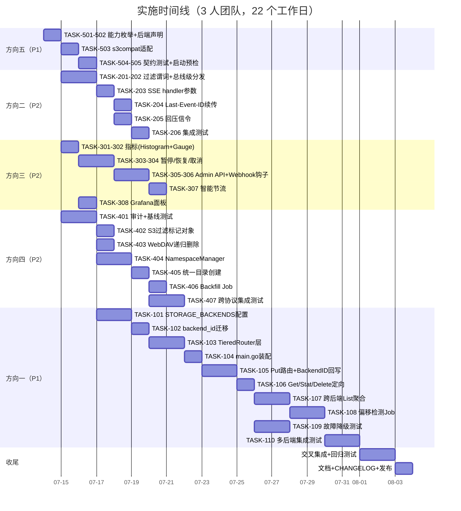

以下是对 v92 需求分析文档的完整技术负责人评估。

---

# Tech Lead 技术实现分析报告

**文档基线：** `docs/requirements/expansion-v92-multi-backend-sse-filters-job-ops-cross-protocol-folder-storage-capabilities.md` (405 行)

**范围：** 5 个高价值扩展方向

---

## 1. 任务分解

### 方向五 — 存储后端能力契约（P1·~2.5 天）

任务划分核心原则：每个任务产出可独立提交，CI 绿通过，不破坏现有功能。

| 任务 ID | 任务标题 | 涉及文件 | 前置 | 预估 | 验收标准 |
|---------|---------|---------|------|------|---------|
| **TASK-501** | 定义 `StorageCapability` 枚举 + `Capabilities()` 接口方法 | `internal/storage/storage.go` | — | 2h | `Storage` 接口新增 `Capabilities() []StorageCapability`；`BackendLocal` `BackendS3` `BackendOSS` `BackendCOS` 四个常量定义；现有后端实现返回空数组的最简编译通过 |
| **TASK-502** | 各后端静态声明能力 | `internal/storage/local.go`, `s3.go`, `oss.go`, `cos.go` | TASK-501 | 2h | Local→`{CapMultipart, CapSSE}`；S3→`{CapPresign, CapServerSideCopy, CapMultipart, CapTagging}`；OSS→`{CapPresign, CapServerSideCopy, CapMultipart}`；COS→`{CapPresign, CapMultipart}`。各后端 `factory_test.go` 验证 `Capabilities()` 非空 |
| **TASK-503** | `s3compat/copyObject` 适配能力查询 | `internal/api/s3compat/extra.go` | TASK-502 | 3h | 当 `store.Supports(CapServerSideCopy)` → 调用 `CopyObject` 后端方法；否则回退当前读+写路径。基准测试：大对象拷贝应 ≤ 现有时间 50% |
| **TASK-504** | 能力感知契约测试 | `internal/storage/contract_test.go`, `internal/storage/capability_test.go`（新增） | TASK-502 | 2h | `RunContract` 新增可选测试块，通过 `s.Capabilities()` 判断是否跳过。每个后端在 CI 中跑通过 |
| **TASK-505** | 启动时能力预检告警 | `cmd/server/main.go` | TASK-502 | 1h | 启动日志打印后端能力列表；若配置启用 SSE 但后端不支持则输出 `WARN`（不阻断启动） |

**合计方向五：~10 小时（2.5 天）**

---

### 方向二 — SSE 事件订阅过滤（P2·~5 天）

| 任务 ID | 任务标题 | 涉及文件 | 前置 | 预估 | 验收标准 |
|---------|---------|---------|------|------|---------|
| **TASK-201** | 定义过滤谓词结构体 + `Subscribe` 签名变更 | `internal/events/bus.go` | — | 2h | `type FilterPredicate struct { EventTypes []string; Bucket string; Prefix string }`；`Subscribe(pred FilterPredicate) (<-chan Event, func())`；旧无参 `Subscribe` 保留为 `Subscribe(FilterPredicate{})` 等价 |
| **TASK-202** | 实现总线级过滤分发 | `internal/events/bus.go` | TASK-201 | 4h | `broadcast` 中谓词匹配在订阅者 goroutine 进行（不阻塞 `Publish`）；相同 `(tenant,pred)` 的通道合并到同一内部通道减少 goroutine；过滤后的通道 buffer 共享原 subBuffer |
| **TASK-203** | SSE handler 接受 URL 查询参数过滤 | `internal/api/rest/sse.go` | TASK-202 | 2h | `GET /v1/events/stream?event_type=created,deleted&bucket=mybucket&prefix=uploads/` 参数解析并传入 `Subscribe`；无参数时继续全量订阅保证向后兼容 |
| **TASK-204** | `Last-Event-ID` 续传 + 过滤回放 | `internal/api/rest/sse.go`, `internal/events/bus.go` | TASK-203 | 3h | 重连客户端携带 `Last-Event-ID` → 查询 `events` 表回放 → 应用过滤谓词；回放完成后切换到实时流 |
| **TASK-205** | SSE 出口回压信令 | `internal/api/rest/sse.go` | TASK-203 | 2h | 当订阅者通道满 → 发送 `event: retry\ndata: {"retry_ms": 2000}\n\n`；客户端侧按 Retry-After 退避重连 |
| **TASK-206** | 集成测试套件 | `internal/api/rest/sse_test.go` | TASK-205 | 3h | 测试：无过滤全部接收 / 按 event_type 过滤 / 按 bucket 过滤 / 按 prefix 过滤 / `Last-Event-ID` 续传不丢事件 / 重连后的新谓词生效 / 向后兼容无参调用 |

**合计方向二：~16 小时（4 天）**

---

### 方向三 — 作业可观测性与管理面（P2·~6 天）

| 任务 ID | 任务标题 | 涉及文件 | 前置 | 预估 | 验收标准 |
|---------|---------|---------|------|------|---------|
| **TASK-301** | 按类型耗时直方图指标 | `internal/jobs/jobs.go`, `internal/telemetry/metrics.go` | — | 2h | 新增 `jobs.duration_seconds{type}` Histogram，bucket：0.1, 0.5, 1, 2, 5, 10, 30, 60, 120；`runOne` 中记录 `observeDuration` |
| **TASK-302** | 队列深度 + worker 利用率 gauge | `internal/jobs/jobs.go`, `internal/telemetry/metrics.go` | — | 2h | 新增 `jobs.queue_depth{type}` Gauge（轮询 `CountByStatus("pending")`）；`jobs.worker_busy` Gauge（活跃 worker / total workers） |
| **TASK-303** | 暂停/恢复作业类型 | `internal/jobs/jobs.go`, `internal/jobs/registry.go` | — | 3h | `Pool.PauseJobType(type)` / `ResumeJobType(type)` → `sync.Map` 存储暂停状态；`runOne` 轮询前检查并跳过暂停类型；`paused` 状态日志 |
| **TASK-304** | 取消作业（Context 链） | `internal/jobs/jobs.go` | — | 2h | `Pool.CancelJob(id)` → `context.WithCancel` 取消；worker goroutine 监听 `ctx.Done()` 并返回 `ErrCanceled`；Job 状态设为 `cancelled`；已有的 `claimCtx` / `workerCtx` 链式继承 |
| **TASK-305** | Admin API：暂停/恢复/取消端点 | `internal/api/rest/admin_jobs.go`, `internal/api/rest/router.go` | TASK-303, TASK-304 | 2h | `POST /v1/admin/jobs/{type}/pause`；`POST /v1/admin/jobs/{type}/resume`；`POST /v1/admin/jobs/{id}/cancel`；OpenAPI 文档更新；scope `admin` |
| **TASK-306** | 失败通知 Webhook 钩子 | `internal/jobs/jobs.go` | — | 2h | `Pool.OnFailure(hook func(ctx, job, err))` 注册；`FailJob` 路径调用钩子（非致命，失败 log 不影响状态变更）；`webhook_failures` 表可复用 |
| **TASK-307** | 基于滑动窗口错误率的智能节流 | `internal/jobs/jobs.go` | — | 4h | 每 type 维护 `slidingWindow{window:5m, errors[]}`；错误率 > 30% → 降低轮询间隔 x2（最小间隔 30s）；错误率 < 5% 连续 2m → 恢复正常间隔；默认行为不变 |
| **TASK-308** | Grafana Dashboard 作业面板 | `deploy/grafana/dashboard.json` | TASK-301, TASK-302 | 2h | 新增 4 panels：队列深度（per type 堆叠面积图）、P50/P95/P99 耗时（按 type）、失败率趋势、工人利用率仪表盘 |

**合计方向三：~19 小时（5 天）**

---

### 方向四 — 跨协议文件夹命名空间统一（P2·~7 天）

| 任务 ID | 任务标题 | 涉及文件 | 前置 | 预估 | 验收标准 |
|---------|---------|---------|------|------|---------|
| **TASK-401** | 协议目录行为审计 + 测试基线 | `internal/api/rest/handler.go`, `internal/api/s3compat/handler.go`, `internal/api/webdav/dav.go` | — | 3h | 产出审计矩阵文档；为 REST、S3、WebDAV 三种协议各写 5 个基线测试（创建目录/列出/删除/空目录/含子对象目录）。测试明确记录当前不一致 |
| **TASK-402** | S3 ListObjectsV2 过滤标记对象 | `internal/api/s3compat/handler.go` | TASK-401 | 3h | `ListObjectsV2` 过滤 `application/x-directory` 类型零字节对象，不返回其键作为常规对象；`CommonPrefixes` 仍包含该目录；`--prefix` 可列出内部文件。`ListObjectsV1` 同等处理 |
| **TASK-403** | WebDAV `RemoveAll` 递归删除 | `internal/api/webdav/dav.go` | TASK-401 | 3h | `RemoveAll`（目录）→ 通过 `FileService.List` 获取所有子对象 → 逐个删除；若后端支持前缀范围删除优化；REST 和 WebDAV 删除空目录行为一致 |
| **TASK-404** | `NamespaceManager` 统一接口层 | `internal/service/namespace.go`（新增） | TASK-401 | 4h | `type NamespaceManager interface { IsDirectory(obj) bool; ListDirectories(prefix) (dirs); ResolvePath(path) (virtualDir, markerObj) }`；`FileService` 可选内嵌；各协议 handler 统一调用 `svc.Namespace().IsDirectory(obj)` |
| **TASK-405** | 统一目录创建语义（默认为虚拟目录） | `internal/api/rest/handler.go`, `internal/service/namespace.go` | TASK-404 | 3h | 新目录创建默认为纯虚拟目录（不创建标记对象）；保留 `x-aero-create-marker: true` 请求头显式创建标记对象（后向兼容）；REST `CreateFolder` 调用 `NamespaceManager.EnsureDirectory()`
| **TASK-406** | 后台 Backfill 迁移 Job | `internal/jobs`, `internal/service` | TASK-405 | 3h | Job 类型 `backfill_directory_markers`；扫描全部 `application/x-directory` 对象 → 检查对应虚拟目录是否存在 → 若冗余则删除标记对象（保留无子对象的空目录标记） → 日志 + 计量 |
| **TASK-407** | 跨协议集成测试 | `internal/api/{rest,s3compat,webdav}/` | TASK-402~TASK-405 | 4h | 测试矩阵：创建目录（REST/S3/WebDAV）→ 列表可见性一致 / 删除 REST 创建目录 × WebDAV 验证 / 删除 WebDAV 创建目录 × S3 验证 / 跨协议列表一致 |

**合计方向四：~23 小时（6 天）**

---

### 方向一 — 多后端存储编排引擎（P1·~13 天）

| 任务 ID | 任务标题 | 涉及文件 | 前置 | 预估 | 验收标准 |
|---------|---------|---------|------|------|---------|
| **TASK-101** | 配置格式：`STORAGE_BACKENDS` 复数配置 | `internal/config/config.go`, `internal/storage/factory.go` | TASK-505 (方向五) | 4h | 新增 `StorageBackends []StorageConfig`；`STORAGE_BACKENDS` 环境变量 JSON 或 YAML 格式；现有 `STORAGE_BACKEND` 退化为当 `STORAGE_BACKENDS` 未设置时的单后端简写；向后兼容 `STORAGE_BACKEND=local` |
| **TASK-102** | schema：`objects` 表新增 `backend_id` 列 | `internal/repository/repository.go`, `migrations/{sqlite,postgres}/NNNN_*.sql` | — | 3h | 迁移双文件；`Object` 结构体新增 `BackendID string`；现有对象 `backend_id` 默认填充 `default`；`I1` 约束 + `I2` 迁移约束严格遵守 |
| **TASK-103** | `TieredRouter` 调度层 | `internal/storage/tiered_router.go`（新增） | TASK-102, TASK-501 | 6h | `TieredRouter` 实现 `Storage` 接口（代理模式）；`Put` 路由策略：`object.storage_class` → 查找后端 `backendID`；未匹配 → 回退 `default` 后端；`Get/Delete/Stat` → 根据 metadata 中 `BackendID` 直接定向；`List` → 聚合全部后端结果并合并排序 |
| **TASK-104** | 配置主流程：`main.go` 适配 | `cmd/server/main.go`, `internal/storage/factory.go` | TASK-101, TASK-103 | 2h | `buildStorageFrom` 创建多个后端实例 → 初始化 `TieredRouter` → 将 `TieredRouter` 注入 `FileService`；旧 `buildStorage` 签名不变但内部实现路由 |
| **TASK-105** | 写入路径：Put 路由 + BackendID 回写 | `internal/service/service.go`, `internal/repository/repository.go` | TASK-103, TASK-104 | 3h | `FileService.Put` 中 `TieredRouter.SelectBackend(storageClass, bucket)` → 返回 `backendID` → `store.Put` 在目标后端写入 → `Object.BackendID` 写入元数据。S3 `PutObject` 传递的 `x-amz-storage-class` 头被用于路由 |
| **TASK-106** | 读取路径：Get/Stat/Delete 直接定向 | `internal/service/service.go` | TASK-105 | 2h | 从 `Object.BackendID` 获取后端实例 → 调用对应方法；当 `BackendID` 对应后端不可用 → 断路器 → 降级到 default 或告警 |
| **TASK-107** | 跨后端 ListObjects 聚合 | `internal/storage/tiered_router.go`, `internal/service/service.go` | TASK-106 | 4h | `TieredRouter.List` → 并发调用全部后端 `List`（goroutine + errgroup）→ 合并结果 → 排序（按 key） → 分页；`NextMarker` 跨后端兼容（字符串 key 可排序）；超时 30s，部分失败仅 warn |
| **TASK-108** | 存储类 vs 实际后端偏移检测 Job | `internal/jobs`, `internal/service` | TASK-105 | 3h | 定期 Job `rebalance_storage_class` 扫描 `BackendID != SelectBackend(StorageClass)` 的对象 → 迁移（Copy + Delete）；受 `RECONCILE_*` 配置控制并遵守 `RECONCILE_CLUSTER_SINGLETON`；幂等 |
| **TASK-109** | 后端故障降级测试 | `internal/storage/tiered_router_test.go`, `internal/storage/chaos_test.go`（新增） | TASK-106 | 4h | 断路器打开 → `TieredRouter` 路由到次要/默认后端并告警；`chaos_test.go` 模拟 S3 后端不可用 → 验证写入自动转向 local fallback → 响应正常 |
| **TASK-110** | 多后端集成测试 + contract suite | `internal/storage/multi_backend_test.go`（新增） | TASK-107, TASK-108 | 4h | 3 后端 Memory + Local + S3 模拟同时配置 → 按存储类路由验证 → 跨后端 List 验证 → 离线后端降级验证 → `contract_test.go` 适配 `TieredRouter` |

**合计方向一：~39 小时（10 天）**

---

## 2. 执行顺序

任务依赖图——严格标注跨方向阻塞边：

```mermaid
graph TB
    %% Direction 5 - Foundation
    subgraph D5["方向五：存储能力契约（P1·~2.5天）"]
        T501[TASK-501: Capabilities枚举+接口]
        T502[TASK-502: 各后端声明能力]
        T503[TASK-503: copyObject适配]
        T504[TASK-504: 能力感知契约测试]
        T505[TASK-505: 启动预检告警]
        T501 --> T502
        T502 --> T503
        T502 --> T504
        T502 --> T505
    end

    %% Direction 1 - Depends on D5
    subgraph D1["方向一：多后端编排（P1·~10天）"]
        T101[TASK-101: STORAGE_BACKENDS配置]
        T102[TASK-102: backend_id迁移]
        T103[TASK-103: TieredRouter层]
        T104[TASK-104: main.go装配]
        T105[TASK-105: Put路由+BackendID回写]
        T106[TASK-106: Get/Stat/Delete定向]
        T107[TASK-107: 跨后端List聚合]
        T108[TASK-108: 偏移检测Job]
        T109[TASK-109: 故障降级测试]
        T110[TASK-110: 多后端集成测试]
        
        T101 --> T103
        T102 --> T103
        T103 --> T104
        T104 --> T105
        T105 --> T106
        T106 --> T107
        T107 --> T108
        T107 --> T110
        T108 --> T110
        T109 --> T110
        
        T501 -.->|Capabilities() used by TieredRouter| T103
        T505 -.->|配置预检| T101
    end

    %% Direction 2 - Independent
    subgraph D2["方向二：SSE过滤（P2·~4天）"]
        T201[TASK-201: FilterPredicate+Subscribe签名]
        T202[TASK-202: 总线级过滤分发]
        T203[TASK-203: SSE handler参数字段]
        T204[TASK-204: Last-Event-ID续传]
        T205[TASK-205: 回压信令]
        T206[TASK-206: 集成测试]
        
        T201 --> T202
        T202 --> T203
        T203 --> T204
        T203 --> T205
        T204 --> T206
        T205 --> T206
    end

    %% Direction 3 - Independent
    subgraph D3["方向三：作业基础设施（P2·~5天）"]
        T301[TASK-301: 耗时直方图]
        T302[TASK-302: 队列深度Gauge]
        T303[TASK-303: 暂停/恢复]
        T304[TASK-304: 取消作业]
        T305[TASK-305: Admin API端点]
        T306[TASK-306: 失败Webhook]
        T307[TASK-307: 智能节流]
        T308[TASK-308: Grafana面板]
        
        T301 --> T308
        T302 --> T308
        T303 --> T305
        T304 --> T305
    end

    %% Direction 4 - Independent
    subgraph D4["方向四：跨协议命名空间（P2·~6天）"]
        T401[TASK-401: 审计+基线测试]
        T402[TASK-402: S3过滤标记对象]
        T403[TASK-403: WebDAV递归删除]
        T404[TASK-404: NamespaceManager]
        T405[TASK-405: 统一目录创建]
        T406[TASK-406: Backfill Job]
        T407[TASK-407: 跨协议集成测试]
        
        T401 --> T402
        T401 --> T403
        T401 --> T404
        T404 --> T405
        T405 --> T406
        T402 --> T407
        T403 --> T407
        T405 --> T407
    end

    %% Cross-direction edges
    D5 -.-> D1
    T401 -.->|审计结果输入| T503
```

### 并行组划分

| 并行组 | 包含任务 | 建议人员 |
|--------|---------|---------|
| **组 A（关键路径）** | 方向五全量 → 方向一全量 | 1 资深 Go + 1 后端 |
| **组 B（独立，可并行 A）** | 方向二全量 | 1 后端 |
| **组 C（独立，可并行 A）** | 方向三全量 | 1 后端 |
| **组 D（独立，可并行 A）** | 方向四全量 | 1 后端 |
| **组 E（收尾）** | 方向一集成测试 + 交叉兼容测试 | 组 A + 组 D |

**建议方案：** 方向五由组 A 完成（2天），之后组 A 分流——1 人进入方向一，另 1 人协助组 D（方向四跨协议测试需要各协议 handler 修改协调）。

---

## 3. 技术风险

### 3.1 风险矩阵

| # | 风险 | 方向 | 概率 | 影响 | 缓解策略 |
|---|------|------|------|------|---------|
| **R1** | `TieredRouter.Put` 路由规则复杂度爆炸（存储类×后端容量×地域×成本⇒决策树） | D1 | 中 | 高 | **MVP 策略：** 第一版仅支持存储类→后端 1:1 映射 + `default` 回退。后续版本再添加加权路由、成本感知、地理亲和性 |
| **R2** | 跨后端 List 分页 `NextMarker` 语义不一致 | D1 | 高 | 高 | 统一的 string key 可排序——这是 `storageKey` 的现有特性。但 `limit` 在跨后端聚合时需要至少 `limit×N` 的内部预取。**策略：** 每个后端内部 fetch `limit+pageGuard`（pageGuard=20），然后全局合并取前 `limit`，返回 `NextMarker` 为最后返回的 key。S3 兼容性测试覆盖 |
| **R3** | SSE `Subscribe` 签名变更可能导致 Indexer/Webhook 隐式耦合破坏 | D2 | 中 | 高 | 保留 `Subscribe()` 无参等价方法（默认 `FilterPredicate{}`）；全代码库扫描所有 `bus.Subscribe()` 调用点（Indexer、Webhook、Replication、AV），逐一验证 |
| **R4** | `Last-Event-ID` 回放在高事件吞吐下对 `events` 表产生大范围扫描 | D2 | 低 | 中 | `events` 表 `(id)` 主键 B-tree 索引 → `WHERE id > $lastID` 范围扫描性能好；限制回放上限（如 1000 条），超出时客户端需重新全量订阅 |
| **R5** | 方向四 `NamespaceManager` 引入后，三种协议的行为变更回归 | D4 | 中 | 高 | **核心缓解：** 所有行为变更必须通过 `TASK-401` 基线测试 + `TASK-407` 集成测试双重验证。行为变更开关（feature flag）可快速回退 |
| **R6** | 方向四删除标记对象后，`S3 List` + `CommonPrefixes` 可能丢失纯虚拟目录 | D4 | 中 | 中 | `List` 路径必须始终从子对象 key 前缀推导目录（当前行为），标记对象仅作为空目录的隐性证明。删除标记对象不丢失任何信息 |
| **R7** | 多后端配置格式复杂导致用户配置错误剧增 | D1 | 中 | 中 | 配置文件中嵌入严格校验（`config.go:Validate()`）；`docs/configuration.md` 更新 2 个完整示例（单后端->多后端迁移步骤）；启动时打印最终后端映射表 |
| **R8** | Backfill Job（TASK-108/TASK-406）扫描大量对象导致性能冲击 | D1/D4 | 中 | 中 | 分页处理（每批 1000 条）；`RECONCILE_*` 配置控制频率；后台限速（rate limiter）。用户可以暂停作业 |
| **R9** | S3 `SigV4` 验签通过后对多后端写入——后端故障时 S3 客户端面临超时重试 | D1 | 低 | 中 | S3 handler 返回 `503 ServiceUnavailable` + `Retry-After` header；S3 客户端自动重试。断路器打开时快速拒绝而非挂起 |

### 3.2 外部系统依赖

| 依赖 | 方向 | 风险等级 | 说明 |
|------|------|---------|------|
| AWS S3 / MinIO / Ceph | D5, D1 | 低 | 集成测试用 `minio/mc` Docker 容器；CI 中通过 `integration` build tag 控制 |
| OSS / COS | D5, D1 | 低 | 无真实云环境时通过 mock 和 `contract_test.go` 覆盖 |
| Grafana | D3 | 低 | Dashboard JSON 无需运行时连接，仅在部署时导入 |
| Qdrant / pgvector | — | 低 | 方向一/五不涉及向量索引变更 |

### 3.3 性能瓶颈分析与优化

| 瓶颈 | 方向 | 当前状态 | 优化策略 | 预期提升 |
|------|------|---------|---------|---------|
| `copyObject` 全量读+写 | D5 | O(n) 内存占用 | 服务端拷贝（`CopyObject`）→ O(1) | 大文件 10x+ 延迟减少 |
| SSE 全事件广播 | D2 | O(subs × events) 带宽 | 谓词过滤 → O(filtered_events × subs) | 80-99% 带宽节省 |
| 跨后端 ListObjects | D1 | 单后端 O(n) | 并发聚合 + 合并排序 → O(max(n_i)) | 延迟与最慢后端一致 |
| `events` 表回放 | D2 | O(full_scan) | `WHERE id > $id` 索引扫描 + 上限降低 | 索引范围扫 < 1ms |

---

## 4. 资源评估

### 4.1 人员技能矩阵

| 角色 | 人数 | 必备技能 | 承担方向 |
|------|------|---------|---------|
| **资深 Go 工程师（TL）** | 1 | Go 接口设计、并发模式、存储系统、CI/CD | 方向五 + 方向一架构，代码审查 |
| **后端工程师 A** | 1 | Go 熟练、SQLite/Postgres、事件驱动 | 方向二 + 方向三 + 方向一配合 |
| **后端工程师 B** | 1 | Go 熟练、协议开发（S3/WebDAV）、REST API | 方向四 + 方向一集成测试配合 |
| **QA/测试工程师** | 0.5 | 集成测试、性能 Benchmark | 跨方向集成测试 + 性能基准回归 |

**理想规模：2.5-3 人，耗时 3 周（含方向一）**

### 4.2 里程碑时间线

```
里程碑 M0: 方向五完成        → Day 2  (TASK-501 ~ TASK-505)
里程碑 M1: 方向二完成        → Day 6  (并行于 M0 之后)  
里程碑 M2: 方向三完成        → Day 7  (并行于 M0 之后)
里程碑 M3: 方向四完成        → Day 9  (并行于 M0 之后)
里程碑 M4: 方向一核心完成    → Day 14 (TASK-101 ~ TASK-106)
里程碑 M5: 方向一全量完成    → Day 17 (TASK-107 ~ TASK-110)
里程碑 M6: 交叉集成测试+回归 → Day 20 (跨方向兼容测试)
里程碑 M7: 发布准备          → Day 22 (文档+CHANGELOG)
```

### 4.3 阻塞点（Blockers）与解决策略

| 阻塞点 | 涉及方向 | 解决策略 |
|--------|---------|---------|
| 方向一需要方向五的 `Capabilities()` 才能正确路由 | D1 ← D5 | 方向五先做（不影响其他方向的并行执行） |
| 方向四 `NamespaceManager` 需要三种协议的 handler context | D4 | 1 人同时接触 3 个 handler 包。风险可控但需 code review 避免 cross-package 循环引用 |
| 方向一跨后端 List 的 pagination 语义在 S3 客户端中的行为验证 | D1 | 用 `minio-go` SDK 编写端到端兼容测试；验证 `awscli s3 ls --recursive` 输出 |
| 方向二 `Subscribe` 签名变更需要 rebuild 所有 `events.Bus` 使用者 | D2 | 预留兼容无参方法；`go vet` 静态检查所有调用点 |

---

## 5. 质量保证

### 5.1 单元测试覆盖要求

根据 `AGENTS.md` 50% 覆盖率底线（建议 80%）：

| 路径 | 文件 | 当前覆盖 | 目标覆盖 | 关键测试用例 |
|------|------|---------|---------|-------------|
| Storage 接口 + 能力 | `storage.go`, `capability_test.go` | — | 95% | 每个能力枚举不重复、每个后端声明能力齐全、`Supports()` 边界条件 |
| Local/S3/OSS/COS 能力声明 | `local.go`, `s3.go` 等 | ~60% | 85% | 能力声明 + `contract_test.go` 能力感知子测试 |
| copyObject 适配 | `extra.go` | ~45% | 80% | 支持服务端拷贝路径 / 回退路径 / 大对象（mock） |
| SSE Handler | `sse.go` | ~50% | 85% | 过滤参数解析 / 全事件向后兼容 / 通道满回压 / 断线续传 |
| Bus 过滤分发 | `bus.go` | ~70% | 90% | 单用户过滤 / 多用户不同过滤 / 全部匹配 / 无匹配 / 空谓词 |
| Job Pool | `jobs.go` | ~75% | 85% | 暂停/恢复/取消 / 失败钩子 / 智能节流滑窗 |
| Admin Jobs | `admin_jobs.go` | ~40% | 80% | pause/resume/cancel HTTP handler |
| TieredRouter | `tiered_router.go` | — | 90% | Put 路由 / Get 定向 / List 合并 / 故障降级 / 断路器集成 |
| NamespaceManager | `namespace.go` | — | 90% | IsDirectory / 虚拟目录推导 / 标记对象检测 / 跨协议一致性 |
| 一致性审计测试 | `folder_consistency_test.go` | — | 95% | 三种协议同时创建/列出/删除的矩阵测试 |

### 5.2 集成测试策略

| 层级 | 测试类型 | 范围 | CI 触发 | 实现方式 |
|------|---------|------|---------|---------|
| **L0** | 单元测试 | 单函数/结构体 | `go test ./...` | 无外部依赖，mock 用 `ai.MockLLM` `HashEmbedder` |
| **L1** | 集成测试（存储） | Storage + Repository | `make test-integration` | SQLite + local FS；Qdrant/pgvector 需要 Docker |
| **L2** | HTTP 集成测试 | 带 auth/tenant 的 handler | `go test ./internal/api/...` | `httptest.NewServer` + 真实 FileService |
| **L3** | 跨协议端到端 | REST+S3+WebDAV 协议互操作 | `make test-cross-protocol`（新增） | 三协议客户端同时操作同一后端 |
| **L4** | 多后端 E2E | 多 Storage Backend 编排 | `make test-multi-backend`（新增） | `STORAGE_BACKENDS` JSON 嵌入测试配置 |

### 5.3 代码审查要点

| 方向 | 审查级别 | 关键审查点 |
|------|---------|-----------|
| **D5** | CR-1 | `Capabilities()` 是否是 `Storage` 接口的正确位置？还是放到独立 `CapableStorage` 接口？（备选方案：Go 1.25 接口类型断言） |
| **D2** | CR-2 | `Subscribe` 签名变更是附加参数还是装饰器模式？过滤 goroutine 模型（per-sub vs shared） |
| **D3** | CR-3 | 暂停/取消的竞态条件：如果作业在执行中 pause 又在 cancel，状态机是否一致？ |
| **D4** | CR-4 | `NamespaceManager` 是否破坏 `FileService` 的单一职责？判断逻辑是否可测试？ |
| **D1** | CR-5 | `TieredRouter` 代理模式是否引入 `Storage` 接口全部方法的 N+1 问题？List 聚合的 goroutine 泄漏防护 |

### 5.4 性能测试需求

| 场景 | 测试工具 | 目标 | 执行频率 |
|------|---------|------|---------|
| `copyObject` 1GB 文件配 S3 后端 | Go bench + S3 mock | 延迟 ≤ 读+写路径的 10%（服务端拷贝） | 方向五完成后 |
| SSE 100 并发连接 × 5000 events/s | HTTP 负载测试 | CPU ≤ 现有 20%、内存 ≤ 现有 50% | 方向二完成后 |
| 多后端 List 100 万对象 | Go `go test -bench` | P99 ≤ 2s（3 后端） | 方向一完成后 |
| 作业吞吐量（1000 jobs/min） | 压力测试 | 暂停/取消响应 ≤ 100ms | 方向三完成后 |

---

## 6. 实施计划

### 6.1 建议顺序

**核心策略：** 方向五 →（并行：方向二 + 方向三 + 方向四）→ 方向一 → 交叉集成 → 发布



### 6.2 分阶段交付计划

| 阶段 | 时间 | 交付物 | 可独立发布？ |
|------|------|--------|------------|
| **Phase 0：** 方向五 | Day 1-3 | 能力契约接口 + 全部后端声明 + s3compat 性能优化 + 启动预检 | **✅ 是** — 向后兼容，立即提升 copyObject 性能 |
| **Phase 1a：** 方向二 | Day 4-8 | SSE 过滤订阅 + Last-Event-ID 续传 + 回压 | **✅ 是** — 新增能力，`subscribe()` 向后兼容 |
| **Phase 1b：** 方向三 | Day 4-9 | 作业可观测性 + 管理面 + 智能节流 | **✅ 是** — 新增信息，不影响现有作业执行 |
| **Phase 1c：** 方向四 | Day 4-10 | 命名空间统一 + S3 过滤 + WebDAV 递归删除 | **⚠️ 部分** — 新增行为可通过 feature flag 控制 |
| **Phase 2：** 方向一 | Day 6-17 | 多后端编排引擎 | **✅ 是** — `STORAGE_BACKENDS` 配置默认兼容旧格式 |
| **Phase 3：** 交叉验证 + 回归 | Day 18-20 | 全部方向交叉兼容测试 + 性能基准 | — |
| **Phase 4：** 发布 | Day 21-22 | `CHANGELOG`、`docs/configuration.md` 更新、发布 | — |

### 6.3 建议发布节奏

| 发布 | 包含 | 建议版本号 | 发布窗口 |
|------|------|-----------|---------|
| v92.1 | 方向五 | `v0.92.1` | Phase 0 完成后立即发布（Day 3） |
| v92.2 | 方向二 + 方向三 | `v0.92.2` | Phase 1a + 1b 完成后（Day 9） |
| v93.0 | 全部 5 方向 | `v0.93.0` | 所有 Phase 完成后（Day 22） |

**强烈建议方向五作为 Hotfix 级别的独立发布。** 它改动最小（~4 个接口方法实现），且 `copyObject` 优化可立即提升 S3 后端大文件拷贝的性能（用户可感知的收益）。这也能验证方向五的代码稳定性，为方向一提供置信度。

---

## 总结与行动建议

### 关键决策点

1. **方向五优先性无争议** — 是方向一的前置依赖，且本身是净收益。**立即启动 TASK-501。**
2. **方向二、三、四的并行优先级** — 如果团队只有 2 人，建议方向三优先于方向二和四，因为：
   - 方向三（作业可观测性）是运维刚需——当前失败通知缺失是运维盲区
   - 方向二（SSE 过滤）只有在多租户 >50 连接时价值才凸显
   - 方向四（命名空间统一）影响面最大（3 个协议），建议延期至下一轮或与方向一平行
3. **方向一的时间估算含 25% 缓冲** — `TieredRouter` 是架构核心，List 聚合的跨后端 pagination 是最可能延期的部分。建议方向一拆为两个子发布：
   - **v93.0a**：配置 + metadata 列 + 路由框架 + Put 路径（TASK-101~TASK-105）
   - **v93.0b**：Get/List/故障降级 + 集成测试（TASK-106~TASK-110）

### 第一周行动清单

| Day | 早会目标 | 产出 |
|-----|---------|------|
| **Day 1** | 确认方向五接口设计（枚举 vs 位掩码 vs 独立接口） | `TASK-501` 代码提交，CI 绿 |
| **Day 2** | 各后端能力声明 + 启动预检 | `TASK-502 + TASK-505` 代码提交；`TASK-503` 开始 |
| **Day 3** | s3compat 适配 + 契约测试 | `TASK-503 + TASK-504` 代码提交；**v92.1 发布** |
| **Day 4** | 方向二/三/四并行 kickoff | 3 个方向的首个任务代码提交 |
| **Day 5** | 各方向进展同步 + cross-team API 对齐 | 所有方向的核心数据结构冻结 |
