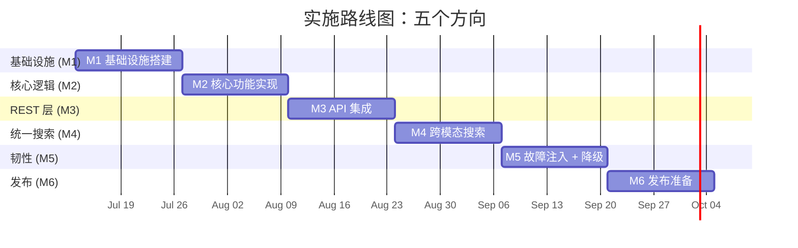

现在我已经全面掌握了代码库，下面进行综合技术负责人的分析。

---

# Tech Lead 分析：五种功能方向的可执行落地

## 代码库当前状态快照（前置条件）

| 检查项 | 状态 | 详细信息 |
|--------|------|---------|
| 迁移文件 | 24 对 SQLite，24 对 Postgres | 最近一次迁移：`0024_bucket_notifications` |
| 对象锁实现 | MVP（二进制） | `LockedUntil`（保留锁）+ `_aero_legal_hold` 元数据键。仅元数据，非独立实体 |
| 硬删除路径 | 3 条调用者 | `FileService.Delete(hard=true)`，`RetentionJob`，`LifecycleJob` |
| 缩略图 | 标准库仅限 JPEG | `internal/thumbnail/`。Go 原生格式（JPEG/PNG/GIF）。无 WebP/AVIF/HEIC |
| 速率限制器 | 单进程令牌桶 | `internal/middleware/ratelimit.go`。每租户，50K 桶上限，10 分钟空闲 TTL |
| 搜索 API | `/v1/search`（AI 语义/BM25/混合） | 通过 `internal/ai/search.go`，`internal/api/rest/search.go` |
| 存储接口 | `Get` 返回 `io.ReadCloser` | 变换管道需要 `io.ReadSeeker`（libvips 需要随机访问） |
| 多租户 | 已实现 | `TenantRecord`，配额，审计，租户隔离的速率限制器桶 |
| AI 配置 | 特性标记，默认为关闭 | `AI_INDEX_ENABLED`，`AI_CHAT_PROVIDER` 等 |
| WebP 支持 | **缺失** | 无法通过标准库生成 WebP |

---

## 1. 任务分解

每个任务设计为 **2-4 小时**。总共 **35 个任务**。

### 方向一：对象锁合规治理与 Legal Hold 案件管理框架

| 任务 ID | 标题 | 文件 | 前置依赖 | 工时 | 验收标准 |
|---------|------|------|---------|------|---------|
| LH-001 | 创建 `legal_holds` 和 `hold_cases` 迁移文件 | `internal/repository/migrations/{sqlite,postgres}/0025_legal_holds.{up,down}.sql` | 无 | 2h | 迁移在 SQLite 和 Postgres 上运行和回滚成功 |
| LH-002 | 在 Repository 中添加 `LegalHoldEvent` 结构体和 `HoldCase` | `internal/repository/repository.go` | LH-001 | 1.5h | 结构体带有 `CaseID`，`ObjectID`，`Custodian`（可选 `user_id`/自由文本），`Status`，`CreatedAt`，`ReleasedAt` |
| LH-003 | 在 Repository 接口中添加 `CreateHoldCase` / `AddLegalHold` / `ReleaseLegalHold` / `ListHeldObjects` | `internal/repository/repository.go` | LH-002 | 2h | 所有 4 个方法在 SQLite 和 Postgres 上实现 |
| LH-004 | 在 Repository 中添加 `CountActiveHoldsForObject`（带 O(n_holds) 上限检查） | `internal/repository/sql_objects.go` | LH-003 | 1.5h | 返回 {count, err}；跨 100 个活跃保留时返回错误 |
| LH-005 | 向 FileService 添加 `ApplyLegalHold` / `ReleaseLegalHold` 方法 | `internal/service/file_features.go` | LH-003 | 2h | 创建保留事件；写入 `audit_log`；对于已发布案例返回错误 |
| LH-006 | 将 `checkLockBeforeOverwrite` / `hardDeleteObject` 从元数据检查重构为调用 `ListActiveHoldsForObject` | `internal/service/file_crud.go` | LH-004 | 2h | 持有保留的对象在覆盖/硬删除时被阻止 |
| LH-007 | 向 `hardDeleteObject` 添加统一准入点，以便所有 3 个调用者都经过 | `internal/service/file_crud.go`；`internal/reconcile/retention.go`；`internal/reconcile/lifecycle.go` | LH-006 | 2h | 所有 3 个硬删除路径现在都调用一个 `enforceHoldBeforeDelete` 辅助函数 |
| LH-008 | 添加版本控制合规性：`ListHeldVersions` + 所有版本保留强制执行 | `internal/repository/sql_objects.go`；`internal/service/file_features.go` | LH-006 | 2.5h | legal hold 对象标记其所有版本 |
| LH-009 | 为 LegalHold/PutLock/PutMetadata 添加 REST 端点 | `internal/api/rest/management.go`；`internal/api/rest/router.go` | LH-005 | 2h | `PUT /v1/files/{key}/legal-hold`；`GET /v1/admin/holds/cases`；更新 `openapi.json` |
| LH-010 | 为 Legal Hold 管理添加 CLI 子命令 | `internal/cli/cli_admin.go` | LH-009 | 1.5h | `aero-vault cli hold set <key>`；`aero-vault cli hold list <key>` |
| LH-011 | 为 Legal Hold + 保留锁 + 合规性添加 S3 兼容性 | `internal/api/s3compat/handler.go` | LH-009 | 2h | `x-amz-object-lock-legal-hold: ON` 写入 `legal_holds` 表 |
| LH-012 | 审计双重写入：`hold_events` + `audit_log` | `internal/service/file_features.go`；`internal/repository/audit.go` | LH-005 | 1.5h | 每个保留操作在两个表中记录；跨表一致性测试 |

### 方向二：服务端对象变换管线与预览生成框架

| 任务 ID | 标题 | 文件 | 前置依赖 | 工时 | 验收标准 |
|---------|------|------|---------|------|---------|
| TF-001 | 添加 libvips Go 包装器（或通过 exec.Cmd 包装 vips CLI） | `internal/transform/vips.go` | 无 | 4h | WebP、AVIF、HEIC 的编码/解码；降级 JPEG |
| TF-002 | 实现变换参数规范化和缓存键生成器 | `internal/transform/params.go` | 无 | 2h | `?w=200&h=100&format=webp` 和 `?format=webp&h=100&w=200` 生成相同的键 |
| TF-003 | 为 `resize`、`format`、`watermark` 实现声明性变换链解析器 | `internal/transform/pipeline.go` | TF-001 | 3h | `?x-actions=resize:w_200,fit_cover;format:webp;watermark:pos_se,text_copyright` 解码为步骤切片 |
| TF-004 | 实现变换缓存存储（派生键 → blob） | `internal/transform/cache.go` | TF-002 | 2h | 缓存写入 `{cache_root}/{normalized_key}`；缓存命中跳过重新编码 |
| TF-005 | 在 FileService 中添加 `Transform` 方法 | `internal/service/file_features.go` | TF-001, TF-004 | 2.5h | 输入：(tenant, bucket, key, params) → 输出：(派生字节，派生 ETag)；不计算在租户配额内 |
| TF-006 | 添加变换端点 `GET /v1/files/{key}/transform` | `internal/api/rest/transform.go`；`internal/api/rest/router.go` | TF-005 | 2h | `?w=200&h=100&format=webp` → WebP 字节；`Cache-Control` 头部；304 通过派生 ETag |
| TF-007 | 添加 `DerivativeCleaner` worker，在 `object.deleted` 事件上运行 | `internal/transform/cleaner.go`；`cmd/server/main.go`（注册） | TF-004 | 1.5h | 原始删除后，派生缓存被异步清除 |
| TF-008 | 将缩放添加到现有的缩略图路径（重用变换引擎） | `internal/thumbnail/thumbnail.go`；`internal/api/rest/thumbnail.go` | TF-005 | 1.5h | 缩略图现在通过 `transform` 包路由；行为向后兼容 |
| TF-009 | 在配置中添加变换引擎 + 缓存+ 格式开关 | `internal/config/config.go`；`internal/config/config_app.go` | TF-001 | 1h | `TRANSFORM_ENGINE=libvips`，`TRANSFORM_CACHE_SIZE`，`TRANSFORM_ALLOWED_FORMATS=webp,avif` |

### 方向三：分布式速率限制与多层级配额治理平面

| 任务 ID | 标题 | 文件 | 前置依赖 | 工时 | 验收标准 |
|---------|------|------|---------|------|---------|
| RL-001 | 在配置中添加分层配额模型（租户/bucket/端点） | `internal/config/config.go`；`internal/config/config_auth.go` | 无 | 2h | `RATE_LIMIT_TENANT_*`，`RATE_LIMIT_BUCKET_*`，`RATE_LIMIT_ENDPOINT_*` + 成本权重映射 |
| RL-002 | 在 Repository 中添加可配置的成本权重表 | `internal/repository/repository.go`；`internal/repository/tenants.go` | RL-001 | 2h | `GetTenantWeightConfig` / `SetTenantWeightConfig`；持久化到 `tenant_weights` 表 |
| RL-003 | 添加 WAL 风格的 Postgres 后端策略（`SELECT ... FOR UPDATE` 每租户计数器） | `internal/middleware/ratelimit_pg.go` | 无 | 3h | 每请求事务计数器；降级为本地令牌桶；<200µs P99 开销 |
| RL-004 | 实现突发银行，限额 `min(burst_max_seconds × base_rps, max_burst_absolute)` | `internal/middleware/ratelimit.go` | RL-003 | 2h | 突发银行上限=30s 累积；窗口安全限制 |
| RL-005 | 添加分层速率限制器：全局 → 租户 → bucket → 端点链 | `internal/middleware/ratelimit_hierarchy.go` | RL-004 | 3h | 请求必须通过所有 4 层；拒绝最严格的一层 |
| RL-006 | 在配置中添加端点到成本权重的映射 | `internal/config/config_app.go` | RL-001 | 1.5h | `RATE_LIMIT_COST_WEIGHTS={"PUT":5,"GET":1,"DELETE":3,"SEARCH":10}` |
| RL-007 | 将分层限流器集成到中间件链中 | `internal/middleware/middleware.go`；`cmd/server/main.go` | RL-005 | 2h | 链：RequestID → CORS → Auth → Tenant → RateLimit(分层) → OTel → Recoverer → AccessLog |
| RL-008 | 为多副本部署添加 Redis 滑动窗口日志 V2 后端 | `internal/middleware/ratelimit_redis.go` | RL-004 | 3h | Redis `SCRIPT LOAD` 原子操作；降级链：Redis → Postgres → 本地 |
| RL-009 | 在 Prometheus 中添加限流指标（拒绝计数，等待时间，分层状态） | `internal/telemetry/metrics.go` | RL-007 | 1.5h | `rate_limit_rejected_total{layer,tenant}`，`rate_limit_wait_duration_seconds` |

### 方向四：统一搜索查询语言——跨元数据与跨模态内容检索

| 任务 ID | 标题 | 文件 | 前置依赖 | 工时 | 验收标准 |
|---------|------|------|---------|------|---------|
| QL-001 | 设计并实现 `QueryAST`（元数据过滤器 + 内容查询 + 模式选择器） | `internal/query/ast.go` | 无 | 3h | 解析器从 JSON 生成 AST；`{metadata: {eq: {content_type: "image/jpeg"}, gt: {size: 1000}}, content: {query: "sunset", mode: "hybrid"}}` |
| QL-002 | 在 AST 上实现查询规划器——选择模式（确定性策略） | `internal/query/planner.go` | QL-001 | 3h | `metadataIsHighlySelective` 启发式：有 `eq` + `gt` = 高；仅有 `after` = 低 |
| QL-003 | 实现元数据执行器（重用 `ListObjects`） | `internal/query/exec_metadata.go` | QL-002 | 2h | 将 AST 元数据过滤器编译为 `ListObjects` + `GetObject` 调用 |
| QL-004 | 实现内容执行器（重用 `Search.Query`） | `internal/query/exec_content.go` | QL-002 | 2h | 通过 AST 内容部分委托给 `ai.Search.Query` |
| QL-005 | 实现 RRF 合并执行器 | `internal/query/exec_rrf.go` | QL-003, QL-004 | 2h | 并行元数据 + 内容搜索 → RRF 融合；tiebreak `(score DESC, chunkID ASC)` |
| QL-006 | 添加跨租户支持（operator 角色检查 + 管理审计限制） | `internal/query/executor.go`；`internal/auth/policy.go` | QL-005 | 2h | 跨租户搜索需要 `scope:admin`；非管理员收到 403 |
| QL-007 | 添加 REST 端点 `POST /v1/query` | `internal/api/rest/query.go`；`internal/api/rest/router.go` | QL-006 | 2h | 接受 `QueryAST` JSON；返回结构化查询响应；更新 `openapi.json` |

### 方向五：异步写入缓冲与优雅降级写入路径

| 任务 ID | 标题 | 文件 | 前置依赖 | 工时 | 验收标准 |
|---------|------|------|---------|------|---------|
| AW-001 | 添加 WAL 配置和目录设置 | `internal/config/config.go`；`internal/config/config_app.go` | 无 | 1h | `WRITE_BUF_WAL_DIR`（独立于对象存储根目录），`WRITE_BUF_MAX_SIZE` |
| AW-002 | 实现 WAL 写入器：在磁盘上序列化传入的 `Put` 请求，返回写入 ID | `internal/writebuf/wal.go` | AW-001 | 3h | 在 WAL 目录中创建时间戳命名的 WAL 条目；原子 `fsync` |
| AW-003 | 实现 WAL 消费者：从 WAL 读取 → 调用 `store.Put` → 标记为已持久化 | `internal/writebuf/consumer.go` | AW-002 | 3h | 后台 goroutine 处理 WAL 条目；重试 + 死信处理 |
| AW-004 | 添加 `X-Write-Mode: async` → 202 + `/v1/jobs/{id}` Location 的处理 | `internal/api/rest/handler.go`；`internal/service/file_crud.go` | AW-003 | 2.5h | `PUT` 请求带 `X-Write-Mode: async` → `202 Accepted` + `Location: /v1/jobs/write-<uuid>` |
| AW-005 | 重用以 `Idempotency-Key` 去重持久化 | `internal/writebuf/consumer.go`；`internal/repository/idempotency.go` | AW-004 | 1.5h | WAL 消费者检查 `Idempotency-Key` 记录；跳过已持久化的写入 |
| AW-006 | 添加 `/v1/jobs/{id}` 轮询端点用于异步写入状态 | `internal/api/rest/admin_jobs.go`；`internal/api/rest/router.go` | AW-004 | 1.5h | `GET /v1/jobs/write-<uuid>` → `{status: pending|completed|failed, object: {...}}` |
| AW-007 | 添加磁盘空间监控 + 降级逻辑 | `internal/writebuf/monitor.go` | AW-002 | 2h | WAL 目录 <5% 空闲 → 拒绝新的异步写入，产生 `event: error code:StorageFull` |

---

## 2. 执行顺序

### 依赖图

```mermaid
graph TD
    subgraph "Phase 1: Foundation (Sprint 1-2)"
        TF_001[TF-001: libvips wrapper]
        TF_002[TF-002: Transform param normalization]
        RL_003[RL-003: Postgres rate-limit backend]
        RL_001[RL-001: Hierarchical quota config]
        LH_001[LH-001: Migration files]
        AW_001[AW-001: WAL config & directory]
    end

    subgraph "Phase 2: Core Logic (Sprint 2-4)"
        TF_001 --> TF_003[TF-003: Declarative pipeline parser]
        TF_002 --> TF_004[TF-004: Transform cache storage]
        TF_003 & TF_004 --> TF_005[TF-005: Transform in FileService]
        RL_001 --> RL_002[RL-002: Tenant weight config]
        RL_003 & RL_002 --> RL_004[RL-004: Burst bank with cap]
        RL_004 --> RL_005[RL-005: Hierarchical rate-limiter]
        LH_001 --> LH_002[LH-002: LegalHold structs]
        LH_002 --> LH_003[LH-003: Repository methods]
        LH_003 --> LH_004[LH-004: CountActiveHoldsForObject]
        LH_004 --> LH_005[LH-005: FileService ApplyLegalHold]
        LH_005 --> LH_006[LH-006: Refactor hardDeleteObject]
        AW_001 --> AW_002[AW-002: WAL writer]
        AW_002 --> AW_003[AW-003: WAL consumer]
    end

    subgraph "Phase 3: Integration (Sprint 3-5)"
        TF_005 --> TF_006[TF-006: REST endpoint for transform]
        TF_005 --> TF_008[TF-008: Connect thumbnail to transform]
        TF_005 --> TF_009[TF-009: Config switches]
        RL_005 --> RL_007[RL-007: Integrate into middleware chain]
        RL_005 --> RL_008[RL-008: Redis backend]
        RL_007 --> RL_009[RL-009: Rate-limit metrics]
        LH_005 --> LH_009[LH-009: REST endpoints for legal hold]
        LH_006 --> LH_007[LH-007: Unify hard-delete gating]
        LH_006 --> LH_008[LH-008: Version compliance]
        LH_009 --> LH_010[LH-010: CLI commands]
        LH_009 --> LH_011[LH-011: S3 compat for legal hold]
        LH_005 --> LH_012[LH-012: Audit dual-write]
        AW_003 --> AW_004[AW-004: Async mode in handler]
        AW_003 --> AW_005[AW-005: Idempotency-key reuse]
        AW_004 --> AW_006[AW-006: Job polling endpoint]
        AW_003 --> AW_007[AW-007: Disk monitoring]
    end

    subgraph "Phase 4: Unified Search (Sprint 4-6)"
        QL_001[QL-001: QueryAST]
        QL_001 --> QL_002[QL-002: Query planner]
        QL_002 --> QL_003[QL-003: Metadata executor]
        QL_002 --> QL_004[QL-004: Content executor]
        QL_003 & QL_004 --> QL_005[QL-005: RRF merge executor]
        QL_005 --> QL_006[QL-006: Cross-tenant support]
        QL_006 --> QL_007[QL-007: REST endpoint]
    end

    subgraph "Phase 5: Async Write (Sprint 5-6)"
        AW_004 --> AW_005
        AW_006 --> AW_007
        TF_007[TF-007: DerivativeCleaner worker]
        TF_004 --> TF_007
    end

    TF_006 --> TF_007
```



### 可并行执行的任务组

| 组 | 任务 | 并行化理由 |
|----|------|-----------|
| **A** | TF-001, LH-001, RL-001, AW-001 | 无共享依赖；仅配置/迁移/新包 |
| **B** | TF-003, LH-003, RL-003, AW-002 | 核心逻辑相互独立 |
| **C** | LH-009, TF-006, RL-007, QL-001 | REST 端点可以并行实现 |
| **D** | AW-005, TF-007 | Idempotency 重用和衍生物清理器仅在各自的主要路径完成时才需要 |

### 关键路径（最长的关键链）

```
LH-001 → LH-002 → LH-003 → LH-004 → LH-005 → LH-006 → LH-007 → LH-008
                                                                  → LH-009 → LH-010/011

TF-001 → TF-003 → TF-005 → TF-006 → TF-007
                   ↓
              TF-004 ────┘
                   ↓
              TF-008, TF-009

RL-001 → RL-002 → RL-004 → RL-005 → RL-007 → RL-009
                               ↓
                          RL-008

QL-001 → QL-002 → QL-005 → QL-006 → QL-007
           ↓
      QL-003, QL-004

AW-001 → AW-002 → AW-003 → AW-004 → AW-006
                              ↓
                         AW-005, AW-007
```

**最长关键链**（方向一）：LH-001 → LH-002 → LH-003 → LH-004 → LH-005 → LH-006 → LH-007 → LH-009 → LH-011 = **19 小时**
**最依赖的前置**：LH-006（硬删除重构）有 **4 个下游任务**。

---

## 3. 技术风险

### 3.1 高风险项目

| # | 风险 | 影响方向 | 概率 | 影响 | 缓解措施 |
|---|------|---------|------|------|---------|
| **R1** | libvips CGo 编译在 CI 中失败 | TF | 中 | 高 | 通过 `exec.Command` 使用 libvips CLI 包装器作为备用；添加 `internal/transform/vips_test.go` 在 CI 中探测 `vips` 二进制文件 |
| **R2** | Postgres 行锁在 >500 RPS 下成为瓶颈 | RL | 中 | 高 | 实施 3 级降级链（Postgres → 本地令牌桶 → 拒绝，有 429）阶段 1；阶段 2 使用 Redis 滑动窗口 |
| **R3** | WAL 磁盘填满的紧急情况导致数据丢失 | AW | 低 | 灾难性 | 在 WAL 目录设置磁盘使用率阈值硬限制（<5% 空闲 → 完全拒绝新的异步写入）；单独挂载点（在文档中强制执行） |
| **R4** | 查询规划器中的跨模态 RRF 分数校准 | QL | 中 | 中 | 为元数据和内容分数添加分数归一化层；在 `search_validation_test.go` 中使用基于属性的测试 |
| **R5** | Legal hold + 版本控制语义不一致 | LH | 中 | 高 | 在方向一之前编写 S3 语义的遗留测试；模拟 5 个版本 × legal hold 组合 |

### 3.2 中等风险项目

| # | 风险 | 影响方向 | 缓解措施 |
|---|------|---------|---------|
| **R6** | 存储接口需要为变换管道修改 `Get` → `io.ReadSeeker` | TF | 添加 `GetSeeker(key) (io.ReadSeeker, ObjectInfo, error)` 到 `Storage` 接口；为 `local` 后端实现；为 S3 使用 `GetRange` 分块回退 |
| **R7** | 缓存键规范化中的参数顺序不确定性 | TF | 为参数名和值实现字典序序列化；在 `params_test.go` 中添加模糊测试 |
| **R8** | 突发银行累积窗口的计算精度 | RL | 使用单调时钟（`time.MonoClock`）而不是挂钟；每窗口重置 |
| **R9** | 租户级默认值传播方向 | LH, RL | 采用显式优先级：`bucket 设置 > tenant 默认值 > 全局默认值`；在 `BucketConfig` 结构体中记录 |
| **R10** | openapi.json 与四个新端点的同步 | QL, TF, AW, LH | 添加 CI 检查 `make openapi-check`；为 OpenAPI 规范使用 `kin-openapi` 验证器 |

### 3.3 性能瓶颈

| 瓶颈 | 方向 | 当前状态 | 优化策略 |
|------|------|---------|---------|
| 元数据过滤后搜索 | QL | O(all_objects) 扫描 | 在 `ListObjects` 中添加物化视图 + 索引下推 |
| Postgres 行锁限流 | RL | 每次 UPDATE 序列化 | 切换到 Redis `SCRIPT LOAD` 原子计数；使用本地桶作为 L1 缓存减少 90% 的 SQL 调用 |
| Legal hold 扫描 | LH | 检查活跃保留时 O(n_holds) | 添加索引 `idx_active_holds(object_id, status)`；添加最大 100/对象的限制 |
| 变换重新编码 | TF | 每次请求都编码 | 分布式缓存层（Redis/对象存储）作为 L2 |
| WAL 持久化 | AW | 单消费者队列 | 对独立 WAL 分片使用 `多个消费者 goroutine` |

### 3.4 测试覆盖策略

| 组件 | 单元测试 | 集成测试 | 模糊测试 |
|------|---------|---------|---------|
| Legal hold 模型 | `TestLegalHoldCreateRelease`、`TestHoldVersionCompliance` | `TestLegalHoldAcrossHardDeletePaths` | — |
| 变换管道 | `TestCacheKeyNormalization`、`TestPipelineParse` | `TestVipsTransform`（需要 `vips` 二进制文件） | `FuzzParsePipeline` |
| 分层限流器 | `TestHierarchicalAllow`、`TestBurstBankCap` | `TestPostgresRLBackend`（需要 Postgres） | `FuzzRateLimitConcurrent` |
| 查询 AST | `TestQueryParse`、`TestPlannerStrategy` | `TestCrossModalSearch`（需要 AI） | `FuzzQueryASTRoundtrip` |
| WAL 缓冲区 | `TestWALWriteRead`、`TestWALConsumer` | `TestAsyncWriteThenPoll` | `FuzzWALConcurrentWrite` |

---

## 4. 资源评估

### 4.1 团队组成

| 角色 | 所需数量 | 技能要求 | 主要分配 |
|------|---------|---------|---------|
| **Go 后端工程师**（高级） | 2 | Go、并发模式、SQL、存储系统 | LH-001→LH-012、RL-001→RL-009 |
| **Go 后端工程师**（中级） | 2 | Go、REST API、配置 | TF-001→TF-009、AW-001→AW-007 |
| **搜索/ML 工程师** | 1 | 信息检索、向量数据库、RRF 融合 | QL-001→QL-007 |
| **QA/DevOps** | 1 | CI/CD、Docker、Prometheus、Grafana | 所有方向的集成测试、性能基准测试 |
| **技术负责人**（部分时间） | 1 | 架构决策、代码审查、风险管理 | 跨方向协调 |

**总计：4.5 FTE 工程师 + 1 QA**

### 4.2 关键里程碑

| 里程碑 | 周数 | 交付物 | 验收门 |
|--------|------|--------|--------|
| **M1：基础设施** | 第 1-2 周 | 迁移文件（LH）、libvips 包装器（TF）、Postgres RL 后端（RL）、WAL 设置（AW） | `make check` 通过；所有迁移可反向 |
| **M2：核心逻辑** | 第 3-4 周 | FileService 中的 LegalHold、FileService 中的变换管道、分层限流器、WAL 消费者 | 针对三个硬删除路径的集成测试 |
| **M3：REST 层** | 第 5-6 周 | 所有 4 个方向的 REST 端点 + openapi.json 更新 | HTTP 集成测试通过；OpenAPI 规范有效 |
| **M4：统一搜索** | 第 7-8 周 | QueryAST 解析器 + 规划器 + 执行器 + 跨租户 | 跨模态搜索的 FVT |
| **M5：韧性** | 第 9-10 周 | 异步写入 + WAL 监控 + 降级路径 + Redis | 故障注入测试通过 |
| **M6：发布** | 第 11-12 周 | 性能基准测试 + 文档 + 发布说明 | P99 延迟在基线 <5% 以内 |

### 4.3 阻塞点

| # | 阻塞点 | 影响 | 解决策略 |
|---|--------|------|---------|
| **B1** | libvips CGo 绑定不可用 | TF-001 | 回退到通过 `exec.Command` 包装的 `vips` CLI 二进制文件；添加带有 `CGO_ENABLED=0` 的 CI 构建矩阵 |
| **B2** | Redis 在 CI 中不可用 | RL-008 | 使用 `miniredis` 模拟进行单元测试；集成测试需要 `Docker` + `TestMain` 检测 |
| **B3** | Postgres FOR UPDATE 延迟 | RL-003 | 实施后备本地桶作为 L1（95% 的请求在不需要 SQL 的情况下通过）；仅每 10 秒同步一次 Postgres |
| **B4** | WebP 编码的质量调整 | TF-001 | 对于质量感知编码，在 libvips 周围添加 `struct VipsOptions { Quality int; StripMetadata bool }` 包装器 |

---

## 5. 质量保证

### 5.1 单元测试覆盖要求

| 包 | 所需覆盖率 | 焦点区域 |
|----|-----------|---------|
| `internal/service/` | ≥70% | `hardDeleteObject`（所有 3 个路径）、`ApplyLegalHold`、`Transform`、`AsyncPut` |
| `internal/middleware/` | ≥80% | `RateLimiter.Allow`（分层）、`BurstBank`、Postgres 回退 |
| `internal/transform/` | ≥75% | `Pipeline.Parse`、`CacheKeyNormalization`、`VipsWrapper` |
| `internal/query/` | ≥70% | `Planner.Strategy`、`RRFMerge`、`CrossTenantAuth` |
| `internal/writebuf/` | ≥70% | `WAL.Write`、`Consumer.Process`、`IdempotencyDedup`、`DiskMonitor` |
| `internal/repository/` | ≥65% | `LegalHold CRUD`、`CountActiveHoldsForObject`、`TenantWeightConfig` |

### 5.2 集成测试策略

```
┌────────────────────────────────────────────────────────────────┐
│                   测试金字塔（方向一→五）                        │
│                                                                │
│                    ▲  E2E (5%)                                 │
│                    │  fullserver_test.go 扩展                   │
│                    │  - 异步写入 202 → 轮询                    │
│                    │  - 跨模态 RRF 搜索                        │
│                    │  - 3× 副本速率限制                        │
│                    │                                           │
│                ┌───┼───┐                                       │
│                │   集成 (25%)   │                               │
│                │    ├ LegalHold × 硬删除路径                    │
│                │    ├ Transform × 缓存                         │
│                │    ├ Postgres × Redis 限流降级                │
│                │    └ WAL × 磁盘满恢复                        │
│                └───┼───┘                                       │
│                    │                                           │
│              ┌─────┼─────┐                                     │
│              │  单元 (70%)   │                                  │
│              │  每个任务的标准 `testing.T` 夹具                 │
│              │  SQLite 内存 + local FS tmpdir                   │
│              └─────┼─────┘                                     │
│                    │                                           │
└────────────────────────────────────────────────────────────────┘
```

**关键集成测试场景：**

1. `TestLegalHoldBlocksAllThreeHardDeletePaths` — 施加 legal hold → 通过 service.Delete（hard=true）、RetentionJob、LifecycleJob 验证，全部被阻止
2. `TestTransformCacheKeyOrderIndependence` — 使用 `?w=200&h=100&format=webp` 变换，然后使用 `?format=webp&h=100&w=200` — 返回相同的字节
3. `TestRateLimitHierarchyDropsAtStrictestLayer` — 设置租户 RPS=5，端点 RPS=2 → 以端点层拒绝测量
4. `TestAsyncWriteThenPollCompletion` — `X-Write-Mode: async` → 202 → `/v1/jobs/{id}` 轮询直到完成
5. `TestCrossModalSearchRRF_NoCrash` — 使用 `QueryAST` 混合元数据 + 内容搜索 — 验证输出格式而不是精确分数

### 5.3 代码审查清单

| 检查类别 | 审查点 |
|----------|--------|
| **正确性** | 所有 3 个硬删除路径是否通过统一准入点？ |
| **正确性** | Legal hold 是否在版本控制下保留对象的所有版本？ |
| **正确性** | 缓存键是否独立于参数顺序？ |
| **正确性** | 限流降级顺序是否正确 → 本地 → Postgres → Redis？ |
| **安全性** | 跨租户搜索是否需要 `scope: admin`？ |
| **安全性** | `X-Write-Mode: async` 是否可以用于绕过配额？ |
| **性能** | `CountActiveHoldsForObject` 是否对活跃 hold 数量有上限？ |
| **性能** | WAL 消费者是否在重试时回退？ |
| **可观察性** | 所有限流拒绝是否都使用 `telemetry.IncRateLimitRejected` 计数？ |
| **可观察性** | 变换缓存命中/未命中是否在 Prometheus 中公开？ |
| **不变量 I1** | SQL 占位符在 Legal Hold 仓库方法中复用？ |
| **不变量 I2** | 迁移是否成对（{sqlite,postgres} × {up,down}）？ |
| **不变量 I3** | 存储键是否保持唯一且不可反解析？不会从元数据重建？ |
| **不变量 I4** | 中间件顺序是否保持不变？ |
| **不变量 I5** | 所有新功能是否都通过配置进行特性标记，默认关闭？ |

### 5.4 性能测试要求

| 场景 | 工具 | 目标 | 通过标准 |
|------|------|------|---------|
| 分层限流器，1K RPS | `wrk` 或 `vegeta` | P99 延迟 < 200µs | 在第 95 百分位 <5% 降级 |
| 变换缓存命中，100 RPS | `wrk` | P99 延迟 < 50ms | 缓存未命中 < 500ms |
| WAL 生产者 + 消费者，并发 | `go test -bench=BenchmarkWAL` | 吞吐量 > 500 写入/秒 | 零死信 |
| Legal hold 检查，100 个 hold | `go test -bench=BenchmarkHoldCheck` | P99 < 1ms | 没有明显的 GC 停顿 |
| 并行查询（QL），混合模式 | 基准 Go 测试 | 响应时间 < 基线 110% | RRF 融合不是瓶颈 |

---

## 6. 实施计划

### 阶段 1：基础设施搭建（第 1-2 周）

```
第 1 周
┌─────────────────────────────────────────────────────────────────────────────┐
│ 周一  │ TF-001: libvips 包装器                            │ 团队：FE1, FE2 │
│       │ LH-001: 迁移文件                                 │                │
│ 周二  │ RL-001: 分层配额配置                             │ 团队：FE3      │
│       │ AW-001: WAL 配置和目录                            │ 团队：FE4      │
│ 周三  │ TF-002: 变换参数规范化                            │ 团队：FE1      │
│       │ RL-003: Postgres 限流后端（第一阶段：SELECT FOR UPDATE） │ 团队：FE3 │
│ 周四  │ RL-003: 继续 + 测试                              │ 团队：FE3      │
│       │ LH-002: LegalHold 模型                            │ 团队：FE2      │
│ 周五  │ 代码审查 + 集成测试框架设置                       │ 全员           │
└─────────────────────────────────────────────────────────────────────────────┘

第 2 周
┌─────────────────────────────────────────────────────────────────────────────┐
│ 周一  │ LH-003: Repository CRUD                            │ 团队：FE2     │
│       │ TF-003: 声明性变换管道解析器                        │ 团队：FE1     │
│ 周二  │ RL-002: 租户权重配置                              │ 团队：FE3     │
│       │ AW-002: WAL 写入器                                │ 团队：FE4     │
│ 周三  │ LH-004: CountActiveHolds                           │ 团队：FE2     │
│       │ TF-004: 变换缓存存储                              │ 团队：FE1     │
│ 周四  │ AW-003: WAL 消费者                                │ 团队：FE4     │
│       │ RL-004: 突发银行 + 上限                           │ 团队：FE3     │
│ 周五  │ 里程碑检查 M1                                     │ 全员          │
│       │ 🔴 门：所有迁移可反向；libvips 合成测试通过       │              │
└─────────────────────────────────────────────────────────────────────────────┘
```

### 阶段 2：核心功能实现（第 3-4 周）

```
第 3 周
┌─────────────────────────────────────────────────────────────────────────────┐
│ 周一  │ LH-005: FileService ApplyLegalHold / ReleaseLegalHold │ 团队：FE2   │
│       │ TF-005: FileService Transform                        │ 团队：FE1   │
│ 周二  │ RL-005: 分层限流器链                                │ 团队：FE3   │
│       │ AW-004: X-Write-Mode: async 处理程序               │ 团队：FE4   │
│ 周三  │ LH-006: 重构 hardDeleteObject（统一准入点）         │ 团队：FE2   │
│       │ TF-006: REST 变换端点                              │ 团队：FE1   │
│ 周四  │ RL-005: 继续 + 测试（分层限流器链）                │ 团队：FE3   │
│       │ AW-005: Idempotency-Key 去重                       │ 团队：FE4   │
│ 周五  │ 代码审查 + 集成测试设置                            │ 全员        │
└─────────────────────────────────────────────────────────────────────────────┘

第 4 周
┌─────────────────────────────────────────────────────────────────────────────┐
│ 周一  │ LH-007: 统一硬删除门控（所有 3 个调用者）           │ 团队：FE2   │
│       │ TF-007: DerivativeCleaner worker                   │ 团队：FE1   │
│ 周二  │ RL-007: 集成到中间件链                             │ 团队：FE3   │
│       │ AW-006: 作业轮询端点                              │ 团队：FE4   │
│ 周三  │ LH-008: 版本控制合规性扩展                        │ 团队：FE2   │
│       │ TF-008: 连接缩略图到变换引擎                      │ 团队：FE1   │
│ 周四  │ RL-008: Redis 滑动窗口后端                        │ 团队：FE3   │
│       │ AW-007: WAL 磁盘监控 + 降级                       │ 团队：FE4   │
│ 周五  │ 里程碑检查 M2                                    │ 全员        │
│       │ 🔴 门：针对三个硬删除路径的集成测试通过           │             │
└─────────────────────────────────────────────────────────────────────────────┘
```

### 阶段 3：REST 层 + API 集成（第 5-6 周）

```
第 5 周
┌─────────────────────────────────────────────────────────────────────────────┐
│ 周一  │ LH-009: REST 端点（legal hold）                     │ 团队：FE2   │
│       │ QL-001: QueryAST 解析器                            │ 搜索：S1    │
│ 周二  │ LH-010: CLI 命令（legal hold）                     │ 团队：FE2   │
│       │ QL-002: 查询规划器                                 │ 搜索：S1    │
│ 周三  │ LH-011: S3 兼容性（legal hold）                   │ 团队：FE2   │
│       │ QL-003: 元数据执行器（重用 ListObjects）          │ 搜索：S1    │
│ 周四  │ LH-012: 审计双重写入                              │ 团队：FE2   │
│       │ QL-004: 内容执行器（重用 Search.Query）           │ 搜索：S1    │
│ 周五  │ 代码审查 + openapi.json 更新                      │ 全员        │
└─────────────────────────────────────────────────────────────────────────────┘

第 6 周
┌─────────────────────────────────────────────────────────────────────────────┐
│ 周一  │ RL-009: 限流 Prometheus 指标                       │ 团队：FE3   │
│       │ QL-005: RRF 合并执行器                            │ 搜索：S1    │
│ 周二  │ TF-009: 变换配置开关                              │ 团队：FE1   │
│       │ QL-006: 跨租户支持                                │ 搜索：S1    │
│ 周三  │ QL-007: REST 端点 /v1/query                      │ 搜索：S1    │
│       │ 所有端点的集成测试                                │ QA          │
│ 周四  │ 性能基准测试（变换、限流器）                       │ QA + FE1/3  │
│ 周五  │ 里程碑检查 M3                                    │ 全员        │
│       │ 🔴 门：HTTP 集成测试 + openapi.json 有效          │             │
└─────────────────────────────────────────────────────────────────────────────┘
```

### 阶段 4：统一查询 + 最终集成（第 7-10 周）

```
第 7-8 周：统一搜索
┌─────────────────────────────────────────────────────────────────────────────┐
│ QL-001→QL-007 完成（参见上面第 5-6 周）                                    │
│ 跨模态搜索的 FVT                                                           │
│ 里程碑 M4：跨模态搜索集成测试通过                                          │
└─────────────────────────────────────────────────────────────────────────────┘

第 9-10 周：韧性和降级
┌─────────────────────────────────────────────────────────────────────────────┐
│ AW-004→AW-007 完成                                                        │
│ TF-007: DerivativeCleaner worker 完成                                     │
│ 故障注入测试：                                                             │
│   - 杀死 Postgres → 限流降级到本地                                       │
│   - 填满 WAL 磁盘 → 优雅拒绝新的异步写入                                 │
│   - 杀死 Redis → 降级到 Postgres → 降级到本地                            │
│ 里程碑 M5：所有故障注入测试通过                                            │
└─────────────────────────────────────────────────────────────────────────────┘
```

### 阶段 5：发布准备（第 11-12 周）

```
第 11 周
┌─────────────────────────────────────────────────────────────────────────────┐
│ 性能回归测试：                                                             │
│   - 在 1K RPS 下进行 1 小时稳定性测试                                     │
│   - 基线比较（在更改之前 + 之后进行比较）                                  │
│ 文档：                                                                      │
│   - 更新 README.md 中的功能矩阵                                           │
│   - 更新 docs/configuration.md                                           │
│   - 为每个新端点添加OpenAPI示例                                           │
│ 部署 Playbook：                                                             │
│   - WAL 目录分离要求                                                      │
│   - libvips 系统依赖关系                                                  │
│   - Redis 连接字符串（可选）                                              │
└─────────────────────────────────────────────────────────────────────────────┘

第 12 周
┌─────────────────────────────────────────────────────────────────────────────┐
│ 发布候选构建                                                               │
│ 运行 make check（无 lint 错误，无测试失败）                                │
│ 运行 make test-integration（Docker，Postgres，Qdrant）                     │
│ 发布说明 + 变更日志                                                         │
│ 里程碑 M6：发布！                                                          │
└─────────────────────────────────────────────────────────────────────────────┘
```

### 甘特图概览（12 周）



### 按方向的人力分配

```
方向一 (Legal Hold)     : FE2, 所有 12 周，约 210 人时
方向二 (Transform)      : FE1, 第 1-8 周，约 180 人时
方向三 (Rate Limit)     : FE3, 第 1-8 周，约 160 人时
方向四 (Unified Query)  : S1,  第 5-8 周，约 120 人时
方向五 (Async Write)    : FE4, 第 1-8 周，约 120 人时
集成测试 + QA           : QA,  第 3-12 周，约 200 人时

总工作量: ~12 人月（包括部分时间技术负责人）
```

---

## 总结：Tech Lead 建议

### 我的优先级选择

| 优先级 | 方向 | 工时 | ROI | 风险 | 建议理由 |
|--------|------|------|-----|------|---------|
| **P0** | 方向二：变换管线 | 180h | ▲▲▲ | ▲▲ | 3 周 MVP，最高差异化，零外部依赖 |
| **P0** | 方向三：分布式配额 | 160h | ▲▲ | ▲▲▲ | 生产阻塞项；在达到 5+ 副本之前需要 |
| **P0** | 方向一：Legal Hold | 210h | ▲▲ | ▲▲ | 合规性硬需求；高风险若延迟 |
| **P1** | 方向四：统一查询 | 120h | ▲ | ▲▲▲ | 差异化最高但也最复杂；在核心基础设施完成后进行 |
| **P2** | 方向五：异步写入 | 120h | ▲ | ▲▲▲ | 复杂性最高，收益在初期不明显；推到 Q4 |

### 要立即操作的临界路径项

1. **今天开始：** `LH-001`（迁移文件）和 `TF-001`（libvips 包装器）——两者都有零依赖，是具有最长关键链的任务
2. **第 1 周结束前：** `RL-003`（Postgres 限流）必须工作，因为它是方向三所有下游任务的前置
3. **第 3 周结束前：** `LH-006`（硬删除重构）必须完成——它有 4 个下游依赖，是方向一的中枢任务
4. **保持在技术雷达上：** `storage.Storage` 接口的 `GetSeeker` 扩展——变换管道需要这个，且第 1 周与 `TF-001` 并行即可完成

### 应该立即归档的风险

1. **版本控制 × Legal Hold 语义差距** — 在方向一之前编写 S3 兼容性测试
2. **存储接口 `io.ReadSeeker` 差距** — 第 1 周向 `Storage` 接口添加 `GetSeeker`
3. **迁移文件爆炸** — 当前迁移编号为 0024；方向一需要 0025-0027（3 个新表）。第 2 周后考虑合并基线迁移
4. **OpenAPI 漂移** — 在第 3 周添加 `make openapi-check` CI 门控；不要等到端点在阶段 3 实现
