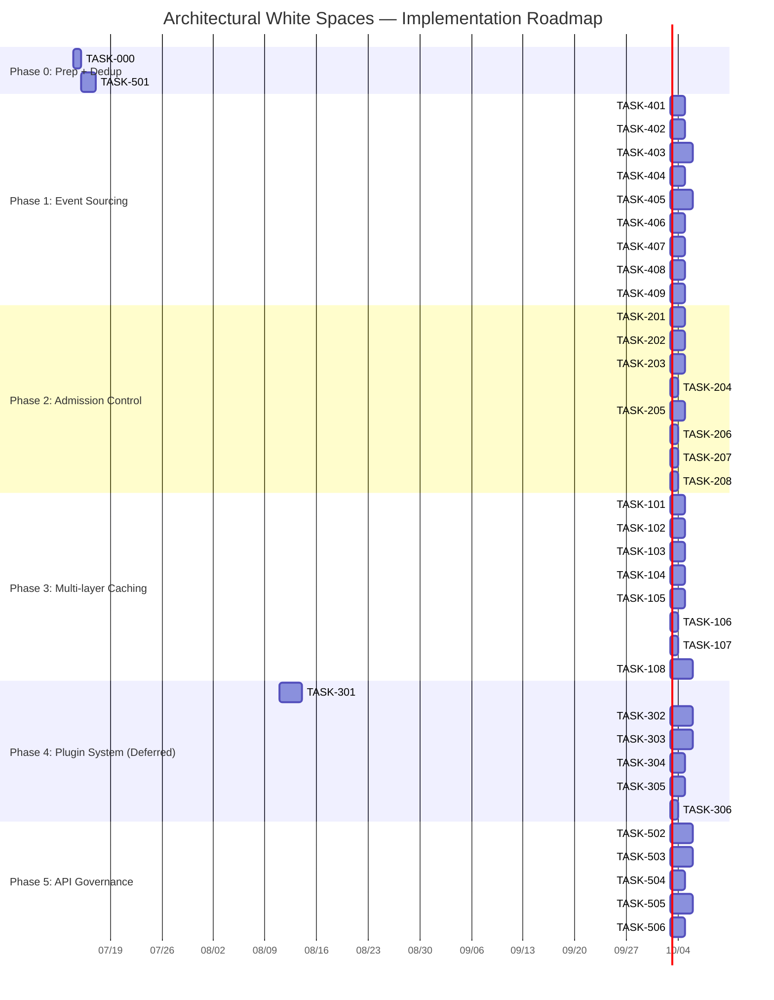

Now I have a thorough understanding of the codebase. Let me compile the Tech Lead analysis.

---

# Tech Lead Analysis: Architectural White Spaces Implementation Plan

## Analysis of the Review Document

The review quality is **high** — code anchors are precise, improvement suggestions are specific, and the de-duplication analysis identifies real issues. Two P0 dedup failures (Direction 5 ↔ v84 Direction 1; Direction 3 ↔ v18 Direction 4) must be resolved before any implementation begins, as they directly affect scope clarity.

**My prioritization heuristic:**
- **Direction 4 (Event Sourcing)** has the highest architectural leverage — it is a dependency for Direction 2's admission control feedback loop and unlocks the event-driven future
- **Direction 1 (Multi-layer Caching)** has the best risk/reward ratio — the L1 cache alone delivers immediate latency improvement with minimal code change
- **Direction 2 (Admission Control)** has the narrowest change surface but the highest correctness risk (concurrency, signal leaks)
- **Direction 3 (Plugin System)** is the highest effort with the most distant payoff — should be lowest priority
- **Direction 5 (API Governance)** should initially be documentation-only (spec-first migration plan) followed by the SDK pipeline

---

## 1. Task Decomposition

### Direction 4 — Event Sourcing (Foundation Layer, Highest Leverage)

| Task ID | Title | Files | Deps | Hours | Acceptance |
|---------|-------|-------|------|-------|------------|
| TASK-401 | Create `event_log` append-only table + migration pair | `internal/repository/migrations/{sqlite,postgres}/0006_event_log.{up,down}.sql` | — | 2 | `event_log` table has `id BIGSERIAL, tenant_id, event_type, event_version, payload JSONB, parent_event_id BIGINT NULL, created_at` with no `UPDATE` or `DELETE` path in code |
| TASK-402 | Define 10 core `EventType` constants + `EventVersion` | `internal/repository/event_types.go` | TASK-401 | 1.5 | All 10 core types defined with version const; `ValidateEventVersion()` unit test covers all 10 |
| TASK-403 | Split `events` into `event_log` (immutable) + `events` (TTL work cache) | `internal/repository/event.go` + `internal/events/bus.go` | TASK-402 | 4 | `Publish()` writes to `event_log` then best-effort fan-outs to `events`; `events` TTL-configured; no data loss if `events` INSERT fails |
| TASK-404 | Consumer offset checkpoint in `consumer_offsets` table | `internal/repository/consumer_offset.go` + migration | TASK-401 | 3 | `consumer_offsets(consumer_id TEXT PK, event_log_id BIGINT, updated_at)`; `CommitOffset` / `GetOffset` methods; integration test for offset tracking across restarts |
| TASK-405 | Bulk INSERT batcher with backpressure (100ms/100count) | `internal/events/batcher.go` | TASK-403 | 3.5 | Batch INSERT every 100ms or 100 events whichever first; backpressure signal at >500ms write latency → synchronous fallback; OTel gauge `event_batch_latency_ms` |
| TASK-406 | Hybrid Logical Clock implementation for cross-replica event ordering | `internal/events/hlc.go` | TASK-402 | 3 | HLC struct with `Now()`, `Observe(hlc)`, `Compare()`; wall-clock drift detection; unit test with in-order, out-of-order, and drift scenarios |
| TASK-407 | ParentEventID causal chain + event ordering enforcement | `internal/events/causality.go` | TASK-406 | 2 | `ParentEventID` set from `EventID` of prior in-sequence operation; validation rejects events with `ParentEventID` that isn't visible yet |
| TASK-408 | GDPR right-to-forgotten: `DELETE` + `UPDATE SET payload = null` with `EventForgotten` tombstone | `internal/repository/gdpr.go` | TASK-403 | 2 | `ForgetEvents(ctx, tenant)` inserts `EventType=EventForgotten` audit trail, then `UPDATE event_log SET payload = NULL WHERE tenant_id = $1`; audit entry proves operation happened |
| TASK-409 | Event sourcing integration tests + OTel metrics | `internal/events/sourcing_test.go` | TASK-405, TASK-407 | 3 | All 10 event types roundtrip through `Publish → batch → consume → offset commit → restart → resume` |

**Direction 4 total: 24 hours (3 engineering days)**

---

### Direction 1 — Multi-layer Caching (Quick Wins)

| Task ID | Title | Files | Deps | Hours | Acceptance |
|---------|-------|-------|------|-------|------------|
| TASK-101 | L1 in-memory metadata cache with TTL + LRU eviction | `internal/service/cache/l1_cache.go` | — | 3 | Cache struct with `Get(key)`, `Set(key, obj, ttl)`, TTL-based expiry, bounded size, LRU eviction; thread-safe; zero-dependency on Redis |
| TASK-102 | Integrate L1 cache into `FileService.Get` and `FileService.Stat` | `internal/service/file_crud.go` | TASK-101 | 2 | `Get()` and `Stat()` check L1 BEFORE repo query; `Put()` and `Delete()` invalidate L1 entry; cache miss metrics `cache.hit{L1}` |
| TASK-103 | L2 small-object body cache (≤4MB) with write-through | `internal/service/cache/l2_cache.go` | TASK-101 | 3 | Write-through: `Put()` writes to L2 synchronously; `Get()` returns from L2 when object size ≤ `max_object_size`; L2 is process-local ring buffer |
| TASK-104 | Range request cache strategy: hot-prefix (first 64KB) caching | `internal/service/range.go` + `internal/service/cache/range_cache.go` | TASK-103 | 2.5 | For objects >4MB, cache first 64KB + metadata; Range requests starting ≤64KB served from cache; remainder streamed from backend |
| TASK-105 | Cache stampede prevention: singleflight for L1/L2 misses | `internal/service/cache/singleflight.go` | TASK-102 | 2 | `singleflight.Group` wraps repo/storage calls; concurrent misses coalesce into one; `cache.stampede_suppressed{layer}` counter |
| TASK-106 | Probabilistic early expiration (PEE) for TTL jitter | `internal/service/cache/pee.go` | TASK-105 | 1.5 | TTL × `rand.Float64() * jitter_pct` per entry; default jitter 10%; prevents thundering herd on mass expiry |
| TASK-107 | Cache OTel metrics + Prometheus panels | `internal/telemetry/cache_metrics.go` + `deploy/grafana/` | TASK-102 | 2 | Counter `cache.hit{layer=L1,L2,range}`, gauge `cache.memory_usage{layer}`, counter `cache.eviction{reason=size|ttl}` |
| TASK-108 | L3 Redis backend (optional, config-driven) | `internal/service/cache/redis_cache.go` | TASK-102 | 3.5 | Redis-backed L3 with `CACHE_REDIS_URL`; hash key → value + expiry; `SetNX` for distributed stampede prevention; fallback to L2 if Redis unavailable |

**Direction 1 total: 19.5 hours (~2.5 engineering days)**

---

### Direction 2 — Admission Control (Medium Complexity)

| Task ID | Title | Files | Deps | Hours | Acceptance |
|---------|-------|-------|------|-------|------------|
| TASK-201 | Unified `AdmissionController` interface replacing triple deficit | `internal/middleware/admission.go` | — | 3 | Interface with `Acquire(ctx, tenant, cost) func()`; combines concurrency limiting, per-tenant fairness, and backpressure-aware rejection in one struct; old `ConcurrencyLimiter` and `PerTenantConcurrencyLimiter` deprecated |
| TASK-202 | Backend-pressure-aware admission via circuit breaker stats | `internal/middleware/backpressure.go` | TASK-201, (circuitbreaker.go exists) | 2.5 | Maps `circuitBreaker.Stats().ErrorRate` → admission weight; when error rate >50% → `weight *= 0.5`; when >80% → 429 all except probes; zero-dependency on custom API |
| TASK-203 | Gradient recovery with half-open coordination | `internal/middleware/admission.go` | TASK-202 | 2 | After full rejection, every 10s increment capacity by 10% of original; synchronized with circuit breaker's half-open window to avoid double probe flood |
| TASK-204 | Signal-semaphore safety: `defer wg.Done()` + `recover()` guards | `internal/middleware/admission.go` | TASK-201 | 1 | All `Acquire` defer patterns include `recover()` logging; `AdmissionController health` method returning goroutine count; leak detection metric |
| TASK-205 | Config hot-reload for admission weight groups | `internal/config/config.go` + `internal/middleware/admission.go` | TASK-201 | 2.5 | `ADMISSION_WEIGHTS=tenant1:10,tenant2:5,default:2`; runtime reload via SIGHUP or polling; atomic swap of weight map |
| TASK-206 | Admission OTel metrics + alert rules (HighRejectionRate) | `internal/telemetry/admission_metrics.go` + `deploy/prometheus/alerts.yml` | TASK-202 | 1.5 | `admission.inflight{tenant}`, `admission.limit{tenant}`, `admission.rejected{reason=pressure|limit|budget}`, `admission.queue_latency_ms` |
| TASK-207 | Replace `ConcurrencyLimiter` in `main.go` middleware chain | `cmd/server/main.go` | TASK-201 | 1 | Old limiter middleware replaced; `cfg.App.MaxInFlight` → `AdmissionController` config; integration test verifies 429 under load |
| TASK-208 | WebDAV admission integration (currently bypasses middleware chain) | `internal/api/webdav/` + `cmd/server/main.go` | TASK-207 | 1.5 | WebDAV handler wraps `AdmissionController.Acquire` call; admission metrics visible for WebDAV paths; graceful degradation when queue builds |

**Direction 2 total: 17 hours (~2 engineering days)**

---

### Direction 3 — Plugin System (High Effort, Deferred)

| Task ID | Title | Files | Deps | Hours | Acceptance |
|---------|-------|-------|------|-------|------------|
| TASK-301 | Storage provider registration interface + `init()` self-register pattern | `internal/storage/registry.go` | — | 4 | `StorageFactory` interface with `New(ctx, cfg) (Storage, error)` + `Name() string` + `ConfigSchema() (json.RawMessage, ValidateConfig() error)`; `RegisterStorage(factory)`; active registration map |
| TASK-302 | Migrate local/s3/oss/cos from switch-case to `init()` registration | `internal/storage/local.go`, `s3.go`, `oss.go`, `cos.go`, `factory.go` | TASK-301 | 4 | Each backend adds `init() { RegisterStorage(...) }`; `NewFromConfig` delegates to registry; old switch retained as fallback with deprecation warning for one release |
| TASK-303 | AI component plugin registration (embedder/llm/reranker) | `internal/ai/registry.go` + `internal/ai/factory.go` | TASK-301 | 3.5 | `EmbedderFactory`, `LLMFactory`, `RerankerFactory` interfaces; registration + `init()` patterns; `buildEmbedder`/`buildLLM`/`buildReranker` in main.go use registry |
| TASK-304 | Auth provider plugin registration | `internal/auth/registry.go` + `internal/auth/factory.go` | TASK-301 | 2.5 | `AuthProviderFactory`; moves `buildAuthRegistry` switch logic to registry; backward-compatible with existing env config |
| TASK-305 | Configuration compatibility layer for old config format | `internal/config/plugin_compat.go` | TASK-302, TASK-304 | 2 | Old `STORAGE_BACKEND=s3` → auto-routes to registered `"s3"` provider; migration guide logged at WARN level; deprecated after 2 releases |
| TASK-306 | Plugin documentation + `init()` sequence caveats doc | `docs/architecture/plugin-system.md` | TASK-302 | 1.5 | Documents `init()` order dependency (file-name alphabetical), testing patterns (`init` override), binary size impact; compares with YAML-declarative, Go `plugin` package, and WASM alternatives |

**Direction 3 total: 17.5 hours (~2 engineering days)**

---

### Direction 5 — API Governance (Phased, Doc-First)

| Task ID | Title | Files | Deps | Hours | Acceptance |
|---------|-------|-------|------|-------|------------|
| TASK-501 | OpenAPI spec-first migration analysis: ogen vs oapi-codegen vs openapi-generator | `docs/architecture/api-governance.md` | — | 3 | Evaluation table of 3 tools (generated type quality, oneOf/anyOf support, path param naming); recommendation with rationale |
| TASK-502 | Deprecation four-phase MIDDLEWARE (Header → Sunset → 410 → Code Remove) | `internal/api/rest/deprecation.go` | — | 3 | `DeprecationMiddleware` reads `internal/api/rest/deprecations.yaml`; injects `Sunset` header for deprecated endpoints; phase 3 returns 410; phase 4 is manual code removal |
| TASK-503 | SDK code generation pipeline (Go SDK from OpenAPI spec) | `sdk/go/` + `Makefile` | TASK-501 | 4 | `make generate-sdk` runs `oapi-codegen` from `openapi.json`; generates Go client types + interface; CI validates generated code compiles |
| TASK-504 | SDK feature asymmetry gap analysis (documentation) | `docs/architecture/sdk-gaps.md` | TASK-503 | 2 | Audits all 14 admin methods + 30+ data-plane methods across Go/Python/JS SDKs; quantified gap table with `✅`/`⚠️`/`❌` per method per language |
| TASK-505 | API version router middleware (Accept header + URL prefix) | `internal/api/rest/version_router.go` | TASK-502 | 3 | "Accept: application/vnd.aero-vault.v2+json" + `/v2/` prefix; routes to versioned handler; default unversioned → latest stable |
| TASK-506 | Add SDK auto-generation coverage heatmap to CI | `Makefile` + `sdk/go/generate_test.go` | TASK-503 | 2 | CI step compares `openapi.json` → SDK methods; PR comment shows coverage delta; blocks PR if coverage drops below 70% |

**Direction 5 total: 17 hours (~2 engineering days)**

---

### Cross-Cutting / Remediation (P0 Dedup Fixes)

| Task ID | Title | Files | Deps | Hours | Acceptance |
|---------|-------|-------|------|-------|------------|
| TASK-000 | Update architecture docs: acknowledge v84 direction 1 (API versioning) and v18 direction 4 (plugin system) deps | `docs/architecture/expansion-v94-architectural-white-spaces.md` | — | 1 | Dedup table updated; incremental contributions clearly delineated; all 93 reference documents accounted for |

**Total engineering effort: ~96 hours = 12 engineering days**

---

## 2. Execution Order

```mermaid
graph TD
    %% Phase 0: Foundation
    T000["TASK-000: Dedup remediation (doc fix)"]:::phase0

    %% Phase 1: Event Sourcing (Foundation Layer)
    subgraph Phase1 ["Phase 1: Event Sourcing Foundation"]
        T401["TASK-401: event_log table"]:::phase1
        T402["TASK-402: 10 core EventTypes"]:::phase1
        T403["TASK-403: Split events + event_log"]:::phase1
        T405["TASK-405: Bulk INSERT batcher"]:::phase1
        T406["TASK-406: HLC implementation"]:::phase1
        T407["TASK-407: ParentEventID causality"]:::phase1
        T401 --> T402
        T402 --> T403
        T403 --> T405
        T403 --> T406
        T406 --> T407
    end

    %% Phase 2: Admission (Depends on event sourcing for pressure loop)
    subgraph Phase2 ["Phase 2: Admission Control"]
        T201["TASK-201: Unified AdmissionController"]:::phase2
        T202["TASK-202: Backend-pressure admission"]:::phase2
        T203["TASK-203: Gradient recovery"]:::phase2
        T204["TASK-204: Signal safety + recover()"]:::phase2
        T205["TASK-205: Config hot-reload weights"]:::phase2
        T206["TASK-206: Admission OTel metrics"]:::phase2
        T207["TASK-207: Replace in main.go"]:::phase2
        T208["TASK-208: WebDAV admission"]:::phase2
        T201 --> T202
        T202 --> T203
        T203 --> T204
        T201 --> T205
        T201 --> T206
        T202 --> T207
        T207 --> T208
    end

    %% Phase 3: Multi-layer Caching (Independent)
    subgraph Phase3 ["Phase 3: Multi-layer Caching"]
        T101["TASK-101: L1 metadata cache"]:::phase3
        T102["TASK-102: Integrate with FileService"]:::phase3
        T103["TASK-103: L2 body cache"]:::phase3
        T104["TASK-104: Range hot-prefix cache"]:::phase3
        T105["TASK-105: Singleflight stampede"]:::phase3
        T106["TASK-106: Probabilistic early exp."]:::phase3
        T107["TASK-107: Cache OTel metrics"]:::phase3
        T108["TASK-108: L3 Redis (optional)"]:::phase3
        T101 --> T102
        T102 --> T103
        T103 --> T104
        T102 --> T105
        T105 --> T106
        T103 --> T107
        T102 --> T108
    end

    %% Phase 4: Plugin System (Deferred)
    subgraph Phase4 ["Phase 4: Plugin System"]
        T301["TASK-301: Storage registry"]:::phase4
        T302["TASK-302: Migrate backends"]:::phase4
        T303["TASK-303: AI plugin registry"]:::phase4
        T304["TASK-304: Auth plugin registry"]:::phase4
        T305["TASK-305: Config compat layer"]:::phase4
        T306["TASK-306: Plugin docs"]:::phase4
        T301 --> T302
        T301 --> T303
        T301 --> T304
        T302 --> T305
        T304 --> T305
    end

    %% Phase 5: API Governance (Doc-First)
    subgraph Phase5 ["Phase 5: API Governance"]
        T501["TASK-501: OpenAPI tool eval"]:::phase5
        T502["TASK-502: Deprecation middleware"]:::phase5
        T503["TASK-503: SDK generation"]:::phase5
        T504["TASK-504: SDK gap analysis"]:::phase5
        T505["TASK-505: Version router"]:::phase5
        T506["TASK-506: CI coverage check"]:::phase5
        T501 --> T503
        T501 --> T504
        T502 --> T505
        T503 --> T506
    end

    %% Cross-phase dependencies
    T000 --> T401
    T403 -.-> T202
    T202 -.-> T207

    T404["TASK-404: Consumer offsets"]:::phase1
    T402 --> T404

    T408["TASK-408: GDPR forgotten"]:::phase1
    T403 --> T408

    T409["TASK-409: Integration tests"]:::phase1
    T405 --> T409
    T407 --> T409

    T000 --> T101
    T000 --> T201
    T000 --> T501

    %% Styling
    classDef phase0 fill:#f9f,stroke:#333,stroke-width:2px
    classDef phase1 fill:#e1f5fe,stroke:#01579b
    classDef phase2 fill:#fff3e0,stroke:#e65100
    classDef phase3 fill:#e8f5e9,stroke:#1b5e20
    classDef phase4 fill:#f3e5f5,stroke:#4a148c
    classDef phase5 fill:#fce4ec,stroke:#b71c1c
```

### Parallel Execution Groups

| Group | Tasks | Rationale |
|-------|-------|-----------|
| **Group A** | TASK-101→108 (Caching) | Independent of all other directions; touches only `service/` layer |
| **Group B** | TASK-401→409 (Event Sourcing) | Foundation layer; no external deps except dedup fix |
| **Group C** | TASK-201→208 (Admission Control) | Starts after Event Sourcing's bus split (for pressure loop), but bulk of work is independent |
| **Group D** | TASK-301→308 (Plugin System) **Deferred** | Largest refactor; start only after other directions are stable |
| **Group E** | TASK-501→506 (API Governance) | Documentation-first; TASK-502 (deprecation middleware) can parallel with caching |

---

## 3. Technical Risk Assessment

### 🔴 High Risk

| Risk | Direction | Severity | Mitigation |
|------|-----------|----------|------------|
| **HLC correctness under high clock skew** | D4-Event | 🔴 Critical | Add monotonic clock fallback + drift detection alerts; CI test simulates 100ms, 500ms, 2s clock drift |
| **Cache invalidation race between L1/L2/L3** | D1-Cache | 🔴 Critical | Write-through for L2 avoids stale-read window; L1 has sub-1s TTL to bound staleness; integration test with concurrent Put/Get on same key |
| **Plugin migration: old config format must work simultaneously** | D3-Plugin | 🔴 High | Config compat layer retains old switch as fallback for 2 releases; integration test runs all backends through both old and new config paths |
| **admission + circuit breaker double-gate** | D2-Admission | 🔴 High | Admission controller reads CB error rate, not state; half-open coordination documented; integration test for 3-state CB × 3 admission states |
| **GDPR delete vs append-only event_log** | D4-Event | 🟠 Medium | Tombstone approach (`EventForgotten` + `payload=NULL`) preserves audit trail while removing content; must be explicitly documented as GDPR-compliant |

### 🟡 Medium Risk

| Risk | Direction | Mitigation |
|------|-----------|------------|
| **Bulk INSERT backpressure degrades to synchronous** | D4-Event | Threshold at 500ms write latency; fallback emits straight `INSERT`; OTel gauge `event_batch_overload_total` |
| **Range cache serving stale first 64KB** | D1-Cache | Hot-prefix cache TTL = 1s (vs L2 60s); on write, prefix cache invalidated eagerly |
| **OpenAPI SDK generation: 80/20 split doesn't hold** | D5-API | Start with realistic 60/40 split; streaming handlers extra 20% manual; document exact breakdown per SDK |
| **WebDAV admission — WebDAV handler is outside chi router** | D2-Admission | Admission controller is designed as standalone call, not middleware; WebDAV handler calls `Acquire()` explicitly; same OTel labels |
| **`init()` registration order non-deterministic** | D3-Plugin | Each provider uses same-named `init()` (no cross-package ordering needed); document alphabetical dependency as known limitation |

### 🟢 Low Risk

| Risk | Direction | Note |
|------|-----------|------|
| **ConcurrentLimiter panic safety** | D2-Admission | `defer` + `recover()` is well-understood pattern in Go; unit test with forced panic |
| **Redis L3 availability** | D1-Cache | Config-gated; fallback to L2 on Redis failure; Redis outage does not break object CRUD |
| **SDK version sync across languages** | D5-API | Start with Go-only auto-generation; Python/JS follow in separate milestones |

---

## 4. Resource Assessment

### Team Composition

| Role | Count | Allocation | Focus |
|------|-------|-----------|-------|
| **Senior Go Engineer (SDE-III)** | 1 | Full-time (Phase 1-3) | Event Sourcing + Admission Control architecture |
| **Backend Engineer (SDE-II)** | 1 | Full-time (Phase 1-4) | Caching implementation + Plugin migration |
| **Platform Engineer** | 1 | Part-time (Phase 2-4) | OTel dashboards, CI/CD pipeline for SDK generation |
| **Tech Lead (yourself)** | 1 | Part-time oversight | Code review, dedup doc remediation, architecture decisions |

**Total:** 3.5 FTE over 4 sprints (see timeline below)

### Key Milestones

| Milestone | Date (est.) | Deliverable | Exit Criteria |
|-----------|------------|-------------|---------------|
| **M0** | Sprint 1, Day 1 | Dedup doc fix + OpenAPI tool eval doc | · Dedup table corrected · Tool selection RFC approved |
| **M1** | Sprint 1, Day 10 | Event Sourcing MVP | · `event_log` + `events` split · 10 core types · Consumer offsets · Integration test passes |
| **M2** | Sprint 2, Day 5 | Admission Control Framework | · `AdmissionController` replaces old limiter · Backend-pressure loop working · WebDAV admission active · 429 behavior verified in integration |
| **M3** | Sprint 2, Day 10 | L1/L2 Cache Shipping | · L1 metadata cache + L2 body cache · Singleflight · Range hot-prefix · Cache OTel metrics in Grafana |
| **M4** | Sprint 3, Day 10 | Plugin Migration + L3 Redis | · Storage backends registered via `init()` · AI/Auth registries · Config compat layer · Redis L3 (optional) |
| **M5** | Sprint 4, Day 5 | SDK Generation Pipeline | · Go SDK auto-generated from OpenAPI · CI coverage check · Deprecation middleware live |

### Blockers and Resolution Strategies

| Blocker | Impact | Resolution |
|---------|--------|-----------|
| **No v84 direction 1 doc available locally** (de-duplication claims unverifiable without it) | 🟡 Direction 5 scope unclear | Request v84 document from author; if unavailable, interview author to reconstruct the overlap map; worst case: delay D5 by 2 weeks |
| **Caching singleflight: `golang.org/x/sync/singleflight` dependency** | 🟢 D1: singleflight | Already in `go.sum` via transitive deps; `go mod tidy` confirms clean; no new external dep |
| **HLC requires `sync/atomic` monotonic clock access — Go 1.25 guarantees** | 🟢 D4: HLC | Codebase already at Go 1.25; use `runtime.walltime` + monotonic counter directly; no CGO |
| **Plugin `init()` breaks existing test isolation** | 🟠 D3: Plugin | Tests use `TestMain` with `resetRegistry()`; document pattern; CI validates all tests pass with and without `init()` ordering |

---

## 5. Quality Assurance

### Unit Test Coverage Requirements

| Package | Current Coverage | Target | Key Test Scenarios |
|---------|-----------------|--------|--------------------|
| `internal/service/cache/` | 0% (new) | ≥85% | L1 miss→repo→cache; TTL expiry; LRU eviction; concurrent Set/Get data race; singleflight coalescence |
| `internal/events/batcher.go` | 0% (new) | ≥90% | Batch flush at 100 events; flush at 100ms idle; backpressure fallback; OTel counter increments |
| `internal/events/hlc.go` | 0% (new) | ≥90% | Monotonicity across clock jumps; `Observe()` with past/future/far-future timestamps |
| `internal/middleware/admission.go` | 0% (new) | ≥85% | Acquire/release lifetime; pressure-weight mapping; gradient recovery steps; WebDAV explicit acquire |
| `internal/storage/registry.go` | 0% (new) | ≥80% | Register+duplicate; lookup; `ValidateConfig` reject; migration from switch to registry |
| `internal/api/rest/deprecation.go` | 0% (new) | ≥85% | Phase 1→2→3→4 transition; `Sunset` header format; 410 body consistency |
| `internal/repository/gdpr.go` | 0% (new) | ≥80% | Forget then verify payload is NULL; tombstone event exist; non-forgotten events untouched |

### Integration Test Strategy

| Test Suite | What It Covers | Runtime | CI Gate? |
|-----------|---------------|---------|----------|
| `TestEventSourcingRoundtrip` | 10 event types × publish → batch → consume → offset → resume | 15s | Yes |
| `TestConsumerOffsetPersistence` | Offset tracking across server restart (simulated) | 5s | Yes |
| `TestCacheConsistencyConcurrent` | 10 goroutines: Put + concurrent Get; verify no stale reads | 10s | Yes |
| `TestAdmissionBackpressure` | Circuit breaker open → admission weight drops → 429; CB half-open → gradient recovery | 30s | Yes (flakiness guard: 3 retries) |
| `TestAdmissionWebDAVWraps` | WebDAV PUT triggers `AdmissionController.Acquire`; verify `admission.inflight` | 5s | Yes |
| `TestPluginBackendCompat` | Old `STORAGE_BACKEND=s3` config → still works via compat layer | 10s | Yes |
| `TestDeprecationPhases` | Request to deprecated endpoint → phase-appropriate response | 5s | Yes |
| `TestGDPRForget` | Insert events → forget → verify payload NULL + tombstone present | 5s | Yes |
| `TestSDKGenerationCompiles` | `make generate-sdk` → `go build ./sdk/...` | 20s | Yes (added to `make check`) |

### Code Review Checklist (Mandatory for These Directions)

| # | Check | Direction |
|---|-------|-----------|
| C1 | All new `sync.Mutex`/`sync.RWMutex` acquisitions have `defer` unlock | D1, D2, D3 |
| C2 | Panic safety: every goroutine in `admission` has `recover()` | D2 |
| C3 | No `context.Background()` in request path — must propagate from caller | D1, D2, D4 |
| C4 | `event_log` table has zero UPDATE/DELETE paths in Go code | D4 |
| C5 | Cache keys cannot leak tenant data in logs (redact tenant+key) | D1 |
| C6 | `init()` functions are idempotent and guarded by `sync.Once` | D3 |
| C7 | New OTel metrics follow existing naming pattern: `noun.verb{label}` | All |
| C8 | SQL rebind rule I1: `$N` placeholders independent per bind position | D4 |
| C9 | Migration files are dual (sqlite + postgres), never edited after application | D4 |
| C10 | No test uses `time.Sleep` for synchronization — use `wait.For` or channels | All |

### Performance Testing Requirements

| Test | Scenario | Target | Instrumentation |
|------|----------|--------|-----------------|
| L1 cache hit ratio | Read-heavy workload (90:10 read:write) with Zipfian key distribution | ≥80% hit rate | `cache.hit{layer=L1}` / `cache.total{layer=L1}` |
| L2 body cache to reduce storage calls | Repeated reads of same ≤4MB objects | ≥95% storage Get avoidance | `cache.hit{layer=L2}` |
| Cache stampede prevention | 100 concurrent Get requests for same uncached key | Exactly 1 repo call, 99 singleflight-suppressed | `cache.stampede_suppressed{layer=L1}` |
| Admission throttling smoothness | Gradual load ramp from 0 to 200% capacity | No oscillation: 429 rate monotonic, not jittery | `admission.inflight` gauge timeseries |
| Event batch latency | Sustained 1000 events/minute throughput | P95 batch latency < 50ms | `event_batch_latency_ms` histogram |
| SDK generation speed | Full OpenAPI spec → Go SDK | < 5 seconds | CI timer logging |

---

## 6. Implementation Timeline

### Sprint Plan (2-week sprints, 4 sprints total = 8 weeks)

### Phase Detail

#### Phase 0 — Preparation (Days 1-2)
**Deliverables:** Dedup-fixed architecture doc + OpenAPI tooling RFC
**Who:** Tech Lead (self)
**Gate:** Both documents reviewed by ≥1 senior engineer

#### Phase 1 — Event Sourcing Foundation (Days 3-12)
**Deliverables:** `event_log` + `events` split, 10 core event types, consumer offsets, HLC, batcher, GDPR
**Who:** SDE-III (lead) + SDE-II (support on HLC + GDPR)
**Gate:** TASK-409 passes — full roundtrip test: publish → batch → consume → offset → resume
**Riskiest segment:** HLC correctness (TASK-406) — allocate 2x time for review

#### Phase 2 — Admission Control (Days 6-15, overlaps Phase 1)
**Deliverables:** Unified `AdmissionController`, backend-pressure loop, gradient recovery, WebDAV integration
**Who:** SDE-II
**Gate:** `make check` + integration test `TestAdmissionBackpressure` passes with flakiness guard
**Note:** TASK-202 depends on TASK-403 (event bus split) — schedule accordingly

#### Phase 3 — Multi-layer Caching (Days 3-15, overlaps Phases 1 and 2)
**Deliverables:** L1 cache, L2 write-through, singleflight, Range hot-prefix, Redis L3 (optional)
**Who:** SDE-II (after Phase 1 support)
**Gate:** Zipfian benchmark demonstrates ≥80% L1 hit rate + ≥95% L2 storage bypass
**Note:** Fully parallel with Phase 1 — great for the junior team member to own

#### Phase 4 — Plugin System (Days 22-30, deferred to Sprints 3-4)
**Deliverables:** Storage/AI/Auth registries, `init()` migration, config compat layer
**Who:** SDE-II (post Phase 2)
**Gate:** All existing backends work through both old switch and new registry paths; `go test ./internal/storage/...` passes
**Risk:** `init()` testing isolation — allocate 2 extra days for test infrastructure

#### Phase 5 — API Governance (Days 3-25, doc-first, gradual build)
**Deliverables:** Deprecation middleware, SDK generation pipeline, version router
**Who:** Platform Engineer (part-time)
**Gate:** `make generate-sdk` compiles and passes CI; deprecation middleware tested across 4 phases

---

## Summary: Key Decisions for Tech Lead

| Decision | Recommendation | Rationale |
|----------|---------------|-----------|
| **Direction implementation order** | D4 → D1 + D2 → D5 → D3 | D4 is foundation; D1 quick wins; D2 needs D4; D3 highest risk + lowest urgency |
| **D3 vs D5 priority** | D5 before D3 | D5 has clear ROI (SDK quality, deprecation safety); D3 is speculative infrastructure |
| **Redis L3 caching** | Optional, config-gated | Critical for multi-replica deployments; skip for MVP, implement as Phase 3 "stretch goal" |
| **D5 dedup resolution** | Acknowledge v84, scope D5 as "SDK generation pipeline + deprecation middleware" only | Prevents re-architecture of already-analyzed territory |
| **Plugin system scope** | Start with storage backend only; AI and auth follow | Interfaces already exist for AI (Embedder/LLM/Reranker); auth is harder to generalize |
| **Test ownership** | TDD mandatory for ALL new code | Coverage targets per package (section 5); CI blocks PR under threshold |

**Overall timeline estimate: 8 weeks (4 × 2-week sprints) with 3.5 FTE**
