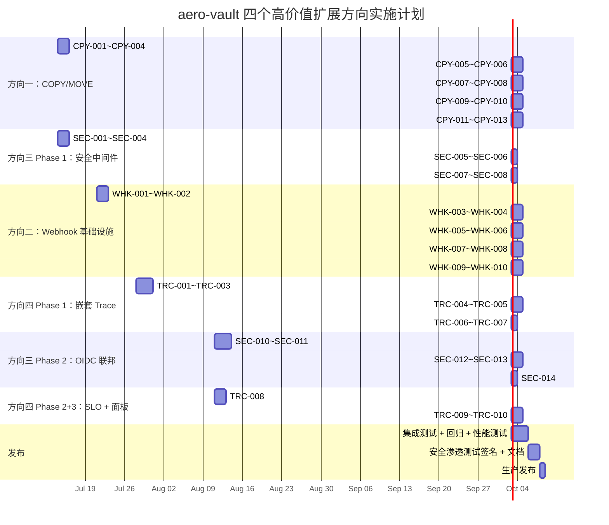

现在我已完整掌握代码库和需求文档。以下是完整的架构分析。

---

# Tech Lead 分析：四个高价值扩展方向

## 1. 任务分解

### 方向一：服务端 COPY/MOVE（P1 — 性能/架构）

| 任务 ID | 任务标题 | 涉及文件 | 前置依赖 | 工时 | 验收标准 |
|---------|---------|---------|---------|------|---------|
| CPY-001 | 扩展 `Storage` 接口：增加 `CanCopy()` / `Copy()` 方法 | `internal/storage/storage.go` | 无 | 2h | 接口定义通过编译；`CopyOptions` struct 包含 `MetadataDirective`/`TaggingDirective`/`Conditional`/`StorageClass` |
| CPY-002 | 本地后端实现 `Copy` 方法（同后端零拷贝 + 跨 key 文件复制） | `internal/storage/local.go`、`internal/storage/local_read.go` | CPY-001 | 4h | `localStore.Copy` 在 src==dst 时零 I/O 返回；不同 key 时 `os.CopyFS`(或硬链接策略)；通过 contract test |
| CPY-003 | S3 后端实现 `Copy` 方法（调用 S3 CopyObject API） | `internal/storage/s3.go` | CPY-001 | 4h | 调用 `s3client.CopyObjectWithContext`；支持 `x-amz-copy-source-if-match` 条件；保留元数据标签 |
| CPY-004 | OSS/COS 后端实现 `Copy` 方法 | `internal/storage/oss.go`、`internal/storage/cos.go` | CPY-001 | 3h | 调用云厂商 Copy API；返回 `ObjectInfo`；通过 contract test |
| CPY-005 | 实现 `CopyStrategy` 策略选择器 | `internal/service/copy.go`（新建） | CPY-001 | 3h | 策略选择逻辑：同一后端 → ServerSide / 跨后端 → ClientStream / >5GB → Chunked；可单元测试 |
| CPY-006 | 实现 ClientStream 回退策略（当前 Get→Put 模式但加流控） | `internal/service/copy.go` | CPY-005 | 4h | 复用现有 Get→Put 路径；加入 `io.LimitReader` 流控（`COPY_STREAM_BUFFER_SIZE`）；复制成功并校验 ETag |
| CPY-007 | 实现 Chunked Copy（基于已有 multipart 基础设施） | `internal/service/copy.go` | CPY-005、CPY-006 | 4h | 对象 >5GB 时自动分片；`CopyObjectPart` → `UploadPartCopy` → `CompleteMultipart`；支持续传 |
| CPY-008 | 重构 s3compat `copyObject` handler 使用 CopyStrategy | `internal/api/s3compat/extra.go` | CPY-005 | 2h | `copyObject` 调用 `svc.Copy` 而非 Get→Put；向后兼容所有现有测试 |
| CPY-009 | 实现服务层 `FileService.Copy` / `FileService.Move` | `internal/service/file_crud.go`、`internal/service/file.go` | CPY-005 | 4h | `Move` = Copy + Delete；Copy 支持 `x-amz-metadata-directive`/`x-amz-tagging-directive`；返回新 Object 元数据 |
| CPY-010 | 实现原子 MOVE 框架（源标记 + job + 后台 blob 移动 + 清除） | `internal/service/file_crud.go`、`internal/repository/sql_objects.go` | CPY-009 | 4h | Phase 1：INSERT 目标行 + UPDATE 源 `moved_to`；Phase 2：job 队列入队 blob 移动；Phase 3：reconcile 清除源行；**显式说明**：原子 MOVE 分 3 阶段达成，非单节点事务 |
| CPY-011 | 重构 WebDAV `rename` 和 REST rename 使用统一 Move 路径 | `internal/api/webdav/dav.go`、`internal/api/rest/handler.go` | CPY-009 | 2h | WebDAV MOVE 调用 `svc.Move`；REST rename 调用 `svc.Move`；现有测试通过 |
| CPY-012 | 大对象 COPY 进度追踪（Job 记录已完成字节数 + admin API 查询） | `internal/service/copy.go`、`internal/api/rest/admin.go` | CPY-010 | 3h | Job `result` 字段记录已完成 bytes；`GET /v1/admin/copy-jobs/{id}` 返回进度 |
| CPY-013 | COPY 边界条件处理（自复制跳过、版本化桶行为、锁定检查） | `internal/service/file_crud.go` | CPY-009 | 3h | 自复制返回 200 但不操作；版本化桶 COPY 产生新版本；锁定桶符合 `checkLockBeforeOverwrite` |

**小计：方向一 ~42 小时（约 5.5 个工程师·天）**

### 方向二：Webhook 交付基础设施成熟度（P1 — 可靠性/合规）

| 任务 ID | 任务标题 | 涉及文件 | 前置依赖 | 工时 | 验收标准 |
|---------|---------|---------|---------|------|---------|
| WHK-001 | `webhook_failures` 表 schema 迁移：新增 `status`/`max_attempts`/`delivered_at` 字段 | `migrations/sqlite/NNNN_webhook_status.*.sql`、`migrations/postgres/NNNN_webhook_status.*.sql` | 无 | 2h | 迁移文件成对（up+down）；`status` ∈ `'retrying'`/`'dead_letter'`/`'delivered'`；`NextPendingFailures` 只选 `status='retrying'` |
| WHK-002 | 重构 `WebhookFailure` model + Repository 方法 | `internal/repository/webhook_failures.go`、`internal/repository/repository.go` | WHK-001 | 3h | `MarkWebhookSucceeded` → `UpdateWebhookStatus(id, status)`；新增 `RetryDeadLetter(id)` 将死信重新置为 `retrying`；新增 `DiscardWebhookFailure(id)` |
| WHK-003 | 修改 retry 循环：超限后进入 dead_letter 而非标记成功 | `internal/events/webhook.go` | WHK-002 | 2h | `retryOne` 在 attempts>=max 后 `UpdateWebhookStatus(id, "dead_letter")`；不再调用 `MarkWebhookSucceeded` |
| WHK-004 | 拆分配置为多路由模式（WebhookRoute 结构体 + 过滤规则 + 向后兼容） | `internal/events/webhook.go`、`internal/events/config.go`（新建） | 无 | 4h | 支持 `EVENTS_WEBHOOK_URLS` 逗号分隔多 URL 且兼容旧单 URL；`WebhookFilter` 按 `event_type`/`tenant`/`bucket`/`prefix` 过滤 |
| WHK-005 | 实现 per-URL 外发速率限制（token bucket） | `internal/events/ratelimit.go`（新建） | WHK-004 | 3h | `WebhookRateLimiter` 每个 URL 独立令牌桶；`postOne` 前 `rateLimiter.Wait(ctx)`；支持 429 + Retry-After 自适应降速 |
| WHK-006 | 实现双密钥轮换机制（Active/Previous 模式） | `internal/events/webhook.go` | 无 | 2h | `WebhookSecret{Active, Previous}`；新事件用 Active 签名；Previous 用于过渡期验证；支持 `POST /admin/webhook/secrets/rotate` |
| WHK-007 | WEBHOOK 新增 5 组 OTel 指标（交付计数/延迟/队列深度/死信/密钥轮换） | `internal/telemetry/metrics.go` | 无 | 2h | `webhook_delivery_total`、`webhook_delivery_latency_ms`、`webhook_retry_queue_depth`、`webhook_dead_letter_total`、`webhook_secret_rotation_count` 均暴露到 `/metrics` |
| WHK-008 | admin API：死信管理端点（查询/重试/丢弃） | `internal/api/rest/admin.go`、`internal/api/rest/router.go` | WHK-002 | 3h | `GET /v1/admin/webhook-failures?status=dead_letter`、`POST /v1/admin/webhook-failures/{id}/retry`、`POST /v1/admin/webhook-failures/{id}/discard` |
| WHK-009 | Grafana Webhook 交付面板（新面板或扩展现有面板） | `deploy/grafana/aero-vault-ai-ops-dashboard.json` | WHK-007 | 3h | 面板展示：交付率时间序列、延迟 p50/p95/p99、错误分布（按 URL/status_code）、队列深度 |
| WHK-010 | 事件去重窗口（相同 payload + event_type 在 TTL 内不重复投递） | `internal/events/webhook.go` | 无 | 3h | 内存 LRU 缓存或 DB 表记录最近 N 分钟已投递事件；配置项 `EVENTS_DEDUP_WINDOW_SECONDS`（默认 300s） |

**小计：方向二 ~27 小时（约 3.5 个工程师·天）**

### 方向三：跨协议安全架构 Phase 1（P1 — 安全/架构）

| 任务 ID | 任务标题 | 涉及文件 | 前置依赖 | 工时 | 验收标准 |
|---------|---------|---------|---------|------|---------|
| SEC-001 | 实现 `MaxBodySize` 中间件（端点级可配置） | `internal/middleware/bodylimit.go`（新建） | 无 | 2h | 中间件接受 `maxBytes` 参数；超限返回 `413 Payload Too Large`；支持 route-level override（通过 context annotation） |
| SEC-002 | 实现 `SecureHeaders` 中间件（CSP/XFO/XCTO/RP） | `internal/middleware/secure.go`（新建） | 无 | 2h | 自动设置 `X-Content-Type-Options: nosniff`、`X-Frame-Options: DENY`、`X-XSS-Protection: 1; mode=block`、`Referrer-Policy: strict-origin-when-cross-origin`、`Content-Security-Policy: default-src 'self'`；不影响 Web UI 的 inline script |
| SEC-003 | 实现 `safeXMLDecoder` 封装 + 所有 XML endpoint 接入 | `internal/middleware/xml.go`（新建）、`internal/api/s3compat/handler.go` | 无 | 3h | 封装 `xml.NewDecoder(io.LimitReader(r, maxBytes))` + `decoder.Strict=true`；替换全部 8 个 `xml.NewDecoder(r.Body).Decode(&in)`（PutObject、DeleteObjects、PutBucketLifecycle、PutBucketPolicy 等） |
| SEC-004 | 实现 `EnforceContentType` 中间件（按路由组配置） | `internal/middleware/contenttype.go`（新建） | 无 | 2h | REST `/v1/` 组校验 `Content-Type`；S3 `/s3/` 组豁免（S3 协议接受任意 Content-Type）；健康检查端点豁免 |
| SEC-005 | 将新中间件织入 `applyMiddleware` 链 | `cmd/server/main.go`、`internal/middleware/middleware.go` | SEC-001、SEC-002、SEC-004 | 2h | 中间件顺序：`RequestID→CORS→MaxBodySize→SecureHeaders→Auth→Tenant→EnforceContentType→RateLimit→OTel→Recoverer→AccessLog`；不影响现有 handler 测试（与 tenant/auth 无关） |
| SEC-006 | 实现 `CORSPreflightMethodGuard`（只允许 OPTIONS + 已声明 Methods） | `internal/middleware/cors.go` | 无 | 2h | 在现有 CORS 基础上；拒绝 OPTIONS 以外的未声明 HTTP method；返回 `405 Method Not Allowed` |
| SEC-007 | 添加安全 headers 测试套件 + 渗透测试 checklist | `internal/middleware/secure_test.go`、`internal/middleware/bodylimit_test.go` | SEC-001~SEC-006 | 3h | 测试：body 超限 413；安全 headers 存在；XML entity bomb 拒绝（尝试 XXE）；Content-Type 不匹配返回 415 |
| SEC-008 | 渗透测试文档 + 配置安全检查清单 | `docs/security/penetration-testing-guide.md`（新建） | SEC-007 | 2h | 文档覆盖：攻击面清单、已验证的安全配置、测试方法、已知限制 |

**小计：方向三 Phase 1 ~18 小时（约 2.5 个工程师·天）**

### 方向三：跨协议安全架构 Phase 2（OIDC 联邦 — P1 但后置）

| 任务 ID | 任务标题 | 涉及文件 | 前置依赖 | 工时 | 验收标准 |
|---------|---------|---------|---------|------|---------|
| SEC-010 | 定义 `IdentityProvider` 接口 + `Identity` 结构体 | `internal/auth/identity.go`（新建） | 无 | 2h | `IdentityProvider.Authenticate(ctx, credentials) (Identity, error)`；`Identity` 含 `Subject`/`Issuer`/`TenantID`/`Scopes`/`Attributes`/`ExpiresAt` |
| SEC-011 | 实现 `OIDCProvider`（验证 RS256/ES256 JWT + issuer/audience 校验 + tenant 映射） | `internal/auth/oidc.go`（新建） | SEC-010 | 6h | 使用 stdlib `crypto/ecdsa`/`crypto/rsa`（或 `github.com/coreos/go-oidc/v3`）；验证 `iss`/`aud`/`exp`/`sub`；`sub → tenant` 映射（从配置或 JWT claim）；禁止 `alg=HS256` 的 OIDC token |
| SEC-012 | JWT 中间件升级：支持 RS256 签名验证 + `alg` 分叉逻辑 | `internal/auth/jwt.go` | SEC-011 | 3h | 检测 JWT `alg` 头：`HS256` → 对称验证（管理员自签发）；`RS256`/`ES256` → OIDProvider 公钥验证；添加 OIDC `iss` 校验防止跨 IdP 重用 |
| SEC-013 | 身份联邦集成到 Auth Registry（迭代尝试 + WWW-Authenticate 头） | `internal/auth/auth.go` | SEC-011 | 3h | `Registry` 持有 `[]IdentityProvider`；认证时先尝试本地 JWT/Key，再遍历 IdP；`WWW-Authenticate: Bearer realm="aero-vault", idp="keycloak"` |
| SEC-014 | OIDC 配置项 + 启动集成 + 集成测试 | `cmd/server/main.go`、`config/config.go` | SEC-013 | 4h | 配置项 `AUTH_OIDC_ISSUER`/`AUTH_OIDC_CLIENT_ID`/`AUTH_OIDC_TENANT_CLAIM`；启动时初始化 `OIDCProvider`；集成测试验证 RS256 JWT 认证成功、HS256 被拒绝 |

**小计：方向三 Phase 2 ~18 小时（约 2.5 个工程师·天）**

### 方向四：分布式追踪与可观测性成熟度（P2）

| 任务 ID | 任务标题 | 涉及文件 | 前置依赖 | 工时 | 验收标准 |
|---------|---------|---------|---------|------|---------|
| TRC-001 | Service 层嵌套 span：`FileService.Get`/`Put`/`Delete`/`Copy` 创建子 span | `internal/service/file_crud.go`、`internal/service/copy.go` | 无 | 3h | 每个服务方法 `tracer.Start(ctx, "FileService.Get")`；attribute 含 `tenant`/`bucket`/`key`（key 摘要化防止高基数）；不传播时也是空操作 |
| TRC-002 | Storage 层嵌套 span：local/S3/OSS/COS 的 Get/Put/Copy/Delete | `internal/storage/local_read.go`、`internal/storage/local_write.go`、`internal/storage/s3.go` 等 | TRC-001 | 4h | 每个 storage 方法 `tracer.Start(ctx, "local.Get")`；attribute 含 `key`(摘要化) 和 `size` |
| TRC-003 | Repository 层嵌套 span：所有 SQL Repository 方法 | `internal/repository/sql_objects.go`、`internal/repository/sql_buckets.go` 等 | TRC-001 | 3h | 关键方法（GetObject/ListObjects/PutObject）创建 span；attribute 含 `method_name` 和 `table` |
| TRC-004 | 结构化日志 trace_id/span_id 关联 | `internal/middleware/middleware.go`、`internal/telemetry/http.go` | 无 | 2h | `RequestID` middleware 将 `trace_id`/`span_id` 混入 `slog` 的 context logger；日志行输出 `trace_id=xxx span_id=yyy` |
| TRC-005 | 端点级概率采样策略（head-based sampling） | `internal/telemetry/sampler.go`（新建） | 无 | 3h | 见文档采样表：GET/HEAD 1%、PUT/DELETE 10%、Search/Chat 100%、Admin 100%、Healthz 0%；通过 context sampled flag 传递 |
| TRC-006 | MCP stdio 模式 trace context 传递（JSON-RPC params 传递 `traceparent`） | `internal/mcp/server.go` | 无 | 2h | stdio 模式从 JSON-RPC `params.traceparent` 提取 trace context；自动注入到 `ctx` |
| TRC-007 | W3C Trace Context 传播到所有出站 HTTP 请求（webhook + replication + AI） | `internal/events/webhook.go`、`internal/replication/replication.go`、`internal/ai/client.go` | 无 | 2h | 出站 HTTP 请求自动注入 `traceparent` header；使用 `otelhttp` transport 或手动注入 |
| TRC-008 | SLO 配置框架 + multi-window burn-rate 告警规则（2 条 SLO + 6 条告警规则） | `deploy/prometheus/alerts.yml`、`internal/telemetry/slo.go`（新建可选，纯 Prometheus 规则） | 无 | 4h | 定义 `api_latency`（目标 99.9%, 500ms, 30d）和 `search_latency`（目标 99.0%, 3000ms, 30d）；每个 SLO 产生 3 条 burn-rate 告警（快/慢/总量消耗率） |
| TRC-009 | Grafana Trace 面板（Trace 查询 + span 延迟分解） | `deploy/grafana/aero-vault-ai-ops-dashboard.json` | TRC-001~TRC-003 | 3h | 添加 2 个 Trace 面板：跨协议请求 trace 关联、组件级延迟分解（HTTP→Service→Storage→Repository） |
| TRC-010 | Trace 集成测试：验证 span 传播从 HTTP → Service → Storage 完整链 | `internal/telemetry/trace_test.go`（新建） | TRC-001~TRC-003 | 3h | 使用 `httptest` 发送请求；通过 `oteltest` 或内存 exporter 验证 span 树结构、attribute 传递、span 结束顺序正确 |

**小计：方向四 ~29 小时（约 3.5 个工程师·天）**

---

### 任务汇总

| 方向 | 任务数 | 总工时 | 建议工程师 | 日历天（并行） |
|------|--------|--------|-----------|--------------|
| 方向一：COPY/MOVE | 13 | 42h | 1 | 6-7 |
| 方向二：Webhook | 10 | 27h | 1 | 4-5 |
| 方向三 Phase 1：安全中间件 | 4+4 | 18h | 1 | 3 |
| 方向三 Phase 2：OIDC | 5 | 18h | 1 | 3 |
| 方向四：Tracing+SLO | 10 | 29h | 1 | 4-5 |
| **总计** | **42** | **134h** | **2并行** | **~6 周** |

---

## 2. 执行顺序与依赖图

```mermaid
graph TD
    subgraph "Phase 1（并行启动）"
        SEC_001["SEC-001: MaxBodySize MW"]
        SEC_002["SEC-002: SecureHeaders MW"]
        SEC_003["SEC-003: SafeXMLDecoder"]
        SEC_004["SEC-004: EnforceContentType MW"]
        SEC_005["SEC-005: 注入中间件链"]
        SEC_006["SEC-006: CORS MethodGuard"]
        SEC_007["SEC-007: 安全测试套件"]
        SEC_008["SEC-008: 渗透测试文档"]

        CPY_001["CPY-001: Storage.Copy 接口"]
        CPY_002["CPY-002: Local Copy 实现"]
        CPY_003["CPY-003: S3 Copy 实现"]
        CPY_004["CPY-004: OSS/COS Copy"]
        CPY_005["CPY-005: CopyStrategy 选择器"]
        CPY_006["CPY-006: ClientStream 回退"]
        CPY_007["CPY-007: Chunked Copy"]
    end

    subgraph "Phase 1 安全中继"
        SEC_001 --> SEC_005
        SEC_002 --> SEC_005
        SEC_004 --> SEC_005
        SEC_005 --> SEC_007
        SEC_006 --> SEC_005
        SEC_007 --> SEC_008
        SEC_003 -.->|独立并行| SEC_007
    end

    subgraph "Phase 1 COPY/MOVE 核心"
        CPY_001 --> CPY_002
        CPY_001 --> CPY_003
        CPY_001 --> CPY_004
        CPY_002 --> CPY_005
        CPY_003 --> CPY_005
        CPY_004 --> CPY_005
        CPY_005 --> CPY_006
        CPY_005 --> CPY_007
        CPY_005 --> CPY_008
        CPY_005 --> CPY_009
    end

    subgraph "Phase 2（方向二 + 方向一尾 + 方向四头）"
        WHK_001["WHK-001: DB 迁移 + status"]
        WHK_002["WHK-002: WebhookFailure 重构"]
        WHK_003["WHK-003: 死信状态转换"]
        WHK_004["WHK-004: 多路由模式"]
        WHK_005["WHK-005: per-URL 速率限制"]
        WHK_006["WHK-006: 密钥轮换"]
        WHK_007["WHK-007: Webhook OTel 指标"]
        WHK_008["WHK-008: admin 死信 API"]
        WHK_009["WHK-009: Grafana Webhook 面板"]
        WHK_010["WHK-010: 事件去重窗口"]

        CPY_010["CPY-010: 原子 MOVE"]
        CPY_011["CPY-011: WebDAV/REST rename 统一"]
        CPY_012["CPY-012: COPY 进度追踪"]
        CPY_013["CPY-013: COPY 边界条件"]

        TRC_001["TRC-001: Service 层 span"]
        TRC_002["TRC-002: Storage 层 span"]
        TRC_003["TRC-003: Repository 层 span"]
        TRC_004["TRC-004: 日志 trace_id 关联"]
        TRC_005["TRC-005: 概率采样"]
        TRC_006["TRC-006: MCP trace 传递"]
        TRC_007["TRC-007: 出站 trace 传播"]
    end

    subgraph "Phase 3（方向三 Phase 2 + 方向四尾）"
        SEC_010["SEC-010: IdentityProvider 接口"]
        SEC_011["SEC-011: OIDCProvider 实现"]
        SEC_012["SEC-012: JWT RS256 支持"]
        SEC_013["SEC-013: Auth Registry 集成"]
        SEC_014["SEC-014: OIDC 配置 + 集成测试"]

        TRC_008["TRC-008: SLO 告警规则"]
        TRC_009["TRC-009: Grafana Trace 面板"]
        TRC_010["TRC-010: Trace 集成测试"]
    end

    %% 安全 Phase1 → Phase2
    SEC_007 -.->|后置| SEC_011
    SEC_005 -.->|后置| SEC_013

    %% COPY → 原子 MOVE
    CPY_009 --> CPY_010
    CPY_010 --> CPY_011
    CPY_009 --> CPY_012
    CPY_009 --> CPY_013

    %% Webhook 依赖
    WHK_001 --> WHK_002
    WHK_002 --> WHK_003
    WHK_002 --> WHK_008
    WHK_004 --> WHK_005
    WHK_007 --> WHK_009
    WHK_003 --> WHK_010

    %% Tracing 依赖
    TRC_001 --> TRC_002
    TRC_001 --> TRC_003
    TRC_002 --> TRC_010
    TRC_003 --> TRC_010
    TRC_005 --> TRC_010
    TRC_006 --> TRC_010

    %% SLO 依赖
    TRC_004 --> TRC_008
    TRC_001 --> TRC_009
    TRC_002 --> TRC_009

    %% Phase 2 → 3
    SEC_010 --> SEC_011
    SEC_011 --> SEC_012
    SEC_012 --> SEC_013
    SEC_013 --> SEC_014

    TRC_010 --> TRC_008
    TRC_008 --> TRC_009
```

### 可并行执行的任务组

| 并行组 | 任务 | 建议分配 |
|--------|------|---------|
| **组 A**（安全 Phase 1） | SEC-001~SEC-008 | 工程师甲 |
| **组 B**（COPY/MOVE 核心） | CPY-001~CPY-008 | 工程师乙 |
| **组 C**（Webhook DB + 多路由 + 指标） | WHK-001~WHK-010 | 工程师甲（Phase 1 完成后） |
| **组 D**（COPY 尾 + 原子 MOVE） | CPY-009~CPY-013 | 工程师乙（Phase 1 完成后） |
| **组 E**（Trace Phase 1） | TRC-001~TRC-007 | 工程师丙（Phase 1 进入） |
| **组 F**（OIDC 联邦） | SEC-010~SEC-014 | 工程师甲（Phase 2） |
| **组 G**（SLO + Trace 面板） | TRC-008~TRC-010 | 工程师丙（Phase 3） |

---

## 3. 技术风险

### 风险矩阵

| # | 风险 | 方向 | 可能性 | 影响 | 缓解策略 |
|---|------|------|--------|------|---------|
| R1 | **S3 CopyObject API 的 conditional 语义差异** | 方向一 | **中** | **高** | AWS S3 的 `x-amz-copy-source-if-match` 返回 `412 Precondition Failed`；但 OSS/COS 的 conditional headers 实现可能不同。缓解：对每个云厂商后端独立测试 conditional bypass；在 `CopyStrategy` 层增加 `fallback to Get→Put` 条件检测->降级路径 |
| R2 | **大对象分段 COPY 的 OOM 风险** | 方向一 | **低** | **高** | 5GB+ 对象分段时如果用 `io.ReadAll` 读取 part 会内存爆炸。缓解：所有分段读取必须使用 `io.LimitReader` + 固定 `COPY_PART_SIZE=64MiB`；在 review 中禁止 `ioutil.ReadAll` 类调用 |
| R3 | **原子 MOVE 的中间状态数据不可用窗口** | 方向一 | **中** | **中** | Phase 1 写入目标行后、Phase 2 blob 移动完成前，目标 blob 不可读。缓解：支持**同步 MOVE**（对小文件直接 Copy+Delete，无后台）和**异步 MOVE**（大文件通过 job）；明确文档说明 MOVE 的一致性语义 |
| R4 | **多路由 Webhook 的配置复杂度爆炸** | 方向二 | **中** | **低** | 多 URL + 多 Filter + 多 RateLimit 组合可能产生难以调试的配置。缓解：提供 `GET /v1/admin/webhook/routes` 配置验证 API + 配置冲突检测（URL 重叠时合并规则但警告）；配置文档写清楚优先级 |
| R5 | **Dead Letter 队列的存储增长** | 方向二 | **中** | **中** | 死信事件会无限积累在 `webhook_failures` 表。缓解：默认死信 TTL（如 7 天）；reconcile job 自动清理过期死信；admin API 提供批量 discard |
| R6 | **OIDC provider 可用性单点故障** | 方向三 P2 | **中** | **高** | OIDC 认证依赖外部 IdP。如果 IdP 不可用，所有用户无法登录。缓解：支持 `AUTH_OIDC_FAIL_OPEN=false` 严格模式（IdP 不可用→拒绝所有）和宽松模式（降级到 API key 认证）；本地缓存 IdP 公钥（`jwks_uri`，TTL 1h） |
| R7 | **HS256 → RS256 过渡期的签名兼容性** | 方向三 P2 | **低** | **高** | 管理员现有 JWT 签发使用 HS256，升级后可能不兼容。缓解：双算法共存期（`AUTH_JWT_ALG=auto`）；过期 token 升级策略文档；JWT `kid` header 标识密钥 |
| R8 | **嵌套 span 的延迟开销** | 方向四 | **低** | **低** | 每个 span 有内存分配 + OTel exporter 调用。缓解：head-based sampling 保证 99% 的请求不产生 span；使用毫秒级采样？实际上 OTel span 开销微秒级。监控 `otel_span_export_duration` |
| R9 | **SLO burn-rate 告警的配置维护** | 方向四 | **中** | **中** | burn-rate 告警的阈值（1h/5m/消耗率%）需要调优，误报可能导致告警疲劳。缓解：初始配置宽松（消耗率 > 50% 才 page）；上线后 2 周调优阈值；告警规则文档说明计算逻辑 |
| R10 | **Span attribute 高基数导致 Prometheus/Otel Collector OOM** | 方向四 | **高** | **高** | 如果 span attribute 包含完整对象 key（`/user/1234/images/photo.jpg`），基数爆炸。缓解：key 路径摘要化（`bucket/{prefix}/{object}`）；attribute 只含 `bucket` + `storage_class` + `operation`；在 CI gate 中用 `otel-check` 验证 |

### 外部依赖

| 依赖 | 方向 | 用途 | 替代方案 | 风险评估 |
|------|------|------|---------|---------|
| 无新外部依赖 | 方向一 | Local/S3/OSS/COS Copy API 均在现有 SDK 内 | — | 无风险 |
| 无新外部依赖 | 方向二 | Webhook 纯 HTTP + DB | — | 无风险 |
| `github.com/coreos/go-oidc/v3` | 方向三 P2 | OIDC token 验证 | 纯手工验证 (stdlib `crypto/rsa`) | **低风险** — go-oidc 是成熟库；手工验证可做备选 |
| OTel SDK (已存在) | 方向四 | 嵌套 span / sampler | — | 已在 go.mod 中 |
| Grafana Tempo / Jaeger (可选) | 方向四 | Trace 存储和查询 | OTel Collector 标准输出 | **外部可选** — trace 数据可先写到 stdout 调试 |

### 性能瓶颈与优化策略

| 场景 | 瓶颈点 | 优化策略 | 优先级 |
|------|--------|---------|--------|
| 同 bucket 1GB COPY | 全量 Get→Put（当前） | ServerSide Copy 零数据移动 | **P0** — CPY-002/CPY-003 直接解决 |
| 跨后端 COPY | 路线长、带宽占用 | ClientStream 流控 + 零拷贝（sendfile 在 local→local 场景） | **P1** |
| Webhook 事件风暴 | goroutine 泄漏 / 连接池占用 | per-URL token bucket + 有界 semaphore | **P1** |
| XML 大 payload | 内存溢出 | `io.LimitReader` + 1MB 上限 | **P0** — SEC-003 |
| 全量 OTel span 导出 | 网络/存储开销 | 概率采样（1-100%） | **P1** |

---

## 4. 资源评估

### 人员配置

| 角色 | 技能要求 | 数量 | 职责 |
|------|---------|------|------|
| **基础设施工程师**（工程师甲） | Go 中间件、安全最佳实践、OIDC/OAuth2 协议、Prometheus 告警配置 | 1 | 方向三 Phase 1+2（安全架构 + OIDC）、方向二 Webhook |
| **分布式系统工程师**（工程师乙） | Go 存储层、S3 API 协议、分布式一致性模型、云厂商 SDK | 1 | 方向一（COPY/MOVE + 原子 MOVE） |
| **可观测性工程师**（工程师丙） | OpenTelemetry tracing、Go context 传播、SRE SLO/SLI 方法论、Grafana | 0.5 | **兼职切入 Phase 2**，与工程师甲/乙重叠：方向四（Tracing + SLO 告警） |

**推荐方案：2 名全职工程师（甲+乙）+ 1 名 50% 兼职（丙，约 2 周全职等效）**

### 关键里程碑

| 里程碑 | 时间节点（从启动日） | 交付物 |
|--------|-------------------|--------|
| **M1：安全中间件上线** | T + 2 周 | MaxBodySize + SecureHeaders + SafeXMLDecoder + ContentType MW 在生产环境运行；渗透测试文档完成 |
| **M2：ServerSide Copy 交付** | T + 3 周 | Local/S3/OSS/COS 后端均支持 `Copy`；s3compat handler 使用 CopyStrategy；同后端 COPY 零数据移动 |
| **M3：Webhook 死信队列上线** | T + 4 周 | Dead letter 永不丢失；admin API 可查询/重试/丢弃死信；Grafana webhook 面板可用 |
| **M4：嵌套 span + 日志关联** | T + 5 周 | Service/Storage/Repository 三层嵌套 span；日志行包含 trace_id；概率采样生效 |
| **M5：原子 MOVE 交付** | T + 6 周 | REST rename + WebDAV MOVE + S3 MOVE 全部走统一 Move 路径；小文件同步，大文件异步 + 进度追踪 |
| **M6：OIDC 联邦 + SLO 告警** | T + 9 周 | OIDC 登录可用（与 Keycloak/Okta 集成测试通过）；SLO burn-rate 告警在生产环境运行 |
| **M7：完整发布** | T + 10 周 | 全部 4 个方向 + 安全渗透测试签名 + 性能回归测试通过 |

### 阻塞点与解决策略

| 阻塞点 | 影响方向 | 描述 | 解决策略 |
|--------|---------|------|---------|
| B1: S3/OSS/COS 云厂商 Copy API 差异 | 方向一 | OSS CopyObject 不支持 `TaggingDirective`；COS 不支持 `MetadataDirective=REPLACE` 同时保留 | 在 `CopyStrategy` 实现层做厂商适配：按 `BackendKind` 生成不同 API 参数；文档记录已知限制 |
| B2: OIDC Provider 无法从 CI 环境访问 | 方向三 P2 | CI gate (零网络) 无法做 OIDC 集成测试 | OIDC 集成测试标记 `//go:build integration` 且跳过 CI gate；CI 中用 mock `OIDCProvider{AllowAll: true}` 覆盖单元测试 |
| B3: Grafana Tempo 未部署 | 方向四 | Trace 数据需要 OTel Collector + trace 存储后端才能可视化 | Phase 1 不依赖 Tempo——span 数据仅用于指标聚合（span metrics）；`make check` 用 `go test` 验证 span 上下文传播（`oteltest` 内存 exporter） |

---

## 5. 质量保证

### 5.1 单元测试覆盖要求

| 方向 | 包 | 必须覆盖的文件 | 目标覆盖率 | 关键测试用例 |
|------|----|--------------|-----------|------------|
| 方向一 | `internal/storage` | `local.go`, `s3.go` | ≥ 80% | Copy 同 key 零 I/O、不同 key 完整复制、src 不存在 return ErrNotFound、条件请求 (If-Match) 阻断、5GB+ 自动进入 Chunked 分支 |
| 方向一 | `internal/service` | `copy.go`, `file_crud.go` | ≥ 80% | CopyStrategy 选择逻辑全部 3 种路径、自复制跳过、版本化桶 COPY 产生新版本、Move 的 Copy+Delete 序列、原子 MOVE Phase 1 后目标行可见但 blob 不可读 |
| 方向二 | `internal/events` | `webhook.go` | ≥ 80% | dead_letter 状态转换（10 次后 dead_letter 而非 succeeded）、per-URL rate limit 限流、双密钥轮换签名验证、去重窗口内重复事件被跳过 |
| 方向二 | `internal/repository` | `webhook_failures.go` | ≥ 80% | `NextPendingFailures` 只选 `status='retrying'`、死信重试后 status 变回 `retrying`、TTL 后自动清理 |
| 方向三 | `internal/middleware` | `bodylimit.go`, `secure.go`, `xml.go`, `contenttype.go`, `cors.go` | ≥ 90% | Body 超限 413、XML entity bomb 拒绝改返回 400、Content-Type 不匹配返回 415、安全 headers 全部存在、OPTIONS 外 method 返回 405 |
| 方向三 | `internal/auth` | `identity.go`, `oidc.go`, `jwt.go` | ≥ 80% | OIDC RS256 JWT 认证成功、HS256 JWT 被 OIDC 路径拒绝、iss claim 不匹配拒绝、JWKS key 轮换兼容、IdP 不可用时 fail_closed 返回 500 |
| 方向四 | `internal/service` | span propagation | ≥ 70% | 子 span 创建且 parent span ID 正确、attribute 传递完整、不泄漏 ctx 中的 span 异常 |
| 方向四 | `internal/telemetry` | `sampler.go` | ≥ 80% | 各类端点按采样率返回 sampled/dropped、sampled flag 跨 context 传递 |

### 5.2 集成测试策略

| 测试场景 | 方式 | 环境要求 | CI 执行 |
|---------|------|---------|---------|
| **协议级 COPY** | S3 sigV4 PUT + `x-amz-copy-source` → 验证 ETag 匹配 | SQLite + local FS | ✅ `go test ./internal/api/s3compat/...` |
| **跨后端 COPY** | S3 bucket → local bucket | SQLite + 双 local store (不同 root) | ✅ `go test ./internal/service/... -run TestCopy` |
| **死信完整链路** | POST 事件 → webhook 失败 10 次 → 死信 → admin retry → 成功 | SQLite | ✅ `go test ./internal/events/... -run TestWebhookDeadLetter` |
| **安全中间件** | httptest → 413/415/405 验证 | 无 | ✅ `go test ./internal/middleware/...` |
| **OIDC JWT 验证** | 签发 RS256 JWT → REST 请求验证 | 无（本地密钥） | ✅ `go test ./internal/auth/... -run TestOIDCJWT`（在 CI gate 外标记 `integration` 如果需网络） |
| **Trace span 传播** | httptest 请求 → 内存 span exporter 验证树 | 无 | ✅ `go test ./internal/telemetry/... -run TestTracePropagation` |
| **SLO 告警规则验证** | `promtool test rules` | PromTool | ✅ `make check` 中增加 `promtool test rules deploy/prometheus/alerts.yml` |

### 5.3 代码审查要点

| 审查焦点 | 方向 | 具体要求 |
|---------|------|---------|
| **CopyStrategy 选择路径** | 方向一 | 所有 3 条路径都被测试覆盖；`MetadataDirective` 在 ServerSide Copy 中保留所有系统元数据；`CopyConditional` 空值时无条件（向后兼容） |
| **原子 MOVE 的失败恢复** | 方向一 | 如果 Phase 2 blob 移动失败，Phase 1 的目标 metadata 行必须标记 `moved_failed`；reconcile 需要能回滚 |
| **dead_letter 数据不丢失** | 方向二 | 状态转换必须满足：`retrying → dead_letter → retrying | delivered`；严禁任何路径从 `dead_letter` 回到 `retrying` 而不更新 `next_retry_at` |
| **per-URL 令牌桶初始化** | 方向二 | 启动时从配置初始化；URL 动态增减时 `buckets` map 需要写锁保护 |
| **XML 解析拒绝** | 方向三 P1 | 必须使用 `io.LimitReader` + `decoder.Strict`；验证 XXE 尝试返回 400 而非 500 |
| **HS256 与 RS256 共存安全** | 方向三 P2 | OIDC 路径禁止 `alg=HS256`；管理员 JWT 签发路径禁止 `alg=RS256`（无对应私钥）；`kid` header 交叉验证 |
| **Span attribute 基数控制** | 方向四 | Key 路径必须截断到 `bucket/{prefix}/{objectKey}` 级别或 `bucket` 级别；审查时必须检查无 `key=obj.Key` 原始赋值 |
| **SLO 告警 threshold 合理性** | 方向四 | 初始阈值宽松（消耗率 > 50% 才 page）；上线后调优；规则注释说明计算逻辑 |

### 5.4 性能测试需求

| 测试场景 | 测试工具 | 目标指标 | 通过标准 |
|---------|---------|---------|---------|
| 同 bucket 10GB COPY 延迟 | `internal/storage/benchmark_test.go` | 对比 CopyStrategy vs Get→Put | ServerSide Copy < 500ms；Get→Put < 对象大小/带宽 |
| 跨后端 1GB COPY 吞吐 | `internal/storage/benchmark_test.go` | 吞吐量 MB/s | 达到源后端读取带宽的 80% |
| 死信表 100 万行查询性能 | `go test -bench` | `NextPendingFailures` 查询延迟 | 不超过 100ms（百万行场景） |
| OIDC token 验证延迟 | `go test -bench` | 每次验证开销 | RS256 < 5ms（含 JWKS 缓存命中时） |
| OTel span 注入开销 | `go test -bench` | 每个 span 注入开销 | < 10µs（附加到已有耗时路径上） |
| 安全中间件全链开销 | `go test -bench` | 中间件链延迟增量 | < 100µs（对 p50 请求来说可忽略） |

---

## 6. 实施计划

### 甘特图

### 详细时间表

#### 阶段 1：基础设施搭建（第 1-2 周，4-5 个工作日）

**并行启动 — 工程师甲 + 工程师乙**

| 日 | 工程师甲（安全 Phase 1） | 工程师乙（COPY/MOVE Phase 1） |
|---|----------------------|----------------------------|
| **D1** | SEC-001: `MaxBodySize` 中间件 (2h) + SEC-002: `SecureHeaders` 中间件 (2h) | CPY-001: `Storage.Copy` 接口 + `CopyOptions` 定义 (2h) |
| **D2** | SEC-003: `safeXMLDecoder` 封装 + 替换 8 个 XML 调用点 (3h) | CPY-002: `localStore.Copy` 实现 + unit test (4h) |
| **D3** | SEC-004: `EnforceContentType` 中间件 (2h) + SEC-006: CORS MethodGuard (2h) | CPY-003: `S3Storage.Copy` 实现 (4h) |
| **D4** | SEC-005: 注入中间件链 + 检查所有路由组 (2h) | CPY-004: OSS/COS Copy (3h) + CPY-005: CopyStrategy 选择器 (3h) → 开始 CPY-006 |
| **D5** | SEC-007: 安全测试套件 (3h) + SEC-008: 渗透测试文档 (2h) | CPY-006: ClientStream 回退 (4h) + CPY-007: Chunked Copy (4h) |

**里程碑 M1：安全中间件上线（D5）** ✅

#### 阶段 2：核心功能实现（第 3-4 周，8-9 个工作日）

**工程师甲转方向二 Webhook，工程师乙完成 COPY/MOVE**

| 日 | 工程师甲（Webhook） | 工程师乙（COPY/MOVE 完成） |
|---|------------------|------------------------|
| **D6** | WHK-001: DB 迁移双文件 (2h) + WHK-002: `WebhookFailure` 重构 (3h) | CPY-008: s3compat handler 重构 (2h) + CPY-009: `FileService.Copy/Move` (4h) |
| **D7** | WHK-003: retry 循环死信改造 (2h) + WHK-004: 多路由模式 (4h) | CPY-010: 原子 MOVE 框架 (4h) |
| **D8** | WHK-005: per-URL 限流 (3h) + WHK-006: 密钥轮换 (2h) | CPY-011: WebDAV/REST rename 统一 (2h) + CPY-012: COPY 进度追踪 (3h) |
| **D9** | WHK-007: OTel 指标 (2h) + WHK-008: admin 死信 API (3h) | CPY-013: COPY 边界条件 (3h) |
| **D10** | WHK-009: Grafana 面板 (3h) + WHK-010: 去重窗口 (3h) | 方向一 PR 审查 + 修复 (4h) |

**里程碑 M2：ServerSide Copy 上线（D5~D6）** ✅  
**里程碑 M3：Webhook 死信队列上线（D10）** ✅

#### 阶段 2.5：工程师丙切入 Trace（第 5 周，3 个工作日）

**工程师丙（50%，与甲+乙重叠）**

| 日 | 工程师丙（Trace Phase 1） |
|---|------------------------|
| **D11** | TRC-001: Service 层 span (3h) + TRC-002: Storage 层 span (4h) |
| **D12** | TRC-003: Repository 层 span (3h) + TRC-004: 日志 trace_id 关联 (2h) |
| **D13** | TRC-005: 概率采样 (3h) + TRC-006: MCP trace 传递 (2h) + TRC-007: 出站传播 (2h) |

**里程碑 M4：嵌套 span + 日志关联（D13）** ✅

#### 阶段 3：集成测试和优化（第 6 周，5 个工作日）

**工程师甲 → 原子 MOVE 收尾 + 集成测试；工程师乙 → COPY/MOVE 性能测试**

| 日 | 所有人 |
|---|-------|
| **D14** | 原子 MOVE 集成测试修复 + 压力测试（小文件 1000 个并发 MOVE） |
| **D15** | Webhook 死信完整链路测试 + Webhook 事件风暴测试（1000 event/s） |
| **D16** | 安全中间件渗透测试（XXE、body 超限、方法覆盖） |
| **D17** | Trace 传播集成测试（`oteltest` 内存 exporter 验证 span 树） |
| **D18** | `make check` 全绿 + 性能回归测试（benchstat 对比） |

**里程碑 M5：原子 MOVE 交付（D15）** ✅

#### 阶段 3.5：OIDC + SLO（第 7-9 周，跨工程师）

**工程师甲转 OIDC，工程师乙辅助 + 工程师丙完成 SLO**

| 日 | 工程师甲（OIDC Phase 2） | 工程师丙（SLO + 面板） |
|---|------------------------|----------------------|
| **D19~21** | SEC-010~SEC-011: IdentityProvider 接口 + OIDCProvider (6h) | TRC-008: SLO burn-rate 告警规则设计 + 实现 (4h) |
| **D22~23** | SEC-012: JWT RS256 升级 (3h) + SEC-013: Auth Registry 集成 (3h) | TRC-009: Grafana Trace 面板 (3h) |
| **D24** | SEC-014: OIDC 配置 + 集成测试 (4h) | TRC-010: Trace 集成测试 (3h) |
| **D25** | OIDC 端到端测试（Keycloak 容器） | PromTool 规则验证 + 文档 |

**里程碑 M6：OIDC 联邦 + SLO 告警（D25）** ✅

#### 阶段 4：发布准备（第 10 周，5 个工作日）

| 日 | 活动 |
|---|------|
| **D26** | 全量回归测试：`go test ./...` + `make check` |
| **D27** | 性能基准测试：COPY 10GB 延迟、Webhook 吞吐、安全 MW 开销 |
| **D28** | 安全渗透测试签名（内部审查 + checklist 检查） |
| **D29** | 文档更新：CHANGELOG、OPERATOR.md（新配置项说明）、UPGRADE.md（DB 迁移） |
| **D30** | 生产发布 + 监控检查（Grafana 面板确认指标正常） |

**里程碑 M7：完整发布（D30）** ✅

---

## 总结：执行建议

### 优先执行顺序（按 ROI 排序）

1. **安全 Phase 1（SEC-001~SEC-008）** — 最高 ROI：纯中间件层新增，**零**业务逻辑变更，2 周内消除 3 个高危攻击面（XML OOM、无 body 限制、无安全头）。**建议立即启动**
2. **COPY/MOVE（CPY-001~CPY-013）** — 同期启动。同后端 ServerSide Copy 是**最明显的性能优化**，对 S3 用户来说是「秒级 vs 小时级」的体验差异
3. **Webhook 死信（WHK-001~WHK-010）** — 与 COPY 同期但用另一工程师。当前死信丢数据是**可靠性 bug**，修复后对运维可见、可审计
4. **Trace Phase 1（TRC-001~TRC-007）** — 时机在安全 MW 上线后。占用少，但 p0 是**修复 span 不传播的问题**（当前 HTTP span 几乎无用）
5. **OIDC（SEC-010~SEC-014）** — 面向企业付费场景的功能，有明确产品价值但实现复杂（需与 IdP 联调）
6. **SLO 告警（TRC-008~TRC-010）** — 价值高但依赖前几个阶段的指标和 span 基础，适合系统运行稳定后推行

### 关键成功要素

| 要素 | 说明 |
|------|------|
| **避免依赖膨胀** | 42 个任务中仅 OIDC 方向可能引入 `go-oidc` 依赖，其余全栈 stdlib + 已存在依赖 |
| **DB 迁移可逆** | WHK-001 提供 up+down 迁移文件；任何服务器不要求强制数据回滚 |
| **配置向后兼容** | 所有新增配置项（`EVENTS_WEBHOOK_URLS`、`AUTH_OIDC_*`、`COPY_STREAM_BUFFER_SIZE`）默认为零值=旧行为 |
| **性能风险可控** | CopyStrategy 在 ServerSide 路径下零网络消耗；安全 MW 每条请求增加 < 50µs；span 注入通过采样控制 |
